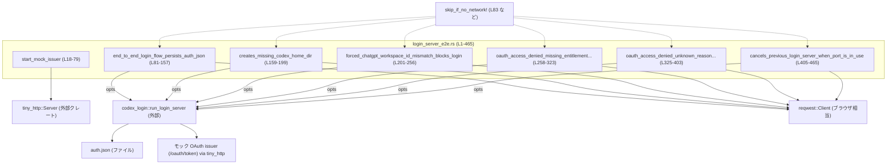
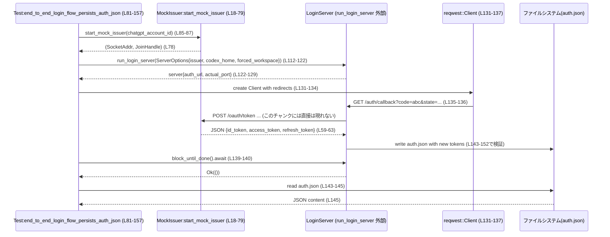

# login/tests/suite/login_server_e2e.rs コード解説

## 0. ざっくり一言

`codex_login` の OAuth ログインサーバーについて、実際に HTTP サーバーを起動し、モックの OAuth issuer と通信しながら、`auth.json` の永続化や各種エラーケースを **エンドツーエンドで検証するテストモジュール**です（根拠: `login/tests/suite/login_server_e2e.rs:L81-465`）。

---

## 1. このモジュールの役割

### 1.1 概要

- このモジュールは **Codex CLI のログインフロー**が仕様どおりに動作するかを確認する E2E（End-to-End）テストを提供します。
- ローカルでモックの OAuth issuer（`start_mock_issuer`）を立ち上げ、`run_login_server` でログインサーバーを起動し、HTTP クライアント（`reqwest`）でブラウザ挙動をシミュレートします（根拠: L18-79, L81-157, L159-465）。
- `auth.json` の作成／上書き、強制ワークスペース制約、OAuth `access_denied` エラー時の HTML メッセージとプロセス終了エラー種別などを確認します（根拠: L92-101, L143-152, L193-197, L237-253, L289-320, L357-383, L385-393）。

### 1.2 アーキテクチャ内での位置づけ

おおまかな依存関係を示します。



- テストは `ServerOptions` を構築し `run_login_server` を呼び出します（根拠: L112-122, L173-183, L212-222, L269-279, L336-346, L415-425, L435-445）。
- `start_mock_issuer` は `tiny_http::Server` を使った簡易 HTTP サーバーで、`/oauth/token` に対するリクエストに JWT とトークンを返します（根拠: L18-23, L26-63）。
- テスト関数は `reqwest::Client` を使ってログインサーバーの `/auth/callback` や `/cancel` にアクセスし、レスポンスと副作用（`auth.json`）を検証します（根拠: L131-137, L186-189, L231-235, L282-288, L349-355, L455-458）。

### 1.3 設計上のポイント

- **責務の分離**
  - OAuth issuer のモックは `start_mock_issuer` に集約し、全テストから再利用しています（根拠: L18-79, L86, L163, L205, L262, L329, L408）。
  - 各テストは「1つのシナリオ」を検証する構造になっており、`auth.json` の生成／更新、エラーケースごとに関数が分かれています（根拠: L81-157, L159-199, L201-256, L258-323, L325-403, L405-465）。
- **状態管理**
  - それぞれのテストは `tempdir()` で専用の一時ディレクトリを作成し、その中に `codex_home`（`auth.json` の保存先）を設定することでテスト間の状態を分離しています（根拠: L89-90, L166-167, L208-209, L265-267, L332-334, L411-413, L431-433）。
- **エラーハンドリング**
  - テスト関数はすべて `anyhow::Result<()>` を返し、`?` 演算子で I/O や HTTP、JSON パースなどのエラーを伝播させます（根拠: `use anyhow::Result;` L8, 各関数シグネチャ L82, L160, L202, L259, L326, L406）。
  - ログインサーバーの終了結果は `io::ErrorKind` を用いて種別チェックを行い、権限エラーや中断を明示的に検証しています（根拠: L247-248, L309-310, L387-388, L451-453）。
- **並行性**
  - OAuth issuer モックは標準ライブラリのスレッドで動作し、`server.recv()` のループで同期的にリクエストを処理します（根拠: L25-26, L70-75）。
  - ログインサーバー自体は `tokio` 上で非同期に動作し、テストも `#[tokio::test]` で非同期実行されます（根拠: L81, L159, L201, L258, L325, L405）。
  - `cancels_previous_login_server_when_port_is_in_use` では 2 つのサーバーを同一ポートで起動し、`tokio::spawn` による並列タスクとキャンセル処理の挙動を検証しています（根拠: L405-427, L448-453）。

---

## 2. 主要な機能（コンポーネント）一覧

このファイル内の主要な関数・型と役割の一覧です。

### 2.1 関数・テスト関数一覧

| 名前 | 種別 | 役割 / 用途 | 行範囲 |
|------|------|-------------|--------|
| `start_mock_issuer` | ヘルパー関数 | モック OAuth issuer を `tiny_http` で起動し、`/oauth/token` エンドポイントでテスト用トークンを返す | L18-79 |
| `end_to_end_login_flow_persists_auth_json` | 非同期テスト | 正常なログインフローで既存の `auth.json` が新しいトークンで上書きされることを検証 | L81-157 |
| `creates_missing_codex_home_dir` | 非同期テスト | `codex_home` ディレクトリが存在しなくても `auth.json` が作られることを検証 | L159-199 |
| `forced_chatgpt_workspace_id_mismatch_blocks_login` | 非同期テスト | 強制されたワークスペース ID と issuer のアカウント ID が不一致な場合にログインが拒否されることを検証 | L201-256 |
| `oauth_access_denied_missing_entitlement_blocks_login_with_clear_error` | 非同期テスト | OAuth `access_denied` で `missing_codex_entitlement` の場合に、ユーザー向けに分かりやすいメッセージと適切なエラー種別になることを検証 | L258-323 |
| `oauth_access_denied_unknown_reason_uses_generic_error_page` | 非同期テスト | OAuth `access_denied` の未知の理由では、汎用エラーページが表示され、詳細は保持されることを検証 | L325-403 |
| `cancels_previous_login_server_when_port_is_in_use` | 非同期テスト | 同一ポートで 2 つ目のログインサーバーを起動した際に、先行サーバーが `Interrupted` エラーでキャンセルされることを検証 | L405-465 |

### 2.2 ローカル型一覧

| 名前 | 種別 | 役割 / 用途 | 行範囲 |
|------|------|-------------|--------|
| `Header` | 構造体（ローカル） | JWT ヘッダー（`alg`, `typ`）を表現するために `start_mock_issuer` 内部で使用 | L33-37 |

---

## 3. 公開 API と詳細解説

このファイル自体には `pub` な API はありませんが、テストの観点から重要な関数 7 件について詳細を整理します。

### 3.1 型一覧（構造体・列挙体など）

（ローカル定義のみ）

| 名前 | 種別 | 役割 / 用途 | フィールド概要 | 根拠 |
|------|------|-------------|----------------|------|
| `Header` | 構造体 | JWT ヘッダー部を JSON 化するための補助型 | `alg`: 署名アルゴリズム名（ここでは `"none"`） / `typ`: トークン種別（`"JWT"`） | L33-41 |

外部型（参照のみ、定義は他モジュール）:

- `ServerOptions`（`codex_login`）: ログインサーバー起動時の設定値（`codex_home`, `issuer`, `port`, `force_state` など）として使用（根拠: L112-121, L173-182, L212-221, L269-278, L336-345, L415-424, L435-443）。
- `run_login_server` の戻り値（型名はこのチャンクには記載なし）: `auth_url`, `actual_port` フィールドと `block_until_done().await` メソッドを持つオブジェクトとして利用されています（根拠: L122-123, L129-140, L183-185, L222-223, L229-241, L279-281, L306-307, L346-347, L385-387, L425-427, L446-447, L459-463）。

### 3.2 関数詳細

#### `start_mock_issuer(chatgpt_account_id: &str) -> (SocketAddr, thread::JoinHandle<()>)`

**概要**

ローカルホスト上でモックの OAuth issuer HTTP サーバーを起動し、トークンエンドポイント `/oauth/token` に対するリクエストに対して固定の ID トークン・アクセストークン・リフレッシュトークンを返します（根拠: L18-23, L28-63, L78）。

**引数**

| 引数名 | 型 | 説明 |
|--------|----|------|
| `chatgpt_account_id` | `&str` | JWT のペイロードに埋め込む `chatgpt_account_id`。ワークスペース／アカウント ID として利用されます（根拠: L42-47）。 |

**戻り値**

- `(SocketAddr, thread::JoinHandle<()>)`
  - `SocketAddr`: モックサーバーがバインドしたアドレス（ポートは 0 指定により OS が割り当て）（根拠: L20-21, L78）。
  - `JoinHandle<()>`: リクエスト処理ループを実行しているバックグラウンドスレッドのハンドル（根拠: L25-26, L76-78）。

**内部処理の流れ**

1. `TcpListener::bind(("127.0.0.1", 0))` で任意の空きポートにバインドし、`tiny_http::Server::from_listener` から HTTP サーバーを構築（根拠: L20-22）。
2. 引数の `chatgpt_account_id` を `String` にコピー（所有権を移してスレッドに渡すため）（根拠: L23, L25）。
3. スレッドを起動し、`while let Ok(mut req) = server.recv()` ループでリクエストを待ち受け（根拠: L25-26）。
4. URL が `/oauth/token` で始まる場合のみ、ボディを読み込み（内容は検証していない）、`alg: "none"`, `typ: "JWT"` のヘッダーと、`email` + `https://api.openai.com/auth.chatgpt_account_id` を含むペイロードから JWT を作成（根拠: L27-47, L33-41, L42-47）。
5. ヘッダー・ペイロード・固定文字列 `"sig"` を Base64 URL-safe エンコードして `header.payload.sig` 形式の `id_token` を組み立て（根拠: L49-57）。
6. `id_token`, `"access-123"`, `"refresh-123"` を含む JSON を `application/json` ヘッダー付きでレスポンスとして返却（根拠: L59-69）。
7. それ以外のパスには `"not found"` + 404 を返す（根拠: L71-73）。

**Examples（使用例）**

テスト内では以下のように使用されています（根拠: L85-87）。

```rust
let chatgpt_account_id = "12345678-0000-0000-0000-000000000000";
let (issuer_addr, issuer_handle) = start_mock_issuer(chatgpt_account_id); // モック issuer 起動
let issuer = format!("http://{}:{}", issuer_addr.ip(), issuer_addr.port()); // run_login_server 用 URL
```

**Errors / Panics**

- この関数は内部で `unwrap()` を多用しており、バインドや `tiny_http` の初期化、JSON シリアライズに失敗すると panic します（根拠: L20-22, L50-51, L64, L67-68）。
- テストコード全体で `#![allow(clippy::unwrap_used)]` が指定されているため、これらは意図的に「落ちてよい」テスト用コードとして扱われています（根拠: L1）。

**Edge cases（エッジケース）**

- 想定外のパス（`/oauth/token` 以外）に対しては常に 404 `"not found"` を返します（根拠: L71-73）。
- リクエストボディの内容は検証していないため、どのような `code` が送られても常に同じトークンセットを返します（根拠: L29-32, L59-63）。

**使用上の注意点**

- 本関数はテスト専用であり、`alg: "none"` の JWT や固定トークンを返すため、実運用コードに流用すると安全性の問題が生じます。
- サーバースレッドを明示的に停止する API は提供されておらず、テスト終了時にプロセスごと終了する前提で実装されています。`issuer_handle` を `join` することもこのファイルでは行っていません（根拠: L78-79, L155）。

---

#### `end_to_end_login_flow_persists_auth_json() -> Result<()>`（`#[tokio::test]`）

**概要**

古い `auth.json`（スタブの API キーとトークンが書かれたもの）が存在する状態でログインフローを実施し、**ID トークンから得た新しいアクセストークンおよびアカウント ID で `auth.json` が上書きされること**を検証するエンドツーエンドテストです（根拠: L92-101, L143-152）。

**引数**

- なし（テスト関数）

**戻り値**

- `anyhow::Result<()>`  
  - 途中の I/O, HTTP, JSON などでエラーが発生した場合は `Err` を返し、テスト失敗となります（根拠: L82, 各 `?`）。

**内部処理の流れ**

1. ネットワークが利用できない環境ではテストをスキップ（`skip_if_no_network!`）（根拠: L83）。
2. モック issuer を `chatgpt_account_id` 付きで起動し、その URL を `ServerOptions.issuer` に設定（根拠: L85-87, L112-117）。
3. 一時ディレクトリに `auth.json` を作成し、古い API キー／トークンをあらかじめ書き込む（根拠: L89-105）。
4. `ServerOptions` を構築し、`forced_chatgpt_workspace_id` に `chatgpt_account_id` を指定して `run_login_server` を起動（根拠: L107-122）。
5. `server.auth_url` に `allowed_workspace_id={chatgpt_account_id}` が含まれていることを確認（根拠: L123-127）。
6. `reqwest::Client` を使って `/auth/callback?code=abc&state=test_state_123` にアクセスし、リダイレクトを追跡して成功レスポンスであることを確認（根拠: L131-137）。
7. `server.block_until_done().await?` でサーバー終了を待ち、その後 `auth.json` を読み込み、新しいトークンと API キーが期待どおりであることを検証（根拠: L139-152）。
8. 最後に `issuer_handle` を drop し、テストを `Ok(())` で終了（根拠: L154-156）。

**Examples（使用例）**

このテスト自体が `run_login_server` の典型的な使い方の例になっています（`ServerOptions` 構築 → サーバー起動 → `/auth/callback` にアクセス → `auth.json` 読み取り）。

**Errors / Panics**

- `tempdir()`, `std::fs::write`, `read_to_string`, HTTP リクエストや JSON パースで失敗した場合は `?` により `Err` が返り、テストが失敗します（根拠: L89-90, L102-105, L131-137, L143-145）。
- `run_login_server(opts)?` がエラーを返した場合も同様にテスト失敗です（根拠: L122）。

**Edge cases（エッジケース）**

- 事前に `auth.json` が存在するケース（古い API キー）を明示的に扱っており、新規作成パスではなく「上書き挙動」を検証しています（根拠: L92-105, L149-152）。
- `forced_chatgpt_workspace_id` を指定しているため、issuer が返す `chatgpt_account_id` と一致しない場合のテストではありません（そのケースは別テストで扱い）。

**使用上の注意点**

- エンドツーエンドで実際に HTTP サーバーを立ち上げてポートを使うため、CI 環境などでポート競合が起きないよう注意が必要です。ここでは port=0 で OS に任せることで競合を避けています（根拠: L117）。
- `auth.json` のフォーマットに依存しており、キー名（`OPENAI_API_KEY`, `tokens` サブキー）が変わるとこのテストも更新が必要になります（根拠: L92-101, L149-152）。

---

#### `creates_missing_codex_home_dir() -> Result<()>`（`#[tokio::test]`）

**概要**

`codex_home` として指定したディレクトリが **存在しない** 場合でも、ログインサーバーが必要に応じてディレクトリを作成し、`auth.json` を生成することを検証します（根拠: L166-168, L193-197）。

**内部処理の流れ（要約）**

1. モック issuer を `start_mock_issuer("org-123")` で起動（根拠: L163-164）。
2. `tmp.path().join("missing-subdir")` を `codex_home` に設定し、実際にはまだディレクトリを作成しない（根拠: L166-168）。
3. `run_login_server` を起動し（port=0）、`/auth/callback?code=abc&state=state2` にアクセスして成功レスポンスを確認（根拠: L173-189）。
4. `server.block_until_done().await?` で終了を待ち、`codex_home.join("auth.json")` が存在することを確認（根拠: L191-197）。

**Errors / Panics・Edge cases**

- `auth_path.exists()` のアサーションにより、ディレクトリ作成やファイル出力の失敗を検出します（根拠: L193-197）。
- もし `run_login_server` が `codex_home` の親ディレクトリを自動作成しない実装であれば、このテストは失敗します。

**使用上の注意点**

- 実装側では `std::fs::create_dir_all` のような関数を内部で使っていると推測されますが、このチャンクからは直接は確認できません。

---

#### `forced_chatgpt_workspace_id_mismatch_blocks_login() -> Result<()>`（`#[tokio::test]`）

**概要**

`ServerOptions.forced_chatgpt_workspace_id` に指定した ID と、ID トークン内の `chatgpt_account_id` が **一致しない** 場合に、ログインが拒否されることを、HTML レスポンスと最終的な `io::ErrorKind::PermissionDenied` の両面から検証するテストです（根拠: L212-221, L237-248, L249-253）。

**内部処理の流れ（要約）**

1. `start_mock_issuer("org-actual")` で issuer を起動し、「実際の」ワークスペース ID を `org-actual` とする（根拠: L205-207）。
2. `ServerOptions` で `forced_chatgpt_workspace_id: Some("org-required".to_string())` を設定し、必要とされるワークスペース ID を `org-required` に固定（根拠: L212-221）。
3. `run_login_server` を起動し、`auth_url` に `allowed_workspace_id=org-required` を含むことを確認（根拠: L222-228）。
4. ブラウザシミュレーションとして `/auth/callback?code=abc&state=...` にアクセスし、HTTP レスポンスボディに「Login is restricted to workspace id org-required」が含まれることを確認（根拠: L231-239）。
5. `server.block_until_done().await` の結果が `Err` であり、その `kind()` が `io::ErrorKind::PermissionDenied` であることを確認（根拠: L241-248）。
6. `auth.json` が存在しないことを確認し、認可されていないログインでは認証情報が保存されないことを検証（根拠: L249-253）。

**Errors / Panics・Edge cases**

- ここでは「ワークスペース ID 不一致」という論理エラーが想定されており、それが `PermissionDenied` にマッピングされていることが重要です（根拠: L247-248）。
- `auth.json` が書き込まれていないことにより、部分的に認証が進んだ状態が残らないことを確認しています。

**使用上の注意点**

- このテストは issuer 側の `chatgpt_account_id` を変えることで不一致を再現しており、モックが ID トークンにその値を埋め込むことが前提になっています（根拠: L45-47, L205-207）。

---

#### `oauth_access_denied_missing_entitlement_blocks_login_with_clear_error() -> Result<()>`

**概要**

OAuth コールバックで `error=access_denied` かつ `error_description=missing_codex_entitlement` が返された場合に、HTML エラーページおよび最終エラー内容が **ユーザーにとって分かりやすいメッセージ**（Codex へのアクセス権不足と管理者への連絡）になっていることを検証します（根拠: L283-304, L289-300, L310-314）。

**内部処理の流れ（要約）**

1. issuer を起動し、通常どおり `run_login_server` を port=0 で起動（根拠: L262-279）。
2. `/auth/callback?state=...&error=access_denied&error_description=missing_codex_entitlement` にアクセスし、レスポンスボディに以下が含まれることを確認（根拠: L283-304, L289-304）。
   - `"You do not have access to Codex"`
   - `"Contact your workspace administrator"`
   - `"access_denied"`
   - 逆に `"missing_codex_entitlement"` は含まれない（ユーザーフレンドリーな表現に置き換え）。
3. `server.block_until_done().await` の結果が `PermissionDenied` エラーであり、エラーメッセージにも「Contact your workspace administrator」が含まれることを検証（根拠: L306-314）。
4. `auth.json` が存在しないことを確認（根拠: L316-320）。

**Errors / Panics・Edge cases**

- OAuth 特有のエラー（特定の `error_description`）をユーザー向けコピーにマッピングしていることが、HTML とターミナルメッセージ双方で検証されています。

**使用上の注意点**

- 新たな entitlement 関連のエラーコードが増えた場合、それらも同様のユーザーフレンドリーなメッセージにマッピングするかどうかの仕様を、このテストを参考に検討できる構造です。

---

#### `oauth_access_denied_unknown_reason_uses_generic_error_page() -> Result<()>`

**概要**

`error=access_denied` だが `error_description` が既知のものではない場合に、**汎用的なエラーページと、元のエラーコード／説明の保持**が行われることを検証するテストです（根拠: L351-383, L357-383, L386-393）。

**内部処理の流れ（要約）**

1. issuer を起動しログインサーバーを起動（根拠: L329-347）。
2. `/auth/callback?state=...&error=access_denied&error_description=some_other_reason` にアクセス（根拠: L351-352）。
3. レスポンスボディについて以下を検証（根拠: L355-383）。
   - タイトルに `"Sign-in could not be completed"` が含まれる。
   - 詳細に `"Sign-in failed: some_other_reason"` が含まれる。
   - `"Return to Codex to retry"` が含まれる。
   - `"access_denied"` と `some_other_reason` が含まれる。
   - 逆に entitlement 特化の文言（`"You do not have access to Codex"`, `"get access to Codex"`）は含まれない。
4. `block_until_done().await` が `PermissionDenied` を返し、エラーメッセージに `"Sign-in failed: some_other_reason"` が含まれることを確認（根拠: L385-393）。
5. `auth.json` が存在しないことを確認（根拠: L395-400）。

**Errors / Panics・Edge cases**

- 既知の `error_description` と比較して、未知のものはマッピングされず、汎用 UI にフォールバックする仕様をテストしています。

---

#### `creates_missing_codex_home_dir()` と `cancels_previous_login_server_when_port_is_in_use()` について

これら 2 つも上で概要を説明したとおりですので、ここでは特に並行性とエラーモデルに関するポイントのみ補足します。

##### `cancels_previous_login_server_when_port_is_in_use() -> Result<()>`

**重要ポイント**

- 最初のサーバーを port=0 で起動して実際のポートを取得し（根拠: L415-427）、その `actual_port` を固定ポートとして 2 つ目のサーバーを起動します（根拠: L435-445）。
- 2 つ目のサーバー起動後、1 つ目の `block_until_done` の結果が `Interrupted` であることを確認し、**ポート競合時に既存サーバーがキャンセルされる協調動作**を検証します（根拠: L446-453）。
- `/cancel` エンドポイントを呼び、2 つ目のサーバーも `block_until_done().await` が `Err` になることを確認します（根拠: L455-463）。

**使用上の注意点**

- ここでは `tokio::spawn` を使い、最初のサーバーの `block_until_done` を別タスクで並列実行しているため、テスト全体が `#[tokio::test(flavor = "multi_thread", worker_threads = 4)]` を使用しています（根拠: L405, L427-428）。
- 複数のログインサーバーインスタンスが同時に起動する可能性がある環境での協調キャンセル仕様の回帰テストとして機能します。

### 3.3 その他の関数

このファイルには上記 7 つ以外の関数はありません。

---

## 4. データフロー

ここでは代表的なシナリオとして `end_to_end_login_flow_persists_auth_json` のデータフローを示します。

### 4.1 処理の要点

- テストコードがモック issuer とログインサーバーを起動し、ブラウザ役の HTTP クライアントで `/auth/callback` を叩きます。
- ログインサーバーは issuer の `/oauth/token` にリクエストし、返されたトークンを使って `auth.json` を更新します。
- テストは `auth.json` を読み出し、中身を検証します。

### 4.2 シーケンス図



※ Issuer へのリクエストは `start_mock_issuer` の `/oauth/token` ハンドリングから推測されますが、実際の HTTP 呼び出しコードはこのチャンクには存在しません（根拠: L28-32, L59-63）。

---

## 5. 使い方（How to Use）

このファイルはテスト専用ですが、`run_login_server` と `ServerOptions` の使い方、モックサーバー構築や非同期テストのパターンとして参考になります。

### 5.1 基本的な使用方法

`run_login_server` を使った最小構成のテスト的利用例を、ファイル内のコードに基づいて簡略化します。

```rust
use std::net::SocketAddr;                                // ソケットアドレス型を使用
use anyhow::Result;                                      // エラー伝播用の Result エイリアス
use codex_config::types::AuthCredentialsStoreMode;       // 認証情報の保存モード
use codex_login::{ServerOptions, run_login_server};      // ログインサーバーAPI
use tempfile::tempdir;                                   // 一時ディレクトリを作る

#[tokio::test]                                           // tokio ランタイムで動作する非同期テスト
async fn simple_login_example() -> Result<()> {          // エラーを anyhow::Result で伝播
    let tmp = tempdir()?;                                // 一時ディレクトリを作成
    let codex_home = tmp.path().to_path_buf();           // auth.json を置くルート

    let issuer = "http://127.0.0.1:12345".to_string();   // 実際にはモック issuer のURLなどを指定

    let opts = ServerOptions {                           // ログインサーバーの設定を構築
        codex_home,                                      // 認証ファイルの保存先
        cli_auth_credentials_store_mode: AuthCredentialsStoreMode::File,
        client_id: codex_login::CLIENT_ID.to_string(),   // クライアントID（外部定義）
        issuer,                                          // OAuth issuer の URL
        port: 0,                                         // ポートは OS に任せる
        open_browser: false,                             // ブラウザ自動起動は行わない
        force_state: Some("test_state".to_string()),     // CSRF対策用 state を固定
        forced_chatgpt_workspace_id: None,               // ワークスペース制約なし
    };

    let server = run_login_server(opts)?;                // サーバーを起動
    let login_port = server.actual_port;                 // 実際のポート番号を取得

    let client = reqwest::Client::new();                 // ブラウザ役の HTTP クライアント
    let url = format!(
        "http://127.0.0.1:{login_port}/auth/callback?code=abc&state=test_state"
    );                                                   // 成功パスをシミュレートするコールバックURL
    let resp = client.get(&url).send().await?;           // 実際に HTTP GET
    assert!(resp.status().is_success());                 // レスポンスが成功ステータスであることを確認

    server.block_until_done().await?;                    // サーバーの終了を待機
    Ok(())                                               // テスト成功
}
```

この例は `end_to_end_login_flow_persists_auth_json`（L81-157）や `creates_missing_codex_home_dir`（L159-199）のパターンを簡略化したものです。

### 5.2 よくある使用パターン

- **成功フローの検証**
  - `/auth/callback?code=...&state=...` に `error` パラメータを付けずにアクセスし、`auth.json` の内容を検証する（L131-137, L143-152）。
- **エラー UI と終了コードの検証**
  - 特定のクエリパラメータ（`error`, `error_description`）を指定して `/auth/callback` を叩き、HTML ボディの文言と `block_until_done` の `io::ErrorKind` を両方検証する（L283-304, L306-314, L351-383, L385-393）。
- **ポート競合・キャンセル挙動の検証**
  - 1 つ目のサーバーを port=0 で起動 → 実ポートを取得 → 同じポートで 2 つ目を起動し、1 つ目のキャンセルと `/cancel` エンドポイントを検証（L415-447, L448-463）。

### 5.3 よくある間違い（このコードから推測されるもの）

```rust
// 誤り例: block_until_done を呼ばずに終了を待たない
let server = run_login_server(opts)?;
// ... コールバックにアクセスするが、サーバーの終了を確認しない
// テスト終了時にサーバースレッドが残存する可能性がある

// 正しい例: サーバーのライフサイクルを最後まで待つ
let server = run_login_server(opts)?;
let resp = client.get(&url).send().await?;
assert!(resp.status().is_success());
server.block_until_done().await?; // サーバーが終了するまで待機
```

```rust
// 誤り例: codex_home が存在しないディレクトリを指していることを考慮しない
let codex_home = tmp.path().join("missing-subdir");
let auth_path = codex_home.join("auth.json");
assert!(auth_path.exists()); // 直後にチェックすると失敗する可能性

// 正しい例: run_login_server の完了後に存在をチェック
let server = run_login_server(opts)?;
let resp = client.get(&url).send().await?;
assert!(resp.status().is_success());
server.block_until_done().await?;
assert!(auth_path.exists()); // L193-197 のように完了後に検証
```

### 5.4 使用上の注意点（まとめ）

- **非同期コンテキスト必須**  
  全テストが `#[tokio::test]` で実行されており、`block_until_done().await` や `reqwest::Client` の `send().await` を使用するため、`tokio` の非同期ランタイムが必須です（根拠: L81, L159, L201, L258, L325, L405）。

- **ネットワーク依存**  
  `skip_if_no_network!(Ok(()))` によりネットワークがない環境ではスキップされますが、ローカルネットワーク（`127.0.0.1`）へのバインドが必要です（根拠: L83, L161, L203, L260, L327, L406）。

- **ポート競合**  
  port=0 を使う場合は OS が空きポートを割り当てますが、明示的なポートを指定する場合（キャンセルテスト）では、同一ポートのサーバーが協調してキャンセルされる設計であることを前提にしています（根拠: L439-447, L448-453）。

- **スレッドのライフサイクル**  
  `start_mock_issuer` のバックグラウンドスレッドは明示的に join しておらず、テストプロセスの終了とともに終了すると想定されています（根拠: L25-26, L76-79, L155）。

---

## 6. 変更の仕方（How to Modify）

### 6.1 新しい機能（テストケース）を追加する場合

1. **シナリオを決める**
   - たとえば「トークン失効時のリフレッシュ挙動」や「issuer への接続エラー」など、観測したいシナリオを明確にします。
2. **必要に応じてモック issuer を拡張**
   - `start_mock_issuer` に新しいパスやレスポンスパターンを追加するか、新たなモック関数を定義します。
   - このチャンクでは `/oauth/token` と 404 のみが実装されているため、別のエンドポイントに依存するテストを追加する場合はモック拡張が必要です（根拠: L28-31, L71-73）。
3. **新しい `#[tokio::test]` を追加**
   - 既存テストと同様に `tempdir()` で専用の `codex_home` を作り、`ServerOptions` を構築して `run_login_server` を呼び出します（根拠: L89-90, L112-121, L166-182 など）。
4. **HTTP フローと副作用を検証**
   - `reqwest::Client` で適切な URL にアクセスし、HTML レスポンスの内容や `block_until_done` の戻り値、`auth.json` の内容／有無を検証します。

### 6.2 既存の機能（テスト）を変更する場合

- **影響範囲の確認**
  - 各テストは基本的に独立しているため、1 つのテストのロジック変更が他のテストに直接影響するのは `start_mock_issuer` の挙動を変えた場合に限られます（根拠: L18-79）。
- **契約の確認**
  - `block_until_done` が返す `io::ErrorKind`（`PermissionDenied`, `Interrupted`）や `auth.json` の存在／非存在は、サーバー側の仕様とテストが結び付いている「契約」です。サーバーの仕様を変更する場合は、対応するテストの期待値（アサーション）を更新する必要があります（根拠: L247-248, L309-310, L387-388, L195-197, L249-253, L316-320, L396-400）。
- **テキストメッセージの変更**
  - HTML ボディ内の文言やターミナル向けエラーメッセージが変わると、多くの `body.contains("...")`／`err.to_string().contains("...")` アサーションが影響を受けます（根拠: L237-239, L289-300, L357-383, L311-314, L391-393）。
  - 文言の変更は必要な範囲だけアサーションを緩める（例えば部分一致の対象を減らす）ことで回避できます。

---

## 7. 関連ファイル

このモジュールと密接に関係する他ファイル／モジュール（このチャンクから分かる範囲）です。

| パス / モジュール名 | 役割 / 関係 |
|---------------------|------------|
| `codex_login::run_login_server` | ログインサーバーを起動し、`auth_url`, `actual_port`, `block_until_done` を提供するコア機能。すべてのテストがこれを通じてサーバーを操作します（根拠: L112-122, L173-183, L212-222, L269-279, L336-346, L415-425, L435-445）。 |
| `codex_login::ServerOptions` | ログインサーバーの設定値をまとめた構造体。`codex_home`, `issuer`, `port`, `force_state`, `forced_chatgpt_workspace_id` などがテストから設定されています（根拠: 同上）。 |
| `codex_config::types::AuthCredentialsStoreMode` | 認証情報の保存方法を指定する列挙体と思われます。ここでは常に `File` が指定されています（根拠: L10, L114, L175, L214, L271, L338, L416, L436）。 |
| `core_test_support::skip_if_no_network` | ネットワーク環境でない場合にテストをスキップするマクロ。全テストで利用されています（根拠: L13, L83, L161, L203, L260, L327, L406）。 |
| `tempfile::tempdir` | 一時ディレクトリを生成するユーティリティ。各テストで `codex_home` を分離するために使用されています（根拠: L14, L89, L166, L208, L265, L332, L411, L432）。 |
| `tiny_http::Server` | モック OAuth issuer の実装に使用される軽量 HTTP サーバー（根拠: L22, L25-26, L65-73）。 |
| コメント中の `spawn.rs` | 「See spawn.rs for details」というコメントから、ログインサーバーの生成やタスク管理の詳細が `spawn.rs` にあることが示唆されていますが、このチャンクからは正確なパスや内容は分かりません（根拠: L16）。 |
| コメント中の `server.rs` | `obtain_api_key` という関数が `server.rs` にあるとの記述があり、古い OAuth フロー（トークンから API キーへの変換）に関係することが分かりますが、詳細な挙動はこのチャンクには現れません（根拠: L146-148）。 |

以上が、このテストファイルの構造と挙動の整理です。この情報をもとに、ログインサーバーの仕様理解や追加テストの設計に役立てることができます。
