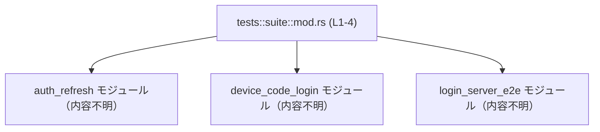
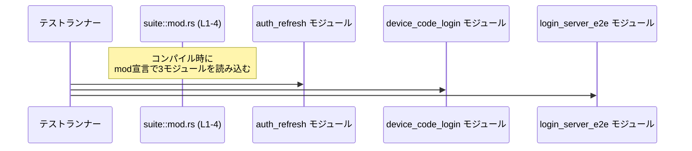

# login/tests/suite/mod.rs コード解説

## 0. ざっくり一言

- 以前は独立ファイルだったログイン関連の統合テストを、3つのテストモジュールとして集約する「テストスイート用の入口モジュール」です。（根拠: `mod.rs:L1-4`）

---

## 1. このモジュールの役割

### 1.1 概要

- このモジュールは、**統合テストをモジュールとして束ねる**ために存在します。（根拠: `mod.rs:L1`）
- 具体的には、`auth_refresh`, `device_code_login`, `login_server_e2e` の3つのサブモジュールを宣言し、それぞれに個別の統合テストを収める構成になっています。（根拠: `mod.rs:L2-4`）

```rust
// Aggregates all former standalone integration tests as modules.   // 以前は単独ファイルだった統合テストをモジュールとして集約する
mod auth_refresh;                                                  // auth_refresh テストモジュールの宣言
mod device_code_login;                                             // device_code_login テストモジュールの宣言
mod login_server_e2e;                                              // login_server_e2e テストモジュールの宣言
// （根拠: mod.rs:L1-4）
```

### 1.2 アーキテクチャ内での位置づけ

このファイルは「tests/suite」というテスト用名前空間のルートとして、3つのテストモジュールを束ねる役割を持ちます。

- `suite` モジュール → `auth_refresh` / `device_code_login` / `login_server_e2e` の3モジュールに依存（コンパイル時に読み込む）
- 3つのモジュールの中身（どのテスト関数を持つか）は、このチャンクには現れません



> 図は、「suite::mod.rs が3つのサブモジュールを宣言している」という依存関係のみを表します。（根拠: `mod.rs:L2-4`）

### 1.3 設計上のポイント

コードから読み取れる設計上の特徴は以下のとおりです。

- **テストの集約モジュール**  
  - コメントに「Aggregates all former standalone integration tests as modules.」とあり、**単一ファイルだった統合テストをモジュール配下に整理した**ことが分かります。（根拠: `mod.rs:L1`）

- **状態やロジックを持たない**  
  - 関数定義や型定義はなく、`mod` 宣言のみです。（根拠: `mod.rs:L1-4`）
  - このファイル単体には実行時ロジック・状態・エラー処理・並行処理は存在しません。

- **Rust標準のモジュールシステム利用**  
  - `mod foo;` 形式の宣言により、同ディレクトリの `foo.rs` または `foo/mod.rs` をサブモジュールとして読み込む、Rust の標準的なモジュール構成になっています。（一般的な Rust 仕様に基づく説明）

---

## 2. 主要な機能一覧（コンポーネントインベントリー）

このファイル自体の「機能」は、**テストモジュールの宣言・集約のみ**です。

### 2.1 モジュール・コンポーネント一覧

| 名称                     | 種別       | 定義位置             | 役割 / 用途 |
|--------------------------|------------|----------------------|-------------|
| `suite`                  | モジュール | `mod.rs:L1-4`        | 統合テストスイートのルートモジュール。3つのテストモジュールを `mod` 宣言で読み込む。 |
| `auth_refresh`           | サブモジュール | `mod.rs:L2`       | 認可・認証リフレッシュに関する統合テストを含むと推測されますが、このチャンクには中身がありません。（役割は名前からの推測であり、コードからは断定できません） |
| `device_code_login`      | サブモジュール | `mod.rs:L3`       | デバイスコードログインに関する統合テストを含むと推測されますが、このチャンクには中身がありません。 |
| `login_server_e2e`       | サブモジュール | `mod.rs:L4`       | ログインサーバ全体を通した E2E（end-to-end）テストを含むと推測されますが、このチャンクには中身がありません。 |

> `auth_refresh` などのサブモジュールの**具体的なテスト内容や API は、このファイルからは分かりません**。

### 2.2 機能レベルで見た役割

- テストモジュールの読み込み:  
  - `mod auth_refresh;` などの宣言により、各テストモジュールのソースコードをコンパイル対象に含める。（根拠: `mod.rs:L2-4`）
- テストスイートの整理:  
  - コメントより、以前はバラバラだった統合テストを `suite` 配下に整理する意図が読み取れます。（根拠: `mod.rs:L1`）

---

## 3. 公開 API と詳細解説

### 3.1 型一覧（構造体・列挙体など）

このファイルには、構造体・列挙体・型エイリアスなどの**型定義は存在しません**。（根拠: `mod.rs:L1-4`）

### 3.2 関数詳細

このファイルには**関数定義が1つもありません**。（根拠: `mod.rs:L1-4`)

- そのため、「関数詳細テンプレート」を適用すべき対象（公開 API 関数やコアロジック）はこのチャンクには存在しません。

### 3.3 その他の関数

- ヘルパー関数・ラッパー関数を含め、**あらゆる関数定義はこのファイルにはありません**。（根拠: `mod.rs:L1-4`）

---

## 4. データフロー

このファイルには実行時ロジックがないため、「値がどのように変換されて流れるか」という意味でのデータフローは存在しません。

ここでは、**テスト実行時のごく抽象的な流れ**と、`mod` 宣言の役割だけを示します。

### 4.1 テスト実行時の概念的なフロー

Rust のテストランナーはコンパイル時に `mod` で取り込まれた各モジュールの `#[test]` 関数を収集し、実行時にそれらを直接呼び出します。このファイル自体は、そのための**モジュールの入口**に過ぎません。



- `suite::mod.rs` から **他モジュールへ直接関数呼び出しを行うコードは存在しません**。（根拠: `mod.rs:L1-4`）
- したがって、このファイルに起因するエラー処理や並行処理上の懸念もありません。

---

## 5. 使い方（How to Use）

### 5.1 基本的な使用方法

このモジュールの典型的な使い方は、「統合テスト用モジュールを追加・整理する」ことです。

Rust の標準的なパターンに従うと、以下のようになります。

```rust
// login/tests/suite/mod.rs

// 既存の統合テストモジュール                         // それぞれ別ファイルに定義されている
mod auth_refresh;
mod device_code_login;
mod login_server_e2e;

// 新しい統合テストモジュールを追加する例            // 新規統合テストを suite 配下にまとめたい場合
mod password_reset;                                     // password_reset.rs または password_reset/mod.rs を追加する
// （この行は例示であり、実際のリポジトリに存在するかは不明）
```

- `mod password_reset;` を追加すると、そのモジュールに定義した `#[test]` 関数がテストランナーに認識されます。
- 実際には `login/tests/suite/password_reset.rs` または `login/tests/suite/password_reset/mod.rs` を作成する必要があります（これは Rust のモジュール規約に基づく一般的な説明であり、このチャンクからは実在ファイルは確認できません）。

### 5.2 よくある使用パターン

この種のテスト集約モジュールに対して行う操作は主に以下です。

1. **テストモジュールの追加**
   - 新しい種類のログインフローの統合テストを書きたい場合に、対応する `mod` 行を追加する。

2. **テストモジュールの削除**
   - 廃止した機能の統合テストモジュールを削除する際に、対応する `mod` 行も削除する。
   - これにより、そのモジュールがコンパイル対象から外れます。

3. **テストモジュール名の変更**
   - ファイル名を変更した場合、ここに書かれたモジュール名も一致させる必要があります。

### 5.3 よくある間違い

Rust のモジュールシステム上、次のような誤りが起こりえます。

```rust
// 間違い例: mod 宣言だけ書いて、対応するファイルを作成していない
mod auth_refresh;       // auth_refresh.rs / auth_refresh/mod.rs が存在しないとコンパイルエラーになる

// 正しい例: mod 宣言と、対応するファイルの両方を用意する
mod auth_refresh;       // login/tests/suite/auth_refresh.rs か auth_refresh/mod.rs が存在する
```

- このコンパイルエラーは Rust のモジュール解決の仕組みによるものであり、**ランタイムではなくビルド時の問題**です。

### 5.4 使用上の注意点（まとめ）

- **前提条件**
  - 各 `mod XXX;` に対して、対応するソースファイルが存在している必要があります。存在しない場合、コンパイルエラーになります。（一般的な Rust 仕様）
- **エラー条件**
  - このファイル内の唯一のエラー要因は「モジュールファイルの不在」または「誤ったファイル名」といったビルド時エラーです。
- **並行性・安全性**
  - 実行時ロジックを含まないため、このファイル自体にはデータ競合やメモリ安全性の問題は発生しません。

---

## 6. 変更の仕方（How to Modify）

### 6.1 新しい機能（統合テスト）を追加する場合

1. **新しいテストモジュールファイルを作成**
   - 例: `login/tests/suite/new_flow.rs`（または `new_flow/mod.rs`）
   - 中に `#[test]` 付き関数を実装する。

2. **`mod.rs` に `mod` 宣言を追加**
   - `mod new_flow;` を `mod.rs` に追加する。（例示であり、実際の名前は実装に依存）

3. **テスト実行**
   - `cargo test` 等で新しい統合テストが実行されることを確認する。
   - このファイル自体に追加のロジックは不要です。

### 6.2 既存の機能（テストモジュール）を変更する場合

- **影響範囲の確認**
  - あるテストモジュールを削除・リネームするときは、`mod.rs` 中の対応する `mod` 行を必ず更新・削除する必要があります。（根拠: `mod.rs:L2-4`）
- **契約（前提条件）**
  - `mod` の右辺（モジュール名）と、実際のソースファイル名が一致していること。
  - ファイル構成の契約が満たされていないとコンパイルが通りません。

- **テストの再確認**
  - モジュール名の変更によりテストのパスやフィルタ条件（`cargo test suite::auth_refresh::...` のようなパス指定）が変わる可能性があります。
  - これはこのファイルだけでは判断できませんが、一般的にモジュールパスに影響します。

---

## 7. 関連ファイル

このモジュールと密接に関係するのは、`mod` によって読み込まれるテストモジュールです。

| パス候補                                    | 役割 / 関係 |
|--------------------------------------------|------------|
| `login/tests/suite/auth_refresh.rs` または `login/tests/suite/auth_refresh/mod.rs` | `mod auth_refresh;` に対応する統合テストモジュール。認証リフレッシュ関連のテストを含むと推測されますが、このチャンクには定義がありません。（根拠: `mod.rs:L2`） |
| `login/tests/suite/device_code_login.rs` または `login/tests/suite/device_code_login/mod.rs` | `mod device_code_login;` に対応する統合テストモジュール。（根拠: `mod.rs:L3`） |
| `login/tests/suite/login_server_e2e.rs` または `login/tests/suite/login_server_e2e/mod.rs` | `mod login_server_e2e;` に対応する統合テストモジュール。（根拠: `mod.rs:L4`） |

> これらのファイルパスは Rust のモジュール規約から導かれる**候補**であり、実際にどちらの形式が使われているかは、このチャンク単体からは分かりません。

---

### Bugs / Security / Edge Cases / Performance について

- **Bugs / Security**
  - このファイルにはロジックやデータ処理が存在しないため、単体で見たときに特定のバグやセキュリティホールは読み取れません。
- **Contracts / Edge Cases**
  - 唯一の契約は「対応するモジュールファイルが存在すること」であり、これが破られるとコンパイルエラーになります（ランタイムのエッジケースはありません）。
- **Performance / Scalability**
  - `mod` 宣言はコンパイル単位の指定に過ぎず、ランタイムのパフォーマンスやスケーラビリティへの影響は事実上ありません。

このように、`login/tests/suite/mod.rs` は **統合テスト構成のためのごく薄いメタ情報のみを持つモジュール**であり、コアロジックやエラー処理・並行性の検討対象は、実際のテストコードが書かれているサブモジュール側になります。
