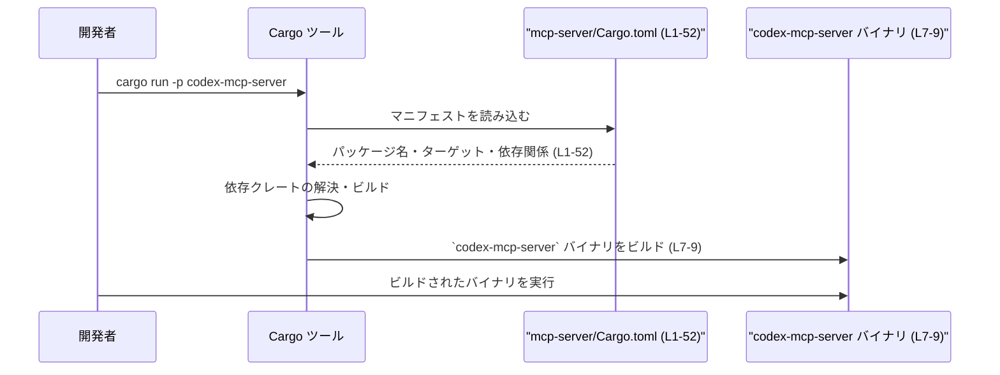

# mcp-server/Cargo.toml コード解説

## 0. ざっくり一言

- `codex-mcp-server` クレートの Cargo マニフェストであり、  
  パッケージ情報・バイナリ/ライブラリターゲット・依存クレート・テスト用依存クレートを定義しています（Cargo.toml:L1-52）。

---

## 1. このモジュールの役割

### 1.1 概要

- このファイルは Rust クレート `codex-mcp-server` のビルド設定を行うマニフェストです（Cargo.toml:L1-5）。
- バイナリターゲット `codex-mcp-server` とライブラリターゲット `codex_mcp_server` を定義し（Cargo.toml:L7-13）、  
  それらから利用可能な依存クレート（`tokio`, `serde`, `tracing` など）を宣言しています（Cargo.toml:L18-43）。
- テスト時にのみ必要なサポートクレート（`wiremock`, `tempfile` など）も `dev-dependencies` として定義されています（Cargo.toml:L45-52）。

### 1.2 アーキテクチャ内での位置づけ

- クレートはワークスペースに属し（`version.workspace = true` など、Cargo.toml:L3-5）、  
  同じワークスペース内の複数の `codex-*` クレート（`codex-core`, `codex-exec-server` など）に依存しています（Cargo.toml:L18-29）。
- 非同期ランタイム `tokio` とロギング基盤 `tracing` / `tracing-subscriber` に依存しているため（Cargo.toml:L35-43）、  
  非同期・並行処理と構造化ログを利用するサーバー系クレートであることが示唆されますが、  
  具体的な実装はこのファイルには現れません。
- 以下は、このマニフェストから分かる静的な依存関係の概要図です。

```mermaid
graph TD
    A["codex-mcp-server クレート (Cargo.toml L1-52)"]

    subgraph "ワークスペース内クレート (L18-29)"
        C1["codex-arg0 (L20)"]
        C2["codex-config (L21)"]
        C3["codex-core (L22)"]
        C4["codex-exec-server (L23)"]
        C5["codex-features (L24)"]
        C6["codex-login (L25)"]
        C7["codex-models-manager (L26)"]
        C8["codex-protocol (L27)"]
        C9["codex-utils-cli (L28)"]
        C10["codex-utils-json-to-toml (L29)"]
    end

    subgraph "外部ライブラリ (L30-43)"
        E1["rmcp (L30)"]
        E2["schemars (L31)"]
        E3["serde / serde_json (L32-33)"]
        E4["shlex (L34)"]
        E5["tokio (L35-41)"]
        E6["tracing (L42)"]
        E7["tracing-subscriber (L43)"]
    end

    A --> C1
    A --> C2
    A --> C3
    A --> C4
    A --> C5
    A --> C6
    A --> C7
    A --> C8
    A --> C9
    A --> C10

    A --> E1
    A --> E2
    A --> E3
    A --> E4
    A --> E5
    A --> E6
    A --> E7
```



※ 上図は依存関係の有無のみを示し、実際の呼び出し関係やデータフローはこのチャンクには現れません。

### 1.3 設計上のポイント（マニフェスト視点）

- **ワークスペース継承の活用**  
  - `version.workspace`, `edition.workspace`, `license.workspace` により、バージョンやエディション、ライセンスをワークスペースで一元管理しています（Cargo.toml:L3-5）。
  - `lints.workspace = true` により、Lint 設定もワークスペース側で統一されています（Cargo.toml:L15-16）。
- **バイナリ + ライブラリ構成**  
  - `[[bin]]` と `[lib]` の両方を定義し、CLI バイナリ `codex-mcp-server`（Cargo.toml:L7-9）とライブラリ `codex_mcp_server`（Cargo.toml:L11-13）を同一パッケージで提供しています。
- **非同期・並行処理基盤の利用準備**  
  - `tokio` に `"rt-multi-thread"`, `"process"`, `"signal"` などの機能を有効化しており（Cargo.toml:L35-41）、  
    マルチスレッドな非同期ランタイムやプロセス・シグナル処理を行う可能性があります（実際の使用箇所はこのチャンクには現れません）。
- **エラー処理・シリアライゼーション・ログ基盤の導入**  
  - `anyhow`（一般的なエラー集約クレート）、`serde` / `serde_json`（シリアライゼーション）、  
    `tracing` / `tracing-subscriber`（構造化ログ）に依存しています（Cargo.toml:L18-19,32-33,42-43）。
  - これらのクレートが利用可能であることは分かりますが、本クレート内での具体的なエラー処理・ログ出力手法はこのチャンクには現れません。

---

## 2. 主要な機能一覧（マニフェストとして）

このファイル自身が提供する「機能」はビルド・構成に関するものです。

- パッケージメタデータの宣言: 名前・バージョン・エディション・ライセンスをワークスペースから継承（Cargo.toml:L1-5）。
- バイナリターゲット定義: `src/main.rs` をエントリポイントとする `codex-mcp-server` バイナリの定義（Cargo.toml:L7-9）。
- ライブラリターゲット定義: `src/lib.rs` をルートとする `codex_mcp_server` ライブラリの定義（Cargo.toml:L11-13）。
- Lint 設定の継承: ワークスペース共通の Lint ポリシー適用（Cargo.toml:L15-16）。
- 実行時依存クレートの宣言: サーバー実装等から利用可能なクレート一覧を定義（Cargo.toml:L18-43）。
- テスト時依存クレートの宣言: テストで利用されるモック・ユーティリティの定義（Cargo.toml:L45-52）。

### 2.1 コンポーネントインベントリー（ビルドターゲット・依存クレート）

このチャンクから直接分かる「コンポーネント」の一覧です。

| コンポーネント | 種別 | 役割 / 説明（このファイルから分かる範囲） | 定義位置 |
|----------------|------|-------------------------------------------|----------|
| `codex-mcp-server` | パッケージ名 | 本クレートのパッケージ名（Cargo 上の識別子） | Cargo.toml:L1-2 |
| `codex-mcp-server` | バイナリターゲット | エントリポイント `src/main.rs` を持つバイナリ（具体的な挙動はこのチャンクには現れません） | Cargo.toml:L7-9 |
| `codex_mcp_server` | ライブラリターゲット | ルート `src/lib.rs` を持つライブラリ。公開 API の詳細はこのチャンクには現れません。 | Cargo.toml:L11-13 |
| `anyhow` | 実行時依存 | 一般的なエラー処理用クレートとして知られる。具体的な使用箇所は不明。 | Cargo.toml:L18-19 |
| `codex-arg0`〜`codex-utils-json-to-toml` | 実行時依存 | 同一ワークスペース内のサブクレート群。役割は名前から推測可能ですが、このチャンクのコードだけでは断定できません。 | Cargo.toml:L20-29 |
| `rmcp` | 実行時依存 | 外部クレート。用途はこのチャンクには現れません。 | Cargo.toml:L30 |
| `schemars` | 実行時依存 | `serde` 連携のスキーマ生成クレートとして知られるが、本クレートでの用途は不明。 | Cargo.toml:L31 |
| `serde` / `serde_json` | 実行時依存 | シリアライゼーション/デシリアライゼーション用クレートとして利用可能。 | Cargo.toml:L32-33 |
| `shlex` | 実行時依存 | シェル風のコマンドライン文字列パーサとして知られるが、本クレートでの用途は不明。 | Cargo.toml:L34 |
| `tokio` | 実行時依存 | 非同期ランタイム。`rt-multi-thread`, `process`, `signal` などの機能が有効化されている。 | Cargo.toml:L35-41 |
| `tracing` / `tracing-subscriber` | 実行時依存 | 構造化ログ・サブスクライバ。ログ出力基盤として利用可能。 | Cargo.toml:L42-43 |
| `codex-shell-command`〜`mcp_test_support` | dev依存 | ワークスペース内のテスト支援クレート。詳細はこのチャンクには現れません。 | Cargo.toml:L45-48 |
| `os_info`, `pretty_assertions`, `tempfile`, `wiremock` | dev依存 | OS 情報取得、アサーション拡張、一時ファイル、HTTP モック等の一般的テストユーティリティ。 | Cargo.toml:L49-52 |

---

## 3. 公開 API と詳細解説

### 3.1 型一覧（構造体・列挙体など）

- このファイルは Cargo マニフェストであり、Rust の構造体・列挙体・トレイトなどの型定義は含みません（Cargo.toml:L1-52）。

#### 型・関数インベントリー（このファイル）

| 種別 | 名前 | 備考 | 定義位置 |
|------|------|------|----------|
| （なし） | – | Cargo.toml には型・関数定義は含まれません | Cargo.toml:L1-52 |

### 3.2 関数詳細（最大 7 件）

- Cargo.toml は設定ファイルであり、関数やメソッドの定義は一切含まれません（Cargo.toml:L1-52）。
- したがって、このチャンクに基づいて詳細解説できる公開 API 関数は存在しません。  
  実際のコアロジックや公開 API は `src/main.rs` / `src/lib.rs` 側に定義されていると考えられますが、  
  それらはこのチャンクには現れません。

### 3.3 その他の関数

- 同上の理由により、「その他の関数」もこのファイルには存在しません（Cargo.toml:L1-52）。

---

## 4. データフロー

このチャンクのコードから分かるのは「ビルド・実行時に Cargo がどのようにこのマニフェストを利用するか」というフローです。  
アプリケーション内部のリクエスト処理やスレッド間データフローは、このファイル単体からは分かりません。

### 4.1 Cargo によるビルド・実行フロー（マニフェスト視点）



- 上記は一般的な Cargo の振る舞いであり、  
  バイナリ内部でどの依存クレートがどのように呼ばれるかは、このチャンクだけでは不明です。
- 並行性については、`tokio` のマルチスレッドランタイム機能が依存として利用可能であるため（Cargo.toml:L35-41）、  
  非同期タスクが複数スレッドで動作しうる設計であることが示唆されますが、  
  実際にどのようなタスク・API を使用しているかはこのチャンクには現れません。

---

## 5. 使い方（How to Use）

このセクションでは、「このマニフェストがあるクレート」を利用する基本的な方法を説明します。  
API レベルの使用方法（関数・メソッドの呼び出し）は、このチャンクからは分からないため扱いません。

### 5.1 基本的な使用方法（バイナリとして）

ワークスペースルートから、このパッケージのバイナリを起動する例です。

```bash
# ワークスペースルートで、codex-mcp-server パッケージのバイナリを実行
cargo run -p codex-mcp-server
```

- `-p codex-mcp-server` のパッケージ名は `[package] name = "codex-mcp-server"` に対応します（Cargo.toml:L1-2）。
- 実行されるのは `[[bin]]` で定義された `src/main.rs` のエントリポイントです（Cargo.toml:L7-9）。
- 実行時にどのようなコマンドライン引数・環境変数を受け付けるかは、このチャンクには現れません。

### 5.2 よくある使用パターン（マニフェストの観点）

1. **サーバーバイナリとして利用**  
   - 目的: `codex-mcp-server` をサーバープロセスとして起動。  
   - 利用例（一般的な Cargo のパターン）:

     ```bash
     # Release ビルドして起動
     cargo run -p codex-mcp-server --release -- [アプリ固有の引数...]
     ```

     `--` より右側の引数は `src/main.rs` の `main` 関数に渡されますが、その内容はこのチャンクには現れません。

2. **同一ワークスペースからライブラリとして利用**  
   - 目的: 他のワークスペース内クレートから `codex_mcp_server` ライブラリを利用。  
   - 一般的には、他のパッケージの `Cargo.toml` に以下のような依存定義を追加します（例としての書き方です）。

     ```toml
     [dependencies]
     codex_mcp_server = { path = "mcp-server" }  # 実際のパスはワークスペース構成に依存
     ```

   - どのモジュール・関数が公開されているかは、このチャンクには現れません。

### 5.3 よくある間違い（想定される点）

このマニフェストから推測できる、Cargo 周りの誤用例と注意点です。

```bash
# （誤りになりうる例）
# ワークスペースに複数パッケージやバイナリがある場合、
# パッケージ指定なしの `cargo run` では意図したバイナリが起動しない可能性がある。
cargo run
```

```bash
# 推奨例: パッケージ名かバイナリ名を明示する
cargo run -p codex-mcp-server          # パッケージを指定
# または
cargo run --bin codex-mcp-server       # バイナリ名を指定（Cargo.toml:L7-8）
```

- このクレートはワークスペースに属しているため（Cargo.toml:L3）、  
  他にもパッケージやバイナリが存在する構成が想定されます。  
  その場合、パッケージ名やバイナリ名を明示すると意図しないターゲットの実行を避けられます。

### 5.4 使用上の注意点（まとめ）

- **エントリファイルの存在**  
  - `src/main.rs` と `src/lib.rs` が存在しないと、Cargo がビルド時にエラーになります（Cargo.toml:L7-13）。  
    これらをリネーム・移動する場合は、本ファイルの `path` も合わせて更新する必要があります。
- **依存クレートの追加・削除**  
  - `[dependencies]` / `[dev-dependencies]` に定義されたクレートを削除・変更すると、  
    実装側 (`src/*.rs`) でそれらを利用しているコードがビルドエラーになる可能性があります（Cargo.toml:L18-52）。
- **並行性に関する前提**  
  - `tokio` の `rt-multi-thread` 機能が有効化されているため（Cargo.toml:L35-41）、  
    実装側がマルチスレッドの非同期ランタイムを前提としている可能性があります。  
    ランタイムを変更・削除する場合は、実装側のタスクの生成・待機方法も検証する必要があります。
- **エラー処理・ログ基盤の整合性**  
  - `anyhow`, `tracing`, `tracing-subscriber` を外す場合、実装側でエラー型やログ API をどのように扱っているかを確認する必要があります（Cargo.toml:L18-19,42-43）。  
    このチャンクには具体的な呼び出しは現れませんが、一般的に広範囲に影響しやすい依存です。

---

## 6. 変更の仕方（How to Modify）

### 6.1 新しい機能を追加する場合（マニフェスト側の変更）

1. **コード実装の追加先**  
   - バイナリとしての機能追加: `src/main.rs` もしくはそこから呼び出すモジュールに実装を追加（Cargo.toml:L7-9 よりエントリポイントが分かります）。  
   - ライブラリ API の追加: `src/lib.rs` から公開されるモジュール・関数を追加（Cargo.toml:L11-13）。
   - これらの Rust ファイル自体は、このチャンクには現れません。
2. **必要な依存クレートの追加**  
   - 新機能で外部クレートが必要な場合、`[dependencies]` または `[dev-dependencies]` に追記します（Cargo.toml:L18-52）。

   ```toml
   [dependencies]
   # 既存の依存
   anyhow = { workspace = true }
   # 新規に追加する依存（例）
   # some-crate = "1.2"
   ```

3. **ワークスペース整合性の確認**  
   - 既存の依存が `workspace = true` で管理されているため（Cargo.toml:L18-43）、  
     可能であれば新しい依存もワークスペース側でバージョンを管理するかどうかを検討します。

### 6.2 既存の機能を変更する場合（マニフェスト観点）

- **依存クレートのバージョンや feature の変更**  
  - 例: `tokio` の features を変更する場合（Cargo.toml:L35-41）、  
    実装側で利用している API（`process`, `signal` 等）が有効なままかを確認する必要があります。
- **ターゲット名・パスの変更**  
  - `[[bin]] name` や `path` を変更すると（Cargo.toml:L7-9）、  
    - `cargo run --bin ...` などの呼び出し方法  
    - CI 設定・スクリプト  
    に影響します。
- **ワークスペース継承設定の変更**  
  - `version.workspace = true` をやめて個別バージョンを設定したりすると（Cargo.toml:L3）、  
    リリース管理の方針が変わります。  
    これはワークスペース全体の設計に関わるため、このパッケージ単体では判断できません。

---

## 7. 関連ファイル

このマニフェストと密接に関係するファイル・ディレクトリです。

| パス | 役割 / 関係 | 根拠 |
|------|-------------|------|
| `mcp-server/src/main.rs` | バイナリターゲット `codex-mcp-server` のエントリポイント。存在しないとビルドエラーになる。 | `[[bin]] path = "src/main.rs"`（Cargo.toml:L7-9） |
| `mcp-server/src/lib.rs` | ライブラリ `codex_mcp_server` のルートモジュール。公開 API はここから再エクスポートされるのが一般的ですが、具体的内容はこのチャンクには現れません。 | `[lib] path = "src/lib.rs"`（Cargo.toml:L11-13） |
| ワークスペースルートの `Cargo.toml` | `version.workspace`, `edition.workspace`, `license.workspace`, `lints.workspace` の設定元。具体的な場所・内容はこのチャンクには現れません。 | `*.workspace = true`（Cargo.toml:L3-5,15-16,18-43） |
| `codex-arg0` などのワークスペース内クレート | 本クレートが依存するサブクレート群。CLI 引数処理、設定、コアロジックなどを担っている可能性がありますが、詳細は不明です。 | `[dependencies]` の `codex-*` エントリ（Cargo.toml:L20-29） |
| `core_test_support`, `mcp_test_support` など | テストコード側から利用されるサポートクレート。テストの場所や内容はこのチャンクには現れません。 | `[dev-dependencies]`（Cargo.toml:L45-48） |

---

### このチャンクから分からないことの明示

- `src/main.rs` / `src/lib.rs` の内容（公開 API・コアロジック・エラー処理・並行処理の具体像）は、このチャンクには現れません。
- 依存クレート（`codex-core`, `rmcp`, `tokio` など）がどのように呼ばれ、どのようなデータフローを形成しているかも、このファイル単体からは分かりません。
- バグ・セキュリティ上の問題の有無についても、マニフェストだけからは判断できません。  
  確認には実際の Rust ソースコードおよび依存クレートのバージョン情報が必要です。
