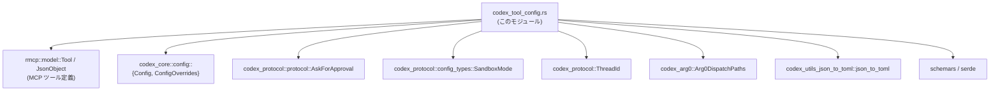
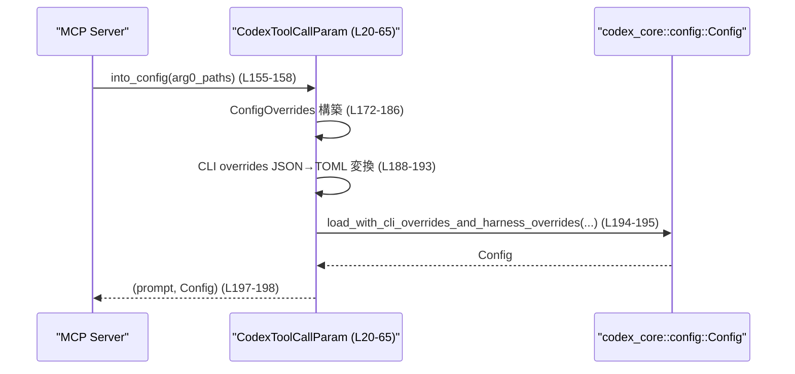
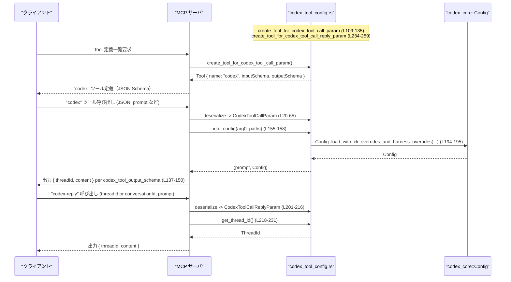

# mcp-server/src/codex_tool_config.rs

## 0. ざっくり一言

`codex` / `codex-reply` MCP ツール呼び出し用の **設定パラメータ型** と、そこから **Codex 内部の Config への変換** および **Tool の JSON Schema 定義** を生成するモジュールです（`mcp-server/src/codex_tool_config.rs:L1-283`）。

---

## 1. このモジュールの役割

### 1.1 概要

- このモジュールは、MCP ツールコールにおける **Codex セッションの開始・継続** を行うための設定を表現し、  
  MCP の `Tool` 定義（JSON Schema 形式）と Codex 内部設定 (`Config`) の間を橋渡しします（`codex_tool_config.rs:L20-65,L109-135,L152-199,L201-216,L234-259`）。
- クライアントが送る JSON を Rust 構造体 (`CodexToolCallParam`, `CodexToolCallReplyParam`) にマッピングし、  
  それを元に `ConfigOverrides` を組み立てて `codex_core::config::Config` をロードします（`codex_tool_config.rs:L172-195`）。
- また、シェルコマンド承認ポリシーやサンドボックスモードを外部プロトコル型に変換するためのラッパー enum を提供します（`codex_tool_config.rs:L67-107`）。

### 1.2 アーキテクチャ内での位置づけ

このモジュールは、MCP サーバ側で「ツール定義」と「ツール引数の解釈」を担当し、  
codex-core や codex-protocol などのドメイン層に接続する **境界レイヤ** に位置づけられます。



- `Tool` / `JsonObject` に対して `create_tool_for_*` でツール定義を構築します（`codex_tool_config.rs:L109-135,L234-259`）。
- `ConfigOverrides` にツール引数を詰めて `Config::load_with_cli_overrides_and_harness_overrides` を呼び出します（`codex_tool_config.rs:L172-195`）。
- `AskForApproval` / `SandboxMode` / `ThreadId` などのプロトコル型をラップ／変換して利用します（`codex_tool_config.rs:L67-107,L218-231`）。

### 1.3 設計上のポイント

- **責務分割**
  - ツールコールの入力パラメータ型 (`CodexToolCallParam`, `CodexToolCallReplyParam`) と、  
    JSON Schema 生成ロジック (`create_tool_for_*`, `create_tool_input_schema`) を分離しています。
  - サンドボックスモード・承認ポリシーは外部型をそのまま使わず、  
    `JsonSchema` を derive 可能なラッパー enum (`CodexToolCall*`) を定義しています（`codex_tool_config.rs:L67-107`）。

- **シリアライズ設計**
  - 開始パラメータは **kebab-case** (`approval-policy`, `base-instructions` etc.)（`codex_tool_config.rs:L21-22,L24-64`）。
  - 返信パラメータは **camelCase** (`threadId`, `conversationId`)（`codex_tool_config.rs:L201-203,L204-215`）。
  - テストで JSON Schema（フィールド名・必須項目など）を **厳密に検証** しています（`codex_tool_config.rs:L302-386,L389-432`）。

- **エラーハンドリング**
  - 設定読み込みは `std::io::Result` を返す async 関数として扱い、`?` で I/O エラーを呼び出し元に伝播します（`codex_tool_config.rs:L155-158,L194-197`）。
  - `get_thread_id` は `anyhow::Result<ThreadId>` を返し、パース失敗や必須フィールド欠如をエラーとして扱います（`codex_tool_config.rs:L219-231`）。
  - JSON Schema 生成では `expect`, `panic!`, `unreachable!` により「起こらないはずの状態」に対してパニックします（`codex_tool_config.rs:L137-149,L261-270`）。

- **並行性／共有**
  - `Tool` の `input_schema` / `output_schema` は `Arc<JsonObject>` で保持し、  
    スレッド間で共有可能な不変データとして扱います（`codex_tool_config.rs:L10-11,L137-150,L261-283`）。
  - `into_config` は async 関数で、非同期ランタイム上で `await` されることを前提にしています（`codex_tool_config.rs:L155-158,L194-197`）。

---

## 2. 主要な機能一覧

- Codex セッション開始パラメータ (`CodexToolCallParam`) の定義と JSON Schema 生成
- シェルコマンド承認ポリシー (`CodexToolCallApprovalPolicy`) の表現と `AskForApproval` への変換
- サンドボックスモード (`CodexToolCallSandboxMode`) の表現と `SandboxMode` への変換
- Codex セッション返信パラメータ (`CodexToolCallReplyParam`) の定義と JSON Schema 生成
- ツール引数から `ConfigOverrides` / `Config` を構築する `into_config` の提供
- 返信パラメータから `ThreadId` を取得する `get_thread_id`
- MCP `Tool` 向けの共通出力スキーマ (`threadId`, `content`) の生成
- `schemars` で生成した RootSchema から MCP 用の簡略化された `input_schema` を作るユーティリティ (`create_tool_input_schema`)

---

## 3. 公開 API と詳細解説

### 3.1 型一覧（構造体・列挙体など）

| 名前 | 種別 | 役割 / 用途 | 定義位置 |
|------|------|-------------|----------|
| `CodexToolCallParam` | 構造体 | `codex` ツール呼び出し時の入力パラメータ（セッション開始用）を表現する。プロンプト・モデル名・プロファイル・CWD・承認ポリシー・サンドボックス・追加 config などを含む。 | `mcp-server/src/codex_tool_config.rs:L20-65` |
| `CodexToolCallApprovalPolicy` | 列挙体 | シェルコマンド承認ポリシーを JSON Schema 付きで表現するラッパー enum。`AskForApproval` と 1:1 対応。 | `mcp-server/src/codex_tool_config.rs:L67-76` |
| `CodexToolCallSandboxMode` | 列挙体 | サンドボックスの制約レベルを JSON Schema 付きで表現するラッパー enum。`SandboxMode` と対応。 | `mcp-server/src/codex_tool_config.rs:L89-97` |
| `CodexToolCallReplyParam` | 構造体 | `codex-reply` ツール呼び出し時の入力パラメータ（セッション継続用）。`threadId` または旧 `conversationId` と、次の `prompt` を保持。 | `mcp-server/src/codex_tool_config.rs:L201-216` |

### 3.1.1 関数・メソッド・テストのインベントリー

| 名前 | 種別 | 概要 | 定義位置 |
|------|------|------|----------|
| `impl From<CodexToolCallApprovalPolicy> for AskForApproval::from` | メソッド | 内部承認ポリシー enum をプロトコル enum へ変換する。 | `mcp-server/src/codex_tool_config.rs:L78-86` |
| `impl From<CodexToolCallSandboxMode> for SandboxMode::from` | メソッド | ラッパー enum を `SandboxMode` へ変換する。 | `mcp-server/src/codex_tool_config.rs:L99-106` |
| `create_tool_for_codex_tool_call_param` | 関数 | `codex` ツールの `Tool` 定義（入力/出力 Schema 含む）を構築する。 | `mcp-server/src/codex_tool_config.rs:L109-135` |
| `codex_tool_output_schema` | 関数 | `{"threadId": string, "content": string}` という共通出力 JSON Schema を構築し `Arc<JsonObject>` で返す。 | `mcp-server/src/codex_tool_config.rs:L137-150` |
| `CodexToolCallParam::into_config` | メソッド (async) | ツール入力パラメータから `(prompt, Config)` を構築する。`ConfigOverrides` と CLI overrides を組み立てて `Config` をロード。 | `mcp-server/src/codex_tool_config.rs:L152-199` |
| `CodexToolCallReplyParam::get_thread_id` | メソッド | `threadId` または旧 `conversationId` から `ThreadId` をパースして返す。 | `mcp-server/src/codex_tool_config.rs:L218-231` |
| `create_tool_for_codex_tool_call_reply_param` | 関数 | `codex-reply` ツールの `Tool` 定義（入力/出力 Schema 含む）を構築する。 | `mcp-server/src/codex_tool_config.rs:L234-259` |
| `create_tool_input_schema` | 関数 | `schemars` の `RootSchema` から MCP 用の簡略 `input_schema` (properties/required/type/$defs/definitions) を抽出する。 | `mcp-server/src/codex_tool_config.rs:L261-283` |
| `tests::verify_codex_tool_json_schema` | テスト関数 | `codex` ツールの `Tool` JSON を期待値と完全一致するか検証する。 | `mcp-server/src/codex_tool_config.rs:L285-386` |
| `tests::verify_codex_tool_reply_json_schema` | テスト関数 | `codex-reply` ツールの `Tool` JSON を期待値と完全一致するか検証する。 | `mcp-server/src/codex_tool_config.rs:L388-432` |

---

### 3.2 関数詳細（7 件）

#### 3.2.1 `CodexToolCallParam::into_config(self, arg0_paths: Arg0DispatchPaths) -> std::io::Result<(String, Config)>`

**定義位置**: `mcp-server/src/codex_tool_config.rs:L152-199`

**概要**

- Codex セッション開始パラメータ (`CodexToolCallParam`) から、  
  初期ユーザープロンプトと Codex の実効設定 `Config` を生成する async メソッドです。
- `ConfigOverrides` と CLI からの JSON/TOML オーバーライドを組み合わせ、  
  `Config::load_with_cli_overrides_and_harness_overrides` を通じて設定をロードします（`codex_tool_config.rs:L172-195`）。

**引数**

| 引数名 | 型 | 説明 |
|--------|----|------|
| `self` | `CodexToolCallParam` | ツールコールで受け取ったパラメータ全体。消費されます。 |
| `arg0_paths` | `Arg0DispatchPaths` | Codex 本体やラッパーの実行ファイルパスを保持する構造体。`ConfigOverrides` に埋め込まれます（`codex_tool_config.rs:L179-181`）。 |

**戻り値**

- `std::io::Result<(String, Config)>`
  - `Ok((prompt, cfg))`:
    - `prompt`: 初期ユーザープロンプト（`CodexToolCallParam::prompt`）そのもの（`codex_tool_config.rs:L160,L197-198`）。
    - `cfg`: CLI/ハーネスオーバーライドを適用した `Config` インスタンス（`codex_tool_config.rs:L194-195`）。
  - `Err(e)`:
    - `Config::load_with_cli_overrides_and_harness_overrides` から伝播された I/O エラー（`codex_tool_config.rs:L194-197`）。

**内部処理の流れ**

1. `self` をフィールドに分解し、ローカル変数に束縛します（`codex_tool_config.rs:L159-170`）。
2. `ConfigOverrides` を構築します（`codex_tool_config.rs:L172-186`）。
   - `model`, `profile`, `cwd`, `approval_policy`, `sandbox` などをそのまま or `map(Into::into)` して詰めます。
   - `cwd` は `Option<String>` から `Option<PathBuf>` に変換（`cwd.map(PathBuf::from)`）（`codex_tool_config.rs:L176`）。
   - `approval_policy` / `sandbox` は、それぞれ `AskForApproval` / `SandboxMode` へ変換（`codex_tool_config.rs:L177-178`）。
   - 各種実行ファイルパスを `arg0_paths` からコピーします（`codex_tool_config.rs:L179-181`）。
   - それ以外のフィールドは `..Default::default()` でデフォルトを使用します（`codex_tool_config.rs:L185-186`）。
3. CLI オーバーライド（JSON）を `json_to_toml` で TOML に変換しつつ `HashMap` に再構築します（`codex_tool_config.rs:L188-193`）。
   - `cli_overrides.unwrap_or_default()` で `None` の場合は空の `HashMap` に。
   - `into_iter().map(|(k,v)| (k, json_to_toml(v)))` で値を変換。
4. `Config::load_with_cli_overrides_and_harness_overrides(cli_overrides, overrides).await?` を呼び出し、`Config` をロードします（`codex_tool_config.rs:L194-195`）。
5. `(prompt, cfg)` を `Ok` で返します（`codex_tool_config.rs:L197-198`）。



**Examples（使用例）**

Codex MCP サーバ内で、ツール入力から Config を構築するイメージです。

```rust
use codex_arg0::Arg0DispatchPaths;                   // 実行ファイルパス群
use codex_core::config::Config;                      // Codex の設定型
use mcp_server::codex_tool_config::CodexToolCallParam;

async fn handle_codex_tool_call(
    params: CodexToolCallParam,                      // MCP 経由でデシリアライズされた入力
    arg0_paths: Arg0DispatchPaths,                   // サーバ起動時に用意したパス群
) -> std::io::Result<()> {
    // Codex の実効設定を構築しつつ、初期プロンプトを取り出す
    let (prompt, config): (String, Config) =
        params.into_config(arg0_paths).await?;       // I/O エラーは ? で伝播

    // ここで prompt と config を使って Codex セッションを開始する
    println!("Starting codex with prompt: {prompt}");

    Ok(())
}
```

**Errors / Panics**

- `Errors`
  - `Config::load_with_cli_overrides_and_harness_overrides` が `Err(std::io::Error)` を返した場合、  
    そのまま `Err` として呼び出し元に伝播されます（`codex_tool_config.rs:L194-197`）。
  - `json_to_toml` 内部の挙動はこのファイルからは不明ですが、戻り値の型的にはパニックやエラーはここでは扱っていません。

- `Panics`
  - このメソッド内部で `panic!`, `expect`, `unwrap` は使用されていません（`codex_tool_config.rs:L152-199`）。

**Edge cases（エッジケース）**

- `cli_overrides` が `None` または空:
  - `unwrap_or_default()` により空のマップとして扱われます（`codex_tool_config.rs:L188-190`）。
- `cwd` / `approval_policy` / `sandbox` が `None`:
  - それぞれ `Option::map` で変換されるため、`ConfigOverrides` 側では `None` のままとなります（`codex_tool_config.rs:L176-178`）。
- `json_to_toml` が入力 JSON の一部をサポートしない場合:
  - このチャンクには `json_to_toml` の実装がないため挙動は不明です。
- `Config::load_with_cli_overrides_and_harness_overrides` の挙動:
  - 関数名からは設定ファイル読み込みが行われると推測されますが、本チャンクには実装がなく詳細は不明です。

**使用上の注意点**

- **非同期コンテキスト**  
  `async fn` のため、Tokio などの非同期ランタイム上で `.await` する必要があります（`codex_tool_config.rs:L155,L194-195`）。
- **エラー処理**  
  `std::io::Result` を返すため、呼び出し側で `?` もしくは `match` によるエラー処理が必須です。
- **セキュリティ上の意味を持つフィールド**  
  `approval_policy` と `sandbox` はシェルコマンド実行ポリシーやファイルアクセス権限に影響するため、  
  外部から任意に変更できる場合はアクセス制御が重要になります（値自体の適用は codex-core 側で行われます）。

---

#### 3.2.2 `CodexToolCallReplyParam::get_thread_id(&self) -> anyhow::Result<ThreadId>`

**定義位置**: `mcp-server/src/codex_tool_config.rs:L218-231`

**概要**

- `codex-reply` ツール入力から、どの会話スレッドに対する返信かを示す `ThreadId` を取り出します。
- `thread_id` があればそれを優先し、なければ非推奨の `conversation_id` を利用します（`codex_tool_config.rs:L219-225`）。

**引数**

| 引数名 | 型 | 説明 |
|--------|----|------|
| `&self` | `&CodexToolCallReplyParam` | 返信パラメータへの参照。所有権は移動しません。 |

**戻り値**

- `anyhow::Result<ThreadId>`
  - `Ok(thread_id)`:
    - `thread_id` または `conversation_id` を `ThreadId::from_string` でパース成功した結果。
  - `Err(anyhow::Error)`:
    - どちらも `None` の場合、  
      `"either threadId or conversationId must be provided"` というメッセージ付きエラー（`codex_tool_config.rs:L227-229`）。
    - `ThreadId::from_string` がエラーを返した場合、そのエラーが `?` により `anyhow::Error` に変換されて伝播します（`codex_tool_config.rs:L221,L224`）。

**内部処理の流れ**

1. `self.thread_id` が `Some` ならそれを使用し、`ThreadId::from_string` でパースします（`codex_tool_config.rs:L219-222`）。
2. そうでなければ `self.conversation_id` が `Some` かをチェックし、あれば同様にパースします（`codex_tool_config.rs:L223-225`）。
3. どちらも `None` の場合、`anyhow!` マクロでエラーを返します（`codex_tool_config.rs:L227-229`）。

**Examples（使用例）**

```rust
use codex_protocol::ThreadId;
use mcp_server::codex_tool_config::CodexToolCallReplyParam;

fn handle_reply_param(param: &CodexToolCallReplyParam) -> anyhow::Result<ThreadId> {
    // threadId か conversationId のいずれかから ThreadId を取得
    let thread_id = param.get_thread_id()?;            // パース失敗・欠如は anyhow::Error

    // 取得した thread_id を使って会話スレッドを特定する
    Ok(thread_id)
}
```

**Errors / Panics**

- `Errors`
  - 両方の ID が `None` の場合: `"either threadId or conversationId must be provided"`（`codex_tool_config.rs:L227-229`）。
  - `ThreadId::from_string` が失敗した場合: そのエラーが `anyhow::Error` として伝播（`codex_tool_config.rs:L221,L224`）。
- `Panics`
  - 本メソッド内では `panic!` 系は使用されていません。

**Edge cases**

- `thread_id` が空文字列:
  - `ThreadId::from_string` の挙動は本チャンクにはなく不明です。エラーになる可能性があります。
- `thread_id` と `conversation_id` が両方 `Some` の場合:
  - `thread_id` が優先され、`conversation_id` は無視されます（`codex_tool_config.rs:L219-225`）。
- どちらも未指定 (`None`):
  - 明示的にエラーを返します（`codex_tool_config.rs:L227-229`）。

**使用上の注意点**

- クライアントは将来的に `threadId` を必須にする前提で設計されているため、  
  新規クライアント実装では `conversationId` ではなく `threadId` を送ることが望ましいです（コメント参照: `codex_tool_config.rs:L208-211`）。
- `anyhow::Result` のため、呼び出し側は適切にエラーをログ出力するなどの扱いを検討する必要があります。

---

#### 3.2.3 `create_tool_for_codex_tool_call_param() -> Tool`

**定義位置**: `mcp-server/src/codex_tool_config.rs:L109-135`

**概要**

- `CodexToolCallParam` の JSON Schema を元に、`codex` ツールの `Tool` 定義を構築します。
- 入力スキーマに `create_tool_input_schema` で整形した JSON Schema、出力スキーマに `codex_tool_output_schema` を利用します。

**引数**

- なし

**戻り値**

- `rmcp::model::Tool`
  - `name: "codex"`
  - `title: Some("Codex")`
  - `input_schema`: `CodexToolCallParam` 由来の JSON Schema（`Arc<JsonObject>`）。
  - `output_schema`: `codex_tool_output_schema()` で生成された共通スキーマ。
  - `description`: Codex セッションの実行内容を説明する文字列。

**内部処理の流れ**

1. `SchemaSettings::draft2019_09()` を元に `schemars` の設定を作成し、  
   `inline_subschemas = true`, `option_add_null_type = false` を設定（`codex_tool_config.rs:L111-115`）。
2. `into_generator().into_root_schema_for::<CodexToolCallParam>()` により、  
   `CodexToolCallParam` の JSON Schema (`RootSchema`) を生成（`codex_tool_config.rs:L116-117`）。
3. `create_tool_input_schema(schema, "Codex tool schema should serialize")` で  
   MCP 用の入力スキーマ `Arc<JsonObject>` に変換（`codex_tool_config.rs:L119`）。
4. `Tool` 構造体を組み立てて返します（`codex_tool_config.rs:L121-134`）。

**Examples（使用例）**

```rust
use rmcp::model::Tool;
use mcp_server::codex_tool_config::create_tool_for_codex_tool_call_param;

fn register_tools() -> Vec<Tool> {
    let codex_tool = create_tool_for_codex_tool_call_param();  // codex 用ツール定義を生成
    vec![codex_tool]
}
```

**Errors / Panics**

- `create_tool_input_schema` 内部で `serde_json::to_value` に対して `expect` を使っているため、  
  スキーマがシリアライズ不能な場合にはパニックしますが、通常の `schemars` 出力では起こらない前提です（`codex_tool_config.rs:L261-267`）。
- この関数自体は `Result` を返さず、エラーを返す経路はありません。

**Edge cases**

- `CodexToolCallParam` にフィールド追加などの変更があった場合:
  - 生成される JSON Schema も変わり、テスト `verify_codex_tool_json_schema` が失敗して気づける設計になっています（`codex_tool_config.rs:L302-386`）。

**使用上の注意点**

- MCP サーバ起動時のツール登録フェーズで使う初期化関数的な性質が強く、  
  実行時に頻繁に呼び出すものではありません。
- ツール名 `"codex"` や説明文を変更するとクライアントとの互換性に影響します。

---

#### 3.2.4 `create_tool_for_codex_tool_call_reply_param() -> Tool`

**定義位置**: `mcp-server/src/codex_tool_config.rs:L234-259`

**概要**

- `CodexToolCallReplyParam` の JSON Schema を元に、`codex-reply` ツールの `Tool` 定義を構築します。
- 入力スキーマは `CodexToolCallReplyParam` 由来、出力スキーマは `codex_tool_output_schema` で共通化されています。

**引数**

- なし

**戻り値**

- `rmcp::model::Tool`
  - `name: "codex-reply"`
  - `title: Some("Codex Reply")`
  - `input_schema`: `CodexToolCallReplyParam` 由来 JSON Schema。
  - `output_schema`: `codex_tool_output_schema()` の共有スキーマ。
  - `description`: 「thread id と prompt を提供して会話を継続する」旨の説明。

**内部処理の流れ**

`create_tool_for_codex_tool_call_param` と同様で、対象型を `CodexToolCallReplyParam` に変えたものです（`codex_tool_config.rs:L236-243,L244-258`）。

**Examples（使用例）**

```rust
use rmcp::model::Tool;
use mcp_server::codex_tool_config::create_tool_for_codex_tool_call_reply_param;

fn register_reply_tool() -> Tool {
    create_tool_for_codex_tool_call_reply_param()      // codex-reply 用ツール定義を生成
}
```

**Errors / Panics**

- `create_tool_input_schema` と `serde_json::to_value` の失敗時パニックの可能性については 3.2.3 と同じです。

**使用上の注意点**

- `codex` / `codex-reply` とで同じ `output_schema` を共有しているため、  
  返信処理でも `threadId` & `content` という出力契約が維持されます（`codex_tool_config.rs:L137-150,L250-251`）。

---

#### 3.2.5 `codex_tool_output_schema() -> Arc<JsonObject>`

**定義位置**: `mcp-server/src/codex_tool_config.rs:L137-150`

**概要**

- MCP ツール `codex` と `codex-reply` の両方で使う **共通出力 JSON Schema** を生成します。
- 出力オブジェクトは必ず `"threadId": string` と `"content": string` を持つ、という制約になります。

**引数**

- なし

**戻り値**

- `Arc<JsonObject>`
  - JSON オブジェクト形式のスキーマ。`Arc` により安価にクローン可能で、スレッド安全に共有できます。

**内部処理の流れ**

1. `serde_json::json!` で JSON literal を構築（`codex_tool_config.rs:L138-145`）。
2. マッチ式で `Value::Object` であることを確認し、`Arc::new(map)` で返します（`codex_tool_config.rs:L146-148`）。
3. 万一オブジェクトでない場合は `unreachable!` でパニックします（`codex_tool_config.rs:L148-149`）。

**Examples（使用例）**

通常は `create_tool_for_*` 内部からのみ呼ばれますが、単体で利用することも可能です。

```rust
use std::sync::Arc;
use rmcp::model::JsonObject;
use mcp_server::codex_tool_config::codex_tool_output_schema;

fn get_output_schema() -> Arc<JsonObject> {
    codex_tool_output_schema()
}
```

**Errors / Panics**

- `serde_json::json!` でコンパイル時に保証された JSON リテラルを構築しているため、  
  実行時エラーは想定されていません。
- ただし、もしリテラルがオブジェクトでなければ `unreachable!` でパニックします（通常は起こりません）。

**使用上の注意点**

- スキーマ変更（フィールド追加・型変更）はクライアントとの互換性に直接影響するため、  
  テストやクライアント側の実装を含めて慎重な変更が必要です。

---

#### 3.2.6 `create_tool_input_schema(schema: RootSchema, panic_message: &str) -> Arc<JsonObject>`

**定義位置**: `mcp-server/src/codex_tool_config.rs:L261-283`

**概要**

- `schemars` が生成した `RootSchema` から、MCP `Tool` 用の `input_schema` に必要なキーのみを抽出して `JsonObject` にまとめます。
- JSON Schema の「本体」を残しつつ、`$defs` や `definitions` も保持する方針です（`codex_tool_config.rs:L272-279`）。

**引数**

| 引数名 | 型 | 説明 |
|--------|----|------|
| `schema` | `schemars::schema::RootSchema` | `schemars` によって生成されたスキーマ全体。 |
| `panic_message` | `&str` | `serde_json::to_value` の `expect` メッセージとして使用される文字列。 |

**戻り値**

- `Arc<JsonObject>`
  - 抜き出した JSON オブジェクト。

**内部処理の流れ**

1. `serde_json::to_value(&schema).expect(panic_message)` で JSON `Value` に変換（`codex_tool_config.rs:L265-266`）。
2. `match` で `Value::Object(object)` の場合だけ取り出し、それ以外は `panic!("tool schema should serialize to a JSON object")`（`codex_tool_config.rs:L267-270`）。
3. 新しい `JsonObject` (`input_schema`) を作成（`codex_tool_config.rs:L275`）。
4. `"properties"`, `"required"`, `"type"`, `"$defs"`, `"definitions"` の各キーについて、  
   元のオブジェクトから値を取り出して `input_schema` に挿入（`codex_tool_config.rs:L276-280`）。
5. `Arc::new(input_schema)` で返却（`codex_tool_config.rs:L282`）。

**Examples（使用例）**

通常は `create_tool_for_*` 内部からのみ利用されます。

```rust
use schemars::schema::RootSchema;
use mcp_server::codex_tool_config::create_tool_input_schema;

fn to_input_schema(schema: RootSchema) -> std::sync::Arc<rmcp::model::JsonObject> {
    create_tool_input_schema(schema, "schema should serialize")
}
```

**Errors / Panics**

- `serde_json::to_value(&schema)` が失敗した場合 `expect` によりパニックします（`codex_tool_config.rs:L265-266`）。
- シリアライズ結果がオブジェクトでない場合 `panic!("tool schema should serialize to a JSON object")` が発生します（`codex_tool_config.rs:L268-270`）。

**Edge cases**

- スキーマに `properties` などのキーが存在しない場合:
  - `if let Some(value) = schema_object.remove(key)` により、そのキーは単にスキップされます（`codex_tool_config.rs:L276-280`）。
- `$ref` が残っている場合:
  - コメントにある通り `$defs` が保持されるため、参照がスキーマに残っていても型情報は失われません（`codex_tool_config.rs:L272-274`）。

**使用上の注意点**

- 初期化／テスト時にのみ呼び出される用途が想定されるため、`expect` や `panic!` の使用が許容されています（`codex_tool_config.rs:L265-270`）。
- ここで捨てているトップレベルキー（例: `$schema`, `title`, `description`）が必要になった場合、  
  MCP `Tool` 側への反映方法を再検討する必要があります。

---

#### 3.2.7 `impl From<CodexToolCallApprovalPolicy> for AskForApproval`

**定義位置**: `mcp-server/src/codex_tool_config.rs:L78-86`

**概要**

- ツール入力に現れる `CodexToolCallApprovalPolicy` を、  
  Codex プロトコルの `AskForApproval` に変換するための `From` 実装です。
- これにより `approval_policy.map(Into::into)` という形で簡潔に変換できます（`codex_tool_config.rs:L177`）。

**引数**

- `value: CodexToolCallApprovalPolicy`（所有権を受け取ります）

**戻り値**

- `AskForApproval` の各バリアント。

**内部処理の流れ**

1. `match value { ... }` で 4 つのバリアントを `AskForApproval` の対応するものにマッピング（`codex_tool_config.rs:L80-85`）。
   - `Untrusted` → `UnlessTrusted`
   - `OnFailure` → `OnFailure`
   - `OnRequest` → `OnRequest`
   - `Never` → `Never`

**Examples（使用例）**

```rust
use codex_protocol::protocol::AskForApproval;
use mcp_server::codex_tool_config::CodexToolCallApprovalPolicy;

fn to_internal(policy: CodexToolCallApprovalPolicy) -> AskForApproval {
    policy.into()                                      // From 実装により自動変換
}
```

**Errors / Panics / Edge cases**

- 列挙体の全バリアントを網羅する単純な `match` であり、エラーやパニックは想定されていません。
- 新しいバリアントを追加した場合はこの `match` を更新しないとコンパイルエラーとなるため、  
  移行漏れに気づきやすい設計です。

**使用上の注意点**

- `CodexToolCallApprovalPolicy` 側でバリアント名を変更すると、  
  JSON Schema も変更され、クライアントとの互換性に影響します（`codex_tool_config.rs:L69-76`）。

---

### 3.3 その他の関数

| 関数名 / メソッド名 | 役割（1 行） | 定義位置 |
|---------------------|--------------|----------|
| `impl From<CodexToolCallSandboxMode> for SandboxMode` | ラッパー enum を Codex プロトコル側の `SandboxMode` 型に変換する。 | `mcp-server/src/codex_tool_config.rs:L99-106` |
| `tests::verify_codex_tool_json_schema` | `create_tool_for_codex_tool_call_param` が生成する `Tool` JSON が期待どおりか検証する回帰テスト。 | `mcp-server/src/codex_tool_config.rs:L302-386` |
| `tests::verify_codex_tool_reply_json_schema` | `create_tool_for_codex_tool_call_reply_param` が生成する `Tool` JSON が期待どおりか検証する回帰テスト。 | `mcp-server/src/codex_tool_config.rs:L388-432` |

---

## 4. データフロー

代表的なシナリオとして、「クライアントが Codex セッションを開始し、その後 reply で継続する」流れを示します。



要点:

- **構成定義フェーズ**  
  `create_tool_for_*` により `Tool` 定義が作られ、クライアントに JSON Schema として提示されます。
- **セッション開始**  
  クライアントは `CodexToolCallParam` に対応する JSON を送り、サーバ側でデシリアライズ・`into_config` が実行されます。
- **セッション継続**  
  `CodexToolCallReplyParam` により `threadId` と次の `prompt` が渡され、`get_thread_id` でスレッド識別子を取得します。
- **出力契約**  
  どちらのツールも `codex_tool_output_schema` による `{ threadId, content }` を返す契約です。

---

## 5. 使い方（How to Use）

### 5.1 基本的な使用方法

サーバ側での典型的なフロー（開始 → 設定ロード → セッション開始）の例です。

```rust
use codex_arg0::Arg0DispatchPaths;                  // 実行ファイルパス群
use codex_core::config::Config;                     // Codex の設定型
use mcp_server::codex_tool_config::{
    CodexToolCallParam,
    CodexToolCallReplyParam,
};

async fn handle_codex_start(
    params: CodexToolCallParam,                     // MCP からデシリアライズされた開始パラメータ
    arg0_paths: Arg0DispatchPaths,                  // サーバ起動時に構築したパス情報
) -> std::io::Result<()> {
    // ツール入力から (prompt, Config) を構築
    let (prompt, config): (String, Config) =
        params.into_config(arg0_paths).await?;      // 所有権 self が move される

    // ここで config を使って Codex のコア処理を呼び出す（詳細は別モジュール）
    println!("Start codex with prompt: {}", prompt);

    Ok(())
}

fn handle_codex_reply(
    reply: &CodexToolCallReplyParam,                // セッション継続入力
) -> anyhow::Result<()> {
    // threadId を解決（threadId 優先, fallback に conversationId）
    let thread_id = reply.get_thread_id()?;         // anyhow::Result

    println!("Continue codex thread: {:?}", thread_id);

    Ok(())
}
```

### 5.2 よくある使用パターン

1. **モデル・プロフィール・サンドボックスを指定する**

```rust
use std::collections::HashMap;
use mcp_server::codex_tool_config::{
    CodexToolCallParam,
    CodexToolCallApprovalPolicy,
    CodexToolCallSandboxMode,
};

let params = CodexToolCallParam {
    prompt: "Explain this code".into(),             // 必須
    model: Some("gpt-5.2-codex".into()),
    profile: Some("default".into()),
    cwd: Some("/workspace".into()),
    approval_policy: Some(CodexToolCallApprovalPolicy::OnRequest),
    sandbox: Some(CodexToolCallSandboxMode::WorkspaceWrite),
    config: Some(HashMap::new()),
    base_instructions: None,
    developer_instructions: None,
    compact_prompt: None,
};
```

1. **CLI オーバーライド (`config` フィールド) を利用する**

```rust
use serde_json::json;
use std::collections::HashMap;

let mut overrides = HashMap::new();                 // String -> serde_json::Value
overrides.insert("codex.max_tokens".into(), json!(4096));
overrides.insert("shell.timeout_secs".into(), json!(30));

let params = CodexToolCallParam {
    prompt: "Run tests".into(),
    config: Some(overrides),
    ..Default::default()
};
```

この `config` は `json_to_toml` で変換され、`Config::load_with_cli_overrides_and_harness_overrides` に渡されます（`codex_tool_config.rs:L188-195`）。

1. **返信時の threadId 利用**

```rust
let reply = CodexToolCallReplyParam {
    // 古いクライアントでは conversation_id を使うこともできる
    conversation_id: None,
    thread_id: Some("thread-1234".into()),
    prompt: "Continue with more detail".into(),
};

let thread_id = reply.get_thread_id()?;             // "thread-1234" を ThreadId に変換
```

### 5.3 よくある間違い

```rust
use mcp_server::codex_tool_config::CodexToolCallReplyParam;

// 間違い例: threadId / conversationId のどちらも指定しない
let bad_reply = CodexToolCallReplyParam {
    conversation_id: None,
    thread_id: None,
    prompt: "Hello".into(),
};

let result = bad_reply.get_thread_id();
// => Err("either threadId or conversationId must be provided") になる（L227-229）

// 正しい例: 少なくともどちらか一方を設定する
let ok_reply = CodexToolCallReplyParam {
    conversation_id: None,
    thread_id: Some("thread-1".into()),
    prompt: "Hello".into(),
};
let thread_id = ok_reply.get_thread_id()?;          // OK
```

```rust
// 間違い例: into_config を同期コンテキストで直接呼び出す
// let (prompt, config) = params.into_config(arg0_paths);  // コンパイルエラー: async 関数は .await が必要

// 正しい例: async コンテキストで await する
let (prompt, config) = params.into_config(arg0_paths).await?;
```

```rust
// 間違い例: JSON フィールド名のケースを間違える
// { "approval_policy": "untrusted" }   // kebab-case ではないためデシリアライズされない

// 正しい例 (CodexToolCallParam は kebab-case)
// { "approval-policy": "untrusted" }
```

### 5.4 使用上の注意点（まとめ）

- **JSON フィールド名**
  - `CodexToolCallParam`: kebab-case (`approval-policy`, `base-instructions`, `compact-prompt`, …)（`codex_tool_config.rs:L21-22`）。
  - `CodexToolCallReplyParam`: camelCase (`threadId`, `conversationId`, `prompt`)（`codex_tool_config.rs:L201-203`）。
- **非同期性**
  - `into_config` は async 関数であり、非同期ランタイム外では直接呼び出せません。
- **エラー処理**
  - 設定読み込みエラー (`std::io::Error`) と ThreadId パースエラー (`anyhow::Error`) を適切に処理する必要があります。
- **セキュリティ関連フィールド**
  - `approval_policy` や `sandbox` の変更は、シェルコマンド実行やファイルアクセス権限に関わる可能性があります。  
    どのクライアントがこれらを変更できるかはサーバ設計側で制御する必要があります（値の適用ロジック自体は別モジュールにあります）。
- **パニックが起こりうる箇所**
  - `create_tool_input_schema` と `codex_tool_output_schema` 内の `expect` / `panic!` / `unreachable!` は、  
    主に初期化時の前提違反検出用です（`codex_tool_config.rs:L137-149,L261-270`）。

---

## 6. 変更の仕方（How to Modify）

### 6.1 新しい機能を追加する場合

#### 例: `CodexToolCallParam` に新しい設定フィールドを追加する

1. **フィールド追加**
   - `CodexToolCallParam` にフィールドを追加し、`serde` 属性・ドキュメントコメントを付与します（`codex_tool_config.rs:L23-64` の形式に合わせる）。

2. **ConfigOverrides との接続**
   - そのフィールドが `ConfigOverrides` に対応する場合は、`into_config` 内の `ConfigOverrides` 初期化部に追加します（`codex_tool_config.rs:L172-186`）。

3. **JSON Schema テストの更新**
   - `verify_codex_tool_json_schema` の `expected_tool_json` に新しいフィールドの Schema を追加し、テストを通すようにします（`codex_tool_config.rs:L302-386`）。

4. **クライアント側との調整**
   - 新しいフィールドがツールクライアントから使われる場合、その JSON フィールド名（kebab-case）をクライアント実装に共有する必要があります。

#### 例: 新しい承認ポリシーを追加する

1. `CodexToolCallApprovalPolicy` にバリアントを追加（`codex_tool_config.rs:L71-76`）。
2. `impl From<CodexToolCallApprovalPolicy> for AskForApproval` の `match` に対応を追加（`codex_tool_config.rs:L80-85`）。
3. テスト `verify_codex_tool_json_schema` の `approval-policy` enum 配列を更新（`codex_tool_config.rs:L309-316`）。

### 6.2 既存の機能を変更する場合

- **影響範囲の確認**
  - フィールド名や enum バリアントを変更する場合、`serde` による JSON 名、  
    `JsonSchema` によるスキーマ、テストの期待値、クライアント実装のすべてが影響を受けます。
- **契約（前提条件・返り値）の確認**
  - `into_config` の戻り値 `(String, Config)` の意味（prompt がそのまま返ることなど）を変える場合は、  
    それを利用している上位レイヤのコードも確認する必要があります。
  - `get_thread_id` のエラー条件（どちらの ID も None でエラー）を変更する場合は、  
    エラー文言とハンドリング側の期待を合わせる必要があります（`codex_tool_config.rs:L227-229`）。
- **テストの更新**
  - JSON Schema 構造に関わる変更を行った場合は、`verify_codex_tool_json_schema` と  
    `verify_codex_tool_reply_json_schema` の期待 JSON を必ず更新し、変更内容を明示的に反映します（`codex_tool_config.rs:L302-386,L389-432`）。

---

## 7. 関連ファイル

このモジュールと密接に関係する外部モジュール／型（物理ファイルパスは本チャンクでは不明）です。

| モジュール / 型 | 役割 / 関係 |
|----------------|------------|
| `codex_core::config::Config` | `into_config` の戻り値として利用される Codex の設定オブジェクト。ロード処理は `Config::load_with_cli_overrides_and_harness_overrides` を通じて行われます（`codex_tool_config.rs:L4,L194-195`）。 |
| `codex_core::config::ConfigOverrides` | ツール入力から構築され、`Config` ロード時に渡されるオーバーライド設定（`codex_tool_config.rs:L5,L172-186`）。 |
| `codex_protocol::protocol::AskForApproval` | シェルコマンド承認ポリシーの内部表現。`CodexToolCallApprovalPolicy` から変換されます（`codex_tool_config.rs:L8,L78-86`）。 |
| `codex_protocol::config_types::SandboxMode` | サンドボックスモードの内部表現。`CodexToolCallSandboxMode` から変換されます（`codex_tool_config.rs:L7,L99-106`）。 |
| `codex_protocol::ThreadId` | セッションスレッド識別子。`CodexToolCallReplyParam::get_thread_id` で文字列からパースされます（`codex_tool_config.rs:L6,L218-231`）。 |
| `codex_arg0::Arg0DispatchPaths` | Codex 実行ファイルやラッパーへのパスを保持し、`ConfigOverrides` に注入されます（`codex_tool_config.rs:L3,L179-181`）。 |
| `codex_utils_json_to_toml::json_to_toml` | CLI オーバーライド用 JSON 値を TOML に変換するユーティリティ。`into_config` 内で使用されます（`codex_tool_config.rs:L9,L188-193`）。 |
| `rmcp::model::Tool` / `JsonObject` | MCP プロトコルでのツール定義と Schema 表現。`create_tool_for_*` や `codex_tool_output_schema`, `create_tool_input_schema` で使用されます（`codex_tool_config.rs:L10-11,L109-135,L137-150,L234-259,L261-283`）。 |

本チャンクにはこれら外部型の実装は含まれていないため、挙動の詳細はそれぞれのモジュール側のコード／ドキュメントを参照する必要があります。
