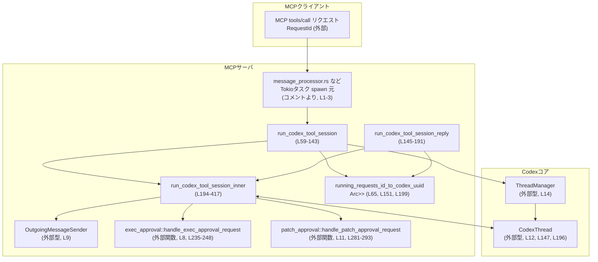
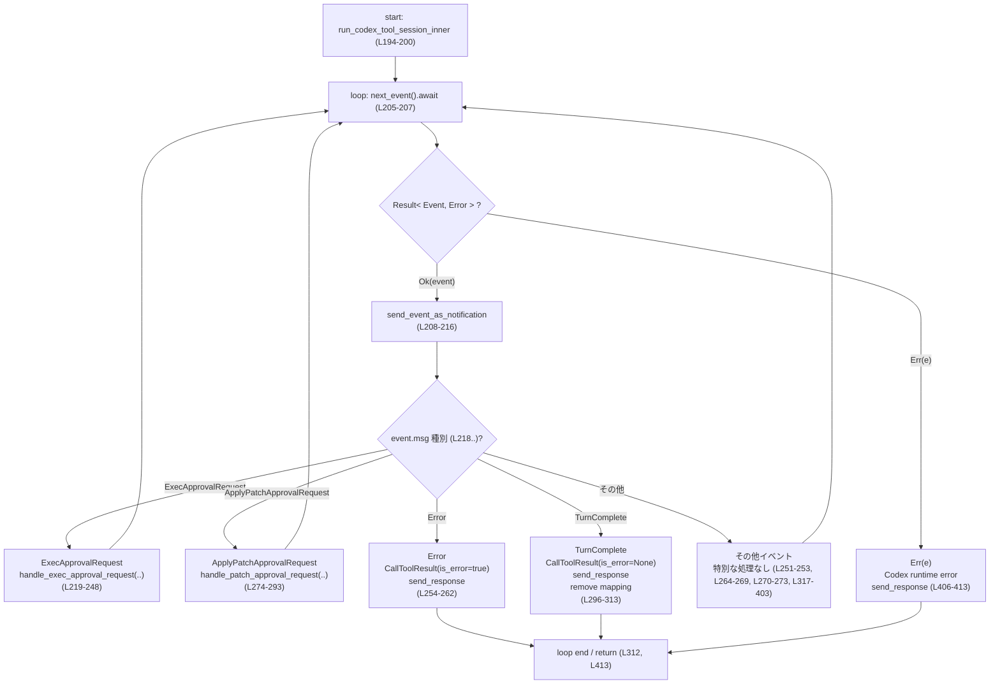
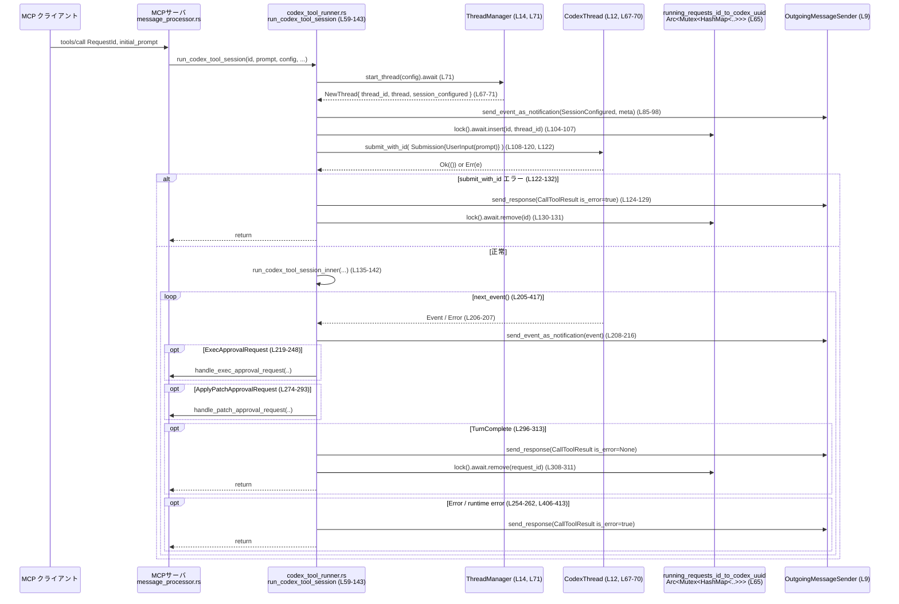

# mcp-server/src/codex_tool_runner.rs コード解説

## 0. ざっくり一言

MCP の `tools/call` 要求に対して Codex セッション（`CodexThread`）を非同期に実行し、  
Codex のイベントストリームを MCP クライアント向けのレスポンス／通知に変換するワーカーです（`run_codex_tool_session`, `run_codex_tool_session_inner` など, mcp-server/src/codex_tool_runner.rs:L59-143, L194-417）。

---

## 1. このモジュールの役割

### 1.1 概要

このモジュールは **Codex のスレッド実行と MCP ツール呼び出しの橋渡し** を行います。

- MCP 側の `RequestId` と Codex 側の `ThreadId` を対応付ける（`running_requests_id_to_codex_uuid` マップ, L65, L151, L199）。
- Codex の `ThreadManager` から新しいスレッドを開始し、初期プロンプト／追加入力を送信する（L67-83, L108-120, L157-166）。
- `CodexThread.next_event().await` でイベントをストリームし、  
  - そのまま通知として転送する（`send_event_as_notification`, L208-216）
  - 特定のイベント（Exec/Patch 承認要求, TurnComplete, Error など）を MCP の `tools/call` 応答に変換する（L218-303, L254-263, L296-313, L407-413）。

### 1.2 アーキテクチャ内での位置づけ

Codex ランタイム（`ThreadManager` / `CodexThread`）と、MCP プロトコル層（`OutgoingMessageSender`）の間に位置するアダプタです。



- `message_processor.rs` 側で Tokio タスクとしてこのモジュールの関数が呼び出されることが、ファイル先頭コメントから読み取れます（L1-3）。
- `OutgoingMessageSender` は MCP クライアント向けのメッセージ送信を抽象化するコンポーネントです（L9, L90-98, L129-130, L175-176, L261, L306-307, L412）。

### 1.3 設計上のポイント

- **状態管理の分離**
  - Codex 側の会話状態は `CodexThread` が保持し（外部型, L12, L147, L196）、  
    MCP 側から必要なのは「リクエスト ID ↔ thread ID」の対応のみであるため、共有マップにのみ状態を持たせています（`running_requests_id_to_codex_uuid`, L65, L151, L199）。
- **非同期・並行性**
  - 共有マップは `Arc<Mutex<HashMap<..>>>` としてスレッド安全に共有され、変更前には必ず `lock().await` で保護されています（L104-107, L131, L153-156, L177-180, L308-311）。
  - Codex とのやりとりはすべて `async fn` と `await` を通じて行われています（`start_thread`, `submit_with_id`, `submit`, `next_event`, L71, L122, L157-167, L206）。
- **エラーハンドリング方針**
  - 例外ではなく `Result` を使う Codex API のエラーを捕捉し、MCP の `CallToolResult` で `is_error: Some(true)` を立てたレスポンスとしてクライアントに返します（L74-81, L122-132, L254-262, L406-413）。
  - ログには `tracing::error!` を使い、原因文字列を記録します（L123, L169, L315）。
- **イベントのストリーミング**
  - すべての Codex イベントは、まず `send_event_as_notification` を通じて MCP クライアントに通知され（L208-216）、  
    その後で一部のイベントは追加処理（承認要求のハンドラ呼び出しや `CallToolResult` の返却）を行います（L218以降）。

---

## 2. 主要な機能一覧（コンポーネントインベントリー）

### 2.1 関数一覧

| 関数名 | 可視性 / 非同期 | 役割概要 | 定義位置 |
|--------|----------------|----------|----------|
| `create_call_tool_result_with_thread_id` | `pub(crate)` / sync | MCP の `tools/call` 形式に合わせて、`threadId` を `structured_content` に含む `CallToolResult` を生成するヘルパー関数 | mcp-server/src/codex_tool_runner.rs:L36-53 |
| `run_codex_tool_session` | `pub` / `async` | 新しい Codex スレッドを開始し、初期プロンプトを送信してから、内部ループで Codex イベントを処理する | mcp-server/src/codex_tool_runner.rs:L59-143 |
| `run_codex_tool_session_reply` | `pub` / `async` | 既存の Codex スレッドに対する追加入力（ユーザーの返信）を送信し、内部ループで Codex イベントを処理する | mcp-server/src/codex_tool_runner.rs:L145-191 |
| `run_codex_tool_session_inner` | `async`（モジュール内のみ） | Codex からのイベントストリームを受け取り、通知の送信・承認要求のハンドオフ・ツールコールの最終レスポンス生成を行うメインループ | mcp-server/src/codex_tool_runner.rs:L194-417 |
| `call_tool_result_includes_thread_id_in_structured_content`（テスト） | `#[test]` / sync | `create_call_tool_result_with_thread_id` が `threadId` と `content` を `structured_content` に含めることを検証 | mcp-server/src/codex_tool_runner.rs:L425-439 |

### 2.2 主要な外部コンポーネント

| 名前 | 種別 | 役割 / 用途 | 使用箇所 |
|------|------|-------------|----------|
| `OutgoingMessageSender` | 構造体（外部） | MCP クライアントへのレスポンスと通知を送信する抽象コンポーネント | インポート L9, 使用 L80-81, L90-98, L129-130, L175-176, L208-216, L261, L306-307, L412 |
| `OutgoingNotificationMeta` | 構造体（外部） | 通知に紐づく `request_id` と `thread_id` のメタ情報を付与する | インポート L10, 使用 L93-96, L211-214 |
| `ThreadManager` | 構造体（外部） | Codex セッション（`CodexThread`）の開始を管理する | インポート L14, 使用 L71 |
| `CodexThread` | 構造体（外部） | Codex セッション本体。`submit`/`submit_with_id` で入力、`next_event` でイベント取得 | インポート L12, 引数に利用 L147, L196, メソッド呼び出し L122, L157-167, L206 |
| `CodexConfig` | 構造体（外部） | Codex セッションの設定 | インポート L15, `run_codex_tool_session` の引数 L62 |
| `Event` / `EventMsg` | enum（外部） | Codex からのイベントと、それに含まれるメッセージ種別を表す | インポート L19-20, 使用 L85-89, L218-403 |
| `ExecApprovalRequestEvent` / `ApplyPatchApprovalRequestEvent` | enum / 構造体（外部） | 実行・パッチ適用の承認要求イベント | インポート L18, L21, 使用 L218-248, L274-293 |
| `TurnCompleteEvent` | 構造体（外部） | Codex のターン完了イベント（`last_agent_message` などを含む） | インポート L24, 使用 L296-303 |
| `CallToolResult`, `Content`, `RequestId` | 構造体（外部） | MCP `tools/call` のレスポンスとリクエスト識別子 | インポート L26-28, 使用 L36-52, L59-81, L122-132, L145-176, L254-262, L296-307, L406-413 |
| `handle_exec_approval_request` | 関数（外部） | 実行承認要求の内容を処理し、ユーザーへの確認フローなどを行うハンドラ | インポート L8, 呼び出し L235-248 |
| `handle_patch_approval_request` | 関数（外部） | パッチ適用承認要求の内容を処理するハンドラ | インポート L11, 呼び出し L281-293 |
| `Arc`, `Mutex<HashMap<RequestId, ThreadId>>` | 並行性プリミティブ | MCP Request と Codex Thread の対応表を複数タスク間で共有・同期する | インポート L5-6, L30, 型として L65, L151, L199, 操作 L104-107, L131, L153-156, L177-180, L308-311 |

---

## 3. 公開 API と詳細解説

### 3.1 型一覧（構造体・列挙体など）

このファイル内では新たな構造体や列挙体は定義されていません。  
ただし、モジュールの利用時に重要になる外部型を参考として挙げます。

| 名前 | 種別 | 役割 / 用途 | 根拠 |
|------|------|-------------|------|
| `Arc<OutgoingMessageSender>` | スマートポインタ | クライアントへの送信機能を複数タスクで共有する | `run_codex_tool_session` / `run_codex_tool_session_reply` の引数（L63, L148） |
| `Arc<ThreadManager>` | スマートポインタ | Codex スレッドの開始機能を共有する | `run_codex_tool_session` 引数 L64 |
| `Arc<CodexThread>` | スマートポインタ | 実行中の Codex セッションを共有する | `run_codex_tool_session_reply` 引数 L147, `run_codex_tool_session_inner` 引数 L196 |
| `Arc<Mutex<HashMap<RequestId, ThreadId>>>` | 共有状態 + ロック | MCP RequestId と Codex ThreadId の対応表をスレッド安全に保持 | 引数 L65, L151, L199; 更新 L104-107, L131, L153-156, L177-180, L308-311 |

### 3.2 関数詳細

#### `create_call_tool_result_with_thread_id(thread_id: ThreadId, text: String, is_error: Option<bool>) -> CallToolResult`

**概要**

MCP の `tools/call` レスポンス仕様に合わせて、`threadId` とレスポンステキストを `structured_content` に格納した `CallToolResult` を生成するユーティリティ関数です（L32-35, L36-52）。

**引数**

| 引数名 | 型 | 説明 |
|--------|----|------|
| `thread_id` | `ThreadId` | Codex スレッドの識別子。クライアントが後続のやりとりでスレッドを再利用できるように渡されます（L37, L44）。 |
| `text` | `String` | レスポンス本文（LLM がユーザーに返すテキスト）を表します（L38, L41-42）。 |
| `is_error` | `Option<bool>` | エラーであることを明示するフラグ。`Some(true)` でエラー、`None` / `Some(false)` で成功レスポンスとして扱われます（L39, L49）。 |

**戻り値**

- `CallToolResult`  
  - `content` フィールドには `Content::text` でラップされたテキストが格納されます（L41-42, L48）。
  - `structured_content` には `{"threadId": <ThreadId>, "content": <text>}` 形式の JSON が格納されます（L43-46, L50）。
  - `meta` は `None` で初期化されます（L51）。

**内部処理の流れ**

1. 入力の `text` を `content_text` に束縛します（L41）。
2. `content_text.clone()` を使って `Content::text` から `content` ベクタを生成します（L42）。
3. `serde_json::json!` マクロで `threadId` と `content` を含む JSON オブジェクトを生成します（L43-46）。
4. これらをフィールドにセットした `CallToolResult` を返します（L47-52）。

**Examples（使用例）**

テストコードに使用例があります（L425-439）。

```rust
use codex_protocol::ThreadId;
use rmcp::model::CallToolResult;
use serde_json::json;

fn example() {
    let thread_id = ThreadId::new();                     // Codex のスレッドIDを生成
    let result: CallToolResult =
        create_call_tool_result_with_thread_id(
            thread_id,
            "done".to_string(),
            None,                                       // エラーではない
        );

    // structured_content には threadId と content が入っている
    assert_eq!(
        result.structured_content,
        Some(json!({
            "threadId": thread_id,
            "content": "done",
        }))
    );
}
```

**Errors / Panics**

- この関数内で `Result` は使用しておらず、ランタイムエラーや panic を起こす操作は見当たりません（単純なコピーと JSON 構築のみ, L41-52）。

**Edge cases（エッジケース）**

- `text` が空文字列でも、そのまま `content` と `structured_content.content` に格納されます。特別な処理はありません（L41-46）。
- `is_error` が `None` の場合でも、フィールド自体は `None` としてそのまま渡され、判断は上位レイヤーに委ねられます（L49）。

**使用上の注意点**

- MCP クライアントによっては `content` より `structured_content` を優先して解釈するため、両方に同じテキストを入れる実装になっています（コメント L34-35）。この前提を変えると一部のクライアントで期待通りに表示されない可能性があります。

---

#### `run_codex_tool_session(id: RequestId, initial_prompt: String, config: CodexConfig, outgoing: Arc<OutgoingMessageSender>, thread_manager: Arc<ThreadManager>, running_requests_id_to_codex_uuid: Arc<Mutex<HashMap<RequestId, ThreadId>>>)`

**概要**

新しい Codex セッション（`CodexThread`）を開始し、`initial_prompt` を最初のユーザー入力として送信した後、Codex のイベントループ（`run_codex_tool_session_inner`）に処理を委ねる関数です（L55-59, L135-142）。

**引数**

| 引数名 | 型 | 説明 |
|--------|----|------|
| `id` | `RequestId` | MCP の `tools/call` リクエストを一意に識別する ID（L60）。 |
| `initial_prompt` | `String` | Codex セッションの最初のユーザー入力テキスト（L61, L112）。 |
| `config` | `CodexConfig` | Codex スレッド起動時の設定（L62, L71）。 |
| `outgoing` | `Arc<OutgoingMessageSender>` | クライアントへのレスポンス・通知送信用（L63, L80-81, L90-98, L129-130）。 |
| `thread_manager` | `Arc<ThreadManager>` | Codex スレッドの開始を行うマネージャ（L64, L71）。 |
| `running_requests_id_to_codex_uuid` | `Arc<Mutex<HashMap<RequestId, ThreadId>>>` | MCP RequestId と Codex ThreadId の対応を管理する共有マップ（L65, L104-107, L131）。 |

**戻り値**

- `async fn` ですが戻り値型は `()` で、結果はすべて MCP クライアントへの送信（`outgoing`）として副作用で表現されます（シグネチャ L59-66, 本体に `return` はあるが値は返していない L81-82, L132-133）。

**内部処理の流れ**

1. `thread_manager.start_thread(config).await` で新しい Codex スレッドを開始します（L71）。
   - 成功時：`NewThread { thread_id, thread, session_configured }` を取得（L67-71）。
   - 失敗時：エラーメッセージを含む `CallToolResult` を生成して `send_response` し、早期リターンします（L72-82）。
2. セッション設定完了イベント `Event { id: "", msg: EventMsg::SessionConfigured(session_configured.clone()) }` を構成し（L85-89）、通知として送信します（L90-98）。
3. MCP の `RequestId` を Codex の `Submission.id` に使うため `sub_id` を `id.to_string()` から作成します（L100-103）。
4. `running_requests_id_to_codex_uuid` マップに `id -> thread_id` を登録します（L104-107）。
5. `Submission` を構築し、`Op::UserInput` として `initial_prompt` を `UserInput::Text` に入れます（L108-120）。
6. `thread.submit_with_id(submission).await` を呼び出します（L122）。
   - エラー時：エラーログを出し（L123）、`CallToolResult` でエラー応答を送信し（L124-129）、マップから `id` を削除して（L130-131）リターンします（L132）。
7. 正常に送信できた場合、`run_codex_tool_session_inner` を呼び出し、イベントループを開始します（L135-142）。

**Examples（使用例）**

以下は、MCP の `tools/call` ハンドラからこの関数を呼び出す想定の擬似コードです。

```rust
use std::sync::Arc;
use tokio::sync::Mutex;
use std::collections::HashMap;
use codex_protocol::ThreadId;
use rmcp::model::RequestId;

async fn handle_tools_call(
    id: RequestId,                                      // MCP の RequestId
    prompt: String,                                     // ユーザーからの初期プロンプト
    config: CodexConfig,                               // Codex の設定
    outgoing: Arc<OutgoingMessageSender>,              // 送信チャンネル
    thread_manager: Arc<ThreadManager>,                // Codex の ThreadManager
    running_map: Arc<Mutex<HashMap<RequestId, ThreadId>>>, // 共有マップ
) {
    // 新規の Codex セッションを開始し、イベント処理ループに入る
    run_codex_tool_session(
        id,
        prompt,
        config,
        outgoing,
        thread_manager,
        running_map,
    ).await;
}
```

**Errors / Panics**

- `start_thread` のエラー:
  - `"Failed to start Codex session: {e}"` というメッセージで `is_error: Some(true)` の `CallToolResult` がクライアントに返されます（L74-78, L80-81）。
- `submit_with_id` のエラー:
  - エラーログ出力（`tracing::error!`）の後、`"Failed to submit initial prompt: {e}"` でエラー応答を返し（L123-129）、`running_requests_id_to_codex_uuid` から該当 `id` を削除します（L130-131）。
- この関数内で panic を発生させる可能性のある `unwrap` や `expect` は使われていません。

**Edge cases（エッジケース）**

- `initial_prompt` が空文字列の場合でも、そのまま `UserInput::Text` に渡されます（L112-115）。Codex 側の扱いはこのコードからは分かりません。
- `running_requests_id_to_codex_uuid` は、`submit_with_id` が失敗した場合のみ明示的に削除されます（L130-131）。  
  その後のイベントループ内での削除は `TurnComplete` 時のみ実施されます（L296-313, L308-311）。

**使用上の注意点**

- `run_codex_tool_session` 自体はどこからも cancel されない限り、内部で `run_codex_tool_session_inner` を呼び、その中のイベントループが `break` するまでブロックし続けます（L135-142, L205-417）。  
  これを呼び出す側では Tokio タスクとして独立して spawn する前提です（モジュールコメント L1-3）。
- `running_requests_id_to_codex_uuid` は他の処理（例えばキャンセル処理）でも参照される可能性があり、  
  マップへの登録・削除タイミングを変更する場合は、他モジュールとの整合性に注意する必要があります（L104-107, L130-131, L308-311）。

---

#### `run_codex_tool_session_reply(thread_id: ThreadId, thread: Arc<CodexThread>, outgoing: Arc<OutgoingMessageSender>, request_id: RequestId, prompt: String, running_requests_id_to_codex_uuid: Arc<Mutex<HashMap<RequestId, ThreadId>>>)`

**概要**

既に存在する Codex スレッドに対して、ユーザーからの追加入力（返信）を送信し、その後は新規セッションと同様に `run_codex_tool_session_inner` でイベント処理を行います（L145-152, L184-191）。

**引数**

| 引数名 | 型 | 説明 |
|--------|----|------|
| `thread_id` | `ThreadId` | 対象の Codex スレッドID（L146, L156-157, L171-172, L185）。 |
| `thread` | `Arc<CodexThread>` | 対応する Codex スレッドオブジェクト（L147, L157-167, L186）。 |
| `outgoing` | `Arc<OutgoingMessageSender>` | MCP クライアントへの送信チャネル（L148, L175-176, L187）。 |
| `request_id` | `RequestId` | この返信に対応する MCP 側のリクエスト ID（L149, L153-156, L175-176, L188-189）。 |
| `prompt` | `String` | 追加入力テキスト（L150, L160）。 |
| `running_requests_id_to_codex_uuid` | `Arc<Mutex<HashMap<RequestId, ThreadId>>>` | MCP RequestId と Codex ThreadId の対応表（L151, L153-156, L177-180, L189-190）。 |

**戻り値**

- 戻り値型は `()` で、副作用としてレスポンス・通知送信を行います（シグネチャ L145-152, 本体 L153-191）。

**内部処理の流れ**

1. `running_requests_id_to_codex_uuid` に `request_id -> thread_id` を登録します（L153-156）。
2. `thread.submit(Op::UserInput { ... }).await` で追加入力を Codex に送信します（L157-167）。
3. 送信に失敗した場合:
   - エラーログを出力し（L169）、`"Failed to submit user input: {e}"` というメッセージを含む `CallToolResult` でエラー応答を返します（L170-175）。
   - 対応表から `request_id` を削除します（L177-180）。
   - 関数を終了します（L181-182）。
4. 成功した場合:
   - `run_codex_tool_session_inner` を呼び出し、イベントループに入ります（L184-191）。

**Examples（使用例）**

既に `ThreadId` と `Arc<CodexThread>` を保持している場合の呼び出し例です。

```rust
async fn handle_reply(
    request_id: RequestId,
    reply_text: String,
    thread_id: ThreadId,
    thread: Arc<CodexThread>,
    outgoing: Arc<OutgoingMessageSender>,
    running_map: Arc<Mutex<HashMap<RequestId, ThreadId>>>,
) {
    run_codex_tool_session_reply(
        thread_id,
        thread,
        outgoing,
        request_id,
        reply_text,
        running_map,
    ).await;
}
```

**Errors / Panics**

- `thread.submit(..).await` のエラー時には、エラーメッセージ付きの `CallToolResult` を返し、対応表から `request_id` を削除します（L169-176, L177-180）。
- panic を誘発する操作はありません。

**Edge cases（エッジケース）**

- `prompt` が空でも、そのまま `UserInput::Text` として Codex に送信されます（L160-163）。
- `running_requests_id_to_codex_uuid` には `run_codex_tool_session` とは別の `RequestId` をキーに登録されるため、新規セッションと既存セッションの区別は `RequestId` の値によってのみ行われます（L153-156）。

**使用上の注意点**

- `thread_id`／`thread` は、必ず一致する同じ Codex スレッドに対応している必要があります。この整合性は呼び出し側で保証する前提であり、この関数自身では検証していません（L145-152, L157-167, L185-186）。
- 返信ごとに新しい `RequestId` を割り当てる設計であれば、対応表には複数の `RequestId` が同一 `thread_id` を指すケースも想定されます。マップの設計・利用方法は他モジュールの仕様に依存します。

---

#### `run_codex_tool_session_inner(thread_id: ThreadId, thread: Arc<CodexThread>, outgoing: Arc<OutgoingMessageSender>, request_id: RequestId, running_requests_id_to_codex_uuid: Arc<Mutex<HashMap<RequestId, ThreadId>>>)`

**概要**

Codex スレッドからのイベントをストリーミングし、  

- すべてのイベントを MCP 通知として転送しつつ（L208-216）、  
- 特定のイベント（Exec/Patch 承認要求, `Error`, `TurnComplete` など）に対して追加処理を行う  
メインのイベントループです（L203-205, L205-417）。

**引数**

| 引数名 | 型 | 説明 |
|--------|----|------|
| `thread_id` | `ThreadId` | 対象 Codex スレッド ID（L195, L213-214, L246-247, L291-292, L304, L407-410）。 |
| `thread` | `Arc<CodexThread>` | イベントを取得する Codex スレッド（L196, L206, L239-240, L287-288）。 |
| `outgoing` | `Arc<OutgoingMessageSender>` | MCP クライアントへの通知／レスポンス送信（L197, L208-216, L261, L306-307, L412）。 |
| `request_id` | `RequestId` | このツールコールに対応する MCP リクエスト ID（L198, L212, L235-241, L288-289, L261, L306-307, L308-311, L412-413）。 |
| `running_requests_id_to_codex_uuid` | `Arc<Mutex<HashMap<RequestId, ThreadId>>>` | リクエスト ID と thread ID のマッピング（L199, L308-311）。 |

**戻り値**

- 戻り値型は `()` で、副作用として通知・レスポンスの送信とマップの更新を行います（シグネチャ L194-200, 本体 L201-417）。

**内部処理の流れ（アルゴリズム）**

1. `request_id` を文字列に変換して `request_id_str` に保存します（L201）。
2. 無限ループを開始し、毎回 `thread.next_event().await` を呼び出します（L205-207）。
3. `Ok(event)` の場合:
   1. まず `OutgoingNotificationMeta { request_id: Some(request_id.clone()), thread_id: Some(thread_id) }` を添えて `send_event_as_notification` を呼び出し、MCP クライアントにイベントを通知します（L208-216）。
   2. `match event.msg` でイベント種別に応じた処理を行います（L218-403）。主な分岐は以下の通り：
      - **`ExecApprovalRequest`**（L219-250）  
        - `ev.effective_approval_id()` で最終的な承認 ID を取得し（L220）、`ExecApprovalRequestEvent` のフィールドを分解します（L221-234）。
        - `handle_exec_approval_request` に必要な情報（`command`, `cwd`, `call_id`, `approval_id`, `parsed_cmd` など）を渡して非同期で処理します（L235-248）。
        - `continue;` でループ先頭に戻ります（L249）。
      - **`PlanDelta`**（L251-253）  
        - 追加処理をせずに `continue`（L251-253）。
      - **`Error`**（L254-263）  
        - `err_event.message` を使ってエラーレスポンスを生成し（L254-260）、`send_response` で返します（L261）。
        - `break` してループを終了します（L262）。
      - **`Warning`, `GuardianAssessment`**（L264-269）  
        - 追加処理なく `continue`（L264-269）。
      - **`ElicitationRequest`**（L270-273）  
        - TODO コメント付きで将来的なクライアント転送を検討しているが、現状は `continue`（L270-273）。
      - **`ApplyPatchApprovalRequest`**（L274-295）  
        - 構造体分解で必要なフィールドを取り出し（L274-280）、`handle_patch_approval_request` に渡して処理します（L281-293）。
        - `continue` で次のイベントへ（L294）。
      - **`TurnComplete`**（L296-313）  
        - `last_agent_message` が `Some` ならその文字列を、`None` なら空文字列 `""` を `text` とします（L296-302）。
        - `create_call_tool_result_with_thread_id` で成功レスポンスを生成し（`is_error: None`, L303-305）、`send_response` します（L306-307）。
        - `running_requests_id_to_codex_uuid` から `request_id` を削除します（L308-311）。
        - `break` してループを終了します（L312）。
      - **`SessionConfigured`**（L314-316）  
        - ここに届くのは想定外としてエラーログを出します（L315）。
      - その他多数のイベント種別（`ThreadNameUpdated` から `DeprecationNotice` まで, L317-403）  
        - コメントにあるように、追加処理は行わず、既に送信済みの通知のみとします（L397-402）。
4. `Err(e)`（`next_event` がエラー）の場合:
   - `"Codex runtime error: {e}"` というメッセージを含む `CallToolResult` を生成し（L406-411）、`send_response` でエラー応答を返します（L412）。
   - その後 `break` でループを終了します（L413）。

**Mermaid フロー図（イベント処理）**

`run_codex_tool_session_inner (L194-417)` のイベント処理フローを示します。



**Errors / Panics**

- `thread.next_event().await` が `Err` を返した場合、汎用的な `"Codex runtime error: {e}"` として `is_error: Some(true)` の `CallToolResult` が返されます（L406-413）。
- `EventMsg::Error` イベントも `is_error: Some(true)` 付きでエラー応答へ変換されます（L254-262）。
- この関数内で明示的に panic を発生させるコードはありません。

**Edge cases（エッジケース）**

- `EventMsg::TurnComplete` で `last_agent_message` が `None` の場合、空文字がレスポンスとして返されます（L299-302）。  
  これは「出力が何もないターン」に対する扱いとして設計されていると解釈できます。
- `EventMsg::Error` または `thread.next_event()` のエラー時には、`running_requests_id_to_codex_uuid` の対応表から `request_id` を削除していません（L254-262, L406-413 と L308-311 の対比）。  
  そのため、マップにエントリが残り続ける可能性があります（詳細は「潜在的なバグ・セキュリティ上の注意」を参照）。

**使用上の注意点**

- ループは `TurnComplete`、`EventMsg::Error`、または `next_event` のエラーでのみ終了します（L254-263, L296-313, L406-413）。  
  他のイベントでは `continue` または単に次ループへ進むだけです（L251-253, L264-269, L270-273, L326-403）。
- `handle_exec_approval_request`／`handle_patch_approval_request` は非同期に呼び出され、その完了は `await` で待っています（L235-248, L281-293）。  
  これにより、承認フローが完了するまで次のイベントには進みません。承認処理自体も非同期で行われるため、ブロッキング I/O を避ける設計と推測できますが、詳細は他ファイルを参照する必要があります。

---

### 3.3 その他の関数

| 関数名 | 役割（1 行） | 定義位置 |
|--------|--------------|----------|
| `call_tool_result_includes_thread_id_in_structured_content` | `create_call_tool_result_with_thread_id` が `threadId` と `content` を `structured_content` に含めることを検証するユニットテスト | mcp-server/src/codex_tool_runner.rs:L425-439 |

---

## 4. データフロー

### 4.1 代表的なシナリオ：新規 Codex セッションの実行

`run_codex_tool_session (L59-143)` を通じて新規 Codex セッションを開始し、その後 `run_codex_tool_session_inner (L194-417)` でイベントを処理する一連のデータフローです。



要点：

- MCP クライアントに対しては、途中のすべての Codex イベントが通知としてストリームされます（`send_event_as_notification`, L208-216）。
- セッション完了（`TurnComplete`）またはエラー発生時（`EventMsg::Error` または `next_event` のエラー）に `CallToolResult` を返し、`tools/call` を完結させています（L254-262, L296-307, L406-413）。
- 完了時には対応表マップから `request_id` を削除しますが（L308-311）、エラー時には削除されていないことに注意が必要です。

---

## 5. 使い方（How to Use）

### 5.1 基本的な使用方法

典型的には、MCP サーバのメッセージ処理モジュールから、このモジュールの関数を Tokio タスクとして呼び出す形になります（モジュールコメント L1-3）。

```rust
use std::sync::Arc;
use tokio::sync::Mutex;
use std::collections::HashMap;
use codex_core::{ThreadManager, config::Config as CodexConfig};
use codex_protocol::{ThreadId};
use rmcp::model::RequestId;
use crate::outgoing_message::OutgoingMessageSender;
use crate::codex_tool_runner::run_codex_tool_session;

struct AppContext {
    thread_manager: Arc<ThreadManager>,                      // Codex の ThreadManager
    outgoing: Arc<OutgoingMessageSender>,                    // 送信チャネル
    running_map: Arc<Mutex<HashMap<RequestId, ThreadId>>>,   // RequestId→ThreadId 対応表
}

async fn handle_tools_call(ctx: Arc<AppContext>, id: RequestId, prompt: String) {
    let config: CodexConfig = /* Codex の設定を構築 */;

    // 独立した Tokio タスクとして Codex セッションを開始する
    tokio::spawn({
        let ctx = ctx.clone();
        async move {
            run_codex_tool_session(
                id,
                prompt,
                config,
                ctx.outgoing.clone(),
                ctx.thread_manager.clone(),
                ctx.running_map.clone(),
            ).await;
        }
    });
}
```

- ここでは `tokio::spawn` の中で `run_codex_tool_session` を呼び出し、他のリクエスト処理と並行して進行できるようにしています。
- `running_map` は複数のリクエスト間で共有されるため、`Arc<Mutex<_>>` でラップされています（L65, L151, L199）。

### 5.2 よくある使用パターン

1. **新規セッション開始**
   - `run_codex_tool_session` を呼び出して新しい Codex スレッドを開始し、`ThreadId` はレスポンスの `structured_content.threadId` から取得します（L36-46, L296-305）。
2. **既存セッションへ返信**
   - 既に保有している `ThreadId` と `Arc<CodexThread>` を使い、`run_codex_tool_session_reply` に `prompt` を渡します（L145-152）。
   - 返信ごとに新しい MCP `RequestId` を割り当てる設計であれば、その都度 `running_requests_id_to_codex_uuid` に `RequestId -> ThreadId` が登録されます（L153-156）。

### 5.3 よくある間違い（想定されるもの）

```rust
// 誤り例: ThreadId と CodexThread の対応が不明なまま run_codex_tool_session_reply を呼ぶ
let thread_id = ThreadId::new();            // 新しく作っただけで意味のない ID
let thread: Arc<CodexThread> = /* 別のスレッド */;

run_codex_tool_session_reply(
    thread_id,
    thread,
    outgoing.clone(),
    request_id,
    prompt,
    running_map.clone(),
);
// -> thread_id と thread のペアが矛盾していると、クライアント側の表示が混乱し得る
```

```rust
// 正しい例: 以前 run_codex_tool_session で開始したスレッドから取得したペアを使用する
let (thread_id, thread): (ThreadId, Arc<CodexThread>) = /* 保存しておいたもの */;

run_codex_tool_session_reply(
    thread_id,
    thread,
    outgoing.clone(),
    request_id,
    prompt,
    running_map.clone(),
);
```

- `run_codex_tool_session_reply` は、`thread_id` と `thread` が一貫したペアであることを前提としており、その検証は行っていません（L145-152, L157-167, L185-186）。

### 5.4 モジュール全体の注意点（まとめ）

- **非同期実行の前提**  
  - 本モジュールの公開関数は `async fn` であり、Tokio などの async ランタイム上で動かすことを前提としています（L59, L145, L194）。
- **共有マップの利用**  
  - `running_requests_id_to_codex_uuid` は `Arc<Mutex<_>>` を通じて複数タスクからアクセスされます（L65, L151, L199）。  
    長時間ロックを保持している箇所はなく、挿入・削除のみの短時間操作です（L104-107, L131, L153-156, L177-180, L308-311）。
- **マッピング削除のタイミング**  
  - 正常終了（`TurnComplete`）や入力送信の失敗時にはマップから削除されますが（L130-131, L308-311）、  
    `EventMsg::Error` や `next_event` のエラー時には削除されません（L254-262, L406-413）。  
    この点は「潜在的なバグ・セキュリティ上の注意」で詳述します。

---

## 6. 変更の仕方（How to Modify）

### 6.1 新しいイベント種別を特別処理したい場合

1. `EventMsg` の `match` 節に対象の分岐を追加する（L218-403）。
2. そのイベントに対して:
   - MCP クライアントへの追加通知が必要であれば `OutgoingMessageSender` や `CallToolResult` を使って送信する。
   - 承認が必要な種別であれば、新しいハンドラ関数（`handle_xxx_approval_request` のような形）を別モジュールに追加し、ここから呼び出す（`handle_exec_approval_request`, `handle_patch_approval_request` の例, L235-248, L281-293）。
3. 必要なら `running_requests_id_to_codex_uuid` マップの更新（削除）タイミングも調整する。

### 6.2 既存の機能を変更する場合の注意

- **マップのライフサイクル**
  - 現状、`TurnComplete` と「送信失敗」時のみ `running_requests_id_to_codex_uuid` からエントリを削除しています（L130-131, L308-311）。
  - エラー時に削除を追加するなど仕様を変更する場合は、マップを利用する他モジュール（キャンセル処理など）がどのような前提を置いているかを確認する必要があります。
- **Codex イベント → MCP プロトコルへの変換**
  - `create_call_tool_result_with_thread_id` の JSON 形式（`threadId` / `content`）や `is_error` フラグの扱いは、クライアント側との契約の一部になっています（L32-35, L36-52, テスト L425-439）。変更する場合はクライアント側の挙動を確認する必要があります。
- **エラー・ロギング**
  - `tracing::error!` を使っている箇所（L123, L169, L315）を別のロギング方針に変える場合、既存の監視・アラートとの連携に影響が出ないか確認が必要です。

---

## 7. 関連ファイル

| パス | 役割 / 関係 |
|------|-------------|
| `mcp-server/src/message_processor.rs`（推定） | モジュールコメントにあるように、このファイルから本モジュールの関数を spawn していると推測されます（L1-3）。実際の関数呼び出し元です。 |
| `mcp-server/src/outgoing_message.rs` | `OutgoingMessageSender` と `OutgoingNotificationMeta` の定義元であり、クライアントへの通知／レスポンス送信ロジックを提供します（インポート L9-10）。 |
| `mcp-server/src/exec_approval.rs` | `handle_exec_approval_request` の定義元で、`ExecApprovalRequestEvent` をユーザー承認フローなどに変換する責務を持ちます（インポート L8, 呼び出し L235-248）。 |
| `mcp-server/src/patch_approval.rs` | `handle_patch_approval_request` の定義元で、`ApplyPatchApprovalRequestEvent` に基づくパッチ適用承認を処理します（インポート L11, 呼び出し L281-293）。 |
| `codex_core` クレート | `ThreadManager`, `CodexThread`, `NewThread` など Codex ランタイムのコア機能を提供します（インポート L12-15, 使用 L67-72, L122, L157-167, L206）。 |
| `codex_protocol` クレート | `Event`, `EventMsg`, `TurnCompleteEvent`, `UserInput` など Codex と MCP 間でやりとりされるプロトコル型を定義します（インポート L16-25, 使用 L85-89, L108-120, L218-403）。 |
| `rmcp::model` | MCP の `RequestId`, `CallToolResult`, `Content` 型を提供し、本モジュールの入出力の要となる型です（インポート L26-28, 使用 L36-52, L59-81, L122-132, L145-176, L254-262, L296-307, L406-413）。 |

---

## 補足: 潜在的なバグ・セキュリティ / 契約・エッジケース / テスト / パフォーマンス・観測性

### 潜在的なバグ・セキュリティ上の注意

- **`running_requests_id_to_codex_uuid` のエントリが残り続ける可能性**
  - `TurnComplete` 時にはマップから `request_id` を削除していますが（L296-313, 特に L308-311）、`EventMsg::Error` および `next_event` の `Err(e)` の場合には削除処理がありません（L254-262, L406-413）。
  - そのため、Codex 側のエラーでセッションが終了した場合に、マップ内の対応関係だけが残り続ける可能性があります。
  - このマップが他の API からも参照され、例えば「実行中リクエスト一覧」や「キャンセル対象判定」に使われている場合、実際には終了しているリクエストが「まだ生きている」と誤認される恐れがあります。
- **セキュリティ的観点**
  - このモジュール自身は OS コマンド実行などを行っておらず、`command` や `cwd` をそのまま `handle_exec_approval_request` に渡しているだけです（L221-225, L235-246）。
  - 実行コマンドの検証・サンドボックス化等のセキュリティは `exec_approval` 側の責務と考えられます。

### 契約・エッジケースのまとめ

- MCP クライアントとの契約:
  - `CallToolResult.structured_content` に `threadId` と `content` を含めることがテストで保証されています（L32-35, L36-52, L425-439）。
  - エラー時には必ず `is_error: Some(true)` が設定されます（L74-78, L124-128, L254-260, L409-410）。
- Codex との契約:
  - `start_thread` に渡す `CodexConfig` や `submit`/`submit_with_id` に渡す `Submission` は、Codex プロトコル仕様に従った形で構築されています（L67-72, L108-120, L157-167）。

### テスト

- 現在のところ、ユニットテストは `create_call_tool_result_with_thread_id` の JSON 構造を検証するものが 1 つ存在します（L419-439）。
- イベントループ全体の統合テストやエラー時のマップ状態を検証するテストは、このファイル内にはありません。

### パフォーマンスとスケーラビリティに関する補足

- イベント処理は 1 セッションにつき 1 つのループで直列に処理されます（L205-417）。  
  各セッションを個別の Tokio タスクに乗せることで、セッション間の並行性を確保できます。
- `Arc<Mutex<HashMap<..>>>` に対するロック操作は、挿入・削除のみであり、比較的短時間で終了するため、高頻度アクセス下でもボトルネックにはなりにくい設計です（L104-107, L131, L153-156, L177-180, L308-311）。

### 観測性

- エラー発生時には `tracing::error!` を使用してログを出力しています（L123, L169, L315）。
- Codex イベントの大半は `send_event_as_notification` を通じて外部可視化されるため、クライアント側のログや UI からセッションの進行状況を把握できます（L208-216, コメント L397-402）。
