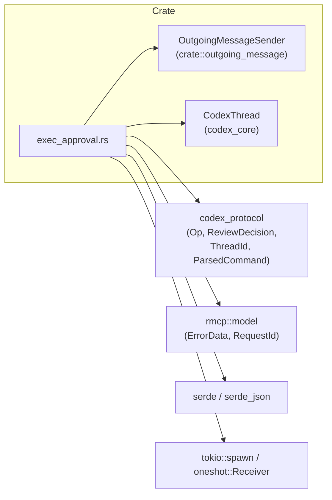
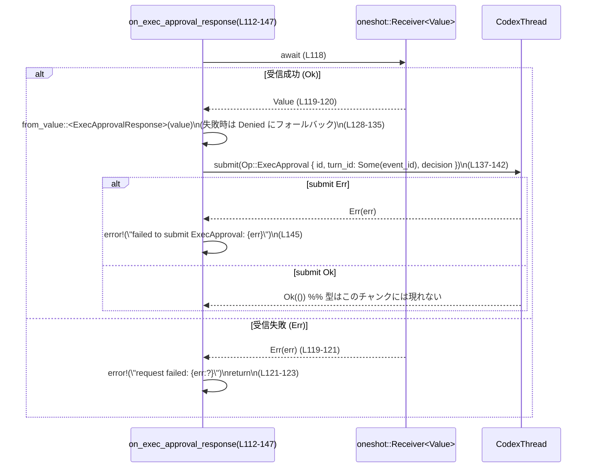
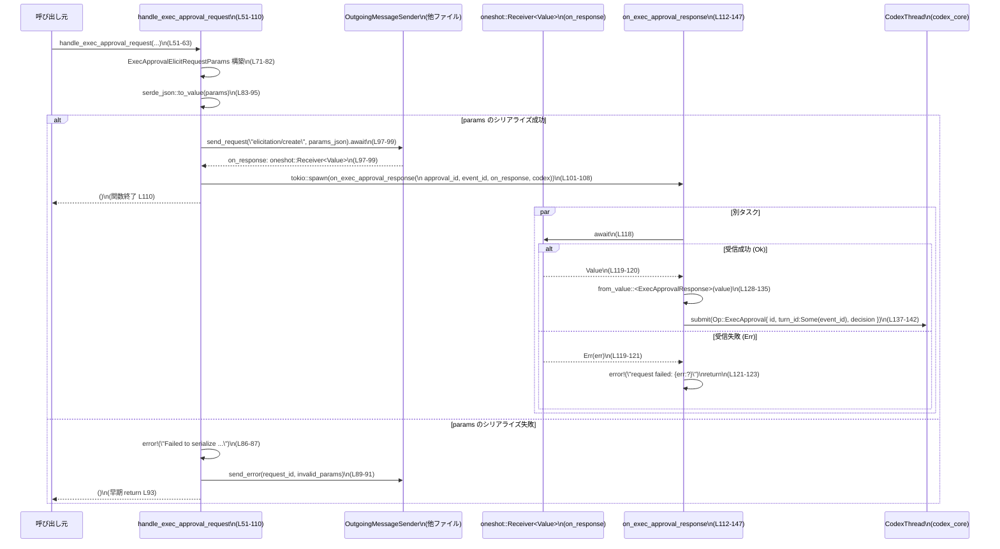

# mcp-server/src/exec_approval.rs

## 0. ざっくり一言

`exec_approval.rs` は、Codex が外部コマンドを実行する前に、MCP の `elicitation/create` を使ってユーザーに実行許可を問い合わせ、その応答を `Op::ExecApproval` として `CodexThread` に渡すためのモジュールです（`exec_approval.rs:L17-18`, `L51-63`, `L137-142`）。

---

## 1. このモジュールの役割

### 1.1 概要

- このモジュールは **コマンド実行の承認フロー** を扱います。
- Codex が実行しようとしているコマンドとコンテキスト情報を `ExecApprovalElicitRequestParams` として JSON 化し、MCP クライアント（`OutgoingMessageSender`）経由で `elicitation/create` リクエストとして送信します（`exec_approval.rs:L51-82`, `L97-99`）。
- そのレスポンスを `ExecApprovalResponse` としてデシリアライズし、`Op::ExecApproval` を `CodexThread` に送信します（`exec_approval.rs:L112-135`, `L137-142`）。

### 1.2 アーキテクチャ内での位置づけ

このモジュールは、以下のコンポーネントと連携して動作します。

- `crate::outgoing_message::OutgoingMessageSender`  
  - MCP プロトコル経由で `elicitation/create` リクエストを送信し、`oneshot::Receiver<Value>` を返す（`exec_approval.rs:L54`, `L97-99`）。
- `CodexThread` (`codex_core`)  
  - `submit(Op::ExecApproval { ... })` を受け取り、実際の承認結果を Codex 内に反映する（`exec_approval.rs:L4`, `L137-142`）。
- `codex_protocol`  
  - `ThreadId`, `ParsedCommand`, `Op::ExecApproval`, `ReviewDecision` などのプロトコル型を提供（`exec_approval.rs:L5-8`, `L36-38`, `L137-142`）。
- `rmcp::model`  
  - `RequestId`, `ErrorData` によるリクエスト識別とエラー表現（`exec_approval.rs:L9-10`, `L89-91`）。

依存関係を簡略に示すと次のようになります。



※ OutgoingMessageSender や CodexThread の具体的な実装・ファイルパスはこのチャンクには現れません。

### 1.3 設計上のポイント

- **MCP `elicitation/create` への準拠**  
  - `ExecApprovalElicitRequestParams` は MCP の `ElicitRequestParams` 互換の形を取りつつ、Codex 固有のメタデータを追加します（`exec_approval.rs:L17-18`, `L20-38`）。
- **非同期・非ブロッキング設計**  
  - 承認レスポンス待ちを `tokio::spawn` で別タスクにし、呼び出し元（エージェントのメインループ）をブロックしないようにしています（`exec_approval.rs:L101-108`）。
- **エラー時は「保守的に拒否」**  
  - ExecApproval のレスポンス JSON を `ExecApprovalResponse` としてデシリアライズできなかった場合、`ReviewDecision::Denied` を採用する実装になっています（`exec_approval.rs:L128-135`）。
- **明示的なエラーレポート**  
  - パラメータの JSON 変換失敗時には、`ErrorData::invalid_params` を使って呼び出し元へエラーを返し（`exec_approval.rs:L83-94`）、`tracing::error!` でログを記録します（`exec_approval.rs:L86-87`）。
- **状態を持たないユーティリティ的構造**  
  - このファイル内に構造体のインスタンス保持やグローバル状態はなく、`async fn` とデータ構造だけで構成されています。

---

## 2. 主要な機能一覧

- `ExecApprovalElicitRequestParams`: MCP `elicitation/create` リクエストの `params` 部分を表現し、Codex 固有の識別情報やコマンド情報を含む構造体（`exec_approval.rs:L20-38`）。
- `ExecApprovalResponse`: 承認結果として `ReviewDecision` だけを保持する構造体（`exec_approval.rs:L45-48`）。
- `handle_exec_approval_request`: コマンド実行承認リクエストを組み立てて `elicitation/create` を送信し、レスポンスを処理するタスクを起動する非公開 API（crate 内公開）（`exec_approval.rs:L51-110`）。
- `on_exec_approval_response`: `elicitation/create` のレスポンス JSON を受け取り、`Op::ExecApproval` を `CodexThread` に送信する内部非同期関数（`exec_approval.rs:L112-147`）。

---

## 3. 公開 API と詳細解説

### 3.1 型一覧（構造体など）

| 名前 | 種別 | 役割 / 用途 | 定義位置 |
|------|------|-------------|----------|
| `ExecApprovalElicitRequestParams` | 構造体 | MCP の `elicitation/create` リクエスト `params` の形に準拠しつつ、Codex のコマンド実行情報や識別子を含めるパラメータペイロード | `exec_approval.rs:L20-38` |
| `ExecApprovalResponse` | 構造体 | `elicitation/create` の応答から ExecApproval に必要な決定 (`ReviewDecision`) を受け取るための最小限のレスポンス型 | `exec_approval.rs:L45-48` |

#### `ExecApprovalElicitRequestParams` フィールド概要

- MCP 仕様互換フィールド（コメントより、ElicitRequestParams 互換であることが示唆されています。`exec_approval.rs:L21-22`）:
  - `message: String` — 承認ダイアログに表示されるメッセージ（`exec_approval.rs:L23`, `L66-69`）。
  - `requested_schema: Value` (`serde_json::Value`, `requestedSchema` にリネーム) — 期待する回答のスキーマ。ここでは空オブジェクト（`{"type":"object","properties":{}}`）に固定されています（`exec_approval.rs:L25-27`, `L73`）。
- Codex 固有の追加フィールド（`exec_approval.rs:L28-38`）:
  - `thread_id: ThreadId` (`threadId` にリネーム) — Codex のスレッド識別子（`exec_approval.rs:L30-31`）。
  - `codex_elicitation: String` — この elicitation の種別。ここでは `"exec-approval"` が設定されています（`exec_approval.rs:L32`, `L75`）。
  - `codex_mcp_tool_call_id: String` — MCP ツール呼び出し ID（`exec_approval.rs:L33`, `L76`）。
  - `codex_event_id: String` — Codex 側イベント ID（`exec_approval.rs:L34`, `L77`）。
  - `codex_call_id: String` — Codex 側呼び出し ID（`exec_approval.rs:L35`, `L78`）。
  - `codex_command: Vec<String>` — 実行予定コマンドのトークン列（`exec_approval.rs:L36`, `L79`）。
  - `codex_cwd: PathBuf` — コマンド実行予定のカレントディレクトリ（`exec_approval.rs:L37`, `L80`）。
  - `codex_parsed_cmd: Vec<ParsedCommand>` — コマンドのパース結果（`exec_approval.rs:L38`, `L81`）。

#### `ExecApprovalResponse` フィールド概要

- `decision: ReviewDecision` — 承認結果。`ReviewDecision` は `codex_protocol::protocol` からインポートされており（`exec_approval.rs:L8`, `L47`）、具体的なバリアント（例: Approved, Denied）はこのチャンクには現れません。

### 3.2 関数詳細

#### `handle_exec_approval_request(...) -> ()`

```rust
#[allow(clippy::too_many_arguments)]
pub(crate) async fn handle_exec_approval_request(
    command: Vec<String>,
    cwd: PathBuf,
    outgoing: Arc<crate::outgoing_message::OutgoingMessageSender>,
    codex: Arc<CodexThread>,
    request_id: RequestId,
    tool_call_id: String,
    event_id: String,
    call_id: String,
    approval_id: String,
    codex_parsed_cmd: Vec<ParsedCommand>,
    thread_id: ThreadId,
)
```

定義位置: `exec_approval.rs:L51-63`

**概要**

- Codex が実行しようとしているコマンド情報から、ユーザーへの承認確認メッセージと MCP `elicitation/create` 用のパラメータ (`ExecApprovalElicitRequestParams`) を構築し、`OutgoingMessageSender` 経由で送信します（`exec_approval.rs:L64-82`, `L97-99`）。
- レスポンスは `tokio::spawn` で別タスクに渡し、`on_exec_approval_response` で処理させます（`exec_approval.rs:L101-108`）。
- 戻り値は `()` で、呼び出し元には結果を返しません（「fire-and-forget」スタイル）。

**引数**

| 引数名 | 型 | 説明 | 使用箇所 |
|--------|----|------|----------|
| `command` | `Vec<String>` | 実行候補のコマンド（トークン単位） | メッセージ生成・`codex_command` に格納（`L64-65`, `L79`） |
| `cwd` | `PathBuf` | コマンド実行予定のカレントディレクトリ | メッセージ生成・`codex_cwd` に格納（`L66-69`, `L80`） |
| `outgoing` | `Arc<OutgoingMessageSender>` | MCP リクエスト送信とエラー応答送信用ハンドラ | `send_error`, `send_request` で使用（`L54`, `L89-91`, `L97-99`） |
| `codex` | `Arc<CodexThread>` | ExecApproval 結果を通知する Codex スレッド | クローンして `on_exec_approval_response` に渡すのみ（`L55`, `L103`, `L106-107`） |
| `request_id` | `RequestId` | 元の MCP リクエストの ID | パラメータシリアライズ失敗時のエラー応答で使用（`L56`, `L89-91`） |
| `tool_call_id` | `String` | MCP ツール呼び出し ID | `codex_mcp_tool_call_id` として params に格納（`L57`, `L76`） |
| `event_id` | `String` | Codex イベント ID | `codex_event_id` として params に格納、およびレスポンス処理に渡す（`L58`, `L77`, `L105-107`） |
| `call_id` | `String` | Codex 呼び出し ID | `codex_call_id` として params に格納（`L59`, `L78`） |
| `approval_id` | `String` | ExecApproval の識別子 | `on_exec_approval_response` への引き渡し、および後続の `Op::ExecApproval` 内で使用（`L60`, `L104`, `L106-107`, `L138-140`） |
| `codex_parsed_cmd` | `Vec<ParsedCommand>` | コマンドの構造化情報 | `codex_parsed_cmd` として params に格納（`L61`, `L81`） |
| `thread_id` | `ThreadId` | Codex スレッド ID | `thread_id` フィールドとして params に格納（`L62`, `L74`） |

**戻り値**

- 型: `()`（暗黙の単位型）
- 意味: MCP へのリクエスト送信を開始し、レスポンスを処理するタスクを起動した時点で終了します。承認結果自体はこの関数の戻り値としては提供されません。

**内部処理の流れ（アルゴリズム）**

1. **コマンド文字列の整形**  
   - `command: Vec<String>` を `shlex::try_join` でシェル風にクォートしつつ結合し、失敗した場合は単純に `" "` で結合します（`exec_approval.rs:L64-65`）。
   - これを用いて `"Allow Codex to run`{escaped_command}` in `{cwd}`?"` というメッセージを組み立てます（`exec_approval.rs:L66-69`）。

2. **パラメータ構造体の構築**  
   - `ExecApprovalElicitRequestParams` を作成し、上記メッセージや MCP 仕様に必要な `requested_schema`、および Codex 固有の識別フィールドやコマンド情報を埋め込みます（`exec_approval.rs:L71-82`）。

3. **JSON 変換とエラーハンドリング**  
   - `serde_json::to_value(&params)` で JSON 値へ変換し、`match` で結果を分岐します（`exec_approval.rs:L83-95`）。
     - 成功 (`Ok(value)`) → `params_json` として保持。
     - 失敗 (`Err(err)`) → エラーメッセージを構築して `error!` でログ出力し（`exec_approval.rs:L85-87`）、`outgoing.send_error(request_id.clone(), ErrorData::invalid_params(message, None)).await;` を呼び出してから `return`（`exec_approval.rs:L89-93`）。

4. **MCP `elicitation/create` リクエストの送信**  
   - `outgoing.send_request("elicitation/create", Some(params_json)).await` を呼び、レスポンスを受け取るための `tokio::sync::oneshot::Receiver<Value>` を `on_response` として受け取ります（`exec_approval.rs:L97-99`）。
   - この `send_request` がどのような I/O を行うかはこのチャンクには現れませんが、戻り値として oneshot Receiver が返ることがコードから分かります。

5. **レスポンス処理タスクの起動**  
   - コメントの通り、「メインのエージェントループをブロックしない」ために、レスポンス待ちを別タスクに分離しています（`exec_approval.rs:L101-102`）。
   - `codex`, `approval_id`, `event_id` をクローンし（`exec_approval.rs:L103-105`）、`tokio::spawn(async move { on_exec_approval_response(approval_id, event_id, on_response, codex).await; });` を実行します（`exec_approval.rs:L106-108`）。

簡略なフローチャート:

```mermaid
flowchart TD
  %% handle_exec_approval_request (L51-110)
  A["入力引数受け取り\n(L51-63)"] --> B["コマンド文字列整形\nshlex::try_join / join(\" \")\n(L64-69)"]
  B --> C["ExecApprovalElicitRequestParams 構築\n(L71-82)"]
  C --> D{"serde_json::to_value\n成功？\n(L83-95)"}
  D -- "No (Err)" --> E["error! ログ & send_error\ninvalid_params を返す\n(L85-93)"]
  E --> F["return\n(L93)"]
  D -- "Yes (Ok)" --> G["send_request(\"elicitation/create\")\noneshot::Receiver を取得\n(L97-99)"]
  G --> H["tokio::spawn で\non_exec_approval_response を起動\n(L101-108)"]
  H --> I["関数終了\n(L110)"]
```

**Examples（使用例）**

この関数を利用して、あるコマンドの実行承認をユーザーに問い合わせる例です。補助型の生成方法はこのチャンクには現れないため、コメントで補足します。

```rust
use std::path::PathBuf;                                        // PathBuf のインポート
use std::sync::Arc;                                            // Arc のインポート
use codex_core::CodexThread;                                   // CodexThread 型（別モジュール）
use codex_protocol::{ThreadId};                                // ThreadId 型（別モジュール）
use codex_protocol::parse_command::ParsedCommand;              // ParsedCommand 型（別モジュール）
use rmcp::model::RequestId;                                    // RequestId 型（別モジュール）

use crate::outgoing_message::OutgoingMessageSender;            // OutgoingMessageSender（このチャンクには定義なし）
use crate::exec_approval::handle_exec_approval_request;        // 本関数

async fn request_exec_approval_example(
    outgoing: Arc<OutgoingMessageSender>,                      // 送信ハンドラ（外部で構築済み）
    codex: Arc<CodexThread>,                                   // CodexThread インスタンス
    request_id: RequestId,                                     // 元リクエスト ID
    thread_id: ThreadId,                                       // Codex スレッド ID
) {
    let command = vec!["ls".into(), "-la".into()];             // 実行候補コマンド
    let cwd = PathBuf::from("/tmp");                           // 実行ディレクトリ

    let tool_call_id = "tool-call-1".to_string();              // サンプルのツール呼び出し ID
    let event_id = "event-1".to_string();                      // サンプルのイベント ID
    let call_id = "call-1".to_string();                        // サンプルの呼び出し ID
    let approval_id = "approval-1".to_string();                // サンプルの承認 ID

    let codex_parsed_cmd: Vec<ParsedCommand> = Vec::new();     // 実際にはパースロジックで埋める

    handle_exec_approval_request(
        command,
        cwd,
        outgoing,
        codex,
        request_id,
        tool_call_id,
        event_id,
        call_id,
        approval_id,
        codex_parsed_cmd,
        thread_id,
    )
    .await;                                                    // ExecApproval の送信開始
}
```

※ `RequestId` や `ThreadId` の具体的な生成方法はこのチャンクには現れません。

**Errors / Panics**

- **JSON シリアライズ失敗**  
  - 条件: `serde_json::to_value(&params)` が `Err` を返した場合（`exec_approval.rs:L83-87`）。
  - 挙動:
    - `error!("Failed to serialize ExecApprovalElicitRequestParams: {err}")` をログ出力（`exec_approval.rs:L86-87`）。
    - `outgoing.send_error(request_id.clone(), ErrorData::invalid_params(message, None)).await;` を呼んでエラー応答を返す（`exec_approval.rs:L89-91`）。
    - 関数は `return` で終了（`exec_approval.rs:L93`）。
- **panic の可能性**  
  - この関数内には `unwrap`, `expect` などの明示的なパニック呼び出しはありません。
  - `shlex::try_join(...).unwrap_or_else(...)` は `Err` 時にクロージャを呼ぶだけでパニックしないため、この箇所もパニックは発生しません（`exec_approval.rs:L64-65`）。
  - ただし、`OutgoingMessageSender` の内部実装など、このチャンクに現れない外部コンポーネントがパニックを起こす可能性については判断できません。

**Edge cases（エッジケース）**

- `command` が空のとき  
  - `command.iter().map(String::as_str)` は空イテレータとなり、`shlex::try_join` の挙動は shlex クレートの実装に依存します（このチャンクからは不明）。
  - `try_join` が `Err` を返した場合は `command.join(" ")` が使われますが、空ベクタに対する `join` の挙動も標準ライブラリの仕様に依存します（`exec_approval.rs:L64-65`）。
- `cwd` に OS 非対応のパスが含まれる場合  
  - `cwd.to_string_lossy()` でロスのある文字列変換が行われます（`exec_approval.rs:L66-69`）。変換できない部分は代替文字に置き換えられ、メッセージ上は見た目が変わる可能性があります。
- `OutgoingMessageSender::send_request` が内部的に失敗する場合  
  - この関数は `await` して `oneshot::Receiver<Value>` を受け取るだけで、戻り値の型に `Result` は使われていません（`exec_approval.rs:L97-99`）。
  - 送信失敗などのエラーがどのように反映されるかは `OutgoingMessageSender` の実装次第であり、このチャンクからは分かりません。

**使用上の注意点**

- **非同期ランタイムの前提**  
  - `tokio::spawn` を使用しているため、この関数は Tokio ランタイムのコンテキストで呼び出される必要があります（`exec_approval.rs:L106`）。
- **レスポンスの同期的取得はできない**  
  - 承認結果は `on_exec_approval_response` 内で `CodexThread::submit` を通じて処理されるのみであり、呼び出し元は結果を直接受け取ることはありません（`exec_approval.rs:L106-108`, `L137-142`）。
- **ID の一意性に関する前提**  
  - `approval_id` はそのまま `Op::ExecApproval { id: approval_id, ... }` に渡されます（`exec_approval.rs:L138-140`）。一意であることを前提としている可能性がありますが、その保証はこのチャンクには現れません。
- **パフォーマンス上の注意**  
  - リクエストごとに `tokio::spawn` でタスクが 1 つ増えるため、大量の承認リクエストを高頻度で発行した場合には、タスク数の増加がオーバーヘッドになり得ます。

---

#### `on_exec_approval_response(...) -> ()`

```rust
async fn on_exec_approval_response(
    approval_id: String,
    event_id: String,
    receiver: tokio::sync::oneshot::Receiver<serde_json::Value>,
    codex: Arc<CodexThread>,
)
```

定義位置: `exec_approval.rs:L112-117`

**概要**

- `OutgoingMessageSender::send_request` が返した `oneshot::Receiver<Value>` からレスポンス JSON を待ち受けます（`exec_approval.rs:L115`, `L118-120`）。
- JSON を `ExecApprovalResponse` にデシリアライズし、`Op::ExecApproval` を `CodexThread::submit` に渡して承認結果を Codex に通知します（`exec_approval.rs:L128-135`, `L137-142`）。
- レスポンス取得やデシリアライズに失敗した場合には、ログを残し、保守的に「拒否」 (`ReviewDecision::Denied`) を適用します（`exec_approval.rs:L122-123`, `L128-135`）。

**引数**

| 引数名 | 型 | 説明 | 使用箇所 |
|--------|----|------|----------|
| `approval_id` | `String` | 承認リクエストの識別子。`Op::ExecApproval` の `id` に使用される | `exec_approval.rs:L113`, `L138-140` |
| `event_id` | `String` | 関連する Codex イベント ID。`Op::ExecApproval` の `turn_id` に使用される | `exec_approval.rs:L114`, `L139-140` |
| `receiver` | `tokio::sync::oneshot::Receiver<serde_json::Value>` | `send_request` から返されたレスポンス用 oneshot チャネル | `exec_approval.rs:L115`, `L118-120` |
| `codex` | `Arc<CodexThread>` | ExecApproval 操作を送信する Codex スレッド | `exec_approval.rs:L116`, `L137-143` |

**戻り値**

- 型: `()`
- 意味: レスポンスを処理し、必要に応じて `CodexThread::submit` を試みたあとで終了します。エラー情報は戻り値ではなくログにのみ出力されます。

**内部処理の流れ（アルゴリズム）**

1. **レスポンスの受信**  
   - `let response = receiver.await;` で oneshot チャネルからのメッセージを待機します（`exec_approval.rs:L118`）。
   - `match response` により、`Ok(value)` / `Err(err)` を分岐します（`exec_approval.rs:L119-125`）。
     - `Ok(value)` → 次のステップへ。
     - `Err(err)` → `error!("request failed: {err:?}");` を出力し、関数を `return` します（`exec_approval.rs:L121-123`）。

2. **JSON から `ExecApprovalResponse` への変換**  
   - `serde_json::from_value::<ExecApprovalResponse>(value)` を試み、`unwrap_or_else` でエラー時のフォールバックを定義しています（`exec_approval.rs:L128-135`）。
     - 成功時: 返ってきた `ExecApprovalResponse` を使用。
     - 失敗時:
       - `error!("failed to deserialize ExecApprovalResponse: {err}");` をログ出力（`exec_approval.rs:L129-130`）。
       - `ExecApprovalResponse { decision: ReviewDecision::Denied }` を生成して使用（`exec_approval.rs:L132-134`）。

3. **Codex への ExecApproval 送信**  
   - `codex.submit(Op::ExecApproval { id: approval_id, turn_id: Some(event_id), decision: response.decision, }).await` を実行し、結果を `if let Err(err)` でチェックします（`exec_approval.rs:L137-143`）。
   - 失敗時には `error!("failed to submit ExecApproval: {err}");` を出力します（`exec_approval.rs:L145`）。

簡略シーケンス:



**Examples（使用例）**

通常は `handle_exec_approval_request` からのみ呼び出される内部関数であり、直接呼び出すケースは想定されていない設計になっています（`exec_approval.rs:L106-107`）。そのため、利用例は上記 `handle_exec_approval_request` の例を参照するとよいです。

**Errors / Panics**

- **oneshot チャネル受信失敗**  
  - 条件: `receiver.await` が `Err(err)` を返した場合（送信側がドロップされたなど、チャネルがクローズされたときに発生）— `exec_approval.rs:L118-122`。
  - 挙動:
    - `error!("request failed: {err:?}");` をログ出力（`exec_approval.rs:L121-122`）。
    - 関数を `return` し、`CodexThread::submit` は呼ばれません（`exec_approval.rs:L123`）。
- **JSON デシリアライズ失敗**  
  - 条件: `serde_json::from_value::<ExecApprovalResponse>(value)` が `Err(err)` を返した場合（`exec_approval.rs:L128-129`）。
  - 挙動:
    - ログに `failed to deserialize ExecApprovalResponse: {err}` を出力（`exec_approval.rs:L129-130`）。
    - `ExecApprovalResponse { decision: ReviewDecision::Denied }` を使用して `submit` を呼び出す（`exec_approval.rs:L132-134`, `L137-142`）。
- **CodexThread::submit の失敗**  
  - 条件: `codex.submit(...).await` が `Err(err)` を返した場合（`exec_approval.rs:L137-144`）。
  - 挙動: `error!("failed to submit ExecApproval: {err}");` をログ出力（`exec_approval.rs:L145`）。
- **panic の可能性**  
  - この関数内には `unwrap`, `expect` などの明示的なパニックはありません。
  - `unwrap_or_else` はエラー結果をハンドリングしているため、この箇所もパニックは発生しません（`exec_approval.rs:L128-135`）。

**Edge cases（エッジケース）**

- レスポンス JSON に `decision` フィールドがない / 型が異なる  
  - デシリアライズに失敗し、保守的に `ReviewDecision::Denied` が使用されます（`exec_approval.rs:L128-135`）。
- レスポンス JSON に追加フィールドが存在する  
  - `serde_json::from_value::<ExecApprovalResponse>` はデフォルト設定では未使用フィールドを無視するため、`decision` が正しくパースできれば問題なく処理されると考えられますが、serde の設定詳細はこのチャンクには現れません。
- `CodexThread::submit` が内部で時間のかかる処理を行う場合  
  - この関数自体は別タスクとして実行されるため、呼び出し元のスレッドはブロックされません（`exec_approval.rs:L106-107`）。

**使用上の注意点**

- **セキュリティ上の保守性**  
  - 不正な JSON もしくは予期しないレスポンスフォーマットであっても、最終的には `Denied` として扱われるため、重要な操作が誤って許可される可能性を抑える方針になっています（`exec_approval.rs:L128-135`）。
- **ロギングのみで例外伝播しない**  
  - どのエラーケースでも、外部にはエラーを返さず、ログにのみ記録します。そのため、外部で結果を監視したい場合はロギングを前提にする必要があります。
- **Tokio ランタイムへの依存**  
  - `tokio::sync::oneshot::Receiver` と `tokio::spawn` を使うため、Tokio ベースの非同期環境を前提としています。

### 3.3 その他の関数

- このファイルには上記 2 つ以外の関数は存在しません。

---

## 4. データフロー

ここでは「コマンド実行承認リクエストの送信から Codex への ExecApproval 反映まで」のデータフローを説明します。

1. 呼び出し元（エージェントなど）が `handle_exec_approval_request` を呼び出し、コマンド情報や識別子を渡す（`exec_approval.rs:L51-63`）。
2. `handle_exec_approval_request` が `ExecApprovalElicitRequestParams` を構築し、`serde_json::Value` に変換したうえで、`OutgoingMessageSender::send_request("elicitation/create", Some(params_json))` を呼び出し、レスポンス用 `oneshot::Receiver<Value>` を取得する（`exec_approval.rs:L71-82`, `L83-99`）。
3. `handle_exec_approval_request` は `tokio::spawn` で `on_exec_approval_response(approval_id, event_id, on_response, codex)` を別タスクとして起動し、自身はすぐに返る（`exec_approval.rs:L101-108`）。
4. 別タスク内の `on_exec_approval_response` が `receiver.await` でレスポンスを待ち、受信した `Value` を `ExecApprovalResponse` に変換しようとする（`exec_approval.rs:L118-120`, `L128-135`）。
5. `ExecApprovalResponse` から `decision: ReviewDecision` を取り出し、`Op::ExecApproval { id: approval_id, turn_id: Some(event_id), decision }` を `CodexThread::submit` に渡す（`exec_approval.rs:L137-142`）。
6. CodexThread 側で、この ExecApproval 情報に基づき実行可否が反映されます（CodexThread の実装詳細はこのチャンクには現れません）。

シーケンス図:



---

## 5. 使い方（How to Use）

### 5.1 基本的な使用方法

典型的には、Codex が「ファイル操作」「シェルコマンド実行」などのツールを呼び出す前に、この関数を呼んでユーザー承認を取る形になります。

```rust
use std::path::PathBuf;                                            // パス型
use std::sync::Arc;                                                // 共有ポインタ
use codex_core::CodexThread;                                       // Codex スレッド
use codex_protocol::{ThreadId};                                    // スレッド ID
use codex_protocol::parse_command::ParsedCommand;                  // コマンド構造
use rmcp::model::RequestId;                                        // リクエスト ID

use crate::outgoing_message::OutgoingMessageSender;                // 送信ハンドラ（別モジュール）
use crate::exec_approval::handle_exec_approval_request;            // 本モジュールの関数

async fn run_tool_with_approval(
    outgoing: Arc<OutgoingMessageSender>,                          // MCP 送信ハンドラ
    codex: Arc<CodexThread>,                                       // Codex スレッド
    request_id: RequestId,                                         // 元リクエスト ID
    thread_id: ThreadId,                                           // スレッド ID
) {
    let command = vec!["rm".into(), "-rf".into(), "/tmp/test".into()];  // 危険な例（要承認）
    let cwd = PathBuf::from("/");                                  // ルートディレクトリ

    let tool_call_id = "tool-call-42".to_string();
    let event_id = "event-42".to_string();
    let call_id = "call-42".to_string();
    let approval_id = "approval-42".to_string();

    let codex_parsed_cmd: Vec<ParsedCommand> = Vec::new();         // 実際にはパーサで生成

    handle_exec_approval_request(
        command,
        cwd,
        outgoing,
        codex,
        request_id,
        tool_call_id,
        event_id,
        call_id,
        approval_id,
        codex_parsed_cmd,
        thread_id,
    )
    .await;

    // この時点では承認結果は分からない。
    // 実際の実行は CodexThread の内部ロジックに委ねられる。
}
```

### 5.2 よくある使用パターン

- **ツール呼び出しごとの承認**  
  - 各ツールコール（例: ファイル削除、プロセス生成）ごとに `approval_id` を変えて `handle_exec_approval_request` を呼ぶことで、粒度の細かい承認を実現できます（`exec_approval.rs:L51-63`, `L138-140`）。
- **スレッドごとの文脈情報の付与**  
  - `thread_id` によって、どの会話スレッドに紐づく承認かをクライアント側で識別できます（`exec_approval.rs:L30-31`, `L74`）。

### 5.3 よくある間違い

このファイルから推測できる誤用パターンを挙げます。

```rust
// NG: 同じ approval_id を複数の承認フローで使い回す例
// （Op::ExecApproval の id として使われているため、衝突する可能性がある）
let approval_id = "shared-id".to_string();
handle_exec_approval_request(/* ... */, approval_id.clone(), /* ... */).await;
handle_exec_approval_request(/* ... */, approval_id.clone(), /* ... */).await;

// OK: 承認ごとに異なる approval_id を付与する例
let approval_id1 = "approval-1".to_string();
handle_exec_approval_request(/* ... */, approval_id1, /* ... */).await;

let approval_id2 = "approval-2".to_string();
handle_exec_approval_request(/* ... */, approval_id2, /* ... */).await;
```

> `approval_id` がどの範囲で一意である必要があるかはこのチャンクには現れませんが、`Op::ExecApproval { id: approval_id, ... }` に直接使われているため、衝突を避ける設計が推奨されます（`exec_approval.rs:L138-140`）。

### 5.4 使用上の注意点（まとめ）

- **Tokio ランタイム必須**: `tokio::spawn` と `tokio::sync::oneshot::Receiver` を使用しているため、Tokio ベースの非同期環境でのみ動作します（`exec_approval.rs:L106`, `L115`）。
- **承認結果を直接受け取れない設計**: 承認の結果は Codex 内部（`CodexThread::submit`）で処理されるため、呼び出し元関数は結果を直接観測できません（`exec_approval.rs:L137-142`）。
- **レスポンス破損時は自動的に拒否**: JSON 形式が期待どおりでない場合には `ReviewDecision::Denied` が使用されるため、想定外のデータによって誤承認が行われるリスクを抑えています（`exec_approval.rs:L128-135`）。
- **エラーはログとプロトコルエラーで通知**: パラメータシリアライズ失敗時には `ErrorData::invalid_params` を返し、それ以外の失敗（レスポンス待ち / submit 失敗）は `tracing::error!` ログに記録されます（`exec_approval.rs:L86-87`, `L89-91`, `L121-123`, `L129-130`, `L145`）。

---

## 6. 変更の仕方（How to Modify）

### 6.1 新しい機能を追加する場合

例: MCP の `ElicitResult` 仕様に合わせて `ExecApprovalResponse` を拡張する。

- 現状の TODO に「`ExecApprovalResponse` は ElicitResult に準拠していない」とあるため（`exec_approval.rs:L41-44`）、以下のステップが考えられます。
  1. **`ExecApprovalResponse` 構造体の拡張**  
     - `action`, `content` など、仕様に求められるフィールドを追記する（`exec_approval.rs:L45-48`）。
  2. **`on_exec_approval_response` の解釈ロジック拡張**  
     - `serde_json::from_value::<ExecApprovalResponse>(value)` の結果を元に、`decision` だけでなく追加フィールドも考慮したロジック（例: メッセージログ、追加メタデータの保存など）を実装する（`exec_approval.rs:L128-135`）。
  3. **CodexThread 側の Op / ハンドリング拡張**  
     - `Op::ExecApproval` に追加情報を持たせたい場合は、`codex_protocol::protocol::Op` の定義および `CodexThread::submit` の処理を変更する必要があります（このチャンクには現れません）。
  4. **テストコードの追加**  
     - 本ファイルにはテストコードが存在しないため、新たにテストモジュールを追加し、正常系・異常系（JSON 破損時など）のカバレッジを取ると変更時の安全性が高まります。

### 6.2 既存の機能を変更する場合

- **既定の拒否ポリシーを変更する場合**  
  - 現在はデシリアライズ失敗時に `ReviewDecision::Denied` を採用しています（`exec_approval.rs:L132-134`）。
  - これを `Approved` に変えるなどの変更を行う場合は、セキュリティ影響が非常に大きくなる可能性があります。`ExecApprovalResponse` の信頼境界（どこから来るデータか）と、Codex 側の危険操作の種類を慎重に確認する必要があります。
- **エラーログの詳細化/抑制**  
  - `tracing::error!` を他のログレベルに変えたり、メッセージ内容を変更する場合には、ログ観測基盤との整合性や PII（個人情報）などの扱いに注意する必要があります（`exec_approval.rs:L86-87`, `L121-123`, `L129-130`, `L145`）。
- **並行度の制御**  
  - 大量の承認リクエストに対して無制限に `tokio::spawn` するのではなく、セマフォなどで同時実行数を制限したい場合には、`handle_exec_approval_request` の終端（`exec_approval.rs:L101-108`）でタスク生成前に制御ロジックを挟むことになります。

---

## 7. 関連ファイル

このモジュールと密接に関係する型・モジュールと、その役割をまとめます。正確なファイルパスはこのチャンクには現れないため、モジュール名のみを記載します。

| モジュール / パス（推定） | 役割 / 関係 |
|---------------------------|------------|
| `crate::outgoing_message` | `OutgoingMessageSender` 型を定義し、`send_request` および `send_error` を提供します。`handle_exec_approval_request` から MCP の `elicitation/create` を送信するために使用されます（`exec_approval.rs:L54`, `L89-91`, `L97-99`）。 |
| `codex_core::CodexThread` | `CodexThread` 型を定義し、`submit(Op)` メソッドを提供します。`on_exec_approval_response` から ExecApproval の決定を通知する先です（`exec_approval.rs:L4`, `L116`, `L137-142`）。 |
| `codex_protocol::protocol` | `Op`, `ReviewDecision`, `ThreadId` などのプロトコル型を定義します。`Op::ExecApproval` の生成と、`ReviewDecision` のデシリアライズに使用されています（`exec_approval.rs:L5`, `L7-8`, `L47`, `L137-142`）。 |
| `codex_protocol::parse_command` | `ParsedCommand` 型を定義し、コマンドラインの構造化表現を提供します。`ExecApprovalElicitRequestParams::codex_parsed_cmd` に利用されます（`exec_approval.rs:L6`, `L38`, `L61`, `L81`）。 |
| `rmcp::model` | `RequestId`, `ErrorData` を定義し、リクエスト識別およびエラー応答の表現に利用されます（`exec_approval.rs:L9-10`, `L56`, `L89-91`）。 |

---

## 補足: 想定される不具合・セキュリティ/並行性上の注意（このチャンクから読み取れる範囲）

- **仕様不整合による拒否の増加**  
  - コメントにある通り、`ExecApprovalResponse` はまだ正式な `ElicitResult` 仕様に準拠していません（`exec_approval.rs:L41-44`）。もしクライアント実装が仕様どおりの `ElicitResult` を返すと、`serde_json::from_value::<ExecApprovalResponse>` が失敗し、すべて `Denied` になる可能性があります（`exec_approval.rs:L128-135`）。
- **ログに含まれる情報**  
  - エラー時ログにはシリアライズエラー内容やレスポンスの失敗情報が含まれます（`exec_approval.rs:L86-87`, `L121-123`, `L129-130`, `L145`）。環境によってはコマンド内容などがログに出る可能性があり、情報漏洩に注意が必要です。
- **タスク数の増加**  
  - リクエストごとに `tokio::spawn` でタスクが 1 つ起動されるため（`exec_approval.rs:L101-108`）、承認待ちのリクエストが大量にたまる状況ではタスク数が増え、メモリ消費やスケジューリングコストが増加する可能性があります。
- **テストの存在**  
  - このファイルにはテストコードは含まれていません。このため、仕様変更や拡張を行う際には別途テストを追加して挙動を確認する必要があります（テストコードが「このチャンクには現れない」）。
