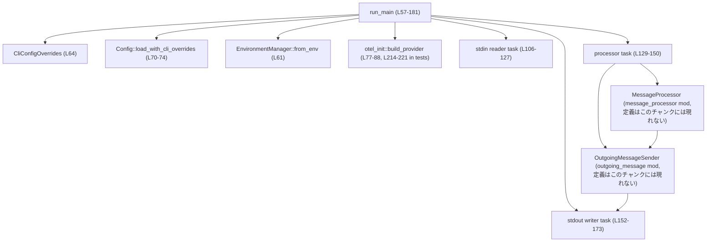
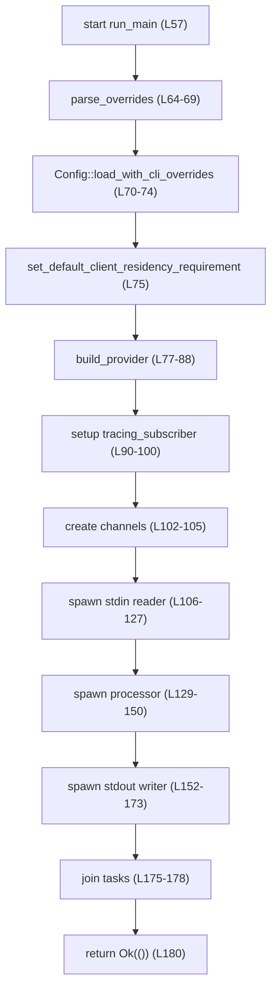
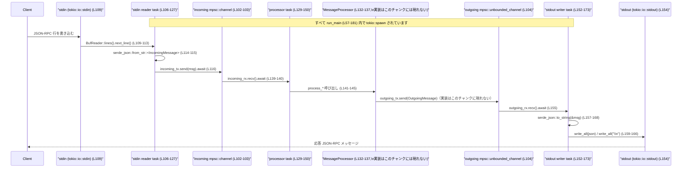

# mcp-server/src/lib.rs コード解説

## 0. ざっくり一言

このファイルは、標準入出力を介して JSON-RPC ベースの MCP サーバを動かす「実行エントリポイント」と、OTel/トレーシング初期化・チャネル・非同期タスクの束ね役を担うモジュールです（`run_main` 関数）【mcp-server/src/lib.rs:L57-181】。

---

## 1. このモジュールの役割

### 1.1 概要

- このモジュールは **MCP サーバのプロセス起動とイベントループの構築** を行うために存在し、次の機能を提供します。
  - CLI 引数による設定オーバーライドの解釈と `Config` の読み込み【L64-75】。
  - OpenTelemetry（OTel）を使ったログ・トレース・メトリクスの初期化【L77-100】。
  - 標準入力から JSON-RPC メッセージを読み、チャネルを介して `MessageProcessor` に渡す非同期タスクの起動【L102-150】。
  - `MessageProcessor` によって生成された応答/通知を標準出力に書き出すライタータスクの起動【L152-173】。
- また、MCP 上で利用されるいくつかのパラメータ型を `pub use` で再公開し、ライブラリ利用側からアクセスしやすくしています【L41-46】。

### 1.2 アーキテクチャ内での位置づけ

`run_main` を中心に、設定ロード・OTel 初期化・メッセージ処理・入出力タスクの依存関係は概ね次のようになっています。

この図は **run_main (L57-181)** 内の関係を表します。



- `run_main` は設定・OTel・トレーシングを初期化し、3 つの `tokio::spawn` タスク（stdin 読み取り、メッセージ処理、stdout 書き出し）を作成します【L106-127, L129-150, L152-173】。
- JSON-RPC の具体的な処理ロジックは `message_processor::MessageProcessor` に委譲されています【L36, L132-137】（実装はこのチャンクには現れません）。
- 応答側は `OutgoingMessageSender` と `OutgoingJsonRpcMessage` を通じて、`OutgoingMessage` を JSON に変換し stdout に送ります【L37-39, L155-168】。

### 1.3 設計上のポイント

コードから読み取れる設計上の特徴を列挙します。

- **非同期・タスク分割**【L106-173】  
  - 入力読み取り、メッセージ処理、出力書き出しを別々の `tokio::spawn` タスクとして分離し、それぞれをチャネルで連結しています。
- **チャネルによる疎結合な連携**【L102-105】  
  - 入力側→処理側に bounded チャネル（`CHANNEL_CAPACITY`）【L48-51, L102-103】、処理側→出力側に unbounded チャネル【L104】を使用し、処理順序を保ちつつタスク間を疎結合にしています。
- **型付き JSON-RPC**【L14-16, L55】  
  - `IncomingMessage` を `JsonRpcMessage<ClientRequest, Value, ClientNotification>` の型エイリアスとして定義し、JSON-RPC メッセージを型レベルで区別しています【L55】。
- **I/O エラーの扱い**  
  - 設定・OTel 初期化に失敗した場合は `IoResult` の `Err` で呼び出し元に返します【L64-69, L70-74, L77-88】。
  - stdin 読み取りと stdout 書き出しのエラーは、タスク内でログ出力にとどめ、`run_main` の戻り値には反映しません【L113-121, L159-166】。
- **観測性 (Observability)**  
  - OTel プロバイダを構築し【L77-88】、`tracing_subscriber` のフォーマッタ層および OTel ログ・トレース層を登録しています【L90-100】。
  - テストではロガー、トレーサー、メトリクスが揃っていることを検証しています【L214-229】。

---

## 2. 主要な機能一覧

このモジュールが提供する主要機能は次のとおりです。

- MCP サーバ起動関数 `run_main`:  
  設定と OTel を初期化し、stdin→処理→stdout の非同期パイプラインを構築・実行します【L57-181】。
- JSON-RPC 入力メッセージ型 `IncomingMessage`:  
  `ClientRequest` / `ClientNotification` を含む JSON-RPC メッセージの型エイリアスです【L14-16, L55】。
- チャネル設定定数:
  - `CHANNEL_CAPACITY`: 入力側 bounded チャネルの容量（128）【L48-51】。
  - `DEFAULT_ANALYTICS_ENABLED`: OTel 初期化時に使う「解析機能有効」のデフォルトフラグ（true）【L52】。
  - `OTEL_SERVICE_NAME`: OTel 上のサービス名 `"codex_mcp_server"`【L53】。
- 公開再エクスポート型:
  - `CodexToolCallParam`, `CodexToolCallReplyParam`【L41-42】。
  - `ExecApprovalElicitRequestParams`, `ExecApprovalResponse`【L43-44】。
  - `PatchApprovalElicitRequestParams`, `PatchApprovalResponse`【L45-46】。

---

## 3. 公開 API と詳細解説

### 3.1 型・定数・関数一覧（インベントリー）

このチャンクに登場する公開/主要コンポーネントの一覧です。

#### 定数・型エイリアス・再エクスポート

| 名前 | 種別 | 役割 / 用途 | 定義位置 |
|------|------|-------------|----------|
| `CHANNEL_CAPACITY` | `const usize` | タスク間の bounded チャネル容量（128 メッセージ）【コメント含め】 | mcp-server/src/lib.rs:L48-51 |
| `DEFAULT_ANALYTICS_ENABLED` | `const bool` | OTel 解析機能をデフォルトで有効にするかどうか（true） | mcp-server/src/lib.rs:L52 |
| `OTEL_SERVICE_NAME` | `const &str` | OTel 上のサービス名 `"codex_mcp_server"` | mcp-server/src/lib.rs:L53 |
| `IncomingMessage` | 型エイリアス | `JsonRpcMessage<ClientRequest, Value, ClientNotification>` 型。stdin から受け取る JSON-RPC メッセージを表現 | mcp-server/src/lib.rs:L14-16, L55 |
| `CodexToolCallParam` | 再エクスポート（型） | Codex ツール呼び出しのパラメータ。元定義は `codex_tool_config` モジュール（このチャンクには定義が現れない） | mcp-server/src/lib.rs:L29, L41 |
| `CodexToolCallReplyParam` | 再エクスポート（型） | Codex ツール呼び出しの応答パラメータ（定義はこのチャンクには現れない） | mcp-server/src/lib.rs:L29, L42 |
| `ExecApprovalElicitRequestParams` | 再エクスポート（型） | 実行承認依頼用のパラメータ（推測だが名称から）。定義は `exec_approval` モジュールにあり、このチャンクには現れない | mcp-server/src/lib.rs:L31, L43 |
| `ExecApprovalResponse` | 再エクスポート（型） | 実行承認結果（定義はこのチャンクには現れない） | mcp-server/src/lib.rs:L31, L44 |
| `PatchApprovalElicitRequestParams` | 再エクスポート（型） | パッチ適用承認依頼用パラメータ（推測）。定義は `patch_approval` モジュールにあり、このチャンクには現れない | mcp-server/src/lib.rs:L34, L45 |
| `PatchApprovalResponse` | 再エクスポート（型） | パッチ承認応答（定義はこのチャンクには現れない） | mcp-server/src/lib.rs:L34, L46 |

#### 関数（プロダクションコード）

| 名前 | 種別 | 役割 / 用途 | 定義位置 |
|------|------|-------------|----------|
| `run_main` | `pub async fn` | MCP サーバのメインエントリ。設定と OTel 初期化、タスク生成、ジョインまで行う | mcp-server/src/lib.rs:L57-181 |

#### テストモジュール・テスト関数

| 名前 | 種別 | 役割 / 用途 | 定義位置 |
|------|------|-------------|----------|
| `tests` | `mod`（cfg(test)） | このモジュール内のテスト群をまとめる | mcp-server/src/lib.rs:L183-233 |
| `mcp_server_defaults_analytics_to_enabled` | `#[test] fn` | `DEFAULT_ANALYTICS_ENABLED` が `true` であることを検証 | mcp-server/src/lib.rs:L192-195 |
| `mcp_server_builds_otel_provider_with_logs_traces_and_metrics` | `#[tokio::test] async fn` | OTel プロバイダがログ・トレース・メトリクスを全て含んで初期化されることを確認 | mcp-server/src/lib.rs:L197-232 |

### 3.2 関数詳細

このチャンクでは、公開 API かつコアロジックである `run_main` を詳細に解説します。

#### `run_main(arg0_paths: Arg0DispatchPaths, cli_config_overrides: CliConfigOverrides) -> IoResult<()>`

**概要**

- MCP サーバプロセスのエントリポイントです【L57-60】。
- CLI から受け取った設定オーバーライドを解釈し、その結果を使って `Config` をロードします【L64-75】。
- OTel プロバイダと `tracing_subscriber` を初期化し【L77-100】、stdin→処理→stdout の 3 つの非同期タスクを起動してジョインします【L106-178】。

**引数**

| 引数名 | 型 | 説明 |
|--------|----|------|
| `arg0_paths` | `Arg0DispatchPaths` | 実行環境のパス情報を表す型です【L58】。具体的なフィールドや意味はこのチャンクには現れません。 |
| `cli_config_overrides` | `CliConfigOverrides` | CLI オプションによる設定値の上書きを表す型で、`parse_overrides` メソッドによって内部表現（キー/値オーバーライド）に変換されます【L59, L64】。 |

**戻り値**

- 型: `IoResult<()>`（`std::io::Result<()>` の別名）【L5, L60】。
- 意味:
  - 正常終了時は `Ok(())`【L180】。
  - 設定オーバーライドの解析・設定ロード・OTel 初期化のいずれかでエラーが発生した場合は `Err(std::io::Error)` を返します【L64-69, L70-74, L77-88】。
  - stdin/stdout の I/O やメッセージ処理タスクの内部エラーは `run_main` の戻り値には反映されず、タスク内でログ出力されるのみです【L113-121, L159-166】。

**内部処理の流れ（アルゴリズム）**

コードから読み取れる処理フローをステップごとにまとめます【mcp-server/src/lib.rs:L57-181】。

1. **環境依存オブジェクトの構築**【L61】  
   - `EnvironmentManager::from_env()` を呼び出し、環境情報を持つマネージャを作成して `Arc` で共有可能にします。

2. **CLI オーバーライドの解析 → Config ロード**【L62-75】  
   - `cli_config_overrides.parse_overrides()` を呼び出し、CLI による設定オーバーライドをパースします【L64】。
     - エラー時は `ErrorKind::InvalidInput` の `std::io::Error` に変換して `Err` を返します【L64-69】。
   - 得られたオーバーライドを `Config::load_with_cli_overrides(cli_kv_overrides).await` に渡し、非同期に設定をロードします【L70-72】。
     - エラー時は `ErrorKind::InvalidData` の `std::io::Error` に変換して `Err` を返します【L72-74】。
   - ロードした `config` から `enforce_residency` 設定を獲得し、`set_default_client_residency_requirement` に渡してクライアントのレジデンシ要件を設定します【L75】。

3. **OTel プロバイダとトレーシングの初期化**【L77-100】  
   - `codex_core::otel_init::build_provider` を呼び出し、`config`・パッケージバージョン・サービス名・`DEFAULT_ANALYTICS_ENABLED` をもとに OTel プロバイダを構築します【L77-82】。
     - 失敗時は `ErrorKind::InvalidData` の `std::io::Error` に変換します【L83-88】。
   - `tracing_subscriber::fmt::layer()` を stderr 出力＋環境変数ベースの `EnvFilter` 付きで準備します【L90-92】。
   - OTel プロバイダが存在する場合、その logger layer と tracing layer を取り出します【L93-94】。
   - `tracing_subscriber::registry()` にフォーマット層・OTel ロガー層・OTel トレーシング層を登録し、`try_init()` でグローバルサブスクライバを初期化します【L96-100】。戻り値は無視されています。

4. **チャネルの作成**【L102-105】  
   - `mpsc::channel::<IncomingMessage>(CHANNEL_CAPACITY)` で bounded チャネル（容量 128）を作成し、送信/受信ハンドル `incoming_tx` / `incoming_rx` を得ます【L102-103】。
   - `mpsc::unbounded_channel::<OutgoingMessage>()` で unbounded チャネルを作成し、送信/受信ハンドル `outgoing_tx` / `outgoing_rx` を得ます【L104】。

5. **stdin 読み取りタスクの起動**【L106-127】  
   - `tokio::spawn` で非同期タスクを起動し、`stdin` を `BufReader` でラップして行単位で読み取ります【L109-111】。
   - ループ内で `lines.next_line().await.unwrap_or_default()` を呼び、`Option<String>` を得て `while let Some(line)` で制御します【L113】。
     - ここで I/O エラーが発生した場合でも `unwrap_or_default()` により `None` として扱われ、ループを抜けます（エラー内容はログ出力されません）。
   - 取得した 1 行の文字列を `serde_json::from_str::<IncomingMessage>(&line)` でパースし、成功すれば `incoming_tx.send(msg).await` で処理タスクに送信します【L114-116】。
     - 送信に失敗した場合（受信側がすでに終了している場合）は `break` でループを抜けます【L116-118】。
   - JSON デシリアライズに失敗した場合は、`error!` ログを出力し、その行をスキップして次の行に進みます【L121】。
   - EOF などでループが終了すると `debug!("stdin reader finished (EOF)")` を出力し、タスクを終えます【L125】。

6. **メッセージ処理タスクの起動**【L129-150】  
   - `OutgoingMessageSender::new(outgoing_tx)` で送信ヘルパを作成します【L131】。
   - `MessageProcessor::new(outgoing_message_sender, arg0_paths, Arc::new(config), environment_manager)` でメッセージプロセッサを構築します【L132-137】。
   - 非同期タスクとして、`incoming_rx.recv().await` でメッセージを受信するループを開始します【L139-140】。
   - `JsonRpcMessage` のバリアントに応じて、それぞれ `process_request`, `process_response`, `process_notification`, `process_error` を呼び出します【L141-145】。
     - これらのメソッドの詳細な挙動は `message_processor` モジュール側にあり、このチャンクには現れません。
   - `incoming_rx` がクローズされて `None` を返した場合、ループを抜けて `info!("processor task exited (channel closed)")` を出力します【L139-140, L148】。

7. **stdout 書き出しタスクの起動**【L152-173】  
   - `tokio::spawn` で非同期タスクを起動し、`outgoing_rx.recv().await` で `OutgoingMessage` を受信するループを実行します【L153-155】。
   - 受信した `OutgoingMessage` を `OutgoingJsonRpcMessage` に変換します【L156】。
   - `serde_json::to_string(&msg)` で JSON 文字列にシリアライズし、成功した場合は `stdout.write_all(json.as_bytes()).await` と `stdout.write_all(b"\n").await` で書き出します【L157-166】。
     - `write_all` がエラーを返した場合は `error!` を出して `break` します【L159-161, L163-165】。
   - シリアライズに失敗した場合も `error!` を出し、次のメッセージに進みます【L168】。
   - チャネルがクローズされて `None` を返したらループを抜け、`info!("stdout writer exited (channel closed)")` を出力します【L155, L172】。

8. **タスクの終了待ちと関数終了**【L175-181】  
   - `tokio::join!(stdin_reader_handle, processor_handle, stdout_writer_handle)` で 3 つのタスクの完了を待ちます【L178】。
     - `join!` は各タスクの `Result` を返しますが、`let _ =` で無視されています。
   - 最後に `Ok(())` を返し、`run_main` を終了します【L180】。

**Mermaid フロー図（run_main 全体, L57-181）**



**Errors / Panics**

`run_main` 自身が返すエラー条件は次のとおりです。

- `cli_config_overrides.parse_overrides()` がエラー  
  - `ErrorKind::InvalidInput` の `std::io::Error` として `Err` を返します【L64-69】。
- `Config::load_with_cli_overrides(cli_kv_overrides).await` がエラー  
  - `ErrorKind::InvalidData` の `std::io::Error` として `Err` を返します【L70-74】。
- `codex_core::otel_init::build_provider` がエラー  
  - `ErrorKind::InvalidData` の `std::io::Error` として `Err` を返します【L77-88】。

それ以外の箇所で `?` 演算子を使った `IoResult` の伝播や `unwrap`/`expect` は使われていないため、この関数の内部で明示的なパニックを起こすコードは見当たりません【L57-181】。  
ただし、呼び出す外部ライブラリや `MessageProcessor` の中でパニックが起こる可能性については、このチャンクだけからは判断できません。

**非同期タスク内のエラー挙動**

- stdin 読み取りタスク【L106-127】
  - `lines.next_line().await` のエラーは `unwrap_or_default()` によって握りつぶされ、EOF と同じ扱い（ループ終了）になります【L113】。
  - JSON デシリアライズ失敗時は `error!` ログを出してその行をスキップします【L114-121】。
  - チャネル送信失敗時（処理タスク終了時）はループを抜けます【L116-118】。
- メッセージ処理タスク【L129-150】
  - `incoming_rx.recv().await` が `None` になった場合（送信側終了時）ループを抜け、`info!` ログを出して終了します【L139-140, L148】。
  - `MessageProcessor` 内部のエラー処理はこのチャンクには現れません。
- stdout 書き出しタスク【L152-173】
  - `stdout.write_all` がエラーを返した場合、`error!` ログを出した後 `break` し、タスクを終了します【L159-166】。
  - JSON シリアライズ失敗時も `error!` ログのみで次のメッセージに進みます【L157-168】。
  - 送信チャネルがクローズされるとループを抜け、`info!` ログを出して終了します【L155, L172】。

**Edge cases（エッジケース）**

コードから分かる代表的なエッジケースと挙動です。

- **stdin からの読み取りエラー**【L113】  
  - `lines.next_line().await` が `Err` を返した場合、`unwrap_or_default()` によって `None` として扱われます。
  - その結果、`while let Some(line)` が即座に終了し、EOF と同様にタスク終了＋`debug!("stdin reader finished (EOF)")` となります【L113, L125】。
  - エラー内容はログに出力されません。
- **無効な JSON-RPC 行**【L114-121】  
  - `serde_json::from_str::<IncomingMessage>(&line)` が失敗すると、`error!` ログを出してその行を無視し、次の行の読み取りに進みます。
  - 1 行ごとに独立しており、特定の行のエラーが他のメッセージ処理に影響することはありません。
- **入力チャネル送信側/受信側のクローズ**【L116-118, L139-140, L148】  
  - `incoming_tx.send(msg).await.is_err()` が `true` の場合、stdin 読み取りタスクはループを抜けて終了します【L116-119】。
  - `incoming_rx.recv().await` が `None` の場合（送信側クローズ）、メッセージ処理タスクは終了し、「channel closed」とログを出します【L139-140, L148】。
- **出力チャネル送信側/受信側のクローズ**【L104, L155, L172】  
  - 送信側（`OutgoingMessageSender` 等）がチャネルをクローズすると、`outgoing_rx.recv().await` は `None` を返し、stdout タスクは終了します【L155, L172】。
- **stdout 書き込みエラー**【L159-166】  
  - 1 回でも `write_all` がエラーになった場合、その時点でループを抜け、以降のメッセージは書き出されません。
  - エラー内容はログに出ますが、`run_main` の戻り値には反映されません。
- **タスクのパニック・ JoinError**【L178】  
  - `tokio::join!` から返ってきた各タスクの `Result` は `let _ =` で破棄されており、タスク側のパニックやキャンセルがあっても `run_main` の戻り値には影響しません。この挙動の詳細は `JoinHandle` の仕様に依存し、このチャンクには明示的なハンドリングは現れません。

**使用上の注意点**

- `run_main` は `async fn` であるため、**Tokio ランタイム等の非同期ランタイムの中で `await` される必要**があります【L57】。
- `run_main` は標準入力・標準出力を前提にした設計になっており【L109, L154】、他の I/O ソースに差し替える仕組みはこのファイル内にはありません。
- stdin の I/O エラーは EOF と区別されず、ログにも残らないため、**入力側の異常が検出されないままサーバが静かに終了する**可能性があります【L113, L125】。
- 出力チャネルは `mpsc::unbounded_channel` であるため、**処理側が大量のメッセージを送り、stdout 側が詰まった場合にはメモリ使用量が増加し続ける可能性**があります【L104】。
- `MessageProcessor` や `OutgoingMessageSender` に渡す `config` と `environment_manager` は `Arc` で共有されています【L61, L135-136】。  
  これは複数タスクからの安全な共有を想定した構造ですが、スレッド安全性の詳細はこれらの型の実装に依存し、このチャンクには現れません。

### 3.3 その他の関数

このファイル内のテスト関数の一覧です。

| 関数名 | 役割（1 行） | 定義位置 |
|--------|--------------|----------|
| `mcp_server_defaults_analytics_to_enabled` | `DEFAULT_ANALYTICS_ENABLED` が `true` であることを `assert_eq!` で検証します【L192-195】。 | mcp-server/src/lib.rs:L192-195 |
| `mcp_server_builds_otel_provider_with_logs_traces_and_metrics` | テスト用 `Config` を構築し、`build_provider` がロガー・トレーサー・メトリクスをすべて含んだプロバイダを返すことを確認しています【L197-232】。 | mcp-server/src/lib.rs:L197-232 |

---

## 4. データフロー

ここでは、クライアントからの JSON-RPC リクエストが stdin から入り、処理されて stdout に書き出されるまでの流れを整理します。すべて `run_main (L57-181)` 内の処理です。

### 4.1 全体の流れ（テキスト）

1. クライアントが JSON-RPC メッセージを 1 行ごとの JSON 文字列として MCP サーバの stdin に書き込みます。
2. stdin 読み取りタスクがこの行を読み、`IncomingMessage` 型へデシリアライズし、`incoming_tx` チャネルに送信します【L109-116】。
3. メッセージ処理タスクが `incoming_rx.recv().await` でメッセージを受信し、`JsonRpcMessage` のバリアントに応じて `MessageProcessor` の各メソッドに委譲します【L139-145】。
4. `MessageProcessor` は必要に応じて `OutgoingMessageSender` を通じて `OutgoingMessage` を `outgoing_tx` に送ります【L131-137】（送信側の実装はこのチャンクには現れません）。
5. stdout 書き出しタスクが `outgoing_rx.recv().await` で `OutgoingMessage` を受信し、`OutgoingJsonRpcMessage` に変換して JSON 文字列として stdout に書き出します【L155-168】。

### 4.2 シーケンス図（run_main 内, L106-173）



このデータフローにより、`run_main` は「行区切り JSON-RPC over stdin/stdout」というプロトコルに従った MCP サーバの枠組みを提供しています。

---

## 5. 使い方（How to Use）

### 5.1 基本的な使用方法

このファイルはライブラリクレートの `lib.rs` ですが、`run_main` を呼び出すことで MCP サーバを起動できます。  
以下は、バイナリクレート側から `run_main` を利用する典型的なイメージです（`Arg0DispatchPaths` や `CliConfigOverrides` の具体的な構築方法はこのチャンクには現れないため、コメントで示します）。

```rust
use mcp_server::run_main;                   // このモジュールの run_main をインポート
use codex_arg0::Arg0DispatchPaths;          // 引数0経路情報（定義はこのチャンクには現れない）
use codex_utils_cli::CliConfigOverrides;    // CLI オーバーライド用型（定義はこのチャンクには現れない）

#[tokio::main]                               // Tokio ランタイムを起動する属性マクロ
async fn main() -> std::io::Result<()> {
    // Arg0DispatchPaths の具体的な初期化方法はこのファイルには出てこないため省略
    let arg0_paths: Arg0DispatchPaths = /* Arg0DispatchPaths を構築する */;

    // CLI オプションから CliConfigOverrides を構築する処理もこのチャンクには現れない
    let cli_overrides: CliConfigOverrides = /* CLI からのオーバーライドを構築する */;

    // MCP サーバを起動し、stdin/stdout ベースの JSON-RPC ループに入る
    run_main(arg0_paths, cli_overrides).await
}
```

このコードでは、`run_main` が戻ると MCP サーバの処理は全て終了している状態になります【L175-181】。

### 5.2 よくある使用パターン

このファイルが示す主な使い方は 1 パターンのみです。

- **標準入出力を使った単一プロセスの MCP サーバとして利用**  
  - クライアント（例: MCP 対応のエディタや CLI ツール）は、このプロセスの stdin に JSON-RPC メッセージを書き込み、stdout から応答を受け取ります【L109-113, L154-166】。
  - 複数クライアントからの接続や TCP/Unix ソケット経由の通信については、このチャンクには実装が現れません。

### 5.3 よくある間違い（想定される誤用例）

コードから推測できる範囲で、発生しうる誤用パターンを挙げます。

```rust
// 誤り例: 非同期ランタイム外で run_main を呼び出そうとしている
fn main() {
    // コンパイルエラー: async fn の戻り値 `impl Future` を `await` していない
    // let result = run_main(arg0_paths, cli_overrides);
}

// 正しい例: Tokio ランタイム内で run_main を await する
#[tokio::main]
async fn main() -> std::io::Result<()> {
    let arg0_paths = /* ... */;
    let cli_overrides = /* ... */;
    run_main(arg0_paths, cli_overrides).await
}
```

このように、`run_main` は必ず非同期コンテキストで `await` される必要があります【L57】。

### 5.4 使用上の注意点（まとめ）

- **非同期実行が前提**  
  - `run_main` は async 関数であり、Tokio などのランタイム内で実行する必要があります【L57】。
- **標準入出力に依存**  
  - この実装は stdin/stdout を通信路として固定しており、他の I/O チャネルに差し替える API はこのチャンクにはありません【L109, L154】。
- **stdin の I/O エラー検知**  
  - stdin 側の I/O エラーは EOF と同等に扱われ、ログにも残らないため、入力元の異常を検知するには外側での監視が必要になる可能性があります【L113, L125】。
- **unbounded チャネルによるメモリ利用**  
  - 出力側に `mpsc::unbounded_channel` を用いているため、出力タスクが遅延するとキューが伸び続けることがあります【L104】。
- **OTel/トレーシングの有効化**  
  - `DEFAULT_ANALYTICS_ENABLED` はデフォルトで `true` であり【L52, L192-195】、環境変数 `RUST_LOG` などを用いて `EnvFilter` を設定できます【L90-92】。
- **JSON-RPC プロトコル**  
  - 1 行に 1 メッセージという前提があり、改行を含む JSON は想定していません【L113-115, L159-166】。

---

## 6. 変更の仕方（How to Modify）

### 6.1 新しい機能を追加する場合

このファイル内の構造から、「どこに何を追加するか」の観点で整理します。

- **新しい種類の JSON-RPC メッセージを処理したい場合**
  - メッセージの具体的な処理は `MessageProcessor` に委譲されているため【L132-145】、新しいメッセージ種別に対応する処理は通常 `message_processor` モジュール側に追加するのが自然と考えられます（ただし、このチャンクにはその実装が現れず、正確な指針は不明です）。
  - `run_main` の側では、`JsonRpcMessage` のバリアントが増えた場合に `match msg { ... }` のパターン追加が必要になる可能性があります【L139-145】。
- **新しいバックグラウンドタスクを追加したい場合**
  - 既存の 3 タスクと同様に、`tokio::spawn` を `run_main` 内に追加し、そのタスクと連携するチャネルを必要に応じて `run_main` 内で作成するのが一貫したパターンです【L106-127, L129-150, L152-173】。
  - 追加タスクの終了を待つ必要があれば、`tokio::join!` の引数にそのハンドルを足す必要があります【L175-178】。
- **OTel 設定やトレーシング層の変更**
  - OTel プロバイダ構築部分（`build_provider` 呼び出し）とトレーシング初期化部分は集中して書かれているため【L77-100】、そこで新しいレイヤを追加したり、設定を変更したりできます。
  - 注意点として、`try_init()` はグローバルなトレーシングサブスクライバを設定するため、複数回呼び出すとエラーになる場合がありますが、このコードでは戻り値を無視しているため、呼び出し方を変える場合はその影響を確認する必要があります【L96-100】。

### 6.2 既存の機能を変更する場合

- **チャネル容量の調整**
  - 入力側 bounded チャネルの容量を変更したい場合は `CHANNEL_CAPACITY` の定数を変更します【L48-51】。
    - 大きくしすぎるとメモリ使用量が増加し、小さくしすぎると stdin 読み取りタスクが詰まりやすくなる可能性があります。
- **エラー処理ポリシーの変更**
  - stdin I/O エラーをログに残したい場合は、`unwrap_or_default()` の代わりに `match` を使って `Err(e)` を明示的に処理するように変更する必要があります【L113】。
  - stdout 書き込みエラー時の挙動（現在は一度エラーになるとタスク終了）を変えたい場合は、`if let Err(e) = stdout.write_all(...)` 部分の制御を変更します【L159-166】。
- **戻り値（IoResult）の意味の調整**
  - 現状、タスクのエラーやパニックは `run_main` の `IoResult` には反映されません【L175-181】。
  - これを変えたい場合は、`tokio::join!` の戻り値を検査し、`JoinError` やタスク内でのエラーを適宜 `std::io::Error` に変換するように変更する必要があります。
- **OTel/Analytics のデフォルト挙動**
  - デフォルトで解析機能を無効にしたい場合は、`DEFAULT_ANALYTICS_ENABLED` を `false` に変更し、対応するテスト（`mcp_server_defaults_analytics_to_enabled`）も更新する必要があります【L52, L192-195】。

---

## 7. 関連ファイル

このモジュールと密接に関係するファイル・モジュールは次のとおりです。  
実装はこのチャンクには現れないため、役割は主に名前と利用箇所からの推測に基づきます。

| パス / モジュール | 役割 / 関係 |
|-------------------|------------|
| `mod codex_tool_config` | Codex ツール呼び出し関連パラメータ `CodexToolCallParam`, `CodexToolCallReplyParam` の定義元です【L29, L41-42】。 |
| `mod codex_tool_runner` | ツール実行ロジックを含むと推測されますが、このチャンクには参照がなく詳細は不明です【L30】。 |
| `mod exec_approval` | 実行承認依頼/応答に関する型 `ExecApprovalElicitRequestParams`, `ExecApprovalResponse` の定義元です【L31, L43-44】。 |
| `pub(crate) mod message_processor` | `MessageProcessor` 型の定義元であり、JSON-RPC メッセージの具体的な処理ロジックが含まれていると考えられます【L32, L36, L132-145】。 |
| `mod outgoing_message` | `OutgoingMessage`, `OutgoingMessageSender`, `OutgoingJsonRpcMessage` の定義元であり、処理結果を JSON-RPC 形式に変換して出力チャネルに流す役割を持ちます【L33, L37-39, L131, L156-157】。 |
| `mod patch_approval` | パッチ適用承認関連の型 `PatchApprovalElicitRequestParams`, `PatchApprovalResponse` の定義元です【L34, L45-46】。 |
| `codex_core::otel_init` | OTel プロバイダを構築するヘルパーを提供し、本モジュールからログ・トレース・メトリクスの初期化に利用されています【L77-88, L214-221】。 |
| `codex_exec_server::EnvironmentManager` | 環境依存情報を扱うマネージャで、`MessageProcessor` に共有されます【L10, L61, L136】。 |

以上が、このチャンクに基づいて把握できる `mcp-server/src/lib.rs` の構造と振る舞いです。
