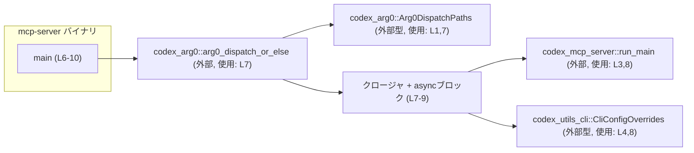
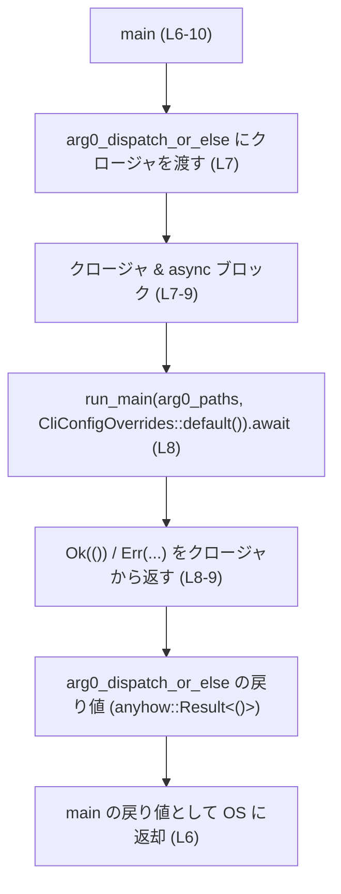
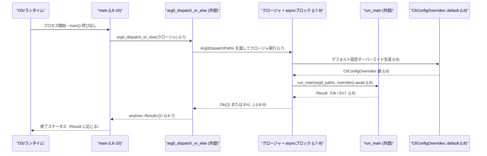

# mcp-server/src/main.rs コード解説

## 0. ざっくり一言

`mcp-server/src/main.rs` は、プログラムのエントリポイント `main` 関数を定義し、`codex_arg0` クレートのディスパッチ関数を通じて、`codex_mcp_server::run_main` を非同期に実行する役割を持つファイルです（`mcp-server/src/main.rs:L1-3,L6-10`）。

---

## 1. このモジュールの役割

### 1.1 概要

- このファイルは **バイナリのエントリポイント** を提供します（`fn main`、`mcp-server/src/main.rs:L6-11`）。
- エントリポイント内で `arg0_dispatch_or_else` に処理を委譲し、その中の **非同期ブロックから `run_main` を呼び出す** 構造になっています（`mcp-server/src/main.rs:L7-8`）。
- エラーは `anyhow::Result<()>` を通じて呼び出し元（OS）に伝播されます（`mcp-server/src/main.rs:L6,8`）。

### 1.2 アーキテクチャ内での位置づけ

このファイルは、外部クレートに実装された機能を組み合わせて起動フローを構成する「薄い」エントリポイントです。

- `codex_arg0` クレート  
  - `Arg0DispatchPaths` 型と `arg0_dispatch_or_else` 関数を提供（インポートのみ確認可能、`mcp-server/src/main.rs:L1-2,7`）。
- `codex_mcp_server` クレート  
  - `run_main` 関数を提供（`mcp-server/src/main.rs:L3,8`）。
- `codex_utils_cli` クレート  
  - `CliConfigOverrides` 型を提供し、`default()` で初期値が生成されています（`mcp-server/src/main.rs:L4,8`）。

これらの関係を簡略図で示します。



※ `Arg0DispatchPaths` や `run_main` の具体的な実装はこのチャンクには現れないため不明です。

### 1.3 設計上のポイント

コードから読み取れる設計上の特徴を列挙します。

- **エントリポイントの責務を最小化**  
  - `main` は実質的に `arg0_dispatch_or_else` への 1 行の委譲になっており、詳細な処理は他クレートに任せています（`mcp-server/src/main.rs:L7-9`）。
- **エラー処理に `anyhow::Result` を使用**  
  - `fn main() -> anyhow::Result<()>` の形で定義され、エラー情報を `anyhow::Error` でラップして OS に返す設計です（`mcp-server/src/main.rs:L6`）。
- **非同期処理の採用**  
  - `arg0_dispatch_or_else` に渡すクロージャが `async move` ブロックを返し、その中で `run_main(...).await?` を実行しています（`mcp-server/src/main.rs:L7-8`）。
  - このファイル内には非同期ランタイムの記述はなく、ランタイムの起動や並行実行の方式は `arg0_dispatch_or_else` または `run_main` の実装に委ねられています（このチャンクには現れません）。
- **設定オーバーライドのフック**  
  - `CliConfigOverrides::default()` を `run_main` に渡しており、設定値の上書き機構を想定したインターフェースであると考えられますが、詳細はこのチャンクからは分かりません（`mcp-server/src/main.rs:L4,8`）。

---

## 2. 主要な機能一覧

このファイル自体が提供する主要機能は 1 つです。

- `main` 関数:  
  - プロセス起動時のエントリポイントとして、`arg0_dispatch_or_else` を通じて `run_main` を非同期実行し、その結果を `anyhow::Result<()>` として OS に返します（`mcp-server/src/main.rs:L6-10`）。

---

## 3. 公開 API と詳細解説

### 3.1 型・コンポーネント一覧（インベントリー）

このファイル内で **定義** されている型はありません。  
ここでは、このファイルで利用している主要な関数・型を一覧化します。

#### ローカルに定義されている関数

| 名前 | 種別 | 役割 / 用途 | 根拠行 |
|------|------|-------------|--------|
| `main` | 関数 | プロセスのエントリポイント。`arg0_dispatch_or_else` を使って `run_main` を呼ぶ。戻り値でエラーを伝播。 | `mcp-server/src/main.rs:L6-11` |

#### 外部クレートから利用しているコンポーネント

| 名前 | 種別（このチャンクから分かる範囲） | 役割 / 用途（推測を含む場合は明記） | 根拠行 |
|------|------------------------------------|-------------------------------------|--------|
| `Arg0DispatchPaths` | 型（詳細不明） | `arg0_dispatch_or_else` がクロージャに渡す引数の型。Arg0 に関するパス情報を表す型名と推測されますが、実装はこのチャンクにはありません。 | `mcp-server/src/main.rs:L1,7` |
| `arg0_dispatch_or_else` | 関数 | クロージャを受け取り、そのクロージャ内で非同期処理を行うディスパッチ関数。戻り値を `main` がそのまま返しています。 | `mcp-server/src/main.rs:L2,7` |
| `run_main` | 関数 | 非同期に呼び出されるメイン処理。エラーの場合は `?` を通じて上位に伝播します。処理内容はこのチャンクにはありません。 | `mcp-server/src/main.rs:L3,8` |
| `CliConfigOverrides` | 型（Default 実装ありと推測） | `CliConfigOverrides::default()` から初期値を作成し、`run_main` に渡される設定オーバーライド。構造は不明です。 | `mcp-server/src/main.rs:L4,8` |

### 3.2 関数詳細：`main() -> anyhow::Result<()>`

```rust
fn main() -> anyhow::Result<()> {
    arg0_dispatch_or_else(|arg0_paths: Arg0DispatchPaths| async move {
        run_main(arg0_paths, CliConfigOverrides::default()).await?;
        Ok(())
    })
}
```

（`mcp-server/src/main.rs:L6-10`）

#### 概要

- プロセス起動時に呼ばれるエントリポイントです。
- `codex_arg0::arg0_dispatch_or_else` にクロージャを渡し、そのクロージャ内で `codex_mcp_server::run_main` を非同期に実行します。
- `run_main` または `arg0_dispatch_or_else` からのエラーを `anyhow::Result<()>` として呼び出し元（OS）に返します。

#### 引数

- この関数は引数を取りません（Rust の標準的な `main` 関数と同様）。

#### 戻り値

- 型: `anyhow::Result<()>`（`mcp-server/src/main.rs:L6`）
  - 成功時: `Ok(())`
  - 失敗時: `Err(anyhow::Error)`  
    エラーの具体的なバリアントは `run_main` および `arg0_dispatch_or_else` の実装に依存し、このチャンクからは分かりません。

#### 内部処理の流れ（アルゴリズム）

1. `main` 関数の戻り値として `arg0_dispatch_or_else(...)` 呼び出し全体の結果を返す（`mcp-server/src/main.rs:L6-7`）。
2. `arg0_dispatch_or_else` に、引数 `arg0_paths: Arg0DispatchPaths` を受け取るクロージャを渡す（`mcp-server/src/main.rs:L7`）。
3. クロージャは `async move` ブロックを返し、その中で以下を行う（`mcp-server/src/main.rs:L7-9`）:
   - `CliConfigOverrides::default()` で設定オーバーライドのデフォルト値を生成する（`mcp-server/src/main.rs:L8`）。
   - 生成したオーバーライドと `arg0_paths` を引数に `run_main(arg0_paths, CliConfigOverrides::default())` を呼び出し、その完了を `.await` で待機する（`mcp-server/src/main.rs:L8`）。
   - `run_main` が `Err` を返した場合、`?` により即座にクロージャからエラーとしてリターンする（`mcp-server/src/main.rs:L8`）。
   - `run_main` が成功した場合は `Ok(())` を返す（`mcp-server/src/main.rs:L9`）。
4. `arg0_dispatch_or_else` はクロージャの結果を集約し、その結果を `main` に返す（呼び出し側の挙動はこのチャンクにはありませんが、型整合性から `anyhow::Result<()>` を返すことが分かります）。

処理フローの簡易図です。



#### Examples（使用例）

この関数は通常 OS から直接呼び出されるため、アプリケーションコードから `main` を呼ぶことはほとんどありません。  
ここでは、テストなどで `main` の成否だけを確認する最小例を示します。

```rust
use mcp_server; // 実際にはクレート名に応じた use が必要です

#[test]
fn main_returns_result() {
    // main を直接呼び出して Result が返ってくることを確認するテスト例
    let result = mcp_server::main(); // main は anyhow::Result<()> を返す（L6）

    // どのような条件で Ok / Err になるかは run_main 等の実装に依存するため、
    // ここでは「コンパイルできて Result が返る」ことのみを確認しています。
    assert!(result.is_ok() || result.is_err());
}
```

> 注: 実際のクレート名（`mcp_server` かどうか）はこのチャンクには現れないため不明です。上記はイメージです。

#### Errors / Panics

- **Errors**
  - `run_main(arg0_paths, CliConfigOverrides::default()).await?`  
    - `run_main` が `Err` を返した場合、この `?` によりクロージャはただちに `Err` を返します（`mcp-server/src/main.rs:L8`）。
  - クロージャからの `Err` は `arg0_dispatch_or_else` に伝播し、その戻り値として `main` に返されます（`mcp-server/src/main.rs:L6-7`）。
  - 結果として、`main` は `Err(anyhow::Error)` を返し、Rust のランタイムが非ゼロ終了コードやエラーメッセージを出力します（エラー表示の詳細は `anyhow` と Rust の標準挙動に依存します）。

- **Panics**
  - このファイル内には `panic!` の呼び出しや配列の範囲外アクセスなどの明示的なパニック要因はありません。
  - 外部関数（`arg0_dispatch_or_else`, `run_main`, `CliConfigOverrides::default`）が内部でどのような場合に `panic!` するかは、このチャンクからは分かりません。

#### Edge cases（エッジケース）

`main` 自体には分岐や入力チェックはありません。エッジケースの扱いはほぼすべて `arg0_dispatch_or_else` と `run_main` 側に委ねられています。

- **引数が不正 / 解析不能な場合**
  - コマンドライン引数や環境変数が不正な場合などのエラーは、おそらく `arg0_dispatch_or_else` か `run_main` が検出し、`Err` を返す設計と推測されますが、このファイルからは確認できません。
- **設定オーバーライドが無効な場合**
  - `CliConfigOverrides::default()` は常に生成に成功すると想定されます（`default` は通常 panic しません）が、実装依存であり、このチャンクからは保証できません。
- **非同期ランタイムの初期化に失敗する場合**
  - 非同期ランタイムがどこで初期化されるかが不明なため、その失敗がどのように扱われるかもこのチャンクからは分かりません。

#### 使用上の注意点

- `main` のロジックを変更する際は、**`arg0_dispatch_or_else` の期待するクロージャ型（シグネチャ）** を崩さないことが重要です（`mcp-server/src/main.rs:L7`）。
  - 引数リストや戻り値の型を変更するとコンパイルエラーになります。
- 非同期ブロック内で新たな非同期処理を追加する場合、`run_main(...).await?;` と同様に `?` を用いると、エラーがそのまま `main` の戻り値として伝播します。
  - これを意図しない場合は、`match` などでエラーを握りつぶすか、適切に変換する必要があります。
- `CliConfigOverrides::default()` の代わりに別のオーバーライドを渡したい場合、`CliConfigOverrides` の構築方法や意味を理解するために `codex_utils_cli` クレートの実装を確認する必要があります（このチャンクにはありません）。

### 3.3 その他の関数（外部）

このファイルから呼び出しているが、定義がここにはない関数をまとめます。

| 関数名 | 所属 | 役割（このチャンクから分かる範囲） | 使用行 |
|--------|------|------------------------------------|--------|
| `arg0_dispatch_or_else` | `codex_arg0` クレート | クロージャ（`|arg0_paths: Arg0DispatchPaths| async move { ... }`）を受け取り、そのクロージャを呼び出した結果を`main` に返す。非同期処理の起動や Arg0 関連の初期化を内部で行っていると考えられますが、詳細は不明です。 | `mcp-server/src/main.rs:L2,7` |
| `run_main` | `codex_mcp_server` クレート | メインの非同期処理。本ファイルでは Arg0 情報と CLI 設定オーバーライドを受け取って実行され、エラー時は `?` により伝播されます。 | `mcp-server/src/main.rs:L3,8` |

---

## 4. データフロー

このファイルにおける代表的な処理シナリオは「プロセス起動から `run_main` の完了まで」のフローです。

### 4.1 データフロー概要

1. OS がプロセスを起動し、Rust ランタイムが `main()` を呼び出します（`mcp-server/src/main.rs:L6`）。
2. `main` は `arg0_dispatch_or_else` を呼び出し、`Arg0DispatchPaths` を引数に取るクロージャを渡します（`mcp-server/src/main.rs:L7`）。
3. `arg0_dispatch_or_else` は内部で `Arg0DispatchPaths` の値（生成方法は不明）を用意し、それをクロージャに引き渡します（`mcp-server/src/main.rs:L7` のシグネチャから推測）。
4. クロージャの `async move` ブロック内で:
   - `CliConfigOverrides::default()` により設定オーバーライド値を作成します（`mcp-server/src/main.rs:L8`）。
   - `run_main(arg0_paths, overrides).await` を実行し、完了まで待機します（`mcp-server/src/main.rs:L8`）。
   - 戻り値が `Err` なら `?` によりエラーを返し、`Ok` なら `Ok(())` を返します（`mcp-server/src/main.rs:L8-9`）。
5. `arg0_dispatch_or_else` はクロージャから受け取った `Result` を `main` に返し、そのまま `main` の戻り値となります（`mcp-server/src/main.rs:L6-7`）。

### 4.2 シーケンス図



---

## 5. 使い方（How to Use）

### 5.1 基本的な使用方法

このファイルの `main` は、バイナリとして実行されることを前提としています。  
コードレベルでは、`main` のロジックは次のように整理できます（コメント付きの自明化例です）。

```rust
use codex_arg0::Arg0DispatchPaths;          // Arg0 に関するパス情報の型（詳細不明, L1）
use codex_arg0::arg0_dispatch_or_else;     // Arg0 ディスパッチ用関数（L2）
use codex_mcp_server::run_main;            // MCP サーバ本体のメイン処理と推測される関数（L3）
use codex_utils_cli::CliConfigOverrides;   // CLI 設定のオーバーライド型（L4）

fn main() -> anyhow::Result<()> {          // エントリポイント。anyhow::Result<()> を返す（L6）
    arg0_dispatch_or_else(|arg0_paths: Arg0DispatchPaths| async move {
        // Arg0 から決定されたパス情報 arg0_paths と、
        // デフォルトの CLI 設定オーバーライドを使って run_main を実行（L8）
        run_main(arg0_paths, CliConfigOverrides::default()).await?;

        // run_main が成功したら Ok(()) を返す（L9）
        Ok(())
    })
}
```

実際の起動は、通常は以下のように Cargo 経由で行われます（クレート名は仮）:

```bash
cargo run -p mcp-server -- <必要な引数>
```

> クレート名やコマンドライン引数の詳細は、このチャンクには現れないため不明です。

### 5.2 よくある使用パターン

このファイルはエントリポイントのみを提供しているため、「使用パターン」は主に **拡張・ラップ** の形になります。

1. **ロギングやメトリクスの追加**

   `run_main` の前後にログ出力を追加する例です。

   ```rust
   fn main() -> anyhow::Result<()> {
       arg0_dispatch_or_else(|arg0_paths: Arg0DispatchPaths| async move {
           eprintln!("run_main を開始します"); // 事前ログ

           let result = run_main(arg0_paths, CliConfigOverrides::default()).await;

           eprintln!("run_main が終了しました: {:?}", result.as_ref().map(|_| ()));

           // result をそのまま伝播
           result
       })
   }
   ```

   - ここでは `?` を使わず、`result` をそのまま返しています。エラー伝播の仕方を変えたい場合のパターンです。

2. **設定オーバーライドの差し替え**

   `CliConfigOverrides::default()` の代わりに、外から渡されたオーバーライドを使うようにする場合の概念的な例です（`CliConfigOverrides` の具体的な構築方法はこのチャンクからは分かりません）。

   ```rust
   fn main_with_overrides(overrides: CliConfigOverrides) -> anyhow::Result<()> {
       arg0_dispatch_or_else(|arg0_paths: Arg0DispatchPaths| async move {
           run_main(arg0_paths, overrides).await?;
           Ok(())
       })
   }
   ```

   - このように `main` 相当の関数を増やすことで、テストや別バイナリから柔軟に `run_main` を呼び出す構成も可能です。

### 5.3 よくある間違い

このファイルの構造から想定される誤用例と、正しい例を対比します。

```rust
// 誤りの例: async ブロック内で Result を返さず () を返してしまう
fn main() -> anyhow::Result<()> {
    arg0_dispatch_or_else(|arg0_paths: Arg0DispatchPaths| async move {
        run_main(arg0_paths, CliConfigOverrides::default()).await;
        // Ok(()) を返していないため、クロージャの戻り値が () になってしまい、
        // arg0_dispatch_or_else の期待する型と一致しない（コンパイルエラー）。
    })
}

// 正しい例: run_main のエラーを ? で伝播し、最後に Ok(()) を返す（現在の実装）
fn main() -> anyhow::Result<()> {
    arg0_dispatch_or_else(|arg0_paths: Arg0DispatchPaths| async move {
        run_main(arg0_paths, CliConfigOverrides::default()).await?;
        Ok(())
    })
}
```

### 5.4 使用上の注意点（まとめ）

- **エラー伝播の意図を明確にすること**  
  - `?` によって `run_main` のエラーがそのままプロセス終了ステータスに反映されます（`mcp-server/src/main.rs:L8`）。  
    エラーを握りつぶしたい場合や、特定のエラーを成功として扱いたい場合は、`?` を使わずに明示的に処理する必要があります。
- **非同期コンテキストの扱い**  
  - このファイルでは非同期ランタイムの初期化は行っておらず、その責務は `arg0_dispatch_or_else` 側にあります。別の方法で `run_main` を呼び出す場合は、適切な非同期ランタイム（例: Tokio）上で `.await` する必要があると考えられますが、このチャンクからは詳細不明です。
- **セキュリティ面**  
  - CLI 引数・設定値のバリデーションやアクセス制御などのセキュリティ関連処理は、このファイルには存在せず、`run_main` など外部関数側に委ねられています。セキュリティ要件を確認するには、それらの実装を読む必要があります。

---

## 6. 変更の仕方（How to Modify）

### 6.1 新しい機能を追加する場合

このファイルで新しい機能を追加する際の基本的な考え方を示します。

1. **どこにコードを追加するか**
   - 追加処理は、通常は `arg0_dispatch_or_else` に渡しているクロージャ内（`async move { ... }` の中）に挿入します（`mcp-server/src/main.rs:L7-9`）。
   - 例: `run_main` の前後にログ、メトリクス収集、簡単な前処理・後処理など。

2. **既存の関数・型への依存**
   - Arg0 に基づく情報は `arg0_paths: Arg0DispatchPaths` 経由で渡されます（`mcp-server/src/main.rs:L7`）。
   - CLI 設定オーバーライドを変更したい場合は、`CliConfigOverrides` の API を調べる必要があります（`mcp-server/src/main.rs:L4,8`）。

3. **追加した機能をどこから呼び出すか**
   - エントリポイントを増やす場合は、`main` と同様のシグネチャを持つ新しい関数（例: `fn main_with_overrides(...) -> anyhow::Result<()>`）をこのファイルに追加し、必要に応じて Cargo のバイナリ設定で新しいエントリポイントとして登録します（Cargo.toml 側の設定はこのチャンクにはありません）。

### 6.2 既存の機能を変更する場合

`main` の挙動を変える際に注意すべき点を整理します。

- **影響範囲の確認**
  - `main` はプロセスの起点であるため、ここから呼ばれる `arg0_dispatch_or_else` と `run_main` の両方が影響範囲になります（`mcp-server/src/main.rs:L2-3,7-8`）。
  - エラー処理のポリシーを変えると、**プロセスの終了コードやエラーメッセージ** にも影響する点に注意が必要です。

- **守るべき契約（前提条件・返り値）**
  - `fn main() -> anyhow::Result<()>` のシグネチャは、外部ツールやスクリプトからの期待に関わるため、安易に変えるべきではありません（`mcp-server/src/main.rs:L6`）。
  - `arg0_dispatch_or_else` に渡すクロージャは、`Arg0DispatchPaths` を引数に取り、`Result` を返す非同期ブロックである必要があります（省略されている型パラメータはコンパイラに推論されていますが、この形を大きく崩すとコンパイルエラーになります）。

- **テスト・使用箇所の再確認**
  - `main` のロジック変更後は、CLI 経由での実行パスおよび（あれば）統合テストから `run_main` が期待通りに呼ばれているか確認する必要があります。
  - このチャンクにはテストコードがないため、既存のテストがどの程度カバーしているかは不明です。

- **パフォーマンス・並行性への注意**
  - `main` 自体は処理が少ないため、パフォーマンスへの影響は通常は小さいですが、クロージャ内に重い処理やブロッキング I/O を追加すると、`run_main` の前に全体がブロックされる可能性があります。
  - 並行タスクを追加する場合、非同期ランタイムのポリシー（マルチスレッドかシングルスレッドかなど）は `arg0_dispatch_or_else` または `run_main` の実装に依存するため、その仕様を確認することが望ましいです。

---

## 7. 関連ファイル

このファイルと密接に関係するモジュール・クレートをまとめます。定義そのものはこのチャンクには現れません。

| パス / クレート | 役割 / 関係 |
|-----------------|------------|
| `codex_arg0` クレート | `Arg0DispatchPaths` 型と `arg0_dispatch_or_else` 関数を提供します。`main` から見て、Arg0 に基づくディスパッチと非同期実行の起点となるコンポーネントです（`mcp-server/src/main.rs:L1-2,7`）。 |
| `codex_mcp_server` クレート | `run_main` 関数を提供します。MCP サーバ本体のメイン処理であると推測され、`main` から非同期で呼び出されます（`mcp-server/src/main.rs:L3,8`）。 |
| `codex_utils_cli` クレート | `CliConfigOverrides` 型を提供し、`run_main` に渡す CLI 設定オーバーライドとして利用されています（`mcp-server/src/main.rs:L4,8`）。 |
| `Cargo.toml`（このプロジェクトのルート, このチャンクには未掲載） | `codex_arg0`, `codex_mcp_server`, `codex_utils_cli`, `anyhow` などの依存を定義していると考えられますが、具体的な内容はこのチャンクからは分かりません。 |

---

以上が `mcp-server/src/main.rs` のコードから読み取れる構造・データフロー・使用方法の整理です。このファイルは非常に薄いエントリポイントであり、実際のロジックやエッジケースは主に `codex_mcp_server::run_main` および周辺クレートに委ねられています。
