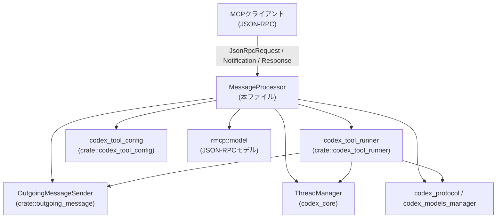
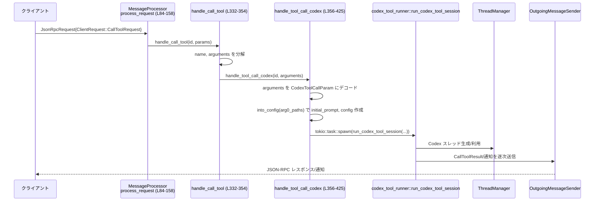
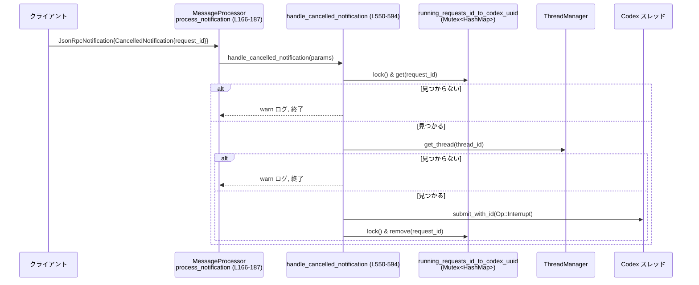

# mcp-server/src/message_processor.rs

## 0. ざっくり一言

JSON-RPC ベースの MCP クライアントからのリクエスト／レスポンス／通知を受け取り、  
Codex のスレッド管理・ツール呼び出し・エラーレスポンスなどに振り分ける「メッセージ中継・変換役」のモジュールです。

---

## 1. このモジュールの役割

### 1.1 概要

このモジュールは MCP サーバー側で受信した JSON-RPC メッセージを処理するための `MessageProcessor` 型を提供します（構造体定義: `message_processor.rs:L41-47`）。

- クライアントからの **Request** をパターンマッチして、各種ハンドラに振り分けます（`process_request`: L84-158）。
- Codex 側のスレッド実行（`ThreadManager`）と連携し、`tools/call` を Codex セッション起動・返信処理に橋渡しします（L332-354, L356-425, L427-523）。
- クライアントからの **通知（Notification）** を受け取り、特にキャンセル通知を Codex スレッドへの割り込みに変換します（`handle_cancelled_notification`: L550-594）。
- 各種エラーを `rmcp::model::ErrorData` / `JsonRpcError` としてクライアントへ返却します。

### 1.2 アーキテクチャ内での位置づけ

主要な依存関係を示す簡易図です。



- クライアントからの JSON-RPC メッセージを `rmcp::model::*` 型として受け取り（L16-30）、`MessageProcessor` が分配します。
- Codex セッション実行は `crate::codex_tool_runner` に委譲されます（`run_codex_tool_session`, `run_codex_tool_session_reply` 呼び出し: L415-422, L512-519）。
- レスポンスやエラー送信は `OutgoingMessageSender` に集約されています（例: L201-206, L329, L351-352, L375-376）。

### 1.3 設計上のポイント

コードから読み取れる特徴です。

- **単一スレッドでのメッセージ処理**  
  - `process_request` / `process_response` / `process_notification` は `&mut self` を引数に取る `async fn` です（L84, L160, L166）。  
    これにより、これらの関数は同時に複数実行されず、`initialized` フラグなどの内部状態は競合しません。
- **非同期タスクへのオフロード**  
  - Codex セッションの実行は `tokio::task::spawn` / `tokio::spawn` で別タスクに切り出しており、メインのメッセージ処理ループをブロックしない設計になっています（L413-424, L507-521）。
- **共有状態の同期**  
  - 実行中リクエストと Codex スレッド ID の紐付けを `Arc<Mutex<HashMap<RequestId, ThreadId>>>` で保持しています（フィールド: L45-46）。  
    - キャンセル通知時はこのマップを `tokio::sync::Mutex` 経由でロックし、対応するスレッドを取得します（L557-565）。
- **初期化フェーズの明示**  
  - `handle_initialize` 内で `initialized` フラグを管理し、二重初期化を `invalid_request` エラーで防いでいます（L200-207）。
- **エラーハンドリング方針**  
  - 失敗は例外ではなく、JSON-RPC レベルの `ErrorData` や `CallToolResult{is_error: Some(true)}` でクライアントに通知します（例: L201-206, L367-376, L380-389, L440-450, L473-482, L494-501, L533-543）。
- **グローバル設定の連携**  
  - 初期化時にクライアント情報から `USER_AGENT_SUFFIX` を設定し（L210-216）、さらに Codex 独自の `serverInfo.user_agent` フィールドを JSON に追加しています（L227-245, L273-275）。

---

## 2. 主要な機能一覧

このモジュールの主な機能です。

- JSON-RPC リクエスト分配: `process_request` による `ClientRequest` 列挙体のハンドラへの振り分け（L84-158）。
- 初期化処理: MCP プロトコルの `initialize` を処理し、サーバー能力や `serverInfo` を返却（`handle_initialize`: L193-279）。
- Ping 応答: `ping` リクエストへ空オブジェクトで応答（`handle_ping`: L281-284）。
- 資源／プロンプト／ログ／補完などのメタ操作のログ出力（`handle_list_resources` など: L286-312, L525-531）。
- ツール一覧取得: Codex 用ツール定義を `tools/list` で返す（`handle_list_tools`: L314-330）。
- ツール呼び出し:
  - `"codex"` ツール: 新規 Codex セッション起動（`handle_call_tool` + `handle_tool_call_codex`: L332-354, L356-425）。
  - `"codex-reply"` ツール: 既存スレッドへの追記・返信（`handle_call_tool_codex_session_reply`: L427-523）。
- 未サポート Task API へのエラー応答（`handle_unsupported_request`: L533-544）。
- 通知処理:
  - セッションキャンセル: `notifications/cancelled` を Codex の `Op::Interrupt` 送信へ変換（`handle_cancelled_notification`: L550-594）。
  - 進捗やルート変更、初期化済み通知のログ出力（L596-606）。
- レスポンス／エラーのログ出力・クライアントへのフォワード（`process_response`: L160-164, `process_error`: L189-191）。

---

## 3. 公開 API と詳細解説

### 3.1 型一覧

公開（クレート内で利用可能）な主要型は `MessageProcessor` のみです。

| 名前 | 種別 | 役割 / 用途 | 定義位置 |
|------|------|-------------|----------|
| `MessageProcessor` | 構造体 | JSON-RPC リクエスト／レスポンス／通知を処理し、Codex スレッドやツール呼び出しに橋渡しするコアコンポーネント | `message_processor.rs:L41-47` |

`MessageProcessor` のフィールド:

| フィールド名 | 型 | 説明 | 定義位置 |
|-------------|----|------|----------|
| `outgoing` | `Arc<OutgoingMessageSender>` | クライアントへのレスポンス／通知送信を担う送信側ハンドル | L42 |
| `initialized` | `bool` | `initialize` がすでに完了したかどうかのフラグ | L43 |
| `arg0_paths` | `Arg0DispatchPaths` | Codex 設定の取得に使うパスセット。`CodexToolCallParam::into_config` に渡される | L44, L364-365 |
| `thread_manager` | `Arc<ThreadManager>` | Codex セッションスレッドの作成／取得を行うマネージャ | L45, L63-74, L408, L491-503, L569-575 |
| `running_requests_id_to_codex_uuid` | `Arc<Mutex<HashMap<RequestId, ThreadId>>>` | 実行中の tools/call リクエスト ID と Codex スレッド ID の対応表。キャンセル処理に使用 | L46, L409, L489, L557-565, L590-593 |

### 3.2 関数詳細（主要 7 件）

#### `MessageProcessor::new(outgoing, arg0_paths, config, environment_manager) -> MessageProcessor`

**定義**: `message_processor.rs:L52-82`

**概要**

Codex 用の `ThreadManager` と認証設定を初期化し、`MessageProcessor` のインスタンスを生成します。  
`OutgoingMessageSender` は `Arc` に包まれ、後続の非同期タスクと共有可能になります。

**引数**

| 引数名 | 型 | 説明 |
|--------|----|------|
| `outgoing` | `OutgoingMessageSender` | クライアントへのレスポンス送信を行う送信オブジェクト | L52-53 |
| `arg0_paths` | `Arg0DispatchPaths` | Codex 設定用のパス集約 | L54 |
| `config` | `Arc<Config>` | Codex の設定（API キーやコラボモード、機能フラグなど） | L55, L63-71 |
| `environment_manager` | `Arc<EnvironmentManager>` | 実行環境（たとえばプロセスや仮想環境）の管理オブジェクト | L56, L72 |

**戻り値**

- 初期状態の `MessageProcessor`。`initialized` は `false` で、`running_requests_id_to_codex_uuid` は空のマップで初期化されます（L75-81）。

**内部処理の流れ**

1. `OutgoingMessageSender` を `Arc` で包む（L58）。
2. `AuthManager::shared_from_config` で認証マネージャを生成（L59-62）。
3. `ThreadManager::new` で Codex スレッド管理を初期化。`SessionSource::Mcp` と `CollaborationModesConfig` を設定（L63-74）。
4. 上記フィールドと引数を元に `MessageProcessor` 構造体を構築（L75-81）。

**Examples（使用例）**

```rust
// 設定や環境マネージャは別モジュールから取得すると仮定
let config: Arc<Config> = /* ... */;
let env_mgr: Arc<EnvironmentManager> = /* ... */;
let outgoing = OutgoingMessageSender::new(/* ... */);
let arg0_paths = Arg0DispatchPaths::default();

// メッセージプロセッサの生成
let mut processor = MessageProcessor::new(outgoing, arg0_paths, config, env_mgr);
```

**Errors / Panics**

- この関数内で `Result` は扱っていません。`AuthManager::shared_from_config` や `ThreadManager::new` が panic するかどうかは、このチャンクからは分かりません。

**Edge cases**

- `config` 内の `features` に応じて `default_mode_request_user_input` のフラグが決定されます（L68-71）。  
  ここで `Feature::DefaultModeRequestUserInput` が無効なら、Codex のモード設定に影響が出ます。

**使用上の注意点**

- `MessageProcessor` 自体は `pub(crate)` であり、同一クレート内でのみ利用できます（L41, L52, L84 など）。
- 実際のメッセージ処理前に、必ず `initialize` リクエストを処理する前提の設計になっています（`handle_initialize` を参照）。

---

#### `MessageProcessor::process_request(&mut self, request: JsonRpcRequest<ClientRequest>)`

**定義**: `message_processor.rs:L84-158`

**概要**

クライアントから送られた JSON-RPC リクエスト (`ClientRequest`) をパターンマッチし、対応するハンドラへ委譲する中核メソッドです。

**引数**

| 引数名 | 型 | 説明 |
|--------|----|------|
| `request` | `JsonRpcRequest<ClientRequest>` | リクエスト ID と `ClientRequest` を含む MCP リクエスト | L84-87 |

**戻り値**

- 戻り値は `()`（暗黙）です。レスポンスやエラーは内部で `OutgoingMessageSender` を通じて送信されます。

**内部処理の流れ**

1. `request.id` をクローンし、`request.request` をローカル変数に展開（L85-86）。
2. `match client_request` により各バリアントを判定し、対応するハンドラを呼び出す（L88-157）。  
   例:
   - `InitializeRequest` → `handle_initialize`（L89-91）
   - `ListToolsRequest` → `handle_list_tools`（L116-118）
   - `CallToolRequest` → `handle_call_tool`（L119-121）
3. 未サポートな `tasks/*` 系メソッドは `handle_unsupported_request` を利用して `METHOD_NOT_FOUND` エラーを返す（L128-143, L533-543）。
4. `CustomRequest` は `method` 名を取り出し、`METHOD_NOT_FOUND` エラーとして返す（L144-155）。

**Examples（使用例）**

```rust
// 例: tools/list リクエストを処理する
let req = JsonRpcRequest {
    id: RequestId::from(1),
    request: ClientRequest::ListToolsRequest(/* ... */),
    // 他フィールドは略
};

processor.process_request(req).await;
```

**Errors / Panics**

- 各分岐先のハンドラが `send_error` を呼び出すことでエラーを返します。  
  `process_request` 自体は `Result` を返さず、エラーは JSON-RPC レイヤで表現されます。
- `match` の網羅性は `ClientRequest` 全バリアントに対応しており、この時点で panic するパスは見当たりません。

**Edge cases**

- クライアントから未知のメソッド名で `CustomRequest` が来た場合、  
  `"method not found: {method}"` というメッセージのエラーが送信されます（L144-155）。
- `tasks/*` 系メソッドは存在するが、明示的に未実装としてエラーを返す仕様です（L128-143, L533-543）。

**使用上の注意点**

- `&mut self` を要求しているため、同一 `MessageProcessor` に対して複数タスクから同時に `process_request` を叩くことはコンパイル時に防がれます。  
  これにより `initialized` フラグの競合更新が防止されています（L43, L200-208）。

---

#### `MessageProcessor::process_notification(&mut self, notification: JsonRpcNotification<ClientNotification>)`

**定義**: `message_processor.rs:L166-187`

**概要**

クライアントからの JSON-RPC 通知（応答不要のメッセージ）を処理します。  
特にキャンセル通知を Codex スレッドへの割り込みに変換する点が重要です。

**引数**

| 引数名 | 型 | 説明 |
|--------|----|------|
| `notification` | `JsonRpcNotification<ClientNotification>` | MCP クライアントからの通知。キャンセル／進捗／ルート変更など | L166-169 |

**戻り値**

- なし（`()`）。必要に応じて内部で Codex へのサブミッションを行います。

**内部処理の流れ**

1. `notification.notification` を取り出し（L170）、`match` で分岐します。
2. 分岐例:
   - `CancelledNotification` → `handle_cancelled_notification`（非同期）を呼び出し（L171-173）。
   - `ProgressNotification` → ログ出力のみ（L174-176, L596-598）。
   - `RootsListChangedNotification` → ログ出力のみ（L177-179, L600-602）。
   - `InitializedNotification` → ログ出力のみ（L180-182, L604-606）。
   - `CustomNotification` → 無視して warn ログ（L183-185）。

**Examples（使用例）**

```rust
let notif = JsonRpcNotification {
    notification: ClientNotification::CancelledNotification(/* ... */),
    // 他フィールドは略
};

processor.process_notification(notif).await;
```

**Errors / Panics**

- キャンセル処理中に Codex 側でエラーが発生した場合は `tracing::error!` にログを出し、処理を中断します（L578-587）。  
  JSON-RPC レベルのエラー応答は（通知なので）返していません。

**Edge cases**

- 対応するリクエスト ID が `running_requests_id_to_codex_uuid` に見つからない場合、  
  `"Session not found for request_id: ..."` の warn ログを出して何もせず終了します（L557-563）。

**使用上の注意点**

- キャンセルを機能させるには、`running_requests_id_to_codex_uuid` マップが tools/call 実行時に適切に更新されている必要がありますが、その登録処理はこのファイルには現れません（この点は他モジュールとの契約事項です）。

---

#### `MessageProcessor::handle_initialize(&mut self, id: RequestId, params: InitializeRequestParams)`

**定義**: `message_processor.rs:L193-279`

**概要**

MCP の初期化リクエスト `initialize` を処理し、サーバー能力や `serverInfo` を含む `InitializeResult` を返します。  
またクライアント情報に応じて Codex の `USER_AGENT_SUFFIX` を設定します。

**引数**

| 引数名 | 型 | 説明 |
|--------|----|------|
| `id` | `RequestId` | JSON-RPC リクエスト ID | L195 |
| `params` | `rmcp::model::InitializeRequestParams` | クライアント情報・プロトコルバージョンなどを含む初期化パラメータ | L196 |

**戻り値**

- なし。成功時は `InitializeResult` を JSON にシリアライズしてレスポンス送信、失敗時はエラー送信。

**内部処理の流れ**

1. 受信したパラメータを info ログに出力（L198）。
2. すでに `initialized == true` の場合、`invalid_request` エラーを返し終了（L200-208）。
3. クライアント名とバージョンから `"{name}; {version}"` 形式のユーザエージェントサフィックスを作成し、  
   `USER_AGENT_SUFFIX` の `Mutex` をロックして設定（L210-216）。
4. `Implementation` 構造体としてサーバ情報を構築（L218-225）。
5. `serde_json::to_value` で `server_info` を JSON に変換し、失敗時は internal_error を返す（L227-241）。
6. `server_info_value` に非標準フィールド `"user_agent"` を追加（L243-245）。
7. `InitializeResult` を JSON にシリアライズし、失敗時は internal_error を返す（L247-271）。
8. `result_value` に `"serverInfo"` フィールドを追加し（L273-275）、  
   `initialized = true` にセットしてからレスポンスとして送信（L277-278）。

**Examples（使用例）**

```rust
// request は rmcp::model に基づく InitializeRequest とする
processor.process_request(init_request).await;
// 成功するとクライアント側は InitializeResult と serverInfo.user_agent を受け取る
```

**Errors / Panics**

- `initialize` が 2 回呼ばれた場合:
  - `ErrorData::invalid_request("initialize called more than once", None)` を送信（L200-206）。
- `serde_json::to_value` が失敗した場合:
  - `ErrorData::internal_error("failed to serialize server info: ...")` または  
    `"failed to serialize initialize response: ..."` を返す（L227-241, L247-271）。
- `USER_AGENT_SUFFIX.lock()` が失敗した場合は `if let Ok(..)` で黙ってスキップされます（L214-216）。

**Edge cases**

- `params.protocol_version` はそのまま応答にコピーされます（L255-256）。  
  想定外の値でも特に検証はしていません。
- `client_info.version` が空文字列のようなケースでも、そのまま `"{name}; {version}"` の形に組み立てます（L211-213）。

**使用上の注意点**

- クライアントから複数回 initialize が送られてくる可能性を考慮し、既存クライアント実装との互換性を保つために  
  明示的な `invalid_request` エラーを返す設計になっています（L200-207）。
- `USER_AGENT_SUFFIX` はグローバルな `Mutex` であり、ここでの設定はプロセス全体に影響します（L214-216）。  
  複数クライアントが同じサーバーに接続する場合は、どのクライアント情報が最後に反映されるかを考慮する必要があります。

---

#### `MessageProcessor::handle_call_tool(&self, id: RequestId, params: CallToolRequestParams)`

**定義**: `message_processor.rs:L332-354`

**概要**

`tools/call` リクエストを受け、ツール名に応じて Codex 関連ツールの具体的なハンドラに振り分けます。

**引数**

| 引数名 | 型 | 説明 |
|--------|----|------|
| `id` | `RequestId` | このツール呼び出しのリクエスト ID | L332 |
| `params` | `CallToolRequestParams` | ツール名・引数などを含む MCP ツール呼び出しパラメータ | L332-336 |

**戻り値**

- なし。結果は `CallToolResult` として送信されます。

**内部処理の流れ**

1. 受信したパラメータを info ログに出力（L333）。
2. `params` を分解し、`name`（ツール名）と `arguments` を取り出す（L334-336）。
3. `match name.as_ref()` でツール名に応じて分岐（L338-353）:
   - `"codex"` → `handle_tool_call_codex` に委譲（L339）。
   - `"codex-reply"` → `handle_tool_call_codex_session_reply` に委譲（L340-343）。
   - それ以外 → `"Unknown tool '{name}'"` メッセージと `is_error: Some(true)` を含む `CallToolResult` を返す（L344-352）。

**Examples（使用例）**

```rust
let params = CallToolRequestParams {
    name: "codex".into(),
    arguments: Some(/* JsonObject */),
    // 他フィールドは略
};
processor.handle_call_tool(request_id, params).await;
```

**Errors / Panics**

- 未知のツール名の場合、`CallToolResult` の `is_error: Some(true)` とテキストメッセージでエラー扱いとします（L344-352）。

**Edge cases**

- `name` が空文字の場合も `"Unknown tool ''"` というメッセージでエラーとして扱われます（L338-352）。

**使用上の注意点**

- ここで `&self` しか持っていないため、共有状態の更新（例えば `running_requests_id_to_codex_uuid` への登録）は  
  デリゲート先（`handle_tool_call_codex` や `codex_tool_runner` 内）で行われる契約になっています。

---

#### `MessageProcessor::handle_tool_call_codex(&self, id: RequestId, arguments: Option<JsonObject>)`

**定義**: `message_processor.rs:L356-425`

**概要**

`"codex"` ツール呼び出しを処理し、指定されたプロンプトと設定に基づいて新しい Codex セッションを起動します。  
実際のセッション処理は別タスクとして `codex_tool_runner::run_codex_tool_session` に委譲されます。

**引数**

| 引数名 | 型 | 説明 |
|--------|----|------|
| `id` | `RequestId` | ツール呼び出しのリクエスト ID | L358 |
| `arguments` | `Option<rmcp::model::JsonObject>` | ツール引数。`CodexToolCallParam` にデシリアライズされる JSON オブジェクト | L359, L361-363 |

**戻り値**

- なし。成功時は Codex セッションからのストリーム結果がクライアントに送られます（実体は `codex_tool_runner` 側）。  
  エラー時はその場で `CallToolResult` を返します。

**内部処理の流れ**

1. `arguments` を `Option<Value::Object>` に変換（L361）。
2. `match arguments` で存在チェック。  
   - `Some(json_val)` の場合:
     1. `serde_json::from_value::<CodexToolCallParam>` で構造体にパース（L363-364）。
        - 失敗した場合は `"Failed to parse configuration for Codex tool: {e}"` のエラー結果を返し終了（L379-389）。
     2. `tool_cfg.into_config(self.arg0_paths.clone()).await` で `(initial_prompt, config)` を生成（L364-365）。
        - 失敗した場合は `"Failed to load Codex configuration from overrides: {e}"` のエラー結果を返し終了（L366-377）。
   - `None` の場合:
     - `"Missing arguments for codex tool-call; the 'prompt' field is required."` のエラー結果を返し終了（L392-402）。
3. 成功した場合、`(initial_prompt, config)` を得る（L362-365）。
4. `self.outgoing`, `self.thread_manager`, `self.running_requests_id_to_codex_uuid` を `Arc::clone` して、  
   非同期タスクに move 可能なローカル変数に格納（L406-409）。
5. `tokio::task::spawn` で新たなタスクを起動し、その中で  
   `codex_tool_runner::run_codex_tool_session` を呼び出す（L413-423）。

**Examples（使用例）**

```rust
// JSON から Codex ツール引数を構築する例
let args: rmcp::model::JsonObject = /* "prompt" などを含む JSON オブジェクト */;
processor
    .handle_tool_call_codex(request_id, Some(args))
    .await;
```

**Errors / Panics**

- 引数 JSON が `CodexToolCallParam` にパースできない場合（型不一致・必須フィールド不足など）:
  - `"Failed to parse configuration for Codex tool: {e}"` を含むエラー `CallToolResult` を返します（L379-389）。
- 設定のロードに失敗した場合（ファイルや環境変数の読込失敗など、詳細は他モジュール依存）:
  - `"Failed to load Codex configuration from overrides: {e}"` のエラー結果を返します（L366-377）。
- 引数そのものが `None` の場合:
  - `"Missing arguments for codex tool-call; the 'prompt' field is required."` のエラー結果を返します（L392-402）。

**Edge cases**

- `tool_cfg.into_config` は `self.arg0_paths.clone()` を受け取り、非同期で設定を構築します（L364-365）。  
  設定が大きい／I/O を伴う場合はここがボトルネックになりえますが、まだメッセージ処理タスク内で実行されています。
- `task::spawn` で起動された Codex セッションタスクは `process_request` とは独立して走ります。  
  セッション中にクライアントが接続を閉じても、明示的にキャンセルされない限りタスクは継続する可能性があります（キャンセルは `handle_cancelled_notification` 参照）。

**使用上の注意点**

- この関数内で Codex セッションタスクの `JoinHandle` は保持していないため、呼び出し元がセッション終了を待つことはできません（完全に「ファイア・アンド・フォーゲット」）。
- `running_requests_id_to_codex_uuid` への登録処理はこの関数内にはなく、`run_codex_tool_session` 側に委ねられています（L409, L415-422）。  
  キャンセル機能に依存する場合、その実装内容を合わせて確認する必要があります。

---

#### `MessageProcessor::handle_tool_call_codex_session_reply(&self, request_id, arguments)`

**定義**: `message_processor.rs:L427-523`

**概要**

既存の Codex スレッドへの追加入力・返信を行う `"codex-reply"` ツール呼び出しを処理します。

**引数**

| 引数名 | 型 | 説明 |
|--------|----|------|
| `request_id` | `RequestId` | このツール呼び出しのリクエスト ID | L429 |
| `arguments` | `Option<rmcp::model::JsonObject>` | `thread_id` と `prompt` を含む JSON オブジェクト | L430-432 |

**内部処理の流れ（要点）**

1. `arguments` を `serde_json::from_value::<CodexToolCallReplyParam>` でパース（L435-452）。
   - 失敗時は `"Failed to parse configuration for Codex tool: {e}"` を含む `CallToolResult` でエラー（L440-450）。
   - `None` の場合は `"thread_id` と `prompt` が必須` というメッセージでエラー（L453-467）。
2. `codex_tool_call_reply_param.get_thread_id()` で `ThreadId` を取得。失敗時は `"Failed to parse thread_id: {e}"` エラー（L470-485）。
3. `self.thread_manager.get_thread(thread_id).await` で Codex スレッドを取得（L491-503）。
   - 見つからない場合は `"Session not found for thread_id: ..."` のテキストを含む `CallToolResult` を返す（L494-501）。
4. `prompt` を取り出し、`tokio::spawn` で別タスクとして  
   `codex_tool_runner::run_codex_tool_session_reply` を実行（L505-521）。

**Errors / Panics**

- 引数パースエラー（L440-450, L453-467）。
- `thread_id` パースエラー（L470-485）。
- スレッド未発見エラー（L494-501）。

**使用上の注意点**

- `thread_id` と `prompt` は必須であり、どちらかが欠けるとエラーになります（L453-467）。
- 新規セッションではなく既存セッションに依存するため、事前に `"codex"` ツールなどでセッションを開始しておく必要があります。

---

#### `MessageProcessor::handle_cancelled_notification(&self, params: CancelledNotificationParam)`

**定義**: `message_processor.rs:L550-594`

**概要**

クライアントからのキャンセル通知を受け取り、対応する Codex スレッドに `Op::Interrupt` を送信します。  
これにより長時間実行中の Codex セッションをユーザー操作で中断できます。

**引数**

| 引数名 | 型 | 説明 |
|--------|----|------|
| `params` | `rmcp::model::CancelledNotificationParam` | キャンセル対象の `request_id` を含む通知パラメータ | L550-552 |

**戻り値**

- なし。成功・失敗はいずれも JSON-RPC レベルには返されず、ログ出力のみです。

**内部処理の流れ**

1. `request_id` を取り出し、ログ等で利用するために文字列化（L551-553）。
2. `running_requests_id_to_codex_uuid` のロックを取得し、対応する `ThreadId` を検索（L557-565）。
   - 見つからない場合は warn ログを出して終了（L559-563）。
3. `ThreadManager::get_thread(thread_id).await` で Codex スレッドを取得（L569-575）。
   - 見つからない場合は warn ログを出して終了（L571-573）。
4. `codex_arc.submit_with_id(Submission{ id: request_id_string, op: Op::Interrupt, trace: None }).await` を呼び出し、割り込みを送信（L577-584）。
   - 失敗時は error ログを出して終了（L585-587）。
5. 最後に再度マップをロックし、該当 `request_id` を削除してクリーンアップ（L589-593）。

**Errors / Panics**

- `submit_with_id` が `Err(e)` を返した場合は `tracing::error` を出力するのみで、再試行等は行いません（L578-587）。
- `running_requests_id_to_codex_uuid.lock()` が失敗した場合のハンドリングはこのコードには現れません（`await` で panic するかどうかは Mutex 実装依存）。

**Edge cases**

- `request_id` に対応するエントリがマップに無い場合、セッションが既に終了している・登録されていないなどの可能性が考えられますが、  
  このコードでは単に `"Session not found for request_id: ..."` を warn ログに残して終了します（L559-563）。
- Codex スレッド取得後に `submit_with_id` が失敗するケース（例: スレッド終了直後）はエラーログのみで、マップのエントリ削除は行われません（L585-587）。  
  ただし、その場合も `request_id` に対する後続キャンセルは通常発生しないため、大きな問題にならない可能性があります。

**使用上の注意点**

- `running_requests_id_to_codex_uuid` に正しく登録されていないリクエストにキャンセルを送っても、何も起きません。  
  登録処理が codex 側にあるため、実装変更時にはキャンセル機構が壊れていないか注意が必要です。
- `Mutex` ロックのスコープを最小限にするため、`ThreadId` の取得と Codex スレッドの取得が別フェーズで行われています（L557-565 と L569-575）。  
  これにより、長時間かかり得る `get_thread` 呼び出し中にマップのロックが保持され続けることを避けています。

---

### 3.3 その他の関数一覧

補助的な関数や単純なラッパーの一覧です。

| 関数名 | 役割（1 行） | 定義位置 |
|--------|--------------|----------|
| `process_response` | サーバーからの JSON-RPC レスポンスをログ出力し、`OutgoingMessageSender::notify_client_response` に転送する | `L160-164` |
| `process_error` | JSON-RPC エラーをログ出力するのみ（クライアントへの再送はしない） | `L189-191` |
| `handle_ping` | `ping` リクエストに空オブジェクト `{}` で応答 | `L281-284` |
| `handle_list_resources` | `resources/list` リクエストをログに出力する（実処理は未実装） | `L286-288` |
| `handle_list_resource_templates` | `resources/templates/list` をログ出力のみ | `L290-292` |
| `handle_read_resource` | `resources/read` をログ出力のみ | `L294-296` |
| `handle_subscribe` | `resources/subscribe` をログ出力のみ | `L298-300` |
| `handle_unsubscribe` | `resources/unsubscribe` をログ出力のみ | `L302-304` |
| `handle_list_prompts` | `prompts/list` をログ出力のみ | `L306-308` |
| `handle_get_prompt` | `prompts/get` をログ出力のみ | `L310-312` |
| `handle_list_tools` | Codex 関連のツール 2 件を含む `ListToolsResult` を返す | `L314-330` |
| `handle_set_level` | ログレベル設定リクエストをログ出力のみ | `L525-527` |
| `handle_complete` | `completion/complete` をログ出力のみ | `L529-531` |
| `handle_unsupported_request` | 未サポートなメソッド名に対し `METHOD_NOT_FOUND` エラーを返す共通処理 | `L533-544` |
| `handle_progress_notification` | 進捗通知をログ出力のみ | `L596-598` |
| `handle_roots_list_changed` | ルートリスト変更通知をログ出力のみ | `L600-602` |
| `handle_initialized_notification` | 初期化完了通知をログ出力のみ | `L604-606` |

---

## 4. データフロー

### 4.1 `tools/call`（codex）フロー

`tools/call` リクエストで `"codex"` ツールを呼び出したときの代表的なデータフローです。  
関係する関数は `handle_call_tool (L332-354)` と `handle_tool_call_codex (L356-425)` です。



- `process_request` が `ClientRequest::CallToolRequest` を受け取ると、`handle_call_tool` に処理を委譲します（L119-121）。
- `"codex"` であれば、さらに `handle_tool_call_codex` へ委譲され、引数解析と設定構築が行われます（L339, L361-365）。
- 実際の Codex 実行は別タスクとして `run_codex_tool_session` に任され、結果は `OutgoingMessageSender` を通じてクライアントにストリームされます（L413-423）。

### 4.2 キャンセルフロー（通知）

キャンセル通知による割り込みの流れです（`handle_cancelled_notification (L550-594)`）。



- キャンセル対象のリクエスト ID から対応する `ThreadId` をマップで引き当て（L557-565）。
- Codex スレッドに `Op::Interrupt` を送信することで、実行中の処理を中断します（L577-584）。

---

## 5. 使い方（How to Use）

### 5.1 基本的な使用方法

クレート内の別モジュールから `MessageProcessor` を使用して、受信した JSON-RPC メッセージを処理する典型的な流れの例です。

```rust
use std::sync::Arc;
use codex_arg0::Arg0DispatchPaths;
use codex_core::config::Config;
use codex_exec_server::EnvironmentManager;
use rmcp::model::{JsonRpcRequest, JsonRpcNotification, JsonRpcResponse, ClientRequest, ClientNotification};

use crate::message_processor::MessageProcessor;
use crate::outgoing_message::OutgoingMessageSender;

// 初期化フェーズ
let config: Arc<Config> = /* ... */;
let env_mgr: Arc<EnvironmentManager> = /* ... */;
let outgoing = OutgoingMessageSender::new(/* ... */);
let arg0_paths = Arg0DispatchPaths::default();

let mut processor = MessageProcessor::new(outgoing, arg0_paths, config, env_mgr);

// リクエスト処理（例: initialize）
let init_req: JsonRpcRequest<ClientRequest> = /* ... */;
processor.process_request(init_req).await;

// 通知処理（例: キャンセル）
let cancel_notif: JsonRpcNotification<ClientNotification> = /* ... */;
processor.process_notification(cancel_notif).await;

// サーバー側から来たレスポンスのフォワード
let resp: JsonRpcResponse<serde_json::Value> = /* ... */;
processor.process_response(resp).await;
```

### 5.2 よくある使用パターン

1. **Codex セッションを開始して結果を取得**

```rust
// "codex" ツールの呼び出し用リクエストを作る
let call_req: JsonRpcRequest<ClientRequest> = /* ClientRequest::CallToolRequest{name:"codex", ...} */;
processor.process_request(call_req).await;

// codex_tool_runner 経由で、結果や進捗が OutgoingMessageSender からクライアントへストリームされる
```

1. **既存スレッドへの返信**

```rust
// すでに取得済みの thread_id に対する "codex-reply" ツール呼び出し
let reply_req: JsonRpcRequest<ClientRequest> = /* name:"codex-reply", arguments:{thread_id, prompt} */;
processor.process_request(reply_req).await;
```

1. **キャンセル**

```rust
// 長時間実行されている tools/call リクエストの request_id に対してキャンセル通知を送る
let cancel_notif: JsonRpcNotification<ClientNotification> = /* CancelledNotification{request_id} */;
processor.process_notification(cancel_notif).await;
```

### 5.3 よくある間違い

```rust
// 間違い例: initialize を複数回呼んでしまう
processor.process_request(init_req1).await;
processor.process_request(init_req2).await; // 2 回目は invalid_request エラーが返る（L200-207）
```

```rust
// 間違い例: "codex" ツール呼び出しで arguments を省略する
let call_req_no_args = /* arguments: None */;
processor.process_request(call_req_no_args).await;
// -> "Missing arguments for codex tool-call; the `prompt` field is required." エラー（L392-402）
```

```rust
// 間違い例: "codex-reply" で thread_id や prompt が無い
let reply_req_missing = /* arguments: None */;
processor.process_request(reply_req_missing).await;
// -> "thread_id と prompt が必須" というエラー結果（L453-467）
```

### 5.4 使用上の注意点（まとめ）

- **初期化順序**: `initialize` リクエストは 1 回きりであり、2 回目以降はエラーになるため（L200-207）、クライアント側実装では再送に注意が必要です。
- **並行性**:
  - メッセージ処理メソッドは `&mut self` で設計されているため、一度に 1 つのリクエスト／通知のみを処理する前提です（L84, L160, L166）。
  - Codex セッション自体は `tokio::spawn` で別タスクにオフロードされ、並行に実行されます（L413-423, L507-521）。
- **キャンセル機能**:
  - キャンセルは `running_requests_id_to_codex_uuid` によるマッピングに依存します（L557-565）。  
    マッピングロジックを変更する際は、キャンセルが正しく機能し続けるか検証が必要です。
- **エラーメッセージの扱い**:
  - ユーザーに返されるエラーメッセージには内部のエラー文字列（`{e}`）がそのまま含まれます（例: L366-377, L380-389, L440-450）。  
    機密情報が含まれる可能性がある場合は、メッセージ内容のフィルタリングが必要になることがあります。

---

## 6. 変更の仕方（How to Modify）

### 6.1 新しい機能を追加する場合

例として、新しい MCP メソッド `foo/bar` を追加したい場合の手順です。

1. **`ClientRequest`／`ClientNotification` 側にバリアントを追加**  
   - これは `rmcp::model` 側の実装に関わるため、このチャンクからは詳細不明です。
2. **`process_request` / `process_notification` に分岐を追加**
   - `match client_request` / `match notification.notification` の中に新しい分岐を追加します（L88-157, L170-186）。
3. **対応するハンドラメソッドを `impl MessageProcessor` に追加**
   - 既存の `handle_*` 関数（L286-312, L525-531 など）に倣って、パラメータ型とログ出力・実処理を実装します。
4. **レスポンス送信**
   - 成功時は `self.outgoing.send_response` を使い、エラー時は `self.outgoing.send_error` または `CallToolResult{is_error: Some(true)}` 形式を利用します（例: L201-206, L329, L351-352）。

### 6.2 既存の機能を変更する場合

- **影響範囲の確認**
  - 当該ハンドラがどの `ClientRequest` / `ClientNotification` から呼ばれているか `process_request` / `process_notification` を辿って確認します（L84-158, L166-187）。
- **契約（前提条件・返り値）の確認**
  - 例えば `handle_tool_call_codex` は、引数が `CodexToolCallParam` にデシリアライズ可能である前提で動作します（L363-365）。  
    フィールドを追加・変更する際は、クライアント側と `CodexToolCallParam` 構造体定義を同時に更新する必要があります。
- **キャンセルとの整合性**
  - ツール呼び出しのライフサイクルを変える場合、`running_requests_id_to_codex_uuid` の登録／削除のタイミングがキャンセルハンドラと整合しているかを確認します（L557-565, L590-593）。
- **テスト**
  - このファイル内にはテストコードは含まれていません。変更後は、クレート全体のテストや統合テスト（JSON-RPC 経路を含む）で動作確認を行う必要があります。

---

## 7. 関連ファイル

このモジュールと密接に関係する外部コンポーネントです。いずれもこのチャンクには定義がなく、役割は名前と使用箇所からの推測を含みます。

| パス / 型 | 役割 / 関係 | 使用箇所 |
|----------|------------|----------|
| `crate::outgoing_message::OutgoingMessageSender` | クライアントへの JSON-RPC レスポンス／エラー／通知の送信を担当 | フィールドとして保持（L42）、`send_response` / `send_error` / `notify_client_response` 呼び出し多数（例: L201-206, L278-279, L329, L351-352, L375-376, L440-450, L494-501） |
| `crate::codex_tool_config::{CodexToolCallParam, CodexToolCallReplyParam}` | `"codex"` / `"codex-reply"` ツールの引数定義および Codex 用 `Config` 生成ロジックを提供 | デシリアライズと `into_config` / `get_thread_id` で使用（L363-365, L436-452, L470-485） |
| `crate::codex_tool_config::{create_tool_for_codex_tool_call_param, create_tool_for_codex_tool_call_reply_param}` | `tools/list` 応答に含めるツール定義を生成 | `handle_list_tools` 内で使用（L314-330） |
| `crate::codex_tool_runner::{run_codex_tool_session, run_codex_tool_session_reply, create_call_tool_result_with_thread_id}` | Codex セッション実行・返信処理・エラー結果生成の実装を提供 | `handle_tool_call_codex` / `handle_tool_call_codex_session_reply` / スレッド未発見エラー時に呼び出し（L415-422, L512-519, L495-501） |
| `codex_core::ThreadManager` | Codex スレッドの作成・取得・管理 | 初期化時に生成（L63-74）、既存スレッド取得に使用（L491-503, L569-575） |
| `codex_protocol::{ThreadId, protocol::Submission, protocol::Op}` | Codex セッション識別子と、Codex への操作送信 API を提供 | `running_requests_id_to_codex_uuid` の値型（L46）、キャンセル時の `Submission{op: Interrupt}` に使用（L579-582） |
| `rmcp::model::*` | MCP 向け JSON-RPC モデル。リクエスト／レスポンス／エラー／ツール呼び出しなどの型を提供 | ファイル先頭で多数 import（L16-30）、全体で使用 |

このファイルは MCP サーバーの「メッセージの要所」であり、上記コンポーネントと連携しながら Codex 機能をクライアントに公開する役割を持っています。
