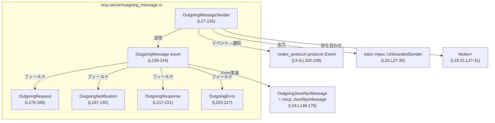
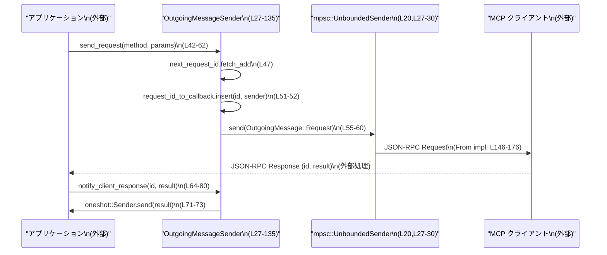

# mcp-server/src/outgoing_message.rs

## 0. ざっくり一言

JSON-RPC 2.0 / MCP クライアント向けに、サーバー側から送信するメッセージ（リクエスト・レスポンス・通知・エラー）を組み立て、送信し、対応するレスポンスを oneshot チャネルでコールバックに返すためのモジュールです（`outgoing_message.rs:L24-27,L42-52,L138-144`）。

---

## 1. このモジュールの役割

### 1.1 概要

- このモジュールは **サーバーからクライアントへの JSON-RPC/MCP メッセージ送信** を行い、特に
  - リクエスト送信とレスポンス用コールバック管理（`OutgoingMessageSender`）
  - JSON-RPC 2.0 形式への変換（`impl From<OutgoingMessage> for OutgoingJsonRpcMessage`）
  - MCP イベント (`codex_protocol::protocol::Event`) を通知形式に変換（`send_event_as_notification`）
  を提供します（`outgoing_message.rs:L24-27,L42-62,L102-125,L146-176`）。

### 1.2 アーキテクチャ内での位置づけ

主なコンポーネントと依存関係は以下のようになっています。



- 外部 API からは `OutgoingMessageSender` を通じてメッセージ送信が行われます（`L27-35`）。
- 内部では `OutgoingMessage` enum にまとめた上で、`rmcp::model::JsonRpcMessage` に変換して JSON-RPC 2.0 として送信する構造になっています（`L24,L138-144,L146-176`）。
- `request_id_to_callback` マップに `oneshot::Sender` を保存し、クライアントからのレスポンスを `notify_client_response` で対応する待ち手に返しています（`L27-31,L42-52,L64-80`）。

### 1.3 設計上のポイント

- **リクエスト ID の生成**
  - `AtomicI64` による単調増加の数値 ID を `Ordering::Relaxed` で生成しています（`L28,L36,L47`）。
  - メモリ順序を必要最小限に抑えた「ただのカウンタ」として利用している構造です。
- **コールバック管理**
  - 非同期コンテキストで `Mutex<HashMap<RequestId, oneshot::Sender<Value>>>` を管理し、ID とレスポンスの対応付けをします（`L27-31,L42-52,L64-68`）。
- **非同期・並行性**
  - `send_request` / `notify_client_response` / `send_*` 系はすべて `async fn` として定義され、`tokio::Mutex` と `tokio::mpsc::UnboundedSender` を利用することで複数タスクからの同時利用を前提とした設計です（`L19-21,L33-35,L42-62,L64-97,L102-135`）。
- **エラーハンドリング**
  - `send_response` でのシリアライズ失敗は JSON-RPC の Error メッセージとして返します（`L82-97`）。
  - `send_event_as_notification` でのイベント本体のシリアライズ失敗は `expect` により panic しますが、`OutgoingNotificationParams` への変換失敗は warn ログを出してフォールバックします（`L99-118`）。
  - mpsc 送信結果は常に無視 (`let _ = self.sender.send(...)`) しており、チャネル切断時もこのモジュール内では検知していません（`L60,L96,L129,L134`）。
- **MCP メタデータ**
  - MCP の meta 仕様に合わせた `OutgoingNotificationMeta` を `_meta` フィールドとして埋め込むための構造を用意しています（`L194-201,L203-215`）。

---

## 2. 主要な機能一覧

- OutgoingMessageSender の生成: mpsc 送信チャネルを受け取り、リクエスト ID カウンタとコールバックマップを初期化します（`L33-40`）。
- JSON-RPC リクエスト送信とレスポンス待ち: `send_request` でリクエストを送り、対応するレスポンスを受け取る `oneshot::Receiver` を返します（`L42-62`）。
- クライアントレスポンスの通知: `notify_client_response` で、受信した結果を対応するコールバックに渡します（`L64-80`）。
- JSON-RPC レスポンス送信: 任意の `Serialize` 型をシリアライズしてレスポンスとして送信します（`L82-97`）。
- MCP イベントの通知化: `Event` を MCP 仕様に沿った通知 (`method = "codex/event"`) として送信します（`L99-125`）。
- 汎用通知送信: 任意メソッド名とパラメータで通知を送信します（`L127-130`）。
- エラー送信: JSON-RPC Error メッセージを送信します（`L132-135`）。
- JSON-RPC 2.0 メッセージへの変換: `OutgoingMessage` を `JsonRpcMessage<CustomRequest, Value, CustomNotification>` に変換します（`L138-176`）。

---

## 3. 公開 API と詳細解説

### 3.1 型一覧（構造体・列挙体など）

| 名前 | 種別 | 役割 / 用途 | 定義箇所 |
|------|------|-------------|----------|
| `OutgoingJsonRpcMessage` | 型エイリアス | `rmcp::model::JsonRpcMessage`（JSON-RPC 2.0）へのエイリアス。`CustomRequest`/`Value`/`CustomNotification` を固定した利便用型です。 | `outgoing_message.rs:L24` |
| `OutgoingMessageSender` | 構造体 | クライアントへのメッセージ送信と、リクエスト ID とレスポンスコールバックの対応付けを管理します。 | `L27-31` |
| `OutgoingMessage` | 列挙体 | サーバー→クライアント方向のメッセージを「リクエスト/通知/レスポンス/エラー」に分類した内部表現です。 | `L138-144` |
| `OutgoingRequest` | 構造体 | 送信する JSON-RPC リクエストの ID・メソッド・パラメータを保持します。 | `L179-185` |
| `OutgoingNotification` | 構造体 | 送信する JSON-RPC 通知のメソッド・パラメータを保持します。 | `L187-192` |
| `OutgoingNotificationParams` | 構造体 | MCP 向けイベント通知の `params` 部を表現。`_meta` とイベント本体をまとめます。 | `L194-201` |
| `OutgoingNotificationMeta` | 構造体 | MCP meta 情報（`requestId` / `threadId`）を表現します。 | `L203-215` |
| `OutgoingResponse` | 構造体 | JSON-RPC レスポンスの ID と結果値 (`serde_json::Value`) を保持します。 | `L217-221` |
| `OutgoingError` | 構造体 | JSON-RPC エラーの ID と `ErrorData` を保持します。 | `L223-227` |

主要なメソッドは `OutgoingMessageSender` の `impl` ブロックに定義されています（`L33-135`）。

### 3.2 関数詳細（最大 7 件）

#### `OutgoingMessageSender::send_request(&self, method: &str, params: Option<serde_json::Value>) -> oneshot::Receiver<Value>`

**概要**

- クライアントに JSON-RPC リクエストを送信し、そのレスポンスを受け取るための `oneshot::Receiver<Value>` を返します（`L42-62`）。
- リクエスト ID を内部で生成し、レスポンス用コールバックを `request_id_to_callback` マップに登録します（`L47-52`）。

**引数**

| 引数名 | 型 | 説明 |
|--------|----|------|
| `method` | `&str` | JSON-RPC のメソッド名。例: `"elicitation/create"`（`L248-251` のテスト参照）。 |
| `params` | `Option<serde_json::Value>` | JSON-RPC の `params`。`None` の場合は params が省略されます（`L55-59,L179-185`）。 |

**戻り値**

- `oneshot::Receiver<Value>`  
  - クライアントからのレスポンス結果 (`serde_json::Value`) を一度だけ受信するための `oneshot` チャネルの受信側です（`L49-52`）。

**内部処理の流れ**

1. `next_request_id` から `fetch_add(1, Ordering::Relaxed)` で数値 ID を取得し、`RequestId::Number` に包みます（`L47`）。
2. `outgoing_message_id` として ID をクローンします。元の `id` はコールバックマップ用、クローンはメッセージ送信用です（`L48`）。
3. `oneshot::channel()` で `(tx_approve, rx_approve)` を作成します（`L49`）。
4. `request_id_to_callback` の `Mutex` を `lock().await` で取得し、`id` をキーとして `tx_approve` をマップに挿入します（`L51-52`）。
5. `OutgoingMessage::Request(OutgoingRequest { ... })` を構築し（`L55-59`）、内部の `mpsc::UnboundedSender` に送信します（`L60`）。
6. 呼び出し元に `rx_approve` を返します（`L61`）。

**Examples（使用例）**

```rust
use std::sync::Arc;
use tokio::sync::mpsc;
use serde_json::json;
use mcp_server::outgoing_message::{OutgoingMessageSender, OutgoingMessage};

// mpsc チャネルを作成し、送信側で OutgoingMessageSender を初期化する例
let (tx, mut rx) = mpsc::unbounded_channel::<OutgoingMessage>();           // サーバー→クライアント
let sender = Arc::new(OutgoingMessageSender::new(tx));                     // L33-40

// リクエストを送信してレスポンスを待つ
let sender_cloned = sender.clone();
let handle = tokio::spawn(async move {
    let params = Some(json!({ "k": "v" }));                                // 任意の JSON パラメータ
    let rx = sender_cloned.send_request("elicitation/create", params).await; // L42-62
    match rx.await {
        Ok(value) => println!("client responded: {value:?}"),
        Err(_canceled) => eprintln!("response channel was closed"),
    }
});

// 別タスクで OutgoingMessage を読み出してクライアントに送る処理を書くことができます
tokio::spawn(async move {
    while let Some(msg) = rx.recv().await {
        // msg を JSON-RPC に変換して送信
        let json_msg: OutgoingJsonRpcMessage = msg.into();                 // L146-176
        let json = serde_json::to_string(&json_msg).unwrap();
        // ここでソケットなどに書き出す
        println!("send to client: {json}");
    }
});
```

**Errors / Panics**

- mpsc チャネルへの送信に失敗した場合（チャネルクローズなど）、`send` は `Err` を返しますが、結果は破棄されます（`let _ = ...`、`L60`）。
  - この場合でも `request_id_to_callback` にはコールバックが残り続け、`oneshot::Receiver` は何も受信できないままになる可能性があります。
- この関数自身は `Result` を返さず、panic もしません。

**Edge cases（エッジケース）**

- 非常に多くのリクエストを送り、クライアントが応答しない場合、`request_id_to_callback` マップのサイズが増え続けます（`L27-31,L51-52`）。
- `next_request_id` が `i64::MAX` を越えたときの挙動はコード内で扱われていません（`L28,L36,L47`）。理論上はオーバーフローしますが、このファイル単体からは具体的な対処は読み取れません。

**使用上の注意点**

- `notify_client_response` が呼ばれないと、マップのエントリが削除されず、メモリ使用量が増加する可能性があります（`L64-68`）。
- チャネル送信失敗（クライアント切断など）は検出されず、呼び出し側は `oneshot::Receiver` 側で `Err(oneshot::error::RecvError)` を通じてのみ気づくことになります。
- 並行に複数タスクから呼び出しても、`AtomicI64` と `Mutex` により ID とマップの整合性は保たれる設計です（`L27-31,L36,L47,L51-52`）。

---

#### `OutgoingMessageSender::notify_client_response(&self, id: RequestId, result: Value)`

**概要**

- クライアントからのレスポンスを、`send_request` 時に保存した `oneshot::Sender` に渡す関数です（`L64-80`）。
- 対応するコールバックが見つからない場合や、`Receiver` 側が既にドロップされている場合は `warn!` ログを出力します（`L71-78`）。

**引数**

| 引数名 | 型 | 説明 |
|--------|----|------|
| `id` | `RequestId` | レスポンスに対応するリクエスト ID（`send_request` で生成したものと一致させる必要があります）。 |
| `result` | `serde_json::Value` | クライアントから返ってきた結果値。 |

**戻り値**

- なし（`()`）。エラーは戻り値ではなく `tracing::warn!` ログでのみ通知されます（`L71-78`）。

**内部処理の流れ**

1. `request_id_to_callback` の `Mutex` を `lock().await` で取得します（`L66`）。
2. `remove_entry(&id)` でマップから `(id, sender)` のペアを削除しつつ取得します（`L67`）。
3. `match` でエントリの有無を確認します（`L70`）。
   - `Some((id, sender))` の場合: `sender.send(result)` を呼び、`Err` のとき `warn!` を出します（`L71-74`）。
   - `None` の場合: コールバックが見つからなかった旨を `warn!` で出します（`L76-77`）。

**Examples（使用例）**

```rust
// クライアントから JSON-RPC レスポンスを受信したと仮定して、
// id と result を抽出した後、この関数を呼び出す例
async fn handle_incoming_response(sender: &OutgoingMessageSender, id: RequestId, result: serde_json::Value) {
    sender.notify_client_response(id, result).await; // L64-80
}
```

**Errors / Panics**

- `oneshot::Sender::send` が失敗した場合（受信側が既にドロップされている場合）、`Err` を返し、`warn!("could not notify callback for {id:?} due to: {err:?}")` を出力します（`L71-74`）。
- `Result` も panic も使っておらず、呼び出し側にエラーは伝播しません。

**Edge cases（エッジケース）**

- `id` に対応するエントリが存在しない場合（誤った ID、すでに処理済みの ID など）、`"could not find callback for {id:?}"` という `warn` が出力されるだけです（`L76-77`）。
- `result` が非常に大きな JSON であっても、ここでは単に `Sender` に渡すだけで特別な扱いはありません。

**使用上の注意点**

- `send_request` と同じ `RequestId` がクライアントから戻ってくることを前提としており、プロトコルレベルでの ID 整合性が重要です。
- ログレベル `warn` でしか問題が分からないため、障害解析の際はログ収集設定が重要になります（`L71-78`）。

---

#### `OutgoingMessageSender::send_response<T: Serialize>(&self, id: RequestId, response: T)`

**概要**

- 任意の `Serialize` 実装型を JSON にシリアライズし、JSON-RPC のレスポンスメッセージとしてクライアントに送信します（`L82-97`）。
- シリアライズに失敗した場合は、同じ ID で内部エラー (`ErrorData::internal_error`) をクライアントに返します（`L82-93`）。

**引数**

| 引数名 | 型 | 説明 |
|--------|----|------|
| `id` | `RequestId` | 対応するリクエスト ID（JSON-RPC 仕様上、レスポンスの `id` に入ります）。 |
| `response` | `T: Serialize` | レスポンスボディとして送信する値。`serde::Serialize` を実装している必要があります。 |

**戻り値**

- なし（`()`）。シリアライズ失敗時も戻り値ではエラーを返しません。

**内部処理の流れ**

1. `serde_json::to_value(response)` で `response` を `serde_json::Value` に変換しようとします（`L83-84`）。
2. `Ok(result)` の場合はそのまま使用し（`L83-85`）、`Err(err)` の場合は `send_error` を呼び出して内部エラーを送信し、早期 `return` します（`L85-92`）。
3. 成功時は `OutgoingMessage::Response(OutgoingResponse { id, result })` を構築し（`L95`）、`mpsc::UnboundedSender` に送信します（`L96`）。

**Examples（使用例）**

```rust
#[derive(serde::Serialize)]
struct MyResponse {
    message: String,
}

// ...
let id = RequestId::Number(42);
let body = MyResponse { message: "ok".into() };
sender.send_response(id, body).await;  // L82-97
```

**Errors / Panics**

- `serde_json::to_value` が失敗した場合：
  - `ErrorData::internal_error` を利用して `"failed to serialize response: {err}"` というメッセージのエラーを送信します（`L86-90`）。
  - その後、この関数は `return` し、レスポンスメッセージは送られません（`L91-92`）。
- `send_error` の送信失敗自体も、`let _ = self.sender.send(...)` により無視されます（`L132-135`）。

**Edge cases（エッジケース）**

- `response` にシリアライズできないフィールドが含まれている場合（循環参照や非シリアライズ型など）、上記の内部エラーがクライアントに返されます。
- `id` がクライアント側の期待と異なる場合、クライアントはレスポンスを正しく関連付けできない可能性がありますが、このモジュールでは検査しません。

**使用上の注意点**

- エラー内容の文字列はそのままクライアントに送られるため、内部実装の詳細や機密情報を含めない設計が望ましいです（`L86-90`）。
- `Send` の結果が無視されるため、チャネル切断など送信失敗を検知する必要がある場合は、上位レイヤで監視する必要があります（`L96`）。

---

#### `OutgoingMessageSender::send_event_as_notification(&self, event: &Event, meta: Option<OutgoingNotificationMeta>)`

**概要**

- MCP サーバー特有の API で、`codex_protocol::protocol::Event` を `"codex/event"` メソッドの JSON-RPC 通知として送信します（`L99-125`）。
- 必要に応じて MCP meta 情報 (`OutgoingNotificationMeta`) を `_meta` プロパティとして `params` に埋め込みます（`L110-113,L194-201`）。

**引数**

| 引数名 | 型 | 説明 |
|--------|----|------|
| `event` | `&Event` | MCP のイベントオブジェクト。`serde::Serialize` が実装されている前提です（`L5-6,L102-108`）。 |
| `meta` | `Option<OutgoingNotificationMeta>` | MCP meta 情報。`None` の場合は `_meta` が付きません（`L105,L110-113`）。 |

**戻り値**

- なし（`()`）。非同期に通知を送信します。

**内部処理の流れ**

1. `serde_json::to_value(event)` で `event` を JSON にシリアライズします。この処理には `expect("Event must serialize")` が使われており、失敗時は panic します（`L107-108`）。
2. `OutgoingNotificationParams { meta, event: event_json.clone() }` を `serde_json::to_value` で JSON に変換しようとします（`L110-113`）。
   - 成功 (`Ok(params)`) の場合はその値を使用します（`L110-115`）。
   - 失敗 (`Err(_)`) の場合は warn ログを出し（`L116`）、フォールバックとして `event_json` をそのまま `params` に使います（`L117-118`）。
3. `OutgoingNotification { method: "codex/event".to_string(), params: Some(params.clone()) }` を構築し（`L120-123`）、`send_notification` を呼び出します（`L120-124`）。

**Examples（使用例）**

テストコードでは、`SessionConfiguredEvent` を `Event` に包んで通知として送ることが確認されています（`L288-332,L334-401,L403-471`）。

```rust
// イベントのみを送る例（meta なし） - L288-332 に対応
let event = Event { /* ... */ };
outgoing_message_sender
    .send_event_as_notification(&event, None)
    .await;

// MCP meta を付与して送る例 - L334-401 に対応
let meta = OutgoingNotificationMeta {
    request_id: Some(RequestId::String("123".into())),
    thread_id: None,
};
outgoing_message_sender
    .send_event_as_notification(&event, Some(meta))
    .await;
```

**Errors / Panics**

- `event` のシリアライズに失敗した場合は `expect("Event must serialize")` により panic します（`L107-108`）。
- `OutgoingNotificationParams` への変換に失敗した場合は、
  - `warn!("Failed to serialize event as OutgoingNotificationParams")` を出力し（`L116`）、
  - `params` として `event_json` を使用します（`L117-118`）。
- `send_notification` 自体の送信失敗は無視されます（`L127-130`）。

**Edge cases（エッジケース）**

- `meta` を指定した場合、`OutgoingNotificationParams` により以下のような JSON になります（`L194-201,L203-215,L334-401,L403-471`）：

  ```json
  {
    "_meta": {
      "requestId": "123",
      "threadId": "thread-id-string"
    },
    "id": "1",
    "msg": {
      "type": "session_configured",
      "...": "..."
    }
  }
  ```

- `OutgoingNotificationParams` のシリアライズが失敗すると `_meta` およびイベントのフラット構造は失われ、`params` は単に `event` の JSON になります（`L110-118`）。

**使用上の注意点**

- `event` のシリアライズが失敗すると panic し、サーバープロセス全体に影響する可能性があります。その前提でイベント型に `Serialize` が正しく実装されている必要があります（`L107-108`）。
- MCP meta のフォーマットはコメントに記載の MCP 仕様に依存しているため（`L203-205`）、仕様変更時はこの構造体も見直す必要があります。

---

#### `OutgoingMessageSender::send_notification(&self, notification: OutgoingNotification)`

**概要**

- 任意の `OutgoingNotification` を `OutgoingMessage::Notification` として mpsc チャネルに送信します（`L127-130`）。
- MCP に限らない一般的な JSON-RPC 通知送信に利用できます。

**引数**

| 引数名 | 型 | 説明 |
|--------|----|------|
| `notification` | `OutgoingNotification` | メソッド名とパラメータを持つ通知オブジェクト（`L187-192`）。 |

**戻り値**

- なし（`()`）。

**内部処理の流れ**

1. `OutgoingMessage::Notification(notification)` を構築します（`L128`）。
2. `self.sender.send(outgoing_message)` を呼び出し、結果は `_` に捨てます（`L129`）。

**Examples（使用例）**

```rust
use serde_json::json;

let notification = OutgoingNotification {
    method: "notifications/initialized".to_string(),
    params: None,
};
sender.send_notification(notification).await; // L127-130
```

テスト `outgoing_notification_serializes_as_jsonrpc_notification` で、最終的な JSON-RPC メッセージが `{ "jsonrpc": "2.0", "method": "...", "params": null }` となることが確認されています（`L268-286`）。

**Errors / Panics**

- mpsc チャネル送信エラーは無視されます（`L129`）。
- panic 要因はありません。

**Edge cases / 使用上の注意点**

- `params: None` とした場合でも、rmcp 側のシリアライズにより JSON 上は `"params": null` として送られます（テスト `L279-282`）。
- 通知は JSON-RPC 仕様上レスポンスが返ってこないため、対応するコールバック管理は行われません。

---

#### `OutgoingMessageSender::send_error(&self, id: RequestId, error: ErrorData)`

**概要**

- JSON-RPC Error メッセージをクライアントに送信するためのショートカットです（`L132-135`）。
- 既存の `ErrorData` をそのまま利用して `OutgoingMessage::Error` を作成します。

**引数**

| 引数名 | 型 | 説明 |
|--------|----|------|
| `id` | `RequestId` | エラーが対応するリクエスト ID。通知エラーなど、ID を持たない場合の扱いはこのモジュールでは規定されていません。 |
| `error` | `ErrorData` | `rmcp::model::ErrorData`。JSON-RPC の error オブジェクトを表現します（`L9,L132-135`）。 |

**戻り値**

- なし（`()`）。

**内部処理の流れ**

1. `OutgoingMessage::Error(OutgoingError { id, error })` を構築します（`L133`）。
2. mpsc チャネルに送信し、結果は破棄します（`L134`）。

**Errors / Panics / 注意点**

- 送信失敗は無視されます。
- エラー内容はそのままクライアントに渡されるため、`ErrorData` の組み立て時に情報漏洩の観点を考慮する必要があります。

---

#### `impl From<OutgoingMessage> for OutgoingJsonRpcMessage`

```rust
impl From<OutgoingMessage> for OutgoingJsonRpcMessage {
    fn from(val: OutgoingMessage) -> Self { /* ... */ }
}
```

**概要**

- 内部表現である `OutgoingMessage` を、rmcp クレートの `JsonRpcMessage<CustomRequest, Value, CustomNotification>` に変換します（`L146-176`）。
- JSON-RPC 2.0 の `jsonrpc` フィールドを `"2.0"` に固定し、リクエスト・通知・レスポンス・エラーのそれぞれを適切な型にマッピングします。

**引数**

| 引数名 | 型 | 説明 |
|--------|----|------|
| `val` | `OutgoingMessage` | 送信したいメッセージ。`Request` / `Notification` / `Response` / `Error` の 4 種類があります（`L138-144`）。 |

**戻り値**

- `OutgoingJsonRpcMessage`  
  - `type OutgoingJsonRpcMessage = JsonRpcMessage<CustomRequest, Value, CustomNotification>;` によるエイリアス型です（`L24`）。

**内部処理の流れ**

1. `use OutgoingMessage::*;` で enum バリアントをインポートし、`match` で分岐します（`L148-149`）。
2. 各バリアントごとに：
   - `Request(OutgoingRequest { id, method, params })`  
     → `JsonRpcMessage::Request(JsonRpcRequest { jsonrpc: JsonRpcVersion2_0, id, request: CustomRequest::new(method, params) })`（`L150-155`）。
   - `Notification(OutgoingNotification { method, params })`  
     → `JsonRpcMessage::Notification(JsonRpcNotification { jsonrpc: JsonRpcVersion2_0, notification: CustomNotification::new(method, params) })`（`L157-161`）。
   - `Response(OutgoingResponse { id, result })`  
     → `JsonRpcMessage::Response(JsonRpcResponse { jsonrpc: JsonRpcVersion2_0, id, result })`（`L163-168`）。
   - `Error(OutgoingError { id, error })`  
     → `JsonRpcMessage::Error(JsonRpcError { jsonrpc: JsonRpcVersion2_0, id, error })`（`L170-174`）。

**Examples（使用例）**

テストでは、`OutgoingMessage` から `OutgoingJsonRpcMessage` に変換し、そのまま JSON にシリアライズして期待通りの JSON-RPC 形式になることが検証されています。

```rust
// リクエストの例 - L247-266
let msg: OutgoingJsonRpcMessage = OutgoingMessage::Request(OutgoingRequest {
    id: RequestId::Number(1),
    method: "elicitation/create".to_string(),
    params: Some(json!({ "k": "v" })),
}).into();

let value = serde_json::to_value(msg).unwrap();
assert_eq!(value.get("jsonrpc"), Some(&json!("2.0")));
assert_eq!(value.get("id"), Some(&json!(1)));
assert_eq!(value.get("method"), Some(&json!("elicitation/create")));
assert_eq!(value.get("params"), Some(&json!({ "k": "v" })));
assert!(value.get("request").is_none());  // rmcp 側で flatten されていることを確認
```

**Errors / Panics**

- この変換処理自体はエラーや panic を発生させません。
- `CustomRequest::new` / `CustomNotification::new` の挙動は rmcp クレート側の実装に依存し、このファイルからは詳細不明です（`L7-8,L150-161`）。

**使用上の注意点**

- rmcp クレート側のシリアライズ設定（flatten など）に依存して最終的な JSON 形状が決まるため、JSON-RPC 形式の変更が必要な場合は rmcp 側も併せて確認する必要があります。
- MCP レベルの互換性を保つためには、テスト（`L247-286,L288-471`）を更新することが重要です。

---

### 3.3 その他の関数

| 関数名 | 役割（1 行） | 定義箇所 |
|--------|--------------|----------|
| `OutgoingMessageSender::new(sender)` | `OutgoingMessageSender` の初期化。ID カウンタを 0 にし、空のコールバックマップを作成します。 | `L33-40` |
| テスト関数群（`outgoing_request_serializes_as_jsonrpc_request` など） | JSON-RPC 形式や MCP イベント→通知変換の挙動を検証するユニットテストです。 | `L246-471` |

---

## 4. データフロー

ここでは、もっとも重要な「リクエスト送信→レスポンス受信」のフローを説明します（対象: `send_request` / `notify_client_response`、`outgoing_message.rs:L42-80`）。

1. アプリケーションコードが `send_request` を呼び出し、`oneshot::Receiver` を受け取る（`L42-52`）。
2. `OutgoingMessageSender` はリクエスト ID を生成し、ID とレスポンス用 `oneshot::Sender` を `request_id_to_callback` に保存する（`L47-52`）。
3. `OutgoingMessage::Request` として mpsc チャネル経由で送信する（`L55-60`）。
4. 別タスクが `OutgoingMessage` を取り出し、`OutgoingJsonRpcMessage` に変換し、JSON-RPC としてクライアントへ送信する（`L146-176`）。
5. クライアントからレスポンスを受信した上位コードが `notify_client_response(id, result)` を呼ぶ（`L64-80`）。
6. `OutgoingMessageSender` はマップから `id` に対応する `Sender` を取り出し、`result` を送信する（`L66-74`）。
7. `send_request` 呼び出し側の `oneshot::Receiver` が `await` により `result` を受け取る。



- このフローにより、リクエスト送信側は `oneshot::Receiver` を通じて、非同期にレスポンスを受け取ることができます。
- `notify_client_response` はネットワークレイヤの受信処理などから呼ばれる想定ですが、その実装はこのファイルには現れません。

---

## 5. 使い方（How to Use）

### 5.1 基本的な使用方法

典型的な使用フローは「初期化 → リクエスト送信 → レスポンス受信」です。

```rust
use std::sync::Arc;
use tokio::sync::mpsc;
use serde_json::json;
use rmcp::model::RequestId;
use mcp_server::outgoing_message::{
    OutgoingMessageSender, OutgoingMessage, OutgoingJsonRpcMessage,
};

#[tokio::main]
async fn main() {
    // 1. mpsc チャネルの用意
    let (tx, mut rx) = mpsc::unbounded_channel::<OutgoingMessage>();       // L20,L27-30

    // 2. OutgoingMessageSender の初期化
    let sender = Arc::new(OutgoingMessageSender::new(tx));                  // L33-40

    // 3. リクエスト送信
    let send_clone = sender.clone();
    let handle = tokio::spawn(async move {
        let params = Some(json!({ "k": "v" }));
        let rx = send_clone
            .send_request("elicitation/create", params)                     // L42-62
            .await;
        match rx.await {
            Ok(result) => println!("result from client: {result}"),
            Err(e) => eprintln!("client did not respond: {e}"),
        }
    });

    // 4. 別タスクで OutgoingMessage を JSON-RPC に変換し、ネットワークに送信
    tokio::spawn(async move {
        while let Some(msg) = rx.recv().await {
            let jsonrpc_msg: OutgoingJsonRpcMessage = msg.into();           // L146-176
            let text = serde_json::to_string(&jsonrpc_msg).unwrap();
            // ここで TCP/WebSocket 等でクライアントに送信する
            println!("send to client: {text}");
        }
    });

    handle.await.unwrap();
}
```

### 5.2 よくある使用パターン

1. **イベント通知だけ送りたい場合**

```rust
// Event を codex/event 通知として送る (meta なし)
let event = Event { /* ... */ };
sender.send_event_as_notification(&event, None).await;      // L102-125
```

1. **meta を付けたイベント通知**

```rust
let event = Event { /* ... */ };
let meta = OutgoingNotificationMeta {
    request_id: Some(RequestId::String("123".into())),
    thread_id: Some(ThreadId::new()),
};
sender
    .send_event_as_notification(&event, Some(meta))         // L102-125
    .await;
```

1. **レスポンス・エラーの送信**

```rust
// 正常レスポンス
sender.send_response(RequestId::Number(1), json!({ "ok": true })).await;  // L82-97

// エラー
let error = ErrorData::internal_error("something went wrong".into(), None);
sender.send_error(RequestId::Number(1), error).await;                     // L132-135
```

### 5.3 よくある間違い

```rust
// 間違い例: send_request したが notify_client_response を呼ばない
let rx = sender.send_request("method", None).await;
// rx.await は永遠に返らない可能性がある

// 正しい例: ネットワーク受信側で必ず notify_client_response を呼び出す
async fn on_response(sender: &OutgoingMessageSender, id: RequestId, result: Value) {
    sender.notify_client_response(id, result).await;  // L64-80
}
```

```rust
// 間違い例: Event の Serialize 実装が壊れていると、send_event_as_notification が panic し得る
// -> このファイルからは、Event が必ずシリアライズ可能という前提が置かれている (L107-108)

// 対策例: Event の Serialize テストを別途用意しておくことで panic を防ぐ
```

### 5.4 使用上の注意点（まとめ）

- **並行性・安全性**
  - `OutgoingMessageSender` は `AtomicI64` と `tokio::Mutex` を利用しており、複数タスクから同時に利用してもデータレースが発生しない設計です（`L27-31,L36,L47,L51-52,L64-68`）。
- **リソース管理**
  - `request_id_to_callback` のエントリは `notify_client_response` が呼ばれたときのみ削除されるため、応答が返らないリクエストが大量に溜まるとメモリ使用量が増加します（`L64-68`）。
- **エラーハンドリング**
  - mpsc への送信失敗はすべて無視されるため、チャネルクローズ等の検知は上位レイヤに委ねられています（`L60,L96,L129,L134`）。
  - `send_event_as_notification` は Event のシリアライズ失敗を panic で扱うため、本番環境での利用では Event 型のテストが重要です（`L107-108`）。
- **セキュリティ**
  - `send_response` / `send_error` でクライアントに返すメッセージには内部情報を含めない設計が推奨されます（`L86-90`）。

---

## 6. 変更の仕方（How to Modify）

### 6.1 新しい機能を追加する場合

1. **新しいメッセージ種別を追加したい場合**
   - `OutgoingMessage` に新しいバリアントを追加します（`L138-144`）。
   - 対応するペイロード用構造体を定義します（`OutgoingRequest` / `OutgoingNotification` / `OutgoingResponse` / `OutgoingError` の例: `L179-227`）。
   - `impl From<OutgoingMessage> for OutgoingJsonRpcMessage` に新バリアントの変換ロジックを追加します（`L146-176`）。
   - 必要であれば、`OutgoingMessageSender` にヘルパーメソッドを追加します（`L33-135`）。

2. **MCP meta 情報を拡張したい場合**
   - `OutgoingNotificationMeta` にフィールドを追加し（`L208-214`）、`serde` 属性（`rename_all = "camelCase"`）と整合するようにします（`L207-208`）。
   - MCP 仕様コメント（`L203-205`）に合わせて JSON 形状が崩れていないかテストを追加・更新します（`L334-401,L403-471`）。

3. **イベントパラメータ形式を変えたい場合**
   - `OutgoingNotificationParams` の `serde` 属性（`rename = "_meta"`, `flatten`）を見直します（`L194-201`）。
   - テスト `test_send_event_as_notification*` の期待 JSON を合わせて更新します（`L288-471`）。

### 6.2 既存の機能を変更する場合

- **契約の確認（Contracts）**
  - `send_request` と `notify_client_response` は、`RequestId` による 1:1 対応という契約に依存しています（`L47-52,L64-74`）。
  - この契約を変更する場合は、コールバックマップのキーや構造を変更し、それに依存している上位コード全体を確認する必要があります。
- **テストの影響範囲**
  - JSON-RPC 形式に関わる変更（`OutgoingRequest` / `OutgoingNotification` / From 実装など）は、`outgoing_request_serializes_as_jsonrpc_request` と `outgoing_notification_serializes_as_jsonrpc_notification` テストに影響します（`L247-286`）。
  - MCP イベント通知関連の変更は `test_send_event_as_notification*` 系テストに影響します（`L288-471`）。
- **エラーハンドリングの変更**
  - 現状、送信エラーは無視されています（`L60,L96,L129,L134`）。これを `Result` で返すように変更する場合は、呼び出し側のコードすべてが影響を受けます。
- **パフォーマンス上の注意**
  - `send_request` / `notify_client_response` は `Mutex` を使っているため、高頻度で大量のリクエストが発生する環境ではロック争いが起こり得ます（`L51-52,L66-67`）。
  - その場合、ロックフリーな構造や sharding された複数マップへの分割等を検討する余地はありますが、このファイル単体からは具体的な要件は分かりません。

---

## 7. 関連ファイル

このモジュールと密接に関係する外部コンポーネント・テストは以下の通りです。

| パス / クレート | 役割 / 関係 |
|----------------|------------|
| `rmcp::model::{JsonRpcMessage, JsonRpcRequest, JsonRpcResponse, JsonRpcNotification, JsonRpcError, CustomRequest, CustomNotification, ErrorData, RequestId, JsonRpcVersion2_0}` | JSON-RPC 2.0 メッセージとエラーの型を提供し、本モジュールの `OutgoingJsonRpcMessage` や `OutgoingError` などの基盤となっています（`L7-16,L146-176,L223-227`）。 |
| `codex_protocol::protocol::{Event, EventMsg, SessionConfiguredEvent, SandboxPolicy, AskForApproval}` | MCP のイベント表現。`send_event_as_notification` で通知に変換され、テストで具体的なイベントインスタンスが使われています（`L5-6,L288-315,L334-358,L403-427`）。 |
| `codex_protocol::ThreadId` | MCP のスレッド ID を表現し、`OutgoingNotificationMeta.thread_id` に埋め込まれます（`L5,L208-215,L288-315,L334-358,L403-427`）。 |
| `tokio::sync::{mpsc, oneshot, Mutex}` | 非同期チャネルとミューテックスを提供し、メッセージ送信とコールバック管理の基盤となります（`L19-21,L27-31,L42-62,L64-68`）。 |
| `tests` モジュール（同ファイル内 `#[cfg(test)] mod tests`） | JSON-RPC のシリアライズ結果と、`send_event_as_notification` の MCP 仕様に合わせたパラメータ形状を検証するテスト群です（`L229-471`）。 |

このファイルに依存する上位レイヤ（ネットワーク送受信やプロトコルエンジン等）の実装は、このチャンクには現れないため不明です。
