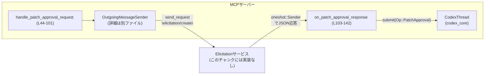
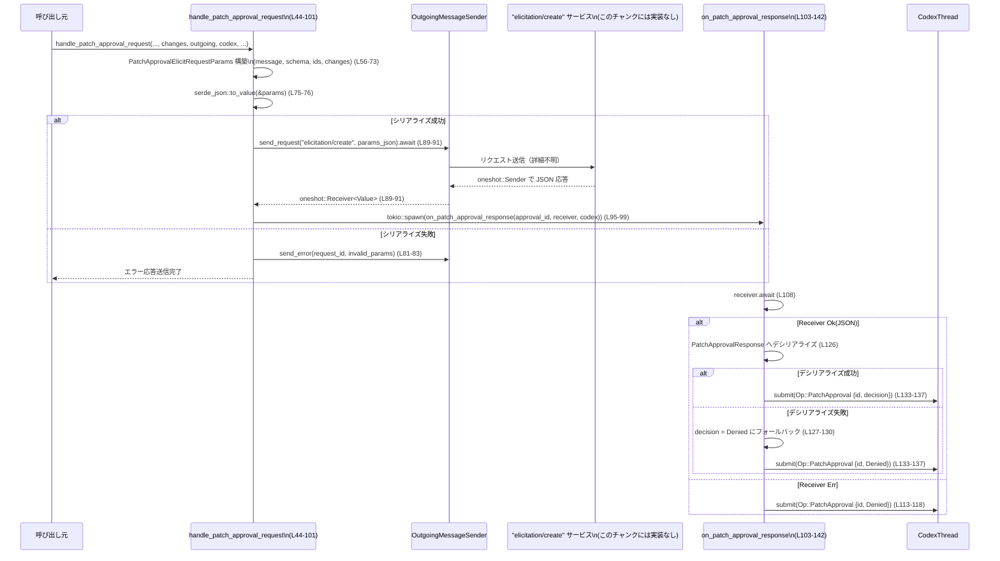

# mcp-server/src/patch_approval.rs

## 0. ざっくり一言

ユーザー（または外部システム）に「提案されたコード変更を適用してよいか」を問い合わせるための elicitation リクエストを送り、その承認／拒否の結果を Codex 側に `PatchApproval` オペレーションとして返すモジュールです（`mcp-server/src/patch_approval.rs:L20-41, L44-142`）。

---

## 1. このモジュールの役割

### 1.1 概要

- このモジュールは、Codex が提案したファイル変更（パッチ）に対して、ユーザーからの承認を取得するための **elicitation リクエストパラメータの構築・送信** と、その **応答の処理** を行います（`L44-101, L103-142`）。
- 送信側では `PatchApprovalElicitRequestParams` 構造体を JSON にシリアライズし、`OutgoingMessageSender` 経由で `elicitation/create` リクエストを送ります（`L63-75, L89-91`）。
- 受信側では oneshot チャネルで返ってくる JSON を `PatchApprovalResponse` としてデシリアライズし、`CodexThread` に `Op::PatchApproval` を送信します（`L103-141`）。

### 1.2 アーキテクチャ内での位置づけ

このモジュールは、MCP サーバー内部の「パッチ承認フロー」の中間に位置し、外部 elicitation サービスと Codex コアスレッドの橋渡しをします。



- `handle_patch_approval_request` が `OutgoingMessageSender` にリクエスト送信を依頼し、その結果として oneshot::Receiver を受け取ります（`L89-91`）。
- その Receiver は `tokio::spawn` されたタスク内で `on_patch_approval_response` に渡され、非同期に処理されます（`L95-100`）。
- `on_patch_approval_response` は成功／失敗に関わらず `CodexThread::submit(Op::PatchApproval { .. })` を呼び、Codex に決定を通知します（`L113-121, L133-140`）。

### 1.3 設計上のポイント

- **構造体によるパラメータ集約**  
  elicitation リクエストのパラメータは `PatchApprovalElicitRequestParams` に集約され、serde を使って JSON シリアライズされます（`L20-36, L63-75`）。
- **非同期・非ブロッキング**  
  応答待ちを `tokio::spawn` で別タスクに分離し、「メインエージェントループをブロックしない」というコメント付きで設計されています（`L93-99`）。
- **安全側に倒すエラー処理**  
  - リクエストパラメータのシリアライズ失敗時は `invalid_params` エラーをクライアントに返して終了します（`L75-86`）。
  - 応答取得失敗やデシリアライズ失敗時には、ログを出した上で `ReviewDecision::Denied` として扱います（`L111-121, L126-131`）。
- **スレッド安全な共有**  
  `Arc<OutgoingMessageSender>` と `Arc<CodexThread>` を使い、複数タスクから共有してもデータ競合が起きないようになっています（`L49-50, L95-99, L103-107`）。

---

## 2. 主要な機能一覧

- パッチ承認 elicitation パラメータの構築と送信: `handle_patch_approval_request` がメッセージ本文や変更内容をまとめてリクエストを発行します（`L44-101`）。
- elicitation 応答の受信と Codex への決定通知: `on_patch_approval_response` が JSON 応答を解釈し、`Op::PatchApproval` を `CodexThread` に送ります（`L103-142`）。

---

## 3. 公開 API と詳細解説

### 3.1 型一覧（構造体・列挙体など）

| 名前 | 種別 | 役割 / 用途 | 定義位置 |
|------|------|-------------|----------|
| `PatchApprovalElicitRequestParams` | 構造体 | `elicitation/create` 呼び出しに渡すパラメータ群。メッセージ、スレッドID、ツール呼び出しID、変更内容などを含む。 | `mcp-server/src/patch_approval.rs:L20-36` |
| `PatchApprovalResponse` | 構造体 | elicitation サービスから返されるパッチ承認結果（`ReviewDecision`）を保持する。 | `mcp-server/src/patch_approval.rs:L38-41` |

#### `PatchApprovalElicitRequestParams` のフィールド概要

（根拠: `mcp-server/src/patch_approval.rs:L20-36`）

- `message: String`  
  ユーザーに提示するメッセージ本文。理由テキストと「変更を適用してよいか？」の定型文を改行で結合したものが入ります（`L56-61, L64`）。
- `requested_schema: Value`  
  期待されるレスポンススキーマを JSON で表現したフィールド。ここでは空オブジェクト型（`{"type":"object","properties":{}}`）が固定で使われています（`L65`）。
- `thread_id: ThreadId`  
  この承認が紐づくスレッド ID（`L25-26, L66`）。
- `codex_elicitation: String`  
  elicitation の種類を示す文字列。`"patch-approval"` が固定値として設定されています（`L67`）。
- `codex_mcp_tool_call_id: String`  
  MCP ツール呼び出し ID（`L28-29, L68`）。
- `codex_event_id: String`  
  イベント ID（`L29-30, L69`）。
- `codex_call_id: String`  
  呼び出し ID。承認 ID としても利用されます（`L30, L70`）。
- `codex_reason: Option<String>`  
  変更が必要な理由など任意メッセージ。`None` の場合はシリアライズ時にフィールド自体が省略されます（`L31-32, L71`）。
- `codex_grant_root: Option<PathBuf>`  
  許可対象となるルートディレクトリ。`None` の場合は省略されます（`L33-34, L72`）。
- `codex_changes: HashMap<PathBuf, FileChange>`  
  提案されたファイル変更一覧。キーがパス、値が `FileChange` です（`L35, L73`）。

serde 属性:

- `requested_schema` と `thread_id` は JSON 上で `requestedSchema`, `threadId` という名前でシリアライズされます（`L23-26`）。
- `codex_reason`, `codex_grant_root` は `None` のときシリアライズされません（`L31-34`）。

#### `PatchApprovalResponse` のフィールド概要

（根拠: `mcp-server/src/patch_approval.rs:L38-41`）

- `decision: ReviewDecision`  
  承認結果を表します。`ReviewDecision` は他モジュールで定義されており、このチャンクには詳細がありません。

### 3.2 関数詳細

#### `handle_patch_approval_request(...) -> ()`

```rust
#[allow(clippy::too_many_arguments)]
pub(crate) async fn handle_patch_approval_request(
    call_id: String,
    reason: Option<String>,
    grant_root: Option<PathBuf>,
    changes: HashMap<PathBuf, FileChange>,
    outgoing: Arc<OutgoingMessageSender>,
    codex: Arc<CodexThread>,
    request_id: RequestId,
    tool_call_id: String,
    event_id: String,
    thread_id: ThreadId,
)
```

**概要**

- パッチ承認用のメッセージとパラメータを組み立て、`OutgoingMessageSender` を使って `elicitation/create` リクエストを送信します（`L56-75, L89-91`）。
- 応答を受け取る oneshot::Receiver を、`on_patch_approval_response` を実行する別タスクに渡してスケジュールします（`L89-100`）。
- 直接の戻り値は `()` で、副作用として「エラー返信送信」または「承認フローの開始」を行います。

（定義位置: `mcp-server/src/patch_approval.rs:L44-101`）

**引数**

| 引数名 | 型 | 説明 |
|--------|----|------|
| `call_id` | `String` | 承認リクエストを一意に識別する ID。`PatchApprovalElicitRequestParams.codex_call_id` としても利用され、`approval_id` として応答処理にも引き継がれます（`L44-56, L70, L95-99, L103-105`）。 |
| `reason` | `Option<String>` | パッチ適用理由など任意の説明文。存在する場合はメッセージ先頭行として利用され、パラメータにも格納されます（`L46, L58-60, L71`）。 |
| `grant_root` | `Option<PathBuf>` | 許可するルートパス。`PatchApprovalElicitRequestParams.codex_grant_root` に渡されます（`L47, L72`）。 |
| `changes` | `HashMap<PathBuf, FileChange>` | 提案されたファイル変更一覧。`PatchApprovalElicitRequestParams.codex_changes` に渡されます（`L48, L73`）。 |
| `outgoing` | `Arc<OutgoingMessageSender>` | リクエスト／エラーを外部に送る送信オブジェクト。エラー返信や elicitation リクエスト送信に使用されます（`L49, L81-83, L89-91`）。 |
| `codex` | `Arc<CodexThread>` | Codex コアスレッド。応答処理タスクにクローンして渡されます（`L50, L95-99`）。 |
| `request_id` | `RequestId` | エラー発生時に `send_error` に渡す RMCP リクエスト ID（`L51, L81-83`）。 |
| `tool_call_id` | `String` | MCP ツール呼び出し ID。パラメータ `codex_mcp_tool_call_id` に格納されます（`L52, L68`）。 |
| `event_id` | `String` | イベント ID。パラメータ `codex_event_id` に格納されます（`L53, L69`）。 |
| `thread_id` | `ThreadId` | この承認が紐づくスレッド ID。`PatchApprovalElicitRequestParams.thread_id` に格納されます（`L54, L66`）。 |

**戻り値**

- `()`（ユニット型）  
  戻り値はなく、副作用として:
  - 正常系: elicitation リクエストを送信し、応答を処理するタスクを起動します（`L89-100`）。
  - エラー系: エラーをログ出力し、RMCP クライアントに `invalid_params` エラーを返して終了します（`L78-86`）。

**内部処理の流れ（アルゴリズム）**

1. `approval_id` のコピー作成  
   - `call_id` をクローンして `approval_id` に保持し、後続のタスクで利用できるようにします（`L56`）。
2. メッセージ本文の組み立て  
   - 空の `Vec<String>` を作成し（`L57`）、`reason` が `Some` の場合はその文字列を push（`L58-60`）。
   - 最後に `"Allow Codex to apply proposed code changes?"` という固定メッセージを push します（`L61`）。
   - `message_lines.join("\n")` によって改行区切りの単一文字列にまとめます（`L64`）。
3. `PatchApprovalElicitRequestParams` の構築  
   - 上記メッセージ、固定の `requested_schema`、引数から渡された各種 ID、ルート、変更一覧をフィールドにセットします（`L63-73`）。
4. JSON へのシリアライズ  
   - `serde_json::to_value(&params)` を `match` で評価し（`L75`）:
     - `Ok(value)` の場合はそのまま `params_json` として使用（`L76`）。
     - `Err(err)` の場合は:
       - エラーメッセージを生成してログに `error!` で出力（`L78-79`）。
       - `outgoing.send_error(request_id.clone(), ErrorData::invalid_params(message, None)).await` によりクライアントにエラーを返し（`L81-83`）、関数を `return` で終了します（`L85`）。
5. elicitation リクエストの送信  
   - `outgoing.send_request("elicitation/create", Some(params_json)).await` を呼び出し、応答を受け取る oneshot::Receiver を `on_response` として受け取ります（`L89-91`）。
6. 応答処理タスクの起動  
   - `Arc<CodexThread>` と `approval_id` をクローンし（`L95-96`）、`tokio::spawn` で非同期タスクを起動します（`L97-99`）。
   - タスク内で `on_patch_approval_response(approval_id, on_response, codex).await` を呼びます（`L97-99`）。
   - コメントに「メインエージェントループをブロックしないため」と明記されています（`L93-94`）。

**Examples（使用例）**

以下は、必要な依存オブジェクトがすでに用意されている前提で、承認リクエストを発行する例です。

```rust
use std::collections::HashMap;
use std::path::PathBuf;
use std::sync::Arc;

use codex_core::CodexThread;
use codex_protocol::ThreadId;
use codex_protocol::protocol::FileChange;
use rmcp::model::RequestId;

// ここでは OutgoingMessageSender と CodexThread の生成方法は別モジュールにあるため省略します。
// let outgoing: Arc<OutgoingMessageSender> = /* ... */;
// let codex: Arc<CodexThread> = /* ... */;

async fn request_patch_approval_example(
    outgoing: Arc<OutgoingMessageSender>, // 事前に用意された送信オブジェクト
    codex: Arc<CodexThread>,              // 事前に用意された Codex スレッド
) {
    let call_id = "approval-123".to_string();                // 承認リクエストのID
    let reason = Some("Refactor module X for better clarity".to_string()); // 理由文
    let grant_root = Some(PathBuf::from("/workspace/project"));           // 許可するルートパス

    let mut changes: HashMap<PathBuf, FileChange> = HashMap::new();      // 変更一覧
    // changes.insert(PathBuf::from("src/lib.rs"), file_change_value);   // FileChangeの詳細はこのチャンクには現れません

    let request_id = RequestId::from("req-1");                // RequestId の具体的な生成は別モジュール依存です
    let tool_call_id = "tool-call-1".to_string();
    let event_id = "event-1".to_string();
    let thread_id = ThreadId::from("thread-1");               // ThreadId の生成方法も別モジュール依存です

    handle_patch_approval_request(
        call_id,
        reason,
        grant_root,
        changes,
        outgoing.clone(),
        codex.clone(),
        request_id,
        tool_call_id,
        event_id,
        thread_id,
    ).await;   // async 関数なので .await が必要
}
```

このコードを実行すると、外部の elicitation サービスにパッチ承認を求めるリクエストが送信され、応答処理は別タスクで行われます。

**Errors / Panics**

- **シリアライズエラー**  
  `serde_json::to_value(&params)` が失敗した場合（`L75-79`）:
  - `error!` ログにメッセージが出力されます（`L79`）。
  - `outgoing.send_error(request_id.clone(), ErrorData::invalid_params(message, None)).await` によりクライアントにエラーが通知されます（`L81-83`）。
  - 関数は `return` し、それ以降の処理は実行されません（`L85`）。
- **`send_request` のエラー**  
  この関数自体では `send_request` の内部エラーはハンドリングしていませんが、返された oneshot::Receiver の受信失敗は `on_patch_approval_response` 側で処理されます（`L103-124`）。  
  したがって、この関数の責務としては「Receiver を取得してタスクを起動するところまで」と言えます。
- **panic の可能性**  
  この関数内では `unwrap` などは使用されておらず、`serde_json::to_value` も `match` でハンドリングされているため、通常のパスでは panic の可能性は見えません（`L75-87`）。  
  `tokio::spawn` 自体は、Tokio ランタイムが存在しない環境では呼び出せませんが、その前提はコード外の設定に依存し、このチャンクからは詳細は分かりません。

**Edge cases（エッジケース）**

- `reason == None` の場合  
  - メッセージ本文は `"Allow Codex to apply proposed code changes?"` だけになります（`L58-61`）。  
  - `codex_reason` フィールドも `None` であり、シリアライズ時に省略されます（`L31-32, L71`）。
- `changes` が空の `HashMap` の場合  
  - そのまま `codex_changes` として送信されます（`L73`）。  
  - 空であることが許容されるかどうかは elicitation サービス側の仕様に依存し、このチャンクからは分かりません。
- `grant_root == None` の場合  
  - `codex_grant_root` は `None` となりシリアライズ時に省略されます（`L33-34, L72`）。
- `OutgoingMessageSender::send_request` が内部でエラーを返し、Receiver 側で `Err` となった場合  
  - その場合は `on_patch_approval_response` において `ReviewDecision::Denied` が送信されます（`L108-121`）。

**使用上の注意点**

- **非同期文脈での利用**  
  関数は `async fn` なので、Tokio などの非同期ランタイム上で `.await` する必要があります（`L44, L97`）。
- **`Arc` の共有**  
  `outgoing` と `codex` は `Arc` である必要があり、複数タスク間で共有されることを前提としています（`L49-50, L95-99`）。
- **エラー時の挙動**  
  シリアライズエラー時に `invalid_params` を返して終了するため、その場合は承認ダイアログ自体が表示されないことになります（`L78-86`）。  
  クライアント側でこのエラーを適切に扱う必要があります。
- **セキュリティ観点**  
  任意のパスや変更内容を `codex_changes` として送るため、呼び出し側はこれらの値が信頼できることを確認してから渡すべきです。  
  ただし、このファイル内では入力検証は行っておらず、検証の有無は呼び出し元・他モジュールの責務になっています。

---

#### `on_patch_approval_response(approval_id: String, receiver: oneshot::Receiver<Value>, codex: Arc<CodexThread>) -> ()`

```rust
pub(crate) async fn on_patch_approval_response(
    approval_id: String,
    receiver: tokio::sync::oneshot::Receiver<serde_json::Value>,
    codex: Arc<CodexThread>,
)
```

**概要**

- `handle_patch_approval_request` によって起動された別タスク内で呼ばれ、oneshot::Receiver から elicitation 応答 JSON を受信します（`L103-109`）。
- 応答 JSON を `PatchApprovalResponse` にデシリアライズし、その `decision: ReviewDecision` を `CodexThread::submit(Op::PatchApproval { .. })` で Codex に通知します（`L126-131, L133-140`）。
- チャネル受信エラーやデシリアライズエラー時にはログを出しつつ、デフォルトで `ReviewDecision::Denied` を送信します（`L111-121, L126-131`）。

（定義位置: `mcp-server/src/patch_approval.rs:L103-142`）

**引数**

| 引数名 | 型 | 説明 |
|--------|----|------|
| `approval_id` | `String` | この承認フローを識別する ID。`Op::PatchApproval { id: approval_id, .. }` の `id` として利用されます（`L104-105, L114-116, L134-136`）。 |
| `receiver` | `tokio::sync::oneshot::Receiver<serde_json::Value>` | `OutgoingMessageSender::send_request` から返された、elicitation 応答 JSON を受け取る oneshot チャネルの Receiver（`L105, L108-110`）。 |
| `codex` | `Arc<CodexThread>` | Codex コアスレッド。`submit(Op::PatchApproval { .. })` を呼び出すために使用されます（`L106, L113-121, L133-140`）。 |

**戻り値**

- `()`（ユニット型）  
  戻り値はなく、副作用として:
  - チャネル受信・デシリアライズに応じて `Op::PatchApproval` を Codex に送信します（`L113-121, L133-140`）。

**内部処理の流れ（アルゴリズム）**

1. 応答の受信  
   - `let response = receiver.await;` で oneshot::Receiver から結果を待ちます（`L108`）。
   - これは `Result<serde_json::Value, RecvError>` 型です。
2. 受信結果の判定  
   - `match response` により分岐します（`L109-124`）。
   - `Ok(value)` の場合:
     - そのまま `value` を後続の処理に渡します（`L110`）。
   - `Err(err)` の場合:
     - `error!("request failed: {err:?}");` でエラーをログ出力（`L112`）。
     - `codex.submit(Op::PatchApproval { id: approval_id.clone(), decision: ReviewDecision::Denied, }).await` を呼び出し、失敗したリクエストに対して `Denied` として通知します（`L113-118`）。
     - `submit` 自体が `Err` を返した場合は、追加の `error!` ログを出します（`L119-121`）。
     - 処理を `return` で終了します（`L122`）。
3. JSON のデシリアライズ  
   - `serde_json::from_value::<PatchApprovalResponse>(value)` を実行し、その結果に対して `unwrap_or_else` します（`L126`）。
   - デシリアライズ成功時:
     - `PatchApprovalResponse { decision, .. }` が得られ、そのまま使用します（`L126-127, L133-137`）。
   - 失敗時:
     - `error!("failed to deserialize PatchApprovalResponse: {err}");` を出力（`L127`）。
     - `PatchApprovalResponse { decision: ReviewDecision::Denied }` というデフォルト値を用意します（`L128-130`）。
4. Codex への通知  
   - `codex.submit(Op::PatchApproval { id: approval_id, decision: response.decision, }).await` を呼び出します（`L133-137`）。
   - ここで `submit` が `Err` を返した場合、`error!("failed to submit PatchApproval: {err}");` が出力されます（`L139-140`）。

**Examples（使用例）**

`handle_patch_approval_request` からは通常 `tokio::spawn` 経由でこの関数が呼ばれるため、直接呼び出すケースは限定的です。  
テストやデバッグ用途で、モックした Receiver から `Approved` 応答を送る例を示します。

```rust
use std::sync::Arc;
use tokio::sync::oneshot;
use serde_json::json;
use codex_core::CodexThread;

// CodexThread のモックやテスト用実装はこのチャンクには現れないため、
// ここでは仮の型/実装があると仮定します。

async fn on_patch_approval_response_example(codex: Arc<CodexThread>) {
    let (tx, rx) = oneshot::channel();             // JSON Value を送るための oneshot チャネル
    let approval_id = "approval-123".to_string();

    // 別タスクで on_patch_approval_response を待機
    let codex_clone = codex.clone();
    tokio::spawn(async move {
        on_patch_approval_response(approval_id, rx, codex_clone).await;
    });

    // テスト側で PatchApprovalResponse を JSON として送信
    let response_json = json!({
        "decision": "Approved",   // ReviewDecision の具体的なシリアライズ形式は別モジュールに依存します
    });
    let _ = tx.send(response_json);               // 送信エラーはここでは無視
}
```

**Errors / Panics**

- **Receiver 受信エラー (`receiver.await` が `Err`)**  
  - ログ: `"request failed: {err:?}"` が出力されます（`L112`）。
  - Codex には `Op::PatchApproval { id: approval_id.clone(), decision: ReviewDecision::Denied }` が送られます（`L113-118`）。
  - もし `submit` 自体が失敗した場合、追加の `"failed to submit denied PatchApproval after request failure: {submit_err}"` ログが出力されます（`L119-121`）。
  - この場合、元の承認リクエストは「取得できなかったので拒否と見なす」挙動になります。
- **JSON デシリアライズエラー**  
  - `serde_json::from_value::<PatchApprovalResponse>(value)` が失敗すると、ログに `"failed to deserialize PatchApprovalResponse: {err}"` が出力されます（`L126-127`）。
  - その後、`decision: ReviewDecision::Denied` を持つデフォルトレスポンスが使用されます（`L128-130`）。
- **Codex への submit 失敗**  
  - `codex.submit(..).await` が `Err` を返した場合、ログに `"failed to submit PatchApproval: {err}"` が出力されます（`L139-140`）。
  - それ以外のリカバリは行われません。
- **panic の可能性**  
  - `serde_json::from_value` の結果は `unwrap_or_else` でハンドリングされており panic を起こしません（`L126-131`）。
  - それ以外に `unwrap` などの panic を誘発する呼び出しはありません。

**Edge cases（エッジケース）**

- **応答が送られないまま Receiver が破棄された場合**  
  - `receiver.await` は `Err` になり、`ReviewDecision::Denied` を Codex に送るパスが実行されます（`L108-121`）。
- **応答 JSON に `decision` が存在しない場合、またはフォーマットが不正な場合**  
  - `PatchApprovalResponse` へのデシリアライズが失敗し、ログが出た上で `Denied` として扱われます（`L126-131`）。
- **未知のフィールドが JSON に含まれる場合**  
  - `PatchApprovalResponse` には `deny_unknown_fields` 属性が付与されていないため、標準的な serde の挙動では未知フィールドは無視されます。  
    ただしこの挙動は serde の一般仕様に基づくものであり、このファイルには明示的な記述はありません。

**使用上の注意点**

- **安全側のデフォルト**  
  何らかの理由で応答が取得できない・解釈できない場合にも、必ず `Denied` が Codex に送られるようになっています（`L113-121, L128-130`）。  
  これにより、承認が不明なまま変更が適用される事態を防いでいます。
- **非同期実行前提**  
  この関数は通常 `tokio::spawn` によってバックグラウンドタスクとして実行される前提で書かれており（`L95-99`）、メインスレッドをブロックしません。
- **セキュリティ・整合性**  
  `approval_id` と `decision` の組み合わせが Codex 側でどのように使用されるかは、このチャンクには現れませんが、ID を正しく対応させることが重要です。  
  `approval_id` は呼び出し元から受け取った `call_id` と同一であり（`L56, L95-99, L103-105`）、混線を避ける必要があります。

### 3.3 その他の関数

このファイルには、上記 2 関数以外の補助的な関数やラッパー関数は定義されていません（`L44-142`）。

---

## 4. データフロー

ここでは、`handle_patch_approval_request` から `on_patch_approval_response` を経て Codex へ `PatchApproval` が送られるまでの典型的なフローを示します。

### パッチ承認フロー（handle_patch_approval_request (L44-101) → on_patch_approval_response (L103-142)）



要点:

- 送信側と受信側は `oneshot::Receiver<serde_json::Value>` を通して疎結合になっており、`handle_patch_approval_request` は応答処理ロジックを知らずに済みます（`L89-91, L103-109`）。
- 過程のどこかで失敗が起きても、最終的に Codex にはかならず `PatchApproval` が送られ、決定が Denied に倒れます（`L113-121, L128-130, L133-140`）。

---

## 5. 使い方（How to Use）

### 5.1 基本的な使用方法

このモジュールの典型的な使い方は、MCP サーバーの処理の一部としてパッチを提案したタイミングで `handle_patch_approval_request` を呼び、承認結果は `CodexThread` 側でハンドリングする、という形になります。

```rust
use std::collections::HashMap;
use std::path::PathBuf;
use std::sync::Arc;

use codex_core::CodexThread;
use codex_protocol::ThreadId;
use codex_protocol::protocol::FileChange;
use rmcp::model::RequestId;
use crate::outgoing_message::OutgoingMessageSender;

async fn propose_changes_and_request_approval(
    outgoing: Arc<OutgoingMessageSender>,   // 別モジュールで初期化された送信オブジェクト
    codex: Arc<CodexThread>,                // 別モジュールで初期化された Codex スレッド
    thread_id: ThreadId,
) {
    // 1. パッチ（変更内容）の構築
    let mut changes = HashMap::<PathBuf, FileChange>::new();
    // ここで changes に FileChange を詰める（詳細はこのチャンクには現れません）

    // 2. メタ情報の準備
    let call_id = "approval-xyz".to_string();
    let reason = Some("Apply suggested refactorings in module Y".to_string());
    let grant_root = Some(PathBuf::from("/workspace/project"));
    let request_id = RequestId::from("req-123");
    let tool_call_id = "mcp-tool-call-1".to_string();
    let event_id = "event-xyz".to_string();

    // 3. 承認リクエストの送信
    handle_patch_approval_request(
        call_id,
        reason,
        grant_root,
        changes,
        outgoing,
        codex,
        request_id,
        tool_call_id,
        event_id,
        thread_id,
    ).await;
    // 承認結果は CodexThread::submit(Op::PatchApproval { .. }) 経由で別途処理される
}
```

### 5.2 よくある使用パターン

1. **理由付きの承認リクエスト**  
   `reason: Some(String)` を渡すと、メッセージの先頭行に理由が表示され、その後に定型メッセージが続きます（`L58-61`）。

2. **理由なしの承認リクエスト**  
   `reason: None` の場合は、定型メッセージだけがユーザーに表示されます（`L58-61`）。  
   クイックな承認ダイアログを出したい場合に利用できます。

3. **ルートパスに制限を設けた承認**  
   `grant_root` に特定のパスを渡すことで、「このディレクトリ以下の変更のみを対象にする」といったポリシーを別の層で表現できます（`L47, L72`）。  
   このファイル内では `grant_root` の解釈は行わず、あくまで情報として渡すだけです。

### 5.3 よくある間違い

このファイルのコードと Rust の一般的なルールから想定される誤用例を挙げます。

```rust
// 間違い例: async コンテキスト外で呼び出している
fn wrong_usage(
    outgoing: Arc<OutgoingMessageSender>,
    codex: Arc<CodexThread>,
    thread_id: ThreadId,
) {
    // コンパイルエラー: async fn は .await が必要で、async コンテキストから呼ぶ必要がある
    // handle_patch_approval_request(/* ... */);
}

// 正しい例: async 関数内から .await で呼ぶ
async fn correct_usage(
    outgoing: Arc<OutgoingMessageSender>,
    codex: Arc<CodexThread>,
    thread_id: ThreadId,
) {
    // 引数は省略
    handle_patch_approval_request(
        /* call_id */ "id".to_string(),
        /* reason */ None,
        /* grant_root */ None,
        /* changes */ HashMap::new(),
        outgoing,
        codex,
        /* request_id */ RequestId::from("req"),
        /* tool_call_id */ "tool".to_string(),
        /* event_id */ "evt".to_string(),
        thread_id,
    ).await;
}
```

**注意点**

- `Arc` ではなく生ポインタや `Rc` を使おうとするとコンパイルエラーになるか、スレッド安全でなくなりますが、このファイルでは一貫して `Arc` が使われています（`L49-50, L95-99, L106`）。
- `call_id` を再利用して別の承認フローにも使うと、`approval_id` と Codex 側の処理が混線する可能性があります。呼び出し側で一意性を確保する必要があります（`L56, L114-116, L134-136`）。

### 5.4 使用上の注意点（まとめ）

- このモジュールは **承認フローの制御ロジック** ではなく、「承認の問い合わせと結果通知の I/O」を担当します。承認結果をどう扱うかは `CodexThread` 側の責務であり、このチャンクには現れません。
- 入力の妥当性（`changes` の内容、パスの正当性など）はこのモジュールでは検証していません。上位層で検証した値を渡す前提です。
- いずれのエラーでも最終的に `ReviewDecision::Denied` にフォールバックする設計であり、承認なしでパッチが適用されることは防がれます（`L113-121, L128-130`）。
- `tracing::error` によるログ出力が行われているため、運用時にはログ収集基盤と連携させることでトラブルシューティングに役立てることができます（`L79, L112, L119-121, L127, L139-140`）。

---

## 6. 変更の仕方（How to Modify）

### 6.1 新しい機能を追加する場合

例として、「承認ダイアログに追加情報（例えば変更件数）を表示したい」場合の変更ポイントを整理します。

1. **パラメータ構造体の拡張**  
   - `PatchApprovalElicitRequestParams` に新しいフィールドを追加します（`L20-36`）。  
     例: `pub change_count: usize,` など。
   - 必要であれば serde 属性で JSON 名や省略ルールを指定します。
2. **フィールド値の設定**  
   - `handle_patch_approval_request` 内で、構造体リテラルに新しいフィールドを追加し、適切な値をセットします（`L63-73`）。
3. **メッセージ本文の変更**  
   - ダイアログの表示テキストを変更したい場合は、`message_lines` の組み立て部分を編集します（`L57-61`）。
4. **下流への影響確認**  
   - elicitation サービス側が新フィールドを期待／利用しているか、このチャンクには現れないため、別サービスの仕様と整合性を取る必要があります。

### 6.2 既存の機能を変更する場合

変更時に確認すべき点をいくつか挙げます。

- **承認結果の扱いを変える場合**  
  - 例えば「デシリアライズ失敗時も Denied ではなく別の扱いにしたい」場合は、`on_patch_approval_response` 内の `unwrap_or_else` の部分（`L126-131`）を変更します。  
  - 変更後は、`CodexThread::submit(Op::PatchApproval { .. })` を利用する他コードとの整合性を確認します（`L133-137`）。
- **エラー時に別種のレスポンスを返したい場合**  
  - シリアライズ失敗時のエラー種別を変えたい場合は、`ErrorData::invalid_params` 呼び出しを変更します（`L81-83`）。  
  - RMCP プロトコルのエラー仕様に合わせた変更が必要です。
- **並行性の変更**  
  - 応答処理を `tokio::spawn` ではなく同期的に行う設計に変更する場合は、`handle_patch_approval_request` の末尾ブロック（`L93-100`）を修正します。  
  - その際、「メインエージェントループをブロックしない」というコメントの意図（`L93-94`）が満たされるかを確認する必要があります。

---

## 7. 関連ファイル

このモジュールと密接に関係する型・モジュールを一覧にします（このチャンクに定義がないものは詳細不明です）。

| パス / 型 | 役割 / 関係 |
|----------|------------|
| `crate::outgoing_message::OutgoingMessageSender` | `send_request` および `send_error` を提供する送信オブジェクト。パッチ承認 elicitation のリクエスト／エラー送信に使用されます（`mcp-server/src/patch_approval.rs:L18, L49, L81-83, L89-91`）。実装はこのチャンクには現れません。 |
| `codex_core::CodexThread` | Codex コアスレッド。`submit(Op::PatchApproval { .. })` を通じて承認結果を受け取ります（`L5, L50, L95-99, L103-107, L113-121, L133-140`）。 |
| `codex_protocol::protocol::Op` | `Op::PatchApproval { id, decision }` というオペレーション型を提供します。Codex に対する通知の手段として使われます（`L8, L114-116, L134-136`）。 |
| `codex_protocol::protocol::FileChange` | 提案されたファイル変更の内容を表します。`codex_changes: HashMap<PathBuf, FileChange>` の値型として利用されます（`L7, L35, L48, L73`）。 |
| `codex_protocol::protocol::ReviewDecision` | 承認結果（例: Approved / Denied など）を表す列挙型です。`PatchApprovalResponse.decision` と `Op::PatchApproval` のフィールドで使用されます（`L9, L40, L116-117, L129-130, L136-137`）。このチャンクには具体的なバリアント定義は現れません。 |
| `rmcp::model::ErrorData` | RMCP レベルのエラー情報を表す型。`invalid_params` コンストラクタが使用されています（`L10, L81-83`）。 |
| `rmcp::model::RequestId` | エラー返信に紐づく RMCP リクエスト ID（`L11, L51, L81-83`）。 |
| `codex_protocol::ThreadId` | スレッド識別子。承認リクエストパラメータの `thread_id` に使用されます（`L6, L25-26, L54, L66`）。 |

このファイル内にはテストコードは含まれておらず（`L1-142`）、テストは別ファイルにあるか、まだ用意されていない可能性があります（コードからは判別できません）。
