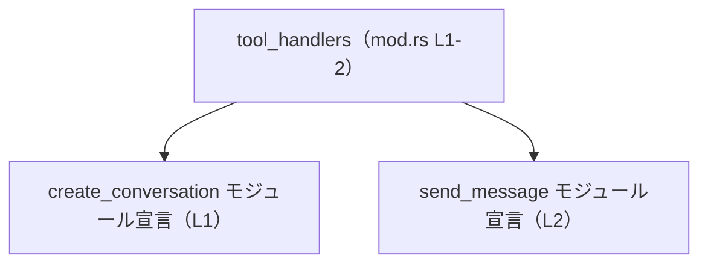
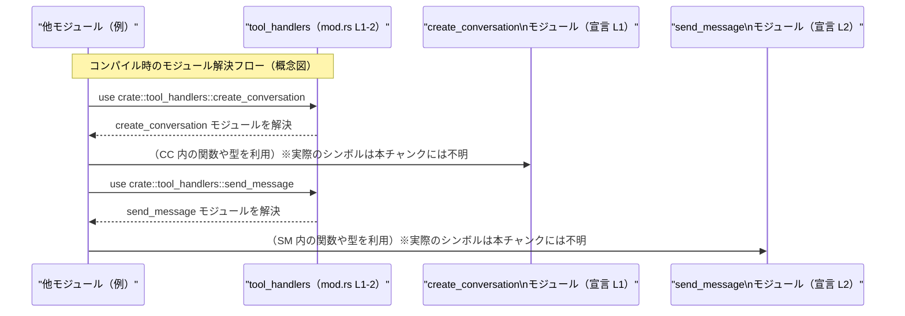

# mcp-server/src/tool_handlers/mod.rs コード解説

## 0. ざっくり一言

- `tool_handlers` モジュール配下にある `create_conversation` と `send_message` という 2 つのサブモジュールを、クレート内部向けに公開するためのモジュール定義ファイルです（`mcp-server/src/tool_handlers/mod.rs:L1-2`）。
- このファイル自体には関数や構造体などのロジックは含まれていません。

---

## 1. このモジュールの役割

### 1.1 概要

- このモジュールは、`create_conversation` および `send_message` という 2 つのサブモジュールを **`pub(crate)`（クレート内公開）** として宣言しています（`mcp-server/src/tool_handlers/mod.rs:L1-2`）。
- これにより、クレート内部の他モジュールから `crate::tool_handlers::create_conversation` などの形でサブモジュールを参照できるようにする「入り口」として機能しています。
- 具体的な処理内容（会話の作成ロジックやメッセージ送信ロジックなど）は、このチャンクには含まれておらず、各サブモジュール側に定義されていると考えられますが、コードからは詳細を確認できません。

### 1.2 アーキテクチャ内での位置づけ

このファイルが担っているのは、`tool_handlers` 名前空間の **モジュール構成の定義** です。依存関係は次のように表現できます。



- `tool_handlers` モジュール（この `mod.rs`）が、`create_conversation` と `send_message` の 2 つのサブモジュールを束ねる親モジュールになっています。
- どのモジュールからこの `tool_handlers` が参照されているか、またサブモジュール間の呼び出し関係などは、このチャンクには現れていません（不明）。

### 1.3 設計上のポイント

コードから読み取れる設計上の特徴は次のとおりです。

- **クレート内公開 (`pub(crate)`)**  
  - 2 つのサブモジュールは `pub(crate)` で宣言されており、クレート内部からは利用できますが、クレート外からは直接利用できません（`mcp-server/src/tool_handlers/mod.rs:L1-2`）。
  - これは、「ツールハンドラ」の API をクレート内部に閉じ、外部への公開は別のレイヤー（例: 上位のサービスモジュールやバイナリクレート）で制御する構成と整合的です。
- **このファイル自体は状態やロジックを持たない**  
  - 関数や構造体、列挙体の定義はなく、純粋にモジュール宣言だけが書かれています（`mcp-server/src/tool_handlers/mod.rs:L1-2`）。
  - したがって、エラーハンドリング・並行性・所有権など Rust 特有のロジックは、このファイルには登場しません。
- **責務の分離**  
  - 「会話の作成」と「メッセージ送信」が別モジュールに分けられている（名前から分かる範囲）ことから、それぞれが独立したツールハンドラとして実装されていると推測されますが、実際のインターフェースはこのチャンクからは分かりません。

---

## 2. 主要な機能一覧

このファイルが直接提供している「機能」は、モジュール宣言のみです。

- `create_conversation` サブモジュールのクレート内公開  
  （`pub(crate) mod create_conversation;` — `mcp-server/src/tool_handlers/mod.rs:L1`）
- `send_message` サブモジュールのクレート内公開  
  （`pub(crate) mod send_message;` — `mcp-server/src/tool_handlers/mod.rs:L2`）

具体的な会話生成やメッセージ送信処理は、対応するサブモジュールファイル（通常は Rust の規則に従い `mcp-server/src/tool_handlers/create_conversation.rs` または `mcp-server/src/tool_handlers/create_conversation/mod.rs` など）側に実装されていると考えられますが、このチャンクからは確認できません。

---

## 3. 公開 API と詳細解説

### 3.1 コンポーネント（モジュール・型）一覧

このファイルで定義されている（または宣言されている）コンポーネントを一覧にします。

#### モジュール宣言

| 名称 | 種別 | 可視性 | 定義位置 | 説明 |
|------|------|--------|----------|------|
| `create_conversation` | サブモジュール宣言 | `pub(crate)` | `mcp-server/src/tool_handlers/mod.rs:L1` | `tool_handlers` 配下の `create_conversation` モジュールをクレート内に公開する宣言です。内部の関数・型はこのチャンクには現れません。 |
| `send_message` | サブモジュール宣言 | `pub(crate)` | `mcp-server/src/tool_handlers/mod.rs:L2` | `tool_handlers` 配下の `send_message` モジュールをクレート内に公開する宣言です。内部の関数・型はこのチャンクには現れません。 |

#### 型一覧（構造体・列挙体など）

- このファイルには構造体・列挙体・型エイリアスの定義はありません。

### 3.2 関数詳細

- このファイルには関数・メソッドの定義が存在しないため、詳細解説の対象となる関数はありません。

### 3.3 その他の関数

- 補助的な関数やラッパー関数も、このファイルには定義されていません。

---

## 4. データフロー

このファイル自体は実行時データを扱う処理を持たず、コンパイル時のモジュール解決に関わるだけです。そのため、ここでは「他モジュールから見た、サブモジュール利用のイメージフロー」を概念的に示します。

> 注意: 以下の図は **利用イメージ** を示したものであり、実際にどのモジュールが `tool_handlers` を参照しているか、どの関数が存在するかはこのチャンクからは分かりません。



要点:

- この `mod.rs` は、**ツールハンドラ群への名前解決の中継点**として機能しています。
- 実際のデータ（会話 ID やメッセージ内容など）がどのように流れるかは、`create_conversation` および `send_message` の実装に依存し、このチャンクだけからは判断できません。

---

## 5. 使い方（How to Use）

### 5.1 基本的な使用方法

このファイルを通じて、クレート内部の他モジュールから `create_conversation` と `send_message` をインポートすることができます。以下は、**モジュールのインポート例**のみを示します（サブモジュール内の具体的な関数名は不明なため記載していません）。

```rust
// crate 内の別モジュールからの利用例（イメージ）

// 個別にモジュールをインポートする
use crate::tool_handlers::create_conversation;  // mod.rs:L1 により解決される
use crate::tool_handlers::send_message;        // mod.rs:L2 により解決される

// まとめてインポートすることも可能
use crate::tool_handlers::{create_conversation, send_message};

// ここから先で、各モジュール内の関数・型を利用できる
// 例: create_conversation::XXXX(...);  // 実際の関数名は本チャンクからは分かりません
```

### 5.2 よくある使用パターン

このファイルの役割はモジュール公開のみなので、典型的な使用パターンも「どのようにモジュールをインポートするか」に限られます。

- **ツールハンドラ別にモジュールを分けてインポートする**  

  ```rust
  use crate::tool_handlers::create_conversation;
  // create_conversation モジュールだけを使うケース
  ```

- **複数ハンドラをまとめてインポートする**  

  ```rust
  use crate::tool_handlers::{create_conversation, send_message};
  // 会話の作成と送信の両方を扱う処理で利用される可能性があるパターン
  ```

※ いずれも、実際にどの関数を呼ぶかはサブモジュールの定義次第であり、このチャンクからは不明です。

### 5.3 よくある間違い（想定される誤用）

このファイルの内容から直接推測できる、起こりうる誤用例を挙げます。

```rust
// 間違い例: 外部クレートから直接 use しようとする
// extern crate mcp_server;
// use mcp_server::tool_handlers::create_conversation;
// → このファイルの宣言は `pub(crate)` なので、クレート外からは見えずコンパイルエラーになります

// 正しい例: クレート内部のコードから利用する
use crate::tool_handlers::create_conversation;  // 同一クレート内であれば利用可能
```

- `pub(crate)` は「**同一クレート内でのみ公開**」という意味であり、クレート外部からは `tool_handlers::create_conversation` / `send_message` にアクセスできません（`mcp-server/src/tool_handlers/mod.rs:L1-2`）。
- クレート外からこれらの機能を利用する必要がある場合は、別のモジュールで `pub use` するなど、外向きの公開レイヤーが必要になります（ただし、その有無はこのチャンクからは分かりません）。

### 5.4 使用上の注意点（まとめ）

- **可視性の範囲**  
  - `pub(crate)` であるため、他クレートから直接利用することはできません。外部 API として使いたい場合は、上位モジュールなどで再公開する必要があります。
- **依存方向の整理**  
  - `tool_handlers` 配下にハンドラを集約する設計になっていると考えられるため、新しいツールハンドラを追加する場合は、この `mod.rs` にサブモジュールを追加する形で整理すると、依存関係が分かりやすくなります（詳細は 6 章を参照）。
- **エラー・並行性などのロジックは別ファイル**  
  - このファイルにはロジックがないため、エラー処理やスレッド安全性、非同期処理などの検討は、各サブモジュール（`create_conversation`, `send_message`）の実装を見て行う必要があります。

---

## 6. 変更の仕方（How to Modify）

### 6.1 新しい機能を追加する場合

新しいツールハンドラモジュールを追加する場合、一般的には次のような手順になります。

1. **新しいサブモジュールファイルを作成する**  
   - 例: `mcp-server/src/tool_handlers/list_conversations.rs` など（Rust のモジュール規則に従う場合）。
2. **`mod.rs` にサブモジュール宣言を追加する**  

   ```rust
   pub(crate) mod create_conversation;
   pub(crate) mod send_message;
   pub(crate) mod list_conversations; // 新機能用のサブモジュール
   ```

   （追加行は、`mcp-server/src/tool_handlers/mod.rs` に追記される想定です）
3. **新サブモジュール内に公開関数や型を定義する**  
   - 具体的な API はプロジェクトの設計方針によります。このチャンクからは詳細は分かりません。

このときの注意点:

- サブモジュールの可視性を `pub(crate)` にするか、`pub` にするかは、外部公開ポリシーに応じて決める必要があります。
- 既存の `tool_handlers` 利用箇所への影響は基本的にありませんが、`mod.rs` の編集ミス（typo や重複定義）によるコンパイルエラーには注意が必要です。

### 6.2 既存の機能を変更する場合

`create_conversation` や `send_message` の機能を変更したい場合、`mod.rs` で注意すべき点は次のとおりです。

- **サブモジュール名を変更する場合**  
  - ファイル名と `mod.rs` の宣言を一致させる必要があります。例えば、`send_message` を `message_sender` にリネームする場合:
    1. ファイル名を変更（例: `send_message.rs` → `message_sender.rs`）。
    2. `mod.rs` の行を  

       ```rust
       pub(crate) mod send_message;
       ```  

       から  

       ```rust
       pub(crate) mod message_sender;
       ```  

       に変更（`mcp-server/src/tool_handlers/mod.rs:L2` が書き換わる）。
    3. クレート内の `use crate::tool_handlers::send_message;` などの参照をすべて `message_sender` に更新する。
- **可視性を変更する場合**  
  - `pub(crate)` → `pub` に変更すると、クレート外からも直接利用可能になります。その場合、外部 API としての互換性やエラーモデルなども検討する必要があります。
- **影響範囲の把握**  
  - このファイルに対する変更（特にモジュール名・可視性）は、クレート全体の import 文に影響するため、IDE や `rg` 等で参照箇所を検索し、すべて更新されているか確認することが重要です。

---

## 7. 関連ファイル

この `mod.rs` と密接に関係していると考えられるファイルを整理します。

| パス（想定） | 役割 / 関係 |
|-------------|------------|
| `mcp-server/src/tool_handlers/create_conversation.rs` または `mcp-server/src/tool_handlers/create_conversation/mod.rs` | `pub(crate) mod create_conversation;`（`mcp-server/src/tool_handlers/mod.rs:L1`）で宣言されているサブモジュール本体が存在すると考えられます。会話作成に関するロジックが実装されている可能性がありますが、このチャンクには内容は現れません。 |
| `mcp-server/src/tool_handlers/send_message.rs` または `mcp-server/src/tool_handlers/send_message/mod.rs` | `pub(crate) mod send_message;`（`mcp-server/src/tool_handlers/mod.rs:L2`）で宣言されているサブモジュール本体が存在すると考えられます。メッセージ送信に関するロジックが実装されている可能性がありますが、このチャンクには内容は現れません。 |

※ 上記パスは Rust のモジュール規則に基づくものであり、実際のファイル構成はこのチャンクだけからは断定できません。

---

### まとめ（このファイルに関する安全性・バグ・エッジケースの観点）

- **安全性 / セキュリティ / 並行性**  
  - このファイルには実行時ロジックがないため、直接的なバグやセキュリティ上の問題、並行性の問題は発生しません。
  - 実際の安全性やエラー処理は、`create_conversation` と `send_message` の実装側で検討する必要があります。
- **エッジケース**  
  - モジュール宣言に関するエッジケースとしては、対応するファイルが存在しない・ファイル名とモジュール名が一致しない場合にコンパイルエラーになることが考えられます。
- **テスト**  
  - このファイル自体はロジックを持たないため、通常は単体テストの対象にはなりません。ツールハンドラのテストは各サブモジュール側で行うのが一般的です。
