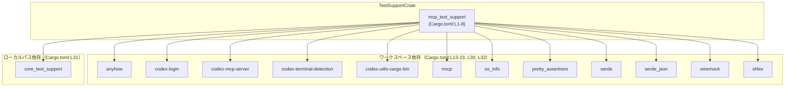
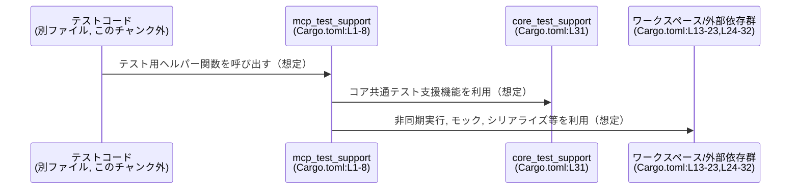

# mcp-server/tests/common/Cargo.toml コード解説

## 0. ざっくり一言

`mcp_test_support` というテスト支援用と思われるライブラリクレートの **Cargo マニフェスト（パッケージ設定と依存関係）** を定義しているファイルです（Cargo.toml:L1-8, L13-32）。

---

## 1. このモジュールの役割

### 1.1 概要

- このファイルは、ライブラリクレート `mcp_test_support` の **名前・ビルド対象・依存クレート** を宣言するために存在します（Cargo.toml:L1-8, L13-32）。
- ディレクトリパス `tests/common` とクレート名から、**MCP 関連のテストで共通利用されるサポートクレート**として使われる可能性が高いですが、このファイル単体から利用箇所は分かりません。

### 1.2 アーキテクチャ内での位置づけ

このチャンクから分かるのは、「`mcp_test_support` クレートが、いくつかのワークスペース内クレートと外部クレートに依存している」という関係のみです（Cargo.toml:L13-32）。



※ `version.workspace = true` などから、このクレートはワークスペースの一部であり、バージョンや edition、ライセンス設定をワークスペース共通設定に委譲しています（Cargo.toml:L3-5）。

### 1.3 設計上のポイント

コードから読み取れる設計上の特徴は次のとおりです。

- **ライブラリクレートとしての定義**  
  - `[lib]` セクションで `path = "lib.rs"` を指定しており（Cargo.toml:L7-8）、`mcp_test_support` はバイナリではなくライブラリとしてビルドされます。
- **ワークスペース共通設定の利用**  
  - `version.workspace = true` / `edition.workspace = true` / `license.workspace = true` により（Cargo.toml:L3-5）、バージョン・Rust エディション・ライセンスはワークスペースルート側に一元管理されています。
- **リント設定のワークスペース共通化**  
  - `[lints]` セクションで `workspace = true` が指定されており（Cargo.toml:L10-11）、コンパイラ／ツールの警告設定もワークスペース共通ポリシーに従います。
- **非同期・マルチスレッドテストを想定しうる依存**  
  - `tokio` 依存で `rt-multi-thread` などの機能が有効化されているため（Cargo.toml:L24-29）、このクレートを利用するコードはマルチスレッドな非同期ランタイムを利用可能な前提で設計されていると考えられます。ただし、具体的な使用方法はこのチャンクには現れません。
- **テスト専用サポートコードとの連携**  
  - `core_test_support` へのローカルパス依存が設定されており（Cargo.toml:L31）、別ディレクトリのテスト支援クレートと連携する構成になっています。

### 1.4 コンポーネント一覧（このチャンク）

このファイルに直接現れる「コンポーネント」（クレート単位）の一覧です。

| コンポーネント名 | 種別 | 定義/宣言位置 | 説明 |
|------------------|------|---------------|------|
| `mcp_test_support` | ライブラリクレート | Cargo.toml:L1-8 | `name` と `[lib]` セクションで定義されるクレート本体。テスト共通機能を提供すると考えられます。 |
| `anyhow` | 依存クレート（ワークスペース） | Cargo.toml:L14 | 汎用エラーを扱うクレートとして知られていますが、具体的な使用箇所はこのチャンクには現れません。 |
| `codex-login` | 依存クレート（ワークスペース） | Cargo.toml:L15 | codex 系ログイン機能に関する内部クレートと推測されますが、このチャンクからコード詳細は分かりません。 |
| `codex-mcp-server` | 依存クレート（ワークスペース） | Cargo.toml:L16 | MCP サーバー本体に関する内部クレートと推測されます。 |
| `codex-terminal-detection` | 依存クレート（ワークスペース） | Cargo.toml:L17 | 端末種別などの検出関連と思われる内部クレート。 |
| `codex-utils-cargo-bin` | 依存クレート（ワークスペース） | Cargo.toml:L18 | Cargo バイナリ実行補助ユーティリティと推測されます。 |
| `rmcp` | 依存クレート（ワークスペース） | Cargo.toml:L19 | 用途は名前からだけでは明確ではありません。 |
| `os_info` | 依存クレート（ワークスペース） | Cargo.toml:L20 | OS 情報取得用のクレートとして知られています。 |
| `pretty_assertions` | 依存クレート（ワークスペース） | Cargo.toml:L21 | テスト時に見やすい差分表示を行うアサーション拡張クレートとして知られています。 |
| `serde` | 依存クレート（ワークスペース） | Cargo.toml:L22 | データのシリアライズ/デシリアライズ用クレートとして広く利用されています。 |
| `serde_json` | 依存クレート（ワークスペース） | Cargo.toml:L23 | `serde` を用いた JSON シリアライズ/デシリアライズの実装クレートです。 |
| `tokio` | 依存クレート（ワークスペース, features: io-std, macros, process, rt-multi-thread） | Cargo.toml:L24-29 | 非同期ランタイムクレート。マルチスレッドランタイムやプロセス、標準 I/O 補助などの機能が有効化されています。 |
| `wiremock` | 依存クレート（ワークスペース） | Cargo.toml:L30 | HTTP/ネットワークのモックサーバーを提供するクレートとして知られています。 |
| `core_test_support` | 依存クレート（ローカルパス） | Cargo.toml:L31 | `../../../core/tests/common` にあるテスト支援クレート。MCP 以外のコア部分のテスト支援コードを再利用していると推測されます。 |
| `shlex` | 依存クレート（ワークスペース） | Cargo.toml:L32 | シェル風の文字列をトークン分割するクレートとして知られています。 |

> 補足: `codex-*` や `rmcp` などワークスペース内クレートについては、**このチャンクにはソースコードが含まれていない**ため、名前から推測できる範囲以上の詳細は不明です。

---

## 2. 主要な機能一覧

このファイルは **Cargo の設定ファイル** であり、関数・メソッドなどのロジックは含みません（Meta: functions=0）。  
そのため、ここでは「このマニフェストが可能にしている機能」を、依存関係と構成から**高レベルに**整理します。

- `mcp_test_support` クレートの定義とビルド対象（lib.rs）の指定（Cargo.toml:L1-8）
- ワークスペース共通リント・バージョン・ライセンスの適用（Cargo.toml:L3-5, L10-11）
- **テスト支援向けの依存環境の提供**（Cargo.toml:L13-32）
  - 非同期・マルチスレッド処理環境（`tokio` の `rt-multi-thread` など）
  - アサーション強化・モック（`pretty_assertions`, `wiremock`）
  - JSON を含むシリアライズ/デシリアライズ（`serde`, `serde_json`）
  - OS 情報やシェル風文字列処理などのユーティリティ（`os_info`, `shlex` 等）
  - ワークスペース内 `codex-*` クレートおよび `core_test_support` の再利用

具体的にどのような「API（関数・型）」を提供しているかは、このファイルからは分かりません。  
実際のテスト支援ロジックは `lib.rs` などのソースコード側にあります（Cargo.toml:L8）。

---

## 3. 公開 API と詳細解説

このセクションは通常、関数や型のインターフェースを解説しますが、当該ファイルは Cargo 設定のみであり、**関数・構造体・列挙体などの定義は含まれていません**。

### 3.1 型一覧（構造体・列挙体など）

- このチャンク（Cargo.toml）には、Rust の型定義（`struct`, `enum`, `type` など）は一切現れません。
- 型や公開 API は `lib.rs` など、ソースコードファイル側に定義されているはずですが、このチャンクには現れないため詳細は不明です（Cargo.toml:L8 を通じて存在だけが示唆されています）。

### 3.2 関数詳細（最大 7 件）

- Meta 情報で `functions=0` と与えられており、実際にもこのファイルは **宣言的な設定のみ** です。
- したがって、このセクションで説明できる関数はありません。

### 3.3 その他の関数

- このチャンクには補助的な関数やラッパー関数も存在しません。

---

## 4. データフロー

このファイル自体には実行時ロジックがないため、「データフロー」は **ビルド時・テスト実行時における依存関係の流れ**として理解するのが適切です。

### 4.1 高レベルな利用フロー（概念図）

以下は、一般的な Cargo プロジェクト構成と、`tests/common` ディレクトリ構成から**想定される**テスト実行時の依存関係の流れです。  
実際の呼び出しコードはこのチャンクには現れないため、「想定」レベルの図であることに注意してください。



- `mcp_test_support` がテストコードから利用されること自体は、ディレクトリパスとクレート名から自然に想定されますが、このチャンクからは**どの関数がどの順序で呼ばれるか**までは分かりません。
- 上記シーケンス図は、そのため **呼び出しの事実ではなく、依存の方向と役割**のみを示しています。

### 4.2 言語固有の安全性・エラー・並行性の観点

このファイルが Rust における安全性・エラー処理・並行性に与える影響として、以下の点が読み取れます。

- **エラー処理**
  - `anyhow` への依存により（Cargo.toml:L14）、このクレート内のコードは「`anyhow::Error` ベースの柔軟なエラー伝播」を採用している可能性があります。
  - ただし、実際に `anyhow` がどの程度使われているか、このチャンクからは不明です。
- **並行性 / 非同期**
  - `tokio` の `rt-multi-thread` 機能が有効であるため（Cargo.toml:L24-29）、テスト支援コードは**マルチスレッド非同期ランタイム**を利用できる前提で設計されうることが分かります。
  - これにより、テストコードから `async fn` を使った非同期 I/O やプロセス実行などを行うことが可能になりますが、具体的な使用方法は lib.rs 側に依存します。
- **モックとアサーション**
  - `wiremock` と `pretty_assertions` への依存から（Cargo.toml:L21, L30）、テストコードは
    - 外部サービスとの通信をモック化する
    - 期待値と実際の値の差分を視覚的に分かりやすく表示する
    といった**テストの安全性・可読性向上**機構を利用できる構成になっていると考えられます。

---

## 5. 使い方（How to Use）

このファイルは設定ファイルなので、直接「呼び出す」ものではありません。  
ここでは、`mcp_test_support` クレートを利用する側（テストコード）の典型的な使い方を**推測ベース**で記述します。

### 5.1 基本的な使用方法（想定）

Rust プロジェクトのテストコードから、`mcp_test_support` をテスト用のヘルパークレートとして利用する形が想定されます。

```rust
// tests/example_test.rs （想定例）

// mcp_test_support クレートをインポートする
use mcp_test_support::*; // 実際の公開 API は lib.rs 側に依存し、このチャンクからは不明

#[tokio::test] // tokio の非同期テストマクロ（tokio 依存は Cargo.toml:L24-29 から）
async fn test_something_with_mcp() {
    // ここで mcp_test_support が提供するヘルパーを使って
    // MCP サーバーと対話したり、モックを立てたりすることが想定される
}
```

> 上記コードは、この Cargo.toml が示す依存関係と一般的なテスト構成からの**例示**であり、実際に存在する関数名や API はこのチャンクからは特定できません。

### 5.2 よくある使用パターン（想定）

このマニフェストと依存関係から、次のようなテストパターンが想定されます。

1. **非同期テスト**  
   - `tokio` の `#[tokio::test]` を使った非同期テスト。
   - MCP サーバーや外部プロセスの起動・停止を伴うテスト（`process` 機能: Cargo.toml:L24-29）。
2. **HTTP / ネットワークモック**  
   - `wiremock` を利用した外部サービスのモック化。
3. **シリアライズ/デシリアライズを含むテスト**  
   - `serde`, `serde_json` を使って JSON をやり取りする API のテスト。

これらはあくまで依存クレートの一般的な用途から見たパターンであり、`mcp_test_support` が実際にどこまでラップしているかは別ファイルに依存します。

### 5.3 よくある間違い（このファイルに関して）

この Cargo.toml 自体について起こりうる誤りの例を挙げます。

```toml
# 間違い例: tokio の必要な feature を消してしまう
tokio = { workspace = true }  # "rt-multi-thread" などの feature を指定し忘れ

# 正しい例: 必要な feature を維持する（Cargo.toml:L24-29）
tokio = { workspace = true, features = [
    "io-std",
    "macros",
    "process",
    "rt-multi-thread",
] }
```

- `rt-multi-thread` を外すと、マルチスレッドランタイム前提のテストコードがコンパイルエラーまたはランタイムエラーになる可能性があります。
- どの feature が実際に必須かは lib.rs 側のコードに依存するため、このチャンクだけでは判定できません。

### 5.4 使用上の注意点（まとめ）

- **ワークスペース依存の変更に注意**  
  - ほぼすべての依存が `workspace = true` によって管理されているため（Cargo.toml:L3-5, L14-23, L24, L30, L32）、ワークスペースルート側の依存バージョン変更が、このテストサポートクレートにも直接影響します。
- **ローカルパス依存のパス整合性**  
  - `core_test_support` のパス指定が相対パスであるため（Cargo.toml:L31）、ディレクトリ構成を変更する際はこのパスが壊れないよう注意が必要です。
- **非同期ランタイムの前提**  
  - `tokio` の機能指定に依存するコードを書く場合、feature の削除・変更がコンパイルや実行に影響する可能性があります。

---

## 6. 変更の仕方（How to Modify）

### 6.1 新しい機能を追加する場合（テスト支援機能の拡張）

新たなテスト支援機能を追加する際の、Cargo.toml 観点のポイントです。

1. **lib.rs 側に機能を追加**  
   - 実際のロジックは `lib.rs` 側で追加します（Cargo.toml:L8）。
2. **必要な依存を追加**  
   - 新しいテスト機能で別のクレートが必要になった場合、`[dependencies]` セクションに依存を追加します（Cargo.toml:L13-32）。
   - 可能であれば、他のクレートと同様に `workspace = true` で管理する設計と整合しているか検討します。
3. **テストコードからの利用**  
   - `tests/` 配下のテストコードから `mcp_test_support` の新しい API を呼び出す形になりますが、これは別ファイルの変更です。

### 6.2 既存の機能を変更する場合（依存・設定の変更）

Cargo.toml を変更する際に注意すべき点です。

- **依存削除の影響範囲**  
  - `wiremock` や `pretty_assertions` などを削除すると（Cargo.toml:L21, L30）、それらに依存するテストヘルパーやテストコードがコンパイルエラーになります。  
    → 削除前に、`lib.rs` やテストコード側での使用箇所を検索する必要があります。
- **feature の変更**  
  - `tokio` の feature セットを変更すると（Cargo.toml:L24-29）、`#[tokio::test]` の利用可否や、`process` / `io-std` 機能に依存するコードに影響します。
- **ワークスペース設定への依存**  
  - `version.workspace = true` などにより、バージョンはワークスペース側で決まるため（Cargo.toml:L3-5）、バージョンを個別に固定したい場合は、ここで個別指定に変える必要があります。  
    ただし、これはワークスペース全体の方針とも関係するため、他クレートとの整合性確認が必要です。

---

## 7. 関連ファイル

この Cargo.toml と密接に関係すると思われるファイル・ディレクトリです（ただし、このチャンク外なので詳細内容は不明です）。

| パス | 役割 / 関係 |
|------|------------|
| `mcp-server/tests/common/lib.rs` | 本 Cargo.toml の `[lib]` セクションで指定されているライブラリ本体のエントリポイント（Cargo.toml:L7-8）。`mcp_test_support` の公開 API がここから定義されていると考えられます。 |
| `core/tests/common/Cargo.toml` および `core/tests/common/lib.rs` | `core_test_support` クレートのマニフェストと実装（Cargo.toml:L31）。コア機能のテスト支援コードを提供し、`mcp_test_support` がそれを再利用している構成が想定されます。 |
| ワークスペースルートの `Cargo.toml` | `version.workspace = true`, `edition.workspace = true`, `license.workspace = true`, `[lints].workspace = true` などの設定値の実体が定義されているファイル（Cargo.toml:L3-5, L10-11）。 |
| MCP 関連クレート（例: `codex-mcp-server` の Cargo.toml / lib.rs） | `codex-mcp-server` などのワークスペース内クレートの実装。`mcp_test_support` が MCP サーバーのテストを行う際に利用していると推測されます（Cargo.toml:L16）。 |

---

### Bugs / Security / Contracts / Edge Cases / Tests / パフォーマンスなどの観点（このファイルに限ったまとめ）

- **Bugs**:  
  - このファイルは宣言的な設定のみで、ロジック上のバグは存在しません。誤りは主に「依存の不足・過不足」や「パスの間違い」といった設定ミスになります。
- **Security**:  
  - 依存クレートのバージョン管理やライセンスはワークスペース側に委譲されており（Cargo.toml:L3-5）、セキュリティ上の更新・監査はワークスペース全体のポリシーに依存します。
- **Contracts / Edge Cases**:  
  - Cargo.toml の文法に従っている限り、特別なエッジケースはありませんが、`core_test_support` の相対パスが壊れるとビルドが失敗する点に注意が必要です（Cargo.toml:L31）。
- **Tests**:  
  - このファイル単体にはテストは存在しませんが、テストコードが依存するため、ここでの設定ミスがテストのビルド失敗や実行失敗に直結します。
- **Performance / Scalability**:  
  - ランタイム性能・スケーラビリティへの直接的影響はありませんが、`tokio` の feature 構成（`rt-multi-thread` など）が非同期タスクの並列度に影響しうる点は間接的に関係します（Cargo.toml:L24-29）。
- **Tradeoffs**:  
  - ほとんどを `workspace = true` に委譲することで、設定の一貫性と管理の容易さを得る代わりに、個別クレートの自由度は下がっています。
- **Refactoring / Observability**:  
  - Observability（ログ・メトリクス）専用の依存はこのチャンクには現れず、必要であれば別途依存追加が必要になります。  
  - 依存クレートの整理や分割は、テストコードと `lib.rs` の実際の利用箇所を確認したうえで進める必要があります。
