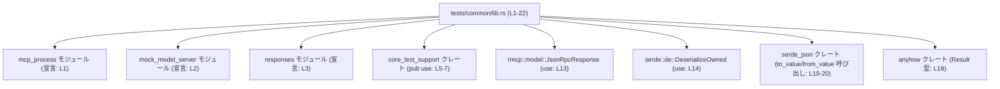
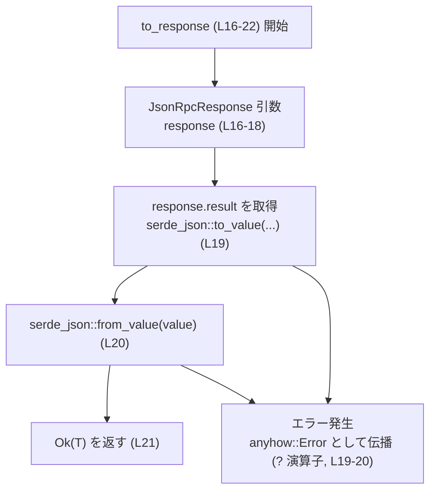
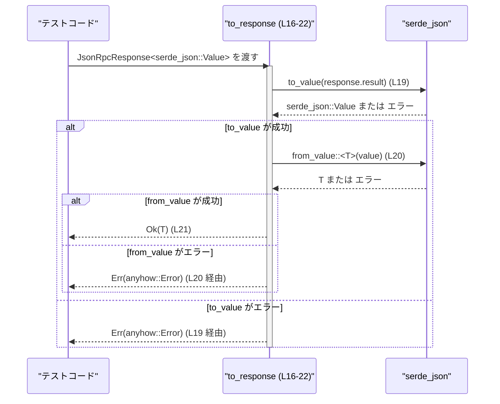

# mcp-server/tests/common/lib.rs コード解説

## 0. ざっくり一言

- MCP サーバーのテストで共通して使うヘルパーをまとめたモジュールで、他モジュールのユーティリティを再エクスポートしつつ、JSON-RPC のレスポンスを任意の型に変換する `to_response` 関数を提供しています。  
  （根拠: モジュールパスと `mod`/`pub use` 群, `pub fn to_response` の定義  
  mcp-server/tests/common/lib.rs:L1-3, L5-12, L16-22）

---

## 1. このモジュールの役割

### 1.1 概要

- このモジュールは、テストコードで共通利用される以下の機能をまとめて提供します。  
  - MCP プロセスやモックサーバー、レスポンス生成などのヘルパーの再エクスポート  
    （根拠: `mod mcp_process;`, `mod mock_model_server;`, `mod responses;` とそれらに対する `pub use`  
    mcp-server/tests/common/lib.rs:L1-3, L8-12）
  - `JsonRpcResponse<serde_json::Value>` から任意のデシリアライズ可能な型 `T` に変換する `to_response` 関数  
    （根拠: `use rmcp::model::JsonRpcResponse;`, `T: DeserializeOwned`, `pub fn to_response`  
    mcp-server/tests/common/lib.rs:L13-14, L16-22）

### 1.2 アーキテクチャ内での位置づけ

このファイルはテスト用の「共通ヘルパー集」として、他のテストモジュールから利用される立場にあります。依存関係のイメージを簡略化して示します。



- この図は `tests/common/lib.rs` がどのモジュール・クレートに依存しているかを表します。
- `mcp_process` / `mock_model_server` / `responses` の詳細な実装はこのチャンクには現れません。

### 1.3 設計上のポイント

- **責務の分割**  
  - このファイル自体は実装ロジックをほとんど持たず、テスト用機能の集約・再エクスポートと、1 つの小さな変換関数だけを提供しています。  
    （根拠: `pub use` が多数、関数定義は `to_response` 1 つのみ  
    mcp-server/tests/common/lib.rs:L5-12, L16-22）

- **無状態（ステートレス）**  
  - グローバル変数や内部状態を持たず、`to_response` も引数から結果を計算するだけです。  
    （根拠: ファイル内に `static`/`lazy_static` 等やフィールドを持つ型定義が存在しない  
    mcp-server/tests/common/lib.rs:L1-22）

- **エラーハンドリング方針**  
  - `to_response` は `anyhow::Result<T>` を返しており、内部で発生した `serde_json` 関連のエラーを `?` 演算子でそのまま包括的なエラーとして返します。  
    （根拠: 戻り値型 `anyhow::Result<T>` と `?` の使用  
    mcp-server/tests/common/lib.rs:L18-20）

- **並行性**  
  - スレッドローカル／グローバルな可変状態に依存していないため、このモジュールの API はどのスレッドから呼んでも同じ挙動になります。  
    （根拠: 可変グローバル状態や `unsafe` が存在しない  
    mcp-server/tests/common/lib.rs:L1-22）

---

## 2. 主要な機能一覧

このモジュールが提供する主な機能は次の通りです。

- MCP 関連テストヘルパーの再エクスポート  
  - `McpProcess` 型の再エクスポート（`mcp_process` モジュール由来）  
    （根拠: `pub use mcp_process::McpProcess;`  
    mcp-server/tests/common/lib.rs:L8）
  - モックモデルサーバー生成関数 `create_mock_responses_server` の再エクスポート  
    （根拠: `pub use mock_model_server::create_mock_responses_server;`  
    mcp-server/tests/common/lib.rs:L9）
  - 各種 SSE 形式レスポンス生成ヘルパーの再エクスポート  
    `create_apply_patch_sse_response`,  
    `create_final_assistant_message_sse_response`,  
    `create_shell_command_sse_response`  
    （根拠: `pub use responses::...`  
    mcp-server/tests/common/lib.rs:L10-12）

- シェル実行環境フォーマット用ヘルパーの再エクスポート  
  - `format_with_current_shell` 系 3 関数  
    （根拠: `pub use core_test_support::...`  
    mcp-server/tests/common/lib.rs:L5-7）

- JSON-RPC 応答から任意型への変換  
  - `to_response<T>`: `JsonRpcResponse<serde_json::Value>` を `T: DeserializeOwned` に変換するユーティリティ関数  
    （根拠: 関数定義と型制約  
    mcp-server/tests/common/lib.rs:L13-14, L16-22）

---

## 3. 公開 API と詳細解説

### 3.1 型一覧（構造体・列挙体など）

このファイルから直接公開される／使用される主な型の一覧です。

| 名前 | 種別 | 公開範囲 | 定義/宣言位置 | 役割 / 用途 |
|------|------|----------|---------------|-------------|
| `McpProcess` | 構造体（と推定） | `pub use` により公開 | 再エクスポート宣言: mcp-server/tests/common/lib.rs:L8<br>定義は `mcp_process` モジュール内（このチャンクには現れない） | MCP 関連のプロセスを表現する型と考えられますが、詳細なフィールドやメソッドはこのチャンクには現れません。 |
| `JsonRpcResponse<T>` | 構造体 | 外部クレートから `use` | `use rmcp::model::JsonRpcResponse;`  
mcp-server/tests/common/lib.rs:L13 | JSON-RPC 応答を表す汎用コンテナ。ここでは `T = serde_json::Value` として使用されています。フィールドのうち `result` が `to_response` 内で参照されます（根拠: `response.result`  
L19）。 |
| 型パラメータ `T` | ジェネリック型 | `to_response` の呼び出し側から指定 | `pub fn to_response<T: DeserializeOwned>(...)`  
mcp-server/tests/common/lib.rs:L16 | 変換後のターゲット型。`serde::de::DeserializeOwned` を実装している必要があります。 |

> 注: これ以外の構造体・列挙体の定義はこのファイルには存在しません。

### 3.2 関数詳細

#### `to_response<T: DeserializeOwned>(response: JsonRpcResponse<serde_json::Value>) -> anyhow::Result<T>`

（定義位置: mcp-server/tests/common/lib.rs:L16-22）

**概要**

- JSON-RPC の応答オブジェクト `JsonRpcResponse<serde_json::Value>` から、その `result` フィールドを取り出し、`serde_json` を用いて任意の型 `T` にデシリアライズするヘルパー関数です。  
  （根拠: 関数本体で `response.result` を `serde_json::to_value` → `serde_json::from_value` している  
  mcp-server/tests/common/lib.rs:L19-20）

**引数**

| 引数名 | 型 | 説明 |
|--------|----|------|
| `response` | `JsonRpcResponse<serde_json::Value>` | JSON-RPC の応答オブジェクト。少なくとも `result` フィールドを持ち、その部分が `serde_json::Value` として保持されています（根拠: `response.result` のアクセス  
mcp-server/tests/common/lib.rs:L19）。 |

**戻り値**

- `anyhow::Result<T>`  
  - `Ok(T)` : `response.result` の JSON 内容を `T` 型として正常にデシリアライズできた場合の値。  
  - `Err(anyhow::Error)` : JSON への変換または `T` へのデシリアライズ中にエラーが発生した場合のエラー。  
    （根拠: 戻り値型と `?` 演算子使用  
    mcp-server/tests/common/lib.rs:L18-20）

**内部処理の流れ（アルゴリズム）**

1. `response.result` を取り出し、`serde_json::to_value` で `serde_json::Value` に変換する。  

   ```rust
   let value = serde_json::to_value(response.result)?;
   ```  

   （根拠: mcp-server/tests/common/lib.rs:L19）

2. 上記で得た `value` を `serde_json::from_value` で型 `T` にデシリアライズする。  

   ```rust
   let codex_response = serde_json::from_value(value)?;
   ```  

   （根拠: mcp-server/tests/common/lib.rs:L20）

3. デシリアライズされた値を `Ok(codex_response)` として呼び出し元に返す。  

   ```rust
   Ok(codex_response)
   ```  

   （根拠: mcp-server/tests/common/lib.rs:L21）

4. 途中の `?` により、`to_value` または `from_value` のどちらかがエラーを返した場合、そのエラーが `anyhow::Error` として呼び出し元に伝播します。

**Mermaid フローチャート（関数内部のデータフロー）**



**Examples（使用例）**

> 注: `JsonRpcResponse` の具体的な構造体定義やコンストラクタはこのチャンクには現れないため、値の生成部分は抽象的に記述します。

```rust
use rmcp::model::JsonRpcResponse;                 // JSON-RPC レスポンス型
use serde::Deserialize;                           // デシリアライズのためのトレイト
use anyhow::Result;                               // エラーラッパー

// 変換先の型を定義する
#[derive(Debug, Deserialize)]                     // Deserialize を実装する必要がある
struct MyResult {
    message: String,
    code: i32,
}

// 既にどこかから受け取った JSON-RPC レスポンスを T 型に変換する例
fn handle_response(
    response: JsonRpcResponse<serde_json::Value>, // 入力: JSON-RPC 応答
) -> Result<MyResult> {                           // 出力: 変換済みの MyResult またはエラー
    // to_response を呼び出して result 部分を MyResult にデシリアライズ
    let parsed: MyResult = to_response(response)?; // 失敗時は Err がそのまま伝播

    Ok(parsed)
}
```

このコードでは、`to_response` が `response.result` から `MyResult` を生成します。JSON の構造が `MyResult` に対応していない場合、`?` により `Err` が返されます。

**Errors / Panics**

- **エラーになる条件 (`Err`)**
  - `serde_json::to_value(response.result)` が失敗した場合  
    - 例えば `response.result` の型が `serde::Serialize` の制約を満たしていないなどが該当します。  
      （根拠: `to_value` に対して `?` を使用  
      mcp-server/tests/common/lib.rs:L19）
  - `serde_json::from_value::<T>(value)` が失敗した場合  
    - JSON の構造が `T` のフィールド構造と一致しない場合や、数値の桁あふれなど `T` に変換できないケースです。  
      （根拠: `from_value` に対して `?` を使用  
      mcp-server/tests/common/lib.rs:L20）

- **panic の可能性**
  - この関数自体には `unwrap` や `expect`、明示的な `panic!` はありません。  
    （根拠: 関数本体にこれらの呼び出しが無い  
    mcp-server/tests/common/lib.rs:L18-21）
  - したがって、通常の利用では `Result` を通じてエラーが返却され、`panic` することは想定されません。

**Edge cases（エッジケース）**

- `response.result` が `null` や空オブジェクトの場合  
  - その JSON が `T` に対応していれば成功し、対応していなければ `from_value` がエラーを返します。  
    （挙動は `serde_json::from_value` の仕様に依存）

- `T` に `DeserializeOwned` が実装されていない場合  
  - コンパイルエラーになります（型パラメータ境界 `T: DeserializeOwned` による制約）。  
    （根拠: 関数シグネチャ  
    mcp-server/tests/common/lib.rs:L16）

- 非 UTF-8 文字列や極端に大きな数値など  
  - JSON レベルでは表現できても、`T` の型制約を満たさない場合はデシリアライズ時にエラーになります。

**使用上の注意点**

- **型 `T` と JSON 構造の整合性**  
  - `response.result` が持つ JSON 構造と、`T` のフィールド構造が一致している必要があります。  
  - テストコードで使用する場合、想定する JSON 構造に合わせて `T` を定義し、`#[derive(Deserialize)]` を付与することが前提になります。

- **パフォーマンス上の注意**  
  - 一度 `serde_json::to_value` で `Value` に変換してから、再度 `from_value` で `T` に変換しているため、直接 `T` にデシリアライズするよりもオーバーヘッドがあります。  
    （根拠: `to_value` → `from_value` の 2 段階変換  
    mcp-server/tests/common/lib.rs:L19-20）  
  - テスト用途であれば通常問題になりにくいですが、大量データや高頻度の呼び出しではコストを考慮する必要があります。

- **スレッド安全性**  
  - 関数は引数から結果を計算するだけで共有状態を持たないため、複数スレッドから同時に呼び出しても競合状態は発生しません。  
    （根拠: グローバル可変状態や `static mut` 等が存在しない  
    mcp-server/tests/common/lib.rs:L1-22）

- **セキュリティ面の注意**  
  - 不特定の外部入力から得た巨大な JSON をそのまま渡すと、多くのメモリと CPU を消費する可能性があります。  
  - これは `serde_json` によるパース一般に言えることであり、この関数に固有の追加リスク（例: 任意コード実行）は見られません（`unsafe` 不使用）。  
    （根拠: `unsafe` キーワードや OS コールが存在しない  
    mcp-server/tests/common/lib.rs:L1-22）

### 3.3 その他の関数（再エクスポート）

このファイルで定義はされていませんが、テストコードから直接呼べるように再エクスポートされている関数群です。

| 関数名 | 定義元 | 公開範囲 | 定義位置（このファイル内） | 役割（1 行） |
|--------|--------|----------|----------------------------|--------------|
| `format_with_current_shell` | `core_test_support` | `pub use` により公開 | `pub use core_test_support::format_with_current_shell;`  
mcp-server/tests/common/lib.rs:L5 | シェル関連のフォーマットを行うヘルパー関数と考えられますが、シグネチャや詳細な挙動はこのチャンクには現れません。 |
| `format_with_current_shell_display_non_login` | `core_test_support` | 同上 | L6 | 同上。非ログインシェル向けのバリアントと推測されますが、詳細な挙動は不明です。 |
| `format_with_current_shell_non_login` | `core_test_support` | 同上 | L7 | 同上。詳細は `core_test_support` 側の実装に依存します。 |
| `create_mock_responses_server` | `mock_model_server` モジュール | `pub use` により公開 | `pub use mock_model_server::create_mock_responses_server;`  
mcp-server/tests/common/lib.rs:L9 | モックサーバーを構築するヘルパー関数と考えられますが、実装はこのチャンクには現れません。 |
| `create_apply_patch_sse_response` | `responses` モジュール | 同上 | L10 | 関数名から、patch 適用用の SSE レスポンスを生成するヘルパーと推測されますが、実装は不明です。 |
| `create_final_assistant_message_sse_response` | `responses` モジュール | 同上 | L11 | 同上。アシスタントの最終メッセージ用 SSE レスポンスを扱うと推測されますが、詳細は不明です。 |
| `create_shell_command_sse_response` | `responses` モジュール | 同上 | L12 | 同上。シェルコマンド関連の SSE レスポンスを扱うと推測されますが、詳細は不明です。 |

> これらの関数のシグネチャや内部処理はこのファイルには含まれていないため、「再エクスポートされている」という事実以上のことは記述できません。

---

## 4. データフロー

ここでは `to_response` を使用する典型的な流れ（テストコードからの呼び出し）を、データフローとして整理します。

- テストコードが `JsonRpcResponse<serde_json::Value>` を取得し、`to_response` を呼び出すことで、より型付きのテスト対象構造体に変換する、という流れになります。



- 要点:
  - データは常に `JsonRpcResponse<Value> -> serde_json::Value -> T` という一方向の流れで処理されます。
  - エラーは途中の任意のステップで発生し得ますが、すべて `anyhow::Result` で一元的に扱われます。

---

## 5. 使い方（How to Use）

### 5.1 基本的な使用方法

`to_response` を用いて、JSON-RPC 応答の `result` 部分をテスト用の型に変換する基本的なコード例です。

```rust
use rmcp::model::JsonRpcResponse;                 // JSON-RPC レスポンス型
use serde::Deserialize;                           // デシリアライズ用トレイト
use anyhow::Result;                               // エラーラッパー
// 同じモジュール内か、適切にインポートされている前提で to_response を利用する

#[derive(Debug, Deserialize)]
struct MyResult {
    message: String,
    count: u32,
}

fn test_with_response(
    response: JsonRpcResponse<serde_json::Value>, // どこかで取得したレスポンス
) -> Result<()> {
    // JsonRpcResponse<serde_json::Value> から MyResult に変換
    let parsed: MyResult = to_response(response)?; // エラーなら ? で早期リターン

    // 以降、型付きのデータとして検証できる
    assert!(parsed.count > 0);
    assert!(!parsed.message.is_empty());

    Ok(())
}
```

- このように、レスポンスを `serde_json::Value` のまま扱う代わりに、テスト用の構造体に変換することで、フィールド名や型の誤りをコンパイル時／デシリアライズ時に検出しやすくなります。

### 5.2 よくある使用パターン

- **同じ JSON から複数の型に変換する**  
  - 同じ `JsonRpcResponse<serde_json::Value>` を異なる `T` に変換することも可能です。ただし、その JSON が両方の型構造に適合している必要があります。

```rust
#[derive(Deserialize)]
struct Summary { /* ... */ }

#[derive(Deserialize)]
struct Detail  { /* ... */ }

fn use_as_multiple_types(
    response: JsonRpcResponse<serde_json::Value>,
) -> anyhow::Result<(Summary, Detail)> {
    // 1 回目の変換
    let summary: Summary = to_response(response.clone())?; // clone の可否は JsonRpcResponse の実装に依存

    // 2 回目の変換（別のレスポンスを使う想定でも良い）
    let detail: Detail = to_response(response)?;           // 型 T が異なっても呼べる

    Ok((summary, detail))
}
```

> 注: `JsonRpcResponse` が `Clone` を実装しているかどうか、このチャンクからは判別できません。この例はパターン説明のための擬似コードです。

### 5.3 よくある間違い

```rust
// 間違い例: DeserializeOwned を満たさない型を指定する
struct NotDeserializable {
    // Deserialize を derive していない
}

// fn bad_example(response: JsonRpcResponse<serde_json::Value>) {
//     // コンパイルエラー: NotDeserializable は DeserializeOwned を実装していない
//     let _value: NotDeserializable = to_response(response).unwrap();
// }

// 正しい例: Deserialize を実装する
#[derive(serde::Deserialize)]
struct Deserializable {
    // ...
}

fn good_example(response: JsonRpcResponse<serde_json::Value>) -> anyhow::Result<()> {
    let _value: Deserializable = to_response(response)?; // OK
    Ok(())
}
```

- **誤りのポイント**
  - `T` に `DeserializeOwned` が必要であるにもかかわらず、`Deserialize` を実装していない型を使うとコンパイルエラーになります。  
    （根拠: ジェネリック境界 `T: DeserializeOwned`  
    mcp-server/tests/common/lib.rs:L16）
  - 実行時に JSON の構造が `T` に合っていない場合も、`unwrap` などでエラーを握りつぶすとテストがクラッシュするため、`Result` を適切に扱う必要があります。

### 5.4 使用上の注意点（まとめ）

- `T` は `DeserializeOwned` を実装している必要があります。実装されていない場合はコンパイルエラーになります。
- `response.result` の JSON 構造が `T` に合っていないと、デシリアライズ時にエラーになります。
- 内部で `serde_json::to_value` → `serde_json::from_value` の 2 回の変換が発生するため、大量データに対してはコストを考慮する必要があります。
- この関数は副作用を持たず、スレッド安全に利用できます。
- ログ出力やメトリクス送信などの観測用処理は含まれていません。  
  （根拠: 出力関連の呼び出しやログ用クレートの利用が存在しない  
  mcp-server/tests/common/lib.rs:L1-22）

---

## 6. 変更の仕方（How to Modify）

### 6.1 新しい機能を追加する場合

- **別種のレスポンス変換ヘルパーを追加する**  
  - 例: `JsonRpcResponse<T>` 全体を別の DTO（データ転送オブジェクト）に変換するような関数を追加する場合:
    1. 同じファイル `tests/common/lib.rs` に `pub fn` を追加する。  
    2. 必要な外部型があれば `use` を追加する（`rmcp::model` や `serde_json` など）。  
       （根拠: 現在もここで `JsonRpcResponse` や `DeserializeOwned` を `use` している  
       mcp-server/tests/common/lib.rs:L13-14）
    3. 既存の `to_response` と同じく `anyhow::Result` を採用すれば、テストコード側のエラーハンドリングとの一貫性が保たれます。

- **新しいテストヘルパーを公開する**  
  - 他のテスト用モジュールに既に存在するヘルパー関数を、このファイルからも直接使えるようにしたい場合:
    1. 対象モジュールを `mod some_module;` として宣言（すでに存在する場合は不要）。  
    2. `pub use some_module::some_helper;` を追加して再エクスポートする。  
       （根拠: 既存の `mod ...` / `pub use ...` のパターン  
       mcp-server/tests/common/lib.rs:L1-3, L5-12）

### 6.2 既存の機能を変更する場合

- **`to_response` の挙動を変更する場合の注意点**
  - **前提条件の維持**  
    - これまで `JsonRpcResponse<serde_json::Value>` を受け取っていたものを、引数や戻り値の型を変更すると、それを呼び出しているすべてのテストコードに影響します。  
      影響範囲を確認する際は、`to_response(` をプロジェクト全体で検索する必要があります。
  - **エラー型の変更**  
    - 現在は `anyhow::Result<T>` を返しており、呼び出し側は `anyhow::Error` を前提としています。これを別のエラー型（例えば `Result<T, serde_json::Error>` など）に変更すると、多くのテストコードのシグネチャを修正する必要が生じます。
  - **デシリアライズ方法の変更**  
    - 直接 `serde_json::from_value` だけを使うような最適化を行う場合でも、これまで通っていた JSON がパースできなくなることがないか、既存テストの網羅性を確認する必要があります。

- **再エクスポートの変更**
  - `pub use` を削除・追加する場合は、このファイルを `use` しているテストコードがコンパイルエラーにならないかを確認する必要があります。  
  - 特に `McpProcess` や `create_mock_responses_server` などの主要ヘルパーを削除する場合は影響が大きくなります。

---

## 7. 関連ファイル

このモジュールと密接に関係するファイル・モジュール（定義そのものはこのチャンクには現れないものを含みます）を整理します。

| パス / モジュール名 | 役割 / 関係 |
|---------------------|------------|
| `tests/common/mcp_process` モジュール | `mod mcp_process;` として宣言され、このファイルから `McpProcess` 型が再エクスポートされています。`McpProcess` の具体的なフィールドやメソッドはこのチャンクには現れません。<br>（根拠: mcp-server/tests/common/lib.rs:L1, L8） |
| `tests/common/mock_model_server` モジュール | `mod mock_model_server;` として宣言され、`create_mock_responses_server` 関数を提供します。モックモデルサーバー関連のテストヘルパーと考えられますが、内部実装は不明です。<br>（根拠: mcp-server/tests/common/lib.rs:L2, L9） |
| `tests/common/responses` モジュール | `mod responses;` として宣言され、SSE 関連とみられる 3 つのレスポンス生成関数を提供します。詳細な処理はこのチャンクには現れません。<br>（根拠: mcp-server/tests/common/lib.rs:L3, L10-12） |
| `core_test_support` クレート | シェル環境フォーマット関連の 3 関数を提供し、このファイルから再エクスポートされています。テスト用の共通クレートであると考えられますが、実装はこのチャンクには現れません。<br>（根拠: mcp-server/tests/common/lib.rs:L5-7） |
| `rmcp::model` モジュール | `JsonRpcResponse` 型の定義元であり、`to_response` の引数型として使用されています。<br>（根拠: `use rmcp::model::JsonRpcResponse;`  
mcp-server/tests/common/lib.rs:L13） |
| `serde` / `serde_json` クレート | JSON デシリアライズのために使用されており、`DeserializeOwned` 制約と `serde_json::to_value` / `serde_json::from_value` により `to_response` のコアロジックを構成しています。<br>（根拠: mcp-server/tests/common/lib.rs:L14, L19-20） |
| `anyhow` クレート | 汎用エラーラッパーとして使用されており、`to_response` のエラー型を提供します。<br>（根拠: 戻り値型 `anyhow::Result<T>`  
mcp-server/tests/common/lib.rs:L18） |

このチャンクにはテストコード本体（`#[test]` 関数など）は存在せず、あくまでテスト用ヘルパーの集約モジュールとして振る舞っていることが確認できます。
