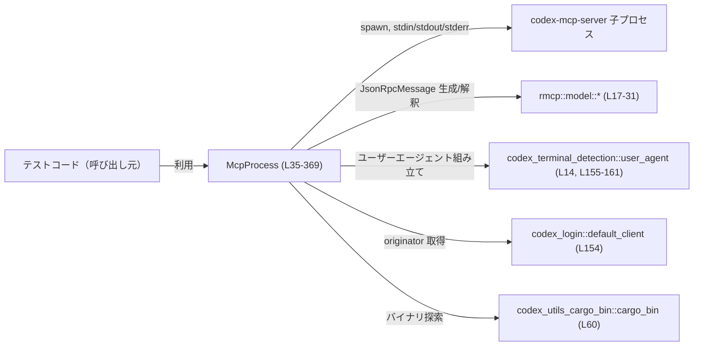
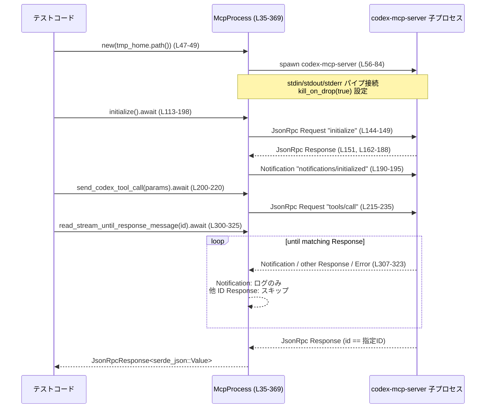

# mcp-server/tests/common/mcp_process.rs コード解説

## 0. ざっくり一言

`McpProcess` は、テストコードから `codex-mcp-server` バイナリを子プロセスとして起動し、JSON-RPC (RMCP) でやり取りするためのヘルパークライアントです（プロセス生成・初期化ハンドシェイク・リクエスト送信・ストリームからのレスポンス／通知待ちを担当します）。  
根拠: `McpProcess` 定義とメソッド群全体  
（mcp-server/tests/common/mcp_process.rs:L35-369）

---

## 1. このモジュールの役割

### 1.1 概要

- このモジュールはテストから `codex-mcp-server` 子プロセスを起動し、JSON-RPC 2.0 ベースの MCP プロトコルで通信するためのクライアントラッパーを提供します。  
  根拠: `McpProcess` が `tokio::process::Command` で `"codex-mcp-server"` を起動し、`JsonRpcMessage` を送受信している部分  
  （L56-93, L144-149, L251-261, L263-273）
- 初期化ハンドシェイク（`initialize` メソッド）と、Codex 用ツール呼び出し (`tools/call` のリクエスト) など、テストで頻繁に使う操作を高レベル API としてまとめています。  
  根拠: `initialize` / `send_codex_tool_call`  
  （L113-198, L200-220）
- ストリーム上の JSON-RPC メッセージを読み続け、条件に合うメッセージ（特定の `RequestId` のレスポンスや特定型の通知）が来るまで待機するユーティリティを提供します。  
  根拠: `read_stream_until_*` メソッド群  
  （L275-325, L329-369）

### 1.2 アーキテクチャ内での位置づけ

このファイルは「テスト用クライアント」として、以下のコンポーネントの仲立ちをします。

- テストコード（上位のテストケース; このチャンクには未登場）
- `McpProcess`（このモジュール）
- 子プロセス `codex-mcp-server`
- JSON-RPC モデル型 (`rmcp::model::*`)
- OS / 端末情報 (`os_info`, `codex_terminal_detection::user_agent`, `codex_login`)

これを簡略図にすると次のようになります。



### 1.3 設計上のポイント

- **プロセス管理**
  - `tokio::process::Command` で `codex-mcp-server` を `kill_on_drop(true)` 付きで起動し、`Drop` 実装で追加の同期的な終了待ちを行います。  
    根拠: L60-83, L372-399
  - 子プロセスの `stderr` は別タスクで読み取り、親プロセスの `stderr` に転送してテスト失敗の原因を見やすくしています。  
    根拠: L95-104
- **リクエスト ID 管理**
  - `AtomicI64` で JSON-RPC リクエスト ID を採番します（`Relaxed` オーダリング）。  
    ただしすべての公開メソッドは `&mut self` を受け取るため、通常は単一タスクから順次呼び出される設計です。  
    根拠: フィールド `next_request_id` と `fetch_add` 呼び出し  
    （L35-36, L115, L227）
- **JSON-RPC I/O**
  - 1 メッセージ=1 行の JSON として、`stdin` へ書き出し／`stdout` から読み込みを行います。  
    根拠: `send_jsonrpc_message` の末尾で `"\n"` を書き出し、`read_jsonrpc_message` が `read_line` を使う箇所  
    （L251-261, L266-270）
- **エラーハンドリング**
  - 戻り値は原則 `anyhow::Result` です。I/O・シリアライズ・プロトコル違反などはすべてエラーとしてテストに伝播します。  
    根拠: すべての async メソッドのシグネチャと `?` / `anyhow::bail!` の使用  
    （L47-49, L56-59, L113-198, L200-220, L222-236, L238-249, L275-369）
- **プロトコル前提の検証**
  - `initialize` では、サーバーから返るレスポンス内容を `assert_eq!` で厳密にチェックし、期待と異なればテストパニックとします。  
    根拠: L162-188, L170-188

---

## 2. 主要な機能一覧

- MCP サーバー子プロセスの起動・環境変数上書き (`new`, `new_with_env`)
- MCP プロトコルの初期化ハンドシェイク (`initialize`)
- Codex ツールの JSON-RPC 呼び出し (`send_codex_tool_call`)
- 任意の JSON-RPC レスポンス送信（サーバー側ロール用） (`send_response`)
- ストリームから「最初の Request メッセージ」を待ち受ける (`read_stream_until_request_message`)
- 指定した `RequestId` のレスポンスを待ち受ける (`read_stream_until_response_message`)
- レガシーな `codex/event` 通知（`task_complete`）が現れるまで待ち受ける (`read_stream_until_legacy_task_complete_notification`)
- `Drop` 時に子プロセス終了をベストエフォートで待つ（同期ポーリング） (`impl Drop for McpProcess`)

---

## 3. 公開 API と詳細解説

### 3.1 型一覧（構造体・列挙体など）

#### 構造体

| 名前        | 種別   | 役割 / 用途                                                                 | 定義位置 |
|------------|--------|------------------------------------------------------------------------------|----------|
| `McpProcess` | 構造体 | `codex-mcp-server` 子プロセスとの JSON-RPC 通信用のテスト用クライアントラッパー | L35-44   |

フィールド詳細:

| フィールド名        | 型                               | 説明                                                                                             | 定義位置 |
|---------------------|----------------------------------|--------------------------------------------------------------------------------------------------|----------|
| `next_request_id`   | `AtomicI64`                     | 次の JSON-RPC リクエストで使う数値 ID を保持。`fetch_add` でインクリメント。                      | L35-36   |
| `process`           | `Child`                         | 起動した `codex-mcp-server` 子プロセスのハンドル。`Drop` で終了待ちに利用。                       | L41      |
| `stdin`             | `ChildStdin`                    | 子プロセス標準入力（JSON-RPC メッセージを書き込む）。                                            | L42      |
| `stdout`            | `BufReader<ChildStdout>`        | 子プロセス標準出力（1 行ごとの JSON-RPC メッセージを読み取る）。                                 | L43      |

#### コンポーネントインベントリー（メソッド・関数）

| 名前 | 種別 | 公開性 | 概要 | 位置 |
|------|------|--------|------|------|
| `McpProcess::new` | async 関数 | `pub` | 環境変数上書きなしで MCP プロセスを起動するショートカット。`new_with_env` を委譲。 | L47-49 |
| `McpProcess::new_with_env` | async 関数 | `pub` | MCP プロセスを起動し、環境変数の上書き/削除を設定する。`stdin`/`stdout`/`stderr` 設定と `kill_on_drop` を行う。 | L56-111 |
| `McpProcess::initialize` | async 関数 | `pub` | MCP プロトコルの `initialize` リクエストを送り、レスポンス内容を検証した後 `notifications/initialized` 通知を送る。 | L113-198 |
| `McpProcess::send_codex_tool_call` | async 関数 | `pub` | `tools/call` メソッドで Codex ツールを呼び出し、そのリクエスト ID を返す。 | L200-220 |
| `McpProcess::send_request` | async 関数 | `fn` (private) | 任意メソッド名＋任意パラメータで JSON-RPC Request を送り、その ID を返す内部ヘルパー。 | L222-236 |
| `McpProcess::send_response` | async 関数 | `pub` | 与えられた `RequestId` に対する JSON-RPC Response を送る。 | L238-249 |
| `McpProcess::send_jsonrpc_message` | async 関数 | `fn` (private) | 任意の `JsonRpcMessage` を JSON 文字列＋改行として子プロセス stdin に書き込む。 | L251-261 |
| `McpProcess::read_jsonrpc_message` | async 関数 | `fn` (private) | 子プロセス stdout から 1 行読み込み、`JsonRpcMessage` にデシリアライズする。 | L263-273 |
| `McpProcess::read_stream_until_request_message` | async 関数 | `pub` | ストリームを読み続け、最初の `JsonRpcMessage::Request` を返す。その他種別はログ出力またはエラー。 | L275-298 |
| `McpProcess::read_stream_until_response_message` | async 関数 | `pub` | ストリームを読み続け、指定 `RequestId` の `JsonRpcMessage::Response` が届くまで待つ。 | L300-325 |
| `McpProcess::read_stream_until_legacy_task_complete_notification` | async 関数 | `pub` | `codex/event` 通知で `params.msg.type == "task_complete"` な通知が届くまで読み続ける。 | L329-369 |
| `impl Drop for McpProcess::drop` | 関数 | 自動呼び出し | 子プロセスに `start_kill` を要求し、最大 5 秒間 `try_wait` で終了をポーリングする同期クリーンアップ。 | L372-399 |

---

### 3.2 関数詳細（最大 7 件）

以下では公開 API のうち重要なものを 7 件選び、詳細を記述します。

#### `McpProcess::new_with_env(codex_home: &Path, env_overrides: &[(&str, Option<&str>)]) -> anyhow::Result<Self>`

**概要**

- `codex-mcp-server` バイナリを子プロセスとして起動し、標準入出力をパイプに接続した `McpProcess` を構築します。  
- テスト専用に、子プロセス側の環境変数を上書き・削除する機能を備えています。  
  根拠: L56-80, L81-93, L105-110

**引数**

| 引数名         | 型                             | 説明 |
|----------------|--------------------------------|------|
| `codex_home`   | `&Path`                        | 子プロセス環境変数 `CODEX_HOME` に設定されるパス。テスト用ホームディレクトリなどを指定。 |
| `env_overrides` | `&[(&str, Option<&str>)]`     | 子プロセス用の追加/上書き環境変数。`(key, Some(value))` で設定、`(key, None)` で削除。 |

**戻り値**

- 成功時: 初期化済み `McpProcess` をラップした `Ok(McpProcess)`。  
- 失敗時: `anyhow::Error`。バイナリ探索失敗、プロセス起動失敗、`stdin`/`stdout` 取得失敗などが該当します。  
  根拠: `.context(..)?`, `.spawn()?`, `.ok_or_else(..)?` の使用  
  （L60-61, L81-84, L85-92）

**内部処理の流れ**

1. `codex_utils_cargo_bin::cargo_bin("codex-mcp-server")` でテストビルドされた MCP サーバーバイナリのパスを取得します。失敗するとエラー。  
   根拠: L60-61
2. `Command::new(program)` で子プロセスコマンドを作成し、`stdin`/`stdout`/`stderr` をすべてパイプ (`Stdio::piped`) に設定します。  
   根拠: L62-66
3. デフォルト環境変数として `CODEX_HOME` と `RUST_LOG=debug` を設定します。  
   根拠: L67-68
4. `env_overrides` を走査し、各 `(k, v)` について `Some(val)` なら `cmd.env(k, val)`、`None` なら `cmd.env_remove(k)` を呼び、子プロセスの環境を調整します。  
   根拠: L70-78
5. `kill_on_drop(true)` を設定してから `spawn()` で子プロセスを起動します。  
   根拠: L81-84
6. 起動した `Child` から `stdin` と `stdout` を `take()` し、`None` の場合はエラーにします。`stdout` は `BufReader` でラップします。  
   根拠: L85-93
7. `stderr` があれば `BufReader::lines()` で非同期行読み取りタスクを `tokio::spawn` し、読み取った行を `eprintln!` へ転送します。  
   根拠: L95-104
8. `McpProcess` 構造体を組み立てて返します。`next_request_id` は 0 で初期化されます。  
   根拠: L105-110

**Examples（使用例）**

```rust
// テストで codex-mcp-server を起動し、McpProcess を構築する例
#[tokio::test]
async fn start_mcp_with_custom_env() -> anyhow::Result<()> {
    use std::path::Path;
    use tempfile::tempdir;

    let tmp_home = tempdir()?;                                  // テスト用 CODEX_HOME
    let codex_home = tmp_home.path();                           // &Path として渡す

    let env_overrides = [("MY_TEST_FLAG", Some("1"))];           // 子プロセス固有の環境変数

    let mut mcp = McpProcess::new_with_env(codex_home, &env_overrides).await?; // 子プロセス起動

    // ここで initialize などを呼び出してテストを進める
    mcp.initialize().await?;

    Ok(())
}
```

**Errors / Panics**

- `cargo_bin("codex-mcp-server")` がバイナリを見つけられない場合、`context("should find binary...")` 付きでエラーになります。  
  根拠: L60-61
- `spawn()` に失敗した場合も `context("codex-mcp-server proc should start")` 付きでエラー。  
  根拠: L81-84
- `stdin` または `stdout` が `None` の場合、`anyhow::format_err!("mcp should have stdin fd")` などでエラー。  
  根拠: L85-92
- パニックは明示的には発生しません（`unwrap`/`expect` なし）。

**Edge cases（エッジケース）**

- `env_overrides` が空スライスでも問題なく起動します（for ループがスキップされるだけ）。  
  根拠: L70-79
- `codex_home` が存在しないパスでも、ここでは検証していません。サーバー側が起動時にエラーを出す可能性がありますが、この関数では検出できません（子プロセスの終了は別途）。  
  根拠: L67, L81-84

**使用上の注意点**

- 非同期関数のため、Tokio などのランタイム内から `.await` で呼び出す前提です。
- 起動したプロセスは `McpProcess` の `Drop` まで生存します。同じテスト内で複数起動する場合はリソース消費に注意が必要です。
- `kill_on_drop(true)` とはいえ即時終了は保証されないため、テスト終了時に一時的に子プロセスが残っている可能性があります（これを軽減するために `Drop` 実装でポーリングしています）。  
  根拠: L81-83, L372-399

---

#### `McpProcess::initialize(&mut self) -> anyhow::Result<()>`

**概要**

- MCP プロトコルの `initialize` リクエストをサーバーに送り、レスポンスの内容と JSON-RPC メタデータを厳密に検証します。  
- 正常なレスポンスを受け取った後に `notifications/initialized` 通知を送信し、ハンドシェイクを完了します。  
  根拠: L113-198

**引数**

- なし（`&mut self` のみ）。

**戻り値**

- 成功時: `Ok(())`。  
- 失敗時: エラー (`anyhow::Error`)。プロトコル違反、I/O 失敗、シリアライズ失敗など。

**内部処理の流れ**

1. `next_request_id` をインクリメントして、この `initialize` 呼び出し専用の `request_id` を取得します。  
   根拠: L115
2. `InitializeRequestParams` を構築します。  
   - `ClientCapabilities` で `elicitation` のみを設定し、`FormElicitationCapability` に `schema_validation: None` を指定。  
   - `client_info` として `"elicitation test"` という名前でクライアント情報を渡します。  
   - `protocol_version` は `ProtocolVersion::V_2025_03_26` 固定です。  
   根拠: L117-141
3. `serde_json::to_value` で `params` を `Value` に変換し、`CustomRequest::new("initialize", Some(params_value))` を使って JSON-RPC Request を作成します。  
   根拠: L142-148
4. `send_jsonrpc_message` で Request を子プロセス stdin に書き込みます。  
   根拠: L144-149, L251-261
5. `read_jsonrpc_message` でレスポンスを 1 メッセージ受信します。  
   根拠: L151, L263-273
6. OS 情報 (`os_info::get()`)、ビルドバージョン (`env!("CARGO_PKG_VERSION")`)、originator (`codex_login::default_client::originator().value`)、`user_agent()` を組み合わせて期待される `user_agent` 文字列を構築します。  
   根拠: L152-161
7. 受信した `JsonRpcMessage` が `Response` であることと、`jsonrpc == JsonRpcVersion2_0`、`id == RequestId::Number(request_id)` であること、`result` が期待される JSON 構造と完全一致することを `assert_eq!` で検証します。  
   根拠: L162-188
8. 最後に `notifications/initialized` 通知を送信し、サーバー側に初期化完了を通知します。  
   根拠: L190-195

**Examples（使用例）**

```rust
// サーバーとの初期化ハンドシェイクを行う例
#[tokio::test]
async fn initialize_mcp_server() -> anyhow::Result<()> {
    let tmp_home = tempfile::tempdir()?;
    let mut mcp = McpProcess::new(tmp_home.path()).await?;     // 子プロセス起動
    mcp.initialize().await?;                                   // initialize ハンドシェイク

    // ここまで来れば、サーバーとの基本的なプロトコル合意が取れている前提でテストを続行できる
    Ok(())
}
```

**Errors / Panics**

- `send_jsonrpc_message` や `read_jsonrpc_message` 内で I/O エラー／JSON 変換エラーが起きると、そのまま `anyhow::Error` として伝播します。  
  根拠: `?` の使用 （L142, L151）
- 受信メッセージが `JsonRpcMessage::Response` でなかった場合は `anyhow::bail!` でエラーとなります。  
  根拠: L162-169
- `jsonrpc` バージョン、`id`、`result` のいずれかが期待値と異なると `assert_eq!` がパニックし、テストは失敗します。  
  根拠: L170-188

**Edge cases（エッジケース）**

- サーバーが何も返さずに接続を閉じた場合:  
  `read_line` が空文字を返し、その後 `serde_json::from_str` がエラーになり `anyhow::Error` に変換されます。  
  根拠: L266-270
- サーバーが `Response` 以外（`Notification` など）を最初に返した場合:  
  パターンマッチで `Response` にマッチせず、`bail!("expected initialize response message...")` が実行されます。  
  根拠: L162-169

**使用上の注意点**

- この関数は「サーバーの実装が期待どおりであること」を前提に、かなり厳しい `assert_eq!` を行います。そのため、サーバーの仕様変更があるとテストがすぐに落ちます。
- 初期化に失敗すると以降の MCP 通信が成立しないため、通常は最初にこの関数を呼ぶ必要があります。
- `user_agent` 文字列に OS 情報やクライアント情報が含まれるため、環境差分によるテスト失敗が発生しうる点に注意が必要です（ただしここではその値を期待値として組み立てています）。  
  根拠: L152-161, L173-188

---

#### `McpProcess::send_codex_tool_call(&mut self, params: CodexToolCallParam) -> anyhow::Result<i64>`

**概要**

- `codex` ツールに対する JSON-RPC `tools/call` リクエストを送信し、その `request_id` を返します。  
  根拠: L200-220

**引数**

| 引数名 | 型                  | 説明 |
|--------|---------------------|------|
| `params` | `CodexToolCallParam` | Codex MCP サーバーが定義するツール呼び出しパラメータ。`serde` で JSON オブジェクトにシリアライズされる前提。 |

**戻り値**

- 成功時: 実際に送信した JSON-RPC リクエストに付与された数値 `request_id`。  
- 失敗時: `anyhow::Error`（シリアライズ失敗、内部 `send_request` のエラーなど）。

**内部処理の流れ**

1. `CodexToolCallParam` を `serde_json::to_value` で JSON 値へ変換します。  
2. その値が `Object` であることを前提に `match` で分解し、`Some(map)` として `CallToolRequestParams.arguments` にセットします。  
   - オブジェクト以外の場合は `unreachable!("params serialize to object")` でパニックします。  
   根拠: L206-213
3. `CallToolRequestParams` を `serde_json::to_value` で JSON 値に変換し、`send_request("tools/call", Some(value))` を呼び出します。  
   根拠: L215-218, L222-236
4. 内部で ID 採番・JSON-RPC Request 作成・送信が行われ、その ID を返します。  
   根拠: L227-235

**Examples（使用例）**

```rust
// Codex ツールを呼び出し、レスポンスを待つ一連の処理例
async fn call_codex_tool_example(
    mcp: &mut McpProcess,
    tool_params: CodexToolCallParam,
) -> anyhow::Result<serde_json::Value> {
    use rmcp::model::RequestId;

    let request_id = mcp.send_codex_tool_call(tool_params).await?;  // tools/call を送信
    let response = mcp
        .read_stream_until_response_message(RequestId::Number(request_id))
        .await?;                                                     // 対応するレスポンスを待つ

    Ok(response.result)                                             // ツール結果の JSON を返す
}
```

**Errors / Panics**

- `CodexToolCallParam` → JSON 変換に失敗した場合、`anyhow::Error` として返ります。  
  根拠: L209-210
- 変換後の JSON がオブジェクトでなかった場合、`unreachable!("params serialize to object")` によりパニックします。この前提は `CodexToolCallParam` の設計に依存します。  
  根拠: L210-212
- `send_request` 内の I/O エラー・シリアライズエラーも `anyhow::Error` として伝播します。

**Edge cases（エッジケース）**

- `params` が持つフィールドのどれかが `Option::None` でも、シリアライズ側の `serde` 実装が適切に処理する前提です。この関数側で内容は検証していません。
- ツール名は `"codex"` に固定されており、他のツールには使えません。  
  根拠: L208-209

**使用上の注意点**

- 戻り値はレスポンスそのものではなく `request_id` です。実際の結果を得るには別途 `read_stream_until_response_message` などでレスポンスを待つ必要があります。
- `unreachable!` に依存しているため、`CodexToolCallParam` の JSON 形が変わった場合にテストが即座にパニックします。

---

#### `McpProcess::send_response(&mut self, id: RequestId, result: serde_json::Value) -> anyhow::Result<()>`

**概要**

- MCP サーバー側のロールをテストで模倣する際に、任意の `RequestId` に対する JSON-RPC Response を送信するためのヘルパーです。  
  根拠: L238-249

**引数**

| 引数名 | 型                    | 説明 |
|--------|-----------------------|------|
| `id`   | `RequestId`           | 対象となる JSON-RPC リクエストの ID。 |
| `result` | `serde_json::Value` | クライアントに返す結果 JSON。 |

**戻り値**

- 成功時: `Ok(())`  
- 失敗時: `anyhow::Error` (`send_jsonrpc_message` のエラー)

**内部処理の流れ**

1. `JsonRpcResponse` 構造体を組み立てます（`jsonrpc` は `JsonRpcVersion2_0` に固定）。  
   根拠: L243-247
2. それを `JsonRpcMessage::Response` に包み、`send_jsonrpc_message` で子プロセス stdin に書き出します。  
   根拠: L243-248

**Examples（使用例）**

```rust
// テストで「サーバーがクライアントにレスポンスを返す」挙動を擬似的に行う例
async fn respond_ok(
    mcp: &mut McpProcess,
    id: rmcp::model::RequestId,
) -> anyhow::Result<()> {
    let payload = serde_json::json!({ "ok": true });        // 任意の結果 JSON
    mcp.send_response(id, payload).await                    // Response メッセージ送信
}
```

**Errors / Panics**

- `send_jsonrpc_message` 内での JSON シリアライズまたは I/O 書き込みエラーは `anyhow::Error` として返ります。
- パニックは発生しません（`unwrap` なし）。

**Edge cases（エッジケース）**

- `result` に巨大な JSON を渡した場合、そのままシリアライズ・送信されます。サイズチェック等はしていません。
- `id` が未使用のものでも、この関数は単に送るだけで、整合性は確認しません。

**使用上の注意点**

- 通常のテストでは `McpProcess` はクライアント側として使うことが多いため、このメソッドは「クライアントからの Request に手動でレスポンスを返したい」ときなど特殊な用途が想定されます。
- 非同期関数であるため `.await` 忘れに注意が必要です。

---

#### `McpProcess::read_stream_until_response_message(&mut self, request_id: RequestId) -> anyhow::Result<JsonRpcResponse<serde_json::Value>>`

**概要**

- 子プロセスからの JSON-RPC メッセージストリームを読み続け、指定した `request_id` に対応する `Response` が現れるまで待機します。  
- 他の種別のメッセージや、別の ID の `Response` に対してはエラーまたはスキップの扱いをします。  
  根拠: L300-325

**引数**

| 引数名      | 型          | 説明 |
|-------------|-------------|------|
| `request_id` | `RequestId` | 期待する `JsonRpcResponse.id`（数値 ID 等）。 |

**戻り値**

- 成功時: 対象 `request_id` に対応する `JsonRpcResponse<serde_json::Value>`。  
- 失敗時: `anyhow::Error`（不正メッセージ種別、I/O エラー、JSON パースエラーなど）。

**内部処理の流れ**

1. デバッグログとして `eprintln!` で開始メッセージを出力します。  
   根拠: L304
2. 無限ループ内で `read_jsonrpc_message` によりメッセージを 1 つずつ読み取ります。  
   根拠: L306-307, L263-273
3. メッセージ種別に応じた処理:
   - `Notification`: ログ出力して無視（ループ継続）。  
     根拠: L309-311
   - `Request`: 想定外とみなし `anyhow::bail!("unexpected JSONRPCMessage::Request: ...")`。  
     根拠: L312-314
   - `Error`: 同様に `bail!`。  
     根拠: L315-317
   - `Response(jsonrpc_response)`:  
     - `jsonrpc_response.id == request_id` のとき、そのレスポンスを返して関数終了。  
     - それ以外の ID の場合はループ継続（メッセージは黙って捨てる）。  
       根拠: L318-322

**Examples（使用例）**

```rust
// send_codex_tool_call と組み合わせてレスポンスを取得する例
async fn call_and_wait(
    mcp: &mut McpProcess,
    params: CodexToolCallParam,
) -> anyhow::Result<serde_json::Value> {
    use rmcp::model::RequestId;

    let id_num = mcp.send_codex_tool_call(params).await?;    // リクエスト送信
    let response = mcp
        .read_stream_until_response_message(RequestId::Number(id_num))
        .await?;                                             // 対応するレスポンスを待つ

    Ok(response.result)
}
```

**Errors / Panics**

- 不正種別のメッセージを受信すると `anyhow::bail!` によりエラー終了します。
  - `Request` や `Error` が届いた場合。  
    根拠: L312-317
- `Notification` と他の ID の `Response` はエラーにはならず、スキップされます。
- `read_jsonrpc_message` 内の I/O や JSON パースエラーも `anyhow::Error` として伝播します。

**Edge cases（エッジケース）**

- 対応する `request_id` のレスポンスが永遠に来ない場合、この関数は無限ループし続けます（テスト全体のタイムアウトに依存）。  
  根拠: ループに明示的なタイムアウトなし（L306-324）
- 同じ `request_id` のレスポンスが複数届いた場合、最初のものを返した時点で関数は終了します。後続のレスポンスは別の読み取り箇所で消費されることになります。

**使用上の注意点**

- 「他の種別のメッセージが届いたら即エラー」ではなく、「Notification と他 ID の Response は黙ってスキップ」する挙動のため、テスト設計時にはストリーム上のメッセージ順序を意識する必要があります。
- タイムアウトを設けたい場合は、この関数を `tokio::time::timeout` などでラップするのが一般的です（このファイル内にはタイムアウト処理はありません）。

---

#### `McpProcess::read_stream_until_legacy_task_complete_notification(&mut self) -> anyhow::Result<JsonRpcNotification<CustomNotification>>`

**概要**

- レガシーな「ターン完了」通知を検出するためのメソッドです。  
- `codex/event` メソッドの通知で、`params.msg.type == "task_complete"` となるものが届くまでストリームを読み続けます。  
  根拠: L327-369

**引数**

- なし（`&mut self` のみ）

**戻り値**

- 成功時: マッチした `JsonRpcNotification<CustomNotification>`。  
- 失敗時: `anyhow::Error`（不正種別メッセージ、I/O エラーなど）。

**内部処理の流れ**

1. 開始ログを `eprintln!` で出力します。  
   根拠: L332
2. 無限ループで `read_jsonrpc_message` を呼び出し、メッセージを 1 つずつ取得します。  
   根拠: L334-335, L263-273
3. メッセージを種別で `match` します。  
   - `Notification(notification)` の場合:
     1. `notification.notification.method == "codex/event"` かチェック。
     2. `params` が `Some` であれば `params.get("msg").and_then(|m| m.get("type")).and_then(|t| t.as_str()) == Some("task_complete")` を評価。  
        根拠: L337-345
     3. 上記条件を満たすとき `return Ok(notification)`。  
        そうでなければ `eprintln!("ignoring notification: ..")` してループ継続。  
        根拠: L352-356
   - `Request`/`Error`/`Response` の場合はいずれも `anyhow::bail!` によりエラー終了。  
     根拠: L358-366

**Examples（使用例）**

```rust
// レガシーな task_complete 通知まで待つテストフローの例
async fn wait_for_legacy_task_complete(mcp: &mut McpProcess) -> anyhow::Result<()> {
    // ここまでにツール呼び出しなどでサーバーに処理を依頼している想定
    let notification = mcp
        .read_stream_until_legacy_task_complete_notification()
        .await?;                                            // task_complete 通知を待つ

    // notification.notification.params には "msg": { "type": "task_complete", ... } が含まれるはず
    println!("got legacy completion: {:?}", notification);

    Ok(())
}
```

**Errors / Panics**

- `Request` / `Error` / `Response` が届いた場合はそれぞれ `anyhow::bail!("unexpected JSONRPCMessage::...")` で即エラー終了します。  
  根拠: L358-366
- Notification 本文の JSON 構造が期待と異なり `params.get("msg")` 等が `None` になる場合は、単に条件にマッチしなかったものとしてログ出力後スキップされます（エラーにはしません）。

**Edge cases（エッジケース）**

- `codex/event` 以外の通知、`params` を持たない通知はすべて無視されます。  
  根拠: L338-350
- 対象の通知が永遠に届かない場合、この関数は無限ループし続けます（上位でタイムアウト管理が必要です）。

**使用上の注意点**

- レガシー仕様に依存するメソッドのため、新しいプロトコルでは利用しない可能性があります。テストコードでの利用範囲を限定するのが自然です。
- `params` の JSON 構造を固定的に探索しているため、サーバー側の通知フォーマットが変わるとマッチしなくなりますが、この関数自身はエラーを返さず「無限に待ち続ける」ことになります。

---

#### `McpProcess::read_stream_until_request_message(&mut self) -> anyhow::Result<JsonRpcRequest<CustomRequest>>`

**概要**

- ストリームから最初の JSON-RPC `Request` メッセージが現れるまで読み続け、見つかった `JsonRpcRequest` を返します。  
- サーバーがクライアントへ送るリクエストをテストしたい場合などに使われます。  
  根拠: L275-298

**引数**

- なし（`&mut self` のみ）

**戻り値**

- 成功時: 最初に見つかった `JsonRpcRequest<CustomRequest>`。  
- 失敗時: `anyhow::Error`（不正メッセージ種別、I/O など）。

**内部処理の流れ**

1. ログ出力後、無限ループで `read_jsonrpc_message` を呼び出します。  
   根拠: L278-282
2. 受信メッセージを `match`:
   - `Notification(_)`: `eprintln!` で内容を出力してスキップ。  
     根拠: L283-286
   - `Request(jsonrpc_request)`: `Ok(jsonrpc_request)` を返して終了。  
     根拠: L287-289
   - `Error(_)` / `Response(_)`: 想定外として `anyhow::bail!`。  
     根拠: L290-295

**Examples（使用例）**

```rust
// サーバーからの最初の Request を受け取り、それに応答する例
async fn handle_first_request(mcp: &mut McpProcess) -> anyhow::Result<()> {
    use rmcp::model::JsonRpcMessage;

    let request = mcp.read_stream_until_request_message().await?; // 最初の Request を待つ
    let id = request.id.clone();                                  // RequestId を控える

    // ここで request.request.method や params を見て適当な result を構築する
    let result = serde_json::json!({ "handled": true });

    mcp.send_response(id, result).await                            // Response を返す
}
```

**Errors / Panics**

- `Error` や `Response` が届いた場合は `anyhow::bail!` で直ちにエラー。  
  根拠: L290-295
- `Notification` はスキップされるだけでエラーにはなりません。

**Edge cases（エッジケース）**

- `Request` が届かないまま Notification だけが続く場合、この関数は無限ループになります。
- 最初の `Request` を返した時点でストリームの残りはこの関数の外側で処理する必要があります。

**使用上の注意点**

- 「Request 以外をエラーとせず、Notification はログ出力だけで捨てる」挙動のため、複数のテストコードが同じストリームを並行して読むような構成は避ける必要があります。
- 典型的には、1 テストにつき 1 インスタンスの `McpProcess` を用い、シーケンシャルにメソッドを呼び出す前提になります。

---

#### `impl Drop for McpProcess { fn drop(&mut self) { ... } }`

**概要**

- `McpProcess` がスコープを抜けた際に、`codex-mcp-server` 子プロセスの終了をベストエフォートで待機する同期的クリーンアップ処理です。  
  根拠: L372-399

**引数**

- なし（`&mut self` のみ）

**戻り値**

- なし。

**内部処理の流れ**

1. `self.process.start_kill()` を呼び、子プロセスの終了を開始します（失敗しても結果は無視）。  
   根拠: L388
2. 現在時刻を取得し、タイムアウト 5 秒を計算します。  
   根拠: L390-391
3. `while start.elapsed() < timeout` のループで `self.process.try_wait()` をポーリングします。  
   - `Ok(Some(_))`: 子プロセス終了が確認できたので `return`。  
   - `Ok(None)`: まだ生きているので `std::thread::sleep(10ms)` して再試行。  
   - `Err(_)`: 何らかのエラーが発生したので `return`（これ以上は何もしない）。  
   根拠: L392-397

**Examples（使用例）**

直接呼び出すことはなく、`McpProcess` がスコープを抜けると自動的に実行されます。

```rust
#[tokio::test]
async fn drop_kills_child_process() -> anyhow::Result<()> {
    let tmp_home = tempfile::tempdir()?;
    {
        let mut mcp = McpProcess::new(tmp_home.path()).await?;
        mcp.initialize().await?;
        // ここでブロックを抜けると mcp が Drop され、子プロセス終了処理が走る
    } // ここで drop

    Ok(())
}
```

**Errors / Panics**

- `start_kill` や `try_wait` がエラーを返しても、それらは無視され、パニックは起こりません。  
  根拠: `let _ = self.process.start_kill();` と `Err(_) => return` （L388, L393-397）
- `std::thread::sleep` 以外にパニックとなる要素はなく、通常は安全に終了します。

**Edge cases（エッジケース）**

- 子プロセスが 5 秒以内に終了しない場合、ループを抜けてそのまま関数を終了します。この場合、プロセスがまだ生きている可能性があります。
- この Drop は同期処理であり、Tokio ランタイムのワーカー上で呼び出されると、そのスレッドを最大 5 秒ブロックします。テストでは通常許容されますが、本番コードには向きません。

**使用上の注意点**

- Drop は非同期にできないため、この実装は「テストの信頼性向上」を目的とした妥協案です。  
- 長時間ブロックを避けたい場合はタイムアウト時間を短くするなどの調整が必要になるかもしれません（このチャンクでは 5 秒に固定）。  
  根拠: L391

---

### 3.3 その他の関数

| 関数名 | 公開性 | 役割（1 行） | 位置 |
|--------|--------|--------------|------|
| `McpProcess::new(codex_home: &Path)` | `pub async` | `new_with_env(codex_home, &[])` を呼ぶだけのショートカット。 | L47-49 |
| `McpProcess::send_request(&mut self, method: &str, params: Option<Value>) -> anyhow::Result<i64>` | private async | 任意メソッド名とパラメータで JSON-RPC Request を構築・送信し、その ID を返す内部ヘルパー。 | L222-236 |
| `McpProcess::send_jsonrpc_message(&mut self, message: JsonRpcMessage<...>) -> anyhow::Result<()>` | private async | `message` を JSON シリアライズし、`stdin` に書き込み、改行・flush まで行う低レベル I/O。 | L251-261 |
| `McpProcess::read_jsonrpc_message(&mut self) -> anyhow::Result<JsonRpcMessage<...>>` | private async | `stdout` から 1 行読み取り、それを `JsonRpcMessage` にデシリアライズする低レベル I/O。 | L263-273 |

これらは公開 API の基礎となるコアロジックですが、上位メソッドから直接呼ばれるため詳細説明は割愛しました。

---

## 4. データフロー

ここでは代表的なシナリオとして、「MCP サーバーを起動→initialize→Codex ツール呼び出し→レスポンス取得」のデータフローを示します。

### シナリオ: initialize と Codex ツール呼び出し

1. テストコードが `McpProcess::new` で子プロセスを起動します。  
   根拠: L47-49, L56-111
2. `initialize` を呼び、`initialize` Request を送信→レスポンスを検証→`notifications/initialized` を送信します。  
   根拠: L113-198
3. `send_codex_tool_call` で `tools/call` Request を送ります（内部で `send_request` → `send_jsonrpc_message`）。  
   根拠: L200-220, L222-236, L251-261
4. `read_stream_until_response_message` で指定 ID の `Response` が届くまでストリームを読み続けます（内部で `read_jsonrpc_message`）。  
   根拠: L300-325, L263-273



（図中のメソッド行番号は mcp-server/tests/common/mcp_process.rs のものです）

---

## 5. 使い方（How to Use）

### 5.1 基本的な使用方法

典型的なテストフローの例です。

```rust
use mcp_server_tests::common::mcp_process::McpProcess; // 仮のパス。実際の mod 構成に依存
use rmcp::model::RequestId;
use codex_mcp_server::CodexToolCallParam;

#[tokio::test]
async fn basic_mcp_flow() -> anyhow::Result<()> {
    let tmp_home = tempfile::tempdir()?;                         // テスト用 CODEX_HOME
    let mut mcp = McpProcess::new(tmp_home.path()).await?;       // 子プロセス起動（L47-49）

    mcp.initialize().await?;                                     // 初期化ハンドシェイク（L113-198）

    let params = CodexToolCallParam { /* フィールドを設定 */ };
    let id_num = mcp.send_codex_tool_call(params).await?;        // tools/call 送信（L200-220）

    let response = mcp
        .read_stream_until_response_message(RequestId::Number(id_num))
        .await?;                                                 // レスポンスを取得（L300-325）

    println!("tool result: {}", response.result);
    Ok(())
} // ここで mcp が Drop され、子プロセス終了処理（L372-399）
```

### 5.2 よくある使用パターン

1. **環境変数を変えたサーバー起動**

```rust
let tmp_home = tempfile::tempdir()?;
let env_overrides = [
    ("CODEX_EXPERIMENTAL_FLAG", Some("1")),
    ("RUST_LOG", Some("trace")),          // デフォルトの debug を上書き
];
let mut mcp = McpProcess::new_with_env(tmp_home.path(), &env_overrides).await?;
```

1. **サーバーからの Request を受けて応答する**

```rust
let request = mcp.read_stream_until_request_message().await?;
// request.request.method などを見て処理を分岐して result JSON を作る
let result = serde_json::json!({ "ok": true });
mcp.send_response(request.id.clone(), result).await?;
```

1. **レガシー `task_complete` 通知まで待つ**

```rust
// 事前にツール呼び出しなどを行ったあと
let notification = mcp
    .read_stream_until_legacy_task_complete_notification()
    .await?;
// notification.notification.params 内に task 完了情報が入っている想定
```

### 5.3 よくある間違い

```rust
// 間違い例: initialize をせずにツール呼び出しを行う
// サーバー側が initialize を要求する仕様の場合、ここでプロトコルエラーになる可能性が高い
let mut mcp = McpProcess::new(tmp_home.path()).await?;
let id = mcp.send_codex_tool_call(params).await?;
// ...

// 正しい例: 先に initialize を行い、初期化後にツール呼び出しを行う
let mut mcp = McpProcess::new(tmp_home.path()).await?;
mcp.initialize().await?;
let id = mcp.send_codex_tool_call(params).await?;
```

```rust
// 間違い例: request_id を無視してレスポンスを待つ
let _id = mcp.send_codex_tool_call(params).await?;
let response = mcp.read_stream_until_response_message(RequestId::Number(0)).await?;
// 0 は送信時に使われた ID とは限らず、永遠にレスポンスが来ない可能性

// 正しい例: send_codex_tool_call が返した ID をそのまま使う
let id_num = mcp.send_codex_tool_call(params).await?;
let response = mcp
    .read_stream_until_response_message(RequestId::Number(id_num))
    .await?;
```

### 5.4 使用上の注意点（まとめ）

- **非同期コンテキスト必須**  
  - すべてのメソッド（`Drop` を除く）が `async` であり、Tokio ランタイム上で使用する前提です。  
    根拠: シグネチャ （L47-49, L56-59, L113-198, L200-220, L222-236, L238-249, L251-273, L275-369）
- **無限待機の可能性**  
  - `read_stream_until_*` 系メソッドは内部でタイムアウトを設けていないため、期待するメッセージが来ないとテストがハングする可能性があります。  
    上位テストで `tokio::time::timeout` などを用いて制御することが推奨されます。
- **プロトコル仕様への強い依存**  
  - `initialize` はレスポンスの形を厳密に `assert_eq!` しているため、サーバー仕様の変更に非常に敏感です。  
    根拠: L170-188
- **Drop によるブロッキング**  
  - `Drop` 実装は最大 5 秒間スレッドをブロックします。大量のインスタンスを同時に破棄するような使い方は避けるべきです。  
    根拠: L390-397
- **安全性／エラーに関する言語固有の点**
  - エラーは `anyhow::Result` 経由で明示的に扱われ、パニックは `assert_eq!` と `unreachable!` のみで発生します（いずれも「テストの前提が崩れた」ケース）。  
    根拠: L170-188, L210-212
  - `AtomicI64` は `Ordering::Relaxed` で使用されており、`&mut self` により同時アクセスを避ける構造になっているため、競合状態は通常発生しません。  
    根拠: L35-36, L115, L227

---

## 6. 変更の仕方（How to Modify）

### 6.1 新しい機能を追加する場合

**例: 新しい JSON-RPC メソッド `foo/bar` を呼び出すヘルパーを追加したい**

1. **リクエスト構造の決定**
   - `rmcp::model` に専用のパラメータ型がある場合はそれを利用し、ない場合は `serde_json::Value` 直書きにするなどの方針を決めます。
2. **`McpProcess` にメソッド追加**
   - `send_codex_tool_call` を参考に、新メソッド `send_foo_bar` を `impl McpProcess` 内に追加します。  
     内部では `send_request("foo/bar", Some(params_value))` を呼ぶだけにしておくとよいです。  
     根拠: `send_codex_tool_call` の構造 （L200-220）
3. **レスポンス待ち**
   - レスポンス待機ロジックは `read_stream_until_response_message` をそのまま再利用できます。  
     必要であれば専用のラッパー関数を追加し、`request_id` の生成〜レスポンス取得までを一つのメソッドにまとめます。

### 6.2 既存の機能を変更する場合

- **影響範囲の確認**
  - 各メソッドはテストヘルパーとして複数のテストから呼ばれている可能性があるため、シグネチャ変更前に `grep` などで使用箇所を確認する必要があります（このチャンクにはテスト本体は含まれていません）。
- **前提条件・契約の維持**
  - 例: `initialize` の戻り値は「成功＝プロトコルレベルの合意が取れた状態」である、という前提を崩さないよう注意が必要です。
  - `read_stream_until_*` は「対象メッセージまで読み進め、それ以外はスキップまたはエラー」という契約を持つため、この挙動を変えると多くのテストが影響を受けます。
- **Drop の挙動変更**
  - タイムアウト時間やポーリング間隔を変える場合は、リーク検出の挙動やテスト実行時間への影響を考慮する必要があります。  
    根拠: 現在の実装は 5 秒タイムアウト / 10ms スリープ （L390-397）

---

## 7. 関連ファイル

このチャンクには他ファイルのパスは明示されていませんが、インポートから以下の関連コンポーネントが読み取れます。

| パス / クレート | 役割 / 関係 |
|-----------------|------------|
| `codex_mcp_server::CodexToolCallParam` | Codex MCP サーバーのツール呼び出しパラメータ型。`send_codex_tool_call` で使用。 |
| `rmcp::model::*` | JSON-RPC / MCP プロトコルのメッセージ型群（`JsonRpcMessage`, `JsonRpcRequest`, `JsonRpcResponse`, `RequestId` など）。このモジュールの I/O 形式を定義。 |
| `codex_terminal_detection::user_agent` | クライアントの user-agent 文字列構築に使われる部分。`initialize` の期待レスポンスに含まれます。 |
| `codex_login::default_client`（関数名のみ登場） | `originator` 情報の取得に使用し、`user_agent` 文字列に反映。 |
| `os_info` クレート（関数名のみ登場） | OS 種別・バージョン・アーキテクチャを取得し、`user_agent` 文字列に埋め込む。 |
| `codex_utils_cargo_bin::cargo_bin` | テストビルドされた `codex-mcp-server` バイナリを探すユーティリティ。`new_with_env` で使用。 |

実際のテストコード（`#[tokio::test]` など）からは、この `McpProcess` を介して MCP サーバーを操作する設計になっていると解釈できますが、それらのファイルパスや詳細な内容はこのチャンクには現れません。
