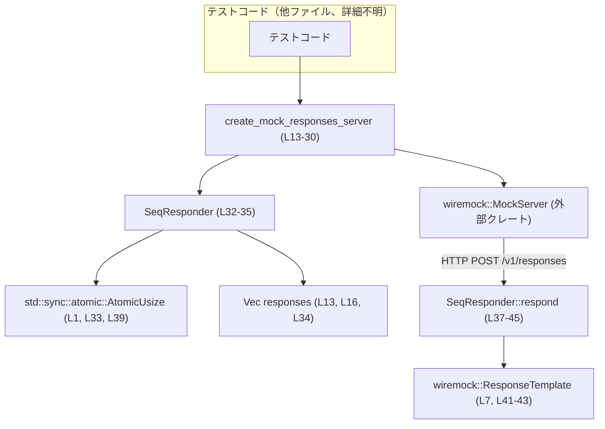
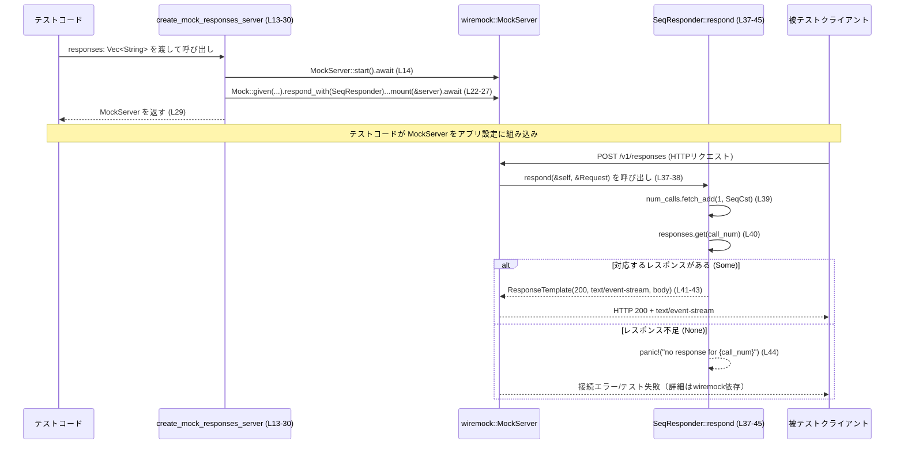

# mcp-server/tests/common/mock_model_server.rs

## 0. ざっくり一言

`wiremock` を使って、`/v1/responses` エンドポイントへの POST リクエストに対して、あらかじめ渡した文字列レスポンスを **呼び出し順に返すモック HTTP サーバー** を作成するテスト用ユーティリティです（`create_mock_responses_server` と `SeqResponder` 実装, `mock_model_server.rs:L11-30`, `mock_model_server.rs:L32-45`）。

---

## 1. このモジュールの役割

### 1.1 概要

- このモジュールは、テストコードから簡単に利用できる **モック OpenAI 風のレスポンスサーバー** を提供します。
- 関数 `create_mock_responses_server` にレスポンス文字列のベクタを渡すと、その順番どおりに HTTP レスポンスを返す `wiremock::MockServer` を起動します（`mock_model_server.rs:L11-20`）。
- 内部では、`SeqResponder` 構造体が `wiremock::Respond` トレイトを実装し、呼び出し回数を `AtomicUsize` で管理しながら、順番にレスポンスを選択します（`mock_model_server.rs:L32-35`, `mock_model_server.rs:L37-45`）。

### 1.2 アーキテクチャ内での位置づけ

このファイル単体から読み取れる主要な依存関係と、テストコードとの関係を図示します。



- テストコードはこのモジュールの `create_mock_responses_server` を呼び出して `MockServer` を取得します（`mock_model_server.rs:L13-14`）。
- `MockServer` 上に `/v1/responses` への POST リクエストに対するモックが `SeqResponder` を使ってマウントされます（`mock_model_server.rs:L22-27`）。
- 実際のリクエスト時には `SeqResponder::respond` が呼び出され、レスポンスが 1 回ごとに進んでいきます（`mock_model_server.rs:L37-45`）。

### 1.3 設計上のポイント

- **順序付きレスポンス**  
  - `responses: Vec<String>` を受け取り、1 回目の呼び出しでは要素 0、2 回目では要素 1 … という形で順番に利用します（`mock_model_server.rs:L16`, `mock_model_server.rs:L39-42`）。
- **状態管理に Atomic を利用**  
  - `SeqResponder` は `AtomicUsize` をフィールドに持ち、`fetch_add(1, Ordering::SeqCst)` で呼び出し回数をインクリメントすることで、複数スレッドからの呼び出しでも安全にカウンタを更新できる形になっています（`mock_model_server.rs:L33`, `mock_model_server.rs:L39`）。
- **テスト失敗を panic で表現**  
  - 用意したレスポンス数より多く呼ばれた場合は `panic!("no response for {call_num}")` によってテストが強制的に失敗する設計です（`mock_model_server.rs:L44`）。
- **HTTP マッチ条件の明確化**  
  - HTTP メソッドが `POST` で、パスが `/v1/responses` のリクエストのみがこのモックの対象です（`mock_model_server.rs:L22-23`）。
- **ストリーミング風のレスポンス**  
  - `content-type` ヘッダとボディ MIME タイプを `text/event-stream` に設定しており、Server-Sent Events 風のレスポンスを模倣しています（`mock_model_server.rs:L41-43`）。

---

## 2. 主要な機能一覧

- モックサーバーの起動: `create_mock_responses_server` が `wiremock::MockServer` を起動し、指定したレスポンス列を返すモックを設定します（`mock_model_server.rs:L11-29`）。
- シーケンシャルレスポンダ: `SeqResponder` 構造体とその `Respond` 実装が、呼び出し回数に応じて順番にレスポンスを選択して返します（`mock_model_server.rs:L32-35`, `mock_model_server.rs:L37-45`）。

---

## 3. 公開 API と詳細解説

### 3.1 型一覧（構造体・列挙体など）

このファイル内で定義されている型は次の通りです。

| 名前 | 種別 | 役割 / 用途 | 定義位置 |
|------|------|-------------|----------|
| `SeqResponder` | 構造体 | モックサーバーに登録され、呼び出し回数に応じて `responses` ベクタからレスポンス文字列を取り出し `ResponseTemplate` として返すレスポンダです。 | `mock_model_server.rs:L32-35` |

- `SeqResponder` は `wiremock::Respond` トレイトを実装しており、その `respond` メソッドが実際のレスポンス生成ロジックを持ちます（`mock_model_server.rs:L37-45`）。

### 3.2 関数詳細（最大 7 件）

#### `create_mock_responses_server(responses: Vec<String>) -> MockServer`

**概要**

- 渡された `responses` を順番に返すレスポンスハンドラ（`SeqResponder`）を用意し、`wiremock::MockServer` に `/v1/responses` への POST リクエスト用モックとしてマウントして返す非同期関数です（`mock_model_server.rs:L11-29`）。

**引数**

| 引数名 | 型 | 説明 |
|--------|----|------|
| `responses` | `Vec<String>` | モックサーバーが順番に返すレスポンスボディ文字列の一覧です。0 回目の呼び出しでインデックス 0、1 回目でインデックス 1 … が使われます（`mock_model_server.rs:L13`, `mock_model_server.rs:L16`, `mock_model_server.rs:L34`, `mock_model_server.rs:L39-42`）。 |

**戻り値**

- `MockServer` (`wiremock::MockServer`)  
  - 起動済みで、`/v1/responses` への POST リクエストに対して `responses` の要素を順次返すよう設定されたモックサーバーです（`mock_model_server.rs:L14`, `mock_model_server.rs:L22-27`, `mock_model_server.rs:L29`）。

**内部処理の流れ（アルゴリズム）**

1. `MockServer::start().await` を呼び出して新しいモックサーバーを起動します（`mock_model_server.rs:L14`）。
2. `responses.len()` でレスポンスの個数を数え、期待される呼び出し回数 `num_calls` として保持します（`mock_model_server.rs:L16`）。
3. `SeqResponder` 構造体のインスタンスを生成し、`num_calls` フィールドを `AtomicUsize::new(0)` で 0 に初期化し、`responses` ベクタを所有させます（`mock_model_server.rs:L17-20`, `mock_model_server.rs:L32-35`）。
4. `Mock::given(method("POST")).and(path("/v1/responses"))` により、HTTP メソッドとパスでリクエストマッチャを設定します（`mock_model_server.rs:L22-23`）。
5. `.respond_with(seq_responder)` で先ほど作成した `SeqResponder` インスタンスをレスポンダとして登録します（`mock_model_server.rs:L24`）。
6. `.expect(num_calls as u64)` により、このモックが何回呼ばれることを期待するかを設定しています（`mock_model_server.rs:L25`）。このメソッドの詳細な挙動は `wiremock` クレート側の実装に依存し、このファイルだけからは断定できません。
7. `.mount(&server).await` で、この設定を起動済みの `MockServer` にマウントします（`mock_model_server.rs:L26-27`）。
8. 最後に `server` をそのまま返します（`mock_model_server.rs:L29`）。

**Examples（使用例）**

> この例は、このファイルにある関数・型のみを用いて、テストコード側からの基本的な利用手順を示す擬似コードです。  
> (`app_under_test_uses_mock_server` などの関数はこのファイルには定義されていません。)

```rust
// テスト用のレスポンスを用意する
let responses = vec![
    // 1回目のHTTP呼び出しで返したいイベントストリームのテキスト
    "data: {\"message\": \"first\"}\n\n".to_string(),
    // 2回目のHTTP呼び出しで返したいテキスト
    "data: {\"message\": \"second\"}\n\n".to_string(),
];

// モックサーバーを起動する（非同期コンテキスト前提）
let server = create_mock_responses_server(responses).await;

// ここで server（MockServer）をアプリケーションのHTTPクライアント設定に渡すなどして、
// アプリケーションが /v1/responses へ POST を行うと、上記responsesの中身が順番に返される想定
// （具体的なクライアントコードはこのファイルには含まれていません）
```

**Errors / Panics**

- この関数自体は `Result` ではなく `MockServer` を直接返しており、関数シグネチャの範囲ではエラーは明示されていません（`mock_model_server.rs:L13-30`）。
- 内部で利用しているメソッド呼び出し（`MockServer::start`, `mount`, `expect` など）のエラー挙動は `wiremock` クレート側の実装に依存し、このファイルからは判断できません。
- `SeqResponder` 内部での panic（レスポンス不足時）は、この関数の利用後、実際にリクエストが飛んだ時点で発生する可能性があります（`mock_model_server.rs:L44`）。

**Edge cases（エッジケース）**

- `responses` が空 (`Vec::new()`) の場合  
  - `num_calls` は 0 になり（`mock_model_server.rs:L16`）、`expect(0)` が設定されます（`mock_model_server.rs:L25`）。  
  - もし `/v1/responses` に対して 1 回でもリクエストが来ると、`SeqResponder::respond` の 1 回目の呼び出しで `responses.get(0)` が `None` となり、`panic!` します（`mock_model_server.rs:L39-40`, `mock_model_server.rs:L44`）。
- `responses` が N 個で、実際の呼び出しが N 回より多い場合  
  - `call_num` が N 以上になった時点で `responses.get(call_num)` が `None` を返し、`panic!("no response for {call_num}")` が発生します（`mock_model_server.rs:L39-40`, `mock_model_server.rs:L44`）。
- `responses` が N 個で、実際の呼び出しが N 回より少ない場合  
  - `SeqResponder` 側では特別な処理はなく、利用されないレスポンス要素が残るだけです。  
  - 少ない呼び出し回数がテスト失敗と判定されるかどうかは、`expect(num_calls as u64)` の挙動に依存し、このファイルだけでは分かりません（`mock_model_server.rs:L25`）。

**使用上の注意点**

- 渡す `responses` の長さは、テストで想定している `/v1/responses` への POST 呼び出し回数以上にしておく必要があります。そうでない場合、`SeqResponder::respond` で panic が発生します（`mock_model_server.rs:L39-40`, `mock_model_server.rs:L44`）。
- `responses` ベクタは関数に値として渡され、その所有権は `SeqResponder` に移動するため、呼び出し元では再利用できません（`mock_model_server.rs:L13`, `mock_model_server.rs:L17-20`, `mock_model_server.rs:L34`）。  
  - 所有権の移動により、テスト側で誤って同じレスポンスベクタを複数のモックに使い回すようなバグがコンパイル時に防がれます。
- `create_mock_responses_server` は `async fn` であり、`await` が必要です（`mock_model_server.rs:L13-14`）。非同期ランタイム（例: `tokio`）などのコンテキストから呼び出す前提になります。このファイルにはランタイム起動コードは含まれていません。

---

#### `SeqResponder::respond(&self, _: &wiremock::Request) -> ResponseTemplate`

**概要**

- `wiremock::Respond` トレイトの実装メソッドで、呼び出されるたびに内部カウンタをインクリメントし、その回数に応じて `responses` ベクタから対応する要素を取り出し、`text/event-stream` として返します（`mock_model_server.rs:L37-45`）。

**引数**

| 引数名 | 型 | 説明 |
|--------|----|------|
| `&self` | `&SeqResponder` | 呼び出しごとに共有されるレスポンダ本体です。内部に `AtomicUsize` と `Vec<String>` を保持しています（`mock_model_server.rs:L32-35`）。 |
| `_` | `&wiremock::Request` | 受信した HTTP リクエストです。識別子が `_` になっており、実装では参照されていないことが明示されています（`mock_model_server.rs:L38`）。 |

**戻り値**

- `ResponseTemplate` (`wiremock::ResponseTemplate`)  
  - HTTP ステータスコード 200 を持ち、`content-type: text/event-stream` ヘッダと、`responses` ベクタから取得した文字列をボディに設定したレスポンステンプレートです（`mock_model_server.rs:L41-43`）。

**内部処理の流れ（アルゴリズム）**

1. `self.num_calls.fetch_add(1, Ordering::SeqCst)` を呼び出し、現在の呼び出し回数を取得しつつ、内部カウンタを 1 増やします（`mock_model_server.rs:L39`）。
   - `AtomicUsize` による原子的なインクリメントのため、複数スレッドから同時にこのメソッドが呼ばれても、カウンタの更新が競合状態なく行われる設計です。
2. `self.responses.get(call_num)` で、`responses` ベクタから `call_num` 番目の要素をオプションとして取得します（`mock_model_server.rs:L40`）。
3. `match` で `Some(response)` / `None` を分岐します（`mock_model_server.rs:L40-45`）。
   - `Some(response)` の場合:
     - `ResponseTemplate::new(200)` でステータスコード 200 のテンプレートを作り（`mock_model_server.rs:L41`）、
     - `.insert_header("content-type", "text/event-stream")` でヘッダを追加し（`mock_model_server.rs:L42`）、
     - `.set_body_raw(response.clone(), "text/event-stream")` でボディに `response` のクローンと MIME タイプを設定します（`mock_model_server.rs:L43`）。
   - `None` の場合:
     - `panic!("no response for {call_num}")` により、対応するレスポンスが用意されていないことを示して即座に panic します（`mock_model_server.rs:L44`）。

**Examples（使用例）**

> このメソッドは `wiremock` により内部的に呼び出されることを前提としたトレイト実装であり、通常はテストコードから直接呼び出されません（`mock_model_server.rs:L22-27`, `mock_model_server.rs:L37-45`）。  
> ここでは、挙動を確認するための擬似的な直接呼び出し例を示します。

```rust
// SeqResponderの手動生成（通常はcreate_mock_responses_serverが行う）
let responder = SeqResponder {
    num_calls: std::sync::atomic::AtomicUsize::new(0),
    responses: vec![
        "first\n\n".to_string(),
        "second\n\n".to_string(),
    ],
};

// ダミーのリクエスト（wiremock::Request型）を仮にreqとする。
// 実際にはwiremock内部から呼び出される想定で、このファイルには生成コードはありません。
// let req: wiremock::Request = ...;

// 1回目の呼び出し
// let template1 = responder.respond(&req);
// 2回目の呼び出し
// let template2 = responder.respond(&req);

// 3回目の呼び出しではresponses.len() == 2なのでpanicする想定
// let template3 = responder.respond(&req); // panic!("no response for 2")
```

※ 上記の `wiremock::Request` の生成や、`respond` の直接呼び出しは、このファイルには登場せず、あくまで挙動説明用の擬似コードです。

**Errors / Panics**

- **panic 条件**  
  - `call_num` が `responses` ベクタの長さ以上になった場合、`responses.get(call_num)` は `None` を返し、`panic!("no response for {call_num}")` が発生します（`mock_model_server.rs:L39-40`, `mock_model_server.rs:L44`）。  
  - これはテストにおける「期待していた回数より多く呼ばれた」ことを表すための設計と解釈できますが、詳細な意図はコードからは断定できません。
- このメソッド自体は `Result` を返さないため、ランタイムエラーはすべて panic として表現されます（`mock_model_server.rs:L38-45`）。

**Edge cases（エッジケース）**

- `responses` が空で最初の呼び出しが来た場合  
  - `call_num` は 0 ですが、`responses.get(0)` は `None` となり即座に panic します（`mock_model_server.rs:L39-40`, `mock_model_server.rs:L44`）。
- `responses` に `""` のような空文字列が含まれている場合  
  - `set_body_raw(response.clone(), "text/event-stream")` により、そのまま空ボディを持つレスポンスが返されます（`mock_model_server.rs:L41-43`）。特別な処理はありません。
- 複数スレッドから同時に呼び出された場合  
  - `AtomicUsize::fetch_add` により、各呼び出しはユニークな `call_num` を取得します（`mock_model_server.rs:L33`, `mock_model_server.rs:L39`）。  
  - ただし、どのスレッドがどのインデックスを使うかはスケジューリングに依存し、順番は保証されません。  
    この点について、`Respond::respond` が実際に並行呼び出しされるかどうかは `wiremock` の実装依存であり、このファイルからは分かりません。

**使用上の注意点**

- このメソッドを直接利用するのではなく、通常は `create_mock_responses_server` を経由して `wiremock` に登録された状態で使われる前提です（`mock_model_server.rs:L22-27`）。
- 並行呼び出しの可能性を考慮し、状態を持つフィールドは `AtomicUsize` だけに限定されており、`responses: Vec<String>` は読み取り専用であるため、データ競合は生じません（`mock_model_server.rs:L33-35`, `mock_model_server.rs:L39-43`）。
- panic が発生するとテスト全体が失敗するため、テスト設計として「どの程度の呼び出し回数まで許容するか」を `responses` の長さと整合させておく必要があります（`mock_model_server.rs:L16`, `mock_model_server.rs:L39-40`, `mock_model_server.rs:L44`）。

### 3.3 その他の関数

このファイル内には、上記以外のトップレベル関数やメソッドは定義されていません。

---

## 4. データフロー

ここでは、典型的なテストシナリオにおいて、データと呼び出しがどのように流れるかを説明します。

1. テストコードで `Vec<String>` としてレスポンス列を用意し、それを `create_mock_responses_server` に渡します（`mock_model_server.rs:L13-20`）。
2. 関数内で `SeqResponder` が構築され、`MockServer` に `/v1/responses` 用のモックとしてマウントされます（`mock_model_server.rs:L17-20`, `mock_model_server.rs:L22-27`）。
3. 被テストコードが HTTP クライアントを通じて `/v1/responses` に POST リクエストを送ると、`wiremock` により `SeqResponder::respond` が呼び出されます（`mock_model_server.rs:L22-24`, `mock_model_server.rs:L37-45`）。
4. `SeqResponder::respond` は内部カウンタに基づき適切なレスポンス文字列を選択し、`ResponseTemplate` として返します（`mock_model_server.rs:L39-43`）。
5. `MockServer` からクライアントに対して HTTP レスポンスが返されます（レスポンス送信処理自体は `wiremock` 側で行われ、本ファイルには現れません）。

### シーケンス図



---

## 5. 使い方（How to Use）

### 5.1 基本的な使用方法

このモジュールは、テストで HTTP ベースのモデルサーバーを模倣するための共通ユーティリティとして使われます。基本的なフローは次の通りです。

1. テストで想定されるレスポンス列を `Vec<String>` で用意する（`mock_model_server.rs:L13`, `mock_model_server.rs:L16`）。
2. `create_mock_responses_server` を `await` して `MockServer` を取得する（`mock_model_server.rs:L13-14`, `mock_model_server.rs:L29`）。
3. 得られた `MockServer` を、被テストコードが接続する先として設定する（この部分の具体的なコードはこのファイルには含まれていません）。
4. 被テストコードが `/v1/responses` に POST を送ると、用意したレスポンスが順番に返される。

擬似コード例:

```rust
// 1. モックレスポンスの準備
let responses = vec![
    // 1つ目のHTTP応答
    "data: {\"message\": \"hello\"}\n\n".to_string(),
    // 2つ目のHTTP応答
    "data: {\"message\": \"world\"}\n\n".to_string(),
];

// 2. モックサーバーの起動
let server = create_mock_responses_server(responses).await;

// 3. server（MockServer）をアプリケーション側の設定に紐づける
//    （例えばベースURLとして渡すなど。具体的なコードはこのファイルにはありません）

// 4. アプリケーションコードが /v1/responses に POST を送ると、
//    上記responsesが1回目・2回目の呼び出しで順に返される挙動になる
```

### 5.2 よくある使用パターン

1. **単一リクエストに対するレスポンス**  
   - `responses` に 1 要素だけを入れる。  
   - 1 回だけ `/v1/responses` を呼び出すテストに利用。

2. **ストリーミング / SSE 風レスポンスのシミュレーション**  
   - `responses` に複数のイベントチャンク（`data: ...\n\n`）を順番に入れる。
   - 被テストコード側では、複数回の HTTP 叩き分け、あるいはイベントストリームの段階ごとの検証が可能。

3. **エラー検出用の故意のレスポンス不足**  
   - あえてレスポンス数を少なく設定し、想定より多い呼び出しがあったときに panic で検出するテスト。  
   - ただし、panic ベースの検証はテストフレームワーク側のサポートに依存するため、別途アサーションの仕組みが必要です。

### 5.3 よくある間違い

```rust
// 間違い例: 想定より呼び出し回数が多いのにresponsesが不足している
let responses = vec![
    "only one response\n\n".to_string(),
];

let server = create_mock_responses_server(responses).await;

// 被テストコードが /v1/responses を2回呼ぶと、
// 2回目のSeqResponder::respondでpanic!("no response for 1") が発生する（L39-40, L44）

// 正しい例: 想定する呼び出し回数ぶんのレスポンスを用意する
let responses = vec![
    "first\n\n".to_string(),
    "second\n\n".to_string(),
];

let server = create_mock_responses_server(responses).await;
// 2回の呼び出しまでpanicは発生しない
```

### 5.4 使用上の注意点（まとめ）

- **レスポンス数と呼び出し回数の整合**  
  - `responses.len()` より多く `/v1/responses` が呼ばれると panic が発生します（`mock_model_server.rs:L16`, `mock_model_server.rs:L39-40`, `mock_model_server.rs:L44`）。
- **エンドポイント条件の固定**  
  - このモジュールは `/v1/responses` への POST のみをモック対象とします（`mock_model_server.rs:L22-23`）。別のパスやメソッドをモックしたい場合はコードを変更する必要があります。
- **非同期コンテキスト前提**  
  - `create_mock_responses_server` は `async fn` であり、`await` が必須です（`mock_model_server.rs:L13-14`）。
- **並行呼び出しの前提**  
  - `SeqResponder` は `AtomicUsize` によりスレッド安全なカウンタ更新を行いますが、呼び出し順序そのものは保証されません（`mock_model_server.rs:L33`, `mock_model_server.rs:L39`）。  
  - 実際に並行で呼ばれるかどうかは `wiremock` の動作に依存し、このファイルからは分かりません。

---

## 6. 変更の仕方（How to Modify）

### 6.1 新しい機能を追加する場合

1. **別のエンドポイントをモックしたい場合**
   - 例えば `/v1/other` を追加したい場合は、`create_mock_responses_server` 内の `Mock::given(...)` 連鎖を複製し、`path("/v1/other")` に変更して別の `SeqResponder` をマウントする形が考えられます（`mock_model_server.rs:L22-27`）。
   - このファイルにはそのような追加コードはありませんが、エントリポイントは `create_mock_responses_server` が妥当です。

2. **HTTP ステータスコードを変化させたい場合**
   - `SeqResponder::respond` 内の `ResponseTemplate::new(200)` を、状況に応じて別のステータスコードを返すように拡張できます（`mock_model_server.rs:L41`）。  
   - 例えば、`responses` の中身に応じて 200 以外を返すなどのロジックを追加することが可能です。

3. **レスポンスヘッダを増やしたい場合**
   - `.insert_header("content-type", "text/event-stream")` をチェインし、追加で `.insert_header("x-custom", "value")` などを設定できます（`mock_model_server.rs:L42`）。

### 6.2 既存の機能を変更する場合

- **エンドポイントやメソッドの変更**
  - エンドポイントパスを変える場合は `path("/v1/responses")` を修正します（`mock_model_server.rs:L23`）。
  - HTTP メソッドを変える場合は `method("POST")` を修正します（`mock_model_server.rs:L22`）。
- **呼び出し回数制約の変更**
  - `expect(num_calls as u64)` を削除または変更することで、想定する呼び出し回数の制約を緩和/強化できます（`mock_model_server.rs:L25`）。  
    ただし、挙動は `wiremock` の仕様に依存します。
- **panic をエラーに変えたい場合**
  - `None => panic!(...)` 部分を、例えばデフォルトのレスポンスを返すように変更すると、テストが即座に失敗するのではなく、アプリケーション側のエラーハンドリングが試せるようになります（`mock_model_server.rs:L44`）。
- **影響範囲の確認**
  - このモジュールを利用しているテストファイル（`tests` ディレクトリ内の他ファイル）は、このチャンクには現れないため、実際のリポジトリで `create_mock_responses_server` の参照箇所を検索して影響範囲を確認する必要があります。

---

## 7. 関連ファイル

このチャンクには他ファイルへの具体的なパスや `mod` 宣言は現れないため、厳密に関連ファイルを特定することはできません。ただし、ファイルパスから次のような関係が推測されます。

| パス / 種別 | 役割 / 関係 |
|------------|------------|
| `tests/common/mock_model_server.rs`（本ファイル） | テストコードから共通利用されるモックモデルサーバー生成ユーティリティです。パス名から "common" テストヘルパーとして利用されることが読み取れます。 |
| （不明: 他のテストファイル） | `create_mock_responses_server` を呼び出している具体的なテストファイルは、このチャンクには登場しません。リポジトリ全体で参照検索する必要があります。 |

---

## 付録: コンポーネントインベントリー（まとめ）

本チャンクに現れる関数・型等の一覧と定義位置をまとめます。

| 種別 | 名前 / 説明 | 定義位置（根拠） |
|------|-------------|------------------|
| use | `std::sync::atomic::AtomicUsize` | `mock_model_server.rs:L1` |
| use | `std::sync::atomic::Ordering` | `mock_model_server.rs:L2` |
| use | `wiremock::Mock` | `mock_model_server.rs:L4` |
| use | `wiremock::MockServer` | `mock_model_server.rs:L5` |
| use | `wiremock::Respond` | `mock_model_server.rs:L6` |
| use | `wiremock::ResponseTemplate` | `mock_model_server.rs:L7` |
| use | `wiremock::matchers::method` | `mock_model_server.rs:L8` |
| use | `wiremock::matchers::path` | `mock_model_server.rs:L9` |
| 関数 | `pub async fn create_mock_responses_server(responses: Vec<String>) -> MockServer` | `mock_model_server.rs:L11-30` |
| 構造体 | `SeqResponder { num_calls: AtomicUsize, responses: Vec<String> }` | `mock_model_server.rs:L32-35` |
| トレイト実装 | `impl Respond for SeqResponder { fn respond(&self, _: &wiremock::Request) -> ResponseTemplate { ... } }` | `mock_model_server.rs:L37-45` |

このインベントリーにより、本チャンク内のコンポーネント構成と依存関係を把握できます。
