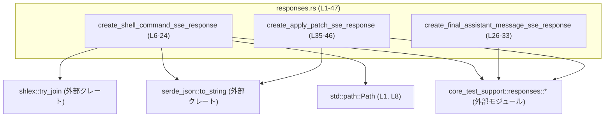
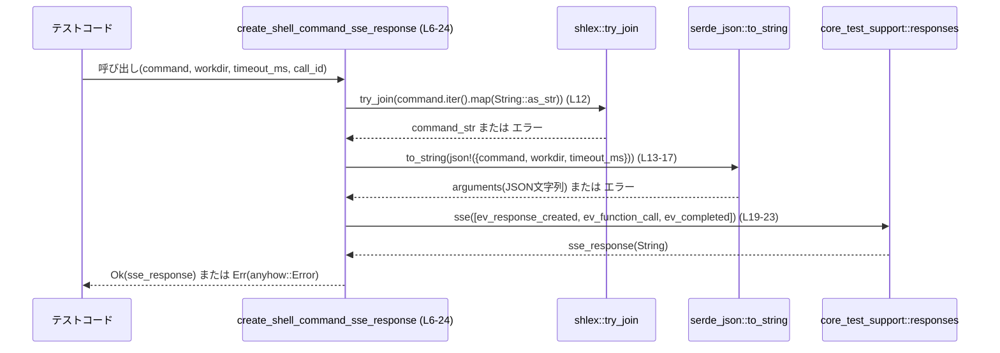
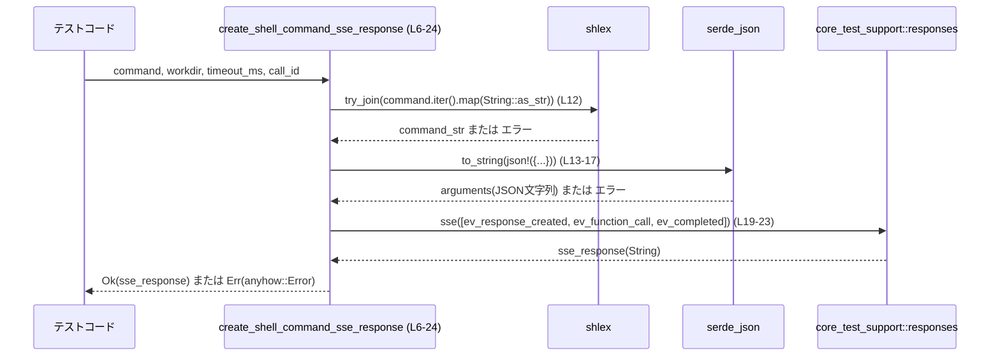

# mcp-server/tests/common/responses.rs

## 0. ざっくり一言

`core_test_support::responses` を用いて、テストで使う **SSE(Server‑Sent Events) 形式のレスポンス文字列** を組み立てるユーティリティ関数を 3 つ公開しているモジュールです（根拠: mcp-server/tests/common/responses.rs:L6-24, L26-33, L35-46）。

---

## 1. このモジュールの役割

### 1.1 概要

- このモジュールは、SSE を用いたやり取りを行うコードのテストで、**決まったパターンの SSE レスポンス文字列を簡単に生成する**ための補助関数を提供します。
- 具体的には、シェルコマンド実行要求、パッチ適用要求、および最終アシスタントメッセージ送信用の SSE レスポンスを `String` として構築します（根拠: L6-24, L26-33, L35-46）。

### 1.2 アーキテクチャ内での位置づけ

- `std::path::Path` を使ってワーキングディレクトリを扱います（根拠: L1, L8）。
- JSON 形式の引数文字列を `serde_json` で構築します（根拠: L3-4, L13-17, L40）。
- シェルコマンド用の 1 行文字列を `shlex::try_join` で組み立てます（根拠: L12）。
- 最終的な SSE レスポンス文字列は `core_test_support::responses` モジュールのユーティリティ (`sse`, `ev_response_created`, `ev_function_call`, `ev_assistant_message`, `ev_completed`) に委譲しています（根拠: L19-23, L28-32, L42-45）。



> `core_test_support::responses` の中身はこのチャンクには現れません。名前から SSE イベント構築用のヘルパと推測できますが、詳細なフォーマットや型は不明です。

### 1.3 設計上のポイント

- **純粋な関数**  
  - 3 つの関数はいずれも引数だけから `String` を生成し、副作用（I/O・グローバル状態の変更）は行っていません（根拠: L6-24, L26-33, L35-46）。
- **エラー処理**  
  - JSON 変換やコマンド結合で発生し得るエラーを `anyhow::Result<String>` として呼び出し元に返します（根拠: 3 関数すべての戻り値型, L11, L26, L38）。
- **状態を持たないユーティリティ**  
  - 構造体や静的変数は定義されておらず、状態を保持しません（根拠: ファイル全体に struct/enum/static/const 定義がない）。
- **SSE イベントシーケンスのパターン化**  
  - いずれも `response_created → (function_call or assistant_message) → completed` という 3 ステップの SSE イベント列を生成します（根拠: L19-23, L28-32, L42-45）。

---

## 2. 主要な機能一覧

- `create_shell_command_sse_response`: 任意のシェルコマンド（トークン列 + オプション情報）を実行するための SSE レスポンスを生成する。
- `create_final_assistant_message_sse_response`: 最終的なアシスタントメッセージを 1 回送信して完了する SSE レスポンスを生成する。
- `create_apply_patch_sse_response`: パッチ内容を `apply_patch` シェルコマンドのヒアドキュメントとして送る SSE レスポンスを生成する。

---

## 3. 公開 API と詳細解説

### 3.1 型・関数一覧（コンポーネントインベントリー）

このファイル内で **新しい型（構造体・列挙体など）は定義されていません**。

公開関数の一覧を示します。

| 名前 | 種別 | 役割 / 用途 | 定義位置 |
|------|------|-------------|----------|
| `create_shell_command_sse_response` | 関数 | シェルコマンド実行用の SSE レスポンス文字列を生成する | `mcp-server/tests/common/responses.rs:L6-24` |
| `create_final_assistant_message_sse_response` | 関数 | 最終アシスタントメッセージ送信用の SSE レスポンス文字列を生成する | `mcp-server/tests/common/responses.rs:L26-33` |
| `create_apply_patch_sse_response` | 関数 | パッチ適用のための `apply_patch` シェルコマンド SSE レスポンス文字列を生成する | `mcp-server/tests/common/responses.rs:L35-46` |

---

### 3.2 関数詳細

#### `create_shell_command_sse_response(command: Vec<String>, workdir: Option<&Path>, timeout_ms: Option<u64>, call_id: &str) -> anyhow::Result<String>`

**概要**

- シェルコマンドのトークン列とオプション情報から JSON 文字列を構築し、それを引数とする `shell_command` 関数呼び出しの SSE レスポンス文字列を生成します（根拠: L12-23）。

**引数**

| 引数名 | 型 | 説明 |
|--------|----|------|
| `command` | `Vec<String>` | シェルコマンドとその引数を表すトークン列（例: `["ls", "-la"]`）。`shlex::try_join` で 1 行のコマンド文字列に結合されます（L7, L12）。 |
| `workdir` | `Option<&Path>` | コマンドを実行するワーキングディレクトリ。`Some` の場合 `to_string_lossy` で文字列化され、JSON に含まれます（L8, L15）。 |
| `timeout_ms` | `Option<u64>` | タイムアウトミリ秒。`Some` の場合はその値、`None` の場合は JSON 上で `null` になると想定されます（L9, L16）。 |
| `call_id` | `&str` | 呼び出しの識別子。`resp-{call_id}` というレスポンス ID 文字列の生成と、`ev_function_call` の ID に使用されます（L10, L18, L21）。 |

**戻り値**

- `Ok(String)`  
  - `core_test_support::responses::sse` によって構築された SSE レスポンス文字列（根拠: L19-23）。
- `Err(anyhow::Error)`  
  - コマンド結合または JSON 変換に失敗した場合のエラーがラップされて返されます（根拠: `?` 演算子, L12, L17）。

**内部処理の流れ**

1. `command.iter().map(String::as_str)` で `Vec<String>` から `Iterator<Item=&str>` を作成し、`shlex::try_join` で 1 本のコマンド文字列 `command_str` に結合します（L12）。
2. `serde_json::json!` マクロで次のフィールドを持つ一時 JSON 値を作ります（L13-17）。
   - `"command"`: 上記の `command_str`（L14）。
   - `"workdir"`: `workdir.map(|w| w.to_string_lossy())` の結果（`None` または 文字列）（L15）。
   - `"timeout_ms"`: `timeout_ms`（Option<u64>）（L16）。
3. その JSON 値を `serde_json::to_string` で JSON 文字列 `arguments` に変換します（L13, L17）。
4. `format!("resp-{call_id}")` でレスポンス ID 文字列 `response_id` を作成します（L18）。
5. `responses::ev_response_created`, `responses::ev_function_call`, `responses::ev_completed` の 3 つのイベントを `Vec` に詰め、それを `responses::sse` に渡して SSE レスポンス文字列を生成します（L19-23）。
6. 生成された文字列を `Ok(...)` で呼び出し元へ返します（L19-23）。

**Mermaid フロー図**



**Examples（使用例）**

```rust
use std::path::Path;
use mcp_server::tests::common::responses::create_shell_command_sse_response;

fn build_example_sse() -> anyhow::Result<String> {
    // "ls -la /tmp" を実行するシェルコマンドを表すトークン列
    let command = vec!["ls".to_string(), "-la".to_string(), "/tmp".to_string()];

    // ワーキングディレクトリを指定（例: "/home/user"）
    let workdir = Some(Path::new("/home/user"));

    // タイムアウト 5 秒
    let timeout_ms = Some(5000);

    // コール ID
    let call_id = "call-123";

    // SSE レスポンス文字列を生成
    let sse = create_shell_command_sse_response(command, workdir, timeout_ms, call_id)?;
    // sse には response_created → function_call(shell_command) → completed のイベント列が入る

    Ok(sse)
}
```

**Errors / Panics**

- エラー (`Err`) になる条件
  - `shlex::try_join` がエラーを返した場合（根拠: `?` 演算子, L12）。  
    - 具体的なエラー条件（例: 無効な文字列など）は `shlex` クレートの仕様に依存し、このチャンクからは分かりません。
  - `serde_json::to_string` がエラーを返した場合（根拠: `?` 演算子, L13-17）。  
    - 与えている値はいずれも `serde` で通常シリアライズ可能な型ですが、それでも理論上は I/O エラー等で失敗し得ます。
- パニック
  - この関数内では `unwrap` や `panic!` などは使われておらず、標準的な使用ではパニックするコードは含まれていません（根拠: 関数本体, L11-23）。

**Edge cases（エッジケース）**

- `command` が空ベクタの場合
  - `shlex::try_join` がどのような文字列を返すか（空文字かどうか）はこのチャンクからは分かりません（根拠: 外部クレート関数）。
- `workdir` が `None` の場合
  - JSON 内の `"workdir"` フィールドは `null` になると考えられますが、正確な表現は `serde_json` のシリアライズ仕様に依存します（根拠: `Option` をそのまま json! に渡している, L15）。
- `timeout_ms` が `None` の場合
  - 同様に `"timeout_ms"` が `null` になると考えられます（根拠: L16）。
- `call_id` が空文字列の場合
  - `response_id` は `"resp-"` という文字列になります（根拠: `format!("resp-{call_id}")`, L18）。  
    それ以外の処理は通常通りです。

**使用上の注意点**

- エラー伝播
  - `anyhow::Result` を返すため、呼び出し側は `?` で伝播するか、明示的に `match` などでハンドリングする必要があります。
- シェルコマンドの安全性
  - この関数は **テスト用の SSE 文字列を組み立てるだけであり、実際にシェルを実行するわけではありません**。  
    ただし、SSE を受け取る側がそのままシェルを実行する設計になっている場合、`command` の内容次第で実行されるコマンドが変わるため、入力の安全性は別途考慮する必要があります（これはこのモジュールの外側の設計の問題です）。

---

#### `create_final_assistant_message_sse_response(message: &str) -> anyhow::Result<String>`

**概要**

- 最終的なアシスタントメッセージを 1 回送信し、そのレスポンスを完了させる SSE レスポンス文字列を生成します（根拠: L26-32）。

**引数**

| 引数名 | 型 | 説明 |
|--------|----|------|
| `message` | `&str` | 最終アシスタントメッセージの本文（L26, L30）。 |

**戻り値**

- `Ok(String)`  
  - `response_id = "resp-final"` と固定のレスポンス ID を使った SSE レスポンス文字列（根拠: L27-32）。
- `Err(anyhow::Error)`  
  - 関数内には `?` を伴う呼び出しがなく、現状のコードでは `Err` になる経路はありません（根拠: L26-32）。

**内部処理の流れ**

1. `response_id` を `"resp-final"` という固定文字列に設定します（L27）。
2. `responses::ev_response_created(response_id)` を最初のイベントとして作成します（L29）。
3. `responses::ev_assistant_message("msg-final", message)` でメッセージ ID `"msg-final"` と本文を含むイベントを作成します（L30）。
4. `responses::ev_completed(response_id)` で完了イベントを作成します（L31）。
5. 上記 3 つのイベントを `Vec` に詰めて `responses::sse` に渡し、SSE レスポンス文字列を生成して `Ok(...)` で返します（L28-32）。

**Examples（使用例）**

```rust
use mcp_server::tests::common::responses::create_final_assistant_message_sse_response;

fn build_final_message_sse() -> anyhow::Result<String> {
    let msg = "完了しました。これ以上の操作は不要です。";

    // 最終メッセージ用 SSE レスポンスを生成
    let sse = create_final_assistant_message_sse_response(msg)?;

    // sse には "resp-final" を ID とする response_created → assistant_message → completed イベント列が含まれる
    Ok(sse)
}
```

**Errors / Panics**

- この関数内では結果を返さない可能性のある処理（`Result`/`Option` の `?` や `unwrap` など）が存在しないため、現在の実装の範囲では `Err` やパニックは発生しません（根拠: L26-32）。

**Edge cases（エッジケース）**

- `message` が空文字列の場合
  - そのまま `ev_assistant_message` に渡されます（根拠: L30）。受け取る側が空メッセージをどのように扱うかは不明です。
- 同一ストリーム内で複数回呼ぶ場合
  - `response_id` とメッセージ ID がどちらも固定値であるため（L27, L30）、複数のレスポンスを区別する前提にはなっていません。  
    テスト用ユーティリティとして「単一の最終レスポンス」を想定している実装と解釈できます。

**使用上の注意点**

- この関数は「最終メッセージ」として使われることを想定しており、ID が固定であるため、複数の同種レスポンスを区別したいテストケースには適しません。
- メッセージ本文 `message` の長さや内容に制限はありませんが、受信側の仕様に依存した制約があり得ます（このモジュールからは不明です）。

---

#### `create_apply_patch_sse_response(patch_content: &str, call_id: &str) -> anyhow::Result<String>`

**概要**

- `patch_content` を `apply_patch <<'EOF' ... EOF` 形式のヒアドキュメントを用いるシェルコマンドとして 1 行の文字列にまとめ、そのコマンドを `shell_command` 関数経由で実行するための SSE レスポンス文字列を生成します（根拠: L39-45）。

**引数**

| 引数名 | 型 | 説明 |
|--------|----|------|
| `patch_content` | `&str` | 適用したいパッチの内容。ヒアドキュメントの中身としてそのまま埋め込まれます（L36, L39）。 |
| `call_id` | `&str` | 呼び出しの識別子。`resp-{call_id}` というレスポンス ID と、`ev_function_call` の ID に使用されます（L37, L41, L44）。 |

**戻り値**

- `Ok(String)`  
  - `shell_command` 関数の呼び出しイベントを含む SSE レスポンス文字列（根拠: L42-45）。
- `Err(anyhow::Error)`  
  - JSON 変換に失敗した場合などのエラー（根拠: `?` 演算子, L40）。

**内部処理の流れ**

1. `format!("apply_patch <<'EOF'\n{patch_content}\nEOF")` で、`apply_patch` ヒアドキュメント形式のシェルコマンド文字列を構築します（L39）。
2. `serde_json::json!({ "command": command })` で `"command"` フィールドのみを持つ JSON 値を作り、それを `serde_json::to_string` で JSON 文字列 `arguments` に変換します（L40）。
3. `format!("resp-{call_id}")` でレスポンス ID 文字列 `response_id` を生成します（L41）。
4. `responses::ev_response_created(&response_id)`, `responses::ev_function_call(call_id, "shell_command", &arguments)`, `responses::ev_completed(&response_id)` の 3 イベントを `responses::sse` に渡して SSE レスポンス文字列を生成します（L42-45）。
5. 生成した文字列を `Ok(...)` で返します（L42-45）。

**Examples（使用例）**

```rust
use mcp_server::tests::common::responses::create_apply_patch_sse_response;

fn build_apply_patch_sse() -> anyhow::Result<String> {
    // 適用したい diff/patch の内容（例）
    let patch = "\
diff --git a/file.txt b/file.txt
index e69de29..4b825dc 100644
--- a/file.txt
+++ b/file.txt
@@ -0,0 +1,2 @@
+hello
+world
";

    let call_id = "patch-001";

    // apply_patch コマンドを実行する SSE レスポンスを生成
    let sse = create_apply_patch_sse_response(patch, call_id)?;

    // sse には shell_command("apply_patch <<'EOF' ... EOF") を呼び出すイベント列が含まれる
    Ok(sse)
}
```

**Errors / Panics**

- エラー (`Err`) になる条件
  - `serde_json::to_string` がエラーを返した場合（根拠: `?` 演算子, L40）。
- パニック
  - この関数内にはパニックを明示的に起こすコードはありません（根拠: L38-46）。

**Edge cases（エッジケース）**

- `patch_content` に `EOF` という行が含まれる場合
  - 生成されるシェルコマンド文字列は  
    `apply_patch <<'EOF'\n{patch_content}\nEOF` となるため（L39）、実際のシェル解釈では途中でヒアドキュメントが終了してしまう可能性があります。  
    この点はコマンドを解釈する側（シェルなど）の仕様によるもので、この関数は無加工で `patch_content` を埋め込む設計になっています。
- `call_id` が空文字列の場合
  - `response_id` が `"resp-"` となる点は `create_shell_command_sse_response` と同様です（根拠: L41）。

**使用上の注意点**

- `patch_content` はシェルに渡される文字列の一部になる前提の設計です。  
  実運用で使う場合、パッチ内容内のヒアドキュメント終端文字列（今回は `EOF`）に注意が必要です。
- この関数も `anyhow::Result` を返すため、呼び出し側でエラー処理が必要です。

---

### 3.3 その他の関数

- このファイルには補助的な非公開関数は定義されていません。

---

## 4. データフロー

代表的な処理として、`create_shell_command_sse_response` を用いてテストコードが SSE レスポンス文字列を生成する流れを示します。

1. テストコードが、コマンド・ワーキングディレクトリ・タイムアウト・コール ID を用意して `create_shell_command_sse_response` を呼び出します（L6-10）。
2. 関数内でシェルコマンド文字列と JSON 引数文字列が作られます（L12-17）。
3. SSE イベント列が `core_test_support::responses` で構築され、1 本の SSE レスポンス文字列になります（L19-23）。
4. 完成した文字列が `Ok(String)` としてテストコードへ戻ります（L19-23）。



他の 2 関数も同様に、「入力パラメータ → JSON/文字列構築 → `responses::sse` 呼び出し → `String` 戻り値」という同じデータフローを持ちます（根拠: L26-33, L35-46）。

---

## 5. 使い方（How to Use）

### 5.1 基本的な使用方法

テストコードからの典型的な利用パターンは次のようになります。

```rust
use std::path::Path;
use anyhow::Result;
use mcp_server::tests::common::responses::{
    create_shell_command_sse_response,
    create_final_assistant_message_sse_response,
    create_apply_patch_sse_response,
};

fn build_sse_examples() -> Result<()> {
    // 1. シェルコマンド実行 SSE
    let cmd = vec!["ls".into(), "-la".into()];
    let shell_sse = create_shell_command_sse_response(
        cmd,
        Some(Path::new("/tmp")),
        Some(5_000),
        "call-1",
    )?;
    // shell_sse: shell_command を呼び出す SSE レスポンス文字列

    // 2. 最終アシスタントメッセージ SSE
    let final_sse = create_final_assistant_message_sse_response("処理が完了しました。")?;
    // final_sse: resp-final を ID とする最終メッセージ SSE

    // 3. パッチ適用 SSE
    let patch = "diff --git ..."; // パッチ内容
    let patch_sse = create_apply_patch_sse_response(patch, "call-2")?;
    // patch_sse: apply_patch ヒアドキュメントコマンドを shell_command で実行する SSE

    // これらの SSE 文字列をテスト対象のサーバに流し込み、
    // 期待通りに処理されるかを検証する、といった使い方が想定されます。

    Ok(())
}
```

### 5.2 よくある使用パターン

- **単一コマンドの検証**
  - `create_shell_command_sse_response` で 1 つのシェルコマンド呼び出しを表す SSE を作り、そのレスポンス処理ロジックをテストする。
- **コード修正フローの検証**
  - `create_apply_patch_sse_response` でパッチ適用 SSE を送り、その後 `create_shell_command_sse_response` でテスト実行コマンドを送る、といったシナリオを構成する。
- **会話の終了確認**
  - `create_final_assistant_message_sse_response` を使い、クライアント側が「最終メッセージ」で対話を終えるロジックをテストする。

### 5.3 よくある間違い（想定されるもの）

このファイル単体から使用ミスの頻度は分かりませんが、コードから想定される誤用例を挙げます。

```rust
// 例: Result を無視してしまう
fn wrong_usage() {
    // エラー発生時に気づけない
    let _ = create_shell_command_sse_response(
        vec!["ls".into()],
        None,
        None,
        "call-1",
    );
}

// 正しい例: エラー処理を行う
fn correct_usage() -> anyhow::Result<()> {
    let sse = create_shell_command_sse_response(
        vec!["ls".into()],
        None,
        None,
        "call-1",
    )?;
    // sse をテスト対象に渡して検証する
    Ok(())
}
```

### 5.4 使用上の注意点（まとめ）

- 3 関数とも `anyhow::Result<String>` を返すため、**エラー処理を忘れない**ことが前提です。
- 関数はスレッドセーフな純粋関数の形になっており、**複数スレッドから同時に呼び出しても、このファイル内のコードに限れば競合状態はありません**（根拠: 共有状態・可変静的変数が存在しない）。
- 生成される SSE のフォーマットやイベント名・フィールド名は `core_test_support::responses` に依存しており、このファイルからは詳細が分かりません。テストの期待値を設定する際は、そのモジュール側の仕様に合わせる必要があります。

---

## 6. 変更の仕方（How to Modify）

### 6.1 新しい機能を追加する場合

「別の種類の SSE レスポンス」を追加したい場合の典型的な手順です。

1. **新しいユーティリティ関数を追加**
   - 本ファイルに `pub fn create_xxx_sse_response(...) -> anyhow::Result<String>` という形で関数を追加します。
2. **引数の設計**
   - 必要な情報（コマンド名・メッセージ内容・追加メタデータなど）を引数で受け取り、`serde_json::json!` などで JSON に組み立てます（既存関数の L13-17, L40 を参考にする）。
3. **SSE イベント列の構築**
   - `responses::ev_response_created`, `responses::ev_function_call`, `responses::ev_assistant_message`, `responses::ev_completed` など、既存のパターンを踏襲してイベント列を組みます（L19-23, L28-32, L42-45）。
4. **テスト側で利用**
   - 新しいユーティリティ関数をテストコードから呼び、期待される動作を検証します。

### 6.2 既存の機能を変更する場合

- **影響範囲の確認**
  - `ripgrep` などで `create_shell_command_sse_response` 等の関数名を検索し、どのテストから呼ばれているかを確認します。
- **契約の確認**
  - 特に JSON のフィールド名・型（`"command"`, `"workdir"`, `"timeout_ms"`）や SSE イベントの順序はテストコードやサーバ実装に依存している可能性が高いため、変更前に期待仕様を確認する必要があります（根拠: L13-17, L40, L19-23, L28-32, L42-45）。
- **変更時の注意**
  - 返り値の型 `anyhow::Result<String>` を変えると広範囲に影響するため、テスト全体の修正が必要になります。
  - `call_id` や `response_id` の形式を変える場合も、ID をキーにしているテスト/コードがないか確認する必要があります。

---

## 7. 関連ファイル

このモジュールと密接に関係するコンポーネント（このチャンクから分かる範囲）を列挙します。

| パス / モジュール | 役割 / 関係 |
|-------------------|------------|
| `core_test_support::responses` | `sse`, `ev_response_created`, `ev_function_call`, `ev_assistant_message`, `ev_completed` を提供するモジュール。SSE イベント列から最終的なレスポンス文字列を構築する役割を担っていると推測されます（根拠: L3, L19-23, L28-32, L42-45）。具体的な実装はこのチャンクには現れません。 |
| `serde_json` クレート | JSON の構築 (`json!` マクロ) とシリアライズ (`to_string`) に使用されています（根拠: L3-4, L13-17, L40）。 |
| `shlex` クレート | シェルコマンドのトークン列から 1 行のコマンド文字列を生成するために使われています（根拠: L12）。 |
| `std::path::Path` | ワーキングディレクトリ `workdir` を OS 依存のパスとして扱うために使用されています（根拠: L1, L8）。 |

このチャンクには、これらのユーティリティを実際に利用するテストコード（例: `tests/*.rs`）は含まれていないため、どのような具体的シナリオで使われているかは不明です。
