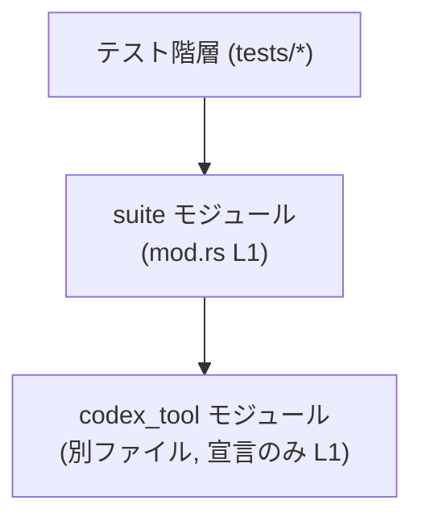

# mcp-server/tests/suite/mod.rs

## 0. ざっくり一言

このファイルは、`codex_tool` というサブモジュールをコンパイル対象として登録するための、テスト用モジュールの入口となるファイルです（根拠: `mcp-server/tests/suite/mod.rs:L1-1`）。

---

## 1. このモジュールの役割

### 1.1 概要

- このモジュールは、Rust の `mod` 宣言を通じて `codex_tool` サブモジュールを宣言しています（根拠: `mcp-server/tests/suite/mod.rs:L1-1`）。
- 実際のテストロジックやコア処理は `codex_tool` モジュール側のファイルに実装されていると考えられますが、このチャンクにはその中身は現れていません。

### 1.2 アーキテクチャ内での位置づけ

`tests/suite` というパスから、このモジュールはテスト用クレート／モジュール階層の一部と考えられます。`mod codex_tool;` により、`codex_tool` モジュールがこの階層の下にぶら下がる構造になります（根拠: `mcp-server/tests/suite/mod.rs:L1-1`）。



※ `codex_tool` の実体ファイルは Rust のモジュール規則に従う別ファイル（例: `tests/suite/codex_tool.rs` など）に存在する必要がありますが、このチャンクから実ファイルパスは特定できません。

### 1.3 設計上のポイント

- 責務の分割:  
  - このファイルはサブモジュールを「登録」するだけで、テストやビジネスロジックは持ちません（根拠: `mcp-server/tests/suite/mod.rs:L1-1`）。
- 状態管理:  
  - グローバル状態や構造体・変数の定義はなく、状態を持たないモジュールです。
- エラーハンドリング:  
  - 実行時ロジックがないため、このファイル単体としてはエラーハンドリングやパニックの発生はありません。コンパイルエラーの可能性のみが問題になります（例: 対応する `codex_tool` ファイルが存在しない場合）。

---

## 2. 主要な機能一覧

このファイルが提供する機能は、サブモジュールの宣言のみです。

- `codex_tool` サブモジュールの宣言とコンパイル対象への追加（根拠: `mcp-server/tests/suite/mod.rs:L1-1`）

### コンポーネントインベントリー（このファイル内）

| 種別             | 名前          | 定義位置                                   | 説明 |
|------------------|---------------|--------------------------------------------|------|
| モジュール宣言   | `codex_tool`  | `mcp-server/tests/suite/mod.rs:L1-1`       | テスト用と思われるサブモジュール。実装は別ファイルに存在する必要があります |

---

## 3. 公開 API と詳細解説

### 3.1 型一覧（構造体・列挙体など）

このファイル内には、構造体・列挙体・型エイリアスなどの型定義は存在しません（根拠: `mcp-server/tests/suite/mod.rs:L1-1`）。

### 3.2 関数詳細（最大 7 件）

このファイルには関数・メソッド定義は存在しません（根拠: `mcp-server/tests/suite/mod.rs:L1-1`）。  
代わりに、唯一の構文要素であるモジュール宣言 `mod codex_tool;` の意味を詳しく説明します。

#### モジュール宣言 `mod codex_tool;`

**概要**

- Rust の `mod` 宣言を使い、`codex_tool` という名前のサブモジュールを現在のモジュール直下に追加します（根拠: `mcp-server/tests/suite/mod.rs:L1-1`）。
- 実装は別ファイルに書かれ、その内容がこのモジュールの一部としてコンパイルされます。

**引数 / 戻り値**

- `mod` 宣言は関数ではないため、引数や戻り値はありません。
- コンパイル時に静的に解決される言語構文です。

**内部処理の流れ（コンパイル時の挙動）**

コンパイラ視点での処理（一般的な Rust の挙動）を示します。

1. コンパイラが `mod codex_tool;` 行を読み取る（根拠: `mcp-server/tests/suite/mod.rs:L1-1`）。
2. Rust のモジュール検索規則に従って、同じディレクトリ内の `codex_tool.rs` または `codex_tool/mod.rs` など、対応するファイルを探索します。
3. 対応するファイルが見つかれば、そのファイルを `codex_tool` モジュールとして現在のモジュール階層に組み込みます。
4. 以降、このモジュール階層内の他のコードから `codex_tool::...` という形で、中のアイテム（テスト関数など）を参照できるようになります。

**Examples（使用例）**

以下は、一般的な Rust のテストモジュール構成の例です。このリポジトリの実コードではなく、`mod codex_tool;` の使い方イメージを示すためのサンプルです。

```rust
// tests/suite/mod.rs
mod codex_tool; // サブモジュールを宣言する

// tests/suite/codex_tool.rs
#[test]                                         // テスト関数を宣言
fn test_something() {                           // テストの本体
    assert_eq!(2 + 2, 4);                      // 簡単なアサーション
}
```

このように、`mod codex_tool;` によって `codex_tool` モジュールのテスト関数がコンパイル対象となり、`cargo test` で実行されます。

**Errors / Panics**

- コンパイルエラーの可能性:
  - 対応する `codex_tool` モジュールファイルが存在しない場合、コンパイル時に「モジュールが見つからない」旨のエラーが発生します。
- ランタイムの `panic!`:
  - このファイルには実行されるコードはないため、このファイル起因での `panic!` は発生しません。

**Edge cases（エッジケース）**

- 対応ファイルが存在しない場合:
  - すでに述べた通り、コンパイルエラーになります。
- 複数の候補ファイルが存在する場合:
  - Rust の通常のモジュール規則では、同一モジュール名に対して複数の候補ファイルを用意することは想定されていません。一般的にはビルド設定やファイル構成の誤りとして扱われます。
- `codex_tool` 内のテストが全く存在しない場合:
  - `mod codex_tool;` 自体はコンパイルされますが、テストがないためテスト実行時に特に何も行われないサブモジュールになります。

**使用上の注意点**

- 対応するモジュールファイルの配置:
  - Rust のモジュール規則に従った位置に `codex_tool` の実装ファイルを必ず配置する必要があります。
- 可視性（visibility）:
  - `mod codex_tool;` は `pub` ではないため、このモジュール階層の外（例えば別クレート）から `codex_tool` を直接参照することはできません。ただし、テスト用のモジュール階層では通常これで問題ありません。
- 安全性・並行性:
  - このファイルは実行時ロジックや状態を持たないため、メモリ安全性・スレッド安全性・並行実行に関する懸念はありません。これらは `codex_tool` モジュール側の実装に依存します。

### 3.3 その他の関数

- このファイルには補助関数・ラッパー関数なども含め、いかなる関数定義も存在しません（根拠: `mcp-server/tests/suite/mod.rs:L1-1`）。

---

## 4. データフロー

このファイルには実行時の「データ処理」は存在しませんが、テスト実行時の「モジュール読み込みフロー」という観点での流れを示します。

- テスト実行コマンド（例: `cargo test`）がテストクレート全体をコンパイルします。
- コンパイラは `tests/suite/mod.rs` を読み込み、`mod codex_tool;` 宣言を解釈します（根拠: `mcp-server/tests/suite/mod.rs:L1-1`）。
- 対応する `codex_tool` モジュールファイルを読み込み、その中に定義されたテスト関数や補助コードをコンパイルに含めます。

```mermaid
sequenceDiagram
    participant H as テストハーネス\n(cargo test)
    participant T as テストクレート\n(tests/*)
    participant S as suite モジュール\n(mod.rs L1)
    participant M as codex_tool モジュール\n(別ファイル)

    H->>T: テスト用コードをコンパイル
    T->>S: `tests/suite/mod.rs` を読み込み (L1)
    S->>M: `mod codex_tool;` でサブモジュールを読み込み
    H->>M: M 内のテスト関数を実行
```

※ `M` 内の具体的なデータフロー・エラーハンドリング・並行性などは、このチャンクには現れていません。

---

## 5. 使い方（How to Use）

### 5.1 基本的な使用方法

Rust の一般的なテスト構成に従う場合、このファイルは「テストスイートのモジュールツリーの起点」として使われます。

- `tests/suite/mod.rs` に `mod codex_tool;` を書く。
- 同じディレクトリに `codex_tool` の実装ファイルを用意し、その中に `#[test]` 関数などを定義する。

一般例を示します（このリポジトリの実際の中身ではなく、パターン説明用のコードです）。

```rust
// tests/suite/mod.rs
mod codex_tool; // このファイルと同じ構文（根拠: mod.rs:L1-1）

// tests/suite/codex_tool.rs
#[test]                                         // テストとしてマーク
fn codex_tool_behaves_correctly() {             // テスト関数の定義
    // ここに codex_tool 関連のテストロジックを書く
    assert!(true);                              // ダミーのアサーション
}
```

### 5.2 よくある使用パターン

- **複数のテストモジュールをまとめるパターン**

  複数のテストモジュールをまとめたい場合、同じ `mod` 宣言を追加していく形になります。

  ```rust
  // tests/suite/mod.rs
  mod codex_tool;       // 既存のサブモジュール
  mod another_tool;     // 新しいサブモジュールを追加
  ```

  それぞれに対応するファイル（例: `codex_tool.rs`, `another_tool.rs`）を作成します。

### 5.3 よくある間違い

```rust
// 間違い例: 対応するファイルを用意していない
mod codex_tool; // tests/suite/codex_tool.rs などが存在しないとコンパイルエラーになる

// 正しい例: 対応するファイルを用意する
mod codex_tool; // tests/suite/codex_tool.rs が存在し、そこでテストを定義
```

### 5.4 使用上の注意点（まとめ）

- このファイル自体には実行ロジックがないため、バグやセキュリティ問題は主に `codex_tool` 側に依存します。
- コンパイルを成功させるためには、`codex_tool` に対応するファイルを Rust のモジュール規則に従って配置する必要があります。
- 並行性・パフォーマンス・エラーハンドリングに関する考慮事項は、このモジュールではなく `codex_tool` の実装側で発生します。

---

## 6. 変更の仕方（How to Modify）

### 6.1 新しい機能を追加する場合

ここでの「機能」はテストモジュールの追加を指します。

1. `tests/suite` ディレクトリに新しいテストモジュールファイル（例: `new_feature.rs`）を作成する。
2. `tests/suite/mod.rs` に `mod new_feature;` を追加する。
3. `new_feature.rs` に `#[test]` 関数などを定義してテストロジックを書く。

このファイルで行う変更は、基本的に「`mod ...;` 行を1行追加する」だけです。

### 6.2 既存の機能を変更する場合

- `codex_tool` モジュール内のテストロジックや補助関数を変更したい場合は、対応する `codex_tool` の実装ファイルを直接編集する必要があります。
- この `mod.rs` 側での変更は、通常は以下のようなケースに限られます。
  - 不要になったサブモジュールの削除（`mod` 行を消す）。
  - モジュール名のリネームに伴う `mod` 行の変更。

変更時の注意点:

- `mod` 行を削除すると、そのサブモジュール内のテストはコンパイル・実行されなくなります。
- モジュール名を変更する場合は、対応するファイル名も合わせて変更しないとコンパイルエラーになります。

---

## 7. 関連ファイル

このチャンクから確定できるのは、`codex_tool` という名前のモジュールが別ファイルに存在する必要がある、という点だけです。

| パス（候補）                               | 役割 / 関係 |
|-------------------------------------------|------------|
| `mcp-server/tests/suite/codex_tool.rs` など | `mod codex_tool;` で読み込まれるサブモジュールの実体ファイル。具体的なパスは Rust のモジュール規則に従いますが、このチャンクから実在は確認できません。 |

---

### Bugs / Security / Contracts / Edge Cases（このファイルに関して）

- **Bugs**:
  - 対応する `codex_tool` ファイルが存在しない、あるいは誤った場所にある場合にコンパイルエラーとなる可能性があります。
- **Security**:
  - 実行ロジックや I/O を行わないため、このファイル単体でのセキュリティリスクはありません。
- **Contracts（契約 / 前提条件）**:
  - `mod codex_tool;` の契約は、「Rust のモジュール規則に従う場所に `codex_tool` 実装ファイルが存在すること」です。
- **Edge Cases**:
  - `codex_tool` が空ファイル（何も定義されていない）でもコンパイル自体は通りますが、テストは実質的に追加されません。
  - 将来 `pub mod codex_tool;` などに変更する場合は、公開範囲（可視性）が変わる点に注意が必要です。
