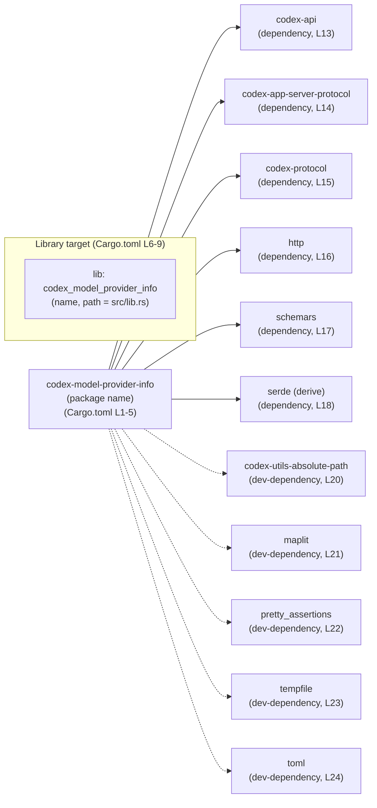
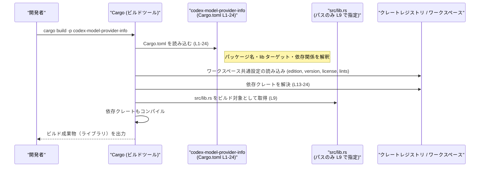

# model-provider-info/Cargo.toml

## 0. ざっくり一言

`codex-model-provider-info` クレートの **Cargo マニフェスト（パッケージ定義と依存関係定義）** を行うファイルです（Cargo.toml:L1-L24）。

---

## 1. このモジュールの役割

### 1.1 概要

- このファイルは、Rust クレート `codex-model-provider-info` の
  - パッケージ名・バージョン・edition・license の参照（ワークスペース共有）  
  - ライブラリターゲットの名前とエントリポイント（`src/lib.rs`）  
  - 依存クレート・開発用依存クレート  
  を定義する役割を持ちます（Cargo.toml:L1-L24）。
- 実際の公開 API やロジックは `src/lib.rs` 側にあり、このチャンクには現れません（Cargo.toml:L9）。

### 1.2 アーキテクチャ内での位置づけ

Cargo レベルで見ると、「`codex-model-provider-info` クレート」と、その依存関係の構造は次のようになります。



- `codex-model-provider-info` パッケージが 1 つのライブラリターゲット（`codex_model_provider_info`）を持つ構成であることがわかります（Cargo.toml:L6-L9）。
- すべての依存クレートは `workspace = true` で指定されており、バージョンなどの詳細はワークスペースルート側で管理されます（Cargo.toml:L13-L24）。

### 1.3 設計上のポイント（このファイルから読み取れる範囲）

- **ワークスペース前提のパッケージ**  
  - edition・license・version はワークスペース共通設定を利用しています（Cargo.toml:L2-L3, L5）。
- **ライブラリクレートとして定義**  
  - `[lib]` セクションがあり、`bin` ターゲットは定義されていません（Cargo.toml:L6-L9）。
  - ライブラリ名は `codex_model_provider_info`、エントリポイントは `src/lib.rs` です（Cargo.toml:L8-L9）。
- **doctest 無効化**  
  - `doctest = false` により、ドキュメントコメント中のテストは実行されません（Cargo.toml:L7）。
- **lints 設定もワークスペース側に委譲**  
  - `[lints] workspace = true` により、コンパイラ/ツールの lint 設定はワークスペース共通となります（Cargo.toml:L10-L11）。
- **依存関係・開発依存はすべてワークスペース管理**  
  - `[dependencies]` と `[dev-dependencies]` のすべての行で `workspace = true` が指定されています（Cargo.toml:L13-L24）。
  - バージョン固定や features の詳細（`serde` の `"derive"` を除く）はこのファイルには現れません（Cargo.toml:L18を除き）。

---

## 2. 主要な機能一覧（このファイルに関するもの）

このファイルはコードではないため「関数」や「メソッド」は定義していませんが、Cargo 設定として次の機能を提供します。

- パッケージ定義: `codex-model-provider-info` パッケージの基本情報を定義（Cargo.toml:L1-L5）。
- ライブラリターゲット定義: `codex_model_provider_info` ライブラリとそのパスを定義（Cargo.toml:L6-L9）。
- lint 設定の共有: lints 設定をワークスペースに委譲（Cargo.toml:L10-L11）。
- 実行時依存関係の宣言: 本番コードで使用するクレート群を宣言（Cargo.toml:L12-L18）。
- 開発時依存関係の宣言: テストや開発ユーティリティで使用するクレート群を宣言（Cargo.toml:L19-L24）。

### コンポーネントインベントリ（このファイル内）

| 名称 | 種別 | 定義箇所 | 役割 / 用途（このファイルから分かる範囲） |
|------|------|----------|-------------------------------------------|
| `codex-model-provider-info` | パッケージ名 | Cargo.toml:L1-L5 | このクレート全体のパッケージ名。バージョン・edition・license はワークスペース共有。 |
| `codex_model_provider_info` | ライブラリターゲット名 | Cargo.toml:L6-L9 | `src/lib.rs` をエントリポイントとするライブラリ。公開 API はそちらに定義。 |
| `codex-api` | 依存クレート | Cargo.toml:L13 | 本番コードで利用される依存クレート。用途はこのチャンクからは不明。 |
| `codex-app-server-protocol` | 依存クレート | Cargo.toml:L14 | 同上。用途はこのチャンクからは不明。 |
| `codex-protocol` | 依存クレート | Cargo.toml:L15 | 同上。用途はこのチャンクからは不明。 |
| `http` | 依存クレート | Cargo.toml:L16 | HTTP 関連の機能を提供するクレートと推測されますが、このクレート内での具体的な利用は不明です。 |
| `schemars` | 依存クレート | Cargo.toml:L17 | スキーマ関連の機能を提供すると考えられますが、利用方法はこのチャンクには現れません。 |
| `serde`（feature: `derive`） | 依存クレート | Cargo.toml:L18 | シリアライズ/デシリアライズと、その自動導出機能を利用するための依存。どの型で使われるかは不明。 |
| `codex-utils-absolute-path` | 開発依存クレート | Cargo.toml:L20 | テスト・開発用のユーティリティと推測されますが、具体的用途は不明。 |
| `maplit` | 開発依存クレート | Cargo.toml:L21 | マップやセットのリテラル用マクロ等を提供するクレートと推測されます。利用箇所は不明。 |
| `pretty_assertions` | 開発依存クレート | Cargo.toml:L22 | テストのアサーション出力を見やすくするためのクレートと推測されます。 |
| `tempfile` | 開発依存クレート | Cargo.toml:L23 | 一時ファイルを扱うためのクレートと推測されます。 |
| `toml` | 開発依存クレート | Cargo.toml:L24 | TOML フォーマットを扱うためのクレートと推測されます。 |

> 備考: 依存クレートの「用途」は一般的なクレートの説明に基づくものであり、**このプロジェクト内での具体的な使い方は、このチャンクからは分かりません**。

---

## 3. 公開 API と詳細解説

このファイルは Cargo の設定ファイルであり、関数・構造体・列挙体などの **実行時 API は一切定義していません**。

### 3.1 型一覧（構造体・列挙体など）

- 該当なし（型定義は `src/lib.rs` などソースコード側にあり、このチャンクには現れません）。

### 3.2 関数詳細（最大 7 件）

- 該当なし（このファイルには関数・メソッド・実行ロジックは存在しません）。

### 3.3 その他の関数

- 該当なし。

> 公開 API やコアロジック、言語固有の安全性・エラー・並行性の扱いを把握するには、`src/lib.rs` 以降のコードを確認する必要があります（Cargo.toml:L9）。

---

## 4. データフロー（Cargo ビルド時の流れ）

実行時のデータフローはこのファイルからは分かりませんが、**ビルド時に Cargo がこのファイルをどう扱うか**という観点でのフローは次のようになります。



- この図は **Cargo.toml:L1-L24** の内容だけを前提にした、ビルド時の高レベルフローです。
- 実際のデータのやり取り（どの API が呼ばれるか等）はソースコード側に依存し、このチャンクからは分かりません。

---

## 5. 使い方（How to Use）

### 5.1 基本的な使用方法（Cargo コマンド）

このファイルによって `codex-model-provider-info` パッケージが定義されているため（Cargo.toml:L1-L5）、ワークスペース環境では例えば次のようなコマンドが利用できます。

```bash
# ライブラリをビルドする
cargo build -p codex-model-provider-info

# テストを走らせる（dev-dependencies が利用される想定）
cargo test -p codex-model-provider-info

# ドキュメントを生成する（doctest は false のため、ドキュメント中テストは実行されない）
cargo doc -p codex-model-provider-info --no-deps
```

- これらのコマンドは、パッケージ名が `codex-model-provider-info` であることに依存します（Cargo.toml:L4）。
- 実際のテスト内容やドキュメント内容は `src/lib.rs` などのコードに依存し、このチャンクには現れません（Cargo.toml:L9）。

### 5.2 よくある使用パターン

このマニフェストに基づき、ソースコード側では一般に次のような使われ方が想定されます（具体的なコードはこのチャンクには現れません）。

- `serde`（`derive` feature）を使った構造体のシリアライズ/デシリアライズ  
  → `serde` 依存・`features = ["derive"]` の指定から（Cargo.toml:L18）。
- `http` クレートを使った HTTP メッセージの表現  
  → `http` 依存クレートから推測されます（Cargo.toml:L16）。
- テストコードで `pretty_assertions` や `tempfile`、`toml` を利用  
  → これらがすべて dev-dependencies に入っていることから、主にテスト・検証用途が想定されます（Cargo.toml:L20-L24）。

> ただし、**どの型・関数でどのように使っているかは、このチャンクからは分かりません**。

### 5.3 よくある間違い（この種の Cargo.toml に関して）

このファイルに関連して起こりうる典型的な誤りを、一般論として示します。

```toml
# 誤り例: lib.path を実際のファイル構成と一致させていない
[lib]
name = "codex_model_provider_info"
path = "src/main.rs"  # 実際には存在しない/ライブラリではないパス

# 正しい例: 実際のライブラリエントリポイントと一致させる
[lib]
name = "codex_model_provider_info"
path = "src/lib.rs"   # Cargo.toml:L9 と同じ
```

- `path` と実際のファイル構成がずれていると、ビルドエラーになります。
- このチャンクでは `path = "src/lib.rs"` と定義されているので（Cargo.toml:L9）、ソースツリーには `src/lib.rs` が存在することが前提になります。

### 5.4 使用上の注意点（まとめ）

- **ワークスペース依存**  
  - `edition.workspace = true` など多数の `.workspace = true` が使われており（Cargo.toml:L2-L3, L5, L10-L11, L13-L24）、ワークスペースルートの設定がないと解決できません。
- **doctest が無効**  
  - ドキュメントコメント中のコードサンプルは、自動テストされません（Cargo.toml:L7）。サンプルコードの正しさは別途確認が必要です。
- **依存クレートのバージョンは別ファイル管理**  
  - バージョン衝突や features の組み合わせは、ワークスペースルートの Cargo.toml 側を確認する必要があります。このチャンクだけでは判断できません。

---

## 6. 変更の仕方（How to Modify）

### 6.1 新しい依存クレートを追加する場合

1. `[dependencies]` セクションに新しい行を追加します（Cargo.toml:L12-L18 のスタイルに倣う）。
2. このファイルではすべて `workspace = true` を使っているため、同じ方針に従うならワークスペースルートにもその依存を追加する必要があります。  
   - 例:  

     ```toml
     [dependencies]
     new-crate = { workspace = true }
     ```

3. 実際の利用は `src/lib.rs` 側で行います（Cargo.toml:L9）。

> どのワークスペースルートファイルにどのように追加するかは、このチャンクからは分かりません（パス情報がないため）。

### 6.2 既存の設定を変更する場合

- **ライブラリ名やパスを変える**  
  - `[lib]` セクションで `name` や `path` を変更できます（Cargo.toml:L6-L9）。  
  - 変更すると、ビルドターゲット名や `cargo build -p` の挙動が変わる点に注意が必要です。
- **doctest を有効化する**  
  - `doctest = false` を削除するか `true` に変更すると、ドキュメントコメントのテストが実行されるようになります（Cargo.toml:L7）。
- **依存クレートの追加/削除**  
  - `[dependencies]` / `[dev-dependencies]` から行を追加・削除すると、ビルドやテストで利用可能なクレートが変わります（Cargo.toml:L13-L24）。  
  - 他ファイルの `use` 文や機能の呼び出しが依存している場合、削除はビルドエラーにつながります。

> 変更時には、`src/lib.rs` およびテストコードでの利用箇所を確認する必要がありますが、それらはこのチャンクには含まれていません。

---

## 7. 関連ファイル

この Cargo.toml から直接参照されている、もしくは論理的に密接なファイル／設定は次のとおりです。

| パス / 設定 | 役割 / 関係 | 根拠 |
|-------------|-------------|------|
| `src/lib.rs` | `codex_model_provider_info` ライブラリのエントリポイント。実際の公開 API やロジックが定義されるファイル。 | Cargo.toml の `[lib]` セクションで `path = "src/lib.rs"` と指定されている（Cargo.toml:L9）。 |
| ワークスペースルートの `Cargo.toml` | edition・license・version・lints・依存クレートの詳細を保持するファイル。ここで `.workspace = true` の設定が参照される。 | `edition.workspace = true`・`license.workspace = true`・`version.workspace = true`・`[lints] workspace = true`・依存の `{ workspace = true }` による（Cargo.toml:L2-L3, L5, L10-L11, L13-L24）。パスはこのチャンクには現れません。 |
| 依存クレート群のソース | `codex-api` など依存クレートの実装。`codex-model-provider-info` の機能の一部はこれらに依存していると考えられます。 | `[dependencies]` セクションで宣言されている（Cargo.toml:L13-L18）。 |
| テストコード（パス不明） | `codex-utils-absolute-path`・`pretty_assertions`・`tempfile`・`toml` など dev-dependencies を利用するテストや開発用コード。 | `[dev-dependencies]` セクションで宣言されている（Cargo.toml:L19-L24）。具体的ファイルパスはこのチャンクからは不明。 |

---

### 安全性・エラー・並行性について

- このファイル自体は設定ファイルであり、**実行時のメモリ安全性・エラーハンドリング・並行性制御に関するロジックは含まれていません**。
- これらの観点は、`src/lib.rs` などソースコード側を解析しないと判断できません（Cargo.toml:L9）。
