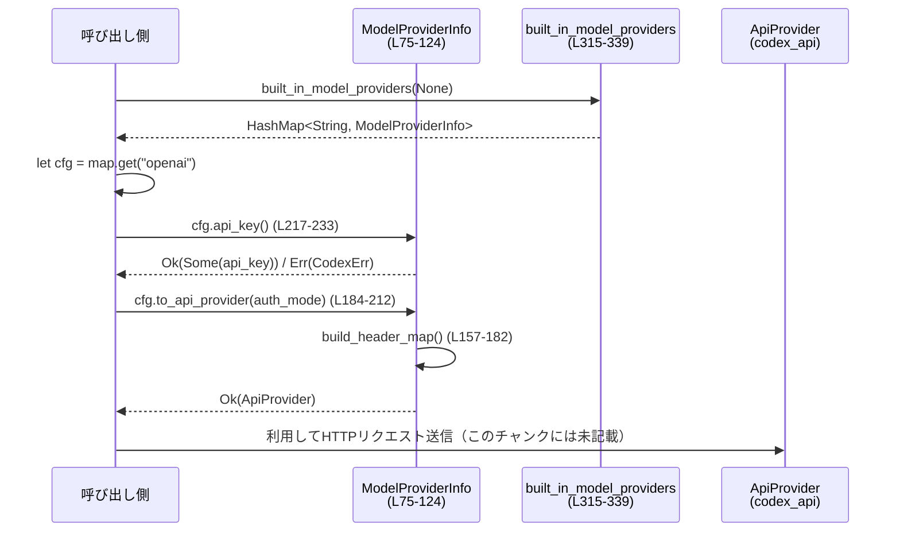

# model-provider-info/src/lib.rs コード解説

## 0. ざっくり一言

Codex がサポートする「モデルプロバイダ」のメタ情報を表現し、それを HTTP クライアント用の `ApiProvider` に変換するためのレジストリ／ユーティリティを提供するモジュールです（OpenAI や OSS ローカルプロバイダのデフォルト定義も含みます）。  

---

## 1. このモジュールの役割

### 1.1 概要

- このモジュールは **Codex が利用する各種モデルプロバイダの設定情報** を表現し、それを **実際の API 呼び出しで使う形に変換する** ために存在します。
- 主な機能は:
  - TOML 等の設定からシリアライズ可能な `ModelProviderInfo` 構造体の定義（L72-124）。
  - OpenAI/OSS ローカル用の組み込みプロバイダの一覧生成（`built_in_model_providers`, L314-339）。
  - `ModelProviderInfo` から `codex_api::Provider` への変換（`to_api_provider`, L184-212）。
  - 認証キーや HTTP ヘッダの組み立て、リトライ設定やタイムアウトの適用。

### 1.2 アーキテクチャ内での位置づけ

外部クレートとの関係を含む依存関係を簡略化した図です。

```mermaid
graph TD
    subgraph "model-provider-info/src/lib.rs"
        WireApi["WireApi (L40-70)"]
        MPI["ModelProviderInfo (L75-124)"]
    end

    MPI -->|auth: Option<...>| AuthInfo["ModelProviderAuthInfo\n(codex_protocol)"]
    MPI -->|to_api_provider (L184-212)| ApiProv["codex_api::Provider"]
    MPI -->|errors| CodexErr["CodexErr / CodexResult\n(codex_protocol)"]
    MPI -->|headers| HttpHdr["http::HeaderMap"]
    MPI -->|uses| AuthMode["AuthMode\n(codex_app_server_protocol)"]
    MPI -->|durations| Duration["std::time::Duration"]

    style WireApi fill:#eef,stroke:#999
    style MPI fill:#eef,stroke:#999
```

- 設定の入口: `ModelProviderInfo`（設定ファイルやコードから生成）。
- 出力: `codex_api::Provider` として HTTP クライアント層に渡されます（L184-212）。
- 補助:
  - 認証情報: `ModelProviderAuthInfo`（外部 crate, L11）。
  - エラー型: `CodexErr`, `EnvVarError`, `CodexResult`（L12-14）。
  - HTTP ヘッダ型: `http::HeaderMap`, `HeaderName`, `HeaderValue`（L15-17）。

呼び出し元（CLI やサーバ）がどのモジュールかは、このチャンクからは分かりません。

### 1.3 設計上のポイント

- **構成情報中心の設計**  
  - すべての設定は `ModelProviderInfo` に集約され、serde でシリアライズ可能です（L72-75）。
  - `#[schemars(deny_unknown_fields)]` により、設定ファイルの不要なキーはスキーマ上で拒否されます（L74）。

- **環境変数によるシークレット管理**  
  - API キーや一部ヘッダ値は環境変数から取得します（`env_key`, `env_http_headers`, L80-81, L100-104）。
  - キー取得失敗時には `CodexErr::EnvVar` を返します（L214-228）。

- **ワイヤプロトコルの明示**  
  - `WireApi` enum でプロバイダのワイヤプロトコルを管理（L40-47）。
  - `"chat"` は明示的にエラーとして扱い、移行メッセージを返します（L58-70）。

- **安全なデフォルトと上限値**  
  - リトライ回数やタイムアウトは定数でデフォルトを定め、ユーザ設定にはハードキャップを設けています（L25-32, L235-247, L250-261）。

- **エラー処理方針**  
  - 設定の不整合 (`validate`) と環境変数不足 (`api_key`) はエラーとして顕在化。
  - 不正な HTTP ヘッダ名や値は、構築時に静かにスキップされます（L157-181）。

- **並行性**  
  - このモジュール自身はスレッド生成や async は扱っておらず、グローバルな状態アクセスは `std::env::var` の読み取りのみです（L171, L220, L346, L353）。

---

## 2. 主要な機能一覧

- プロバイダ種別の定義: `WireApi` によるワイヤプロトコル指定（L40-47）。
- プロバイダ設定のシリアライズ可能な表現: `ModelProviderInfo` 構造体（L72-124）。
- 設定のバリデーション: `ModelProviderInfo::validate`（L127-155）。
- HTTP ヘッダマップの構築: `ModelProviderInfo::build_header_map`（L157-182）。
- API クライアント構成への変換: `ModelProviderInfo::to_api_provider`（L184-212）。
- API キーの取得: `ModelProviderInfo::api_key`（L214-233）。
- リトライ・タイムアウト値の解決: `request_max_retries`, `stream_max_retries`, `stream_idle_timeout`, `websocket_connect_timeout`（L235-261）。
- OpenAI 用デフォルトプロバイダ生成: `ModelProviderInfo::create_openai_provider`（L263-297）。
- プロバイダ種別判定ヘルパ: `is_openai`, `has_command_auth`（L299-305）。
- 組み込みプロバイダ一覧生成: `built_in_model_providers`（L314-339）。
- OSS ローカルプロバイダ生成: `create_oss_provider`, `create_oss_provider_with_base_url`（L341-379）。

---

## 3. 公開 API と詳細解説

### 3.1 型一覧（構造体・列挙体など）

#### 主要な型

| 名前 | 種別 | 公開 | 役割 / 用途 | 定義位置 |
|------|------|------|-------------|----------|
| `WireApi` | 列挙体 | `pub` | プロバイダが利用するワイヤプロトコル（現在は `responses` のみ）を表現します。serde で文字列 ⇔ enum を変換します。 | `model-provider-info/src/lib.rs:L40-47` |
| `ModelProviderInfo` | 構造体 | `pub` | 一つのモデルプロバイダに関するすべての設定（URL、認証方式、追加ヘッダ、リトライ設定など）を保持します。設定ファイルとのシリアライズ／デシリアライズの中心となる型です。 | `model-provider-info/src/lib.rs:L72-124` |

#### 主な公開定数

| 名前 | 種別 | 公開 | 役割 / 用途 | 定義位置 |
|------|------|------|-------------|----------|
| `DEFAULT_WEBSOCKET_CONNECT_TIMEOUT_MS` | `u64` | `pub` | WebSocket 接続試行のデフォルトタイムアウト（ミリ秒）。 | L28 |
| `OPENAI_PROVIDER_ID` | `&'static str` | `pub` | OpenAI プロバイダの ID（キー） `"openai"`。`built_in_model_providers` のマップキーとして使われます。 | L35 |
| `LEGACY_OLLAMA_CHAT_PROVIDER_ID` | `&'static str` | `pub` | 廃止された `"ollama-chat"` プロバイダの ID。エラーメッセージなどで使用されます。 | L37 |
| `OLLAMA_CHAT_PROVIDER_REMOVED_ERROR` | `&'static str` | `pub` | 廃止された `ollama-chat` に関する案内メッセージ。 | L38 |
| `DEFAULT_LMSTUDIO_PORT` | `u16` | `pub` | LM Studio OSS プロバイダのデフォルトポート。 | L308 |
| `DEFAULT_OLLAMA_PORT` | `u16` | `pub` | Ollama OSS プロバイダのデフォルトポート。 | L309 |
| `LMSTUDIO_OSS_PROVIDER_ID` | `&'static str` | `pub` | LM Studio OSS プロバイダの ID `"lmstudio"`。 | L311 |
| `OLLAMA_OSS_PROVIDER_ID` | `&'static str` | `pub` | Ollama OSS プロバイダの ID `"ollama"`。 | L312 |

### 3.2 関数詳細（重要な 7 件）

#### ModelProviderInfo::validate(&self) -> std::result::Result<(), String>  

（`model-provider-info/src/lib.rs:L127-155`）

**概要**

- `ModelProviderInfo` のうち、`auth` 関連の設定が矛盾していないかをチェックします。
- `auth` を使う場合に、同時に `env_key` / `experimental_bearer_token` / `requires_openai_auth` を併用していないかを検証します。

**引数**

| 引数名 | 型 | 説明 |
|--------|----|------|
| `&self` | `&ModelProviderInfo` | 検証対象のプロバイダ設定 |

**戻り値**

- `Ok(())`: 設定が妥当な場合。
- `Err(String)`: 不正な組み合わせがある場合（エラーメッセージ文字列を含む）。

**内部処理の流れ**

1. `self.auth.as_ref()` で `auth` が設定されているか確認します（L128）。
   - `None` の場合は即 `Ok(())` を返します（L129-130）。
2. `auth` がある場合、`auth.command` が空文字列または空白のみでないかをチェックし、空ならエラー（L132-134）。
3. `env_key`, `experimental_bearer_token`, `requires_openai_auth` それぞれが設定されていれば `conflicts` ベクタに名前を追加します（L136-145）。
4. `conflicts` が空なら `Ok(())`、そうでなければ `format!` でメッセージを作って `Err` を返します（L147-154）。

**Examples（使用例）**

```rust
use model_provider_info::ModelProviderInfo;

// 例: auth が設定されていない場合は常に Ok
let provider = ModelProviderInfo::create_openai_provider(None);
assert!(provider.validate().is_ok());

// 例: auth と env_key を併用している場合（擬似コード）
// let mut provider = ModelProviderInfo::create_openai_provider(None);
// provider.env_key = Some("MY_API_KEY_ENV".into());
// provider.auth = Some(/* ModelProviderAuthInfo { command: "mycmd".into(), ... } */);
// assert!(provider.validate().is_err());
```

**Errors / Panics**

- `auth` があり `auth.command` が空白のみの場合:  
  `Err("provider auth.command must not be empty")` を返します（L132-134）。
- `auth` と他の認証関連フィールドが組み合わせられている場合:  
  `"provider auth cannot be combined with env_key, experimental_bearer_token, ..."` のようなメッセージの `Err` を返します（L150-153）。
- 明示的な `panic!` はありません。

**Edge cases（エッジケース）**

- `auth` が `None` の場合は、他のフィールドに何が設定されていても無条件で `Ok(())` です（L128-130）。
- 複数の衝突フィールドがある場合、すべて `conflicts` に追加され、メッセージ内にカンマ区切りで列挙されます（L136-145, L150-153）。
- `auth.command` の空文字列判定は `trim().is_empty()` なので、スペースだけのコマンドも禁止です（L132）。

**使用上の注意点**

- `auth` ベースの認証と `env_key`/`experimental_bearer_token`/`requires_openai_auth` は排他的に設計されています。
- 設定を手で組み立てる場合や TOML を編集する場合には、この制約を前提にする必要があります。

---

#### ModelProviderInfo::build_header_map(&self) -> CodexResult<HeaderMap>  

（`model-provider-info/src/lib.rs:L157-182`）

**概要**

- `http_headers` と `env_http_headers` から `http::HeaderMap` を組み立てます。
- 無効なヘッダ名・値はスキップし、環境変数が未設定または空の場合は `env_http_headers` の該当ヘッダを追加しません。

**引数**

| 引数名 | 型 | 説明 |
|--------|----|------|
| `&self` | `&ModelProviderInfo` | ヘッダ設定を含むプロバイダ設定 |

**戻り値**

- `Ok(HeaderMap)`: 正常に構築されたヘッダマップ。
- `Err(CodexErr)`: 現状のコードでは `CodexErr` を返すパスはありませんが、シグネチャ上は `CodexResult` で表現されています（L157, L181-182）。

**内部処理の流れ**

1. `http_headers` と `env_http_headers` の要素数を足し合わせ、`HeaderMap::with_capacity` の初期容量として使用します（L158-160）。
2. `http_headers` がある場合:
   - すべての `(k, v)` について `HeaderName::try_from(k)` と `HeaderValue::try_from(v)` を試し、両方 `Ok` の場合のみ `insert` します（L161-166）。
3. `env_http_headers` がある場合:
   - 各 `(header, env_var)` について `std::env::var(env_var)` で値を取り出し、取得成功かつ空白以外のときのみヘッダを追加します（L169-177）。
   - 環境変数の値から `HeaderName`/`HeaderValue` への変換も同様に `try_from` で行い、失敗したものはスキップします（L173-176）。
4. 最後に `Ok(headers)` を返します（L181）。

**Examples（使用例）**

```rust
use model_provider_info::ModelProviderInfo;

// 例: create_openai_provider では version ヘッダが付与される
let provider = ModelProviderInfo::create_openai_provider(None);
let headers = provider.to_api_provider(None)?.headers;

// あるいは直接（同じ結果になる）
let headers_direct = provider.build_header_map()?;
// headers["version"] などにアクセス可能（存在チェックは必要）
```

**Errors / Panics**

- この関数内で `?` や `panic!` は使われておらず、`CodexResult` ですが現実には常に `Ok` を返します（L157-182）。
- 無効なヘッダ名・値・環境変数名は単にスキップされ、エラーにはなりません。

**Edge cases**

- `http_headers` / `env_http_headers` が両方 `None` の場合、空の `HeaderMap` が返ります（L158-160）。
- `env_http_headers` の環境変数が未設定・空文字・空白のみの場合、そのヘッダは追加されません（L171-173）。
- ヘッダ名や値が `try_from` に失敗した場合も、そのヘッダは追加されません（L163-164, L173-176）。

**使用上の注意点**

- ヘッダ設定のミス（例: 不正なヘッダ名）はエラーではなく静かに無視されるため、デバッグ時に注意が必要です。
- セキュリティ上、`env_http_headers` は環境変数の値をそのままヘッダに乗せるため、値の内容には注意が必要です。

---

#### ModelProviderInfo::to_api_provider(&self, auth_mode: Option<AuthMode>) -> CodexResult<ApiProvider>  

（`model-provider-info/src/lib.rs:L184-212`）

**概要**

- `ModelProviderInfo` を、実際の HTTP クライアントで使う `codex_api::Provider` 構造体に変換します。
- OpenAI / ChatGPT などの `auth_mode` に応じてデフォルトの `base_url` を切り替え、リトライ設定やストリームのアイドルタイムアウトを埋め込みます。

**引数**

| 引数名 | 型 | 説明 |
|--------|----|------|
| `&self` | `&ModelProviderInfo` | 変換元のプロバイダ設定 |
| `auth_mode` | `Option<AuthMode>` | 認証モード。`Some(AuthMode::Chatgpt)` の場合は ChatGPT 用のベース URL を使用 |

**戻り値**

- `Ok(ApiProvider)`: `codex_api::Provider` 型のインスタンス。
- `Err(CodexErr)`: `build_header_map` が将来エラーを返すようになった場合に伝播する可能性があります（現状は常に `Ok`）。

**内部処理の流れ**

1. `auth_mode` が `Some(AuthMode::Chatgpt)` かどうかで `default_base_url` を分岐（L185-189）。
   - ChatGPT: `"https://chatgpt.com/backend-api/codex"`。
   - それ以外: `"https://api.openai.com/v1"`。
2. `self.base_url` が `Some` ならそれを優先し、`None` の場合は上記デフォルト URL を使用（L190-193）。
3. `self.build_header_map()?` でヘッダマップを構築（L195）。
4. `ApiRetryConfig` を作成し、`max_attempts` に `self.request_max_retries()`、`base_delay` に 200ms、`retry_429` は `false` などの設定を行う（L196-202）。
5. `ApiProvider` 構造体を初期化し、`stream_idle_timeout` に `self.stream_idle_timeout()` を設定して返します（L204-211）。

**Examples（使用例）**

```rust
use model_provider_info::{built_in_model_providers, OPENAI_PROVIDER_ID};
use codex_app_server_protocol::AuthMode;

let providers = built_in_model_providers(None);
let openai_cfg = providers.get(OPENAI_PROVIDER_ID).unwrap();

// ChatGPT 認証モードで ApiProvider を生成
let api_provider = openai_cfg.to_api_provider(Some(AuthMode::Chatgpt))?;

// 以降、api_provider を使って Codex が HTTP リクエストを送信する想定
```

**Errors / Panics**

- 現状、この関数内で明示的に `Err` を返すのは `build_header_map()?` だけです（L195）。
  - ただし `build_header_map` は常に `Ok` を返しているため、このチャンクに基づく限りではエラーは発生しません。
- 明示的な `panic!` はありません。

**Edge cases**

- `base_url` が `None` の場合のみ `auth_mode` に基づくデフォルト URL が使われます（L190-193）。`Some` の場合は常にそれが優先されます。
- `request_max_retries` や `stream_idle_timeout_ms` が未設定の場合、内部のデフォルト・上限ロジックに従って設定されます（L196-201, L235-261）。

**使用上の注意点**

- `auth_mode` に `Some(AuthMode::Chatgpt)` を指定すると OpenAI API ではなく ChatGPT のバックエンド URL を使う点に注意が必要です。
- `ModelProviderInfo` が OpenAI 以外のプロバイダを表す場合でも、この関数は `base_url` が `Some` であればその値を優先して使用します。

---

#### ModelProviderInfo::api_key(&self) -> CodexResult<Option<String>>  

（`model-provider-info/src/lib.rs:L217-233`）

**概要**

- `env_key` で指定された環境変数から API キーを取得します。
- 必須キーが見つからない場合には `CodexErr::EnvVar` を返し、`env_key` 自体が `None` の場合は `Ok(None)` を返します。

**引数**

| 引数名 | 型 | 説明 |
|--------|----|------|
| `&self` | `&ModelProviderInfo` | API キーに関する設定を含むプロバイダ設定 |

**戻り値**

- `Ok(Some(String))`: 環境変数が存在し、空白でない値が取得できた場合。
- `Ok(None)`: `env_key` が設定されていない場合。
- `Err(CodexErr::EnvVar)`: `env_key` はあるが、環境変数が未設定または空白のみの場合（L224-228）。

**内部処理の流れ**

1. `match &self.env_key` で `env_key` の有無を判定（L218）。
2. `Some(env_key)` の場合:
   - `std::env::var(env_key)` で値を取得し、`ok()` で `Result` ⇒ `Option` に変換（L220-221）。
   - `.filter(|v| !v.trim().is_empty())` で空白だけの値を除外（L222）。
   - `.ok_or_else(...)` で値がなければ `CodexErr::EnvVar` を作成して `Err` を返す（L223-228）。
3. 正常時は `Ok(Some(api_key))` を返します（L229）。
4. `None` の場合は `Ok(None)` を返します（L231）。

**Examples（使用例）**

```rust
use model_provider_info::ModelProviderInfo;
use std::env;

// 例: 環境変数からキーを取得する（擬似コード）
// let mut provider = ModelProviderInfo::create_openai_provider(None);
// provider.env_key = Some("OPENAI_API_KEY".into());
// env::set_var("OPENAI_API_KEY", "sk-xxxx");

// let key = provider.api_key()?;
// assert!(key.is_some());
```

**Errors / Panics**

- 環境変数が存在しない、または空白のみの値の場合:
  - `Err(CodexErr::EnvVar(EnvVarError { var, instructions }))` が返されます（L224-228）。
- 明示的な `panic!` はありません。

**Edge cases**

- `env_key` が `None` の場合はエラーにはならず、`Ok(None)` を返します（L231）。
- 環境変数値が `"   "` のような空白のみの場合も、未設定と同様に扱われエラーになります（L222）。

**使用上の注意点**

- API キーを埋め込むのではなく、環境変数で管理する前提のインタフェースです。
- UI から `env_key_instructions` 経由でユーザに取得方法を示す用途に使われることが想定されますが、具体的な利用方法はこのチャンクからは分かりません。

---

#### ModelProviderInfo::request_max_retries(&self) -> u64  

（`model-provider-info/src/lib.rs:L235-240`）

**概要**

- プロバイダ毎の HTTP リクエスト最大リトライ回数を解決します。
- 設定されていない場合はデフォルト値 (`DEFAULT_REQUEST_MAX_RETRIES = 4`) を使い、さらにハードキャップ (`MAX_REQUEST_MAX_RETRIES = 100`) を適用します。

**引数**

| 引数名 | 型 | 説明 |
|--------|----|------|
| `&self` | `&ModelProviderInfo` | リトライ設定を含むプロバイダ設定 |

**戻り値**

- `u64`: 実際に利用される最大リトライ回数。

**内部処理の流れ**

1. `self.request_max_retries.unwrap_or(DEFAULT_REQUEST_MAX_RETRIES)` でユーザ設定またはデフォルトを取得（L237-238）。
2. `.min(MAX_REQUEST_MAX_RETRIES)` で上限値 100 にクリップ（L239-240）。

**関連関数**

- ストリーミング再接続回数: `stream_max_retries`（L242-247）。
- ストリームアイドルタイムアウト: `stream_idle_timeout`（L249-254）。
- WebSocket 接続タイムアウト: `websocket_connect_timeout`（L256-261）。

**Examples（使用例）**

```rust
let provider = ModelProviderInfo::create_openai_provider(None);
// デフォルト（4）になる
assert_eq!(provider.request_max_retries(), 4);
```

**Errors / Panics**

- 単純な数値演算のみで、明示的なエラーやパニックの可能性はありません。

**Edge cases**

- 設定が極端に大きな値（例: 1000）でも、`min(100)` によって 100 にクリップされます。
- 負の値は型上設定できません（`u64`）。

**使用上の注意点**

- クライアント側のリトライ戦略を調整したい場合、この関数を通じて上限 100 回まで設定できます。

---

#### built_in_model_providers(openai_base_url: Option<String>) -> HashMap<String, ModelProviderInfo>  

（`model-provider-info/src/lib.rs:L315-339`）

**概要**

- Codex に組み込みで含まれるデフォルトプロバイダ一覧を生成します。
- OpenAI、Ollama OSS、LM Studio OSS の 3 つを含みます。

**引数**

| 引数名 | 型 | 説明 |
|--------|----|------|
| `openai_base_url` | `Option<String>` | OpenAI プロバイダ用のベース URL。`None` の場合は `to_api_provider` 側のデフォルトが使われます。 |

**戻り値**

- `HashMap<String, ModelProviderInfo>`: キーはプロバイダ ID (`"openai"`, `"ollama"`, `"lmstudio"`) の文字列。

**内部処理の流れ**

1. `use ModelProviderInfo as P;` でエイリアスを作成（L318）。
2. `P::create_openai_provider(openai_base_url)` で OpenAI プロバイダ設定を生成（L319）。
3. 配列リテラルで以下のエントリを作成（L325-335）:
   - `(OPENAI_PROVIDER_ID, openai_provider)`
   - `(OLLAMA_OSS_PROVIDER_ID, create_oss_provider(DEFAULT_OLLAMA_PORT, WireApi::Responses))`
   - `(LMSTUDIO_OSS_PROVIDER_ID, create_oss_provider(DEFAULT_LMSTUDIO_PORT, WireApi::Responses))`
4. `.into_iter().map(|(k, v)| (k.to_string(), v)).collect()` で `HashMap<String, ModelProviderInfo>` に変換して返します（L336-338）。

**Examples（使用例）**

```rust
use model_provider_info::{built_in_model_providers, OPENAI_PROVIDER_ID, OLLAMA_OSS_PROVIDER_ID};

let providers = built_in_model_providers(None);
let openai = providers.get(OPENAI_PROVIDER_ID).unwrap();
let ollama = providers.get(OLLAMA_OSS_PROVIDER_ID).unwrap();

// それぞれの ModelProviderInfo から ApiProvider を作成できる
let openai_api = openai.to_api_provider(None)?;
let ollama_api = ollama.to_api_provider(None)?;
```

**Errors / Panics**

- 関数自体はエラーやパニックを返しません（ハッシュマップ構築のみ）。
- ただし、返された `ModelProviderInfo` を使用して `api_key` や `to_api_provider` を呼ぶ際にエラーが発生する可能性があります（前述）。

**Edge cases**

- `openai_base_url` が `Some` の場合、その URL が OpenAI プロバイダの `base_url` にそのまま設定されます（L265-266）。

**使用上の注意点**

- この関数は「組み込みの最小集合」だけを返します。サードパーティのホスティングサービスなどは含まれません（コメント L321-324）。
- 実運用では、ユーザ設定の `model_providers` とマージまたは上書きされる想定ですが、その処理はこのチャンクには含まれていません。

---

#### create_oss_provider(default_provider_port: u16, wire_api: WireApi) -> ModelProviderInfo  

（`model-provider-info/src/lib.rs:L341-358`）

**概要**

- ローカル OSS プロバイダ（Ollama や LM Studio など）用の `ModelProviderInfo` を生成します。
- `CODEX_OSS_PORT` および `CODEX_OSS_BASE_URL` 環境変数でベース URL を上書き可能です。

**引数**

| 引数名 | 型 | 説明 |
|--------|----|------|
| `default_provider_port` | `u16` | ローカルサーバのデフォルトポート番号（例: `DEFAULT_OLLAMA_PORT`）。 |
| `wire_api` | `WireApi` | 利用するワイヤプロトコル（現状 `WireApi::Responses` のみ）。 |

**戻り値**

- `ModelProviderInfo`: OSS 用に設定されたプロバイダ情報。

**内部処理の流れ**

1. `CODEX_OSS_PORT` 環境変数を読み込み（L346）、以下の条件をすべて満たした場合のみ使用:
   - `std::env::var("CODEX_OSS_PORT").ok()` で取得成功（L346-347）。
   - `.filter(|value| !value.trim().is_empty())` で空白でない（L348）。
   - `.and_then(|value| value.parse::<u16>().ok())` で `u16` として解釈可能（L349）。
2. 上記いずれかが失敗した場合は `default_provider_port` を使用（`.unwrap_or(default_provider_port)`, L350）。
3. `format!("http://localhost:{codex_oss_port}/v1", ...)` でデフォルトのベース URL を組み立て（L344-351）。
4. `CODEX_OSS_BASE_URL` 環境変数が有効な値（非空白）で設定されている場合、それを `codex_oss_base_url` としてデフォルト URL を上書き（L353-356）。
5. `create_oss_provider_with_base_url(&codex_oss_base_url, wire_api)` を呼んで `ModelProviderInfo` を生成（L357）。

**Examples（使用例）**

```rust
use model_provider_info::{create_oss_provider, DEFAULT_OLLAMA_PORT};
use model_provider_info::WireApi;

let provider = create_oss_provider(DEFAULT_OLLAMA_PORT, WireApi::Responses);
let api_provider = provider.to_api_provider(None)?;
```

**Errors / Panics**

- この関数自体はエラーやパニックを返しません。
- `CODEX_OSS_PORT`/`CODEX_OSS_BASE_URL` が不正な値の場合でも、安全なフォールバック（デフォルトポート or デフォルト URL）に戻ります（L346-356）。

**Edge cases**

- `CODEX_OSS_PORT` が未設定・空白・数値変換失敗のいずれかの場合、`default_provider_port` が使われます（L346-351）。
- `CODEX_OSS_BASE_URL` が未設定・空白の場合、`default_codex_oss_base_url` がそのまま使われます（L353-356）。

**使用上の注意点**

- コメントに「experimental」とある通り（L342-343）、将来的に `config.toml` ベースの設定に置き換えられる可能性がある旨が記載されています。
- ベース URL を完全にカスタムしたい場合は `create_oss_provider_with_base_url` を直接使う形がシンプルです（L360-379）。

---

### 3.3 その他の関数・メソッド一覧

#### WireApi 関連

| 関数名 | 所属 | 役割 | 定義位置 |
|--------|------|------|----------|
| `fmt` | `impl fmt::Display for WireApi` | `WireApi` を `"responses"` のような文字列に変換します。 | L49-55 |
| `deserialize` | `impl<'de> Deserialize<'de> for WireApi` | 文字列 `"responses"` ⇒ `WireApi::Responses` へのデシリアライズ。`"chat"` は特別なエラーメッセージで拒否し、それ以外も未知の variant としてエラーにします。 | L58-70 |

#### ModelProviderInfo のヘルパーメソッド

| 関数名 | 役割（1 行） | 定義位置 |
|--------|--------------|----------|
| `stream_max_retries(&self) -> u64` | ストリーミング再接続の最大回数をデフォルト＋上限付きで解決します。 | L242-247 |
| `stream_idle_timeout(&self) -> Duration` | ストリーミングレスポンスのアイドルタイムアウト（`Duration`）を解決します。 | L249-254 |
| `websocket_connect_timeout(&self) -> Duration` | WebSocket 接続試行のタイムアウト（`Duration`）を解決します。 | L256-261 |
| `create_openai_provider(base_url: Option<String>) -> ModelProviderInfo` | OpenAI プロバイダ用の既定設定を生成します。ヘッダに `version` や `OpenAI-Organization` などを含みます。 | L263-297 |
| `is_openai(&self) -> bool` | `self.name` が `"OpenAI"` かどうかを判定します。 | L299-301 |
| `has_command_auth(&self) -> bool` | `auth` が `Some` かどうかを返します。 | L303-305 |

#### OSS プロバイダ用ヘルパー

| 関数名 | 役割（1 行） | 定義位置 |
|--------|--------------|----------|
| `create_oss_provider_with_base_url(base_url: &str, wire_api: WireApi) -> ModelProviderInfo` | 任意の `base_url` と `wire_api` を指定して OSS 用 `ModelProviderInfo` を生成します。 | L360-379 |

---

## 4. データフロー

ここでは、「組み込み OpenAI プロバイダから `ApiProvider` を生成する」典型的なフローを示します。

1. 呼び出し側が `built_in_model_providers(None)` を呼び、組み込みプロバイダ一覧を取得（L315-339）。
2. ハッシュマップから OpenAI プロバイダ (`"openai"`) の `ModelProviderInfo` を取得。
3. 必要に応じて `api_key()` で API キーを取得（L217-233）。
4. `to_api_provider(auth_mode)` で `ApiProvider` に変換（L184-212）。
5. 変換結果が HTTP クライアント層に渡され、実際の API 呼び出しに使用されます（このチャンクには呼び出し部分のコードはありません）。



図中の行番号は、このファイル内での定義位置を示します。

---

## 5. 使い方（How to Use）

### 5.1 基本的な使用方法

組み込みの OpenAI プロバイダを使って `ApiProvider` を作成する簡単な例です。

```rust
use model_provider_info::{built_in_model_providers, OPENAI_PROVIDER_ID};
use codex_app_server_protocol::AuthMode;

fn main() -> codex_protocol::error::Result<()> {
    // 組み込みプロバイダ一覧を取得する（L315-339）
    let providers = built_in_model_providers(None);

    // OpenAI プロバイダ設定を取り出す
    let openai_cfg = providers
        .get(OPENAI_PROVIDER_ID)
        .expect("OpenAI provider not found");

    // 必要に応じて API キーを取得する（env_key が設定されている場合、L217-233）
    let _api_key = openai_cfg.api_key()?; // この例では値を使わない

    // 認証モードに応じた ApiProvider を生成する（L184-212）
    let api_provider = openai_cfg.to_api_provider(Some(AuthMode::Chatgpt))?;

    // 以降、api_provider を使って Codex API 呼び出しを行う想定
    println!("Base URL: {}", api_provider.base_url);

    Ok(())
}
```

### 5.2 よくある使用パターン

1. **OpenAI 専用クライアントとして利用**

   - `built_in_model_providers(None)` で OpenAI の設定だけを使う。
   - `AuthMode::Chatgpt` or その他の `AuthMode` を渡して `to_api_provider` を呼ぶ。

2. **ローカル OSS プロバイダ向け設定**

   ```rust
   use model_provider_info::{create_oss_provider, DEFAULT_OLLAMA_PORT};
   use model_provider_info::WireApi;

   // デフォルトの Ollama ポートを前提とした OSS プロバイダ設定
   let oss_cfg = create_oss_provider(DEFAULT_OLLAMA_PORT, WireApi::Responses);

   let api_provider = oss_cfg.to_api_provider(None)?;
   ```

3. **環境変数によるベース URL の上書き**

   - `create_oss_provider` は `CODEX_OSS_PORT` と `CODEX_OSS_BASE_URL` を参照します（L344-356）。
   - 例:
     - `CODEX_OSS_PORT=1235` を設定すると `http://localhost:1235/v1` がデフォルトに。
     - `CODEX_OSS_BASE_URL=http://example.com/api` を設定すると、ポートに関係なくその URL が完全に優先されます。

### 5.3 よくある間違い

1. **`wire_api = "chat"` を設定する**

   設定ファイル（TOML 等）で:

   ```toml
   [model_providers.my_provider]
   wire_api = "chat"  # ❌ 廃止された値
   ```

   とすると、`WireApi::deserialize` 内で `CHAT_WIRE_API_REMOVED_ERROR` に基づくエラーが返ります（L58-67, L36）。

   正しい設定例:

   ```toml
   [model_providers.my_provider]
   wire_api = "responses"  # ✅ 現在サポートされている値
   ```

2. **`auth` と `env_key` を同時に設定する**

   - `ModelProviderInfo::validate` により、`auth` と `env_key`/`experimental_bearer_token`/`requires_openai_auth` の併用はエラーとなります（L136-145, L150-153）。

3. **環境変数の値が空白のみ**

   - `api_key` や `env_http_headers` は空白だけの値を無効として扱います（L222, L171-173）。
   - 値を設定したつもりでも、空白のみだと「未設定」とみなされる点に注意が必要です。

### 5.4 使用上の注意点（まとめ）

- **認証設定の排他性**  
  - `auth`（外部コマンドによるトークン取得）と `env_key`/`experimental_bearer_token`/`requires_openai_auth` の併用は `validate` でエラーになります（L127-155）。

- **環境変数依存**  
  - API キーや OSS ベース URL は環境変数に依存する設計です（`env_key`, `env_http_headers`, `CODEX_OSS_*` など）。
  - 本番環境と開発環境で異なる値を使う場合、環境変数の管理に注意が必要です。

- **ヘッダ設定の無視されるケース**  
  - 無効なヘッダ名・値、未設定の環境変数由来のヘッダは静かに無視されます（L161-177）。
  - 明示的なエラーが出ないため、期待したヘッダが付いているかをテストやログで確認する必要があります。

- **セキュリティ上の考慮**  
  - `experimental_bearer_token` はコメントで「利用は非推奨」とされています（L86-89）。
  - 可能であれば `env_key` など、環境変数ベースの管理を用いる前提になっています。

- **並行性に関する注意**  
  - このモジュールはスレッドや async を扱っておらず、共有可変状態は持っていません。
  - 唯一のグローバルアクセスは `std::env::var` ですが、読み取りのみを行っています。

---

## 6. 変更の仕方（How to Modify）

### 6.1 新しい機能を追加する場合

例: 新しいプロバイダ種別や設定フィールドを追加したい場合。

1. **構造体へのフィールド追加**
   - `ModelProviderInfo` に新フィールドを追加します（L75-123）。
   - シリアライズ対象であれば `serde` 属性や `JsonSchema` への影響を考慮します。

2. **デフォルト値・変換ロジックの更新**
   - 新フィールドが `ApiProvider` に影響する場合は、`to_api_provider` を更新します（L184-212）。
   - リトライやタイムアウト関連なら、`request_max_retries` などと同様のパターンを踏襲できます（L235-261）。

3. **バリデーションの追加**
   - 設定の整合性チェックが必要な場合は、`validate` にロジックを追加します（L127-155）。

4. **組み込みプロバイダへの反映**
   - 新しいプロバイダを組み込みにしたい場合は、`built_in_model_providers` にエントリを追加します（L314-339）。
   - ID 用の定数を追加する場合は、他の `*_PROVIDER_ID` 定数と同じパターンに揃えます（L311-312）。

5. **テストの追加**
   - `mod tests;` が `model_provider_info_tests.rs` を参照しているので（L381-383）、そこに対応するテストケースを追加する形が自然です（テスト内容はこのチャンクには含まれません）。

### 6.2 既存の機能を変更する場合

- **URL やポートの変更**
  - OpenAI のデフォルト URL を変更する場合は `to_api_provider` の `default_base_url` を修正します（L185-189）。
  - OSS プロバイダのデフォルトポートは `DEFAULT_OLLAMA_PORT`, `DEFAULT_LMSTUDIO_PORT` および `create_oss_provider` 内のロジックに影響します（L308-309, L341-351）。

- **リトライ／タイムアウトポリシーの変更**
  - 上限値やデフォルト値は定数（L25-32）と各メソッド（L235-261）を同時に確認し、整合性が取れているかチェックします。

- **認証方式の拡張**
  - `ModelProviderAuthInfo` の利用方法を変更する場合は、`auth` フィールド（L90-91）と `validate` のロジック（L127-155）への影響を考慮します。

- **影響範囲の確認**
  - このモジュールからは呼び出し元が分からないため、リポジトリ全体で `ModelProviderInfo` や `built_in_model_providers` の参照箇所を検索し、影響範囲を把握する必要があります。

---

## 7. 関連ファイル

このモジュールと密接に関係するファイル／外部コンポーネントです。

| パス / コンポーネント | 役割 / 関係 |
|-----------------------|------------|
| `model-provider-info/src/model_provider_info_tests.rs` | `#[cfg(test)] mod tests;` で参照されるテストモジュール（内容はこのチャンクには含まれていません）。 |
| `codex_api::Provider`, `codex_api::RetryConfig` | `to_api_provider` の出力先となる HTTP クライアント構成型（L8-9, L184-212）。 |
| `codex_protocol::config_types::ModelProviderAuthInfo` | `ModelProviderInfo::auth` フィールドの型（外部 crate, L11）。 |
| `codex_protocol::error::{CodexErr, EnvVarError, Result}` | API キー取得や各種結果型に使われるエラー型・結果型（L12-14, L214-228）。 |
| `codex_app_server_protocol::AuthMode` | `to_api_provider` でベース URL を切り替えるための認証モード（L10, L184-189）。 |
| `http::{HeaderMap, header::HeaderName, header::HeaderValue}` | 追加 HTTP ヘッダの組み立てに使用（L15-17, L157-181）。 |

このチャンクに現れない呼び出し元や、`ModelProviderAuthInfo` の具体的な構造などは、リポジトリ全体または該当 crate のソースを確認する必要があります。
