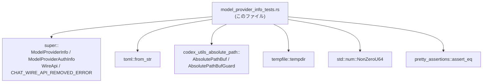
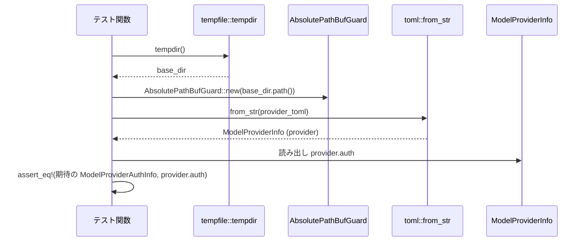

# model-provider-info/src/model_provider_info_tests.rs コード解説

## 0. ざっくり一言

`ModelProviderInfo` と `ModelProviderAuthInfo` の **TOML からのデシリアライズ挙動** と、そのデフォルト値・エラー・認証設定まわりを検証する単体テストをまとめたモジュールです（`#[test]` 関数群）（model_provider_info_tests.rs:L8-179）。

---

## 1. このモジュールの役割

### 1.1 概要

- このモジュールは `toml::from_str::<ModelProviderInfo>` を通じて、  
  プロバイダ設定ファイル（TOML）の読み込み結果が期待どおりになるかを検証します  
  （model_provider_info_tests.rs:L33, L66, L102, L115, L128, L145, L173）。
- 各テストは、代表的なプロバイダ構成（Ollama / Azure / 任意の Example / OpenAI / 独自 Corp 認証）について、
  - フィールドのデフォルト値
  - マップ型フィールド（`query_params`, `http_headers`, `env_http_headers`）
  - `wire_api` の不正値に対するエラー
  - WebSocket 関連タイムアウト
  - 認証設定 (`[auth]`) のデフォルト値とエッジケース  
  を確認します（model_provider_info_tests.rs:L10-31, L39-64, L72-100, L106-116, L121-129, L135-156, L163-178）。

### 1.2 アーキテクチャ内での位置づけ

このファイルは crate 内のテストモジュールであり、実装はすべて `super::*` 側にあります（model_provider_info_tests.rs:L1）。

- 依存関係の概要:
  - 親モジュール（`super`）から `ModelProviderInfo`, `ModelProviderAuthInfo`, `WireApi`, `CHAT_WIRE_API_REMOVED_ERROR` などをインポート（model_provider_info_tests.rs:L1）。
  - TOML パーサとして `toml::from_str` を使用（model_provider_info_tests.rs:L33, L66, L102, L115, L128, L145, L173）。
  - `codex_utils_absolute_path` を使って、一時的に「基準ディレクトリ」を切り替えつつ `cwd` を解決（model_provider_info_tests.rs:L2-3, L144-145, L155）。
  - 認証タイムアウトには `std::num::NonZeroU64` を採用（model_provider_info_tests.rs:L5, L153）。
  - テストのアサーションは `pretty_assertions::assert_eq` と標準の `assert!` を利用（model_provider_info_tests.rs:L4, L34, L67, L103, L116, L129, L148, L176-178）。
  - 一時ディレクトリの作成には `tempfile::tempdir` を使用（model_provider_info_tests.rs:L6, L134, L162）。

依存関係を簡略化した図は次のとおりです。



### 1.3 設計上のポイント

コードから読み取れる特徴を列挙します。

- **TOML 文字列直書きによるテスト**  
  各テストは、TOML コンテンツをその場で文字列リテラルとして定義し（例: model_provider_info_tests.rs:L10-13, L39-43, L72-77, L108-113, L121-126, L135-141, L163-169）、`toml::from_str` に渡して検証しています。  
  → 設定ファイルのフォーマットとデフォルト挙動を、外部ファイルに依存せずに確認できる構成になっています。

- **デフォルト値の明示的な検証**  
  `ModelProviderInfo` の多くのフィールドは `None` や `false` で初期化された期待値と比較されており（model_provider_info_tests.rs:L17-30, L49-63, L83-99）、  
  - `wire_api` は指定がない場合 `WireApi::Responses`  
  - ブール値の `requires_openai_auth`, `supports_websockets` は指定しないと `false`  
  - 多くのオプションフィールドは指定しないと `None`  
  である、という契約がテストで確認されています。

- **RAII ガードによるカレントディレクトリ相当の制御**  
  認証設定のテストでは `AbsolutePathBufGuard::new(base_dir.path())` を `_guard` 変数に束縛しており（model_provider_info_tests.rs:L144, L172）、  
  スコープ終了時にガードの Drop によってグローバル／スレッドローカルな基準ディレクトリが戻されるパターンが使われていると推測できます。ただし実際の実装内容はこのチャンクには現れません。

- **NonZeroU64 による非ゼロ制約**  
  `ModelProviderAuthInfo.timeout_ms` フィールドは `NonZeroU64` で比較されており（model_provider_info_tests.rs:L150-153）、  
  タイムアウト値が 0 にならないよう型レベルで制約していることが分かります。

- **エラーメッセージの内容まで検証**  
  `wire_api = "chat"` を指定した場合に、パースエラー文字列に `CHAT_WIRE_API_REMOVED_ERROR` が含まれることを検証しており（model_provider_info_tests.rs:L106-116）、  
  利用者にとって「何が問題か」が分かるメッセージを出すことが API 契約の一部になっています。

- **安全性・エラー・並行性観点**
  - `unwrap` / `unwrap_err` / `expect` を多用しており（model_provider_info_tests.rs:L33, L66, L102, L115, L128, L134, L145, L162, L173, L176）、失敗時にはテストが panic します。これはテストコードとして一般的なスタイルです。
  - 認証テストでの `AbsolutePathBufGuard` は、内部でグローバル状態を触る可能性がありますが、このチャンクからはスレッドセーフかどうかは分かりません。`cargo test` はテストを並列実行し得るため、その前提は `codex_utils_absolute_path` 側の実装に依存します（このチャンクには現れません）。

### 1.4 関数インベントリ（このファイル内）

| 名前 | 種別 | 役割 / 用途 | 根拠行 |
|------|------|------------|--------|
| `test_deserialize_ollama_model_provider_toml` | `fn()`（テスト） | Ollama 用の最小構成 TOML が `ModelProviderInfo` に正しくデシリアライズされ、未指定フィールドが期待どおりのデフォルト値になることを検証 | model_provider_info_tests.rs:L8-35 |
| `test_deserialize_azure_model_provider_toml` | `fn()`（テスト） | Azure 用の TOML から `env_key` や `query_params` を含む構成が正しく読み込まれることを検証 | model_provider_info_tests.rs:L37-68 |
| `test_deserialize_example_model_provider_toml` | `fn()`（テスト） | `http_headers` / `env_http_headers` の TOML テーブルが `HashMap` に変換されることを検証 | model_provider_info_tests.rs:L70-104 |
| `test_deserialize_chat_wire_api_shows_helpful_error` | `fn()`（テスト） | `wire_api = "chat"` のような無効値指定時に、分かりやすいエラーメッセージが出ることを検証 | model_provider_info_tests.rs:L106-117 |
| `test_deserialize_websocket_connect_timeout` | `fn()`（テスト） | `websocket_connect_timeout_ms` と `supports_websockets` の読み込みと、フィールドへの反映を検証 | model_provider_info_tests.rs:L119-130 |
| `test_deserialize_provider_auth_config_defaults` | `fn()`（テスト） | `[auth]` テーブルに最低限のフィールドだけを指定した場合の認証設定デフォルト値（`timeout_ms`, `refresh_interval_ms`, `cwd`）を検証 | model_provider_info_tests.rs:L132-158 |
| `test_deserialize_provider_auth_config_allows_zero_refresh_interval` | `fn()`（テスト） | `refresh_interval_ms = 0` を許容し、メソッド `refresh_interval()` が `None` を返すことを検証 | model_provider_info_tests.rs:L160-179 |

---

## 2. 主要な機能一覧

このテストモジュールがカバーしている「機能（=契約）」を列挙します。

- プロバイダ基本情報のデシリアライズ: `name`, `base_url` などの文字列フィールドの読み込み（model_provider_info_tests.rs:L10-13, L39-43, L72-77）。
- デフォルトフィールドの確認: 未指定時の `wire_api`, 各種 `Option` フィールド、ブール値の既定値（model_provider_info_tests.rs:L14-31, L45-64, L79-100）。
- クエリパラメータのマップ化: TOML 内の `query_params` を `HashMap<String, String>` に変換（model_provider_info_tests.rs:L39-43, L52-55）。
- HTTP ヘッダのマップ化: `http_headers` と `env_http_headers` の TOML テーブルを `HashMap` に変換（model_provider_info_tests.rs:L72-77, L88-93）。
- 非推奨 / 無効な `wire_api` の扱い: `"chat"` という文字列指定をエラーとして扱い、メッセージに `CHAT_WIRE_API_REMOVED_ERROR` を含める（model_provider_info_tests.rs:L106-116）。
- WebSocket 関連設定: `websocket_connect_timeout_ms` と `supports_websockets` の読み込み（model_provider_info_tests.rs:L121-129）。
- 認証設定 `[auth]` のデフォルト値:  
  `command`, `args` のみ指定された場合の `timeout_ms`, `refresh_interval_ms`, `cwd` のデフォルト、かつ `timeout_ms` が非 0 であること（model_provider_info_tests.rs:L135-141, L148-156）。
- 認証設定のエッジケース: `refresh_interval_ms = 0` を許容し、`refresh_interval()` が `None` を返す挙動（model_provider_info_tests.rs:L163-169, L176-178）。

---

## 3. 公開 API と詳細解説

このファイル自身は公開 API を定義していませんが、テストを通じて **外部に見える挙動（契約）** が分かる型と関数を整理します。

### 3.1 型一覧（構造体・列挙体など）

このファイルで利用されている主な型の一覧です。

| 名前 | 種別 | 定義場所（推定） | 役割 / 用途 | 根拠行 |
|------|------|------------------|-------------|--------|
| `ModelProviderInfo` | 構造体 | `super` モジュール（ファイル名は不明） | プロバイダ設定全体を表す。TOML から `toml::from_str` でデシリアライズされ、`name`, `base_url`, `env_key`, `query_params`, `http_headers`, `env_http_headers`, WebSocket 設定など多くのフィールドを持つ | インスタンス初期化: model_provider_info_tests.rs:L14-31, L45-64, L79-100; デシリアライズ: L33, L66, L102, L115, L128, L145, L173 |
| `WireApi` | 列挙体 | `super` モジュール | `wire_api` フィールドの値を表す列挙型。テストでは `WireApi::Responses` と、無効な `"chat"` 並びにそれに紐づくエラーが確認されている | 利用: model_provider_info_tests.rs:L21, L52, L86, L112 |
| `ModelProviderAuthInfo` | 構造体 | `super` モジュール | 認証設定 `[auth]` テーブルに対応。`command`, `args`, `timeout_ms`, `refresh_interval_ms`, `cwd` フィールドと、メソッド `refresh_interval()` を持つ | 利用: model_provider_info_tests.rs:L150-156, L176-178 |
| `CHAT_WIRE_API_REMOVED_ERROR` | 定数（おそらく `&'static str` か `String`） | `super` モジュール | `wire_api = "chat"` を指定した際のエラーメッセージに含まれるべき文言を保持する | 利用: model_provider_info_tests.rs:L115-116 |
| `AbsolutePathBuf` | 構造体 | `codex_utils_absolute_path` クレート | パスを絶対パスとして扱うユーティリティ。`resolve_path_against_base` でベースディレクトリに対して相対パス `"."` から `cwd` を導出する用途で使用 | 利用: model_provider_info_tests.rs:L2, L155 |
| `AbsolutePathBufGuard` | 構造体 | `codex_utils_absolute_path` クレート | 一時的に「基準ディレクトリ」を切り替えるためのガード。スコープ内での相対パス解決に影響すると考えられる | 利用: model_provider_info_tests.rs:L3, L144, L172 |
| `NonZeroU64` | 構造体 | `std::num` | 0 でない `u64` を表す標準ライブラリの型。`timeout_ms` に 0 が入らないことを型で保証するために使用 | 利用: model_provider_info_tests.rs:L5, L153 |
| `TempDir`（型名は暗黙） | 構造体 | `tempfile` クレート | `tempdir()` によって作成される一時ディレクトリ。`base_dir.path()` 経由で `cwd` の基準として使われる | 作成: model_provider_info_tests.rs:L134, L162 |

> `ModelProviderInfo` / `ModelProviderAuthInfo` / `WireApi` / `CHAT_WIRE_API_REMOVED_ERROR` の具体的な定義（フィールドの型や `serde` 属性など）は、このチャンクには現れません。

### 3.2 関数詳細（7 件）

#### `fn test_deserialize_ollama_model_provider_toml()`

**概要**

- Ollama 用の最小限の TOML 設定から `ModelProviderInfo` が正しくデシリアライズされること、および **未指定フィールドのデフォルト値** を検証するテストです（model_provider_info_tests.rs:L8-35）。

**引数**

- なし（テスト関数。テストハーネスから自動で呼び出されます）。

**戻り値**

- `()`（テスト成功時）。アサーション失敗または `unwrap()` 失敗で panic します。

**内部処理の流れ**

1. Ollama 用 TOML 文字列を定義（`name`, `base_url` のみ）（model_provider_info_tests.rs:L10-13）。
2. 期待値となる `ModelProviderInfo` インスタンスを構築（model_provider_info_tests.rs:L14-31）。
3. `toml::from_str` で TOML 文字列を `ModelProviderInfo` にデシリアライズし、`unwrap()` で失敗時には panic（model_provider_info_tests.rs:L33）。
4. `pretty_assertions::assert_eq` によって期待値と実際の値を比較（model_provider_info_tests.rs:L34）。

**Errors / Panics**

- TOML のパースに失敗した場合、`toml::from_str(...).unwrap()` により panic します（model_provider_info_tests.rs:L33）。
- `PartialEq` / `Debug` 実装の前提が崩れるとコンパイルエラーになりますが、その詳細はこのチャンクには現れません。

**Edge cases（エッジケース）**

- 多くのフィールドを **指定しない** ケースを扱うことで、デフォルト値（特に `wire_api: WireApi::Responses` と各種 `None` / `false`）を明示的に確認しています（model_provider_info_tests.rs:L17-31）。

**使用上の注意点**

- 本関数はテスト専用であり、実運用コードから直接呼び出すことはありません。
- `ModelProviderInfo` のフィールドを追加・変更した場合、このテストの期待値も更新する必要があります。

---

#### `fn test_deserialize_azure_model_provider_toml()`

**概要**

- Azure OpenAI 用の TOML から、`env_key` と `query_params` を含む構成が正しく `ModelProviderInfo` に読み込まれることを検証します（model_provider_info_tests.rs:L37-68）。

**内部処理の流れ**

1. Azure 用 TOML を定義（`name`, `base_url`, `env_key`, `query_params`）（model_provider_info_tests.rs:L39-43）。
2. 期待される `ModelProviderInfo` を構築し、`query_params` に `{"api-version": "2025-04-01-preview"}` を設定（model_provider_info_tests.rs:L45-55）。
3. `toml::from_str` + `unwrap()` でデシリアライズ（model_provider_info_tests.rs:L66）。
4. `assert_eq!` で比較（model_provider_info_tests.rs:L67）。

**Errors / Panics**

- パース失敗時は `unwrap()` で panic（model_provider_info_tests.rs:L66）。

**Edge cases**

- `query_params` の TOML テーブルが `HashMap` に変換されること、およびキー名にハイフン（`api-version`）を含むケースを扱っています（model_provider_info_tests.rs:L39-43, L52-55）。

---

#### `fn test_deserialize_example_model_provider_toml()`

**概要**

- 任意の Example プロバイダに対し、`http_headers` と `env_http_headers` が正しくマップとしてデシリアライズされることを検証します（model_provider_info_tests.rs:L70-104）。

**内部処理の流れ**

1. Example 用 TOML を定義し、`http_headers` と `env_http_headers` の 2 つのテーブルを記述（model_provider_info_tests.rs:L72-77）。
2. 期待される `ModelProviderInfo` を構築し、両テーブルを `HashMap` で表現（model_provider_info_tests.rs:L79-93）。
3. `toml::from_str` + `unwrap()` でデシリアライズ（model_provider_info_tests.rs:L102）。
4. `assert_eq!` で比較（model_provider_info_tests.rs:L103）。

**Errors / Panics**

- パース失敗時には `unwrap()` で panic（model_provider_info_tests.rs:L102）。

**Edge cases**

- `http_headers` と `env_http_headers` それぞれのキーが異なること、および値に環境変数名を持つケース（`"EXAMPLE_ENV_VAR"`）を扱っています（model_provider_info_tests.rs:L76-77, L91-93）。  
  → セキュリティ的には、認証情報などをヘッダや環境変数に載せることが想定されますが、実際の利用方法はこのチャンクには現れません。

---

#### `fn test_deserialize_chat_wire_api_shows_helpful_error()`

**概要**

- `wire_api = "chat"` という設定値が無効であり、その際にユーザにとって分かりやすいエラーメッセージ（`CHAT_WIRE_API_REMOVED_ERROR` を含む）が返ることを検証します（model_provider_info_tests.rs:L106-117）。

**内部処理の流れ**

1. `wire_api = "chat"` を含む TOML を定義（model_provider_info_tests.rs:L108-113）。
2. `toml::from_str::<ModelProviderInfo>` を呼び、`unwrap_err()` でエラー結果を取り出す（model_provider_info_tests.rs:L115）。
3. エラー文字列に `CHAT_WIRE_API_REMOVED_ERROR` が含まれているか `assert!` で検証（model_provider_info_tests.rs:L116）。

**Errors / Panics**

- `toml::from_str` が **成功してしまった場合**（本来エラーであるべき設定が通った場合）、`unwrap_err()` が panic します（model_provider_info_tests.rs:L115）。
- 期待する文言が含まれない場合、`assert!(...)` が失敗して panic（model_provider_info_tests.rs:L116）。

**Edge cases**

- ここでは `wire_api` に不正な文字列 `"chat"` を入れた場合のエラー処理を確認しており、「**非推奨機能の設定が行われたときに、メッセージで案内する**」という契約をテストしています。

**使用上の注意点**

- `CHAT_WIRE_API_REMOVED_ERROR` の具体的なメッセージ内容はこのチャンクには現れませんが、変更した場合はこのテストの期待も合わせて更新する必要があります。

---

#### `fn test_deserialize_websocket_connect_timeout()`

**概要**

- WebSocket 機能を有効にしたプロバイダ設定で、`websocket_connect_timeout_ms` が `ModelProviderInfo` の対応フィールドに正しく反映されることを検証します（model_provider_info_tests.rs:L119-130）。

**内部処理の流れ**

1. `websocket_connect_timeout_ms = 15000` および `supports_websockets = true` を含む TOML を定義（model_provider_info_tests.rs:L121-125）。
2. `toml::from_str` + `unwrap()` で `ModelProviderInfo` を得る（model_provider_info_tests.rs:L128）。
3. `provider.websocket_connect_timeout_ms` が `Some(15_000)` であることを `assert_eq!` で検証（model_provider_info_tests.rs:L129）。

**Errors / Panics**

- パース失敗時やフィールド名の不一致などがあれば `unwrap()` が panic します（model_provider_info_tests.rs:L128）。

**Edge cases**

- `supports_websockets = true` の指定自体はテスト内で直接検証されていませんが、WebSocket 関連フィールドとの組み合わせとして取り扱われています（model_provider_info_tests.rs:L123, L129）。

---

#### `fn test_deserialize_provider_auth_config_defaults()`

**概要**

- `[auth]` テーブルに `command` と `args` だけを指定した TOML からデシリアライズしたとき、  
  `ModelProviderAuthInfo` の `timeout_ms`, `refresh_interval_ms`, `cwd` のデフォルト値が期待どおりであることを検証します（model_provider_info_tests.rs:L132-158）。

**内部処理の流れ**

1. 一時ディレクトリ `base_dir` を `tempdir()` で作成（model_provider_info_tests.rs:L134）。
2. `[auth]` テーブルに `command` と `args` を含む TOML を定義（model_provider_info_tests.rs:L135-141）。
3. ブロック内で `AbsolutePathBufGuard::new(base_dir.path())` を作成し、相対パスの解決基準を `base_dir` に設定（model_provider_info_tests.rs:L143-145）。
4. ブロック内で `toml::from_str` を実行し、`ModelProviderInfo` を得る（model_provider_info_tests.rs:L145）。
5. `provider.auth` が期待される `ModelProviderAuthInfo` と等しいことを `assert_eq!` で検証（model_provider_info_tests.rs:L148-156）。
   - `timeout_ms` は `NonZeroU64::new(5_000).unwrap()`（5 秒）（model_provider_info_tests.rs:L153）。
   - `refresh_interval_ms` は `300_000`（5 分）（model_provider_info_tests.rs:L154）。
   - `cwd` は `AbsolutePathBuf::resolve_path_against_base(".", base_dir.path())`（model_provider_info_tests.rs:L155）。

**Errors / Panics**

- 一時ディレクトリ作成失敗時は `tempdir().unwrap()` が panic（model_provider_info_tests.rs:L134）。
- TOML パース失敗時は `toml::from_str(...).unwrap()` が panic（model_provider_info_tests.rs:L145）。
- `NonZeroU64::new(5_000).unwrap()` は 0 でない値なので panic しませんが、値を 0 に変更すると panic する可能性があります（model_provider_info_tests.rs:L153）。

**Edge cases**

- `[auth]` で `timeout_ms` や `refresh_interval_ms`, `cwd` を **指定しない** ケースがターゲットであり、デフォルト値が意図どおりに設定されることを確認しています（model_provider_info_tests.rs:L135-141, L153-155）。

**使用上の注意点**

- 相対パス `"."` の解決には `AbsolutePathBufGuard` による基準ディレクトリの設定が影響するため、テストと同じ前提（`AbsolutePathBufGuard` を適切に使うこと）を保つ必要があります。
- `timeout_ms` フィールドは `NonZeroU64` 型であるため、0 を代入することはできません（型レベル制約）。

---

#### `fn test_deserialize_provider_auth_config_allows_zero_refresh_interval()`

**概要**

- `[auth]` テーブルで `refresh_interval_ms = 0` を指定した場合でも設定がデシリアライズでき、かつ `ModelProviderAuthInfo::refresh_interval()` が `None` を返すことを検証します（model_provider_info_tests.rs:L160-179）。

**内部処理の流れ**

1. 一時ディレクトリ `base_dir` を `tempdir()` で作成（model_provider_info_tests.rs:L162）。
2. `[auth]` テーブルに `command` と `refresh_interval_ms = 0` を含む TOML を定義（model_provider_info_tests.rs:L163-169）。
3. `AbsolutePathBufGuard::new(base_dir.path())` を作成し、そのスコープ内で `toml::from_str` を実行して `ModelProviderInfo` を得る（model_provider_info_tests.rs:L171-173）。
4. `provider.auth.expect("auth config should deserialize")` で `auth` が `Some` であることを確認（model_provider_info_tests.rs:L176）。
5. `auth.refresh_interval_ms == 0` と `auth.refresh_interval() == None` を `assert_eq!` で検証（model_provider_info_tests.rs:L176-178）。

**Errors / Panics**

- `tempdir().unwrap()` / `toml::from_str(...).unwrap()` / `expect("auth config should deserialize")` などで、失敗時には panic します（model_provider_info_tests.rs:L162, L173, L176）。
- `refresh_interval()` メソッドの実装はこのチャンクには現れませんが、戻り値に `Option` を用いていることが分かります（model_provider_info_tests.rs:L178）。

**Edge cases**

- `refresh_interval_ms` に 0 を明示的に指定する **境界値** を扱っており、  
  「内部的には `refresh_interval()` が `None` を返す」＝「実質的にリフレッシュを無効化する」といった挙動をテストしています（model_provider_info_tests.rs:L168-169, L178）。  
  ただし実際にどのように「無効化」として扱うかは、このチャンクには現れません。

---

### 3.3 その他の関数

- このファイル内には、補助的な非テスト関数やラッパー関数は定義されていません（model_provider_info_tests.rs:L1-179 を見ても `#[test]` 関数以外の `fn` が存在しません）。

---

## 4. データフロー

ここでは代表的なシナリオとして、認証設定のデフォルト値を確認するテスト  
`test_deserialize_provider_auth_config_defaults`（model_provider_info_tests.rs:L132-158）のデータフローを示します。

### 4.1 認証設定デシリアライズのフロー

- 入力: `[auth]` テーブル付き TOML 文字列（`command`, `args` のみ）。
- 中間処理:
  - 一時ディレクトリ `base_dir` の生成。
  - `AbsolutePathBufGuard` による基準ディレクトリの設定。
  - `toml::from_str` による `ModelProviderInfo` へのデシリアライズ。
- 出力:
  - `ModelProviderInfo` の `auth` フィールドに `ModelProviderAuthInfo` が格納され、その中の `timeout_ms`, `refresh_interval_ms`, `cwd` がデフォルト値で埋められている。



- このフローから分かること:
  - `toml::from_str` の中で `auth` テーブルが `ModelProviderAuthInfo` にマッピングされていること（model_provider_info_tests.rs:L143-145, L148-156）。
  - `cwd` の値は `AbsolutePathBufGuard` による基準ディレクトリの影響を受け、`resolve_path_against_base(".", base_dir.path())` で決定されること（model_provider_info_tests.rs:L144-145, L155）。
  - エラーはすべて `unwrap()` / `assert_eq!` により **テストの panic** として表面化します。

---

## 5. 使い方（How to Use）

ここでは、このテストコードから読み取れる **`ModelProviderInfo` / `ModelProviderAuthInfo` の典型的な利用方法** を整理します。

### 5.1 基本的な使用方法（TOML からの読み込み）

テストと同じように、TOML 文字列から `ModelProviderInfo` を読み込む最小例です。  
（`ModelProviderInfo` がスコープにあるものとします。）

```rust
use toml;                                             // TOML パーサ
// use crate::ModelProviderInfo;                      // 実際には適切なパスでインポートする

fn load_provider_from_str() -> Result<ModelProviderInfo, toml::de::Error> {
    // プロバイダ設定の TOML （test_deserialize_ollama_model_provider_toml と同様）
    let provider_toml = r#"
name = "Ollama"
base_url = "http://localhost:11434/v1"
"#;                                                   // name と base_url だけを指定

    // TOML 文字列を ModelProviderInfo にデシリアライズ
    toml::from_str(provider_toml)                     // 失敗時は Err(toml::de::Error)
}
```

- テストでは `unwrap()` を用いていますが（model_provider_info_tests.rs:L33 など）、  
  実運用コードでは `Result` を適切に処理する形（`?` で伝播する、ユーザにエラー表示するなど）が推奨されます。

### 5.2 認証設定 `[auth]` の利用パターン（テスト準拠）

テストから見える `[auth]` テーブルの典型的な設定は次のとおりです（model_provider_info_tests.rs:L135-141）。

```toml
name = "Corp"

[auth]
command = "./scripts/print-token"
args = ["--format=text"]
# timeout_ms / refresh_interval_ms / cwd は省略するとデフォルト値
```

この設定は、テストでは以下のような `ModelProviderAuthInfo` にマッピングされることが確認されています（model_provider_info_tests.rs:L148-156）。

- `command`: `"./scripts/print-token"`
- `args`: `["--format=text"]`
- `timeout_ms`: 5000 (NonZeroU64)
- `refresh_interval_ms`: 300000
- `cwd`: `AbsolutePathBuf::resolve_path_against_base(".", base_dir.path())`

このため、実装側では「`timeout_ms` / `refresh_interval_ms` / `cwd` の省略時の意味」を、テストで示された値として扱う前提になっていると解釈できます。

### 5.3 よくある間違い（テストから読み取れるもの）

**1. `wire_api` に `"chat"` を指定する**

```toml
wire_api = "chat"
```

- この設定は `toml::from_str::<ModelProviderInfo>` でエラーになり（model_provider_info_tests.rs:L115）、  
  エラーメッセージに `CHAT_WIRE_API_REMOVED_ERROR` が含まれるべきとテストされています（model_provider_info_tests.rs:L116）。
- **正しい値**（例えば `"responses"` など）が何かは、このチャンクには現れません。  
  そのため、`wire_api` の許可される値は実装側のドキュメントやコードを確認する必要があります。

**2. 認証リフレッシュ間隔の扱い**

- `refresh_interval_ms` を省略すると、デフォルト 300000 ms（5 分）が使われます（model_provider_info_tests.rs:L154）。
- `refresh_interval_ms = 0` とすると、`refresh_interval()` メソッドが `None` を返すようになっており（model_provider_info_tests.rs:L168-169, L178）、  
  「自動リフレッシュ無効」といった意味を持つと推測できますが、具体的な挙動はこのチャンクからは分かりません。

### 5.4 使用上の注意点（まとめ）

- **エラー処理**  
  テストでは `unwrap()` / `unwrap_err()` / `expect()` を使用していますが（model_provider_info_tests.rs:L33, L66, L102, L115, L128, L134, L145, L162, L173, L176）、  
  実運用では `Result` / `Option` を適切に扱い、panic に頼らないエラー処理を行う必要があります。

- **認証コマンドのタイムアウト**  
  `timeout_ms` は `NonZeroU64` で表現されているため、0 を指定することはできません（model_provider_info_tests.rs:L150-153）。  
  これは、認証コマンドが「無限に待たされる」ことを防ぐ設計と言えます。

- **リフレッシュ間隔 0 の意味**  
  `refresh_interval_ms = 0` の場合、`refresh_interval()` が `None` を返すことから（model_provider_info_tests.rs:L176-178）、  
  0 を「特別な意味を持つ値」として扱う実装であることが分かります。

- **並行性**  
  `AbsolutePathBufGuard` による基準ディレクトリの切り替えは、内部でグローバル／スレッドローカルな状態を変更している可能性があります（model_provider_info_tests.rs:L144, L172）。  
  ただし、このチャンクからは並列テスト実行時の安全性は判断できません。テストハーネスの並列実行設定や、`codex_utils_absolute_path` の実装に依存します。

---

## 6. 変更の仕方（How to Modify）

### 6.1 新しい機能を追加する場合（テスト拡張の観点）

`ModelProviderInfo` / `ModelProviderAuthInfo` に新しいフィールドや機能を追加した場合、このファイルのテストを以下の手順で拡張するのが自然です。

1. **対象フィールドを含む TOML を追加**  
   - 既存テストと同様に、TOML 文字列リテラルを用意します（model_provider_info_tests.rs:L10-13 などを参照）。
2. **期待される構造体インスタンスを構築**  
   - `ModelProviderInfo` または `ModelProviderAuthInfo` に新フィールドが追加された場合、期待値としてそのフィールドを明示的にセットします（model_provider_info_tests.rs:L14-31, L45-64, L79-100, L150-156 を参考）。
3. **`toml::from_str` でデシリアライズして比較**  
   - 既存テストと同じく `toml::from_str(...).unwrap()` と `assert_eq!` で比較します（model_provider_info_tests.rs:L33-34, L66-67, L102-103）。
4. **エラーケースがある場合は `unwrap_err()` を使ったテストも追加**  
   - 例として `wire_api="chat"` のテストがあるように（model_provider_info_tests.rs:L115-116）、  
     無効値や非推奨設定に対するエラー文言もテストに含めると契約が明確になります。

### 6.2 既存の機能を変更する場合（デフォルト値など）

- **デフォルト値の変更**
  - 例: `timeout_ms` のデフォルト値を変える場合、`test_deserialize_provider_auth_config_defaults` の期待値（`NonZeroU64::new(5_000).unwrap()`）を変更し、行コメントなどで新しい仕様を明示すると読みやすくなります（model_provider_info_tests.rs:L153）。
  - 同様に、`refresh_interval_ms` のデフォルト値を変更する場合は、`300_000` を使用している部分を修正します（model_provider_info_tests.rs:L154）。

- **無効値の扱い変更**
  - `wire_api = "chat"` の扱いを変える場合（例えば再度有効にするなど）、`test_deserialize_chat_wire_api_shows_helpful_error` のロジック（`unwrap_err()` + メッセージ検証）も合わせて見直す必要があります（model_provider_info_tests.rs:L115-116）。

- **関連するテスト箇所の確認**
  - `ModelProviderInfo` のフィールドを変更する場合、同じフィールドを使っている他のテスト（`Ollama`, `Azure`, `Example`, `OpenAI`, `Corp` 系）への影響も確認する必要があります（model_provider_info_tests.rs:L8-130, L132-179）。

---

## 7. 関連ファイル

このモジュールと密接に関係するコンポーネントを一覧にします。  
（ファイルパスが明示されていないものについてはモジュール名のみ記載します。）

| パス / モジュール | 役割 / 関係 |
|------------------|------------|
| `super` モジュール（具体的なファイル名は不明） | `ModelProviderInfo`, `ModelProviderAuthInfo`, `WireApi`, `CHAT_WIRE_API_REMOVED_ERROR` など、本テストで対象としている型・定数を定義していると考えられます（model_provider_info_tests.rs:L1, L14, L45, L79, L107, L143, L171）。 |
| `codex_utils_absolute_path` クレート | `AbsolutePathBuf`, `AbsolutePathBufGuard` を提供し、相対パス `"."` を一時的な基準ディレクトリに対して解決するために使われています（model_provider_info_tests.rs:L2-3, L144, L155, L172）。 |
| `tempfile` クレート | 一時ディレクトリを生成する `tempdir()` を提供し、`cwd` の期待値を計算するためのベースディレクトリとして使用されています（model_provider_info_tests.rs:L6, L134, L162）。 |
| `toml` クレート | TOML デシリアライズ機能 (`from_str`) を提供し、`ModelProviderInfo` へのマッピングに用いられています（model_provider_info_tests.rs:L33, L66, L102, L115, L128, L145, L173）。 |
| `pretty_assertions` クレート | `assert_eq!` の差分表示を改善するマクロを提供し、本テストの等価性チェックで使用されています（model_provider_info_tests.rs:L4, L34, L67, L103, L129, L148）。 |
| `std::num::NonZeroU64` | `timeout_ms` を非ゼロに制約するための標準ライブラリ型。`ModelProviderAuthInfo` のフィールド型として利用されています（model_provider_info_tests.rs:L5, L153）。 |

---

### バグ・セキュリティ・性能などの補足

- **バグの可能性**
  - このテストファイル中に明らかなロジックバグは見当たりません。  
    各テストは「1 つの設定シナリオにつき 1 つの期待値」を検証するシンプルな構造になっています（model_provider_info_tests.rs:L8-179）。
- **セキュリティ**
  - テストではヘッダや環境変数にトークンが入る可能性のある構成を扱っていますが（model_provider_info_tests.rs:L72-77, L88-93）、実際のトークン値は含まれておらず、テストコード自体に秘密情報はありません。
- **性能 / スケーラビリティ**
  - すべてのテストは小さな TOML 文字列を `from_str` するだけであり、実行コストは非常に軽いです（model_provider_info_tests.rs:L33, L66, L102, L115, L128, L145, L173）。並列実行時にもボトルネックになる可能性は低いと考えられます。

このように、本ファイルは `ModelProviderInfo` / `ModelProviderAuthInfo` の **デシリアライズ契約（デフォルト値・無効値の扱い・認証設定の境界条件）** をテストとして明文化しているモジュールです。
