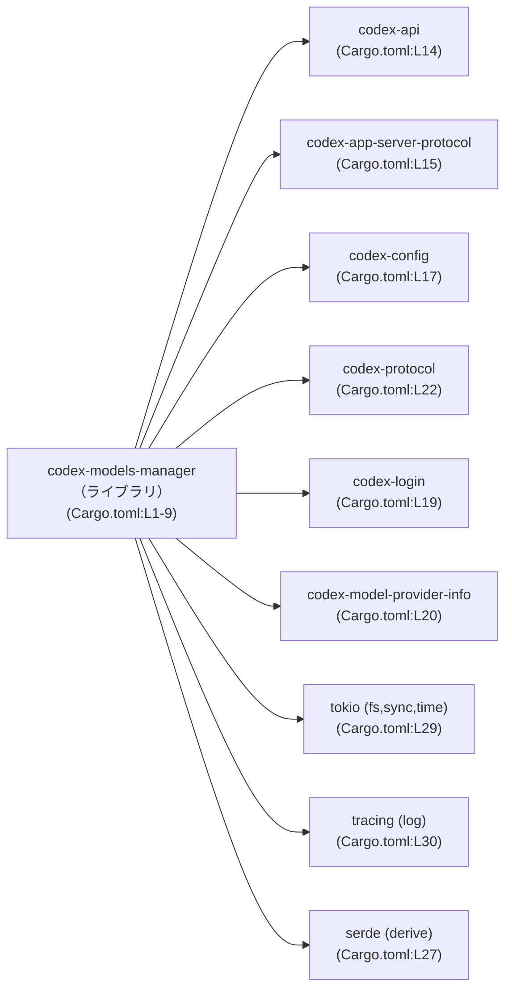
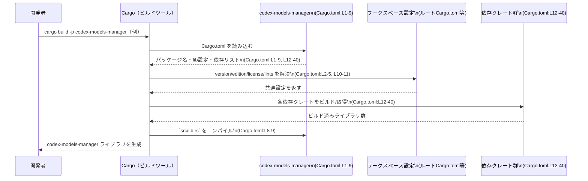

# models-manager/Cargo.toml コード解説

## 0. ざっくり一言

`models-manager/Cargo.toml` は、ライブラリクレート `codex-models-manager` の **パッケージ情報・ライブラリターゲット・依存関係** を定義する Cargo マニフェストです（Cargo.toml:L1-9, L12-40）。

---

## 1. このモジュールの役割

### 1.1 概要

- このファイルは、Rust クレート `codex-models-manager` の **名前・バージョン・ライセンス・エディション** をワークスペース共通設定として参照するパッケージマニフェストです（Cargo.toml:L1-5）。
- ライブラリターゲット `codex_models_manager` と、そのエントリポイント `src/lib.rs` を指定しています（Cargo.toml:L6-9）。
- さらに、本クレートが利用する **実行時依存クレート** と **開発時（テスト用）依存クレート** を列挙しています（Cargo.toml:L12-40）。

このファイル自体は **公開 API やコアロジックの定義を含まず**、それらは `src/lib.rs` などの Rust ソースコード側に存在します（Cargo.toml:L8-9）。

### 1.2 アーキテクチャ内での位置づけ

- `edition.workspace = true` や `version.workspace = true` などから、本クレートは Cargo ワークスペースの一部として管理されています（Cargo.toml:L2, L4-5, L10-11）。
- `[dependencies]` セクションで、同じワークスペース配下と思われる `codex-*` 系クレートや、一般的なライブラリ（`chrono`, `serde`, `tokio`, `tracing` など）に依存していることが分かります（Cargo.toml:L12-30）。
- `[dev-dependencies]` にはテスト支援用のクレート（`core_test_support`, `wiremock`, `pretty_assertions` など）が含まれており、このクレートがテストコードを持つ構成であることが分かります（Cargo.toml:L31-40）。

主要な依存関係に絞った依存グラフは次のようになります。



> この図は **ビルド時の依存関係** を表しており、実行時にどの関数がどのように呼ばれるかまでは、このファイルからは分かりません。

### 1.3 設計上のポイント

この Cargo.toml から読み取れる設計上の特徴は次のとおりです。

- **ワークスペース集中管理**  
  - `edition`, `license`, `version`, さらには `lints` がすべて `workspace = true` で定義されており、これらはワークスペースルートの設定に集約されています（Cargo.toml:L2-5, L10-11）。
- **ライブラリクレートのみ定義**  
  - `[lib]` セクションのみがあり、バイナリターゲット（`[[bin]]`）は定義されていません。このクレートはライブラリとして他クレートから利用される構成です（Cargo.toml:L6-9）。
- **doctest 無効化**  
  - `doctest = false` により、ドキュメントコメント内のサンプルコードをテストとして実行しない設定になっています（Cargo.toml:L7）。
- **非同期・トレーシング対応の可能性**  
  - `tokio`（機能: `fs`, `sync`, `time`）と `tracing`（機能: `log`）を依存に含めており、非同期処理や詳細なログ／トレーシングを利用する設計である可能性がありますが、具体的な使い方はこのファイルからは分かりません（Cargo.toml:L29-30）。
- **シリアライズ・時間管理の利用**  
  - `serde`（`derive` 機能）と `serde_json`, `chrono`（`serde` 機能）などから、構造体のシリアライズ／デシリアライズや日時処理が関わる設計であることが推測されますが、実際にどの型がどのように使われているかはこのチャンクには現れません（Cargo.toml:L13, L27-28）。

---

## 2. 主要な機能一覧

このファイルは **Rust のコードではなく Cargo の設定ファイル** であるため、関数やメソッドとしての「機能」は定義されていません。  
代わりに、このファイルが担う構成上の機能を列挙します。

- パッケージメタデータ定義:  
  `codex-models-manager` というパッケージ名と、ワークスペース共通のエディション・ライセンス・バージョン設定を参照します（Cargo.toml:L1-5）。
- ライブラリターゲットの定義:  
  クレート名 `codex_models_manager` とエントリポイント `src/lib.rs` を定義し、このファイルをルートとするライブラリクレートであることを示します（Cargo.toml:L6-9）。
- ワークスペース共通 Lint 設定の利用:  
  `[lints]` セクションで、Lint 設定をワークスペースから引き継ぐことを指定します（Cargo.toml:L10-11）。
- 実行時依存関係の定義:  
  `chrono`, `codex-api`, `tokio`, `tracing` など、本クレートがビルド・実行に必要とするクレートを列挙します（Cargo.toml:L12-30）。
- 開発時（テスト用）依存関係の定義:  
  `core_test_support`, `wiremock`, `pretty_assertions` など、テストコード・検証に使用されるクレートを定義します（Cargo.toml:L31-40）。

---

## 3. 公開 API と詳細解説

### 3.1 型一覧（構造体・列挙体など）

このファイルには Rust の型定義（構造体・列挙体・トレイトなど）は一切含まれていません。  
型や公開 API は、`[lib]` セクションで指定されている `src/lib.rs` 以降の Rust コード側に定義されていると考えられます（Cargo.toml:L6-9）。

| 名前 | 種別 | 役割 / 用途 | 根拠 |
|------|------|-------------|------|
| なし | なし | Cargo.toml 内に Rust の型定義は存在しません | Cargo.toml:L1-40 |

### 3.2 関数詳細（最大 7 件）

このファイルには **関数やメソッドの定義が存在しない** ため、「関数詳細テンプレート」を適用できる対象はありません。

- 公開 API（関数・メソッド・トレイト実装など）は `src/lib.rs` およびその配下のモジュールに定義されます（Cargo.toml:L8-9）。
- このチャンクにはそれらのコードが含まれていないため、**公開 API のシグネチャ・エラー型・並行性の扱い** などは不明です。

### 3.3 その他の関数

- 補助関数やラッパー関数も、この Cargo.toml からは一切把握できません。
- 関数レベルのインベントリーを作成するには、`src/` 以下の Rust ソースコードが必要です（このチャンクには現れません）。

---

## 4. データフロー

### 4.1 実行時データフローについて

- このファイルは設定情報のみを含むため、**実行時にどのデータがどのコンポーネント間を流れるか** といった情報は読み取れません。
- 実際のデータフローは `src/lib.rs` 以降の実装に依存しており、このチャンクには現れません（Cargo.toml:L8-9）。

### 4.2 ビルド時のフロー（Cargo がこのファイルをどう使うか）

ここでは、この `Cargo.toml` がビルド時にどのように使われるかという「ビルドフロー」を sequence diagram で示します。  
これは **Rust/Cargo の一般的な挙動** に基づく説明であり、実行時のビジネスロジックの流れではありません。



---

## 5. 使い方（How to Use）

### 5.1 基本的な使用方法（このクレート側）

このファイルはすでに `codex-models-manager` パッケージを定義しているので、**このクレートをビルド／テストする基本的な使い方** は次のようになります。

#### ビルド・テストの例

```bash
# ワークスペースルートで、このクレートだけをビルドする例
cargo build -p codex-models-manager

# このクレートのテストを実行する例
cargo test -p codex-models-manager
```

- ここで指定している `codex-models-manager` は `[package]` セクションの `name` に対応します（Cargo.toml:L4）。

### 5.1 補足: 他クレートから依存として使う場合の例

このクレートの公開 API 内容は不明ですが、一般的には次のように `Cargo.toml` から依存として参照します。

```toml
[dependencies]
# 同じワークスペース内の別クレートから相対パスで参照する一例
codex-models-manager = { path = "../models-manager" }
```

> 上記の `path` はあくまで例です。実際のパスはプロジェクト構成によって異なります（このチャンクにはディレクトリ構造が現れていません）。

コード側では、`[lib]` セクションで定めたクレート名 `codex_models_manager` を `use` で利用します（Cargo.toml:L8）。

```rust
// クレート名は lib.name の `codex_models_manager` を使います（Cargo.toml:L8）。
// どのモジュールや関数が存在するかは、このチャンクには現れません。
use codex_models_manager; // 公開 API の詳細は src/lib.rs 側に依存します
```

### 5.3 よくある使用パターン（Cargo.toml 編集観点）

このファイルの編集（このクレートに変更を加える）という観点でのパターンです。

- **依存クレートの追加**  
  新しい外部クレートを利用したい場合は `[dependencies]` に行を追加します（Cargo.toml:L12-30）。

  ```toml
  [dependencies]
  chrono = { workspace = true, features = ["serde"] }        # 既存（Cargo.toml:L13）
  my-new-crate = "1.2"                                      # 例: 新規追加
  ```

- **機能（feature）の追加・変更**  
  すでに依存しているクレートの機能セットを変更する場合、`features = [...]` を編集します。  
  例えば `tokio` の機能を増やす例（元は `["fs", "sync", "time"]`）:

  ```toml
  tokio = { workspace = true, features = ["fs", "sync", "time", "rt-multi-thread"] }
  ```

  > 実際にこの機能が必要かどうかは、`src/` 以下のコードを確認する必要があります。このチャンクにはコードが現れません。

### 5.3 よくある間違い

#### 1. クレート名とパッケージ名の混同

- パッケージ名: `codex-models-manager`（Cargo.toml:L4）
- クレート名（lib.name）: `codex_models_manager`（Cargo.toml:L8）

Rust の `use` では **ハイフンを含む名前は使えない** ため、次のような誤りが起こりえます。

```rust
// 誤りの例: パッケージ名をそのまま書いてしまう
// use codex-models-manager::*; // コンパイルエラー

// 正しい例: lib.name で定めたクレート名を使う
use codex_models_manager::*; // Cargo.toml:L8 に対応
```

#### 2. workspace 設定の上書き

`edition.workspace = true` などに対して、個別に値を追加してしまう誤りが考えられます。

```toml
[package]
edition.workspace = true
edition = "2021" # ← こうした二重指定は混乱の元になる
```

- 実際のファイルではこのような二重定義はされておらず（Cargo.toml:L1-5）、ワークスペース側の設定に一元化されています。
- 変更する場合は **ワークスペースルートの設定を見直す** のが筋になります（このチャンクにはルートファイルは現れません）。

### 5.4 使用上の注意点（まとめ）

- **公開 API の理解には Rust ソースが必須**  
  このファイルだけでは関数・型・エラー型・スレッド安全性などは分かりません。`src/lib.rs` 以降を併せて読む必要があります（Cargo.toml:L8-9）。
- **workspace 設定の前提**  
  `edition`, `license`, `version`, `lints`, 多くの依存クレートが `workspace = true` を使っているため、ワークスペース全体の設定変更がこのクレートにも影響します（Cargo.toml:L2-5, L10-11, L13-39）。
- **依存削除の際はコード確認が必須**  
  不要に見える依存を削除する前に、`src/` 以下のコードで実際に使われていないかを検索する必要があります。このチャンクだけでは判断できません。

---

## 6. 変更の仕方（How to Modify）

### 6.1 新しい機能を追加する場合（Cargo.toml 観点）

このクレートに新しい機能を実装する際、Cargo.toml で必要になる変更のパターンを示します。

1. **必要な外部クレートの洗い出し**  
   - 実装したい機能に必要なライブラリ（例: 新しいプロトコル用クレートなど）を決めます。
2. **[dependencies] への追加**  
   - 新しい依存クレートを `[dependencies]` に追記します（Cargo.toml:L12-30）。
3. **ワークスペースでの一元管理可否の確認**  
   - すでにワークスペースに同じクレートがあれば、`workspace = true` で共通バージョンに合わせる設計にするかどうか検討します（Cargo.toml:L13-29 の多くがその形）。
4. **`src/lib.rs` への実装追加**  
   - 実際の機能や公開 API は `src/lib.rs` 以降に追加します（Cargo.toml:L8-9）。  
     この部分はこのチャンクには含まれません。
5. **テスト用依存が必要な場合は [dev-dependencies] に追加**  
   - HTTP モックが必要なら `wiremock` のようなクレートを追加するといったパターンです（Cargo.toml:L31-40）。

### 6.2 既存の機能を変更・削除する場合（Cargo.toml 観点）

- **依存クレートの削除・バージョン変更**

  - 手順:
    1. `src/` 以下のコードから対象クレートの利用箇所を検索します。
    2. 参照がなければ、`[dependencies]` または `[dev-dependencies]` から該当行を削除します（Cargo.toml:L12-40）。
    3. `cargo build -p codex-models-manager` でビルドが通るか確認します。

- **tokio / tracing の機能変更**

  - `tokio` や `tracing` の features を減らす・増やす場合は、実装側で該当機能が使われていないかを慎重に確認する必要があります（Cargo.toml:L29-30）。
  - 特に並行性・非同期 I/O に関わる設定は、間違えるとビルドエラーやランタイムエラーにつながりますが、その具体的なパターンはこのチャンクからは分かりません。

- **Contracts / Edge Cases（契約・エッジケース）**

  - Cargo.toml のレベルでは、バージョン指定や feature 指定が「契約」に相当します。
  - 例えば `serde` に `derive` を付けていることは、「コード側が派生マクロを利用する前提」があることを意味します（Cargo.toml:L27）。
  - しかし、どの型に `Serialize` / `Deserialize` を derive しているかなどは、このチャンクには現れません。

---

## 7. 関連ファイル

このファイルと密接に関係すると思われるファイル・ディレクトリをまとめます。

| パス | 役割 / 関係 | 根拠 |
|------|------------|------|
| `src/lib.rs` | ライブラリクレート `codex_models_manager` のエントリポイント。公開 API やコアロジックはここから始まると考えられます。 | Cargo.toml:L6-9 |
| （ワークスペースルートの）`Cargo.toml` | `edition.workspace = true` などの設定と、`workspace = true` な依存クレートのバージョン・機能を定義しているファイル。パスはこのチャンクには現れません。 | Cargo.toml:L2-5, L13-39 |
| `src/` 以下の各モジュール | 実際のモデル管理ロジック、公開 API、エラー処理、並行性制御などのコードが存在する場所。具体的な構成はこのチャンクには現れません。 | Cargo.toml:L8-9 |
| `tests/` または `src/` 内のテストモジュール | `core_test_support`, `wiremock`, `pretty_assertions` などの dev-dependencies を利用するテストコードが配置される場所と考えられますが、実在するかどうかや具体的なパスはこのチャンクには現れません。 | Cargo.toml:L31-40 |

---

### Bugs / Security / Performance について（このファイルから分かる範囲）

- **Bugs**  
  - 設定として明らかに破綻している箇所（重複キーや構文エラーなど）は、このチャンクの内容からは見当たりません（Cargo.toml:L1-40）。
- **Security**  
  - セキュリティに直接関わる設定（秘密情報、鍵、許可設定など）は含まれておらず、このファイル単体からセキュリティ上の問題は読み取れません。
- **Performance / Scalability**  
  - パフォーマンス・スケーラビリティに直接関わるのは主に実装コード側ですが、このファイルから読み取れるのは `tokio` による非同期処理の利用可能性程度です（Cargo.toml:L29）。  
    具体的なパフォーマンス特性やボトルネックは、このチャンクには現れません。
