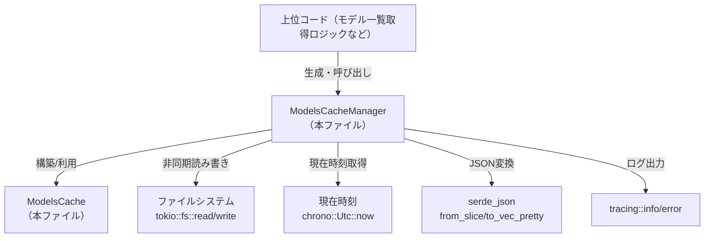
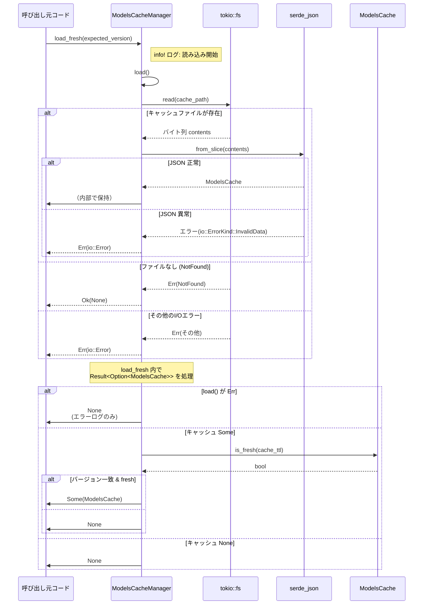

# models-manager/src/cache.rs

## 0. ざっくり一言

ディスク上の JSON ファイルとして OpenAI モデル一覧をキャッシュし、  
TTL（有効期限）とクライアントバージョンに基づいてキャッシュを読み書きする非同期キャッシュマネージャです。  
（根拠: `ModelsCacheManager` / `ModelsCache` 定義とそれに付随するメソッド全体。行番号情報はこのチャンクには含まれていません）

---

## 1. このモジュールの役割

### 1.1 概要

- このモジュールは、**モデル情報一覧をディスクにキャッシュ**し、**有効なキャッシュがあれば再利用する**ために存在します。
- 主な機能は:
  - JSON ファイルの読み書き（`tokio::fs` と `serde_json` を使用）
  - TTL とクライアントバージョンに基づく「新鮮さ」の判定
  - テスト用にキャッシュの内容やタイムスタンプを操作するユーティリティの提供  
（根拠: `ModelsCacheManager` の `load_fresh`, `persist_cache`, `renew_cache_ttl` と `ModelsCache::is_fresh`）

### 1.2 アーキテクチャ内での位置づけ

上位レイヤからは「モデルキャッシュを扱うコンポーネント」として利用され、  
ファイルシステム・時刻・JSON シリアライズなどの詳細をカプセル化しています。



- `codex_protocol::openai_models::ModelInfo` はキャッシュ対象データの型として利用されています（詳細は外部クレート側で定義、パスはこのチャンクからは不明）。

### 1.3 設計上のポイント

- **責務の分割**
  - `ModelsCacheManager` が「I/O と TTL/バージョン判定」を担当
  - `ModelsCache` が「キャッシュデータの構造」と「新鮮さ判定ロジック（`is_fresh`）」を担当
- **状態管理**
  - マネージャは `cache_path`（キャッシュファイルパス）と `cache_ttl`（TTL）だけを内部状態として保持し、モデル一覧自体は保持しません。
- **エラーハンドリング**
  - I/O エラーや JSON パースエラーは `io::Result` として扱い、呼び出し側に返すか、`load_fresh` ではログ出力して `None` に変換します。
  - キャッシュが存在しない場合は `Option` で表現（`Ok(None)` / `None`）。
- **非同期 I/O**
  - `tokio::fs` を利用した非同期ファイル I/O を行い、`async fn` と `await` によって Rust の非同期ランタイム上で動作します。
- **安全性**
  - `unsafe` ブロックはなく、エラーケースはすべて `Result` / `Option` / `let ... else` 構文でハンドリングされています。
- **並行性**
  - メソッドは主に `&self` を受け取り、内部にミュータブルな共有状態はありません（TTL 変更用に `&mut self` を取るテスト専用メソッドはあります）。
  - ファイルロックは行っていないため、複数タスク／プロセスから同じパスにアクセスした場合の振る舞いは OS 依存になります（このファイルのコードから読める事実）。

（根拠: `ModelsCacheManager` のフィールド・メソッド定義、`ModelsCache` および `is_fresh` 実装）

---

## 2. 主要な機能一覧

- モデルキャッシュの読み込み（`load_fresh`）
- モデルキャッシュの保存（`persist_cache`）
- キャッシュ TTL の延長（`renew_cache_ttl`）
- キャッシュファイルの内部読み込み（`load`）
- キャッシュファイルの内部保存（`save_internal`）
- キャッシュが TTL 内かどうかの判定（`ModelsCache::is_fresh`）
- テスト用 TTL 設定（`set_ttl`、`cfg(test)`）
- テスト用に `fetched_at` やキャッシュ全体を任意に書き換えるユーティリティ（`manipulate_cache_for_test`, `mutate_cache_for_test`、`cfg(test)`）

（根拠: 各関数のシグネチャと内部実装）

---

## 3. 公開 API と詳細解説

### 3.1 型一覧（構造体・列挙体など）

| 名前 | 種別 | 可視性 | 役割 / 用途 |
|------|------|--------|-------------|
| `ModelsCacheManager` | 構造体 | `pub(crate)` | キャッシュファイルのパスと TTL を保持し、キャッシュの読み書き・新鮮さ判定を行うマネージャ |
| `ModelsCache` | 構造体 | `pub(crate)` | ディスク上に JSON として保存されるキャッシュスナップショット（メタデータ + `Vec<ModelInfo>`） |

#### コンポーネントインベントリー（関数 / メソッド一覧）

| 名称 | 所属 | 可視性 | 戻り値 | 概要 |
|------|------|--------|--------|------|
| `ModelsCacheManager::new` | `ModelsCacheManager` | `pub(crate)` | `Self` | パスと TTL を指定してマネージャを生成 |
| `ModelsCacheManager::load_fresh` | `ModelsCacheManager` | `pub(crate)` | `Option<ModelsCache>` | キャッシュを読み込み、バージョン一致かつ TTL 内なら返す |
| `ModelsCacheManager::persist_cache` | `ModelsCacheManager` | `pub(crate)` | `()` | 与えられたモデル一覧を新しいキャッシュとして保存 |
| `ModelsCacheManager::renew_cache_ttl` | `ModelsCacheManager` | `pub(crate)` | `io::Result<()>` | 既存キャッシュの `fetched_at` を現在時刻に更新 |
| `ModelsCacheManager::load` | `ModelsCacheManager` | private | `io::Result<Option<ModelsCache>>` | ファイルを読み、存在しない場合は `Ok(None)`、あれば JSON デコードして返す |
| `ModelsCacheManager::save_internal` | `ModelsCacheManager` | private | `io::Result<()>` | 親ディレクトリを必要に応じて作成し、キャッシュを JSON として書き出し |
| `ModelsCacheManager::set_ttl` | `ModelsCacheManager` | `pub(crate)` (`cfg(test)`) | `()` | テスト用に TTL を変更 |
| `ModelsCacheManager::manipulate_cache_for_test` | `ModelsCacheManager` | `pub(crate)` (`cfg(test)`) | `io::Result<()>` | テスト用に `fetched_at` をクロージャで任意に変更 |
| `ModelsCacheManager::mutate_cache_for_test` | `ModelsCacheManager` | `pub(crate)` (`cfg(test)`) | `io::Result<()>` | テスト用にキャッシュ全体をクロージャで任意に変更 |
| `ModelsCache::is_fresh` | `ModelsCache` | private | `bool` | TTL に対してキャッシュがまだ有効かどうかを判定 |

（根拠: 各 `impl` ブロック内のメソッド定義）

---

### 3.2 関数詳細

#### `ModelsCacheManager::new(cache_path: PathBuf, cache_ttl: Duration) -> ModelsCacheManager`

**概要**

- キャッシュファイルへのパスと TTL を受け取り、`ModelsCacheManager` インスタンスを生成します。

**引数**

| 引数名 | 型 | 説明 |
|--------|----|------|
| `cache_path` | `PathBuf` | キャッシュファイルを読み書きするパス |
| `cache_ttl` | `Duration` | キャッシュの有効期限を表す標準ライブラリの時間 |

**戻り値**

- `ModelsCacheManager` の新しいインスタンス。フィールドに引数をそのまま格納します。

**内部処理の流れ**

1. 構造体リテラル `Self { cache_path, cache_ttl }` でフィールドに引数を代入するだけの単純なコンストラクタです。

**Examples（使用例）**

```rust
use std::path::PathBuf;
use std::time::Duration;
// 同じクレート内での利用を想定
use crate::cache::ModelsCacheManager;

let cache_path = PathBuf::from("/tmp/models_cache.json");          // キャッシュファイルパス
let ttl = Duration::from_secs(3600);                               // 1時間のTTL
let manager = ModelsCacheManager::new(cache_path, ttl);            // マネージャ生成
```

**Errors / Panics**

- エラーや panic を発生させる処理はありません。

**Edge cases（エッジケース）**

- `cache_ttl` が 0 秒でも生成は可能です。この場合、後述の `is_fresh` によりキャッシュは常に「古い」と判定されます。

**使用上の注意点**

- `cache_path` は呼び出し側が妥当なパスを指定する前提です。このモジュール内ではパスの妥当性チェックは行っていません。

---

#### `ModelsCacheManager::load_fresh(&self, expected_version: &str) -> Option<ModelsCache>`

**概要**

- キャッシュファイルを読み込み、
  - I/O/JSON エラーがなく
  - `client_version` が `expected_version` と一致し
  - TTL 内であれば  
  `Some(ModelsCache)` を返し、それ以外の場合は `None` を返します。
- エラー内容は `tracing::error!` でログに出力されますが、呼び出し側には伝播しません。

**引数**

| 引数名 | 型 | 説明 |
|--------|----|------|
| `&self` | `&ModelsCacheManager` | キャッシュ設定（パスと TTL）を参照 |
| `expected_version` | `&str` | 期待するクライアントバージョン文字列 |

**戻り値**

- `Option<ModelsCache>`  
  - `Some(cache)` : バージョン一致かつ TTL 内のキャッシュが存在する場合  
  - `None` : キャッシュファイルがない／JSON が壊れている／バージョン不一致／TTL 超過など、いずれかの条件に該当する場合

**内部処理の流れ**

1. `tracing::info!` で読み込み開始ログを出力。
2. 内部メソッド `self.load().await` を呼び出し、`io::Result<Option<ModelsCache>>` を取得。
   - `Err(err)` の場合は `tracing::error!` を出し、`None` を返して終了。
   - `Ok(cache_opt)` の場合は `cache_opt?` によって `Option` の `None` をそのまま `None` として早期リターン（`?` 演算子の Option 版）。
3. 取得した `cache` について、ログ出力（キャッシュバージョンと `fetched_at`）。
4. `cache.client_version.as_deref() != Some(expected_version)` の場合:
   - バージョン不一致ログを出して `None` を返す。
5. `!cache.is_fresh(self.cache_ttl)` の場合:
   - TTL 超過ログを出して `None` を返す。
6. 上記をすべて通過した場合:
   - キャッシュヒットログを出して `Some(cache)` を返す。

**Examples（使用例）**

```rust
use std::path::PathBuf;
use std::time::Duration;
use crate::cache::ModelsCacheManager;

# async fn example() -> anyhow::Result<()> {
let manager = ModelsCacheManager::new(PathBuf::from("/tmp/models_cache.json"),
                                      Duration::from_secs(3600));  // 1時間TTL
let expected_version = "1.2.3";

if let Some(cache) = manager.load_fresh(expected_version).await {  // キャッシュ読み込み
    // cache.models から ModelInfo の一覧を利用する
    println!("Loaded {} models from cache", cache.models.len());
} else {
    // キャッシュが使えなかったので、APIなどから取得する処理にフォールバック
}
# Ok(()) }
```

**Errors / Panics**

- I/O/JSON エラーは内部で `error!` ログを出すだけで、戻り値としては `None` になります。
- panic を起こすような処理はありません。

**Edge cases（エッジケース）**

- キャッシュファイルが存在しない場合（`ErrorKind::NotFound`）:
  - `self.load()` が `Ok(None)` を返し、その結果 `None` がそのまま返ります。
- JSON が壊れている／`serde_json::from_slice` が失敗する場合:
  - `load()` が `Err(io::ErrorKind::InvalidData)` を返し、`load_fresh` 内でログを出して `None` を返します。
- `client_version` が `None` の場合:
  - `as_deref()` により `Option<&str>` となり、`Some(expected_version)` と一致しないため、常に `None`（キャッシュ無効）扱いになります。
- TTL が 0 の場合:
  - `is_fresh` が必ず `false` を返すため、常に `None` になります。
- `fetched_at` が現在時刻より未来に設定されている場合:
  - `age` が負の値（`Utc::now().signed_duration_since(self.fetched_at)`）となり、正の TTL と比較して `age <= ttl_duration` となるため、キャッシュは「新鮮」と判定されます。

**使用上の注意点**

- キャッシュが使えなかった理由（ファイルなし／壊れている／TTL 超過／バージョン不一致）は戻り値だけからは区別できません。必要であれば `tracing` のログ出力を利用します。
- 非同期関数のため、`tokio` などの非同期ランタイム上で `.await` する必要があります。

---

#### `ModelsCacheManager::persist_cache(&self, models: &[ModelInfo], etag: Option<String>, client_version: String)`

**概要**

- 現在の時刻を `fetched_at` とし、引数のモデル一覧・ETag・クライアントバージョンを含む `ModelsCache` を作成してディスクに保存します。
- エラーは `tracing::error!` にログ出力され、呼び出し側には通知されません。

**引数**

| 引数名 | 型 | 説明 |
|--------|----|------|
| `&self` | `&ModelsCacheManager` | キャッシュファイルのパスと TTL を保持 |
| `models` | `&[ModelInfo]` | キャッシュ対象となるモデル情報一覧 |
| `etag` | `Option<String>` | HTTP ETag など、キャッシュ検証用のメタデータ |
| `client_version` | `String` | このキャッシュを生成したクライアントのバージョン |

**戻り値**

- なし（`()`）。成功／失敗は戻り値では判別できません。

**内部処理の流れ**

1. `ModelsCache` インスタンスを構築:
   - `fetched_at: Utc::now()`
   - `etag` はそのまま格納
   - `client_version: Some(client_version)`
   - `models: models.to_vec()` でスライスを所有権を持つ `Vec` にコピー
2. 内部メソッド `self.save_internal(&cache).await` を呼び出し。
   - `Err(err)` の場合は `tracing::error!` でログに出し、関数としては何も返さず終了。

**Examples（使用例）**

```rust
use std::path::PathBuf;
use std::time::Duration;
use crate::cache::ModelsCacheManager;
use codex_protocol::openai_models::ModelInfo;

# async fn example(models: Vec<ModelInfo>) -> anyhow::Result<()> {
let manager = ModelsCacheManager::new(PathBuf::from("/tmp/models_cache.json"),
                                      Duration::from_secs(3600));

manager
    .persist_cache(&models, Some("W/\"etag-value\"".to_string()), "1.2.3".to_string())
    .await;                                                  // エラーはログにのみ出る

# Ok(()) }
```

**Errors / Panics**

- `save_internal` 内の I/O/シリアライズエラーは `tracing::error!` にログ出力されるだけで、戻り値からは分かりません。
- panic を発生させる処理はありません。

**Edge cases**

- `etag` が `None` の場合:
  - シリアライズ時には `#[serde(default, skip_serializing_if = "Option::is_none")]` によりフィールド自体が JSON から省略されます。
- `models` が空スライスでも、そのまま空配列として保存されます。

**使用上の注意点**

- 呼び出し側は、保存に失敗しても検出できない設計です。確実な永続化の成否を知りたい場合は、`save_internal` を直接呼び出すなど別の設計が必要になります（このファイルにはそのような公開 API は定義されていません）。
- 重い I/O のため、頻繁な呼び出しには注意が必要です（毎回 JSON を全てシリアライズして書き込みます）。

---

#### `ModelsCacheManager::renew_cache_ttl(&self) -> io::Result<()>`

**概要**

- すでに存在するキャッシュの `fetched_at` を現在時刻に更新し、TTL を「延長」する関数です。
- キャッシュが存在しない場合は `ErrorKind::NotFound` を返します。

**引数**

| 引数名 | 型 | 説明 |
|--------|----|------|
| `&self` | `&ModelsCacheManager` | キャッシュ設定を参照 |

**戻り値**

- `io::Result<()>`
  - `Ok(())` : 成功（既存キャッシュの `fetched_at` を更新して保存できた）
  - `Err(e)` : ファイル入出力エラーまたはキャッシュ未存在 (`ErrorKind::NotFound`)

**内部処理の流れ**

1. `self.load().await?` でキャッシュを読み込む。
   - I/O エラー発生時は即座に `Err` を返す（`?`）。
2. `match` で `Option<ModelsCache>` を判定:
   - `Some(cache)` であれば `cache` を `mut` 変数に束縛。
   - `None` の場合は `io::Error::new(ErrorKind::NotFound, "cache not found")` を返す。
3. `cache.fetched_at = Utc::now();` で現在時刻に更新。
4. `self.save_internal(&cache).await` の結果をそのまま返す。

**Examples（使用例）**

```rust
use std::path::PathBuf;
use std::time::Duration;
use crate::cache::ModelsCacheManager;

# async fn example() -> std::io::Result<()> {
let manager = ModelsCacheManager::new(PathBuf::from("/tmp/models_cache.json"),
                                      Duration::from_secs(3600));

match manager.renew_cache_ttl().await {
    Ok(()) => {
        // TTLの更新に成功
    }
    Err(err) if err.kind() == std::io::ErrorKind::NotFound => {
        // キャッシュファイルが存在しなかった
    }
    Err(err) => {
        // 読み込み・書き込み・JSONエラーなど
        eprintln!("failed to renew cache ttl: {err}");
    }
}

# Ok(()) }
```

**Errors / Panics**

- I/O エラー（`fs::read`, `fs::write`, `create_dir_all`）およびシリアライズ／デシリアライズエラーは `io::Error` としてそのまま返されます。
- キャッシュファイルが存在しない場合は独自に `ErrorKind::NotFound` で `io::Error` を生成して返します。
- panic を起こす処理はありません。

**Edge cases**

- キャッシュファイルが存在するが JSON が壊れている場合:
  - `serde_json::from_slice` が失敗し、`ErrorKind::InvalidData` の `io::Error` として返されます。
- `cache_ttl` が 0 でも、`renew_cache_ttl` 自体は問題なく動作します（キャッシュはその直後から `is_fresh` によって「古い」と判定されます）。

**使用上の注意点**

- この関数は TTL のみを更新し、モデル一覧やバージョン、ETag には手を触れません。
- TTL 延長だけでよいケース（内容の再取得が不要な場合）に適しています。

---

#### `ModelsCacheManager::load(&self) -> io::Result<Option<ModelsCache>>`（内部用）

**概要**

- キャッシュファイルを読み込み、存在しなければ `Ok(None)`、存在して正しく JSON であれば `Ok(Some(ModelsCache))` を返します。

**引数 / 戻り値**

- `&self`
- `io::Result<Option<ModelsCache>>`（前述）

**内部処理の流れ**

1. `fs::read(&self.cache_path).await` でファイルの内容を `Vec<u8>` として読み込む。
2. パターンマッチ:
   - `Ok(contents)` の場合:
     - `serde_json::from_slice(&contents)` で `ModelsCache` にデコード。
     - 失敗した場合は `io::ErrorKind::InvalidData` で `io::Error` を生成して返す。
     - 成功した場合は `Ok(Some(cache))` を返す。
   - `Err(err)` かつ `err.kind() == ErrorKind::NotFound` の場合:
     - `Ok(None)` を返す。
   - それ以外の `Err(err)` の場合:
     - そのまま `Err(err)` を返す。

**使用上の注意点**

- `load_fresh` や `renew_cache_ttl` からのみ呼ばれており、外部からは直接利用できません（private メソッド）。

---

#### `ModelsCacheManager::save_internal(&self, cache: &ModelsCache) -> io::Result<()>`（内部用）

**概要**

- 必要に応じて親ディレクトリを作成し、`ModelsCache` を JSON（整形済み）としてファイルに書き出します。

**内部処理の流れ**

1. `self.cache_path.parent()` を取得し、`Some(parent)` の場合:
   - `fs::create_dir_all(parent).await?` でディレクトリを作成（既に存在する場合も OK）。
2. `serde_json::to_vec_pretty(cache)` で `Vec<u8>` の JSON にシリアライズ。
   - 失敗時は `ErrorKind::InvalidData` の `io::Error` にラップして返す。
3. `fs::write(&self.cache_path, json).await` で書き込み、その結果を返す。

**使用上の注意点**

- `persist_cache` と `renew_cache_ttl`、およびテスト用メソッドから利用されています。
- シリアライズは pretty-print で行われるため、サイズと速度より可読性重視の形式です。

---

#### `ModelsCache::is_fresh(&self, ttl: Duration) -> bool`

**概要**

- キャッシュ生成時刻 `fetched_at` と現在時刻の差分を計算し、TTL 以内であれば `true` を返します。

**引数**

| 引数名 | 型 | 説明 |
|--------|----|------|
| `&self` | `&ModelsCache` | 判定対象のキャッシュ |
| `ttl` | `Duration` | 有効期限（標準ライブラリの Duration） |

**戻り値**

- `bool`
  - `true` : `fetched_at` から TTL 内
  - `false` : TTL が 0、変換失敗、または TTL を超過している場合

**内部処理の流れ**

1. `ttl.is_zero()` が `true` なら `false` を返す（TTL 0 は常に「古い」）。
2. `chrono::Duration::from_std(ttl)` を `let Ok(ttl_duration) = ... else { return false; };` で変換。
   - 変換に失敗した場合は `false` を返す。
3. `let age = Utc::now().signed_duration_since(self.fetched_at);` で経過時間を算出。
4. `age <= ttl_duration` の真偽をそのまま返す。

**Examples（使用例）**

（内部利用のみですが、概念的な例を示します）

```rust
use std::time::Duration;
use chrono::Utc;
use crate::cache::ModelsCache;

let cache = ModelsCache {
    fetched_at: Utc::now(),
    etag: None,
    client_version: Some("1.2.3".to_string()),
    models: Vec::new(),
};

let ttl = Duration::from_secs(300);
assert!(cache.is_fresh(ttl));        // 生成直後なので true になる
```

**Edge cases**

- TTL 0: 常に `false`。
- `chrono::Duration::from_std(ttl)` が失敗するほど大きい/異常な TTL:
  - `false` を返し、キャッシュは常に「古い」扱いになります。
- `fetched_at` が未来:
  - `age` が負になり、TTL が正であれば `age <= ttl_duration` が真になるため、「新鮮」と判定されます。

**使用上の注意点**

- 時刻は `Utc::now()` に依存しているため、システムクロックが大きく進んだり戻ったりすると判定に影響します。

---

### 3.3 その他の関数（テスト専用）

| 関数名 | 役割（1 行） |
|--------|--------------|
| `ModelsCacheManager::set_ttl(&mut self, ttl: Duration)` | テスト内で `cache_ttl` を差し替えるためのセッター |
| `ModelsCacheManager::manipulate_cache_for_test<F>(&self, f: F)` | 既存キャッシュの `fetched_at` をクロージャで任意に変更し、保存する |
| `ModelsCacheManager::mutate_cache_for_test<F>(&self, f: F)` | 既存キャッシュ全体をクロージャで任意に変更し、保存する |

いずれも `cfg(test)` 付きのため、通常ビルドではコンパイルされません。  
（根拠: 各メソッドに `#[cfg(test)]` が付与されている）

---

## 4. データフロー

ここでは代表的なシナリオとして、`load_fresh` を呼び出してキャッシュを取得する流れを示します。

### 4.1 キャッシュ読み込みのシーケンス



- ネットワークからの再取得などはこのファイルには含まれていないため、図には登場しません。
- `renew_cache_ttl` やテスト用メソッドは同じ `load` / `save_internal` を通じてファイルを読み書きします。

---

## 5. 使い方（How to Use）

### 5.1 基本的な使用方法

典型的には「キャッシュを試し、失敗したらAPIから取得してキャッシュを更新する」という流れになります。

```rust
use std::path::PathBuf;
use std::time::Duration;
use codex_protocol::openai_models::ModelInfo;
use crate::cache::ModelsCacheManager;

#[tokio::main]
async fn main() -> anyhow::Result<()> {
    // 1. マネージャの初期化
    let cache_path = PathBuf::from("/tmp/models_cache.json");          // キャッシュファイルの場所
    let ttl = Duration::from_secs(3600);                               // 1時間TTL
    let manager = ModelsCacheManager::new(cache_path, ttl);

    let expected_version = "1.2.3";                                    // 現在のクライアントバージョン

    // 2. キャッシュから読み込みを試みる
    let models: Vec<ModelInfo> = if let Some(cache) =
        manager.load_fresh(expected_version).await
    {
        cache.models                                                   // キャッシュを利用
    } else {
        // ここはこのファイル外のロジック（API呼び出しなど）
        let fetched: Vec<ModelInfo> = fetch_models_from_api().await?;  // 仮の関数

        // 新しいキャッシュを保存（エラーはログのみ）
        manager
            .persist_cache(&fetched, None, expected_version.to_string())
            .await;

        fetched
    };

    // 3. models を利用する
    println!("models count: {}", models.len());
    Ok(())
}

// ダミーの関数（実際には別モジュールで定義される想定）
async fn fetch_models_from_api() -> anyhow::Result<Vec<ModelInfo>> {
    unimplemented!()
}
```

### 5.2 よくある使用パターン

1. **TTL のみ延長したい場合**

   - モデル内容・バージョンは変えず、キャッシュ期限だけ延ばす場合に `renew_cache_ttl` を使います。

   ```rust
   use std::path::PathBuf;
   use std::time::Duration;
   use crate::cache::ModelsCacheManager;

   # async fn extend_ttl() -> std::io::Result<()> {
   let manager = ModelsCacheManager::new(PathBuf::from("/tmp/models_cache.json"),
                                         Duration::from_secs(3600));

   // エラーは Result で受け取れる
   manager.renew_cache_ttl().await?;
   # Ok(()) }
   ```

2. **テストで TTL 依存の挙動を確認する**

   - `cfg(test)` メソッドを用いて、任意の `fetched_at` や TTL を設定して挙動を確認できます。

   ```rust
   #[tokio::test]
   async fn cache_becomes_stale_after_ttl() -> std::io::Result<()> {
       use std::time::Duration;
       use chrono::{Duration as ChronoDuration, Utc};
       use crate::cache::ModelsCacheManager;
       use std::path::PathBuf;

       let mut manager = ModelsCacheManager::new(PathBuf::from("/tmp/cache.json"),
                                                 Duration::from_secs(3600));

       // TTLを短くセット
       manager.set_ttl(Duration::from_secs(10));

       // いったん何かしらのキャッシュを書いておく（省略）

       // fetched_at を過去にずらす
       manager.manipulate_cache_for_test(|fetched_at| {
           *fetched_at = Utc::now() - ChronoDuration::seconds(100);
       }).await?;

       // load_freshが None を返すかどうかをテストする、など
       Ok(())
   }
   ```

### 5.3 よくある間違いとその結果

```rust
// 間違い例: TTL 0 で「常に最新のキャッシュを使う」つもり
let manager = ModelsCacheManager::new(cache_path, Duration::from_secs(0));
// この設定では is_fresh が常に false になるため、load_fresh は常に None を返す

// 正しい例: キャッシュを使いたい期間に応じたTTLを設定する
let manager = ModelsCacheManager::new(cache_path, Duration::from_secs(300)); // 5分間のみ有効
```

```rust
// 間違い例: persist_cache の失敗を検出できると思い込む
manager.persist_cache(&models, None, version.to_string()).await?; // ? でエラーを扱おうとしてもコンパイルエラー

// 正しい例: persist_cache はエラーを返さないので、ログで確認する前提で使う
manager.persist_cache(&models, None, version.to_string()).await;
```

### 5.4 使用上の注意点（まとめ）

- **非同期ランタイム依存**
  - すべての I/O 関数は `async fn` であり、`tokio` ランタイムなどの上で `.await` する必要があります。
- **エラーの取り扱い**
  - `load_fresh` と `persist_cache` はエラーを呼び出し側に返さず、ログに出すだけです。
  - エラー詳細が必要なケースでは `load` や `save_internal` を利用するような別 API が必要になりますが、このファイルでは公開されていません。
- **並行性**
  - 同じ `ModelsCacheManager` を複数タスクから同時に呼び出した場合でも、内部にミュータブルな共有状態はありません。
  - 一方で、ファイルロックを行っていないため、別プロセス／別タスクが同じ `cache_path` を同時に書き換えた場合のファイル内容は OS に依存した結果になります。
- **セキュリティ**
  - JSON は平文で保存され、ファイルパーミッションの設定は行っていません（OS のデフォルトに依存）。
  - キャッシュパスに機密情報を含まないこと、必要に応じてファイルパーミッションを別途制御することが前提です（このファイルでは扱っていません）。

---

## 6. 変更の仕方（How to Modify）

### 6.1 新しい機能を追加する場合

例: キャッシュサイズやモデル数の統計情報を取得する API を追加したい場合

1. **データ構造の確認**
   - `ModelsCache` に必要なフィールドがあるか確認し、なければフィールドを追加する。
   - シリアライズに影響するため、`#[serde(...)]` 属性を適宜付与する。
2. **読み取り専用の API を追加**
   - `impl ModelsCacheManager` に `pub(crate)` メソッドを追加し、内部で `self.load()` を呼び出して `Option<ModelsCache>` を扱う。
3. **エラー・Option の扱い方針を決める**
   - 既存の `load_fresh` のようにエラーを潰して `None` にするか、`io::Result` を返すかを用途に応じて選択する。

### 6.2 既存の機能を変更する場合

- **影響範囲の確認**
  - `ModelsCacheManager` のメソッドは crate 内から呼び出されている可能性があるため、`rg` などで呼び出し箇所を検索してから変更する必要があります（このチャンクには呼び出し側コードは含まれていません）。
- **契約（前提条件・返り値）の保持**
  - 例えば `load_fresh` は「何らかの理由でキャッシュが使えない場合は `None`」という契約に基づいています。これを `Result` に変えると、呼び出し側のロジックを変更する必要があります。
  - `renew_cache_ttl` は「キャッシュがない場合は NotFound エラー」を契約としており、この動作を変えると上位コードのエラーハンドリングに影響します。
- **テスト**
  - `cfg(test)` メソッドを利用して TTL や `fetched_at` を制御できるため、挙動変更時にはこれらを活用したテストを追加／更新するのが自然です（このファイル内にはテストコード自体は含まれていません）。

---

## 7. 関連ファイル

このチャンクから直接分かる関連モジュール・外部依存を整理します。

| パス / モジュール | 役割 / 関係 |
|------------------|------------|
| `codex_protocol::openai_models::ModelInfo`（ファイルパス不明） | キャッシュ対象となるモデル情報の型。`ModelsCache.models: Vec<ModelInfo>` として利用される。 |
| `chrono` クレート | `DateTime<Utc>` と `Utc::now()`、および `chrono::Duration::from_std` で TTL 判定に使用。 |
| `serde`, `serde_json` | `ModelsCache` のシリアライズ／デシリアライズを担当。 |
| `tokio::fs` | 非同期ファイル読み書き・ディレクトリ作成を担当。 |
| `tracing` | キャッシュ読み書きやエラーのログ出力に使用。 |

※ この回答は単一チャンクのコード（`models-manager/src/cache.rs`）の内容のみに基づいており、他ファイルの構成やテストコードはこのチャンクからは分かりません。そのため、コード位置の根拠はファイル名ベースでのみ記載しています（行番号情報は提供されていません）。
