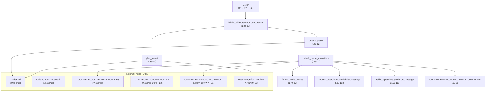
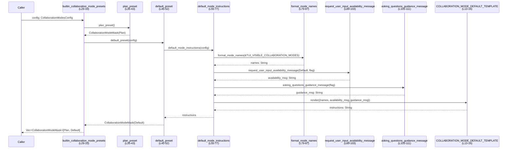

# models-manager/src/collaboration_mode_presets.rs

## 0. ざっくり一言

コラボレーションモード（Default / Plan など）のプリセット設定と、その説明文（テンプレートベースのガイダンス文字列）を生成するモジュールです（`collaboration_mode_presets.rs:L29-33, L35-43, L45-77`）。

---

## 1. このモジュールの役割

### 1.1 概要

- このモジュールは、クライアントが利用する「組み込みコラボレーションモードプリセット」を組み立てることを目的としています（`builtin_collaboration_mode_presets`、`collaboration_mode_presets.rs:L29-33`）。
- モードごとに `CollaborationModeMask` を生成し、モード名・種類・推論強度・開発者向けインストラクション文字列などを設定します（`plan_preset`, `default_preset`, `collaboration_mode_presets.rs:L35-52`）。
- Default モード用のインストラクションはテンプレート（`COLLABORATION_MODE_DEFAULT`）と、モード一覧や `request_user_input` の利用可否、質問のしかたのガイダンスを組み合わせてレンダリングします（`default_mode_instructions`, `collaboration_mode_presets.rs:L55-77`）。
- `CollaborationModesConfig` によって、主に Default モードにおける `request_user_input` ツールの有効/無効を切り替えることができます（`collaboration_mode_presets.rs:L24-27`）。

### 1.2 アーキテクチャ内での位置づけ

このモジュール内部の依存関係と主な外部依存を示します。



- 外部の型・定数は `codex_protocol` や `codex_collaboration_mode_templates` 等から提供されます（`use` 文、`collaboration_mode_presets.rs:L1-7`）。
- テンプレートは `LazyLock<Template>` を使ってスレッドセーフに一度だけパースされます（`collaboration_mode_presets.rs:L13-16`）。

### 1.3 設計上のポイント

- **設定の一箇所集約**  
  モード関連のフラグは `CollaborationModesConfig` に集約されており、将来的な機能追加の際にコンストラクタや呼び出し側のシグネチャ変更を最小限にする意図がコメントで示されています（`collaboration_mode_presets.rs:L18-22, L24-27`）。
- **テンプレート駆動のインストラクション生成**  
  テキストの説明はハードコードではなくテンプレートと変数を組み合わせて生成されます（`COLLABORATION_MODE_DEFAULT_TEMPLATE.render(...)`, `collaboration_mode_presets.rs:L64-76`）。
- **静的・スレッドセーフなテンプレート初期化**  
  `LazyLock<Template>` により、テンプレートは最初の使用時に一度だけパースされ、その後は複数スレッドから安全に共有されます（`collaboration_mode_presets.rs:L13-16`）。
- **エラー処理方針**  
  テンプレートのパースおよびレンダリングエラーは `unwrap_or_else(... panic! ...)` で処理されており、失敗時は即座にパニックとなります（`collaboration_mode_presets.rs:L14-16, L64-76`）。

---

## 2. 主要な機能一覧

- 組み込みコラボレーションモードプリセットの生成（`builtin_collaboration_mode_presets`, `collaboration_mode_presets.rs:L29-33`）
- Plan モード用プリセット（推論強度 Medium, PLAN テンプレート付き）の生成（`plan_preset`, `collaboration_mode_presets.rs:L35-43`）
- Default モード用プリセット（テンプレートベースのインストラクション付き）の生成（`default_preset`, `collaboration_mode_presets.rs:L45-52`）
- TUI で表示されるモード一覧の人間向け文字列表現の生成（`format_mode_names`, `collaboration_mode_presets.rs:L79-87`）
- `request_user_input` ツールの利用可否メッセージ生成（`request_user_input_availability_message`, `collaboration_mode_presets.rs:L89-103`）
- 質問の仕方に関するガイダンスメッセージ生成（`asking_questions_guidance_message`, `collaboration_mode_presets.rs:L105-111`）

### コンポーネントインベントリー（構造体・関数）

#### 構造体

| 名前 | 種別 | 公開範囲 | 行範囲 | 役割 |
|------|------|----------|--------|------|
| `CollaborationModesConfig` | 構造体 | `pub` | `collaboration_mode_presets.rs:L24-27` | コラボレーションモードの挙動を制御するフラグ（現在は Default モードの `request_user_input` 有効/無効）を保持します。 |

#### 関数

| 名前 | 種別 | 公開範囲 | 行範囲 | 概要 |
|------|------|----------|--------|------|
| `builtin_collaboration_mode_presets` | 関数 | `pub` | `collaboration_mode_presets.rs:L29-33` | Plan / Default の 2 モードからなる組み込みプリセットを `Vec<CollaborationModeMask>` で返します。 |
| `plan_preset` | 関数 | `fn`（モジュール内） | `collaboration_mode_presets.rs:L35-43` | Plan モード用の `CollaborationModeMask` を構築します。 |
| `default_preset` | 関数 | `fn`（モジュール内） | `collaboration_mode_presets.rs:L45-52` | Default モード用の `CollaborationModeMask` を構築し、開発者インストラクションにテンプレートから生成した文字列を設定します。 |
| `default_mode_instructions` | 関数 | `fn`（モジュール内） | `collaboration_mode_presets.rs:L55-77` | テンプレートと補助関数を用い、Default モードのインストラクション文字列を生成します。 |
| `format_mode_names` | 関数 | `fn`（モジュール内） | `collaboration_mode_presets.rs:L79-87` | モード種別の配列から人間向けのモード名列挙文字列を生成します。 |
| `request_user_input_availability_message` | 関数 | `fn`（モジュール内） | `collaboration_mode_presets.rs:L89-103` | 指定モードで `request_user_input` ツールが利用可能かどうかを説明する英語文を生成します。 |
| `asking_questions_guidance_message` | 関数 | `fn`（モジュール内） | `collaboration_mode_presets.rs:L105-111` | Default モードでの質問の仕方に関するガイダンス文を、設定フラグに応じて生成します。 |

---

## 3. 公開 API と詳細解説

### 3.1 型一覧（構造体・列挙体など）

| 名前 | 種別 | 公開 | 行範囲 | 役割 / 用途 |
|------|------|------|--------|-------------|
| `CollaborationModesConfig` | 構造体 | `pub` | `collaboration_mode_presets.rs:L24-27` | コラボレーションモード関連の機能フラグを格納します。現在は `default_mode_request_user_input: bool` の 1 フィールドのみです。 |

#### 補助コンポーネント

| 名前 | 種別 | 公開 | 行範囲 | 役割 |
|------|------|------|--------|------|
| `KNOWN_MODE_NAMES_TEMPLATE_KEY` | 定数 `&'static str` | `const`（モジュール内） | `collaboration_mode_presets.rs:L10` | テンプレート変数「KNOWN_MODE_NAMES」のキー文字列。 |
| `REQUEST_USER_INPUT_AVAILABILITY_TEMPLATE_KEY` | 定数 `&'static str` | `const` | `collaboration_mode_presets.rs:L11` | テンプレート変数「REQUEST_USER_INPUT_AVAILABILITY」のキー文字列。 |
| `ASKING_QUESTIONS_GUIDANCE_TEMPLATE_KEY` | 定数 `&'static str` | `const` | `collaboration_mode_presets.rs:L12` | テンプレート変数「ASKING_QUESTIONS_GUIDANCE」のキー文字列。 |
| `COLLABORATION_MODE_DEFAULT_TEMPLATE` | `static LazyLock<Template>` | モジュール内 | `collaboration_mode_presets.rs:L13-16` | Default モードインストラクション用テンプレート。最初の使用時に `COLLABORATION_MODE_DEFAULT` からパースされます。 |

### 3.2 関数詳細

#### `builtin_collaboration_mode_presets(collaboration_modes_config: CollaborationModesConfig) -> Vec<CollaborationModeMask>`（L29-33）

**概要**

- Plan と Default の 2 つのプリセットモードをまとめて返す公開関数です（`collaboration_mode_presets.rs:L29-33`）。
- 呼び出し側はこの関数だけで、現在サポートされている組み込みモード一覧を取得できます。

**引数**

| 引数名 | 型 | 説明 |
|--------|----|------|
| `collaboration_modes_config` | `CollaborationModesConfig` | Default モード用などの挙動を制御する設定フラグ。コピー可能な値オブジェクトです（`collaboration_mode_presets.rs:L24-27`）。 |

**戻り値**

- `Vec<CollaborationModeMask>`  
  Plan / Default の 2 要素を持つベクタです（`vec![plan_preset(), default_preset(...)]`, `collaboration_mode_presets.rs:L32`）。

**内部処理の流れ**

1. `plan_preset()` を呼び出し、Plan モードの `CollaborationModeMask` を生成します（`collaboration_mode_presets.rs:L32, L35-43`）。
2. `default_preset(collaboration_modes_config)` を呼び出し、Default モードの `CollaborationModeMask` を生成します（`collaboration_mode_presets.rs:L32, L45-52`）。
3. 2 つの要素を持つ `Vec` にして返します（`collaboration_mode_presets.rs:L32`）。

**Examples（使用例）**

```rust
use codex_protocol::config_types::CollaborationModeMask;               // 外部定義の型をインポート
use models_manager::collaboration_mode_presets::{                      // 仮のパス名
    CollaborationModesConfig,
    builtin_collaboration_mode_presets,
};

fn main() {
    // Default モードで request_user_input を有効にする設定
    let config = CollaborationModesConfig {
        default_mode_request_user_input: true,                         // フラグをオン
    };

    // 組み込みプリセット一覧を取得
    let presets: Vec<CollaborationModeMask> =
        builtin_collaboration_mode_presets(config);                    // Plan / Default の2要素が返る

    // ここで presets[0], presets[1] の内容を、UI やクライアントに渡して利用する想定です
}
```

**Errors / Panics**

- この関数自身にはエラー戻り値はありませんが、内部で `default_preset` → `default_mode_instructions` → テンプレートレンダリングがパニックする可能性があります（`unwrap_or_else(|err| panic!(...))`, `collaboration_mode_presets.rs:L64-76`）。
- 具体的には、テンプレート文字列 `COLLABORATION_MODE_DEFAULT` のパースやレンダリングに失敗した場合、プロセスがパニック終了します（`collaboration_mode_presets.rs:L14-16, L64-76`）。

**Edge cases（エッジケース）**

- `CollaborationModesConfig` のフラグが `true` か `false` かにより、Default モードのインストラクション文面が変わりますが、ベクタの要素数や順序は変わりません（`collaboration_mode_presets.rs:L55-63, L105-111`）。
- `CollaborationModesConfig` に追加フィールドが将来導入されても、本関数のシグネチャが変わらない限り、既存の呼び出しはコンパイル時に壊れません（設計コメント、`collaboration_mode_presets.rs:L18-22`）。

**使用上の注意点**

- 本関数を高頻度で呼んでも、テンプレートは `LazyLock` により一度だけパースされるため、性能劣化は限定的です（`collaboration_mode_presets.rs:L13-16`）。
- テンプレートや外部定数（`COLLABORATION_MODE_DEFAULT`, `COLLABORATION_MODE_PLAN`）を書き換える場合は、パース/レンダリングに失敗するとパニックする点に注意が必要です（`collaboration_mode_presets.rs:L14-16, L64-76`）。

---

#### `plan_preset() -> CollaborationModeMask`（L35-43）

**概要**

- Plan モード用の `CollaborationModeMask` を構築する内部関数です（`collaboration_mode_presets.rs:L35-43`）。

**引数**

- ありません。

**戻り値**

- `CollaborationModeMask`  
  `ModeKind::Plan` を指すプリセット。以下のようなフィールドを設定しています（`collaboration_mode_presets.rs:L36-42`）:
  - `name`: `ModeKind::Plan.display_name().to_string()`
  - `mode`: `Some(ModeKind::Plan)`
  - `model`: `None`
  - `reasoning_effort`: `Some(Some(ReasoningEffort::Medium))`
  - `developer_instructions`: `Some(Some(COLLABORATION_MODE_PLAN.to_string()))`

**内部処理の流れ**

1. `ModeKind::Plan.display_name()` で表示名を取得し、`String` に変換（`collaboration_mode_presets.rs:L37`）。
2. `ModeKind::Plan` を `Some(...)` でラップして `mode` フィールドに設定（`collaboration_mode_presets.rs:L38`）。
3. `model` は `None` として指定無し（`collaboration_mode_presets.rs:L39`）。
4. `reasoning_effort` に `Some(Some(ReasoningEffort::Medium))` を設定（`collaboration_mode_presets.rs:L40`）。
5. `developer_instructions` に `COLLABORATION_MODE_PLAN.to_string()` を 2 重の `Some` で包んで設定（`collaboration_mode_presets.rs:L41`）。

**Examples（使用例）**

```rust
fn debug_plan_preset() {
    let preset = plan_preset();                                    // Plan モードのプリセットを取得

    // デバッグ用に中身を確認（Debug トレイト実装前提）
    println!("{:?}", preset);                                      // フィールド内容を標準出力に表示
}
```

※ `plan_preset` は非公開関数なので、実際には同一モジュール内かテストから使用される想定です。

**Errors / Panics**

- 本関数単体にはパニック要因は見当たりません。`ModeKind::Plan.display_name()` と `COLLABORATION_MODE_PLAN.to_string()` がパニックするかどうかは外部実装依存であり、このチャンクからは分かりません。

**Edge cases**

- 外部定義の `ModeKind::Plan` や `ReasoningEffort::Medium` の値自体が変わると、生成されるプリセットの意味も変わりますが、その挙動はこのファイルからは分かりません。

**使用上の注意点**

- `developer_instructions` が `Some(Some(...))` と 2 重の `Option` であるため、呼び出し側は `Option<Option<String>>` を意識した扱いが必要です（`collaboration_mode_presets.rs:L41`）。

---

#### `default_preset(collaboration_modes_config: CollaborationModesConfig) -> CollaborationModeMask`（L45-52）

**概要**

- Default モード用の `CollaborationModeMask` を構築する関数です（`collaboration_mode_presets.rs:L45-52`）。
- 開発者インストラクションには `default_mode_instructions` が生成した文字列を設定します。

**引数**

| 引数名 | 型 | 説明 |
|--------|----|------|
| `collaboration_modes_config` | `CollaborationModesConfig` | Default モードの挙動を制御するための設定。 |

**戻り値**

- `CollaborationModeMask`  
  Default モードのプリセット。`reasoning_effort` は `None`、開発者インストラクションはテンプレートから生成された文字列です（`collaboration_mode_presets.rs:L47-52`）。

**内部処理の流れ**

1. `ModeKind::Default.display_name().to_string()` で表示名を設定（`collaboration_mode_presets.rs:L47`）。
2. `mode` に `Some(ModeKind::Default)` を設定（`collaboration_mode_presets.rs:L48`）。
3. `model` は `None`（`collaboration_mode_presets.rs:L49`）。
4. `reasoning_effort` は `None`（`collaboration_mode_presets.rs:L50`）。
5. `developer_instructions` に `Some(Some(default_mode_instructions(collaboration_modes_config)))` を設定（`collaboration_mode_presets.rs:L51`）。

**Examples（使用例）**

```rust
fn build_default_only(config: CollaborationModesConfig)
    -> codex_protocol::config_types::CollaborationModeMask
{
    // Default モードのプリセットだけが欲しい場合のラッパー例
    default_preset(config)                                        // Default 用マスクをそのまま返す
}
```

**Errors / Panics**

- 内部で `default_mode_instructions` を呼び出すため、その中のテンプレートレンダリングが失敗するとパニックします（`collaboration_mode_presets.rs:L64-76`）。

**Edge cases**

- `collaboration_modes_config.default_mode_request_user_input` が `true/false` で、インストラクションの文面が変化しますが、構造（`Option<Option<String>>`）は変わりません（`collaboration_mode_presets.rs:L55-63, L105-111`）。

**使用上の注意点**

- `default_preset` は公開されておらず、外部モジュールからは通常 `builtin_collaboration_mode_presets` 経由で利用されます。

---

#### `default_mode_instructions(collaboration_modes_config: CollaborationModesConfig) -> String`（L55-77）

**概要**

- Default モード向けの開発者インストラクション文字列をテンプレートから生成します（`collaboration_mode_presets.rs:L55-77`）。

**引数**

| 引数名 | 型 | 説明 |
|--------|----|------|
| `collaboration_modes_config` | `CollaborationModesConfig` | Default モードの `request_user_input` の有効/無効フラグに利用されます。 |

**戻り値**

- `String`  
  `COLLABORATION_MODE_DEFAULT` テンプレートをレンダリングした結果の文字列です（`collaboration_mode_presets.rs:L64-76`）。

**内部処理の流れ**

1. `format_mode_names(&TUI_VISIBLE_COLLABORATION_MODES)` で、TUI に表示するモード名一覧を文字列化（`collaboration_mode_presets.rs:L56, L79-87`）。
2. `request_user_input_availability_message` を `ModeKind::Default` と設定フラグから生成（`collaboration_mode_presets.rs:L57-60, L89-103`）。
3. `asking_questions_guidance_message` で質問のしかたのガイダンス文を生成（`collaboration_mode_presets.rs:L61-63, L105-111`）。
4. `COLLABORATION_MODE_DEFAULT_TEMPLATE.render([...])` でテンプレートをレンダリング（`collaboration_mode_presets.rs:L64-75`）。
   - テンプレート引数として、上記 3 つの文字列をそれぞれ `KNOWN_MODE_NAMES`, `REQUEST_USER_INPUT_AVAILABILITY`, `ASKING_QUESTIONS_GUIDANCE` というキーで渡します（`collaboration_mode_presets.rs:L66-74`）。
5. `render` がエラーを返した場合、`unwrap_or_else` によりパニックします（`collaboration_mode_presets.rs:L76`）。

**Examples（使用例）**

```rust
fn preview_default_instructions(enable_request_user_input: bool) {
    let config = CollaborationModesConfig {
        default_mode_request_user_input: enable_request_user_input,  // フラグを設定
    };

    let text = default_mode_instructions(config);                    // インストラクション文字列を生成
    println!("{text}");                                              // コンソールに出力して確認
}
```

**Errors / Panics**

- `Template::parse` 段階のエラー: 静的初期化時にパニック（`collaboration_mode_presets.rs:L14-16`）。
- `Template::render` 段階のエラー: 本関数内の `unwrap_or_else` によりパニック（`collaboration_mode_presets.rs:L64-76`）。
- これらの挙動は `codex_utils_template::Template` の仕様依存であり、エラー条件の詳細はこのチャンクからは分かりません。

**Edge cases**

- `TUI_VISIBLE_COLLABORATION_MODES` が空配列の場合、`format_mode_names` により `"none"` という文字列になります（`collaboration_mode_presets.rs:L82`）。
- `TUI_VISIBLE_COLLABORATION_MODES` の内容により、テンプレート内のモード名列挙部分の文面が変化します。

**使用上の注意点**

- テンプレート側で、ここで使用している 3 つのキー（`KNOWN_MODE_NAMES`, `REQUEST_USER_INPUT_AVAILABILITY`, `ASKING_QUESTIONS_GUIDANCE`）が存在しない、もしくはフォーマットが不整合な場合にレンダリングエラーとなる可能性があります（`collaboration_mode_presets.rs:L66-74`）。具体的な仕様はこのチャンクには現れません。
- 本関数はスレッドセーフに利用できます。`CollaborationModesConfig` は `Copy` であり、`COLLABORATION_MODE_DEFAULT_TEMPLATE` は `LazyLock` で共有されるため、共有状態の変更は行われません（`collaboration_mode_presets.rs:L23-27, L13-16`）。

---

#### `format_mode_names(modes: &[ModeKind]) -> String`（L79-87）

**概要**

- モード種別のスライスから、自然な英語の列挙文字列（`"A"`, `"A and B"`, `"A, B, C"` など）を生成します（`collaboration_mode_presets.rs:L79-87`）。

**引数**

| 引数名 | 型 | 説明 |
|--------|----|------|
| `modes` | `&[ModeKind]` | 表示名を列挙したいモード種別のスライス。 |

**戻り値**

- `String`  
  `ModeKind::display_name()` を用いて得られる表示名の列挙文字列です（`collaboration_mode_presets.rs:L80-86`）。

**内部処理の流れ**

1. `modes.iter().map(|mode| mode.display_name()).collect()` で `Vec<&str>` を生成（`collaboration_mode_presets.rs:L80`）。
2. `mode_names.as_slice()` に対する `match` で要素数ごとに処理を分岐（`collaboration_mode_presets.rs:L81-86`）。
   - `[]` → `"none".to_string()`（`collaboration_mode_presets.rs:L82`）
   - `[mode_name]` → その 1 要素だけを `String` 化（`collaboration_mode_presets.rs:L83`）
   - `[first, second]` → `"{first} and {second}"`（`collaboration_mode_presets.rs:L84`）
   - `[..]`（3 要素以上）→ `mode_names.join(", ")`（`collaboration_mode_presets.rs:L85`）

**Examples（使用例）**

```rust
fn print_mode_list(modes: &[ModeKind]) {
    let names = format_mode_names(modes);                        // モード名列挙を生成
    println!("Available modes: {names}");
}
```

**Errors / Panics**

- 本関数内にパニック要因は見当たりません。`display_name()` の実装次第の可能性はこのチャンクからは不明です。

**Edge cases**

- `modes` が空スライス → `"none"` を返します（`collaboration_mode_presets.rs:L82`）。
- 1 要素 → その名前のみ（`"Default"` など）（`collaboration_mode_presets.rs:L83`）。
- 2 要素 → `"A and B"` 形式（`collaboration_mode_presets.rs:L84`）。
- 3 要素以上 → `"A, B, C"` のようにカンマ区切り。最後に `"and"` は付きません（`collaboration_mode_presets.rs:L85`）。

**使用上の注意点**

- 返り値は常に英語表現であり、ローカライズはここでは行っていません。
- `ModeKind::display_name()` の戻り値に依存するため、表示名のロジックを変更する場合は `ModeKind` 側の実装を確認する必要があります（外部定義であり、このチャンクには現れません）。

---

#### `request_user_input_availability_message(mode: ModeKind, default_mode_request_user_input: bool) -> String`（L89-103）

**概要**

- 指定したモードにおける `request_user_input` ツールの利用可否を説明する英語メッセージを生成します（`collaboration_mode_presets.rs:L89-103`）。

**引数**

| 引数名 | 型 | 説明 |
|--------|----|------|
| `mode` | `ModeKind` | 対象モード。`ModeKind::Default` など。 |
| `default_mode_request_user_input` | `bool` | Default モードで `request_user_input` を強制的に有効にするかどうかを示すフラグ。 |

**戻り値**

- `String`  
  「利用可能」または「利用できない。呼び出すとエラーを返す」といった内容のメッセージ（`collaboration_mode_presets.rs:L97-101`）。

**内部処理の流れ**

1. `mode.display_name()` でモード表示名を取得（`collaboration_mode_presets.rs:L93`）。
2. `if mode.allows_request_user_input() || (default_mode_request_user_input && mode == ModeKind::Default)` で利用可否判定（`collaboration_mode_presets.rs:L94-96`）。
3. 利用可能な場合:  
   `"The`request_user_input`tool is available in {mode_name} mode."` を返す（`collaboration_mode_presets.rs:L97`）。
4. 利用不可の場合:  
   `"The`request_user_input`tool is unavailable in {mode_name} mode. If you call it while in {mode_name} mode, it will return an error."` を返す（`collaboration_mode_presets.rs:L99-101`）。

**Examples（使用例）**

```rust
fn log_request_user_input_status(mode: ModeKind, enable_default: bool) {
    let msg = request_user_input_availability_message(mode, enable_default); // メッセージを生成
    println!("{msg}");                                                       // ログなどに出力
}
```

**Errors / Panics**

- 本関数内には明示的なパニック処理はありません。
- `allows_request_user_input()` の挙動は外部定義であり、このチャンクには現れません。

**Edge cases**

- Default モードかつ `default_mode_request_user_input == true` の場合、`allows_request_user_input()` が `false` でも利用「可能」とみなされます（`collaboration_mode_presets.rs:L94-96`）。
- それ以外のモードでは、`allows_request_user_input()` の結果がそのまま利用可否に反映されます。

**使用上の注意点**

- メッセージは英語固定であり、ユーザー向けにそのまま表示する場合はローカライズの検討が必要です。
- 実際にツール呼び出しがエラーを返すかどうかは、このモジュールではなく実際のツール実装側の責務です。

---

#### `asking_questions_guidance_message(default_mode_request_user_input: bool) -> String`（L105-111）

**概要**

- Default モードにおける質問の仕方に関するガイダンス文（英語）を生成します（`collaboration_mode_presets.rs:L105-111`）。
- フラグに応じて、「`request_user_input` を使うべき」という文面と「直接テキストで聞くべき」という文面を切り替えます。

**引数**

| 引数名 | 型 | 説明 |
|--------|----|------|
| `default_mode_request_user_input` | `bool` | Default モードで `request_user_input` を利用する方針かどうか。 |

**戻り値**

- `String`  
  複数文から成る英語のガイダンス文字列（`collaboration_mode_presets.rs:L106-110`）。

**内部処理の流れ**

1. `if default_mode_request_user_input { ... } else { ... }` で 2 パターン分岐（`collaboration_mode_presets.rs:L105-110`）。
2. `true` の場合:  
   - `request_user_input` ツールを用いて質問することを推奨する長文メッセージを返す（`collaboration_mode_presets.rs:L106-107`）。
3. `false` の場合:  
   - Plain-text の質問を直接ユーザーに投げることを推奨する長文メッセージを返す（`collaboration_mode_presets.rs:L108-110`）。

**Examples（使用例）**

```rust
fn show_questions_guidance(enable_request_user_input: bool) {
    let guidance = asking_questions_guidance_message(enable_request_user_input); // ガイダンスを生成
    println!("{guidance}");
}
```

**Errors / Panics**

- 本関数内にパニック要因はありません。

**Edge cases**

- フラグが `true/false` の二値のみであり、他の分岐はありません。

**使用上の注意点**

- メッセージ内で「Never write a multiple choice question as a textual assistant message.」と明示されているため（`collaboration_mode_presets.rs:L106-110`）、この方針と矛盾しないように他箇所の実装やプロンプト設計を調整する必要があります。

---

### 3.3 その他の関数（一覧）

※ 上記 7 関数はすべて詳細解説済みですが、行範囲付きの一覧を再掲します。

| 関数名 | 行範囲 | 役割（1 行） |
|--------|--------|--------------|
| `builtin_collaboration_mode_presets` | `collaboration_mode_presets.rs:L29-33` | Plan / Default のプリセット `Vec` を返す公開 API。 |
| `plan_preset` | `collaboration_mode_presets.rs:L35-43` | Plan モードの `CollaborationModeMask` を生成。 |
| `default_preset` | `collaboration_mode_presets.rs:L45-52` | Default モードの `CollaborationModeMask` を生成。 |
| `default_mode_instructions` | `collaboration_mode_presets.rs:L55-77` | Default モードのインストラクション文字列をテンプレートから生成。 |
| `format_mode_names` | `collaboration_mode_presets.rs:L79-87` | モード名一覧を英語の列挙文字列に整形。 |
| `request_user_input_availability_message` | `collaboration_mode_presets.rs:L89-103` | `request_user_input` の利用可否メッセージを生成。 |
| `asking_questions_guidance_message` | `collaboration_mode_presets.rs:L105-111` | 質問の仕方のガイダンス文を生成。 |

---

## 4. データフロー

ここでは、「設定から組み込みプリセット `Vec<CollaborationModeMask>` を生成する」典型的なフローを示します。



- 呼び出し側は `CollaborationModesConfig` を渡して `builtin_collaboration_mode_presets` を呼ぶだけで済みます（`collaboration_mode_presets.rs:L29-33`）。
- Default モードのインストラクション生成は複数の補助関数とテンプレートレンダリングを通じて行われます（`collaboration_mode_presets.rs:L55-77, L79-87, L89-103, L105-111`）。
- テンプレートは `LazyLock` により初回アクセス時にのみパースされ、その後のレンダリングでは再利用されます（`collaboration_mode_presets.rs:L13-16`）。

---

## 5. 使い方（How to Use）

### 5.1 基本的な使用方法

もっとも典型的なフローは、「設定を用意してプリセット一覧を取得し、それを UI などに渡す」形です。

```rust
use codex_protocol::config_types::CollaborationModeMask;                // プリセットの型
use models_manager::collaboration_mode_presets::{                       // 仮のモジュールパス
    CollaborationModesConfig,
    builtin_collaboration_mode_presets,
};

fn main() {
    // コラボレーションモードの設定を作成
    let config = CollaborationModesConfig {
        // Default モードでも request_user_input ツールを利用可能にする
        default_mode_request_user_input: true,
    };

    // 組み込みのコラボレーションモードプリセットを取得
    let presets: Vec<CollaborationModeMask> =
        builtin_collaboration_mode_presets(config);

    // 取得したプリセットを任意の用途（UI 表示・設定保存など）に利用する
    for preset in &presets {                                            // ベクタを借用してループ
        println!("{:?}", preset);                                       // Debug 出力（実際の UI では整形表示など）
    }
}
```

### 5.2 よくある使用パターン

1. **Default モードで `request_user_input` を有効にするかどうかの切り替え**

```rust
fn build_presets_with_or_without_request_user_input(enable: bool)
    -> Vec<CollaborationModeMask>
{
    let config = CollaborationModesConfig {
        default_mode_request_user_input: enable,                        // true/false で切り替え
    };
    builtin_collaboration_mode_presets(config)                          // どちらの場合も 2 要素の Vec が返る
}
```

- `enable == true`:  
  - `request_user_input_availability_message` が Default モードでの利用を許可する文面になります（`collaboration_mode_presets.rs:L94-97`）。
  - `asking_questions_guidance_message` が、質問時に `request_user_input` の利用を推奨する文面になります（`collaboration_mode_presets.rs:L105-107`）。
- `enable == false`:  
  - Default モードでの利用可否は `ModeKind::Default.allows_request_user_input()` にのみ依存します（`collaboration_mode_presets.rs:L94-96`）。
  - 質問はプレーンテキストで直接行うことを推奨する文面になります（`collaboration_mode_presets.rs:L108-110`）。

1. **Default モードのインストラクション文を事前にプレビュー**

```rust
fn preview_default_instructions(enable_request_user_input: bool) {
    let config = CollaborationModesConfig {
        default_mode_request_user_input: enable_request_user_input,
    };
    let instructions = default_mode_instructions(config);              // 直接プレビュー
    println!("Default mode instructions:\n{instructions}");
}
```

### 5.3 よくある間違い

```rust
// 間違い例: CollaborationModesConfig を適切に初期化せずに使用している
fn wrong_usage() {
    // let config = CollaborationModesConfig { /* フィールド未設定 */ }; // コンパイルエラー

    // let presets = builtin_collaboration_mode_presets(config);        // コンパイルが通らない
}

// 正しい例: フィールドを明示的に設定する
fn correct_usage() {
    let config = CollaborationModesConfig {
        default_mode_request_user_input: false,                         // 何らかの方針に基づいて設定
    };
    let presets = builtin_collaboration_mode_presets(config);           // 正常に利用できる
    println!("{:?}", presets);
}
```

- `CollaborationModesConfig` には `Default` 実装がありますが（`#[derive(Default)]`, `collaboration_mode_presets.rs:L23`）、`::default()` を使わずにフィールドを書き忘れるとコンパイルエラーになります。

### 5.4 使用上の注意点（まとめ）

- **パニックの可能性**  
  テンプレートのパース・レンダリングエラー時にはパニックが発生し、プロセス全体に影響します（`collaboration_mode_presets.rs:L14-16, L64-76`）。テンプレート文字列を変更する場合はテストで検証することが重要です。
- **スレッドセーフ性**  
  共有状態は `LazyLock<Template>` のみであり、読み取り専用です（`collaboration_mode_presets.rs:L13-16`）。このモジュールの API は複数スレッドから同時に呼び出しても、Rust の所有権・同期モデルによりデータ競合が発生しない構造になっています。
- **ローカライズ**  
  メッセージ類（利用可否メッセージ、ガイダンス文）は英語でハードコードされており（`collaboration_mode_presets.rs:L97-101, L106-110`）、国際化が必要な場合は別レイヤーでの対応が必要です。
- **契約（Contract）的前提**  
  - `TUI_VISIBLE_COLLABORATION_MODES` は `ModeKind` のスライスであること（`collaboration_mode_presets.rs:L56`）。
  - テンプレート `COLLABORATION_MODE_DEFAULT` は、3 つのキー（`KNOWN_MODE_NAMES`, `REQUEST_USER_INPUT_AVAILABILITY`, `ASKING_QUESTIONS_GUIDANCE`）を受け取る設計であること（`collaboration_mode_presets.rs:L66-74`）。
  - これらの前提が崩れると、レンダリングエラーのリスクがあります。

---

## 6. 変更の仕方（How to Modify）

### 6.1 新しい機能を追加する場合

1. **新しいコラボレーションモードプリセットを追加する**

   - 新モード用のプリセット関数を `plan_preset` / `default_preset` と同様に追加します（例: `review_preset`）（`collaboration_mode_presets.rs:L35-52` を参考）。
   - その関数内で適切な `ModeKind`、`reasoning_effort`、`developer_instructions` を設定します。
   - `builtin_collaboration_mode_presets` で返すベクタに新プリセットを追加します（`collaboration_mode_presets.rs:L32`）。

2. **`CollaborationModesConfig` に新しいフラグを追加する**

   - 構造体にフィールドを追加し（`collaboration_mode_presets.rs:L24-27`）、必要に応じて `Default` の意味合いを決めます。
   - そのフラグを使いたい関数に引数として渡す、または既存の引数から参照します（`default_mode_instructions`, `request_user_input_availability_message`, `asking_questions_guidance_message` など、`collaboration_mode_presets.rs:L55-77, L89-111`）。

3. **テンプレート変数を増やす**

   - 新しいテンプレートキー用の `const &str` を追加（`collaboration_mode_presets.rs:L10-12` のパターン）。
   - `default_mode_instructions` の `render` 引数配列に要素を追加（`collaboration_mode_presets.rs:L64-75`）。
   - `COLLABORATION_MODE_DEFAULT` テンプレート側にも対応するプレースホルダを追加する必要があります（テンプレートの詳細はこのチャンクには現れません）。

### 6.2 既存の機能を変更する場合

- **影響範囲の確認**

  - `builtin_collaboration_mode_presets` を変更する場合、プリセットを利用するすべての呼び出し側に影響します（`collaboration_mode_presets.rs:L29-33`）。
  - メッセージ文面（`request_user_input_availability_message`, `asking_questions_guidance_message`）を変更する場合、ユーザー向け文言が変わるだけであり、型レベルの互換性には影響しません（`collaboration_mode_presets.rs:L89-111`）。

- **契約・前提条件の維持**

  - `CollaborationModeMask` のフィールド構造（`name`, `mode`, `model`, `reasoning_effort`, `developer_instructions`）の意味を変える場合は、`codex_protocol::config_types::CollaborationModeMask` 定義側の契約も確認する必要があります（このチャンクには現れません）。
  - `Option<Option<...>>` という二重のオプション構造を変えると、下流コードに大きな影響が出る可能性があります。

- **テスト**

  - 本ファイルには `#[cfg(test)] mod tests;` が定義されており（`collaboration_mode_presets.rs:L113-115`）、`collaboration_mode_presets_tests.rs` にテストが存在することがわかりますが、内容はこのチャンクには現れません。
  - 挙動変更時はこのテストファイルを確認・更新する必要があります。

---

## 7. 関連ファイル

| パス / シンボル | 役割 / 関係 |
|----------------|------------|
| `codex_collaboration_mode_templates::DEFAULT` | Default モード用テンプレート文字列。`COLLABORATION_MODE_DEFAULT_TEMPLATE` の元データです（`collaboration_mode_presets.rs:L1, L13-16`）。 |
| `codex_collaboration_mode_templates::PLAN` | Plan モード用テンプレート文字列。`plan_preset` の `developer_instructions` に使用されます（`collaboration_mode_presets.rs:L2, L41`）。 |
| `codex_protocol::config_types::CollaborationModeMask` | 各モードのプリセットを表す構造体型。Plan / Default のマスク生成に利用されます（`collaboration_mode_presets.rs:L3, L35-43, L45-52`）。 |
| `codex_protocol::config_types::ModeKind` | モード種別（Plan / Default など）を表す列挙体。表示名や `request_user_input` の許可判定に使用されます（`collaboration_mode_presets.rs:L4, L37-38, L47-48, L58-59, L90-96`）。 |
| `codex_protocol::config_types::TUI_VISIBLE_COLLABORATION_MODES` | TUI で表示すべきモード一覧。`default_mode_instructions` 内で `format_mode_names` に渡されます（`collaboration_mode_presets.rs:L5, L56`）。 |
| `codex_protocol::openai_models::ReasoningEffort` | 推論強度を表す型。Plan モードの `reasoning_effort` に `Medium` が設定されています（`collaboration_mode_presets.rs:L6, L40`）。 |
| `codex_utils_template::Template` | テンプレートエンジンの型。テンプレートのパースとレンダリングに使用されます（`collaboration_mode_presets.rs:L7, L13-16, L64-76`）。 |
| `std::sync::LazyLock` | テンプレートの遅延静的初期化に使用される標準ライブラリの同期プリミティブです（`collaboration_mode_presets.rs:L8, L13-16`）。 |
| `collaboration_mode_presets_tests.rs` | 本モジュールのテストコードを含むファイル。`#[path = "collaboration_mode_presets_tests.rs"]` により参照されていますが、内容はこのチャンクには現れません（`collaboration_mode_presets.rs:L113-115`）。 |

---

### 安全性・エラー・並行性のまとめ

- **メモリ安全性**  
  - `unsafe` ブロックは存在せず、標準的な Rust の所有権・借用規則に従ったコードです（このチャンク全体）。
- **エラー処理**  
  - テンプレート関連のエラーは `Result` ではなくパニックによって扱われます（`unwrap_or_else(|err| panic!(...))`, `collaboration_mode_presets.rs:L14-16, L64-76`）。
  - それ以外の関数は基本的に純粋関数であり、エラー型を返しません。
- **並行性**  
  - 共有状態は `LazyLock<Template>` のみであり、`Template` を読み取り専用で利用しているため、データ競合の懸念はありません（`collaboration_mode_presets.rs:L13-16`）。
  - `CollaborationModesConfig` は `Copy` 可能な軽量値であり、スレッド間で自由にコピーできます（`#[derive(Clone, Copy, Default, ...)]`, `collaboration_mode_presets.rs:L23-27`）。

潜在的なバグ・セキュリティリスクについては、テンプレートの内容や外部型の実装に依存する部分が多く、このチャンクだけからは詳細は不明ですが、少なくともテンプレートエラーがパニックにつながることにより可用性に影響しうる点は把握しておく必要があります。
