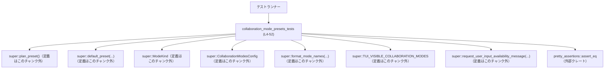
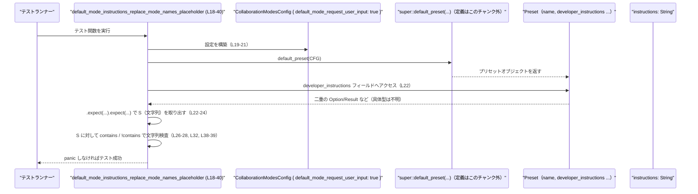

# models-manager/src/collaboration_mode_presets_tests.rs

## 0. ざっくり一言

コラボレーションモードのプリセット（特に `Plan` と `Default`）について、  
名前・推論負荷・開発者向けインストラクション文字列が、モード定義と設定に応じて正しく生成されているかを検証するテストモジュールです（`collaboration_mode_presets_tests.rs:L4-52`）。

---

## 1. このモジュールの役割

### 1.1 概要

- このモジュールは、上位モジュール（`super`）が提供するコラボレーションモード用プリセット関数（`plan_preset`, `default_preset` など）の**期待される振る舞い**をテストで保証します（`collaboration_mode_presets_tests.rs:L5-52`）。
- 具体的には次の点を確認します。
  - プリセットの `name` が `ModeKind` の表示名と一致すること（`L6-10`）。
  - `plan_preset` の `reasoning_effort` が既定の推論負荷（`ReasoningEffort::Medium`）であること（`L11-14`）。
  - `default_preset` の開発者向けインストラクション文字列から、テンプレートのプレースホルダが正しく置換されていること（`L18-40`）。
  - 設定フラグ `default_mode_request_user_input` の有無で、インストラクション内の文言が切り替わること（`L19-21`, `L39`, `L49-52`）。

### 1.2 アーキテクチャ内での位置づけ

`use super::*;` により、親モジュールが提供するすべての公開アイテムをテスト対象として利用しています（`L1`）。



- このモジュール自体は**純粋なテスト専用**であり、アプリケーションコードから直接呼び出されることはありません。
- 親モジュールが提供する「プリセット生成 API」の**振る舞い仕様書**の役割も兼ねています。

### 1.3 設計上のポイント

- **テスト駆動の仕様記述**  
  - プリセットの名前と推論負荷に関する仕様を、シンプルなアサーションで表現しています（`collaboration_mode_presets_tests.rs:L6-14`）。
- **テンプレート文字列の検証**  
  - インストラクション文字列がテンプレートから生成される前提で、プレースホルダ文字列の非出現と、期待されるメッセージ断片の出現をチェックしています（`L26-33`, `L38-39`）。
- **設定フラグに依存する分岐の検証**  
  - `CollaborationModesConfig { default_mode_request_user_input: true }` と `CollaborationModesConfig::default()` の2パターンでインストラクション内容の違いを比較しています（`L19-21`, `L44-47`, `L39`, `L49-52`）。
- **エラーハンドリング方針**  
  - `developer_instructions` に対して `expect` を2段階で呼び出しており、値が存在しない場合は**明示的に panic（テスト失敗）**させる設計になっています（`L22-24`, `L45-47`）。
- **並行性**  
  - このファイル内には `async` やスレッド関連 API は登場せず、各テストは**同期的に**プリセット関数を呼び出すだけです（全体）。

---

## 2. 主要な機能一覧（テストケース）

このモジュールがカバーする主なテスト機能です。

| 機能 | 説明 | 根拠 |
|------|------|------|
| プリセット名と表示名の一致 | `plan_preset` と `default_preset` の `name` が、それぞれ `ModeKind::Plan` と `ModeKind::Default` の `display_name()` と一致することを検証します。 | `collaboration_mode_presets_tests.rs:L5-10` |
| Plan プリセットの推論負荷 | `plan_preset().reasoning_effort` が `Some(Some(ReasoningEffort::Medium))` であることを検証します。 | `collaboration_mode_presets_tests.rs:L11-14` |
| Default モードのテンプレート展開（ユーザー入力ツール利用時） | `default_mode_request_user_input: true` のとき、インストラクションからテンプレートプレースホルダが消え、既知モード名一覧とツール利用ガイダンスが挿入されていることを検証します。 | `collaboration_mode_presets_tests.rs:L18-40` |
| Default モードのテンプレート展開（ツール無効時） | デフォルト設定のとき、インストラクションに `request_user_input` ツールの利用文言が含まれず、代わりにプレーンテキストで質問する旨の文言が含まれることを検証します。 | `collaboration_mode_presets_tests.rs:L42-52` |

---

## 3. 公開 API と詳細解説

このファイル自体には**公開 API は定義されておらず**、すべて `#[test]` 関数のみです。  
ここでは

- このモジュール内のテスト関数
- それが前提としている上位モジュールの API の挙動

を整理します。

### 3.1 型一覧（構造体・列挙体など）

このファイル内で利用している主要な型です（定義はすべて親モジュール側にあります）。

| 名前 | 種別 | 役割 / 用途 | 定義状況・根拠 |
|------|------|-------------|----------------|
| `ModeKind` | （このチャンクからは具体的種別不明。少なくとも関連項目 `Plan`, `Default` とメソッド `display_name()` を持つ型） | コラボレーションモードの種類を表します。`display_name()` によりユーザー向けの表示名文字列を取得しています。 | 使用箇所: プリセット名との比較（`collaboration_mode_presets_tests.rs:L6-10`）、利用可否メッセージ生成（`L34-36`）。定義は `super` モジュール内で、このチャンクには現れません。 |
| `CollaborationModesConfig` | 構造体（少なくともフィールド `default_mode_request_user_input: bool` を持つ） | Default モードのインストラクション生成時の設定を表します。`default()` で既定設定を生成し、フィールド `default_mode_request_user_input` でユーザー入力ツールの利用有無を制御しています。 | 使用箇所: `CollaborationModesConfig::default()`（`L8`, `L44`）、構造体リテラル `{ default_mode_request_user_input: true }`（`L19-21`）。フィールドが1つだけであることがリテラルから分かります。定義はこのチャンクには現れません。 |
| `ReasoningEffort` | （このチャンクからは具体的種別不明。関連項目 `Medium` を持つ型） | モードごとの推論負荷レベルを表す型です。`Medium` という中程度の負荷を表す値を持つことが分かります。 | 使用箇所: `Some(Some(ReasoningEffort::Medium))` として Plan プリセットの `reasoning_effort` と比較（`collaboration_mode_presets_tests.rs:L11-14`）。定義はこのチャンクには現れません。 |
| `TUI_VISIBLE_COLLABORATION_MODES` | 定数 / スタティック（コレクション型と推測されるが詳細不明） | 既知のモード名一覧を `format_mode_names` に渡すためのコレクションです。TUI に表示されるモード群であると名前から読み取れます。 | 使用箇所: `format_mode_names(&TUI_VISIBLE_COLLABORATION_MODES)`（`collaboration_mode_presets_tests.rs:L30-31`）。定義はこのチャンクには現れません。 |

※ 型の具体的な定義（フィールド構成や enum バリアント）は、このチャンクには含まれていないため断定できません。

---

### 3.2 関数詳細（テスト関数）

このファイルに定義されている関数はすべてテスト用です。

#### `preset_names_use_mode_display_names()`

**概要**

- `plan_preset` および `default_preset` が返すプリセットの `name` と `reasoning_effort` が、`ModeKind` や `ReasoningEffort` で定義される期待値と一致することを検証するテストです（`collaboration_mode_presets_tests.rs:L5-15`）。

**引数**

- なし（テスト関数なので引数を取りません）。

**戻り値**

- `()`（ユニット）。戻り値は使用されず、`assert_eq!` の成功/失敗によってテスト結果が決まります。

**内部処理の流れ**

1. `plan_preset()` を呼び出し、その `name` が `ModeKind::Plan.display_name()` と等しいことを `assert_eq!` で確認します（`L6`）。
2. `default_preset(CollaborationModesConfig::default())` を呼び出し、その `name` が `ModeKind::Default.display_name()` と等しいことを確認します（`L7-10`）。
3. 再度 `plan_preset()` を呼び出し、その `reasoning_effort` が `Some(Some(ReasoningEffort::Medium))` であることを確認します（`L11-14`）。

**Examples（使用例）**

テストと同様の形で、アプリケーションコードからプリセットの名前を検査する例です。

```rust
// 親モジュール側から利用する想定の例（テストコードと同じ呼び出し）
let plan = plan_preset(); // super::plan_preset() を呼び出す
assert_eq!(plan.name, ModeKind::Plan.display_name());

let default = default_preset(CollaborationModesConfig::default());
assert_eq!(default.name, ModeKind::Default.display_name());
```

このテストにより、「`plan_preset` の `name` は常に `ModeKind::Plan.display_name()` と一致する」という契約が保証されます。

**Errors / Panics**

- `assert_eq!` は、左右の値が異なる場合に panic します。
  - すなわち、プリセットの `name` や `reasoning_effort` が仕様から外れた値になった場合、テストが失敗します。
- Rust の `assert_eq!` マクロは panic を起こすだけであり、メモリ安全性を損なうものではありません。

**Edge cases（エッジケース）**

- このテストから分かるのは、「少なくとも Plan と Default の2モード」に対する仕様のみです。
- 他の ModeKind バリアント（存在するかどうかも含めて）は、このチャンクには現れず、このテストでは検証されていません。
- `reasoning_effort` が `Option` をネストした型（または `expect` を持つ他の型）であることが示唆されますが、型定義はこのチャンクにはありません。

**使用上の注意点**

- アプリケーションコードで `reasoning_effort` を利用する場合、このテストからは Plan モードで `Some(Some(ReasoningEffort::Medium))` が返ることだけが分かります。他モードの値はコードからは不明です。
- 文字列や enum の値に直接依存するロジックを組む場合、このようなテストを追加しておくと将来の変更に強くなります。

---

#### `default_mode_instructions_replace_mode_names_placeholder()`

**概要**

- `default_mode_request_user_input: true` という設定で `default_preset` を呼び出したとき、開発者向けインストラクション文字列からテンプレートプレースホルダが除去され、適切な説明文・利用可能性メッセージ・ツール利用ガイダンスが含まれていることを検証するテストです（`collaboration_mode_presets_tests.rs:L18-40`）。

**引数**

- なし。

**戻り値**

- `()`。

**内部処理の流れ（アルゴリズム）**

1. `CollaborationModesConfig { default_mode_request_user_input: true }` によって設定を構築します（`L19-21`）。
2. その設定を用いて `default_preset(...)` を呼び出し、結果の `developer_instructions` フィールドを 2 回 `expect` でアンラップして、最終的なインストラクション文字列を取得します（`L22-24`）。
3. インストラクション文字列に、次のテンプレートプレースホルダが含まれていないことを確認します（`L26-28`）。
   - `"{{KNOWN_MODE_NAMES}}"`
   - `"{{REQUEST_USER_INPUT_AVAILABILITY}}"`
   - `"{{ASKING_QUESTIONS_GUIDANCE}}"`
4. `format_mode_names(&TUI_VISIBLE_COLLABORATION_MODES)` で既知モード名一覧の文字列を構築し（`L30`）、  
   `"Known mode names are {known_mode_names}."` というメッセージがインストラクション文字列に含まれていることを確認します（`L31-32`）。
5. `request_user_input_availability_message(ModeKind::Default, true)` で、Default モードでのユーザー入力ツール利用可否メッセージを生成し（`L34-37`）、それがインストラクションに含まれていることを確認します（`L38`）。
6. 最後に、インストラクションに `"prefer using the`request_user_input`tool"` という文言が含まれていることを確認します（`L39`）。

**Examples（使用例）**

テスト内と同様に、`developer_instructions` を取得して検査する例です。

```rust
// ユーザー入力ツールを利用する設定
let config = CollaborationModesConfig {
    default_mode_request_user_input: true,
};

let preset = default_preset(config);

// developer_instructions は少なくとも二段階の .expect で取り出せる型であることがテストから分かる
let instructions = preset
    .developer_instructions
    .expect("default preset should include instructions")
    .expect("default instructions should be set");

// プレースホルダが展開されていることを確認
assert!(!instructions.contains("{{KNOWN_MODE_NAMES}}"));
let known_mode_names = format_mode_names(&TUI_VISIBLE_COLLABORATION_MODES);
let expected_snippet = format!("Known mode names are {known_mode_names}.");
assert!(instructions.contains(&expected_snippet));
```

**Errors / Panics**

- `developer_instructions` が None/Err の場合、`expect` によりこのテストは panic します（`L22-24`）。
- アサーションに失敗した場合も panic します（`L26-28`, `L32`, `L38-39`）。
- いずれもテスト用の panic であり、アプリケーション本体の実行時安全性に影響はありません。

**Edge cases（エッジケース）**

- このテストでは、`default_mode_request_user_input: true` の場合のみを扱っています。  
  他の設定値や ModeKind に対する挙動はこのチャンクからは分かりません。
- `developer_instructions` の型は二重に `expect` を呼び出せる複合型ですが（例えば `Option<Option<String>>` や `Result<Option<_>, _>` など）、具体的な型定義はこのチャンクからは断定できません。
- プレースホルダ文字列がテンプレートに存在しないケースはテストしていません（ここでは「存在したものが確実に展開されている」前提で書かれています）。

**使用上の注意点**

- 本番コードでは、`expect` の多用は意図しない panic の原因となり得ます。  
  テストではあえて `expect` を使って「仕様に反する状態」を早期に検出しています。
- インストラクション文字列に対して `contains` で部分一致検査を行っているため、文言の変更（翻訳や文体変更など）があるとテストが壊れます。  
  仕様として文言を固定したいのか、ある程度柔軟に変えたいのかを考えた上でテストの粒度を決める必要があります。

---

#### `default_mode_instructions_use_plain_text_questions_when_feature_disabled()`

**概要**

- `CollaborationModesConfig::default()` の場合（ユーザー入力ツール機能が無効とみなされるケース）に、インストラクションがツールの利用を推奨せず、プレーンテキストで質問するよう案内する文言が含まれていることを検証するテストです（`collaboration_mode_presets_tests.rs:L42-52`）。

**引数**

- なし。

**戻り値**

- `()`。

**内部処理の流れ**

1. `default_preset(CollaborationModesConfig::default())` を呼び出し、`developer_instructions` を 2 回 `expect` でアンラップしてインストラクション文字列を取得します（`L44-47`）。
2. インストラクションに `"prefer using the`request_user_input`tool"` が含まれていないことを確認します（`L49`）。
3. 代わりに、`"ask the user directly with a concise plain-text question"` という文言が含まれていることを確認します（`L50-52`）。

**Examples（使用例）**

```rust
let preset = default_preset(CollaborationModesConfig::default());

let instructions = preset
    .developer_instructions
    .expect("default preset should include instructions")
    .expect("default instructions should be set");

// ユーザー入力ツールが使えない前提のメッセージ
assert!(!instructions.contains("prefer using the `request_user_input` tool"));
assert!(instructions.contains(
    "ask the user directly with a concise plain-text question"
));
```

**Errors / Panics**

- 2つの `expect` と2つの `assert!` により、仕様から外れた場合はすべて panic します（`collaboration_mode_presets_tests.rs:L44-47`, `L49-52`）。

**Edge cases（エッジケース）**

- `CollaborationModesConfig::default()` が内部的にどのような値を持つか（`default_mode_request_user_input` が true/false どちらか）は、このチャンクだけでは断定できません。
  - ただし、テスト2との対比から、少なくとも「ツール利用推奨あり」と「プレーンテキスト質問推奨」の2パターンが設定で切り替わることが分かります。
- 文言は英語の固定文字列でテストされています。将来的に翻訳や文言調整を行う場合、このテストも一緒に更新する必要があります。

**使用上の注意点**

- ユーザー入力ツール機能の有無によって、モードのインストラクションが大きく変わる契約がここで暗黙に定義されています。  
  新しいモードや設定フラグを追加する場合は、同様のテストを追加することで仕様を明文化できます。
- テキストベースの仕様は、「どこまで厳密に文字列を固定したいか」によってテストの書き方が変わります。

---

### 3.3 その他の関数・アイテム（このモジュールから利用）

このファイル内で利用しているが、定義がこのチャンクに現れない関数・アイテムです。

| 名前 | 種別 | 役割（1 行） | 使用箇所・根拠 |
|------|------|--------------|----------------|
| `plan_preset()` | 関数 | Plan モードのプリセットを生成する関数です。戻り値は少なくとも `name` と `reasoning_effort` フィールドを持ちます。 | `plan_preset().name` として使用（`collaboration_mode_presets_tests.rs:L6`）、`plan_preset().reasoning_effort` として使用（`L11-13`）。定義は親モジュールで、このチャンクには現れません。 |
| `default_preset(config: CollaborationModesConfig)` | 関数 | 与えられた設定に応じて Default モードのプリセットを生成する関数です。戻り値は `name` と `developer_instructions` フィールドを持ちます。 | `default_preset(CollaborationModesConfig::default()).name`（`L7-9`）、`default_preset(...).developer_instructions`（`L19-24`, `L44-47`）として使用。 |
| `format_mode_names(&TUI_VISIBLE_COLLABORATION_MODES)` | 関数 | 既知のモード名コレクションから、人間向けの説明文に埋め込む文字列を生成します。 | `known_mode_names` の生成に使用（`collaboration_mode_presets_tests.rs:L30-31`）。 |
| `request_user_input_availability_message(ModeKind, bool)` | 関数 | 指定されたモードと設定値に応じて、「ユーザー入力リクエストが利用可能かどうか」を説明するメッセージ文字列を生成します。 | `expected_availability_message` の生成に使用（`collaboration_mode_presets_tests.rs:L34-37`）。 |
| `pretty_assertions::assert_eq` | マクロ | 通常の `assert_eq!` と同様の動作をしつつ、失敗時に見やすい差分を表示します。 | `preset_names_use_mode_display_names` 内の比較に使用（`collaboration_mode_presets_tests.rs:L2`, `L6-14`）。 |

---

## 4. データフロー

ここでは、最も複雑なテストである  
`default_mode_instructions_replace_mode_names_placeholder (L18-40)` を例に、処理の流れを示します。

1. テスト関数が `CollaborationModesConfig { default_mode_request_user_input: true }` を生成します（入力設定）。
2. それを `default_preset` に渡し、プリセットオブジェクトを取得します。
3. プリセットの `developer_instructions` から最終的なインストラクション文字列を取り出します（2段階の `expect`）。
4. 取り出した文字列に対し、テンプレートプレースホルダの非出現と、期待される文言の出現を検査します。



この図から分かるポイント:

- テストコード自身は**状態を持たない純粋な関数**として振る舞い、  
  すべてのロジック（テンプレート展開やメッセージ生成）は `default_preset` 側に委ねられています。
- エラー処理は `expect` と `assert!` による panic ベースで行われており、  
  仕様違反をただちに検出できる構造になっています。

---

## 5. 使い方（How to Use）

ここでは、このテストから読み取れる**上位モジュール API の具体的な使い方のパターン**を整理します。

### 5.1 基本的な使用方法

Default モードのプリセットを取得し、名前とインストラクションを利用する最小例です。  
テストコードと同じパターンを再利用します。

```rust
// 設定オブジェクトを用意する
let config = CollaborationModesConfig::default(); // デフォルト設定（詳細はこのチャンクでは不明）

// Default モードのプリセットを取得する
let preset = default_preset(config);

// プリセット名は ModeKind::Default.display_name() と一致することがテストで保証されている
assert_eq!(preset.name, ModeKind::Default.display_name());

// 開発者向けインストラクション文字列を取り出す
let instructions = preset
    .developer_instructions
    .expect("default preset should include instructions") // 最上位の有無
    .expect("default instructions should be set");        // 実際の文字列の有無

// ここで instructions をプロンプト構築などに利用できる
println!("{instructions}");
```

- この例は、テストが前提としている**契約どおりに API を利用する方法**を示しています。
- `expect` による panic が許容できない場面では、`match` や `if let` で安全にハンドリングする実装が必要になります。

### 5.2 よくある使用パターン

#### パターン1: ユーザー入力ツールが有効な場合の Default プリセット取得

テスト2に相当するパターンです。

```rust
// ユーザー入力ツール機能を有効にした設定
let config = CollaborationModesConfig {
    default_mode_request_user_input: true,
};

// プリセットとインストラクションを取得
let preset = default_preset(config);
let instructions = preset
    .developer_instructions
    .expect("instructions container must exist")
    .expect("instructions text must be set");

// instructions には request_user_input ツールを使うよう促す文言が含まれることが
// テストで保証されている
assert!(instructions.contains("prefer using the `request_user_input` tool"));
```

#### パターン2: ユーザー入力ツールが無効な場合の Default プリセット取得

テスト3に相当するパターンです。

```rust
// デフォルト設定（ツール無効ケース）
let config = CollaborationModesConfig::default();

let preset = default_preset(config);
let instructions = preset
    .developer_instructions
    .expect("instructions container must exist")
    .expect("instructions text must be set");

// ツールではなくプレーンテキストで質問するよう案内される
assert!(!instructions.contains("prefer using the `request_user_input` tool"));
assert!(instructions.contains(
    "ask the user directly with a concise plain-text question"
));
```

### 5.3 よくある間違い

このチャンクと Rust の一般的な慣習から想定される誤用例と、その注意点です。

```rust
// （誤りやすい例）expect / unwrap を無造作に使う
let instructions = preset.developer_instructions.unwrap().unwrap();
// developer_instructions が None / Err の場合に panic する。
// テストコードでは仕様違反検出に有用だが、本番コードではクラッシュの原因になる。
```

```rust
// （より安全な一例）パターンマッチで安全に扱う
match preset.developer_instructions {
    Some(inner) => {
        // inner の具体的な型（Option / Result など）はこのチャンクでは不明。
        // ここでさらに match するなどして安全に扱う。
    }
    None => {
        // インストラクションが提供されていないケースを明示的に扱う
    }
}
```

- `developer_instructions` の具体型はこのチャンクからは判別できませんが、`expect` が使えることから `Option` / `Result` に近いインターフェイスであることが分かります。
- テスト以外のコードでは、panic ベースではなく**型レベルでのエラー処理（Result/Option の分岐処理）**を行うことが推奨されます。

### 5.4 使用上の注意点（まとめ）

- **インストラクションの必須性**  
  - テストでは Default モードのプリセットにインストラクションが**必ず存在する**前提で `expect` を使っています（`collaboration_mode_presets_tests.rs:L22-24`, `L45-47`）。
  - 他モードでも同じ前提が成り立つかどうかはこのチャンクからは分からないため、一般化する際は注意が必要です。
- **文字列仕様への強い依存**  
  - テストが英語メッセージに直接依存しているため、文言の変更はテストの更新を伴います。
  - 国際化（i18n）や A/B テストなどでメッセージを動的に変えたい場合は、テストの粒度を見直す必要があります。
- **並行性の観点**  
  - このテストはグローバルなミュータブル状態を操作しておらず、外部リソースも利用していないため、Rust のテストランナーが並列実行しても基本的に安全な構造です。
- **セキュリティの観点**  
  - テストコード自体は外部入力を処理しておらず、セキュリティ上の直接的なリスクはほとんどありません。
  - ただし、インストラクション文字列がユーザー向けのプロンプトとして使われる場合は、上位モジュール側の実装においてプロンプトインジェクション対策などを検討する必要があります（このチャンクにはその実装は現れません）。

---

## 6. 変更の仕方（How to Modify）

### 6.1 新しい機能を追加する場合

例: 新しいモードや新しいテンプレートプレースホルダを追加する場合。

1. **親モジュール側の実装追加**  
   - `ModeKind` に新しいモードを追加したり、新しいプリセット関数を追加したりします（親モジュールのファイルパスはこのチャンクからは不明ですが、`super` でインポートされています）。
2. **テンプレート・メッセージの仕様決定**  
   - どのプレースホルダを使うか、どのようなメッセージを生成するかを仕様として決めます。
3. **テストの追加**  
   - 本ファイルに、新機能専用の `#[test]` 関数を追加します。
   - 既存テストと同様に、  
     - プレースホルダの有無  
     - 期待される文言の存在  
     - 設定値（例: `default_mode_request_user_input`）による分岐  
     をアサーションで表現します。
4. **テスト実行**  
   - `cargo test` を実行し、新旧含めたテストがすべて通ることを確認します。

### 6.2 既存の機能を変更する場合

例: インストラクション文言や `ReasoningEffort` の既定値を変更する場合。

- **影響範囲の確認**
  - `plan_preset`, `default_preset`, `ModeKind`, `CollaborationModesConfig` を利用している他のモジュールをサーチし、影響範囲を確認します。
- **契約の再定義**
  - このテストが暗黙のうちに定義している契約（例: Plan プリセットの推論負荷は Medium、Default 名は `ModeKind::Default.display_name()` と等しい、など）をどう変更するかを決めます。
- **テストの更新**
  - 仕様変更に合わせてアサーションを変更します（たとえば `ReasoningEffort::Medium` を他の値に変えるなど）。
- **文字列変更の注意点**
  - 文言を部分的に変更する場合、`contains` ベースのテストが壊れないように、  
    - 変更しない部分だけをテストする  
    - あるいはより緩い条件（例えば重要なキーワードのみ）をテストする  
    といった調整が必要です。

---

## 7. 関連ファイル

このモジュールと密接に関連するコンポーネントです。ファイルパスはこのチャンクからは明示されていないため、モジュール単位で記述します。

| パス / モジュール | 役割 / 関係 |
|-------------------|------------|
| `super` モジュール（ファイル名はこのチャンクには現れません） | `plan_preset`, `default_preset`, `ModeKind`, `CollaborationModesConfig`, `ReasoningEffort`, `format_mode_names`, `TUI_VISIBLE_COLLABORATION_MODES`, `request_user_input_availability_message` など、テスト対象の本体ロジックを提供します（`collaboration_mode_presets_tests.rs:L1-2, L6-9, L19-21, L30-37`）。 |
| 外部クレート `pretty_assertions` | `assert_eq` マクロを提供し、テスト失敗時に見やすい差分を出力します（`collaboration_mode_presets_tests.rs:L2`）。 |

このファイルはあくまで**テスト専用の補助モジュール**であり、コラボレーションモードプリセット機能そのものの理解には、親モジュール側の実装も合わせて参照する必要があります。
