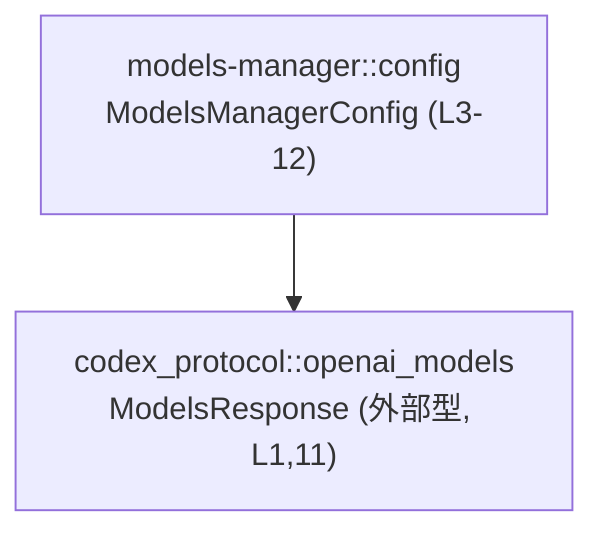
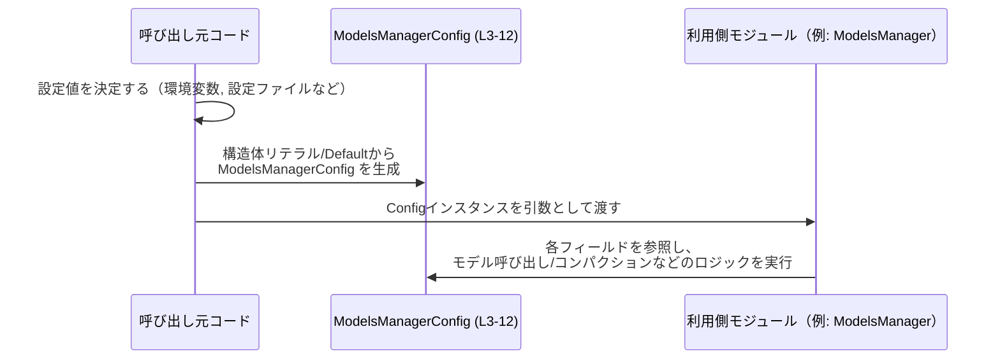

# models-manager/src/config.rs コード解説

## 0. ざっくり一言

`ModelsManagerConfig` 構造体を定義するファイルで、モデル関連の各種設定値（トークン上限、ベースプロンプト、パーソナリティ有効フラグ、モデルカタログなど）をまとめて保持するためのコンフィグ用データ型を提供しています（config.rs:L3-12）。

---

## 1. このモジュールの役割

### 1.1 概要

- このモジュールは、モデル管理機能で使用する設定値を 1 つの構造体にまとめて保持するために存在します（config.rs:L3-11）。
- 最大コンテキスト長や自動コンパクションのしきい値、ツール出力のトークン上限、ベースとなる指示文、パーソナリティ機能の有無、推論サマリー対応可否、利用可能モデル一覧などをオプションとして保持します（config.rs:L5-11）。
- 実際のロジック（モデル呼び出し、コンパクション処理など）はこのファイルには含まれず、別のモジュールからこの設定が参照される前提の「データ定義」専用モジュールになっています。

### 1.2 アーキテクチャ内での位置づけ

このチャンクから読み取れる依存関係は、`ModelsManagerConfig` が外部クレート `codex_protocol` の `ModelsResponse` 型を参照している点のみです（config.rs:L1, L11）。



- 左側のノードがこのファイルで定義されている `ModelsManagerConfig`（config.rs:L3-12）です。
- 右側のノードは外部クレート `codex_protocol` が提供する `ModelsResponse` 型であり、`model_catalog` フィールドの型として参照されています（config.rs:L1, L11）。
- `ModelsManagerConfig` を実際に利用する「モデルマネージャ」やサービス層のコードは、このチャンクには現れません。

### 1.3 設計上のポイント

コードから読み取れる設計上の特徴は次のとおりです。

- **純粋なデータコンテナ**  
  - メソッドや関数は定義されておらず、フィールドだけを持つ構造体です（config.rs:L3-11）。
- **全フィールドが `pub`**  
  - すべてのフィールドが `pub` として公開されており、呼び出し側から直接読み書きできる設計になっています（config.rs:L5-11）。
- **多くの項目が `Option`**  
  - `bool` 以外はすべて `Option<T>` で定義されており、「未設定」と「設定済み」の区別をつけられるようになっています（config.rs:L5-8, L10-11）。
- **デリブ（derive）による基本トレイト実装**  
  - `Debug`・`Clone`・`Default` を `derive` しており、デバッグ出力・クローン・デフォルト値生成が自動的に実装されています（config.rs:L3）。
  - `Default` の実装により、すべての `Option` フィールドは既定で `None`、`personality_enabled` は既定で `false` になります（config.rs:L5-11）。
- **バリデーションや不変条件は構造体側では持たない**  
  - 値の範囲チェックやフィールド間の整合性チェックなどは一切行われていません。設定値の妥当性確認は利用側の責務になります（構造体にメソッド不在: config.rs:L3-12）。

### 1.4 コンポーネント一覧（このチャンク）

このチャンクに登場する「定義済みコンポーネント」と「外部依存コンポーネント」を整理します。

#### 定義済みコンポーネント

| 名前                 | 種別     | 可視性 | 定義範囲                 | 説明 |
|----------------------|----------|--------|--------------------------|------|
| `ModelsManagerConfig`| 構造体   | `pub`  | config.rs:L3-12          | モデル管理処理に関する各種設定値を保持するデータコンテナ |

#### 外部依存コンポーネント

| 名前            | 種別   | 由来クレート   | 参照箇所               | 説明 |
|-----------------|--------|----------------|------------------------|------|
| `ModelsResponse`| 構造体（あるいは別の型）| `codex_protocol` | `use` とフィールド型（config.rs:L1, L11） | モデルカタログ（モデル一覧とメタ情報）を表現する型と推測されますが、実体はこのチャンクには現れません |

---

## 2. 主要な機能一覧

このファイルはロジックではなく設定データ型のみを提供します。そのため「機能」は構造体の役割として整理します。

- `ModelsManagerConfig`: モデルのコンテキスト長やトークン制限、ベースプロンプト、パーソナリティ設定、推論サマリー対応可否、モデルカタログなど、モデル関連の設定値をまとめて保持する（config.rs:L3-11）。

---

## 3. 公開 API と詳細解説

### 3.1 型一覧（構造体・列挙体など）

#### 構造体 `ModelsManagerConfig`

| フィールド名                           | 型                           | 必須/任意 | 定義範囲        | 説明 |
|----------------------------------------|------------------------------|-----------|-----------------|------|
| `model_context_window`                 | `Option<i64>`               | 任意      | config.rs:L5    | モデルのコンテキストウィンドウ（最大トークン長など）を設定するための数値。`None` の場合はデフォルトやモデル側の既定値を使うことを想定できるが、このチャンクからは確定できません。 |
| `model_auto_compact_token_limit`       | `Option<i64>`               | 任意      | config.rs:L6    | 自動コンパクション（トークン削減）を行うしきい値を表す数値。`None` の場合の扱いはこのチャンクには現れません。 |
| `tool_output_token_limit`              | `Option<usize>`             | 任意      | config.rs:L7    | ツールの出力に許可する最大トークン数上限。`usize` であるためプラットフォーム依存のサイズを持ちます。 |
| `base_instructions`                    | `Option<String>`            | 任意      | config.rs:L8    | モデルに対するベースプロンプトやシステムインストラクションを表す文字列。`None` の場合はベースプロンプトなしとみなされる可能性がありますが、詳細は不明です。 |
| `personality_enabled`                  | `bool`                      | 必須      | config.rs:L9    | パーソナリティ機能（キャラクター性や人格設定）を有効にするかどうかを示すフラグ。`Default` では `false` になります（config.rs:L3, L9）。 |
| `model_supports_reasoning_summaries`   | `Option<bool>`              | 任意      | config.rs:L10   | モデルが「reasoning summaries」のような機能に対応しているかどうかを示すオプションフラグ。`None` は「不明」や「未設定」を表すことができます。 |
| `model_catalog`                        | `Option<ModelsResponse>`    | 任意      | config.rs:L11   | 利用可能なモデルのカタログ情報。外部型 `ModelsResponse` に依存しており、`None` の場合にどのような扱いになるかはこのチャンクには現れません。 |

**トレイト実装（derive）**

- `Debug`: `{:?}` フォーマットで中身を表示可能です（config.rs:L3）。
- `Clone`: 値のクローン（深いコピー）が可能です（config.rs:L3）。  
  - これにより、複数のスレッドやコンポーネントで設定をコピーして利用する場合も、元の設定を共有せずに安全に複製できます。
- `Default`: デフォルト値を `ModelsManagerConfig::default()` で生成できます（config.rs:L3）。  
  - 全 `Option` フィールドは `None`、`personality_enabled` は `false` になります（config.rs:L5-11）。

### 3.2 関数詳細（最大 7 件）

このファイルには関数やメソッドは定義されていません（構造体定義のみ: config.rs:L3-12）。

そのため、「関数詳細」セクションに記述すべき公開関数はありません。

### 3.3 その他の関数

- 該当なし（関数定義自体がこのチャンクには存在しません: config.rs:L1-12）。

---

## 4. データフロー

このチャンクには処理ロジックがなく、`ModelsManagerConfig` の利用箇所も現れません。そのため、具体的なモジュール間のデータフローはコードからは読み取れません。

ここでは **「Rust における設定用構造体の一般的な利用形態」** として、`ModelsManagerConfig` がどのように生成され、別モジュールに渡されて利用されるかを抽象的に示します。



- 上記シーケンス図は、`ModelsManagerConfig` の **典型的な使い方のイメージ** であり、実際の呼び出し先モジュール名や処理内容はこのチャンクには現れません。
- 事実として言えるのは、「この構造体が他のコードから生成され、そのフィールドを読み出されて利用される」という一般的なデータフローのみです。

---

## 5. 使い方（How to Use）

### 5.1 基本的な使用方法

この構造体は、基本的に「構造体リテラル」または `Default` をベースにフィールドを上書きして利用する形になります（config.rs:L3-11）。

以下は、モジュールパスを仮に `crate::config::ModelsManagerConfig` とした場合の一般的な例です。  
※ 実際のモジュールパスはプロジェクト全体の構成に依存し、このチャンクだけからは確定できません。

```rust
// 実際のパスはプロジェクト構成に依存します。
// ここでは例として crate 直下に config モジュールがある前提で書いています。
use crate::config::ModelsManagerConfig;                  // ModelsManagerConfig 型をインポートする
// ModelsResponse の具体的な取得方法はこのチャンクには現れないため、
// ここでは仮の変数 models_response として扱います。
use codex_protocol::openai_models::ModelsResponse;       // 外部クレートの型（config.rs:L1）

fn build_config(models_response: ModelsResponse) -> ModelsManagerConfig {
    ModelsManagerConfig {                                // 構造体リテラルでインスタンス生成（config.rs:L4）
        model_context_window: Some(8192),               // 最大コンテキスト長を 8192 トークンに設定（例）
        model_auto_compact_token_limit: Some(6000),     // 6000 トークンを超えたら自動コンパクションする（例）
        tool_output_token_limit: Some(1024),            // ツール出力を最大 1024 トークンに制限（例）
        base_instructions: Some(
            "You are a helpful assistant.".to_string(), // ベースプロンプトを設定（例）
        ),
        personality_enabled: true,                      // パーソナリティ機能を有効化（config.rs:L9）
        model_supports_reasoning_summaries: Some(true), // 推論サマリー対応モデルを前提とする（例）
        model_catalog: Some(models_response),           // モデルカタログをセット（config.rs:L11）
    }
}
```

- `Option` 型のフィールドは、必要に応じて `Some(...)` で設定し、未設定としたい場合は `None` を指定します。
- `personality_enabled` は `bool` なので `true` / `false` を直接指定します（config.rs:L9）。

### 5.2 よくある使用パターン

#### 5.2.1 `Default` を使って必要な部分だけ上書きする

`Default` 実装があるため、すべてを指定せずに一部だけ上書きする形がとれます（config.rs:L3）。

```rust
use crate::config::ModelsManagerConfig;

fn default_based_config() -> ModelsManagerConfig {
    let mut config = ModelsManagerConfig::default();     // 全フィールド None/false で初期化（config.rs:L5-11）

    // 必要な項目だけを上書きする
    config.model_context_window = Some(4096);            // コンテキスト長だけ設定
    config.personality_enabled = false;                  // 既定が false なので明示しなくても同じだが、意図を示すために設定してもよい

    config
}
```

- `Default` は「最低限の安全な初期状態」というより、「すべて未設定（Option が None）の状態」に近いことに注意が必要です。
- どのフィールドを必須とみなすかは、この構造体を利用する側のロジック次第であり、このチャンクには現れません。

### 5.3 よくある間違い（推測される誤用）

実際の利用コードはこのチャンクには存在しませんが、この構造体の形から起こり得る誤用の一例を挙げます。

```rust
use crate::config::ModelsManagerConfig;

fn wrong_usage() {
    let config = ModelsManagerConfig::default();         // すべての Option が None、personality_enabled は false

    // 間違い例: None の可能性を考慮せずに unwrap してしまう
    let ctx = config.model_context_window.unwrap();      // model_context_window は None のままなので panic の可能性
}
```

```rust
// 正しい例: None の場合の扱い（デフォルト値やエラーなど）を明示的に決める
fn correct_usage() {
    let config = ModelsManagerConfig::default();

    let ctx = config
        .model_context_window
        .unwrap_or(4096);                                // None の場合は 4096 を使うなどのフォールバックを行う
}
```

- `Option` フィールドに対して `unwrap()` を直接呼び出すと、`None` のときに `panic!` になるため、呼び出し側で `unwrap_or` や `match` などで安全に扱う必要があります。
- このファイル自体は `unwrap` などを呼んでいないため、panic のリスクは「利用側の書き方」に依存します。

### 5.4 使用上の注意点（まとめ）

- **前提条件**
  - `Option` フィールドは `None` の可能性があるため、利用側は `None` を必ず考慮する必要があります（config.rs:L5-8, L10-11）。
- **禁止/避けるべきパターン**
  - `Option` に対して無条件に `unwrap()` することは避けるべきです。入力が設定ファイルや外部入力に依存する場合、`None` になる可能性があります。
- **エラー・パニック条件**
  - このファイル内にはエラーを返したり `panic!` を発生させるコードは存在しません（config.rs:L1-12）。
  - ただしフィールドが `pub` であるため、利用側における不適切な値（極端に小さい/大きいトークン数など）はこの構造体では防げません。
- **並行性に関する注意**
  - この構造体はミュータブルなグローバル状態を持たず、単なるデータコンテナです。  
    並行性の安全性（`Send`/`Sync` など）は、外部型 `ModelsResponse` の実装にも依存しますが、このチャンクにはその情報がありません（config.rs:L1, L11）。
- **セキュリティに関する注意**
  - この構造体単体で外部 I/O やシステムコールは行わず、セキュリティ上の処理も含まれていません（config.rs:L1-12）。  
  - `base_instructions` の内容がそのままモデルへの指示になる場合、プロンプトインジェクションなどのリスクは「利用側のロジック」と「入力元」に依存します。

---

## 6. 変更の仕方（How to Modify）

### 6.1 新しい機能を追加する場合（新しい設定項目を追加する）

新しい設定値を `ModelsManagerConfig` に追加したい場合の一般的な手順は次のとおりです。

1. **フィールドの追加**  
   - `pub` フィールドとして構造体に追加します（config.rs:L4-11 と同様のパターン）。
   - 必須か任意かに応じて、`T` か `Option<T>` かを選択します。

   ```rust
   #[derive(Debug, Clone, Default)]
   pub struct ModelsManagerConfig {
       // 既存フィールド…
       pub some_new_limit: Option<u32>,                  // 新しい設定項目（例）
   }
   ```

2. **Default の影響を確認**  
   - `derive(Default)` によって、新しい `Option` フィールドは `None`、`bool` 等は型の既定値になります（config.rs:L3）。
   - 既存コードが `ModelsManagerConfig::default()` を利用している場合、新フィールドは `None`/`0`/`false` などとして扱われることを前提に設計する必要があります。

3. **利用側コードの修正**  
   - 新フィールドを実際に読み書きするロジックは別ファイル側に追加する必要があります。このチャンクからは利用側を特定できないため、「モデル管理」関連のモジュールを検索して修正することになります。

### 6.2 既存の機能を変更する場合

既存フィールドの型や意味を変更する場合、次の点に注意する必要があります。

- **影響範囲の確認**
  - 構造体フィールドはすべて `pub` であるため、クレート内外の多くの箇所から直接参照されている可能性があります（config.rs:L5-11）。
  - 型変更や名前変更は広範なコンパイルエラーを生む可能性があるため、全呼び出し箇所を検索して修正する必要があります。

- **契約（前提条件・返り値の意味）の変更**
  - たとえば `Option<i64>` を `i64` に変更する場合、「未設定（None）」という状態が表現できなくなります。
  - その場合、利用側のコードが `None` を期待しているかどうかを確認し、必要ならデフォルト値の導入やロジックの変更が必要になります。

- **テストの確認**
  - このチャンクにはテストコードは含まれていませんが、プロジェクト内のテスト（`*_test.rs` や `tests/` ディレクトリなど）で `ModelsManagerConfig` を使っている箇所があれば、それらを更新・追加する必要があります。

---

## 7. 関連ファイル

このチャンクから直接わかる関連ファイル・コンポーネントは次のとおりです。

| パス / コンポーネント                          | 役割 / 関係 |
|-----------------------------------------------|------------|
| `codex_protocol::openai_models::ModelsResponse` | モデルカタログを表現する外部型。`model_catalog` フィールドの型として参照されています（config.rs:L1, L11）。 |
| （不明）                                      | `ModelsManagerConfig` を実際に利用する「モデルマネージャ」やサービス層のモジュールは、このチャンクには現れません。 |

---

### Bugs / Security / Edge Cases / Tests / Performance についての補足（このファイル単体）

- **Bugs**  
  - このファイル単体では、明らかな論理バグやコンパイルエラーとなるコードは見当たりません（config.rs:L1-12）。
- **Security**  
  - 外部入力や I/O を扱う処理はなく、このファイル単体でセキュリティ上の問題は確認できません。
- **Contracts / Edge Cases**  
  - 契約に近い性質として、「`Option` フィールドは `None` の可能性がある」「`Default` はすべて未設定＋`personality_enabled = false` である」という前提が利用側に求められます（config.rs:L3, L5-11）。
- **Tests**  
  - テストコードはこのチャンクには存在しません。`ModelsManagerConfig` を使ったテストがあるかどうかは、他ファイルを確認する必要があります。
- **Performance / Scalability**  
  - 単なる設定用構造体であり、ループや I/O、重い計算は含まれていないため、このファイル単体では性能・スケーラビリティの懸念はほぼありません。
- **Observability（可観測性）**  
  - ログ出力やメトリクス取得などは行われておらず、可観測性はこの構造体を使用する側のコードに依存します。
