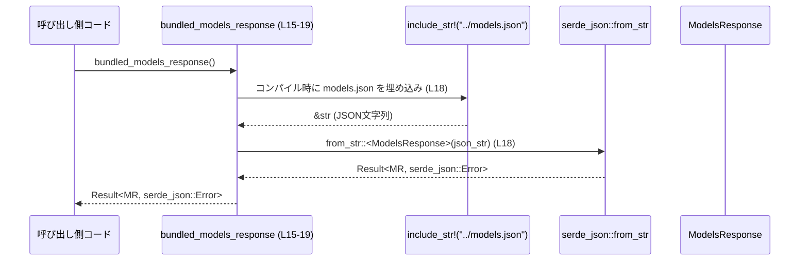

# models-manager/src/lib.rs コード解説

## 0. ざっくり一言

このファイルは `models-manager` クレートのルートモジュールとして、内部モジュールの公開・外部型の再公開に加え、バンドル済みモデルカタログの読み込みと、クレートバージョンから「メジャー.マイナー.パッチ」形式の文字列を生成する 2 つのユーティリティ関数を提供しています（models-manager/src/lib.rs:L1-6, L8-13, L15-29）。

---

## 1. このモジュールの役割

### 1.1 概要

- このモジュールは **「モデル管理クレートの公開 API の入口」** として機能し、以下を提供します。
  - 内部モジュール `cache`, `config`, `manager`, `model_info`, `model_presets` の宣言と一部公開（models-manager/src/lib.rs:L1-6）。
  - 認証・モデルプロバイダ情報関連の型の再公開（models-manager/src/lib.rs:L8-12）。
  - モデルカタログ JSON (`../models.json`) を `ModelsResponse` 型にパースする関数 `bundled_models_response`（models-manager/src/lib.rs:L15-19）。
  - コンパイル時のクレートバージョンから `"MAJOR.MINOR.PATCH"` 形式の文字列を生成する `client_version_to_whole`（models-manager/src/lib.rs:L21-28）。

### 1.2 アーキテクチャ内での位置づけ

このファイルは crate root であり、内部モジュールや外部クレートにまたがる型を集約するハブになっています。

- 内部モジュール
  - `cache`（crate 内部限定: `pub(crate)`、models-manager/src/lib.rs:L1）
  - `collaboration_mode_presets`（公開: `pub`、models-manager/src/lib.rs:L2）
  - `config`（crate 内部限定: `pub(crate)`、models-manager/src/lib.rs:L3）
  - `manager`（公開: `pub`、models-manager/src/lib.rs:L4）
  - `model_info`（公開: `pub`、models-manager/src/lib.rs:L5）
  - `model_presets`（公開: `pub`、models-manager/src/lib.rs:L6）
- 外部クレートからの再公開
  - `AuthMode`（`codex_app_server_protocol` 由来、models-manager/src/lib.rs:L8）
  - `AuthManager`, `CodexAuth`（`codex_login` 由来、models-manager/src/lib.rs:L9-10）
  - `ModelProviderInfo`, `WireApi`（`codex_model_provider_info` 由来、models-manager/src/lib.rs:L11-12）
  - `ModelsManagerConfig`（内部 `config` モジュール由来、models-manager/src/lib.rs:L13）

依存関係を簡略化した図を次に示します。

```mermaid
graph TD
    subgraph "models-manager/src/lib.rs (L1-29)"
        Root["crate root lib.rs"]
        F1["bundled_models_response (L15-19)"]
        F2["client_version_to_whole (L21-28)"]
        ModConfig["mod config (L3)"]
        ModManager["mod manager (L4)"]
    end

    Root --> ModConfig
    Root --> ModManager
    Root --> F1
    Root --> F2

    F1 --> Serde["serde_json::from_str (L18)"]
    F1 --> ModelsResp["codex_protocol::openai_models::ModelsResponse (L17)"]
    F1 --> ModelsJson["include_str!(\"../models.json\") (L18)"]

    F2 --> EnvMacros["env!(CARGO_PKG_VERSION_*) (L25-27)"]
```

> 他のモジュール（`cache`, `collaboration_mode_presets`, `model_info`, `model_presets`）はこのチャンクで中身が見えないため、役割の詳細は不明です（models-manager/src/lib.rs:L1-6）。

### 1.3 設計上のポイント

- **crate root に API を集約**
  - 外部から利用されるであろう型を `pub use` で再公開し、利用者が個別クレートや内部モジュール名を意識せずに済む構造です（models-manager/src/lib.rs:L8-13）。
- **状態を持たない純粋なユーティリティ関数**
  - `bundled_models_response` / `client_version_to_whole` はいずれも引数・内部可変状態を持たず、入力はコンパイル時に確定したリソース（JSON ファイル・Cargo メタデータ）に限定されます（models-manager/src/lib.rs:L15-19, L21-28）。
- **エラーハンドリング**
  - JSON パースは `Result<ModelsResponse, serde_json::Error>` を返し、失敗を例外ではなく戻り値で表現しています（models-manager/src/lib.rs:L16-17）。
- **並行性（スレッド安全性）**
  - 両関数とも共有可変状態にアクセスせず、副作用はありません。標準的な Rust のルールに従えば、任意のスレッドから安全に呼び出すことができる構造になっています（models-manager/src/lib.rs:L15-19, L21-28）。
- **安全性（unsafe 不使用）**
  - このファイル内には `unsafe` ブロックは存在しません（models-manager/src/lib.rs:L1-29 全体）。

---

## 2. 主要な機能一覧（コンポーネントインベントリー）

### 2.1 コンポーネント一覧（このファイル）

| 種別 | 名前 | 公開範囲 | 定義位置 | 役割（このチャンクから分かる範囲） |
|------|------|----------|----------|------------------------------------|
| モジュール | `cache` | `pub(crate)` | lib.rs:L1 | キャッシュ関連機能を提供する内部モジュールと思われますが、詳細はこのチャンクには現れません。 |
| モジュール | `collaboration_mode_presets` | `pub` | lib.rs:L2 | コラボレーションモードのプリセット関連モジュールと推測されますが、実装は不明です。 |
| モジュール | `config` | `pub(crate)` | lib.rs:L3 | モデルマネージャ設定 (`ModelsManagerConfig`) を定義する内部モジュール（lib.rs:L13 と対応）。 |
| モジュール | `manager` | `pub` | lib.rs:L4 | モデル管理のメインロジックを含むモジュールと推測されますが、このチャンクでは中身は不明です。 |
| モジュール | `model_info` | `pub` | lib.rs:L5 | モデル情報に関する型や処理を持つと推測されますが、詳細は不明です。 |
| モジュール | `model_presets` | `pub` | lib.rs:L6 | モデルプリセット定義を持つと推測されますが、実装は不明です。 |
| 型 re-export | `AuthMode` | `pub` | lib.rs:L8 | 認証モードを表す型（`codex_app_server_protocol` 由来）。定義内容はこのチャンクには現れません。 |
| 型 re-export | `AuthManager` | `pub` | lib.rs:L9 | 認証管理を行う型（`codex_login` 由来）。詳細不明。 |
| 型 re-export | `CodexAuth` | `pub` | lib.rs:L10 | 認証関連の型（`codex_login` 由来）。詳細不明。 |
| 型 re-export | `ModelProviderInfo` | `pub` | lib.rs:L11 | モデルプロバイダ情報を保持する型（`codex_model_provider_info` 由来）。詳細不明。 |
| 型 re-export | `WireApi` | `pub` | lib.rs:L12 | Wire プロトコル/API を表す型（`codex_model_provider_info` 由来）。詳細不明。 |
| 型 re-export | `ModelsManagerConfig` | `pub` | lib.rs:L13 | モデルマネージャの設定型。`config` モジュールから再公開されています。 |
| 関数 | `bundled_models_response` | `pub` | lib.rs:L15-19 | バンドルされた `models.json` をパースして `ModelsResponse` を返す。 |
| 関数 | `client_version_to_whole` | `pub` | lib.rs:L21-28 | Cargo メタデータから `"MAJOR.MINOR.PATCH"` 形式のバージョン文字列を生成する。 |

> モジュールや再公開された型の内部実装は、このチャンクには一切現れません。そのため、詳細な振る舞いはここでは「不明」となります。

### 2.2 主要な機能（箇条書き）

- モデルカタログの読み込み: クレートにバンドルされた `models.json` を `ModelsResponse` にパースする（models-manager/src/lib.rs:L15-19）。
- バージョン文字列生成: クレートのバージョンから `"MAJOR.MINOR.PATCH"` 形式の文字列を作る（models-manager/src/lib.rs:L21-28）。
- 認証・モデルプロバイダ情報の型公開: 上記の関連型をまとめて再公開し、利用者コードからのアクセスを簡略化する（models-manager/src/lib.rs:L8-13）。
- モデル管理関連モジュールの公開: `manager` や各種プリセット・情報モジュールを crate root から参照可能にする（models-manager/src/lib.rs:L2, L4-6）。

---

## 3. 公開 API と詳細解説

### 3.1 型一覧（構造体・列挙体など）

このファイル自体は新しい型を定義していませんが、外部および内部モジュールの型を再公開しています。

| 名前 | 種別 | 出自 | 役割 / 用途（このチャンクから分かる範囲） | 根拠 |
|------|------|------|--------------------------------------------|------|
| `AuthMode` | 不明（外部） | `codex_app_server_protocol` | 認証モードに関する型。API プロトコル側で定義されており、このクレートからも利用できるようにしています。内部構造は不明です。 | `pub use codex_app_server_protocol::AuthMode;`（lib.rs:L8） |
| `AuthManager` | 不明（外部） | `codex_login` | 認証処理を管理する型と推測されますが、詳細不明です。 | `pub use codex_login::AuthManager;`（lib.rs:L9） |
| `CodexAuth` | 不明（外部） | `codex_login` | 認証情報や認証ハンドラを表す型と推測されますが、詳細不明です。 | `pub use codex_login::CodexAuth;`（lib.rs:L10） |
| `ModelProviderInfo` | 不明（外部） | `codex_model_provider_info` | モデル提供者の情報を表す型。モデル管理の文脈で利用されると考えられますが、中身は不明です。 | `pub use codex_model_provider_info::ModelProviderInfo;`（lib.rs:L11） |
| `WireApi` | 不明（外部） | `codex_model_provider_info` | Wire プロトコル/API を扱う型と推測されますが、詳細不明です。 | `pub use codex_model_provider_info::WireApi;`（lib.rs:L12） |
| `ModelsManagerConfig` | 不明（内部） | `config` モジュール | モデルマネージャの設定オブジェクト。内部のフィールドや構造はこのチャンクからは分かりません。 | `pub use config::ModelsManagerConfig;`（lib.rs:L13） |

> いずれの型も、このファイルでは **型エイリアスや再公開** のみ行っており、定義本体は他ファイル・他クレートにあります。

### 3.2 関数詳細（2 件）

#### `bundled_models_response() -> Result<codex_protocol::openai_models::ModelsResponse, serde_json::Error>`

**概要**

- クレートにバンドルされている `models.json` ファイルの内容をコンパイル時に文字列として埋め込み、それを `serde_json::from_str` でパースして `ModelsResponse` 型として返します（models-manager/src/lib.rs:L15-19）。
- パースに失敗した場合は `serde_json::Error` を返します。

**シグネチャと定義**

```rust
/// Load the bundled model catalog shipped with `codex-models-manager`.
pub fn bundled_models_response()
-> std::result::Result<codex_protocol::openai_models::ModelsResponse, serde_json::Error> {
    serde_json::from_str(include_str!("../models.json"))
}
```

（models-manager/src/lib.rs:L15-19）

**引数**

- 引数はありません。

**戻り値**

- 型: `Result<codex_protocol::openai_models::ModelsResponse, serde_json::Error>`（models-manager/src/lib.rs:L16-17）
  - `Ok(ModelsResponse)`:
    - `../models.json` の中身が期待される JSON 形式であり、`ModelsResponse` 型に正しくデシリアライズできた場合。
  - `Err(serde_json::Error)`:
    - JSON が壊れている、あるいは `ModelsResponse` 型の期待と合わない形式である等、`serde_json::from_str` が失敗した場合。

**内部処理の流れ（アルゴリズム）**

1. `include_str!("../models.json")` により、コンパイル時に `../models.json` の全内容を UTF-8 文字列としてバイナリに埋め込みます（models-manager/src/lib.rs:L18）。
   - `include_str!` はコンパイル時マクロであり、ファイルパスが間違っている場合、コンパイルエラーになります（実行時エラーではありません）。
2. 埋め込まれた JSON 文字列を `serde_json::from_str` に渡し、`ModelsResponse` 型へのデシリアライズを試みます（models-manager/src/lib.rs:L18）。
3. `serde_json::from_str` の返り値（`Result<ModelsResponse, serde_json::Error>`）をそのまま呼び出し元に返します（models-manager/src/lib.rs:L18-19）。

**簡単なフローチャート**

```mermaid
flowchart TD
    A["呼び出し bundled_models_response (L15-19)"] --> B["include_str!(\"../models.json\") で JSON 文字列取得 (L18)"]
    B --> C["serde_json::from_str::<ModelsResponse>(...) (L18)"]
    C -->|Ok| D["Ok(ModelsResponse) を返す"]
    C -->|Err| E["Err(serde_json::Error) を返す"]
```

**Examples（使用例）**

次の例は、バンドルされたモデルカタログを読み込み、アプリケーション起動時に一度だけ初期化するパターンです。

```rust
use models_manager::bundled_models_response; // クレート名は仮のものです // lib.rs で pub fn として公開されている

fn init_models() -> Result<(), serde_json::Error> {       // モデル初期化用の関数を定義する
    let models = bundled_models_response()?;              // バンドル JSON をパースして ModelsResponse を取得する
    // ここで models をアプリケーションの状態に保存するなどの処理を行う
    // 具体的なフィールドやメソッドは、このチャンクからは分かりません
    Ok(())                                                // 正常終了
}
```

`?` 演算子により、`serde_json::Error` がそのまま呼び出し元に伝播します。

**Errors / Panics**

- **Errors**
  - `serde_json::Error` が返る条件:
    - `../models.json` が JSON として不正な形式である場合。
    - `codex_protocol::openai_models::ModelsResponse` の期待するスキーマと JSON が合致しない場合。
  - これらはいずれも `serde_json::from_str` の仕様に依存し、このファイルのコードからは詳細なエラー条件は分かりません（models-manager/src/lib.rs:L18）。
- **Panics**
  - 実行時パニックを発生させるコードは含まれていません。
  - `include_str!("../models.json")` のパスが誤っている場合などは **コンパイル時エラー** となり、実行に到達しません（models-manager/src/lib.rs:L18）。

**Edge cases（エッジケース）**

- `models.json` が空ファイル:
  - 空文字列は有効な JSON ではないため、`serde_json::from_str` は `Err(serde_json::Error)` を返すと考えられます（根拠: 空文字は JSON として不正であるという serde_json の一般仕様。コード上では特別扱いはありません: models-manager/src/lib.rs:L18）。
- `models.json` に余分なフィールドや想定外の値が含まれる:
  - どのように扱われるかは `ModelsResponse` の定義と serde の設定に依存し、このチャンクからは分かりません。
- `models.json` の文字コードやエンコーディング:
  - `include_str!` は UTF-8 を前提とするため、非 UTF-8 のバイト列はコンパイルエラーとなります（実行時エラーにはなりません）。

**使用上の注意点**

- **前提条件**
  - ビルド時に `../models.json` が存在し、UTF-8 の有効な JSON として解釈できる必要があります（models-manager/src/lib.rs:L18）。
- **禁止事項・注意事項**
  - ファイルパスを動的に変えたり、実行時に別の JSON を読み込む用途には使えません。`include_str!` により **コンパイル時に固定された内容** だけを扱います。
- **パフォーマンス**
  - JSON 文字列はバイナリに静的に埋め込まれるため、ファイル I/O は発生しません。
  - 呼び出しのたびに `serde_json::from_str` によるパース処理（メモリアロケーション込み）が行われるため、頻繁な呼び出しが必要な場合はキャッシュする設計が望ましいです（ただしキャッシュ処理はこのファイルの範囲外です）。
- **並行性**
  - 共有状態への書き込みがないため、複数スレッドから同時に呼び出してもレースコンディションは発生しません（models-manager/src/lib.rs:L18）。

---

#### `client_version_to_whole() -> String`

**概要**

- コンパイル時に定義される Cargo のパッケージバージョン情報（`CARGO_PKG_VERSION_MAJOR/MINOR/PATCH`）を取得し、それらを `"MAJOR.MINOR.PATCH"` 形式の文字列にフォーマットして返します（models-manager/src/lib.rs:L21-28）。
- ドキュメントコメントでは「クライアントバージョン文字列をホールバージョン文字列に変換する」と記述されていますが、実装はパラメータを取らず、コンパイル時のパッケージバージョンを用いています（models-manager/src/lib.rs:L21-28）。

**シグネチャと定義**

```rust
/// Convert the client version string to a whole version string (e.g. "1.2.3-alpha.4" -> "1.2.3").
pub fn client_version_to_whole() -> String {
    format!(
        "{}.{}.{}",
        env!("CARGO_PKG_VERSION_MAJOR"),
        env!("CARGO_PKG_VERSION_MINOR"),
        env!("CARGO_PKG_VERSION_PATCH")
    )
}
```

（models-manager/src/lib.rs:L21-28）

**引数**

- 引数はありません。

**戻り値**

- 型: `String`（models-manager/src/lib.rs:L22）
- 意味:
  - このクレートの Cargo パッケージのバージョンの **メジャー・マイナー・パッチ** を `"MAJOR.MINOR.PATCH"` 形式に連結した文字列です（models-manager/src/lib.rs:L23-27）。
  - 例として、パッケージバージョン `1.2.3-alpha.4` の場合でも、`CARGO_PKG_VERSION_MAJOR=1`, `MINOR=2`, `PATCH=3` となるため `"1.2.3"` が返ることになります（これは Cargo のビルトイン環境変数の一般仕様に基づく説明です）。

**内部処理の流れ（アルゴリズム）**

1. マクロ `env!("CARGO_PKG_VERSION_MAJOR")` により、コンパイル時に埋め込まれたメジャーバージョン文字列を取得します（models-manager/src/lib.rs:L25）。
2. 同様に、`CARGO_PKG_VERSION_MINOR`, `CARGO_PKG_VERSION_PATCH` を取得します（models-manager/src/lib.rs:L26-27）。
3. `format!("{}.{}.{}", major, minor, patch)` で 3 つの文字列を `"."` 区切りで連結し、新しい `String` を生成します（models-manager/src/lib.rs:L23-27）。
4. 生成された `String` を返します（models-manager/src/lib.rs:L22-28）。

**Examples（使用例）**

アプリケーションのバージョンをログや UI に表示する用途の例です。

```rust
use models_manager::client_version_to_whole;  // lib.rs で pub fn として公開されている

fn print_version() {                                      // バージョン表示用の関数を定義する
    let version = client_version_to_whole();             // "MAJOR.MINOR.PATCH" 形式の文字列を取得する
    println!("Client version: {}", version);             // コンソール等に表示する
}
```

**Errors / Panics**

- **Errors**
  - 実行時に `Result` は返さないため、戻り値としてのエラーは発生しません。
- **Panics / コンパイルエラー**
  - `env!` マクロは指定された環境変数が存在しない場合にコンパイルエラーになります。
  - `CARGO_PKG_VERSION_MAJOR` などは Cargo により自動的に定義されるため、通常の Cargo ビルドでは問題なくコンパイルされます（models-manager/src/lib.rs:L25-27）。

**Edge cases（エッジケース）**

- プレリリース・ビルドメタデータ付きバージョン（例: `1.2.3-alpha.4+build.7`）:
  - `CARGO_PKG_VERSION_MAJOR/MINOR/PATCH` は数値部分のみを表すため、返り値は `"1.2.3"` のように **プレリリース・ビルドメタデータを含まない** 形式になります（models-manager/src/lib.rs:L23-27）。
- バージョンが `0.0.0` のような特殊なケース:
  - そのまま `"0.0.0"` を返します。特別な処理はありません（models-manager/src/lib.rs:L23-27）。

**使用上の注意点**

- **用途の限定**
  - この関数は **このクレート自身のバージョン** に基づいて文字列を生成します。外部から任意のバージョン文字列を渡して変換する汎用関数ではありません（models-manager/src/lib.rs:L21-28）。
- **パフォーマンス**
  - `String` を毎回新規に生成するため、極端に高頻度で呼び出す場合はキャッシュを検討できますが、通常の使用ではほとんど問題にならないレベルです（models-manager/src/lib.rs:L23-27）。
- **並行性**
  - 内部状態を持たない純粋関数であるため、どのスレッドから呼び出しても安全です（models-manager/src/lib.rs:L21-28）。

### 3.3 その他の関数

- このファイルには、上記 2 関数以外の関数定義はありません（models-manager/src/lib.rs:L1-29 を通して確認）。

---

## 4. データフロー

ここでは、代表的な処理シナリオとして `bundled_models_response` のデータフローを示します。

### 4.1 `bundled_models_response` のデータフロー

この関数は、呼び出し側から見ると「静的に埋め込まれた JSON データを `ModelsResponse` に変換して返す」処理の塊です。



- 入力:
  - 呼び出し時の動的な引数はなく、唯一の入力はコンパイル時に確定した `../models.json` の内容です（models-manager/src/lib.rs:L18）。
- 処理:
  - `serde_json::from_str` を用いた JSON → `ModelsResponse` へのデシリアライズ（models-manager/src/lib.rs:L18）。
- 出力:
  - デシリアライズ結果を `Result` としてそのまま返却（models-manager/src/lib.rs:L16-18）。

### 4.2 `client_version_to_whole` のデータフロー（概要）

こちらは非常に単純です。

- 入力:
  - コンパイル時に環境変数 `CARGO_PKG_VERSION_MAJOR/MINOR/PATCH` として埋め込まれた文字列（models-manager/src/lib.rs:L25-27）。
- 処理:
  - `format!` による `"MAJOR.MINOR.PATCH"` 形式への結合（models-manager/src/lib.rs:L23-27）。
- 出力:
  - 新しく生成した `String` を返却（models-manager/src/lib.rs:L22-28）。

---

## 5. 使い方（How to Use）

### 5.1 基本的な使用方法

`bundled_models_response` と `client_version_to_whole` を組み合わせて、アプリケーション起動時にモデルカタログを読み込みつつバージョンを表示する例です。

```rust
// 仮のクレート名として models_manager を想定する
use models_manager::{bundled_models_response, client_version_to_whole}; // lib.rs が再公開する関数をインポートする

fn main() -> Result<(), serde_json::Error> {              // JSON パースエラーを返しうる main 関数
    let version = client_version_to_whole();             // "MAJOR.MINOR.PATCH" 形式のバージョン文字列を取得する
    println!("Starting client version: {}", version);    // バージョンを表示する

    let models = bundled_models_response()?;             // バンドルされた models.json をパースして ModelsResponse を得る
    // ここで models をアプリケーションの状態に保存するなどの初期化処理を行う
    // ModelsResponse の中身はこのチャンクからは分からないため、具体的な使用コードは省略する

    Ok(())                                               // 正常終了
}
```

### 5.2 よくある使用パターン

1. **起動時に一度だけモデルカタログを読み込む**
   - アプリケーションの初期化コードで `bundled_models_response` を呼び出し、結果をグローバル状態や依存注入コンテナに格納するパターンが考えられます。
   - 呼び出しごとに JSON パースを行うため、多数回呼び出すよりは一度だけ実行してキャッシュするほうが効率的です（models-manager/src/lib.rs:L15-19）。

2. **バージョン表記のために `client_version_to_whole` を気軽に呼ぶ**
   - ログ出力・UI 表示・ヘルプメッセージなどで `"x.y.z"` 形式のバージョンが必要な場面で、直接 `client_version_to_whole` を呼び出すパターンです（models-manager/src/lib.rs:L21-28）。

### 5.3 よくある間違い（起こりうる誤解）

コードから推測される範囲で、誤解されやすそうな点を挙げます。

```rust
// 誤解されうる例: models.json の更新がすぐ反映されると思い込む
fn reload_models_every_time() -> Result<(), serde_json::Error> {
    let models = bundled_models_response()?;     // 毎回新鮮なファイル内容を読むと期待している
    // ...
    Ok(())
}

// 実際: include_str! によりコンパイル時に内容が固定されるため、
//      ファイルを差し替えても再ビルドしない限り変更は反映されない（lib.rs:L18）。
```

- `include_str!` による読み込みは **ビルド時に固定** されるため、ランタイムで `models.json` を差し替えても即座には反映されません（models-manager/src/lib.rs:L18）。

```rust
// 誤解されうる例: 任意のバージョン文字列を渡して整形できるユーティリティだと思う
fn wrong_usage() {
    // 想像上の API: client_version_to_whole("1.2.3-alpha.4");
    // 実際には引数を受け取らないためコンパイルエラーになる（lib.rs:L21-22）。
}
```

- `client_version_to_whole` は引数を取らず、常に **このクレート自身のバージョン** に基づいた文字列だけを返します（models-manager/src/lib.rs:L21-28）。

### 5.4 使用上の注意点（まとめ）

- `bundled_models_response`
  - ビルド時に `../models.json` が存在し、JSON として有効である必要があります（models-manager/src/lib.rs:L18）。
  - ランタイムにファイル内容を切り替える用途には向きません。
  - 頻繁に呼び出すと JSON パースコストが積み重なるため、起動時に一度呼び出して結果を保持する設計が望ましいです。
- `client_version_to_whole`
  - 汎用のバージョン文字列パーサではなく、Cargo が提供するバージョン情報を `"MAJOR.MINOR.PATCH"` 形式にするだけの関数です（models-manager/src/lib.rs:L23-27）。
- 並行性
  - 両関数とも副作用を持たない純粋関数であり、スレッドセーフです（models-manager/src/lib.rs:L15-19, L21-28）。

---

## 6. 変更の仕方（How to Modify）

### 6.1 新しい機能を追加する場合

このファイルは crate root であり、**新しい公開 API をぶら下げる場所** として適しています。

- 新しいユーティリティ関数を追加する場合:
  1. `pub fn new_function(...) { ... }` をこのファイルに追加する。
  2. 必要に応じて外部クレートを `Cargo.toml` で依存追加し、`use` 文またはフルパスで参照する。
- 新しいモジュールを追加する場合:
  1. `pub mod new_module;` あるいは `pub(crate) mod new_module;` をこのファイルに追加する（アクセスレベルは用途に応じて選択）。
  2. Rust の規約に従い、`models-manager/src/new_module.rs` または `models-manager/src/new_module/mod.rs` を作成し、そこで実装を書く。
- 既存モジュールの型を再公開したい場合:
  1. たとえば `config` モジュール内の新しい型を公開するには、`pub use config::NewType;` のように追記する（`ModelsManagerConfig` の再公開と同じパターン、models-manager/src/lib.rs:L13）。

### 6.2 既存の機能を変更する場合

1. **`bundled_models_response` の変更**
   - 別の JSON ファイルを読み込みたい場合:
     - `include_str!("../models.json")` のパスを変更する（models-manager/src/lib.rs:L18）。
   - 動的なファイル読み込み（ランタイム I/O）に変えたい場合:
     - `include_str!` と `serde_json::from_str` の組み合わせを、`std::fs::read_to_string` 等によるファイル読み込み+パースに置き換える。
     - その際、I/O エラーも扱う必要があり、戻り値のエラー型を拡張する必要が出ます。
   - 変更の影響:
     - この関数を呼び出しているすべての箇所で、戻り値型の変更やエラー条件の変化に注意する必要があります。
2. **`client_version_to_whole` の変更**
   - より柔軟な API（任意の入力バージョン文字列を整形）にしたい場合:
     - 新しい関数（例: `fn normalize_version(input: &str) -> String`）として追加するほうが安全です。
     - 既存の `client_version_to_whole` を変更すると、現在の利用者が依存している挙動（常にクレートバージョンを返す）を壊す可能性があります。
3. **影響範囲の確認**
   - このファイルは crate root であり、多くの外部コードから直接参照される可能性が高いため、公開 API のシグネチャ変更時にはクレート全体および依存プロジェクトでの使用箇所を検索し、影響を確認する必要があります。

---

## 7. 関連ファイル

このファイルと密接に関係するファイル・クレートをまとめます。役割は名前と再公開から推測できる範囲にとどめます。

| パス / クレート | 種別 | 役割 / 関係 |
|-----------------|------|------------|
| `models-manager/src/cache.rs` または `models-manager/src/cache/mod.rs` | 内部モジュール | `pub(crate) mod cache;` で宣言されているキャッシュ関連モジュールと推測されます（lib.rs:L1）。内容はこのチャンクには現れません。 |
| `models-manager/src/collaboration_mode_presets.rs` または `.../mod.rs` | 公開モジュール | コラボレーションモードのプリセットを扱うモジュールと推測されます（lib.rs:L2）。 |
| `models-manager/src/config.rs` または `.../mod.rs` | 内部モジュール | `ModelsManagerConfig` の定義を含む設定モジュール（lib.rs:L3, L13）。 |
| `models-manager/src/manager.rs` または `.../mod.rs` | 公開モジュール | モデル管理のコアロジックを提供すると考えられるモジュール（lib.rs:L4）。 |
| `models-manager/src/model_info.rs` または `.../mod.rs` | 公開モジュール | モデル情報の取得・表現を担当すると推測されるモジュール（lib.rs:L5）。 |
| `models-manager/src/model_presets.rs` または `.../mod.rs` | 公開モジュール | モデルのプリセット定義を提供すると推測されるモジュール（lib.rs:L6）。 |
| 外部クレート `codex_app_server_protocol` | 外部依存 | `AuthMode` 型を提供。認証プロトコル関連（lib.rs:L8）。 |
| 外部クレート `codex_login` | 外部依存 | `AuthManager`, `CodexAuth` を提供。ログイン・認証処理に関係（lib.rs:L9-10）。 |
| 外部クレート `codex_model_provider_info` | 外部依存 | モデルプロバイダ情報 (`ModelProviderInfo`, `WireApi`) を提供（lib.rs:L11-12）。 |
| 外部クレート `codex_protocol` | 外部依存 | `openai_models::ModelsResponse` 型を提供。モデルカタログの JSON 形式を定義していると考えられます（lib.rs:L16-17）。 |
| 外部クレート `serde_json` | 外部依存 | JSON のシリアライズ/デシリアライズを提供し、このファイルでは `from_str` が利用されています（lib.rs:L18）。 |

---

## テスト・バグ・セキュリティ・観測性について（このチャンクの範囲）

- **テスト**
  - このファイル内にはテストコード（`#[cfg(test)]` や `mod tests`）は存在しません（models-manager/src/lib.rs:L1-29）。
- **バグの可能性**
  - ドキュメントコメントと実装の乖離の可能性:
    - `client_version_to_whole` のコメントは「クライアントバージョン文字列を変換する」とある一方、実装は引数を取らずクレートバージョンに基づいています（models-manager/src/lib.rs:L21-28）。ただし、どの「クライアント」を指すかはこのチャンクからは分からず、バグかどうかは判断できません。
- **セキュリティ**
  - このファイル内で扱うデータは、コンパイル時に埋め込まれる JSON と Cargo が提供するバージョン文字列のみであり、外部からのユーザー入力は一切処理していません（models-manager/src/lib.rs:L18, L25-27）。
  - そのため、このチャンクに限れば入力検証不備やインジェクション等のリスクは低いと考えられます。
- **観測性（ロギング・メトリクス）**
  - このファイル内にはログ出力・メトリクス送信・トレースなどのコードは存在しません（models-manager/src/lib.rs:L1-29）。

以上が、`models-manager/src/lib.rs` に関する公開 API とコアロジックの解説、およびコンポーネント一覧・データフローとエッジケースの整理です。
