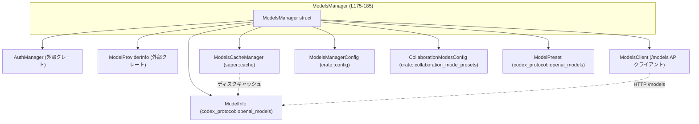
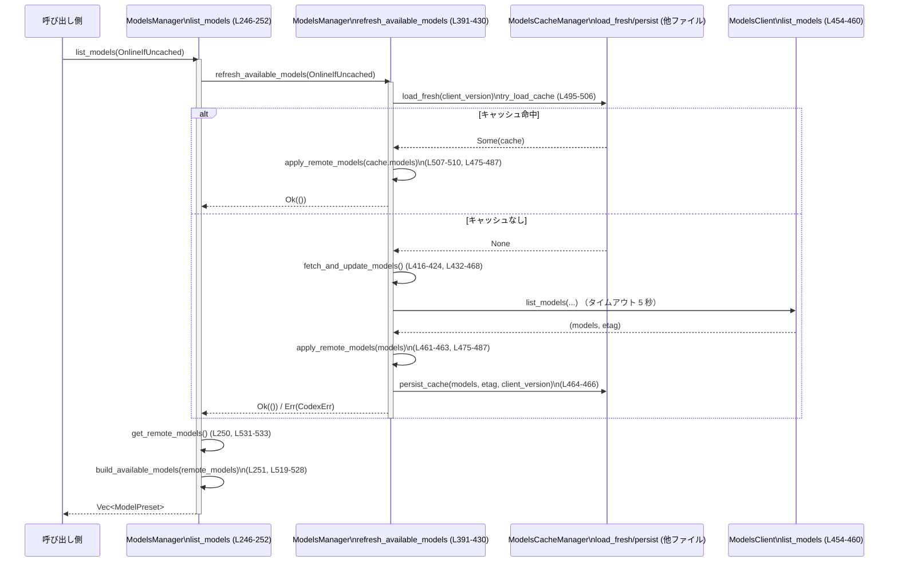

# models-manager/src/manager.rs コード解説

## 0. ざっくり一言

`ModelsManager` は、リモートの `/models` API から取得したモデル一覧と、バンドル済みのモデル定義・ディスクキャッシュを統合し、  
「利用可能なモデル一覧」「デフォルトモデル」「モデルメタデータ」を提供するマネージャです（`models-manager/src/manager.rs:L175-185, L238-252, L289-316`）。

---

## 1. このモジュールの役割

### 1.1 概要

このモジュールは次の問題を解決するために存在し、以下の機能を提供します。

- **問題**  
  - モデル一覧を毎回ネットワークから取得すると遅い・不安定である  
  - 認証モードやプロバイダによって利用可能なモデルが異なる  
  - バンドル済みのモデルカタログと、リモートの最新情報・キャッシュをどう統合するか  
- **機能**  
  - `/models` API からのモデル一覧取得（タイムアウト付き、テレメトリ付き）（`L432-468`）  
  - ディスクキャッシュ（ETag, TTL 付き）との統合と更新（`L432-468, L495-515`）  
  - 認証モードに応じたモデルフィルタリングとデフォルトモデル選択（`L518-528, L289-308`）  
  - モデル名からのメタデータ解決（プレフィックス・名前空間対応）（`L318-373`）  
  - コラボレーションモードプリセットの取得（`L254-266`）

### 1.2 アーキテクチャ内での位置づけ

主要な依存関係の関係を Mermaid の依存図で示します。



- `ModelsManager` は、認証 (`AuthManager`)、プロバイダ情報 (`ModelProviderInfo`)、ディスクキャッシュ (`ModelsCacheManager`)、  
  OpenAI 互換モデル表現 (`ModelInfo`, `ModelPreset`) に依存します（`L1-41, L175-185`）。
- `/models` API 呼び出しには `ModelsClient` と `ReqwestTransport` を使用します（`L6-9, L432-457`）。

### 1.3 設計上のポイント

- **キャッシュとリモートの統合**
  - 初期カタログはバンドルされた `models.json` からロードします（`load_remote_models_from_file` `L490-492`）。
  - リモート取得／キャッシュ適用は `apply_remote_models` で統合されます（`L475-487`）。
  - ETag と TTL を用いたディスクキャッシュを `ModelsCacheManager` で管理します（`L217-218, L495-515`）。

- **カタログモード**
  - `CatalogMode::Default`：バンドル済みカタログ + キャッシュ/ネットワーク更新（`L166-173`）。
  - `CatalogMode::Custom`：呼び出し側が渡したカタログを変更しない（`L219-223, L392-396`）。

- **リフレッシュ戦略**
  - `RefreshStrategy` により、オンライン／オフライン／キャッシュ優先を切り替えます（`L139-148, L391-430`）。

- **並行性**
  - モデル一覧 (`remote_models`) と ETag は `tokio::sync::RwLock` で保護されます（`L175-185, L531-537, L470-472`）。
  - `try_list_models` 等で `try_read` による非ブロッキング取得が可能です（`L271-274, L535-537`）。

- **エラー処理**
  - ネットワーク・API エラーは `CoreResult`（`Result<_, CodexErr>`）で伝播します（`L24-25, L391-468`）。
  - `list_models` / `get_default_model` はリフレッシュ失敗をログに記録し、利用可能な状態で続行します（`L246-252, L289-308`）。
  - `/models` 呼び出しには 5 秒のタイムアウトが設定されています（`MODELS_REFRESH_TIMEOUT` `L45, L432-460`）。

- **観測性（オブザーバビリティ）**
  - API リクエストごとに詳細なテレメトリイベントとフィードバックタグが出力されます（`ModelsRequestTelemetry::on_request` `L55-136`）。
  - キャッシュロードやリモート更新にはグローバルタイマーメトリクスが付与されています（`L432-435, L495-497`）。

---

## 2. 主要な機能一覧

このモジュールが提供する代表的な機能です。

- モデル一覧の取得: `list_models`, `try_list_models` で利用可能モデルのプリセットを返す（`L246-252, L271-274`）。
- デフォルトモデルの決定: `get_default_model` がデフォルトモデル ID を決定（`L289-308`）。
- モデルメタデータの取得: `get_model_info` がモデル名から `ModelInfo` を構築（`L313-316, L354-373`）。
- リモート・キャッシュからのモデルカタログ更新: `refresh_available_models`, `fetch_and_update_models`, `try_load_cache`（`L391-430, L432-468, L495-515`）。
- ETag による条件付き更新: `refresh_if_new_etag` で ETag 相違時のみ更新（`L375-389`）。
- コラボレーションモードプリセットの取得: `list_collaboration_modes` 系（`L254-266`）。
- テスト用ヘルパ: オフラインでのデフォルトモデル選択／メタデータ構築（`L539-552, L554-568, L570-581`）。

---

## 3. 公開 API と詳細解説

### 3.1 型一覧（構造体・列挙体など）

| 名前 | 種別 | 公開範囲 | 役割 / 用途 | 定義位置 |
|------|------|----------|-------------|----------|
| `ModelsRequestTelemetry` | 構造体 | モジュール内（非 `pub`） | `/models` API 呼び出しのテレメトリ情報（認証モード・ヘッダ有無・環境情報）を保持し、`RequestTelemetry` を実装します | `models-manager/src/manager.rs:L47-53, L55-136` |
| `RefreshStrategy` | 列挙体 | `pub` | モデル一覧更新時の戦略（オンライン/オフライン/キャッシュ優先）を指定します | `L139-148, L150-163` |
| `CatalogMode` | 列挙体 | モジュール内 | 初期カタログの取り扱い方（バンドル／カスタム）を区別します | `L166-173` |
| `ModelsManager` | 構造体 | `pub` | リモートモデル取得・キャッシュ適用・フィルタリングを行う中心的マネージャです | `L175-185` |

### 3.2 主要関数の詳細（最大 7 件）

#### 1. `ModelsManager::new(...) / ModelsManager::new_with_provider(...)`

**シグネチャ**

```rust
pub fn new(
    codex_home: PathBuf,
    auth_manager: Arc<AuthManager>,
    model_catalog: Option<ModelsResponse>,
    collaboration_modes_config: CollaborationModesConfig,
) -> Self                      // L193-206

pub fn new_with_provider(
    codex_home: PathBuf,
    auth_manager: Arc<AuthManager>,
    model_catalog: Option<ModelsResponse>,
    collaboration_modes_config: CollaborationModesConfig,
    provider: ModelProviderInfo,
) -> Self                      // L209-236
```

**概要**

- `ModelsManager::new` は OpenAI プロバイダを前提とした標準コンストラクタです（`L193-206`）。
- `new_with_provider` は任意の `ModelProviderInfo` を受け取る拡張コンストラクタです（`L209-215`）。
- バンドル済みカタログ or 呼び出し側提供カタログを初期値として `remote_models` を初期化し、ディスクキャッシュパスおよび `CatalogMode` を設定します（`L216-235`）。

**引数**

| 引数名 | 型 | 説明 |
|--------|----|------|
| `codex_home` | `PathBuf` | モデルキャッシュファイル `models_cache.json` を保存するディレクトリ（`MODEL_CACHE_FILE` `L43, L217`）。 |
| `auth_manager` | `Arc<AuthManager>` | 認証情報を管理するオブジェクト。プロバイダに応じて `required_auth_manager_for_provider` でラップされます（`L216`）。 |
| `model_catalog` | `Option<ModelsResponse>` | 呼び出し側が提供するモデルカタログ。指定時はこれを「権威的な」リストとし、`CatalogMode::Custom` になります（`L219-223`）。 |
| `collaboration_modes_config` | `CollaborationModesConfig` | コラボレーションモードプリセットを決定する設定（`L180-181, L254-266`）。 |
| `provider` | `ModelProviderInfo` | 使用するモデルプロバイダ情報。`new` では OpenAI プロバイダが生成されます（`L204-205`）。 |

**戻り値**

- 初期化された `ModelsManager` インスタンス。  
  - `remote_models` は `model_catalog` があればその `models`、なければ `load_remote_models_from_file()` の結果です（`L224-227`）。

**内部処理の流れ**

1. プロバイダに合った `AuthManager` に変換 (`required_auth_manager_for_provider`)（`L216`）。
2. キャッシュファイルパス `codex_home/models_cache.json` を決定し、`ModelsCacheManager` を初期化（`L217-218`）。
3. `model_catalog` の有無から `catalog_mode` を `Custom` / `Default` に決定（`L219-223`）。
4. 初期 `remote_models` を
   - `model_catalog.models` または
   - `load_remote_models_from_file().unwrap_or_default()`  
   から決定（`L224-227, L490-492`）。
5. 上記フィールドを持つ `ModelsManager` を構築（`L228-235`）。

**Errors / Panics**

- この関数自体は `Result` を返さず、内部で `unwrap_or_default()` を使用しています（`L226`）。
  - `crate::bundled_models_response()` が `Err` を返した場合、`unwrap_or_default()` によって空のモデルリストで初期化されます。
- パニックは発生しません（`unwrap_or_default` はパニックしない）。

**Edge cases（エッジケース）**

- `model_catalog` が `Some` の場合：
  - `CatalogMode::Custom` となり、以後 `refresh_available_models` ではリモート更新は行われません（`L219-223, L392-396`）。
- `bundled_models_response` からモデルが 0 件でも、そのまま空のリストとして保持されます（`L490-492`）。

**使用上の注意点**

- `codex_home` は書き込み可能なパスである必要があります。そうでない場合、キャッシュ書き込みでエラーが発生する可能性があります（`persist_cache` 呼び出し `L464-466`）。
- 他スレッドから共有する場合は `ModelsManager` 自体を `Arc` でラップするとよいです。内部は `RwLock` で保護されています（`L175-185`）。

---

#### 2. `ModelsManager::list_models(&self, refresh_strategy: RefreshStrategy) -> Vec<ModelPreset>`

**定義位置**: `models-manager/src/manager.rs:L238-252`

**概要**

- 指定された `RefreshStrategy` に従ってモデルカタログを更新し、その結果から利用可能なモデルプリセット一覧を返します（`L238-252`）。
- エラー時はログに記録した上で、利用可能な範囲で結果を返します。

**引数**

| 引数名 | 型 | 説明 |
|--------|----|------|
| `refresh_strategy` | `RefreshStrategy` | オンライン/オフライン/キャッシュ優先のいずれか（`L139-148`）。 |

**戻り値**

- `Vec<ModelPreset>`  
  - 優先度でソートされ、認証モードによるフィルタリング・デフォルトフラグ付与済みのプリセット一覧です（`build_available_models` `L519-528`）。

**内部処理の流れ**

1. `refresh_available_models(refresh_strategy)` を呼び出してカタログを更新し、`Err` の場合は `error!` ログのみ出力（`L246-249, L391-430`）。
2. `get_remote_models()` で現在の `remote_models` を読み出し（`L250, L531-533`）。
3. `build_available_models(remote_models)` でプリセットに変換して返却（`L251-252, L519-528`）。

**Errors / Panics**

- 外向きには `Vec<ModelPreset>` を常に返し、エラーはログにのみ記録されます（`L246-249`）。

**Edge cases**

- リモート取得・キャッシュ読み込みがすべて失敗した場合：
  - `remote_models` が空のままになり、結果も空ベクタになります。
- `CatalogMode::Custom` の場合：
  - `refresh_available_models` は即 `Ok(())` を返すため、`list_models` はユーザ提供カタログに基づいたプリセットを返します（`L392-396`）。

**使用上の注意点**

- ネットワークエラーなどがあっても `list_models` 自体は失敗しないため、「空であること＝常にエラー」とは限りません。そのため呼び出し側で「空リスト時の扱い」を決めておく必要があります。
- `refresh_strategy` によってキャッシュの使い方が変わるため、UI のリフレッシュボタンなどからは `Online` を使うなどのポリシー設計が必要です（`L410-428`）。

---

#### 3. `ModelsManager::get_default_model(&self, model: &Option<String>, refresh_strategy: RefreshStrategy) -> String`

**定義位置**: `models-manager/src/manager.rs:L289-308`

**概要**

- 明示的なモデル ID が渡された場合はそれをそのまま返し、未指定の場合は現在のカタログからデフォルトモデルを選択して ID を返します（`L289-308`）。

**引数**

| 引数名 | 型 | 説明 |
|--------|----|------|
| `model` | `&Option<String>` | 呼び出し側が明示的に指定したモデル ID。`Some` の場合はそれを優先します（`L294-296`）。 |
| `refresh_strategy` | `RefreshStrategy` | デフォルトモデル計算前にカタログを更新する戦略（`L297-299`）。 |

**戻り値**

- 選択されたモデル ID（`String`）。  
  - 候補がない場合は空文字列になります（`L302-307`）。

**内部処理の流れ**

1. `model` が `Some` なら `to_string()` して即返却（`L294-296`）。
2. `refresh_available_models(refresh_strategy)` でカタログを更新し、`Err` はログのみ（`L297-299`）。
3. `get_remote_models()` でモデル一覧を取得（`L300-301`）。
4. `build_available_models()` でプリセット一覧を構築（`L301`）。
5. `is_default` フラグの立っているプリセットを優先的に選択し、なければ先頭要素を選択（`L302-306`）。
6. 見つかったプリセットの `model` フィールドを返し、なければ `unwrap_or_default()` で空文字列を返す（`L306-307`）。

**Errors / Panics**

- 内部でのエラーは `list_models` 同様ログに記録されるのみです（`L297-299`）。
- `unwrap_or_default()` によりパニックは発生しません（`L307`）。

**Edge cases**

- 利用可能なプリセットが 0 件のとき：
  - 空文字列が返ります（`unwrap_or_default()` `L307`）。
- `is_default` が `true` のモデルが複数ある場合：
  - 最初に見つかったものが選択されます（`L302-305`）。
- `RefreshStrategy::Offline` を使った場合：
  - デフォルトモデルはキャッシュ／バンドルのみから選ばれます。

**使用上の注意点**

- 戻り値が空文字列の可能性があることを前提に、呼び出し側でバリデーションやフォールバックを検討する必要があります。
- ユーザが UI 等で明示的にモデルを指定している場合は、`model` 引数にその値を渡すことで、カタログ状態に依存せずそのモデルを使用できます。

---

#### 4. `ModelsManager::get_model_info(...)` / `construct_model_info_from_candidates(...)`

**シグネチャ**

```rust
pub async fn get_model_info(
    &self,
    model: &str,
    config: &ModelsManagerConfig,
) -> ModelInfo                            // L313-316

fn construct_model_info_from_candidates(
    model: &str,
    candidates: &[ModelInfo],
    config: &ModelsManagerConfig,
) -> ModelInfo                            // L354-373
```

**概要**

- `get_model_info` は、現在の `remote_models` からモデル名に対応する `ModelInfo` を構築します（`L313-316`）。
- `construct_model_info_from_candidates` は、  
  - 最長プレフィックスマッチ  
  - 名前空間付きスラッグ（`namespace/model`）のサフィックス再試行  
  を行い、それでも見つからない場合はローカルのフォールバック定義から `ModelInfo` を生成します（`L318-373`）。

**引数**

| 引数名 | 型 | 説明 |
|--------|----|------|
| `model` | `&str` | 解決したいモデル名（例: `"gpt-4.5-codex"` や `"custom/gpt-4.5-codex"`）（`L355-356`）。 |
| `config` | `&ModelsManagerConfig` | モデルに対するコンフィグオーバーライド等を含む設定（`L357-358, L372-373`）。 |
| `candidates` | `&[ModelInfo]` | 探索対象となるモデル候補（`L356-357`）。`get_model_info` の場合は `remote_models` 全体です（`L314-315`）。 |

**戻り値**

- `ModelInfo`  
  - 見つかった candidate を元に、`slug` をリクエストされた `model` 名に置き換えつつ返します（`L363-368`）。
  - 見つからなければ `model_info::model_info_from_slug(model)` によるフォールバック（`L370-371`）。
  - 最後に `model_info::with_config_overrides` により `config` からのオーバーライドが適用されます（`L372-373`）。

**内部処理の流れ（construct_model_info_from_candidates）**

1. `find_model_by_longest_prefix` で最長プレフィックスマッチを試みる（`L359-362, L318-334`）。
2. 見つからなければ、`find_model_by_namespaced_suffix` で  
   - `namespace/model-name` の形を分解し  
   - namespace が `\w+`（英数字または `_`）の場合に限り、suffix を再度プレフィックスマッチにかける（`L336-352`）。
3. いずれかで `remote` が見つかった場合：
   - `ModelInfo { slug: model.to_string(), used_fallback_model_metadata: false, ..remote }` として、要求された `model` を slug にセット（`L363-368`）。
4. 見つからなければ `model_info::model_info_from_slug` によるフォールバック（`L370-371`）。
5. 最後に `model_info::with_config_overrides(model_info, config)` でコンフィグ反映（`L372-373`）。

**Errors / Panics**

- いずれの関数も `Result` を返さず、パニックを起こす記述はありません。
- 名前空間付きスラッグの分解は `split_once('/')?` により、`/` がない場合は `None` で安全に終了します（`L341-342`）。

**Edge cases**

- モデル名がどの `ModelInfo.slug` にもマッチしない場合：
  - フォールバック定義 (`model_info_from_slug`) が使用されます（`L369-371`）。
- 名前空間を含むモデル名（例: `"custom/gpt-4.5-codex"`）：
  - namespace 部分が英数字と `_` のみで構成され、suffix に追加の `/` が含まれないときのみ、suffix に対して再マッチが行われます（`L341-349`）。
- `candidates` が空配列でも、フォールバック経由で必ず `ModelInfo` が返されます（`L369-372`）。

**使用上の注意点**

- `get_model_info` は `remote_models` の更新を行わないため、必要に応じて事前に `list_models` や `refresh_available_models` を実行して最新状態にしておく設計が考えられます。
- 名前空間付きスラッグの再解決が行われるため、UI や設定で `"namespace/model"` のような形を許容しても、内部ではベースモデルに正しく解決されます。

---

#### 5. `ModelsManager::refresh_if_new_etag(&self, etag: String)`

**定義位置**: `models-manager/src/manager.rs:L375-389`

**概要**

- 新しい ETag が現在の ETag と異なる場合に、`RefreshStrategy::Online` でモデルカタログを更新します。
- 同じ ETag の場合はキャッシュ TTL の更新のみ行います（`L375-383`）。

**引数**

| 引数名 | 型 | 説明 |
|--------|----|------|
| `etag` | `String` | サーバから通知された最新の ETag 値（`L378-379`）。 |

**戻り値**

- なし（`()`）。エラーはログに記録されるのみです（`L381-383, L386-388`）。

**内部処理の流れ**

1. `get_etag()` で現在の ETag を読み出し（`L379-380, L470-472`）。
2. 現在 ETag が `Some` かつ `Some(etag.as_str())` と等しい場合：
   - `cache_manager.renew_cache_ttl().await` を呼び、失敗時はログ（`L381-383`）。
   - そのままリターン（`L384-385`）。
3. ETag が異なる/未設定の場合：
   - `refresh_available_models(RefreshStrategy::Online)` でオンライン更新を試行し、失敗時はログ（`L386-388`）。

**Edge cases**

- 現在 ETag が `None` の場合は、必ずオンライン更新が試行されます（`L379-381, L386`）。
- `renew_cache_ttl` が失敗してもプロセスは継続し、モデル一覧にも影響しません（`L381-383`）。

**使用上の注意点**

- この関数は、サーバ側イベント（ETag 変更通知）に応じて呼び出されることを想定しているコメントがあります（`// todo(aibrahim)...` `L276-277`）。
- 実際のリフレッシュ可否は `CatalogMode` や認証モードにも依存するため、`refresh_available_models` 内の条件を考慮する必要があります（`L392-408, L410-429`）。

---

#### 6. `ModelsManager::refresh_available_models(&self, refresh_strategy: RefreshStrategy) -> CoreResult<()>`

**定義位置**: `models-manager/src/manager.rs:L391-430`

**概要**

- カタログモード・認証モード・プロバイダ種別・リフレッシュ戦略に応じて、キャッシュロードやリモートフェッチを組み合わせてモデル一覧を更新します。

**引数**

| 引数名 | 型 | 説明 |
|--------|----|------|
| `refresh_strategy` | `RefreshStrategy` | オフライン/オンライン/キャッシュ優先を指定（`L410-428`）。 |

**戻り値**

- `CoreResult<()>`（`Result<(), CodexErr>`）。  
  - `/models` API からのフェッチ失敗やタイムアウト、プロバイダ変換失敗などで `Err` になります（`L432-460`）。

**内部処理の流れ**

1. `CatalogMode::Custom` の場合は、ユーザ提供カタログを変えないため何もせず `Ok(())` を返す（`L392-396`）。
2. 認証モードが `Some(AuthMode::Chatgpt)` でなく、かつプロバイダが「コマンド認証」を持たない場合：
   - `RefreshStrategy::Offline` / `OnlineIfUncached` のときのみ `try_load_cache().await` を試行（`L398-405`）。
   - いずれの場合も `Ok(())` を返し、リモートフェッチは行わない（`L406-407`）。
3. 上記を満たさない場合、`refresh_strategy` に応じて以下を実行（`L410-429`）:
   - `Offline`：キャッシュロードのみ（`try_load_cache`）、結果にかかわらず `Ok(())`（`L411-415`）。
   - `OnlineIfUncached`：キャッシュが利用可能ならそれを適用して `Ok(())`、そうでなければ `fetch_and_update_models()` を呼ぶ（`L416-424`）。
   - `Online`：常に `fetch_and_update_models()` を呼ぶ（`L425-428`）。

**Errors / Panics**

- `fetch_and_update_models()` からの `Err(CodexErr::Timeout|その他)` をそのまま返します（`L432-460, L423-424, L427-428`）。
- `try_load_cache` は `bool` を返すのみで、エラーは内部ログにとどめられます（`L495-515`）。

**Edge cases**

- `CatalogMode::Custom` の場合は、いかなる `RefreshStrategy` でもリモートフェッチやキャッシュ読み込みは実行されません（`L392-396`）。
- 認証モードが ChatGPT でなく、プロバイダが `has_command_auth()` を返さない場合：
  - オンラインフェッチは抑制され、`Online` を指定しても何もしない点に注意が必要です（`L398-407`）。

**使用上の注意点**

- オンラインフェッチ可否は `refresh_strategy` だけでなく `auth_manager.auth_mode()` と `provider.has_command_auth()` によっても制御されるため、  
  新しいプロバイダを追加する場合は `has_command_auth()` の実装とセットで確認する必要があります。
- UI などから「必ずリモートの最新を見たい」という要求がある場合は、認証モード・プロバイダ設定も含めた全体設計が必要です。

---

#### 7. `ModelsManager::fetch_and_update_models(&self) -> CoreResult<()>`

**定義位置**: `models-manager/src/manager.rs:L432-468`

**概要**

- 認証情報とプロバイダ情報から `/models` クライアントを構築し、5 秒のタイムアウト付きでモデル一覧を取得・適用・キャッシュ保存します。

**戻り値**

- `CoreResult<()>`  
  - タイムアウト時は `Err(CodexErr::Timeout)`（`L455-460`）。
  - API エラー時は `map_api_error` によって `CodexErr` に変換され `Err` が返されます（`L459-460`）。

**内部処理の流れ**

1. グローバルタイマー `codex.remote_models.fetch_update.duration_ms` を開始（`L432-435`）。
2. `auth_manager.auth().await` で認証情報を取得し、`CodexAuth::auth_mode` から認証モードを得る（`L435-436`）。
3. `provider.to_api_provider(auth_mode)` で API プロバイダ設定を構築（`L437`）。
4. `auth_provider_from_auth` で API 用認証ヘルパを作成（`L438`）。
5. `collect_auth_env_telemetry` で環境変数等からテレメトリ情報を収集（`L439-442`）。
6. `ReqwestTransport::new(build_reqwest_client())` で HTTP クライアントを構築（`L443`）。
7. `ModelsRequestTelemetry` を `Arc<dyn RequestTelemetry>` として生成し、`ModelsClient` に渡す（`L444-451`）。
8. `client_version_to_whole()` でクライアントバージョンを取得（`L453`）。
9. `timeout(MODELS_REFRESH_TIMEOUT, client.list_models(...))` で `/models` を呼び出し（`L454-460`）。
10. 正常終了時 `(models, etag)` を受け取り、`apply_remote_models(models.clone())` でカタログに適用（`L461-463, L475-487`）。
11. `etag` を書き込み、`cache_manager.persist_cache(&models, etag, client_version)` でキャッシュ保存（`L463-466`）。

**Errors / Panics**

- タイムアウト・API エラーは `Err(CodexErr)` で返ります（`L455-460`）。
- 認証やプロバイダ変換失敗も `to_api_provider` / `auth_provider_from_auth` からの `Err` として返る可能性があります（`L437-438`）。
- パニックを起こすコードはありません。

**Edge cases**

- `/models` 応答が非常に大きい場合：
  - `models.clone()` やキャッシュへのシリアライズによるメモリ・I/O コストが増加します（`L461-466`）。
- ETag が `None` の場合でも、そのまま `self.etag` に `None` が書き込まれます（`L461-464`）。

**使用上の注意点**

- 非同期関数であり、呼び出しには Tokio ランタイムが必要です（`tokio::time::timeout` を使用 `L38, L454`）。
- 直接呼び出すのではなく、通常は `refresh_available_models` 経由で呼ばれます。前段の認可ロジックをスキップしないようにするためです。

---

### 3.3 その他の関数（インベントリ）

主要関数以外も含めた関数一覧です。詳細解説済みのものには注記を付けています。

| 関数名 | 所属 | 概要 | 定義位置 |
|--------|------|------|----------|
| `ModelsRequestTelemetry::on_request` | impl `RequestTelemetry` | `/models` リクエストごとにテレメトリイベントとフィードバックタグを出力します | `L55-136` |
| `RefreshStrategy::as_str` | impl `RefreshStrategy` | 列挙値を `"online"` 等の文字列に変換します | `L150-157` |
| `fmt::Display for RefreshStrategy::fmt` | impl `fmt::Display` | `Display` で `as_str()` を出力します | `L160-163` |
| `ModelsManager::new` | impl `ModelsManager` | 標準コンストラクタ（詳細は 3.2-1） | `L193-206` |
| `ModelsManager::new_with_provider` | impl `ModelsManager` | プロバイダ指定コンストラクタ（詳細は 3.2-1） | `L209-236` |
| `ModelsManager::list_models` | impl `ModelsManager` | モデル一覧取得（詳細は 3.2-2） | `L238-252` |
| `ModelsManager::list_collaboration_modes` | impl `ModelsManager` | 保持している `collaboration_modes_config` に基づき、コラボモードプリセット一覧を返す | `L254-259` |
| `ModelsManager::list_collaboration_modes_for_config` | impl `ModelsManager` | 任意の `CollaborationModesConfig` を受け取り、静的プリセットを生成 | `L261-266` |
| `ModelsManager::try_list_models` | impl `ModelsManager` | `RwLock` をブロックせずに取得し、モデル一覧を返す。ロック取得失敗時は `TryLockError` を返す | `L271-274, L535-537` |
| `ModelsManager::get_default_model` | impl `ModelsManager` | デフォルトモデル ID を返す（詳細は 3.2-3） | `L289-308` |
| `ModelsManager::get_model_info` | impl `ModelsManager` | 現在の `remote_models` から `ModelInfo` を構築（詳細は 3.2-4） | `L313-316` |
| `ModelsManager::find_model_by_longest_prefix` | impl `ModelsManager` | モデル名に対する最長プレフィックスマッチを `candidates` から探す | `L318-334` |
| `ModelsManager::find_model_by_namespaced_suffix` | impl `ModelsManager` | `namespace/model` 形式の suffix を用いて再マッチを行う | `L340-352` |
| `ModelsManager::construct_model_info_from_candidates` | impl `ModelsManager` | プレフィックス・名前空間・フォールバックを統合し `ModelInfo` を構築（詳細は 3.2-4） | `L354-373` |
| `ModelsManager::refresh_if_new_etag` | impl `ModelsManager` | 新しい ETag に応じてオンライン更新 or TTL 更新（詳細は 3.2-5） | `L375-389` |
| `ModelsManager::refresh_available_models` | impl `ModelsManager` | 戦略に応じてキャッシュやリモートを組み合わせる（詳細は 3.2-6） | `L391-430` |
| `ModelsManager::fetch_and_update_models` | impl `ModelsManager` | `/models` 呼び出し + カタログ更新 + キャッシュ保存（詳細は 3.2-7） | `L432-468` |
| `ModelsManager::get_etag` | impl `ModelsManager` | 現在の ETag を `RwLock` から読み出す | `L470-472` |
| `ModelsManager::apply_remote_models` | impl `ModelsManager` | バンドル済みモデルに対して、同一 slug を上書き・新規 slug を追加した上で `remote_models` に反映する | `L475-487` |
| `ModelsManager::load_remote_models_from_file` | impl `ModelsManager` | バンドルされた `models.json` 相当のレスポンスからモデル一覧を取得 | `L490-492` |
| `ModelsManager::try_load_cache` | impl `ModelsManager` | クライアントバージョンに合致する新鮮なキャッシュを読み込み、適用する | `L495-515` |
| `ModelsManager::build_available_models` | impl `ModelsManager` | `remote_models` から `ModelPreset` を生成し、優先度ソート・認証フィルタ・デフォルト選定を行う | `L519-528` |
| `ModelsManager::get_remote_models` | impl `ModelsManager` | `remote_models` のコピーを非同期に取得 | `L531-533` |
| `ModelsManager::try_get_remote_models` | impl `ModelsManager` | `remote_models` を非ブロッキングで取得 (`try_read`) | `L535-537` |
| `ModelsManager::with_provider_for_tests` | impl `ModelsManager` | テスト用：プロバイダを指定して `ModelsManager` を構築 | `L539-552` |
| `ModelsManager::get_model_offline_for_tests` | impl `ModelsManager` | オフラインでバンドル済みモデルからデフォルトモデル ID を取得 | `L555-568` |
| `ModelsManager::construct_model_info_offline_for_tests` | impl `ModelsManager` | テスト用：指定された `ModelsManagerConfig` のカタログだけから `ModelInfo` を構築 | `L571-581` |

---

### 3.4 セキュリティ・バグ上の注意点（このファイルから読み取れる範囲）

- **認証情報の扱い**
  - テレメトリでは API キー値そのものはログに出さず、  
    「ヘッダが添付されたか」「ヘッダ名」「環境変数名」などのメタ情報のみを出力しています（`L69-116, L117-135`）。
- **ネットワークアクセス制御**
  - 認証モードが ChatGPT でない場合や、プロバイダにコマンド認証がない場合は、オンラインフェッチが抑制されます（`L398-407`）。  
    意図せず外部 API を叩かない設計になっています。
- **ETag ベースの更新**
  - `refresh_if_new_etag` では、ETag 一致時に TTL 更新のみを行い不必要なリモートアクセスを避けています（`L375-383`）。
- **モデル統合ロジック**
  - `apply_remote_models` は毎回 `load_remote_models_from_file()` を基底として、同じ `slug` のモデルを更新・新規 `slug` を追加します（`L475-487`）。
    - これにより、バンドルされていないが以前のフェッチでのみ存在したモデルは、最新フェッチ結果に含まれない場合は消える挙動になります。  
      これが仕様かどうかは、このファイル単体からは判断できません。
- **ログに機密情報が含まれる可能性**
  - ログに含まれるのはリクエスト ID, エラーコード, Cloudflare Ray ID などであり、API キー等は含まれていません（`L69-91, L93-115, L117-135`）。  
    そのため機密情報露出のリスクは限定的です。

---

## 4. データフロー

### 4.1 モデル一覧取得のフロー（オンライン／キャッシュ）

`list_models(RefreshStrategy::OnlineIfUncached)` を呼び出した場合の典型的なフローです。



- キャッシュ命中時はディスクキャッシュのみを使い、ネットワークアクセスは行いません（`L416-421, L495-515`）。
- キャッシュミス時は `/models` を呼び出し、結果を `apply_remote_models` と `persist_cache` に適用します（`L422-424, L461-466`）。
- どちらの場合も、最後に `remote_models` から `ModelPreset` を構築して返します（`L250-252, L519-528`）。

---

## 5. 使い方（How to Use）

> このクレート全体のモジュール構成はこのファイルからは分からないため、`use` パスは擬似的な例です。

### 5.1 基本的な使用方法

#### 非同期コンテキストでの標準的な利用例

```rust
use std::path::PathBuf;                                         // パス型
use std::sync::Arc;                                             // 共有ポインタ
// use crate::manager::ModelsManager;                           // 実際のパスはプロジェクト構成に依存
// use crate::config::ModelsManagerConfig;
// use crate::collaboration_mode_presets::CollaborationModesConfig;
// use codex_login::AuthManager;

#[tokio::main]                                                  // Tokio ランタイムを起動
async fn main() -> Result<(), Box<dyn std::error::Error>> {
    let codex_home = PathBuf::from("/path/to/codex_home");      // キャッシュ保存先ディレクトリ
    let auth_manager: Arc<AuthManager> = /* AuthManager の構築 */; 
    let collab_cfg = CollaborationModesConfig::default();       // コラボモード設定

    // ModelsManager を初期化（バンドル済みカタログを使用）
    let mgr = ModelsManager::new(
        codex_home,
        auth_manager.clone(),
        None,                                                   // model_catalog は外部から渡さない
        collab_cfg,
    );

    // キャッシュ優先でモデル一覧取得
    let presets = mgr
        .list_models(RefreshStrategy::OnlineIfUncached)
        .await;

    for preset in &presets {
        println!("model: {}, default: {}", preset.model, preset.is_default);
    }

    // デフォルトモデル ID を取得（明示指定なし）
    let default_model = mgr
        .get_default_model(&None, RefreshStrategy::OnlineIfUncached)
        .await;
    println!("default model: {}", default_model);

    // モデルメタデータを取得
    let config = ModelsManagerConfig::default();                // 実際のフィールドは別ファイル
    let info = mgr.get_model_info(&default_model, &config).await;
    println!("resolved slug: {}", info.slug);                   // 実際のフィールド例

    Ok(())
}
```

### 5.2 よくある使用パターン

1. **オフラインのみで利用する場合**

```rust
// キャッシュまたはバンドル済みカタログのみを使う
let presets = mgr
    .list_models(RefreshStrategy::Offline)  // L410-415
    .await;
// ネットワークアクセスは行われない（認証モード・プロバイダ条件に依存）
```

1. **ロック待ちを避けたい場合**

```rust
// 非同期タスクが多数走っている状況で、ロック待ちを避けつつ
// 現在のモデル一覧だけをすばやく参照したいケース
match mgr.try_list_models() {                // L271-274
    Ok(presets) => {
        // 利用可能な範囲のプリセットを使う
    }
    Err(_e) => {
        // ロック取得失敗時のフォールバック処理
    }
}
```

1. **テストで外部依存を避ける場合**

```rust
// プロバイダをモックし、ネットワーク・キャッシュを使わずにテスト
let mgr = ModelsManager::with_provider_for_tests(
    PathBuf::from("/tmp/codex_home_test"),
    auth_manager,
    mocked_provider,                         // ModelProviderInfo のテスト用値
);

// オフラインのモデル ID 決定
let default_model = ModelsManager::get_model_offline_for_tests(None); // L555-568
```

### 5.3 よくある間違いと正しい使い方

```rust
// 間違い例: Online 戦略なら必ずリモートフェッチされると思い込んでいる
let presets = mgr
    .list_models(RefreshStrategy::Online)
    .await;
// 認証モードが ChatGPT でない & プロバイダが command auth を持たない場合、
// 実際には何もフェッチされず、既存の remote_models が使われる（L398-407）


// 正しい理解: 認証モード・プロバイダ条件も考慮する必要がある
if mgr.auth_manager().auth_mode() == Some(AuthMode::Chatgpt) /* 仮コード */ {
    let presets = mgr
        .list_models(RefreshStrategy::Online)
        .await;
    // リモートフェッチされる可能性が高い
}
```

```rust
// 間違い例: get_default_model は常に非空文字列を返すと仮定する
let model_id = mgr
    .get_default_model(&None, RefreshStrategy::Offline)
    .await;
// ここで model_id が空文字列の場合を考慮していない

// 正しい例: 空文字列の可能性を考慮してフォールバックする
let model_id = mgr
    .get_default_model(&None, RefreshStrategy::Offline)
    .await;
let model_id = if model_id.is_empty() {
    "gpt-4.5-codex".to_string()  // 例: アプリ側のフォールバック
} else {
    model_id
};
```

### 5.4 使用上の注意点（まとめ）

- `ModelsManager` は内部に `RwLock` を持つため、通常は 1 インスタンスを `Arc` で共有する形が適しています（`L175-185, L531-537`）。
- `list_models` / `get_default_model` はエラーを返さずログに記録する設計のため、呼び出し側で空リスト・空文字列を扱うロジックを持つ必要があります（`L246-252, L289-308`）。
- オンラインフェッチの可否は `RefreshStrategy` だけでなく `auth_mode` や `provider.has_command_auth()` にも依存します（`L398-407`）。
- `get_model_info` はカタログの更新を行わないため、「必ず最新のメタデータが欲しい」場合は事前に `list_models` などでリフレッシュする運用設計が必要です。
- テスト用ヘルパは本番コードでは利用しないように分離しておくことが望ましいです（`with_provider_for_tests`, `get_model_offline_for_tests`, `construct_model_info_offline_for_tests` `L539-581`）。

---

## 6. 変更の仕方（How to Modify）

### 6.1 新しい機能を追加する場合

**例: 新しいリフレッシュ戦略を追加したい場合**

1. `RefreshStrategy` に新しいバリアントを追加し、`as_str` にも対応を追加します（`L139-148, L150-157`）。
2. `fmt::Display` 実装は `as_str` を使っているため特別な変更は不要です（`L160-163`）。
3. `refresh_available_models` の `match refresh_strategy` に新しいバリアントへの分岐を追加します（`L410-429`）。
4. 必要であれば `list_models` / `get_default_model` の `instrument` 属性にフィールドを追加して、テレメトリに新戦略を反映します（`L241-245, L281-288`）。
5. `manager_tests.rs` 内のテストケースに新戦略をカバーするテストを追加する必要があります（内容はこのチャンクからは不明ですが、`L584-586` でテストモジュールが存在します）。

### 6.2 既存の機能を変更する場合

- **影響範囲の確認**
  - `remote_models` に関わる処理は `apply_remote_models`, `try_load_cache`, `fetch_and_update_models`, `build_available_models`, `get_remote_models` が密接に連携しています（`L475-487, L495-515, L432-468, L519-528, L531-533`）。
  - これらの関数すべてを検索し、変更の影響を確認することが重要です。

- **契約（前提条件・返り値の意味）**
  - `list_models` / `get_default_model` は「失敗しないが結果が空の場合がある」という契約になっています（`L246-252, L289-308`）。
  - `refresh_available_models` / `fetch_and_update_models` は `CoreResult<()>` を返し、上位でログのみ行うことがあります（`L246-249, L297-299`）。  
    エラー伝播のポリシーを変更する場合は、これらの呼び出し元すべてを確認する必要があります。

- **テストと使用箇所**
  - `manager_tests.rs` で対象機能をカバーするテストがある可能性が高く、変更時にはそれらを更新する必要があります（`L584-586`）。
  - また、`with_provider_for_tests` / オフライン系テストヘルパを利用するテストも影響を受ける可能性があります（`L539-581`）。

---

## 7. 関連ファイル

このモジュールと密接に関連するファイル・クレートです（パスはこのファイルから推測できる範囲）。

| パス / クレート | 役割 / 関係 |
|-----------------|------------|
| `super::cache::ModelsCacheManager`（おそらく `models-manager/src/cache.rs`） | モデル一覧と ETag をディスクにキャッシュし、TTL 管理・ロード・保存を行います（`L1, L217-218, L495-515`）。 |
| `crate::config::ModelsManagerConfig` | モデルメタデータへのコンフィグオーバーライドやカタログ設定を保持します。`get_model_info` やオフラインテストヘルパで利用されます（`L4, L313-316, L354-373, L571-581`）。 |
| `crate::collaboration_mode_presets` | `CollaborationModesConfig` と `builtin_collaboration_mode_presets` を提供し、コラボレーションモードプリセットを生成します（`L2-3, L254-266`）。 |
| `crate::model_info` | `model_info_from_slug` と `with_config_overrides` を提供し、フォールバック `ModelInfo` と設定上書きを行います（`L5, L370-373`）。 |
| `codex_api` クレート | `ModelsClient`, `ReqwestTransport`, `RequestTelemetry`, `TransportError`, `map_api_error` を提供し、`/models` API 呼び出しとテレメトリインタフェースを担います（`L6-10, L55-61, L432-460`）。 |
| `codex_login` クレート | 認証管理 (`AuthManager`, `CodexAuth`)、プロバイダ別認証 (`auth_provider_from_auth`)、環境テレメトリ収集 (`collect_auth_env_telemetry`)、HTTP クライアント構築 (`build_reqwest_client`)、プロバイダと認証マネージャの整合性チェック (`required_auth_manager_for_provider`) を提供します（`L14-20, L435-443`）。 |
| `codex_protocol::openai_models` | `ModelInfo`, `ModelPreset`, `ModelsResponse` を定義し、モデルカタログの表現を提供します（`L26-28, L175-185, L224-227, L518-528`）。 |
| `codex_otel` クレート | `TelemetryAuthMode` と `start_global_timer` によりメトリクスと認証モードテレメトリを提供します（`L22, L432-435, L495-497`）。 |
| `codex_feedback` クレート | `emit_feedback_request_tags_with_auth_env` と `FeedbackRequestTags` により、API リクエストに紐づくフィードバック用タグを送信します（`L12-13, L117-135`）。 |
| `codex_response_debug_context` クレート | API エラーからレスポンスデバッグ情報（request_id, cf_ray, auth_error など）を抽出します（`L29-30, L65-67, L87-90, L111-114`）。 |
| `manager_tests.rs` | このモジュールのテストを含むファイルとして指定されていますが、内容はこのチャンクからは不明です（`L584-586`）。 |

以上が `models-manager/src/manager.rs` の構造と挙動の整理です。この情報により、モデル一覧・デフォルトモデル選択・メタデータ取得の実装や利用時の注意点を把握できるようになっています。
