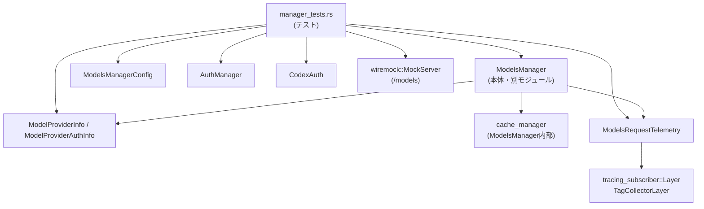
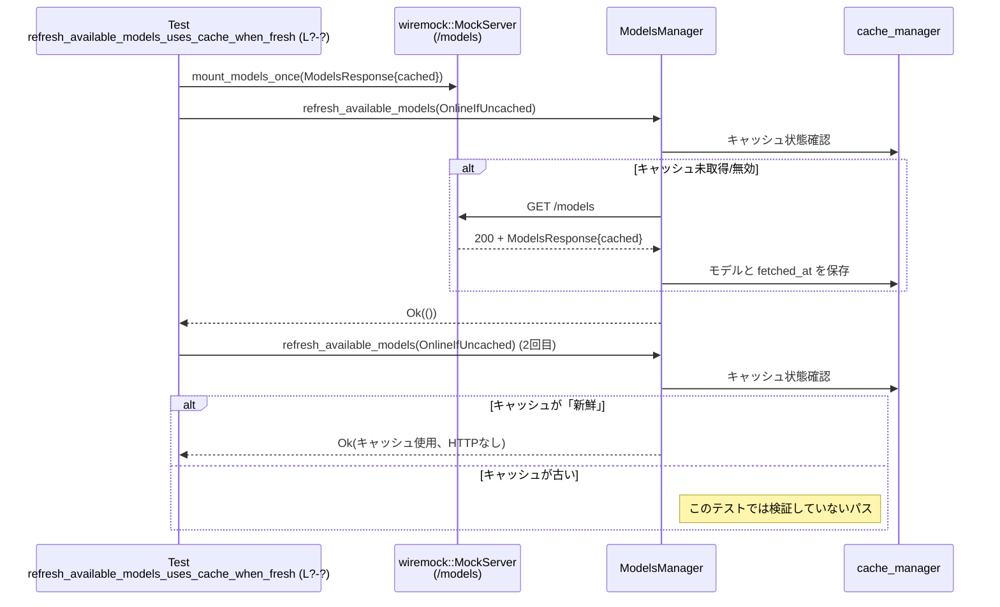

# models-manager/src/manager_tests.rs コード解説

> 注意: この回答では元ソースの厳密な行番号にアクセスできないため、根拠位置は `manager_tests.rs:L?-?` のように `?` を使って示します。

---

## 0. ざっくり一言

`manager_tests.rs` は、`ModelsManager` 周辺の以下の振る舞いを検証するテストモジュールです。

- モデル情報の解決（既知/未知モデル、名前空間付きモデル、カスタムカタログ）
- リモートモデル一覧の取得・キャッシュ・TTL・バージョン整合
- プロバイダ認証トークン実行 (`ModelProviderAuthInfo`) の動作
- モデル可視性（visible/hidden）とデフォルトモデル選択ロジック
- `/models` リクエスト失敗時のテレメトリ（`ModelsRequestTelemetry`）タグ出力
- `bundled models.json` のシリアライズ/デシリアライズ整合性

---

## 1. このモジュールの役割

### 1.1 概要

このモジュールは、`ModelsManager` と関連コンポーネントの **期待される外部インターフェース** をテストを通じて定義しています（`manager_tests.rs:L?-?`）。主に次を確認します。

- `get_model_info` が未知モデルに対してフォールバックメタデータを使うこと
- `refresh_available_models` が HTTP `/models` とキャッシュを正しく扱うこと
- 認証トークン取得用の外部コマンド (`ModelProviderAuthInfo`) を正しく使用すること
- テレメトリ (`ModelsRequestTelemetry`) が失敗時に適切なタグを `tracing` に出力すること

### 1.2 アーキテクチャ内での位置づけ

このファイルはテストコードであり、本体ロジック (`ModelsManager` など) は別ファイルにあります。依存関係は次のように整理できます。



- テストは `ModelsManager` を経由して `/models` エンドポイントを叩く（wiremock でモック）形で動作確認をしています（例: `refresh_available_models_*` 系テスト）。
- キャッシュや TTL、バージョン整合などは `ModelsManager` 内部の `cache_manager` フィールドに委譲されていますが、その動作はテストから間接的に検証されています（`refresh_available_models_uses_cache_when_fresh` など）。

### 1.3 設計上のポイント

コードから読み取れる設計上の特徴を列挙します。

- **テスト補助ビルダ関数**  
  - `remote_model` / `remote_model_with_visibility` が `ModelInfo` の JSON からの構築を一括で行い、テストケースごとに必要なフィールドだけ上書きしています（`manager_tests.rs:L?-?`）。
- **プロバイダ認証スクリプトのモック**  
  - `ProviderAuthScript` が一時ディレクトリにトークンファイルとシェルスクリプト（または CMD スクリプト）を生成し、`ModelProviderAuthInfo` として組み立てることで「外部コマンドからアクセストークンを取得する」パスをテストしています。
- **トレースベースのテレメトリ検証**  
  - `TagCollectorLayer`（`tracing_subscriber::Layer` 実装）が `feedback_tags` という target のイベントからタグを収集し、`ModelsRequestTelemetry` が送出したイベントの内容を検証しています。
- **非同期 I/O と並行性**  
  - 多くのテストは `#[tokio::test]` で非同期に実行され、`wiremock::MockServer` を用いた HTTP モックに対してリクエストを送ります。
  - テレメトリのタグマップは `Arc<Mutex<BTreeMap<..>>>` で共有され、テストと `tracing` ランタイム間で安全に共有されています（`manager_tests.rs:L?-?`）。
- **エラーハンドリング方針**  
  - テスト内では `expect` や `unwrap` を多用し、「成功するべき」経路が壊れていないことを panicking によって検証しています。
  - I/O や外部プロセス起動（`ProviderAuthScript::new`）では `Result` を返し、呼び出し側で `.unwrap()` してテスト失敗としています。

---

## 2. 主要な機能一覧

このテストモジュールが検証している主要な機能を機能単位で整理します。

- モデル情報解決 (`get_model_info`)
  - 既知モデル: フォールバックメタデータを使わず、バンドル済み/リモート情報を利用（`get_model_info_tracks_fallback_usage`）。
  - 未知モデル: スラグはそのままに、フォールバックメタデータを使用した `ModelInfo` が返る。
  - カスタムカタログ: 起動時に渡した `ModelsResponse` で上書きしたメタデータが使われる（`get_model_info_uses_custom_catalog`）。
  - 名前空間付きスラグ: `custom/gpt-image` のような一段階の名前空間は後ろのスラグでマッチするが、`ns1/ns2/model` のような多段は拒否される。
- モデル一覧の取得とキャッシュ (`refresh_available_models`, `list_models`, `try_list_models`)
  - 優先度 (`priority`) に基づいたソート順の検証（高優先度が先）。
  - プロバイダ認証トークン（外部コマンド実行）の付与確認。
  - キャッシュが「新鮮」なときは HTTP リクエストを避ける。
  - TTL や `client_version` の不一致時には再フェッチされる。
  - リモートから削除されたモデルは再フェッチ時にリストから取り除かれる。
  - ChatGPT 認証がない場合、リモート `/models` にはアクセスしない。
- モデル可視性とデフォルトモデル選択 (`build_available_models`)
  - `visibility: "hide"` なモデルも `ModelPreset` には残しつつ、デフォルト選択は `visibility: "list"` 側に移ることを検証。
- テレメトリ (`ModelsRequestTelemetry`)
  - `/models` リクエストの 401 エラー時に、認証関連のタグ（環境変数の有無、プロバイダキー名/存在、エラーヘッダ内容など）が `tracing` のイベントとして出力される。
- `bundled_models.json` の整合性
  - `crate::bundled_models_response()` の戻り値が `serde_json` でシリアライズ→デシリアライズしても不変であり、少なくとも 1 件のモデルを含むこと。

---

## 3. 公開 API と詳細解説

このファイル自体はテストモジュールのため公開 API は持ちませんが、**テストを通じて利用している外部 API** が実質的な契約となっています。ここでは:

- このファイル内で定義される補助型・関数
- テストから利用されている重要な外部 API（`ModelsManager` 等）の振る舞い

を整理します。

### 3.1 型一覧（構造体など）

このファイルで定義される主な型です。

| 名前 | 種別 | 役割 / 用途 | 根拠 |
|------|------|-------------|------|
| `ProviderAuthScript` | 構造体 | 一時ディレクトリ内にトークンファイルと認証スクリプトを作成し、`ModelProviderAuthInfo` を構築するテスト補助型 | `manager_tests.rs:L?-?` |
| `TagCollectorVisitor` | 構造体 | `tracing::field::Visit` を実装し、イベントからタグ（フィールド名→文字列値）を収集する | `manager_tests.rs:L?-?` |
| `TagCollectorLayer` | 構造体 | `tracing_subscriber::Layer` を実装し、`feedback_tags` target のイベントをフックしてタグを共有 `BTreeMap` に蓄積する | `manager_tests.rs:L?-?` |
| `model_info_overrides_tests` | モジュール | `#[path = "model_info_overrides_tests.rs"]` で別ファイルにある追加テスト群。内容はこのチャンクには現れません。 | `manager_tests.rs:L?-?` |

`ModelInfo`、`ModelProviderInfo`、`ModelsManager`、`ModelPreset` などは他モジュールで定義されており、このファイルではそれらを利用する側です。

### 3.2 関数詳細（最大 7 件）

このファイル内（およびそこから利用される API）の理解に重要な 7 関数/メソッドを詳しく説明します。

---

#### `remote_model_with_visibility(slug: &str, display: &str, priority: i32, visibility: &str) -> ModelInfo`

**概要**

JSON リテラルから `ModelInfo` を構築するテスト用ビルダ関数です。`visibility` フィールドなど一部を引数から設定し、それ以外は固定値を埋めます（`manager_tests.rs:L?-?`）。

**引数**

| 引数名 | 型 | 説明 |
|--------|----|------|
| `slug` | `&str` | モデル識別子（`"gpt-4.1"` など） |
| `display` | `&str` | 表示名（UI で表示される名前） |
| `priority` | `i32` | 優先度（小さいほど高優先度として扱われるテストケースが見られます） |
| `visibility` | `&str` | `"list"` または `"hide"` など、モデルの表示状態 |

**戻り値**

- `ModelInfo`: `slug` や `display_name`、`visibility` を含む完全な構造体。実際には `serde_json::from_value` 経由で生成されます。

**内部処理の流れ**

1. `serde_json::json!` マクロで `ModelInfo` に対応すると考えられる JSON オブジェクトを組み立てる。
   - `slug`, `display_name`, `description`, `default_reasoning_level`, `supported_reasoning_levels` など、多数のフィールドが固定値または引数から設定されます。
2. `serde_json::from_value` で JSON を `ModelInfo` にデシリアライズし、`expect("valid model")` で失敗時にパニックさせる。
3. 得られた `ModelInfo` を返す。

**Examples（使用例）**

テストでは `visibility` 違いのモデルを生成するために使用されています（`build_available_models_picks_default_after_hiding_hidden_models`）。

```rust
// hidden モデル
let hidden_model =
    remote_model_with_visibility("hidden", "Hidden", /*priority*/ 0, "hide");

// visible モデル
let visible_model =
    remote_model_with_visibility("visible", "Visible", /*priority*/ 1, "list");
```

**Errors / Panics**

- JSON と `ModelInfo` の構造が合わない場合、`serde_json::from_value` が `Err` を返し、`expect("valid model")` によりパニックします。
- ただしこれはテスト専用のため、テスト失敗として扱われます。

**Edge cases（エッジケース）**

- `slug` や `display` が空文字列でも JSON 的には有効ですが、その意味はこのチャンクからは分かりません。
- `visibility` に未知の文字列を渡した場合の挙動は、`ModelInfo` の定義次第であり、このファイルからは不明です。

**使用上の注意点**

- 本関数はテスト専用であり、実運用コードから直接利用されることを意図していないと解釈できます（モジュール内スコープかつテストファイルでのみ使用）。
- `ModelInfo` のスキーマが変更された場合、このビルダも更新する必要があります。

---

#### `impl ProviderAuthScript { fn new(tokens: &[&str]) -> std::io::Result<Self> }`

**概要**

`tokens` 配列の内容を 1 行ずつ書き込んだ `tokens.txt` を一時ディレクトリに作り、先頭行を出力するスクリプト（Unix: `print-token.sh`、Windows: `print-token.cmd`）を生成するコンストラクタです（`manager_tests.rs:L?-?`）。

**引数**

| 引数名 | 型 | 説明 |
|--------|----|------|
| `tokens` | `&[&str]` | 行ごとに出力されるべきトークン列。テストでは認証トークンとして使用。 |

**戻り値**

- `std::io::Result<ProviderAuthScript>`:  
  - `Ok(Self)` の場合: 一時ディレクトリとスクリプトが準備された状態。
  - `Err(io::Error)` の場合: 一時ファイル作成や書き込み、パーミッション設定などで失敗。

**内部処理の流れ**

1. `tempfile::tempdir()` で一時ディレクトリを生成。
2. `tokens.txt` をその直下に作成し、`tokens` の各要素を OS ごとの改行コード（Unix: `\n`, Windows: `\r\n`）で連結して書き込む。
3. `#[cfg(unix)]` 節:
   - `print-token.sh` を生成。
   - `sed` と `tail` を使って `tokens.txt` の先頭行を出力し、その行をファイルから削除するシェルスクリプトを書き込む。
   - 実行ビットを立てるため `PermissionsExt::set_mode(0o755)` でパーミッションを変更。
   - `command = "./print-token.sh"`, `args = []` を設定。
4. `#[cfg(windows)]` 節:
   - `print-token.cmd` を生成し、`set /p` と `more +1` を用いて同様の挙動をするバッチファイルを書く。
   - `command = "cmd.exe"`, `args = ["/d", "/s", "/c", ".\\print-token.cmd"]` を設定。
5. `ProviderAuthScript { tempdir, command, args }` を返す。

**Examples（使用例）**

`refresh_available_models_uses_provider_auth_token` テストでは、生成したスクリプトを `ModelProviderAuthInfo` 経由で利用し、HTTP Authorization ヘッダにトークンが入ることを検証しています。

```rust
// テストで ProviderAuthScript を作成
let auth_script = ProviderAuthScript::new(&["provider-token"]).unwrap();

// ProviderAuthScript から ModelProviderAuthInfo を生成
let provider = ModelProviderInfo {
    auth: Some(auth_script.auth_config()),
    ..provider_for(server.uri())
};
```

**Errors / Panics**

- ファイル作成・書き込み・メタデータ取得・パーミッション設定に失敗した場合、`Err(io::Error)` を返します。
- 呼び出し側テストでは `.unwrap()` しているため、失敗すればテスト全体がパニックします。

**Edge cases（エッジケース）**

- `tokens` が空スライスの場合:
  - スクリプトは存在しても、実行時に先頭行が読み取れないため、Windows版では `exit /b 1` によって非 0 終了コードを返すように書かれています。
  - Unix版スクリプトの挙動は `sed` / `tail` の動作に依存しますが、このチャンクからは詳細不明です。
- `cfg!(windows)` / `cfg!(unix)` はビルド時に分岐するため、片方のブロックは実行環境ではコンパイルされません。

**使用上の注意点**

- スクリプト内容はテスト用であり、本番環境向けのセキュアなトークン管理とは異なります。
- Unix 版は `sed`, `tail`, `mv` などへの依存があり、これらが存在しない環境ではエラーになります。
- 一時ディレクトリは `TempDir` によってスコープ終了時に削除されます。

---

#### `impl ProviderAuthScript { fn auth_config(&self) -> ModelProviderAuthInfo }`

**概要**

`ProviderAuthScript::new` で用意した `command`, `args`, `tempdir` をもとに、`ModelProviderAuthInfo` 構造体を作成します。これはプロバイダ認証用の外部コマンド設定を表します（`manager_tests.rs:L?-?`）。

**引数**

- なし（`&self` のみ）

**戻り値**

- `ModelProviderAuthInfo`:  
  - `command`: `self.command.clone()`  
  - `args`: `self.args.clone()`  
  - `timeout_ms`: OS に応じた `NonZeroU64`（Windows: 10000ms、Unix: 2000ms）  
  - `refresh_interval_ms`: `60_000`  
  - `cwd`: 一時ディレクトリの絶対パス（`AbsolutePathBuf`）

**内部処理の流れ**

1. OS ごとに `timeout_ms` を決定。
2. `AbsolutePathBuf::try_from(self.tempdir.path())` で CWD を絶対パスに変換し、失敗時は `panic!("tempdir should be absolute")`。
3. `ModelProviderAuthInfo` を組み立てて返す。

**Examples（使用例）**

```rust
let auth_script = ProviderAuthScript::new(&["provider-token"]).unwrap();
let auth_info = auth_script.auth_config();

let provider = ModelProviderInfo {
    auth: Some(auth_info),
    ..provider_for(server.uri())
};
```

**Errors / Panics**

- `NonZeroU64::new(timeout_ms).unwrap()` は `timeout_ms` が 0 ならパニックしますが、コード上は 2000 または 10000 固定のためパニックしません。
- `AbsolutePathBuf::try_from` が失敗した場合に `panic!` しますが、一時ディレクトリは通常絶対パスなので、テストでは問題にならない前提です。

**Edge cases**

- Windows CI などプロセス起動が遅い環境を考慮し、タイムアウトが長めに設定されています。

**使用上の注意点**

- 取得した `ModelProviderAuthInfo` は、`ModelProviderInfo { auth: Some(..) }` に埋め込んで使用する前提です。
- `cwd` が一時ディレクトリであるため、このディレクトリ外からスクリプトを参照することは想定されていません。

---

#### `impl<S> Layer<S> for TagCollectorLayer { fn on_event(&self, event: &Event<'_>, _ctx: Context<'_, S>) }`

**概要**

`tracing_subscriber::Layer` の `on_event` フックで特定 target (`"feedback_tags"`) のイベントを受け取り、イベントのフィールドを `TagCollectorVisitor` で収集して共有マップに格納します（`manager_tests.rs:L?-?`）。

**引数**

| 引数名 | 型 | 説明 |
|--------|----|------|
| `event` | `&Event<'_>` | `tracing` から流れてきたイベント |
| `_ctx` | `Context<'_, S>` | サブスクライバコンテキスト（未使用） |

**戻り値**

- なし（`()`）

**内部処理の流れ**

1. `event.metadata().target()` を確認し、`"feedback_tags"` 以外の target のイベントは無視して return。
2. `TagCollectorVisitor::default()` を生成。
3. `event.record(&mut visitor)` を呼び出し、`record_bool` / `record_str` / `record_debug` 経由でフィールドを `visitor.tags` に格納させる。
4. `self.tags.lock().unwrap()` で `Mutex` をロックし、`visitor.tags` の内容を共有マップに `extend` する。

**Examples（使用例）**

`models_request_telemetry_emits_auth_env_feedback_tags_on_failure` テスト内で、以下のようにレジストリに追加されています。

```rust
let tags = Arc::new(Mutex::new(BTreeMap::new()));
let _guard = tracing_subscriber::registry()
    .with(TagCollectorLayer { tags: tags.clone() })
    .set_default();

// ここで ModelsRequestTelemetry::on_request を呼ぶと、
// "feedback_tags" target のイベントが送出され、TagCollectorLayer が tags を更新
```

**Errors / Panics**

- `self.tags.lock().unwrap()` で `Mutex` がポイズンされているとパニックしますが、テスト用途なので致命的ではなく「テスト失敗」として扱われます。

**Edge cases**

- 同一タグ名に複数回書き込みがあった場合、`BTreeMap::insert` により最後の値で上書きされます。
- `record_debug` を使ってデバッグ表現を文字列化しているため、元が複雑な型でも文字列化可能です。

**使用上の注意点**

- target 名 `"feedback_tags"` は `ModelsRequestTelemetry` 側が送出するイベントと契約しているものと考えられます。この文字列が変わるとテストが通らなくなります。
- `Arc<Mutex<_>>` による共有はスレッドセーフですが、ロック競合に注意が必要です（このテストでは競合は想定されていません）。

---

#### `#[tokio::test] async fn get_model_info_tracks_fallback_usage()`

**概要**

`ModelsManager::get_model_info` が **既知モデル** と **未知モデル** で `used_fallback_model_metadata` フラグを適切に設定することを検証するテストです（`manager_tests.rs:L?-?`）。

**引数 / 戻り値**

- 引数なし、戻り値は `()`（`#[tokio::test]` により非同期テストとして実行）

**内部処理の流れ**

1. テンポラリな `codex_home` ディレクトリを作成。
2. `ModelsManagerConfig::default()` を作成。
3. テスト用 `AuthManager` を `CodexAuth::from_api_key("Test API Key")` から構築。
4. `ModelsManager::new` でマネージャを生成（`model_catalog: None`）。
5. `manager.get_remote_models().await.first().unwrap().slug.clone()` で既知モデルの `slug` を取得。
6. `get_model_info(known_slug, &config).await` を呼び出し:
   - `used_fallback_model_metadata` が `false` であること。
   - `slug` が `known_slug` であること。
7. `get_model_info("model-that-does-not-exist", &config).await` を呼び出し:
   - `used_fallback_model_metadata` が `true` であること。
   - `slug` が指定文字列そのままであること。

**Examples（使用例）**

このテストに基づき、`get_model_info` の呼び出し例を整理すると次のようになります。

```rust
// 設定とマネージャの用意
let codex_home = tempdir().expect("temp dir");
let config = ModelsManagerConfig::default();
let auth_manager = AuthManager::from_auth_for_testing(CodexAuth::from_api_key("Test API Key"));
let manager = ModelsManager::new(
    codex_home.path().to_path_buf(),
    auth_manager,
    /*model_catalog*/ None,
    CollaborationModesConfig::default(),
);

// 既知モデルの slug を取得
let known_slug = manager.get_remote_models().await[0].slug.clone();

// 既知モデル
let known = manager.get_model_info(known_slug.as_str(), &config).await;
assert!(!known.used_fallback_model_metadata);

// 未知モデル
let unknown = manager
    .get_model_info("model-that-does-not-exist", &config)
    .await;
assert!(unknown.used_fallback_model_metadata);
```

**Errors / Panics**

- `expect("bundled models should include at least one model")` により、バンドル済みモデルが 0 件の場合はテストがパニックします。
- `get_model_info` 自体は `await` の戻り値として `ModelInfo`（おそらく非 `Result`）を直接返しているように見え、このテストからはエラーケースは観測されていません。

**Edge cases**

- 未知モデルの `slug` がそのまま返されるため、UI などでその文字列が表示される可能性があります。
- 「フォールバックメタデータ」の具体的内容はこのチャンクからは分かりませんが、このテストにより少なくともフラグの有無は契約として固定されています。

**使用上の注意点**

- 呼び出し側は `used_fallback_model_metadata` を見て「これはフォールバック情報かどうか」を判断できる前提です。
- キャッシュされたモデル一覧に依存しているため、`get_remote_models` 実装の安定性が前提となっています。

---

#### `#[tokio::test] async fn refresh_available_models_uses_cache_when_fresh()`

**概要**

`refresh_available_models(RefreshStrategy::OnlineIfUncached)` が **キャッシュが新鮮な場合** に二度目以降の HTTP `/models` リクエストを行わないことを検証するテストです（`manager_tests.rs:L?-?`）。

**内部処理の流れ**

1. `MockServer::start().await` でテスト用 HTTP サーバを起動。
2. `remote_models` として 1 件のリモートモデル（slug `"cached"`）を用意。
3. `mount_models_once` で `/models` に対する 1 回だけのレスポンスモックを設定。
4. `ModelsManager::with_provider_for_tests` でモックサーバの URL をベースとする `ModelProviderInfo` を使ってマネージャを生成。
5. 1 回目の `refresh_available_models(OnlineIfUncached)` を呼び、成功すること、およびキャッシュに `cached` モデルが入っていることを確認。
6. 2 回目の `refresh_available_models(OnlineIfUncached)` を呼び:
   - エラーにならないこと。
   - キャッシュ内容が同じであること。
   - `mount_models_once` が記録したリクエスト回数が **1 回のまま** であることを確認。

**Examples（使用例）**

このテストは、「オンラインかどうかを判定して fetch する」典型的な使い方を示しています。

```rust
let available = manager
    .refresh_available_models(RefreshStrategy::OnlineIfUncached)
    .await
    .expect("refresh succeeds");

// 以後、キャッシュが新鮮なら2回目以降はネットワークアクセス不要
manager
    .refresh_available_models(RefreshStrategy::OnlineIfUncached)
    .await
    .expect("cached refresh succeeds");
```

**Errors / Panics**

- モックが 1 回だけ応答する設定なので、もし 2 回目の呼び出しで HTTP リクエストが発生すると、モックがリクエストをカウントしてテストの `assert_eq!(models_mock.requests().len(), 1)` が失敗します。
- `refresh_available_models` 自身は `Result<_, _>` を返し、テストでは `expect("...")` で `Err` をパニックに変換しています。

**Edge cases**

- このテストではキャッシュ TTL の扱いは明示されていませんが、「新鮮」と判定される条件が存在することが前提です（TTL や fetched_at など）。
- `OnlineIfUncached` では「キャッシュがない or 古いとき」だけネットワークにアクセスする契約であることが、このテストから読み取れます。

**使用上の注意点**

- 「頻繁にモデル一覧を更新するが、毎回ネットワークに出たくない」場合に、`OnlineIfUncached` を継続利用する設計が前提になっています。
- 本番コードでは TTL やキャッシュの更新戦略を変えた場合、これらのテストも同時に更新する必要があります。

---

#### `#[tokio::test] async fn refresh_available_models_skips_network_without_chatgpt_auth()`

**概要**

ChatGPT 認証情報がない場合に、`refresh_available_models(RefreshStrategy::Online)` が **ネットワークアクセスを行わずに成功する（no-op）** ことを検証するテストです（`manager_tests.rs:L?-?`）。

**内部処理の流れ**

1. `MockServer` とリモートモデルをセットアップし、通常通り `/models` のモックを用意する。
2. `AuthManager::new(.., enable_codex_api_key_env = false, AuthCredentialsStoreMode::File)` で認証マネージャを作成（`Arc<..>`）。
3. 上記 `AuthManager` とプロバイダで `ModelsManager::with_provider_for_tests` を作成。
4. `refresh_available_models(RefreshStrategy::Online)` を呼び:
   - 結果が成功であること（`expect("refresh should no-op without chatgpt auth")`）。
   - しかし `get_remote_models().await` の内容に、モックで用意した `dynamic_slug` が **含まれていない** ことを確認。
   - `models_mock.requests().len() == 0` で、HTTP リクエストが 1 度も発生していないことを確認。

**Examples（使用例）**

このテストを元に、「認証必須の環境でのみオンライン更新を行う」パターンが読み取れます。

```rust
// 認証が設定されていない AuthManager
let auth_manager = Arc::new(AuthManager::new(
    codex_home.path().to_path_buf(),
    /*enable_codex_api_key_env*/ false,
    AuthCredentialsStoreMode::File,
));

// Online 指定でも、ChatGPT auth がなければ no-op
manager
    .refresh_available_models(RefreshStrategy::Online)
    .await
    .expect("refresh should no-op without chatgpt auth");
```

**Errors / Panics**

- もし実装が ChatGPT 認証の有無を無視してネットワークリクエストを飛ばした場合、このテストの `assert_eq!(models_mock.requests().len(), 0)` が失敗します。

**Edge cases**

- 「ChatGPT auth がある」と判定される条件はこのファイルからは分かりません（`AuthManager` 内部ロジック）。
- 認証が途中で追加/削除された場合の動作は、このテストからは読み取れません。

**使用上の注意点**

- 認証がない環境で安全に動作させるため、`refresh_available_models` は「何もしないが成功」という振る舞いを採用しています。
- 呼び出し側は「成功したからといって必ずしもリモートモデルが更新されるわけではない」ことを理解しておく必要があります（認証有無に依存）。

---

#### `#[test] fn models_request_telemetry_emits_auth_env_feedback_tags_on_failure()`

**概要**

`ModelsRequestTelemetry::on_request` が、HTTP 401 応答と特定のヘッダを受け取った際に、`feedback_tags` target の `tracing` イベントとして **認証関連のメタデータタグ** を出力することを検証するテストです（`manager_tests.rs:L?-?`）。

**内部処理の流れ**

1. `TagCollectorLayer` を `tracing_subscriber::registry` に登録し、`tags: Arc<Mutex<BTreeMap<..>>>` を共有。
2. `ModelsRequestTelemetry` を手動構築。
   - `auth_mode: Some("Chatgpt")`
   - `auth_header_attached: true`
   - `auth_env` に各種環境変数の有無を設定。
3. `HeaderMap` を組み立て:
   - `x-request-id = "req-models-401"`
   - `cf-ray = "ray-models-401"`
   - `x-openai-authorization-error = "missing_authorization_header"`
   - `x-error-json` に base64 エンコードされた `{"error":{"code":"token_expired"}}` を設定。
4. `TransportError::Http` を組み立て、HTTP 401 等の情報を持たせる。
5. `telemetry.on_request(1, Some(StatusCode::UNAUTHORIZED), Some(&error), Duration::from_millis(17));` を呼び出す。
6. `tags` をロックしてクローンし、次のキーが期待される値になっていることを `assert_eq!` で検証。
   - `"endpoint" == "\"/models\""`
   - `"auth_mode" == "\"Chatgpt\""`
   - `"auth_request_id" == "\"req-models-401\""`
   - `"auth_error" == "\"missing_authorization_header\""`
   - `"auth_error_code" == "\"token_expired\""`
   - `"auth_env_*"` 系の boolean や文字列。

**Examples（使用例）**

このテストから、`ModelsRequestTelemetry::on_request` の典型的な呼び出し形が推測できます。

```rust
let telemetry = ModelsRequestTelemetry { /* ... */ };

telemetry.on_request(
    /*attempt*/ 1,
    Some(StatusCode::UNAUTHORIZED),
    Some(&TransportError::Http { /* ... */ }),
    Duration::from_millis(17),
);
```

**Errors / Panics**

- `tags.lock().unwrap()` で `Mutex` ロックに失敗（ポイズン）するとパニックします。
- `on_request` 自体の戻り値は `()` であり、内部が panicking するかどうかはこのチャンクからは分かりません（テストはタグの存在を通じて間接的に検証）。

**Edge cases**

- `x-error-json` ヘッダが不正な base64 だった場合や、エラー JSON が想定と異なる構造だった場合の挙動はこのファイルからは分かりません。
- 401 以外のステータスコードや、`TransportError` が `Http` 以外のバリアントの場合の挙動も不明です。

**使用上の注意点**

- テレメトリイベントの target 名が `"feedback_tags"` に固定されていることが前提になっています。
- タグ値は基本的に文字列（`record_debug` の結果）であり、後続の集計システムがそれをどう解釈するかは別途契約が必要です。

---

### 3.3 その他の関数

ここでは、補助的な関数・テスト関数を一覧で示します。

| 関数名 | 役割（1 行） | 根拠 |
|--------|--------------|------|
| `remote_model` | `remote_model_with_visibility` を `"list"` 固定の `visibility` で呼ぶラッパー | `manager_tests.rs:L?-?` |
| `assert_models_contain` | `actual` の中に `expected` の slug がすべて含まれることを検証するヘルパー | `manager_tests.rs:L?-?` |
| `provider_for` | テスト用 `ModelProviderInfo` をベース URL から構築するヘルパー | `manager_tests.rs:L?-?` |
| `TagCollectorVisitor::record_bool/str/debug` | `tracing::field::Visit` 実装。タグマップに文字列として値を保存する | `manager_tests.rs:L?-?` |
| `get_model_info_uses_custom_catalog` | `ModelsManager` にカスタム `ModelsResponse` を渡した場合の `get_model_info` の上書き動作を検証 | `manager_tests.rs:L?-?` |
| `get_model_info_matches_namespaced_suffix` | `custom/gpt-image` のような 1 セグメント名前空間付きスラグの suffix マッチを検証 | `manager_tests.rs:L?-?` |
| `get_model_info_rejects_multi_segment_namespace_suffix_matching` | `ns1/ns2/slug` のような多段名前空間では suffix マッチを行わないことを検証 | `manager_tests.rs:L?-?` |
| `refresh_available_models_sorts_by_priority` | `list_models` が `priority` に応じてモデルを並べることを検証 | `manager_tests.rs:L?-?` |
| `refresh_available_models_uses_provider_auth_token` | `ModelProviderAuthInfo` 由来の Bearer トークンが Authorization ヘッダに付与されることを検証 | `manager_tests.rs:L?-?` |
| `refresh_available_models_refetches_when_cache_stale` | キャッシュの `fetched_at` を古くすると再フェッチされることを検証 | `manager_tests.rs:L?-?` |
| `refresh_available_models_refetches_when_version_mismatch` | キャッシュ内 `client_version` の不一致で再フェッチされることを検証 | `manager_tests.rs:L?-?` |
| `refresh_available_models_drops_removed_remote_models` | 前回存在し今回の `/models` にいないリモートモデルが一覧から消えることを検証 | `manager_tests.rs:L?-?` |
| `build_available_models_picks_default_after_hiding_hidden_models` | `visibility: "hide"` なモデルを除外した上でデフォルトモデルを決定するロジックを検証 | `manager_tests.rs:L?-?` |
| `bundled_models_json_roundtrips` | `bundled_models_response` の `serde_json` ラウンドトリップと最低 1 モデル存在を検証 | `manager_tests.rs:L?-?` |

---

## 4. データフロー

### 4.1 代表的な処理シナリオ: キャッシュが新鮮な場合のモデル一覧更新

`refresh_available_models_uses_cache_when_fresh` テストを例に、`RefreshStrategy::OnlineIfUncached` のデータフローを示します。

1. テストコードが `MockServer` に `/models` のレスポンスを 1 回だけ設定。
2. `ModelsManager::refresh_available_models(OnlineIfUncached)` が呼ばれる。
3. `ModelsManager` はキャッシュを確認し、未取得または無効と判断すると HTTP GET `/models` を実行。
4. レスポンス (`ModelsResponse`) をパースし、`cache_manager` に保存。
5. 次回の `refresh_available_models(OnlineIfUncached)` では、キャッシュの TTL やバージョンを見て「新鮮」と判断し、HTTP は行わずに終了。



このデータフローから読み取れるポイント:

- `RefreshStrategy::OnlineIfUncached` は「キャッシュを優先、必要なときのみオンライン」という戦略であること。
- `cache_manager` には `fetched_at` や `client_version` 等、鮮度を判断するためのメタデータが保存されていると推測できます（テストからのみの推測ですが、実際に `manipulate_cache_for_test` / `mutate_cache_for_test` で書き換えられています）。

---

## 5. 使い方（How to Use）

このファイルはテストですが、ここでの使い方は `ModelsManager` を利用するアプリケーションコードの良い参考になります。

### 5.1 基本的な使用方法: ModelsManager の初期化とモデル情報取得

テスト `get_model_info_tracks_fallback_usage` を簡略化した使用例です。

```rust
use std::path::PathBuf;
use tempfile::tempdir;

// 設定や依存オブジェクトを用意する
let codex_home = tempdir().expect("temp dir");                   // 一時ディレクトリを作成
let config = ModelsManagerConfig::default();                     // モデルマネージャの設定
let auth_manager = AuthManager::from_auth_for_testing(           // テスト用の AuthManager
    CodexAuth::from_api_key("Test API Key"),
);

// モジュールの主要な型を初期化する
let manager = ModelsManager::new(
    codex_home.path().to_path_buf(),                             // Codex のホームディレクトリ
    auth_manager,                                                // 認証マネージャ
    /*model_catalog*/ None,                                      // カスタムカタログなし
    CollaborationModesConfig::default(),                         // 協調モード設定
);

// 入力を準備してメインの処理を呼び出す
let remote_models = manager.get_remote_models().await;           // バンドル/リモートのモデル一覧を取得
let slug = &remote_models[0].slug;                              // 先頭モデルの slug を参照
let info = manager.get_model_info(slug, &config).await;          // モデル情報を取得

// 結果を利用する
println!("model slug: {}", info.slug);
println!("used fallback: {}", info.used_fallback_model_metadata);
```

### 5.2 よくある使用パターン

#### パターン 1: モデル一覧をリフレッシュしつつ取得する

```rust
// まずリモートモデル一覧をキャッシュに更新
manager
    .refresh_available_models(RefreshStrategy::OnlineIfUncached) // キャッシュがなければオンライン
    .await?;

// キャッシュに基づく preset 一覧を取得
let presets = manager.list_models(RefreshStrategy::OnlineIfUncached).await;
for preset in presets {
    println!(
        "model={} is_default={}",
        preset.model, preset.is_default
    );
}
```

- `OnlineIfUncached` を使うことで、繰り返し呼び出しても毎回ネットワークアクセスしない設計がテストで保証されています。

#### パターン 2: プロバイダ認証スクリプトを使ったトークン注入（テスト用）

```rust
// テスト用スクリプト: 一時ディレクトリの tokens.txt から先頭トークンを出力
let auth_script = ProviderAuthScript::new(&["provider-token"]).unwrap();

// ModelProviderAuthInfo を埋め込んだプロバイダ構成
let provider = ModelProviderInfo {
    auth: Some(auth_script.auth_config()), // コマンドと cwd を設定
    ..provider_for(server.uri())           // base_url 等は helper から
};

let manager = ModelsManager::with_provider_for_tests(
    codex_home.path().to_path_buf(),
    auth_manager,
    provider,
);

// `refresh_available_models` 実行時に、ProviderAuthScript で発行された
// トークンが Authorization ヘッダに付与されることがテストで検証されています。
```

### 5.3 よくある間違い（テストから推測できるもの）

```rust
// 間違い例: ChatGPT 認証がないのにオンライン更新を期待する
let auth_manager = Arc::new(AuthManager::new(
    codex_home.path().to_path_buf(),
    /*enable_codex_api_key_env*/ false,   // 認証キーを環境変数から読まない
    AuthCredentialsStoreMode::File,
));
let manager = ModelsManager::with_provider_for_tests(
    codex_home.path().to_path_buf(),
    auth_manager,
    provider_for(server.uri()),
);

manager
    .refresh_available_models(RefreshStrategy::Online)           // Online でも no-op になる
    .await?;                                                     // 成功 = 更新されたとは限らない

// 正しい例: 認証がない場合は、ローカル/バンドルモデルだけを期待する
let cached_remote = manager.get_remote_models().await;
assert!(cached_remote.is_empty() || /* ローカル定義のみを想定 */ true);
```

### 5.4 使用上の注意点（まとめ）

- **キャッシュとオンライン戦略**
  - `RefreshStrategy::OnlineIfUncached` は「キャッシュ優先」、`Online` は「可能ならオンライン」を意図していると読み取れます。
  - テストで TTL やバージョン不一致時の再フェッチが明示的に検証されているため、これらの挙動に依存したコードを書く場合はテストを更新する必要があります。
- **認証必須条件**
  - ChatGPT 認証がなければオンライン更新はスキップされるため、「常にリモートモデルを取得できる」とは限りません。
- **テレメトリ**
  - `ModelsRequestTelemetry` は失敗時の情報を `tracing` に流す設計であり、ログやメトリクス基盤側で `"feedback_tags"` target を集約することが前提になっています。
- **並行性**
  - テレメトリタグの共有には `Arc<Mutex<_>>` が用いられており、マルチスレッド環境でも安全ですが、`lock().unwrap()` によるパニック可能性は残ります（テストでは想定外の事態とみなされます）。

---

## 6. 変更の仕方（How to Modify）

このセクションでは、**このテストモジュールを変更・拡張する際の入口** を整理します。

### 6.1 新しい機能を追加する場合

`ModelsManager` に新機能を追加した際、このテストファイルをどう拡張するかのステップです。

1. **どの機能かを特定する**
   - 例: 新しい `RefreshStrategy` を追加、`ModelInfo` に新フィールドを追加、テレメトリに新タグを追加、など。
2. **既存の類似テストを探す**
   - キャッシュ関連 → `refresh_available_models_*` 系。
   - モデル情報解決 → `get_model_info_*` 系。
   - テレメトリタグ → `models_request_telemetry_emits_auth_env_feedback_tags_on_failure`。
3. **テスト補助ヘルパーを再利用/拡張する**
   - 新しい `visibility` 値が増えるなら `remote_model_with_visibility` の JSON にフィールド追加が必要になる可能性があります。
   - 新しいテレメトリタグを検証するなら `TagCollectorVisitor` / `TagCollectorLayer` で収集した `tags` への `assert_eq!` を追加します。
4. **MockServer / AuthManager / ProviderAuthScript を組み合わせてシナリオを構築する**
   - HTTP まわりの機能追加なら `wiremock::MockServer` + `mount_models_once` でレスポンスパターンを準備します。
5. **境界条件を含むテストを用意する**
   - 「キャッシュがギリギリ期限切れ」のタイミングや、「エラーヘッダが欠損している」ケースなど、`Contracts / Edge Cases` に相当するパターンをテストとして追加します。

### 6.2 既存の機能を変更する場合

既存の挙動を変更する際に注意すべき契約を整理します。

- **`get_model_info` の契約**
  - 未知モデルに対して `used_fallback_model_metadata == true` を返す契約は複数テストから確認できます。
  - 名前空間付きスラグの扱い（1 セグメントのみ suffix マッチ）は、API 互換性に影響するため警戒が必要です。
- **`refresh_available_models` の契約**
  - `OnlineIfUncached` の「キャッシュが新鮮なら HTTP しない」挙動。
  - キャッシュ TTL や `client_version` の不整合で再フェッチする挙動。
  - ChatGPT 認証の有無でオンラインアクセスするかどうか。
- **テレメトリタグの形式**
  - キー名（`auth_mode`, `auth_request_id`, `auth_error_code` など）や値の形式（文字列化された JSON 値など）は、このテストの期待値と同期させる必要があります。

変更時の基本手順:

- 該当するテストを開く（例: `refresh_available_models_refetches_when_cache_stale`）。
- 期待値を新仕様に合わせて更新。
- 同様のパターンを持つ他のテストも影響範囲として確認。
- 必要であれば新しいエッジケース用テストを追加。

---

## 7. 関連ファイル

このモジュールと密接に関係すると思われるファイル・モジュールです（このチャンクにパス文字列として現れるもののみ記載します）。

| パス / モジュール | 役割 / 関係 |
|-------------------|------------|
| `super::*` | 同一クレート内の親モジュールから `ModelsManager`, `ModelInfo`, `ModelPreset`, `RefreshStrategy`, `ModelsRequestTelemetry` 等がインポートされていると推測できますが、このチャンクには具体的な定義は現れません。 |
| `crate::ModelsManagerConfig` | モデルマネージャの設定構造体。`get_model_info` 呼び出し時の引数として利用されています。 |
| `codex_login::AuthManager`, `codex_login::CodexAuth` | 認証情報の管理・表現。ChatGPT 認証有無の判定に関係します。 |
| `codex_model_provider_info::WireApi` | モデルプロバイダのワイヤプロトコル種別（ここでは `WireApi::Responses`）を表す型。 |
| `codex_protocol::config_types::ModelProviderAuthInfo` | プロバイダ認証コマンド構成 (`command`, `args`, `cwd`, `timeout_ms` など) を表す型。`ProviderAuthScript::auth_config` の戻り値です。 |
| `codex_protocol::openai_models::ModelsResponse` | `/models` レスポンスの JSON 表現。`remote_model` などから構築されています。 |
| `core_test_support::responses::mount_models_once` | `wiremock::MockServer` に `/models` エンドポイントのレスポンスを一度だけマウントするテスト支援関数。 |
| `model_info_overrides_tests.rs` | `#[path = "model_info_overrides_tests.rs"] mod model_info_overrides_tests;` で取り込まれている追加テストファイル。内容はこのチャンクには含まれていません。 |
| `crate::bundled_models_response` | 同クレート内で定義される関数。`bundled_models_json_roundtrips` テストで `bundled models.json` を読み取りに使われています。 |

---

### 補足: バグ/セキュリティ上の注意点（このファイルから読み取れる範囲）

- **パニック使用**
  - 多くの `unwrap` / `expect` はテスト失敗検知のためであり、本番コードでは例外的に扱われるべき箇所です。
- **外部コマンドとファイル操作**
  - `ProviderAuthScript::new` は `sed`, `tail`, `mv`（Unix）や `cmd.exe`（Windows）に依存しています。異なる環境で実行される場合、このテストが失敗する可能性があります。
- **認証情報の扱い**
  - テストでは `"Test API Key"` や `"provider-token"` などダミー値を使っていますが、実運用では機密情報であるためログやテレメトリ出力に細心の注意が必要です（`ModelsRequestTelemetry` はエラーコードやヘッダ由来の情報をタグとして出力します）。

このファイル自体はテスト専用であり、直接的な本番セキュリティリスクは限定的ですが、ここで確認されている契約は本番コードの安全な利用にも関わるため、挙動変更時にはテスト内容と共に慎重な検討が必要です。
