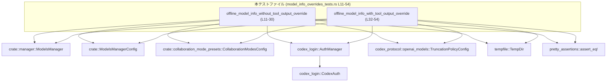
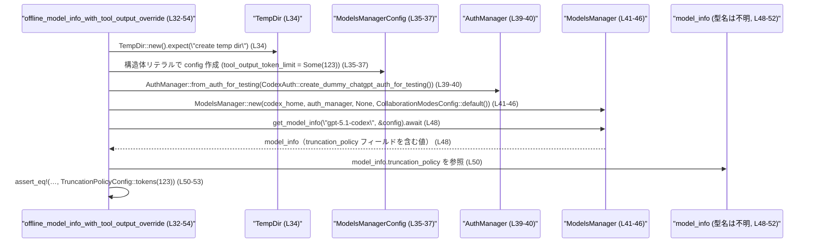

# models-manager/src/model_info_overrides_tests.rs コード解説

## 0. ざっくり一言

`ModelsManager` が返すオフラインモデル情報に対して、`ModelsManagerConfig` の `tool_output_token_limit` 設定が `TruncationPolicyConfig` にどう反映されるかを検証する Tokio ベースの非同期テストが定義されています（`model_info_overrides_tests.rs:L11-54`）。

---

## 1. このモジュールの役割

### 1.1 概要

- このモジュールは、オフライン環境で `ModelsManager::get_model_info` を呼び出したときの **トランケーションポリシー（`TruncationPolicyConfig`）の決定ロジック** をテストします。
- 具体的には、`ModelsManagerConfig` にツール出力トークン上限 (`tool_output_token_limit`) が **設定されていない場合** と **設定されている場合**で、`model_info.truncation_policy` が期待どおりの値になることを検証しています（`model_info_overrides_tests.rs:L11-30`, `L32-54`）。

### 1.2 アーキテクチャ内での位置づけ

このファイルは **テストモジュール** であり、`ModelsManager` およびその周辺コンポーネントのふるまいを外側から検証します。内部実装（`ModelsManager` 本体や `ModelsManagerConfig` の定義）はこのチャンクには現れません。

以下は、本チャンク内で登場するコンポーネントの依存関係です。



> `ModelsManager` や `ModelsManagerConfig`、実際のモデル情報型の定義は、このファイルには出現せず、詳細は不明です。

### 1.3 設計上のポイント

コードから読み取れる特徴を列挙します。

- **非同期テスト + マルチスレッド実行**  
  - 2 つのテストはいずれも `#[tokio::test(flavor = "multi_thread", worker_threads = 2)]` でマークされています（`L11`, `L32`）。  
  - Tokio のマルチスレッドランタイム上で非同期に実行されることを前提としています。
- **一時ディレクトリでの分離された環境**  
  - `TempDir::new().expect("create temp dir")` により、一時ディレクトリを作成し（`L13`, `L34`）、`codex_home` として `ModelsManager` に渡しています（`L17-18`, `L41-42`）。  
  - テスト実行後には `TempDir` のドロップによりディレクトリが自動削除される設計です（TempDir の一般的仕様に基づく）。
- **テスト専用認証情報の利用**  
  - 認証は `AuthManager::from_auth_for_testing` と `CodexAuth::create_dummy_chatgpt_auth_for_testing` を通じてダミー情報で行われます（`L15-16`, `L39-40`）。  
  - 実際の秘密情報を使わないことがコードから明示されています。
- **エラー処理方針**  
  - 一時ディレクトリ作成失敗時のみ `expect` による panic で失敗させ、それ以外の処理 (`ModelsManager::new`, `get_model_info`) からはエラーを戻り値として扱っていません（`L13`, `L34`, `L17-22`, `L41-46`, `L24`, `L48`）。
  - `model_info` は `Result` ではなく、直接フィールド `truncation_policy` にアクセス可能な型として扱われています（`L24`, `L48`, `L26-29`, `L50-53`）。
- **構成による挙動の違いの検証**  
  - デフォルト構成と `tool_output_token_limit` を上書きした構成で、`TruncationPolicyConfig::bytes(10_000)` と `TruncationPolicyConfig::tokens(123)` という異なる期待値を検証しています（`L14`, `L26-29`, `L35-37`, `L50-53`）。

---

## 2. 主要な機能一覧（コンポーネントインベントリー）

### 2.1 このファイルで定義されている関数（テスト）

| 名前 | 種別 | 定義位置 | 役割 / 用途 |
|------|------|----------|------------|
| `offline_model_info_without_tool_output_override` | 非同期テスト関数 | `model_info_overrides_tests.rs:L11-30` | ツール出力トークン上限を指定しない場合に、オフラインモデル `"gpt-5.1"` の `truncation_policy` が `TruncationPolicyConfig::bytes(10_000)` になることを検証する |
| `offline_model_info_with_tool_output_override` | 非同期テスト関数 | `model_info_overrides_tests.rs:L32-54` | `tool_output_token_limit: Some(123)` を設定した場合に、オフラインモデル `"gpt-5.1-codex"` の `truncation_policy` が `TruncationPolicyConfig::tokens(123)` になることを検証する |

### 2.2 このファイルが利用している外部コンポーネント

このファイル内では新しい型を定義していませんが、以下の既存コンポーネントを利用しています。

| コンポーネント | 種別 | 参照位置 | 役割（このファイル内での利用意図） |
|----------------|------|----------|------------------------------------|
| `codex_login::AuthManager` | 構造体（推定） | `L1`, `L15-16`, `L39-40` | ダミー認証情報からテスト用の認証マネージャを生成する |
| `codex_login::CodexAuth` | 構造体（推定） | `L2`, `L15-16`, `L39-40` | `create_dummy_chatgpt_auth_for_testing` によりテスト用 ChatGPT 認証情報を生成 |
| `crate::ModelsManagerConfig` | 構造体（推定） | `L4`, `L14`, `L35-37` | モデル管理の設定。特に `tool_output_token_limit` フィールドの有無がテスト対象 |
| `crate::collaboration_mode_presets::CollaborationModesConfig` | 構造体（推定） | `L5`, `L21`, `L45` | `ModelsManager::new` のパラメータとして利用されるコラボレーションモード設定 |
| `crate::manager::ModelsManager` | 構造体（推定） | `L6`, `L17-22`, `L41-46`, `L24`, `L48` | モデル情報取得の中核。`new` で初期化し、`get_model_info` でモデル情報を取得 |
| `codex_protocol::openai_models::TruncationPolicyConfig` | 構造体 / enum（推定） | `L7`, `L26-29`, `L50-53` | モデルのトランケーション（切り詰め）ポリシーを表す設定。`bytes` / `tokens` コンストラクタを持つ |
| `pretty_assertions::assert_eq` | マクロ | `L8`, `L26-29`, `L50-53` | `model_info.truncation_policy` が期待値と等しいことを検証し、差分を見やすく表示 |
| `tempfile::TempDir` | 構造体 | `L9`, `L13`, `L34` | テスト用に一時ディレクトリを作成し、`codex_home` として使用 |

> `ModelsManagerConfig` のフィールド構成や `ModelsManager` が返すモデル情報型の詳細は、このチャンクには現れないため不明です。

---

## 3. 公開 API と詳細解説

### 3.1 型一覧（構造体・列挙体など）

このファイル内では、新しい構造体・列挙体・型エイリアスは定義されていません。  
すべて他モジュールで定義された型を `use` で利用しています（`L1-9`）。

### 3.2 関数詳細

2 つの非同期テスト関数について、テストが表現している契約（contract）を中心に整理します。

#### `offline_model_info_without_tool_output_override()`

**概要**

- ツール出力トークン上限 (`tool_output_token_limit`) を **指定しない** デフォルト設定で `ModelsManager::get_model_info("gpt-5.1", &config)` を呼び出したとき、返される `model_info.truncation_policy` が `TruncationPolicyConfig::bytes(10_000)` であることを検証するテストです（`L14`, `L24`, `L26-29`）。

**引数**

- なし（テストランナーから呼び出されます）。

**戻り値**

- 戻り値は `()`（ユニット型）です。`#[tokio::test]` によってテストランナーが結果を管理します。

**内部処理の流れ（アルゴリズム）**

コードに基づく手順は次の通りです（`L11-29`）。

1. `TempDir::new().expect("create temp dir")` で一時ディレクトリを作成し、`codex_home` に保持する（`L13`）。
2. `ModelsManagerConfig::default()` でデフォルト設定の `config` を生成する（`L14`）。
3. `CodexAuth::create_dummy_chatgpt_auth_for_testing()` でダミー認証情報を作成し、それを `AuthManager::from_auth_for_testing` に渡してテスト用 `auth_manager` を生成する（`L15-16`）。
4. `ModelsManager::new` に対し、以下を渡して `manager` を生成する（`L17-22`）。
   - `codex_home.path().to_path_buf()`（一時ディレクトリのパス）
   - `auth_manager`
   - `model_catalog` 引数として `None`
   - `CollaborationModesConfig::default()`
5. `manager.get_model_info("gpt-5.1", &config).await` を呼び出し、戻り値を `model_info` として受け取る（`L24`）。
6. `assert_eq!(model_info.truncation_policy, TruncationPolicyConfig::bytes(10_000))` で、トランケーションポリシーが 10,000 バイト上限の設定であることを検証する（`L26-29`）。

**Examples（使用例）**

このテスト自体が `ModelsManager` の基本的な使い方を示しています。属性を外した形で書くと、以下のような利用例になります。

```rust
use codex_login::{AuthManager, CodexAuth};
use codex_protocol::openai_models::TruncationPolicyConfig;
use models_manager::{ModelsManagerConfig};
use models_manager::collaboration_mode_presets::CollaborationModesConfig;
use models_manager::manager::ModelsManager;
use tempfile::TempDir;

async fn example_without_tool_output_override() {
    // 一時ディレクトリを作成し、models-manager 用のホームディレクトリとする
    let codex_home = TempDir::new().expect("create temp dir");

    // デフォルト設定を用意する（tool_output_token_limit は上書きしない）
    let config = ModelsManagerConfig::default();

    // テスト／開発用のダミー認証情報を用意する
    let auth_manager = AuthManager::from_auth_for_testing(
        CodexAuth::create_dummy_chatgpt_auth_for_testing(),
    );

    // ModelsManager を初期化する
    let manager = ModelsManager::new(
        codex_home.path().to_path_buf(),
        auth_manager,
        None, // model_catalog
        CollaborationModesConfig::default(),
    );

    // オフラインモデル "gpt-5.1" の情報を取得する
    let model_info = manager.get_model_info("gpt-5.1", &config).await;

    // truncation_policy が bytes(10_000) であることを前提としたロジックを書ける
    assert_eq!(
        model_info.truncation_policy,
        TruncationPolicyConfig::bytes(10_000),
    );
}
```

> 上記はこのファイルのテストからそのまま抽出した形であり、追加の API 仮定は含んでいません。

**Errors / Panics**

- `TempDir::new().expect("create temp dir")`  
  一時ディレクトリ作成に失敗した場合、`expect` によりテストは panic します（`L13`）。  
  これはテスト環境の前提条件違反と見なされます。
- `ModelsManager::new` や `get_model_info`  
  テストコード上はこれらの呼び出しに対してエラー処理をしていません（`L17-22`, `L24`）。  
  したがって、**戻り値の型は `Result` ではなく直接モデル情報型である**という前提でコンパイルされています。  
  内部でのエラー処理や panic の有無は、このチャンクからは分かりません。

**Edge cases（エッジケース）**

このテストがカバーしている・していない点を整理します。

- カバーしているケース
  - `ModelsManagerConfig::default()` を用いた、ツール出力トークン上限の「未指定」状態での `"gpt-5.1"` モデルの挙動（`L14`, `L24`, `L26-29`）。
- カバーしていないケース（このファイルからは不明）
  - `"gpt-5.1"` 以外のモデル ID。
  - `ModelsManagerConfig` の他のフィールド変更による影響。
  - `tool_output_token_limit` が 0 や極端に大きな値である場合の挙動。
  - オンライン環境での挙動（「offline」という名前からオフライン前提であると推測されますが、コード上の明示的な切り替えはこのチャンクには現れません）。

**使用上の注意点**

- テストに倣ったコードを書く場合、一時ディレクトリではなく永続ディレクトリを使う場合は `TempDir` の代わりに適切なパスを与える必要があります。
- `get_model_info` は `await` する非同期関数として利用されているため、Tokio などの非同期ランタイム上で実行する必要があります（`L11`, `L24`）。
- 戻り値に対してエラー処理を行っていないため、実運用コードではエラー時のふるまいを別途確認する必要があります（戻り値の型定義はこのチャンクにはありません）。

---

#### `offline_model_info_with_tool_output_override()`

**概要**

- `ModelsManagerConfig` の `tool_output_token_limit` フィールドを `Some(123)` に設定した構成で、`ModelsManager::get_model_info("gpt-5.1-codex", &config)` を呼び出したとき、`model_info.truncation_policy` が `TruncationPolicyConfig::tokens(123)` になることを検証するテストです（`L35-37`, `L48`, `L50-53`）。

**引数**

- なし（テストランナーから呼び出されます）。

**戻り値**

- 戻り値は `()`（ユニット型）です。

**内部処理の流れ（アルゴリズム）**

コードに基づく手順は次の通りです（`L32-53`）。

1. `TempDir::new().expect("create temp dir")` で一時ディレクトリを作成し、`codex_home` に保持する（`L34`）。
2. `ModelsManagerConfig` の構造体リテラルで `config` を生成する（`L35-37`）。
   - `tool_output_token_limit: Some(123)` を設定。
   - 残りのフィールドは `..Default::default()` でデフォルト値を用いる。
3. `CodexAuth::create_dummy_chatgpt_auth_for_testing()` から認証情報を作成し、`AuthManager::from_auth_for_testing` を通じて `auth_manager` を作成する（`L39-40`）。
4. `ModelsManager::new` で `manager` を初期化する（`L41-46`）。引数構成は先のテストと同様です。
5. `manager.get_model_info("gpt-5.1-codex", &config).await` を呼び出し、`model_info` を取得する（`L48`）。
6. `assert_eq!(model_info.truncation_policy, TruncationPolicyConfig::tokens(123))` により、トークン数ベースのトランケーションポリシーが設定されていることを検証する（`L50-53`）。

**Examples（使用例）**

このテストは、「構成でツール出力トークン上限を指定することで、トランケーションポリシーがトークンベースになる」という契約を表しています。

```rust
use codex_login::{AuthManager, CodexAuth};
use codex_protocol::openai_models::TruncationPolicyConfig;
use models_manager::{ModelsManagerConfig};
use models_manager::collaboration_mode_presets::CollaborationModesConfig;
use models_manager::manager::ModelsManager;
use tempfile::TempDir;

async fn example_with_tool_output_override() {
    // 一時ディレクトリを用意
    let codex_home = TempDir::new().expect("create temp dir");

    // tool_output_token_limit を 123 トークンに設定
    let config = ModelsManagerConfig {
        tool_output_token_limit: Some(123),
        ..Default::default()
    };

    // ダミー認証情報
    let auth_manager = AuthManager::from_auth_for_testing(
        CodexAuth::create_dummy_chatgpt_auth_for_testing(),
    );

    // ModelsManager を初期化
    let manager = ModelsManager::new(
        codex_home.path().to_path_buf(),
        auth_manager,
        None, // model_catalog
        CollaborationModesConfig::default(),
    );

    // "gpt-5.1-codex" モデルの情報を取得
    let model_info = manager.get_model_info("gpt-5.1-codex", &config).await;

    // truncation_policy が tokens(123) であることを前提としたロジック
    assert_eq!(
        model_info.truncation_policy,
        TruncationPolicyConfig::tokens(123),
    );
}
```

**Errors / Panics**

- 一時ディレクトリ作成時に `expect` による panic の可能性がある点は前のテストと同様です（`L34`）。
- `get_model_info` からの戻り値は、ここでもエラー型ではなく直接モデル情報として扱われています（`L48`）。内部でのエラー処理はこのチャンクからは分かりません。

**Edge cases（エッジケース）**

- カバーしているケース
  - `tool_output_token_limit: Some(123)` を設定したときの `"gpt-5.1-codex"` モデルの挙動（`L35-37`, `L48`, `L50-53`）。
- このテストだけでは分からない点
  - `tool_output_token_limit` に別の値（0 や極端に大きい値）を設定した場合の挙動。
  - `"gpt-5.1-codex"` 以外のモデル ID に対する同設定の影響。
  - `tool_output_token_limit` を設定しても `"gpt-5.1"` に対してはどう扱われるか。

**使用上の注意点**

- `tool_output_token_limit` を設定すると、少なくとも `"gpt-5.1-codex"` に対しては `TruncationPolicyConfig::tokens(...)` が使われる設計であることが、このテストから読み取れます（`L35-37`, `L48`, `L50-53`）。  
  他モデルでも同様かどうかは、このファイルからは不明です。
- 実際のコードで `tool_output_token_limit` を使う場合、このテストが期待している「トークンベースのトランケーションに切り替わる」という契約を前提に書かれていることに注意が必要です。実装を変更した場合は、このテストとの整合を確認する必要があります。

### 3.3 その他の関数

このファイル内で定義されている関数は、上記 2 つのテスト関数のみです。補助的なヘルパー関数やラッパー関数の定義はありません。

---

## 4. データフロー

ここでは、`offline_model_info_with_tool_output_override` を例に、テスト内のデータフローを示します。

- 一時ディレクトリ → `ModelsManager` の初期化 → 構成 (`ModelsManagerConfig`) → `get_model_info` 呼び出し → 取得した `model_info.truncation_policy` の検証、という流れです。



> `model_info` の正確な型や、`ModelsManager::get_model_info` 内部でどのように `tool_output_token_limit` を処理しているかは、このチャンクには現れません。

---

## 5. 使い方（How to Use）

このファイルはテスト専用ですが、`ModelsManager` と関連コンポーネントの実際の利用例として有用です。

### 5.1 基本的な使用方法

テストに倣った基本的な利用フローは以下のようになります。

```rust
use codex_login::{AuthManager, CodexAuth};
use codex_protocol::openai_models::TruncationPolicyConfig;
use models_manager::{ModelsManagerConfig};
use models_manager::collaboration_mode_presets::CollaborationModesConfig;
use models_manager::manager::ModelsManager;
use tempfile::TempDir;

#[tokio::main(flavor = "multi_thread", worker_threads = 2)]
async fn main() {
    // 1. ホームディレクトリ（ここでは一時ディレクトリ）を用意
    let codex_home = TempDir::new().expect("create temp dir");

    // 2. 設定を作成
    let config = ModelsManagerConfig {
        // ツール出力トークン上限を設定したい場合は Some(...) を指定
        tool_output_token_limit: Some(123),
        ..Default::default()
    };

    // 3. 認証マネージャを作成（本番環境では適切な認証情報を使う）
    let auth_manager =
        AuthManager::from_auth_for_testing(CodexAuth::create_dummy_chatgpt_auth_for_testing());

    // 4. ModelsManager を初期化
    let manager = ModelsManager::new(
        codex_home.path().to_path_buf(),
        auth_manager,
        None, // model_catalog
        CollaborationModesConfig::default(),
    );

    // 5. モデル情報を取得
    let model_info = manager.get_model_info("gpt-5.1-codex", &config).await;

    // 6. truncation_policy を利用
    assert_eq!(
        model_info.truncation_policy,
        TruncationPolicyConfig::tokens(123)
    );
}
```

この例は、テストコードを元にした単純化されたサンプルです。  
`ModelsManager` や `ModelsManagerConfig` の他の機能は、このチャンクには現れません。

### 5.2 よくある使用パターン

テストから読み取れる 2 つのパターンを整理します。

1. **ツール出力トークン上限を設定しないパターン**（`L11-30`）
   - `config = ModelsManagerConfig::default()` を使う。
   - `get_model_info("gpt-5.1", &config)` の結果は、`TruncationPolicyConfig::bytes(10_000)` を期待している。
   - 「バイト数ベースのトランケーション」がデフォルトであることをテストしています。

2. **ツール出力トークン上限を設定するパターン**（`L32-54`）
   - `config` の `tool_output_token_limit` を `Some(123)` に設定。
   - `get_model_info("gpt-5.1-codex", &config)` の結果は、`TruncationPolicyConfig::tokens(123)` を期待。
   - 「指定したトークン数ベースのトランケーション」に切り替わることをテストしています。

### 5.3 よくある間違い

このファイルから想定される誤用例と、それに対応する正しい使い方です。

```rust
// 誤りの例: tool_output_token_limit の設定を忘れる
let config = ModelsManagerConfig::default();
// この状態で「トークンベースのトランケーション」を期待すると、
// テストが示す契約（"gpt-5.1" は bytes(10_000)）と食い違う可能性がある

// 正しい例: トークンベースのトランケーションを期待するなら明示的に設定
let config = ModelsManagerConfig {
    tool_output_token_limit: Some(123),
    ..Default::default()
};
```

```rust
// 誤りの例: 非同期コンテキスト外で get_model_info を呼ぶ（コンパイルエラー）
fn wrong_usage(manager: ModelsManager, config: ModelsManagerConfig) {
    let model_info = manager.get_model_info("gpt-5.1-codex", &config); // .await できない
}

// 正しい例: async 関数内で .await を付けて呼び出す
async fn correct_usage(manager: ModelsManager, config: ModelsManagerConfig) {
    let model_info = manager.get_model_info("gpt-5.1-codex", &config).await;
}
```

### 5.4 使用上の注意点（まとめ）

- **非同期実行が必須**  
  - `get_model_info` は `.await` されているため、Tokio などの非同期ランタイムで実行する必要があります（`L11`, `L24`, `L32`, `L48`）。
- **構成とモデル ID の組み合わせ**  
  - テストからは `"gpt-5.1"` と `"gpt-5.1-codex"` で異なる挙動（bytes vs tokens）が期待されていることが分かります（`L24-29`, `L48-53`）。  
    他のモデル ID では同じとは限りません。
- **テスト環境と本番環境の差異**  
  - 認証情報に `create_dummy_chatgpt_auth_for_testing` を使用しているため（`L15-16`, `L39-40`）、本番コードでは別途適切な認証経路が必要です。
- **一時ディレクトリ使用時の panic**  
  - `TempDir::new().expect("create temp dir")` はディレクトリ作成失敗時に panic します（`L13`, `L34`）。  
    本番コードではエラー処理を行う選択肢も考慮する必要があります。

---

## 6. 変更の仕方（How to Modify）

### 6.1 新しい機能を追加する場合（テストケースの追加）

このファイルに新しいテストを追加して、`ModelsManager` の別の設定項目やモデル情報のふるまいを検証する際の基本的な流れです。

1. **シナリオを明確にする**
   - 例: 「`tool_output_token_limit` に 0 を指定したとき」「別モデル ID のトランケーションポリシー」など。
2. **既存テストをベースにコピー**
   - `offline_model_info_without_tool_output_override` か `offline_model_info_with_tool_output_override` をコピーし、テスト名とモデル ID、設定値、期待される `TruncationPolicyConfig` を変更します。
3. **設定 (`ModelsManagerConfig`) を調整**
   - 検証したいフィールドだけを構造体リテラルで上書きし、残りは `..Default::default()` を利用するパターンが再利用できます（`L35-37`）。
4. **期待値 (`assert_eq!`) を設定**
   - 実装が提供する契約に合わせて `TruncationPolicyConfig::bytes(...)` や `::tokens(...)` などを指定します（`L26-29`, `L50-53`）。
5. **Tokio テスト属性を付与**
   - `#[tokio::test(flavor = "multi_thread", worker_threads = 2)]` を付けて非同期テストとして実行できるようにします（`L11`, `L32`）。

### 6.2 既存の機能を変更する場合（契約の変更への追従）

`ModelsManager` の挙動を変更した場合、このテストをどのように調整すべきかの指針です。

- **`tool_output_token_limit` の意味が変わる場合**
  - 例えば、「設定されているときも bytes ベースのトランケーションにする」など仕様変更を行った場合、  
    - `offline_model_info_with_tool_output_override` の期待値 `TruncationPolicyConfig::tokens(123)`（`L50-53`）を新しい仕様に合わせて書き換える必要があります。
- **デフォルト設定の挙動が変わる場合**
  - `ModelsManagerConfig::default()` における `tool_output_token_limit` の既定値が変わる場合、  
    - `offline_model_info_without_tool_output_override` の期待値 `TruncationPolicyConfig::bytes(10_000)`（`L26-29`）の更新が必要です。
- **`get_model_info` のシグネチャが変わる場合**
  - 戻り値が `Result` になるなどシグネチャが変わった場合、  
    - `let model_info = manager.get_model_info(...).await;`（`L24`, `L48`）の部分に対して `?` や `unwrap` などのエラー処理を追加する必要があります。
- **影響範囲の確認**
  - `ModelsManager` や `ModelsManagerConfig` を利用している他のテストファイル・本体コードが存在する可能性があります。  
    このチャンクには現れませんが、`rg "get_model_info"` などで検索して影響を確認するのが一般的です（これは一般的なワークフローの説明であり、具体的なファイル構成はこのチャンクからは不明です）。

---

## 7. 関連ファイル

このテストモジュールと密接に関係するモジュール・外部クレートを整理します（パスはコード中のモジュールパスに基づきます）。

| パス / モジュール | 役割 / 関係 |
|-------------------|------------|
| `crate::manager::ModelsManager` | モデル情報の取得 (`get_model_info`) や管理を行う中核コンポーネント。`ModelsManager::new` で初期化され、本テストから呼び出されています（`model_info_overrides_tests.rs:L17-22`, `L24`, `L41-46`, `L48`）。 |
| `crate::ModelsManagerConfig` | モデル管理の設定をまとめた構造体（推定）。`tool_output_token_limit` フィールドを持ち、テストの主要な入力条件になっています（`L4`, `L14`, `L35-37`）。 |
| `crate::collaboration_mode_presets::CollaborationModesConfig` | コラボレーションモードに関する設定（推定）。`ModelsManager::new` の引数として渡されるのみで、詳細な内容はこのチャンクには現れません（`L5`, `L21`, `L45`）。 |
| `codex_login::AuthManager` / `codex_login::CodexAuth` | 認証関連コンポーネント。テスト用のダミー認証情報を生成し、`ModelsManager` に渡すために利用されています（`L1-2`, `L15-16`, `L39-40`）。 |
| `codex_protocol::openai_models::TruncationPolicyConfig` | モデルの出力トランケーションポリシーを表す型。`bytes` / `tokens` コンストラクタを通じて期待値が指定されており、本テストの主な検証対象です（`L7`, `L26-29`, `L50-53`）。 |
| `tempfile::TempDir` | 一時ディレクトリを扱うユーティリティ。テストごとに独立した `codex_home` を作成するために使われています（`L9`, `L13`, `L34`）。 |
| `pretty_assertions::assert_eq` | 通常の `assert_eq!` に代わる、差分表示が見やすいアサーションマクロ。`truncation_policy` が期待値と一致することを検証するために使われています（`L8`, `L26-29`, `L50-53`）。 |

> `ModelsManager` や `ModelsManagerConfig` の実際の定義ファイル（`src/manager.rs` など）は、このチャンクには明示されていません。そのため、型のフィールド詳細や内部ロジックはここからは判断できません。
