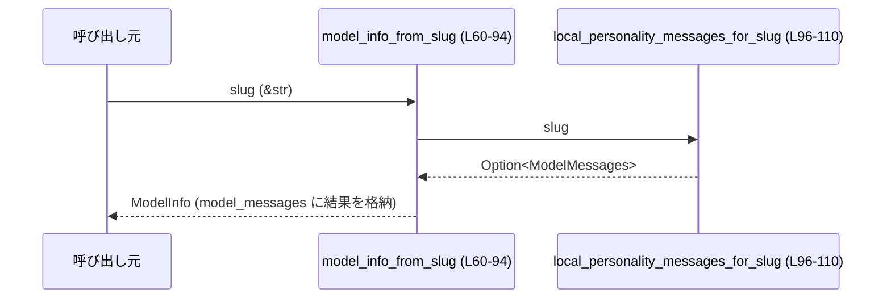
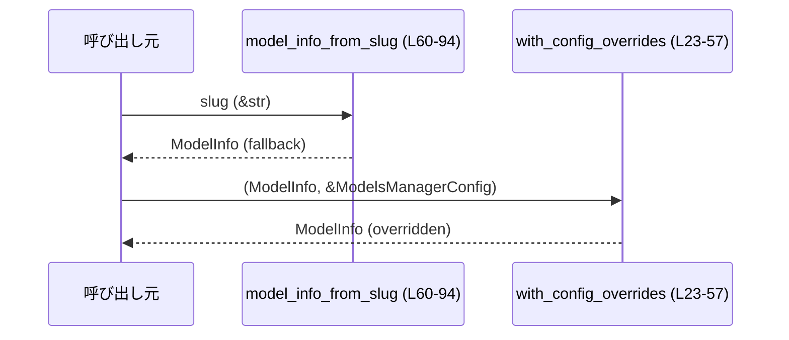

models-manager/src/model_info.rs

---

## 0. ざっくり一言

このモジュールは、`ModelInfo` の設定を `ModelsManagerConfig` で上書きする処理と、未知のモデル slug に対するフォールバック用 `ModelInfo` を組み立てる処理を提供するユーティリティです（`model_info.rs:L16-57`, `model_info.rs:L59-94`）。

---

## 1. このモジュールの役割

### 1.1 概要

- このモジュールは **モデル設定情報 (`ModelInfo`) の最終形を決定する** ために存在し、次の機能を提供します。
  - 実際のモデル定義に対して、アプリケーション設定 (`ModelsManagerConfig`) からのオーバーライドを適用する（`with_config_overrides`）（`model_info.rs:L23-57`）。
  - 未知／欠損 slug のための最小限のフォールバック `ModelInfo` を構築する（`model_info.rs:L59-94`）。
  - 一部の slug 向けにローカルな「パーソナリティ付き」`ModelMessages` を生成する（`model_info.rs:L96-110`）。

### 1.2 アーキテクチャ内での位置づけ

このモジュールは、外部のプロトコル定義（`codex_protocol`）とアプリ側設定（`ModelsManagerConfig`）の間に位置し、両者を組み合わせた最終的な `ModelInfo` を返します。

依存関係の概要（このファイル内で確認できる範囲）を以下に示します。

```mermaid
graph TD
    subgraph "models-manager"
        A["model_info.rs\n(本ファイル)"]
        C["config::ModelsManagerConfig\n(型のみ参照)"]
    end

    subgraph "codex_protocol"
        MI["openai_models::ModelInfo"]
        MM["openai_models::ModelMessages"]
        MV["openai_models::ModelVisibility"]
        MT["openai_models::TruncationMode"]
        MPC["openai_models::TruncationPolicyConfig"]
        WS["openai_models::WebSearchToolType"]
        RS["config_types::ReasoningSummary"]
        IM["openai_models::default_input_modalities()"]
    end

    subgraph "その他"
        T["tracing::warn"]
        B["codex_utils_output_truncation::approx_bytes_for_tokens"]
        P["BASE_INSTRUCTIONS (include_str! ../prompt.md)"]
    end

    A --> C
    A --> MI
    A --> MM
    A --> MT
    A --> MPC
    A --> WS
    A --> MV
    A --> RS
    A --> IM
    A --> B
    A --> T
    A --> P
```



- `with_config_overrides` は `ModelInfo`, `ModelsManagerConfig`, `TruncationPolicyConfig`, `TruncationMode`, `approx_bytes_for_tokens` を使用します（`model_info.rs:L23-47`）。
- `model_info_from_slug` は `ModelInfo` を構築し、`local_personality_messages_for_slug` を呼び出します（`model_info.rs:L60-77`）。
- `local_personality_messages_for_slug` は `ModelMessages`, `ModelInstructionsVariables` と定数文字列を組み合わせます（`model_info.rs:L96-107`）。

### 1.3 設計上のポイント

コードから読み取れる特徴は以下のとおりです。

- **ステートレスな関数構成**  
  - グローバルな可変状態は持たず、すべての関数は引数から新しい値を計算して返すだけです（`model_info.rs:L23-57`, `model_info.rs:L60-94`, `model_info.rs:L96-110`）。
- **設定による上書きは「ある項目だけ」**  
  - `ModelsManagerConfig` の各フィールドが `Some` の場合のみ `ModelInfo` を上書きし、それ以外は元の値を維持します（`model_info.rs:L23-34`, `model_info.rs:L35-47`, `model_info.rs:L49-54`）。
- **安全寄りの数値変換**  
  - トークン数→バイト数／トークン数→`i64` 変換では `i64::try_from(...).unwrap_or(i64::MAX)` を使用し、変換に失敗した場合も panic せず最大値にフォールバックします（`model_info.rs:L38-40`, `model_info.rs:L43-44`）。
- **フォールバック `ModelInfo` の明示的なフラグ**  
  - フォールバックで構築された `ModelInfo` には `used_fallback_model_metadata: true` がセットされ、通常のメタデータと区別できるようになっています（`model_info.rs:L91-92`）。
- **一部 slug 向けのローカル・パーソナリティ**  
  - 特定の slug に対してだけ、`ModelMessages` を生成することで、説明文やパーソナリティテンプレートを差し込めるようになっています（`model_info.rs:L96-107`）。

### 1.4 コンポーネント一覧（インベントリー）

| 名前 | 種別 | 公開 | 役割 / 用途 | 根拠 |
|------|------|------|-------------|------|
| `BASE_INSTRUCTIONS` | `const &str` | `pub` | `../prompt.md` の内容を組み込んだベースプロンプト文字列 | `model_info.rs:L16` |
| `DEFAULT_PERSONALITY_HEADER` | `const &str` | 非公開 | パーソナリティ付き指示のヘッダー文 | `model_info.rs:L17` |
| `LOCAL_FRIENDLY_TEMPLATE` | `const &str` | 非公開 | 「フレンドリー」なパーソナリティ説明テンプレート | `model_info.rs:L18-19` |
| `LOCAL_PRAGMATIC_TEMPLATE` | `const &str` | 非公開 | 「プラグマティック」なパーソナリティ説明テンプレート | `model_info.rs:L20` |
| `PERSONALITY_PLACEHOLDER` | `const &str` | 非公開 | 指示テンプレート内の `{{ personality }}` プレースホルダ | `model_info.rs:L21` |
| `with_config_overrides` | 関数 | `pub` | 既存の `ModelInfo` に `ModelsManagerConfig` の設定値を上書き適用する | `model_info.rs:L23-57` |
| `model_info_from_slug` | 関数 | `pub` | 未知／欠損 slug のためのフォールバック `ModelInfo` を構築する | `model_info.rs:L59-94` |
| `local_personality_messages_for_slug` | 関数 | 非公開 | slug に応じたローカル `ModelMessages` を返す | `model_info.rs:L96-110` |
| `tests` モジュール | モジュール | テスト時のみ | このファイルのテストコードを `model_info_tests.rs` から読み込む | `model_info.rs:L112-114` |

---

## 2. 主要な機能一覧

- `ModelInfo` への設定値オーバーライド: `with_config_overrides` が `ModelsManagerConfig` を読み取り、コンテキストウィンドウ等の各種設定を上書きします（`model_info.rs:L23-57`）。
- フォールバック `ModelInfo` の生成: 未知の slug を受け取った場合でも最低限動作する `ModelInfo` を構築します（`model_info.rs:L59-94`）。
- ローカルパーソナリティの付与: 特定の slug に対してのみ、デフォルトプロンプトにパーソナリティテンプレートを挿入する `ModelMessages` を生成します（`model_info.rs:L96-107`）。

---

## 3. 公開 API と詳細解説

### 3.1 型一覧（構造体・列挙体など）

このファイル自身は新しい構造体や列挙体を定義していませんが、以下の外部型と密接に関係します。

| 名前 | 種別 | 出典 | 役割 / 用途 | 根拠 |
|------|------|------|-------------|------|
| `ModelInfo` | 構造体 | `codex_protocol::openai_models` | モデルのメタデータと設定値全体を保持する。ここで上書き・構築の対象となる。 | `model_info.rs:L3`, `model_info.rs:L23`, `model_info.rs:L60` |
| `ModelMessages` | 構造体 | 同上 | モデルごとのパーソナリティや指示テンプレートを保持する。ローカル生成対象。 | `model_info.rs:L5`, `model_info.rs:L76`, `model_info.rs:L96-107` |
| `ModelInstructionsVariables` | 構造体 | 同上 | パーソナリティ関連のテンプレート変数をまとめる。 | `model_info.rs:L4`, `model_info.rs:L102-106` |
| `ModelVisibility` | 列挙体 | 同上 | モデルの可視性（UI/API等）を表す。 | `model_info.rs:L6`, `model_info.rs:L69` |
| `TruncationMode` | 列挙体 | 同上 | 出力切り詰め（トークン／バイト）単位のモード。 | `model_info.rs:L7`, `model_info.rs:L36-45` |
| `TruncationPolicyConfig` | 構造体/ビルダ | 同上 | 切り詰めポリシーの設定（バイト数／トークン数）を表現する。 | `model_info.rs:L8`, `model_info.rs:L40`, `model_info.rs:L44`, `model_info.rs:L83` |
| `WebSearchToolType` | 列挙体 | 同上 | Web 検索ツールの種別。 | `model_info.rs:L9`, `model_info.rs:L82` |
| `ReasoningSummary` | 列挙体 | `codex_protocol::config_types` | Reasoning summary の設定。ここでは `Auto` を使用。 | `model_info.rs:L1`, `model_info.rs:L78` |
| `ModelsManagerConfig` | 構造体 | `crate::config` | モデル管理用の設定値。どのフィールドを持つかの詳細はこのチャンクには現れませんが、ここでは複数のオプション設定を参照しています。 | `model_info.rs:L12`, `model_info.rs:L23-54` |

> `ModelsManagerConfig` や `ModelInfo` のフィールド定義全体はこのチャンクには現れません。そのため、ここではこのファイルからアクセスされているフィールドのみを前提に説明します。

### 3.2 関数詳細

#### `with_config_overrides(mut model: ModelInfo, config: &ModelsManagerConfig) -> ModelInfo`

**概要**

- 既存の `ModelInfo` に対して、`ModelsManagerConfig` で指定された設定値を「あるものだけ」上書きし、更新後の `ModelInfo` を返します（`model_info.rs:L23-57`）。

**引数**

| 引数名 | 型 | 説明 | 根拠 |
|--------|----|------|------|
| `model` | `ModelInfo` | 上書き対象となる元のモデル情報。所有権を受け取り、関数内でフィールドを書き換えます。 | `model_info.rs:L23` |
| `config` | `&ModelsManagerConfig` | 適用するオーバーライド設定。参照で受け取り、内部で読み取り専用に使用します。 | `model_info.rs:L23-54` |

**戻り値**

- `ModelInfo`  
  オーバーライドを適用した後のモデル情報を返します（`model_info.rs:L56`）。

**内部処理の流れ**

1. `config.model_supports_reasoning_summaries` が `Some(true)` のとき、`model.supports_reasoning_summaries` を `true` に設定します（`model_info.rs:L24-28`）。
2. `config.model_context_window` が `Some` のとき、`model.context_window` を `Some(context_window)` に上書きします（`model_info.rs:L29-31`）。
3. `config.model_auto_compact_token_limit` が `Some` のとき、`model.auto_compact_token_limit` を `Some(auto_compact_token_limit)` に上書きします（`model_info.rs:L32-34`）。
4. `config.tool_output_token_limit` が `Some(token_limit)` のとき、以下を行います（`model_info.rs:L35-47`）。
   - 現在の `model.truncation_policy.mode` を見て分岐（`Bytes` / `Tokens`）（`model_info.rs:L36-45`）。
   - `Bytes` の場合: `approx_bytes_for_tokens(token_limit)` で推定バイト数を算出し、`i64::try_from(...)` で `i64` に変換しつつ、変換失敗時は `i64::MAX` でフォールバックし、`TruncationPolicyConfig::bytes(byte_limit)` で新ポリシーを作成（`model_info.rs:L37-41`）。
   - `Tokens` の場合: `i64::try_from(token_limit).unwrap_or(i64::MAX)` でトークン数を `i64` に変換し、`TruncationPolicyConfig::tokens(limit)` を設定（`model_info.rs:L42-45`）。
5. `config.base_instructions` が `Some(base_instructions)` のとき、次を行います（`model_info.rs:L49-51`）。
   - `model.base_instructions` を `base_instructions.clone()` に置き換え。
   - `model.model_messages` を `None` にして、既存のパーソナリティメッセージを無効化。
6. それ以外で `config.personality_enabled` が `false` のとき、`model.model_messages` を `None` にします（`model_info.rs:L52-54`）。
7. 更新された `model` を返します（`model_info.rs:L56`）。

**Examples（使用例）**

`model_info_from_slug` でフォールバック `ModelInfo` を作り、それに設定を上書きする例です。

```rust
use models_manager::model_info::{model_info_from_slug, with_config_overrides};
use models_manager::config::ModelsManagerConfig; // 実際のパスは crate 構成に依存します

fn configure_model() {
    // 未知の slug に対してフォールバック ModelInfo を生成する
    let model = model_info_from_slug("my-unknown-model"); // model_info.rs:L60-93

    // 実際には適切な初期化が必要（フィールド名・型はこのチャンクには現れません）
    let config = ModelsManagerConfig {
        // ここではフィールドを省略（例: model_context_window など）
        ..Default::default()
    };

    // config に従って model を上書きした新しい ModelInfo を得る
    let updated_model = with_config_overrides(model, &config); // model_info.rs:L23-57

    // updated_model を以降の処理で利用する
    println!("slug = {}", updated_model.slug);
}
```

> `ModelsManagerConfig` の具体的なフィールド初期化方法はこのチャンクには現れないため、上記では `..Default::default()` としています。

**Errors / Panics**

- 明示的な `Result` や `Option` は返さず、panic を発生させるコードもこの関数内にはありません。
- 数値変換はすべて `i64::try_from(...).unwrap_or(i64::MAX)` で行われるため、変換に失敗しても panic ではなく `i64::MAX` を使用します（`model_info.rs:L38-40`, `model_info.rs:L43-44`）。

**Edge cases（エッジケース）**

- `config.model_supports_reasoning_summaries` が `Some(false)` の場合  
  → 何も変更せず、元の `model.supports_reasoning_summaries` を維持します（`if let Some(...) && supports_reasoning_summaries` 条件）（`model_info.rs:L24-27`）。
- `config.tool_output_token_limit` が非常に大きい場合  
  → `i64::try_from(...)` で変換不可となった場合は `i64::MAX` を用いるため、実質的に「ほぼ切り詰めない」設定になります（`model_info.rs:L38-40`, `model_info.rs:L43-44`）。
- `config.base_instructions` が `None` で `config.personality_enabled` が `true` の場合  
  → `model.model_messages` は変更されません（`else if !config.personality_enabled` の条件）（`model_info.rs:L49-54`）。
- `config.base_instructions` が `Some(...)` の場合  
  → 以前の `model.model_messages` は必ず `None` にされ、パーソナリティテンプレートは無効化されます（`model_info.rs:L49-51`）。

**使用上の注意点**

- `supports_reasoning_summaries` を「false にする」手段にはなっていません。`config.model_supports_reasoning_summaries` が `Some(true)` のときのみ `true` に上書きされ、それ以外では元の値を保持します（`model_info.rs:L24-28`）。
- `tool_output_token_limit` を設定すると、**既存の `truncation_policy` のモードを尊重した上で** 上書きされます。モード自体はここでは変更されません（`model_info.rs:L35-45`）。
- この関数はスレッドセーフです（引数以外の可変状態を触らないため）。ただし、`ModelInfo` の所有権を消費する点に注意が必要です。

---

#### `model_info_from_slug(slug: &str) -> ModelInfo`

**概要**

- 未知または登録されていない slug に対して、最低限のメタデータを持ったフォールバック `ModelInfo` を構築する関数です（`model_info.rs:L59-94`）。

**引数**

| 引数名 | 型 | 説明 | 根拠 |
|--------|----|------|------|
| `slug` | `&str` | 不明／未知のモデル識別子。フォールバック `ModelInfo.slug` および `display_name` にそのまま利用されます。 | `model_info.rs:L60`, `model_info.rs:L63-64` |

**戻り値**

- `ModelInfo`  
  フォールバック用に構築された `ModelInfo` を返します。`used_fallback_model_metadata: true` であることにより通常のメタデータと区別可能です（`model_info.rs:L91-92`）。

**内部処理の流れ**

1. `tracing::warn!` で「Unknown model {slug} is used. This will use fallback model metadata.」という警告ログを出力します（`model_info.rs:L61`）。
2. `ModelInfo` のインスタンスをフィールド初期化子で構築し、以下のような値を設定します（`model_info.rs:L62-93`）。
   - `slug`, `display_name`: `slug.to_string()`（`model_info.rs:L63-64`）。
   - 複数のオプションフィールドを `None` または空ベクタ (`Vec::new()`) で初期化（`model_info.rs:L65-67`, `model_info.rs:L72-74`, `model_info.rs:L80-81`, `model_info.rs:L87-90`）。
   - `shell_type`: `ConfigShellToolType::Default`（`model_info.rs:L68`）。
   - `visibility`: `ModelVisibility::None`（`model_info.rs:L69`）。
   - `supported_in_api`: `true`（`model_info.rs:L70`）。
   - `priority`: `99`（`model_info.rs:L71`）。
   - `base_instructions`: `BASE_INSTRUCTIONS.to_string()`（`model_info.rs:L75`）。
   - `model_messages`: `local_personality_messages_for_slug(slug)` の戻り値（`model_info.rs:L76`）。
   - `supports_reasoning_summaries`: `false`（`model_info.rs:L77`）。
   - `default_reasoning_summary`: `ReasoningSummary::Auto`（`model_info.rs:L78`）。
   - `web_search_tool_type`: `WebSearchToolType::Text`（`model_info.rs:L82`）。
   - `truncation_policy`: `TruncationPolicyConfig::bytes(10_000)`（`model_info.rs:L83`）。
   - `context_window`: `Some(272_000)`（`model_info.rs:L86`）。
   - `effective_context_window_percent`: `95`（`model_info.rs:L88`）。
   - `input_modalities`: `default_input_modalities()`（`model_info.rs:L90`）。
   - `used_fallback_model_metadata`: `true`（`model_info.rs:L91`）。
   - `supports_search_tool`: `false`（`model_info.rs:L92`）。

**Examples（使用例）**

```rust
use models_manager::model_info::model_info_from_slug;

fn build_fallback() {
    // 未知の slug を指定してフォールバック ModelInfo を生成
    let model = model_info_from_slug("some-unknown-slug");

    assert_eq!(model.slug, "some-unknown-slug");
    assert!(model.used_fallback_model_metadata); // model_info.rs:L91
}
```

**Errors / Panics**

- この関数は panic するコードを含まず、`Result` も返しません。
- ただし、`tracing::warn!` によってログ出力が行われるため、ログ設定によっては I/O のオーバーヘッドが発生する可能性があります（`model_info.rs:L61`）。

**Edge cases（エッジケース）**

- `slug` が空文字列 `""` の場合  
  → `slug` および `display_name` が空文字のままの `ModelInfo` が生成されます（`model_info.rs:L63-64`）。
- `slug` が `"gpt-5.2-codex"` や `"exp-codex-personality"` の場合  
  → `local_personality_messages_for_slug(slug)` により、パーソナリティ付き `ModelMessages` が付与されます（`model_info.rs:L76`, `model_info.rs:L96-107`）。
- 上記以外の slug の場合  
  → `model_messages` は `None` になります（`local_personality_messages_for_slug` のデフォルト分岐）（`model_info.rs:L108-109`）。

**使用上の注意点**

- この関数が返す `ModelInfo` は**フォールバック用**であり、実際のモデル能力やリソース制限を正確に表しているとは限りません。その旨を示すフラグ `used_fallback_model_metadata` が `true` になっています（`model_info.rs:L91`）。
- コンテキストウィンドウやトランケーションポリシーは固定値を使っているため、必要に応じて `with_config_overrides` で上書きすることが想定されます（`model_info.rs:L83`, `model_info.rs:L86`, `model_info.rs:L23-47`）。

---

#### `local_personality_messages_for_slug(slug: &str) -> Option<ModelMessages>`

**概要**

- 一部の slug に対して、ローカルに定義されたパーソナリティ付き `ModelMessages` を返します。それ以外の slug に対しては `None` を返します（`model_info.rs:L96-110`）。

**引数**

| 引数名 | 型 | 説明 | 根拠 |
|--------|----|------|------|
| `slug` | `&str` | モデル識別子。どのパーソナリティテンプレートを適用するかのキーとして使用されます。 | `model_info.rs:L96-99`, `model_info.rs:L108` |

**戻り値**

- `Option<ModelMessages>`  
  - 対応する slug の場合: `Some(ModelMessages { ... })`  
  - 対応しない slug の場合: `None`（`model_info.rs:L98-109`）。

**内部処理の流れ**

1. `match slug` によるパターンマッチを行います（`model_info.rs:L97-98`）。
2. `"gpt-5.2-codex"` または `"exp-codex-personality"` の場合:
   - `instructions_template` に、  
     `DEFAULT_PERSONALITY_HEADER` → 空行2つ → `PERSONALITY_PLACEHOLDER` → 空行2つ → `BASE_INSTRUCTIONS` を `format!` で結合した文字列を設定します（`model_info.rs:L99-101`）。
   - `instructions_variables` に `ModelInstructionsVariables` を設定し、以下の3種のパーソナリティ文字列を `Some` で包んで入れます（`model_info.rs:L102-106`）。
     - `personality_default`: 空文字列（`String::new()`）。
     - `personality_friendly`: `LOCAL_FRIENDLY_TEMPLATE.to_string()`。
     - `personality_pragmatic`: `LOCAL_PRAGMATIC_TEMPLATE.to_string()`。
3. 上記以外の slug では `_ => None` を返します（`model_info.rs:L108-109`）。

**Examples（使用例）**

```rust
use models_manager::model_info::model_info_from_slug;

fn load_codex_personality() {
    // "gpt-5.2-codex" は local_personality_messages_for_slug で特別扱いされる
    let model = model_info_from_slug("gpt-5.2-codex"); // model_info.rs:L60-93

    if let Some(messages) = &model.model_messages {
        // instructions_template と variables が設定されていることが期待される
        assert!(messages.instructions_template.is_some());
        assert!(messages.instructions_variables.is_some());
    } else {
        panic!("expected personality messages for gpt-5.2-codex");
    }
}
```

**Errors / Panics**

- この関数自体は panic しません。`format!` と構造体リテラルのみです（`model_info.rs:L99-107`）。

**Edge cases（エッジケース）**

- `slug` が `null` に相当する値を取ることは型的にありません（`&str`）。
- 上記2つ以外の slug 全てに対して `None` が返るため、呼び出し側は `Option` を適切にハンドリングする必要があります（`model_info.rs:L108-109`）。

**使用上の注意点**

- この関数は `pub` ではなくモジュール内専用です（`fn` に `pub` が付いていない）（`model_info.rs:L96`）。外部から利用したい場合は公開ラッパーを別途用意する必要があります。
- `BASE_INSTRUCTIONS`（`../prompt.md`）の内容はビルド時に埋め込まれますが、その中身はこのチャンクには現れないため、`instructions_template` の具体的なテキスト全体はここからは分かりません（`model_info.rs:L16`, `model_info.rs:L100`）。

### 3.3 その他の関数

上記 3 つ以外の関数はこのファイルには存在しません。

---

## 4. データフロー

### 4.1 `model_info_from_slug` → `local_personality_messages_for_slug` の呼び出し関係

このモジュール内で唯一の関数間呼び出しは、フォールバック `ModelInfo` 構築時に `local_personality_messages_for_slug` を呼ぶ部分です（`model_info.rs:L76`, `model_info.rs:L96-110`）。



- `model_info_from_slug` は `slug` をそのまま `local_personality_messages_for_slug` に渡します（`model_info.rs:L76`, `model_info.rs:L96`）。
- `local_personality_messages_for_slug` でパーソナリティが見つかった場合、`model_messages: Some(...)` として `ModelInfo` に入ります。それ以外は `None` になります（`model_info.rs:L96-109`）。

### 4.2 典型的な利用フロー（構成例）

外部からは、フォールバック構築と設定オーバーライドを組み合わせて使う構成が自然です（この組み合わせ使用は名前とインターフェースからの推測であり、具体的な呼び出しコードはこのチャンクには現れません）。



---

## 5. 使い方（How to Use）

### 5.1 基本的な使用方法

フォールバック `ModelInfo` を構築し、設定で上書きする基本パターンです。

```rust
use models_manager::model_info::{model_info_from_slug, with_config_overrides};
use models_manager::config::ModelsManagerConfig;

fn build_final_model(slug: &str, config: &ModelsManagerConfig) {
    // 1. 未知 slug に対するフォールバック ModelInfo を作る
    let model = model_info_from_slug(slug); // model_info.rs:L60-93

    // 2. アプリ設定からのオーバーライドを適用する
    let final_model = with_config_overrides(model, config); // model_info.rs:L23-57

    // 3. final_model を下流の推論処理などに渡す
    println!("Using model: {}", final_model.display_name);
}
```

### 5.2 よくある使用パターン

1. **出力トークン制限だけ上書きする**

```rust
fn override_tool_output_limit(model: ModelInfo, config: &mut ModelsManagerConfig) -> ModelInfo {
    // 実際のフィールド名・型はこのチャンクには現れませんが、
    // tool_output_token_limit に何らかの値を設定してから with_config_overrides を呼び出す
    config.tool_output_token_limit = Some(2_000); // フィールド名はコードから確認可能（model_info.rs:L35）

    with_config_overrides(model, config) // model_info.rs:L23-47
}
```

1. **パーソナリティを無効化してベースインストラクションだけを使う**

```rust
fn disable_personality(model: ModelInfo, config: &mut ModelsManagerConfig) -> ModelInfo {
    // base_instructions を設定すると model_messages は明示的に None にされる（model_info.rs:L49-51）
    config.base_instructions = Some("You are a plain assistant.".to_string());

    with_config_overrides(model, config)
}
```

> `ModelsManagerConfig` のフィールドはこのチャンクで参照されている名前以上のことは分からないため、型・デフォルト値などは実際の定義を確認する必要があります。

### 5.3 よくある間違い

```rust
// 間違い例: reasoning_summaries を false にしたいと思っている
fn disable_reasoning_summaries_wrong(model: ModelInfo, config: &mut ModelsManagerConfig) -> ModelInfo {
    config.model_supports_reasoning_summaries = Some(false); // model_info.rs:L24
    with_config_overrides(model, config)
    // → with_config_overrides は Some(true) の時だけ true に上書きするため、
    //   false に「する」効果はなく、元の値が維持される（model_info.rs:L24-28）
}

// 正しい理解: この関数は true にするためのオーバーライドのみ行う
fn enable_reasoning_summaries(model: ModelInfo, config: &mut ModelsManagerConfig) -> ModelInfo {
    config.model_supports_reasoning_summaries = Some(true);
    with_config_overrides(model, config) // supports_reasoning_summaries が true にされる（model_info.rs:L24-28）
}
```

### 5.4 使用上の注意点（まとめ）

- `with_config_overrides` は「設定が `Some` のものだけ上書き」する関数であり、**値をリセット（無効化）する用途には向いていません**（`model_info.rs:L23-34`, `model_info.rs:L49-54`）。
- `model_info_from_slug` が返すフォールバックモデルは、あくまで「最低限動く」ための設定であり、本番モデルと同じ能力・制約を持つとは限りません（`model_info.rs:L83`, `model_info.rs:L86`, `model_info.rs:L91`）。
- 両関数とも共有可変状態を扱わないため、並行に呼び出してもデータ競合は発生しません。

---

## 6. 変更の仕方（How to Modify）

### 6.1 新しい機能を追加する場合

1. **新しい slug へのパーソナリティ対応を追加**  
   - `local_personality_messages_for_slug` の `match slug` にパターンを追加し、対応する `ModelMessages` を返すようにする（`model_info.rs:L96-107`）。
   - 必要に応じて新しいパーソナリティ用の定数テンプレートを定義する（`model_info.rs:L17-21` を参照）。
2. **オーバーライド対象フィールドの追加**  
   - `ModelsManagerConfig` に新しいオプションフィールドを追加（この定義は別ファイルに存在します）。
   - `with_config_overrides` 内で同名フィールドを `if let Some(...)` で読み取り、対応する `ModelInfo` のフィールドを上書きする処理を追加（`model_info.rs:L29-34` のパターンを参考）。

### 6.2 既存の機能を変更する場合

- **フォールバック `ModelInfo` の変更**
  - `model_info_from_slug` 内のフィールド初期化子を編集する（`model_info.rs:L62-93`）。
  - 特に `truncation_policy` や `context_window` の値を変更する場合、下流で想定しているリソース制約との整合性を確認する必要があります。
- **契約（前提条件）の確認**
  - `with_config_overrides` は「Some の値だけ上書き」という契約に依存しているため、挙動を変える場合はその前提を利用している箇所（他ファイル）も合わせて確認する必要があります。このチャンクには呼び出し元は現れません。
- **テストの更新**
  - 変更内容に合わせて `model_info_tests.rs` 内のテストを追加／更新する必要があります（`model_info.rs:L112-114`）。テストの具体的な内容はこのチャンクからは分かりません。

---

## 7. 関連ファイル

| パス / モジュール | 役割 / 関係 | 根拠 |
|-------------------|------------|------|
| `crate::config::ModelsManagerConfig` | モデル構成管理用の設定値を定義する構造体。`with_config_overrides` の第2引数として使用される。 | `model_info.rs:L12`, `model_info.rs:L23-54` |
| `codex_protocol::openai_models::*` | `ModelInfo`, `ModelMessages`, `TruncationPolicyConfig` 等、モデルメタデータの型定義を提供する。 | `model_info.rs:L2-10`, `model_info.rs:L60-93` |
| `codex_protocol::config_types::ReasoningSummary` | `default_reasoning_summary` フィールドに使用される列挙体。 | `model_info.rs:L1`, `model_info.rs:L78` |
| `codex_utils_output_truncation::approx_bytes_for_tokens` | トークン数から出力バイト数を概算するユーティリティ関数。トランケーションポリシー設定に使用。 | `model_info.rs:L13`, `model_info.rs:L37-40` |
| `../prompt.md` | `BASE_INSTRUCTIONS` として埋め込まれるベースプロンプト。`model_info_from_slug` および `local_personality_messages_for_slug` で使用。 | `model_info.rs:L16`, `model_info.rs:L75`, `model_info.rs:L100` |
| `model_info_tests.rs` | このモジュール用のテストコード。`#[cfg(test)]` で読み込まれる。 | `model_info.rs:L112-114` |

---

### Bugs / Security / Contracts（まとめ）

- **メモリ安全性**  
  - すべての処理は安全な Rust コードで書かれており、`unsafe` ブロックはありません（このチャンク全体）。
- **エラーと契約**  
  - 数値変換においては `unwrap_or(i64::MAX)` により「最大値にフォールバックする」という契約があります（`model_info.rs:L38-40`, `model_info.rs:L43-44`）。上流・下流でこの振る舞いを前提としている可能性があります。
- **ログの扱い**  
  - `model_info_from_slug` は未知 slug ごとに `warn!` を発行するため、非常に多数の未知 slug を扱う場合はログが増加する可能性があります（`model_info.rs:L61`）。
- **並行性**  
  - グローバル可変状態を持たず、関数は引数だけに依存するため、並行実行時のデータ競合の心配はありません。ログ出力・グローバル設定（tracingの設定など）の並行性については、このファイルの外の設定に依存します。
