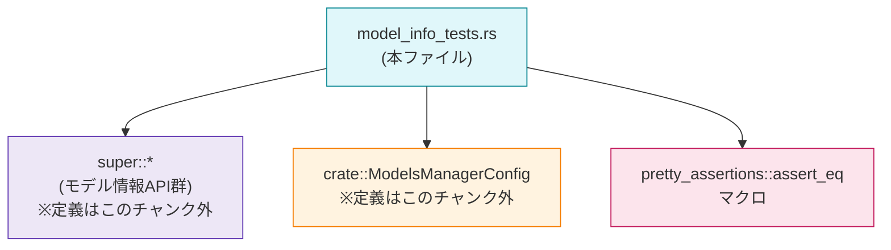

# models-manager/src/model_info_tests.rs コード解説

## 0. ざっくり一言

このファイルは、「モデル情報」に対して `ModelsManagerConfig` の `model_supports_reasoning_summaries` 設定を適用したときの挙動を検証するユニットテスト群です（`supports_reasoning_summaries` フラグがどのように上書きされるかを確認しています）。  
（行番号は `models-manager/src/model_info_tests.rs:Lx-y` 形式で示します）

---

## 1. このモジュールの役割

### 1.1 概要

- このモジュールは、`with_config_overrides` 関数に `ModelsManagerConfig` を渡したとき、
  - `model_supports_reasoning_summaries: Some(true)` なら常にサマリー機能が有効になること
  - `model_supports_reasoning_summaries: Some(false)` の場合はモデル側の設定を変更しないこと  
  を保証するためのテストを提供します（L5-18, L20-32, L34-45）。
- 具体的には、モデルの `supports_reasoning_summaries` フィールド（型名はこのチャンクでは不明）と、構成フラグの組み合わせごとに期待される結果を `assert_eq!` で検証しています。

### 1.2 アーキテクチャ内での位置づけ

このファイルはテストモジュールであり、親モジュールの API に対する振る舞いテストという位置づけです。



- `use super::*;` により、親モジュール（たとえば `model_info` など、正確なファイル名はこのチャンクには現れません）から
  - `model_info_from_slug`
  - `with_config_overrides`  
  などの関数をインポートしています（L1）。
- `ModelsManagerConfig` はクレートルートからインポートされています（L2）。
- `assert_eq` は `pretty_assertions` クレートのマクロを使用しており、テスト失敗時の差分表示を改善します（L3）。

### 1.3 設計上のポイント

コードから読み取れる設計上の特徴は次のとおりです。

- **テストベースの仕様定義**  
  - `model_supports_reasoning_summaries: Some(true)` は「強制的に有効にする」ことを、テスト名とアサーションで明示しています（L5-18）。
  - `Some(false)` は「機能を無効化しない（no-op）」であることを 2 パターン（モデル側が true／false）で検証しています（L20-32, L34-45）。
- **状態を持たない（純粋関数的な）テスト**  
  - 各テストはローカル変数のみを使用し、グローバル状態に依存していません（L7-17, L22-31, L36-44）。
- **エラーハンドリング方針**  
  - エラーや `Result` 型は使わず、失敗は `assert_eq!` のパニックとして表現されます（L17, L31, L44）。
- **所有権とクローンの明示的な利用**  
  - `with_config_overrides` に渡すために `model.clone()` を使い、元の `model` を期待値として再利用しています（L13, L29, L42）。  
    これは「テスト内で元のモデル値を保持しつつ、関数に所有権を渡す」という Rust 特有の所有権設計に沿った書き方です。
- **並行性**  
  - このファイル内にはスレッド生成や `async` はなく、すべて同期で完結するユニットテストです。

---

## 2. 主要な機能一覧

### 2.1 テストケースの機能一覧

- `reasoning_summaries_override_true_enables_support`  
  - 構成フラグ `Some(true)` によって、モデルの `supports_reasoning_summaries` が有効化されることを検証します（L5-18）。
- `reasoning_summaries_override_false_does_not_disable_support`  
  - モデルがすでに `supports_reasoning_summaries = true` の場合に、`Some(false)` がその機能を無効化しないことを検証します（L20-32）。
- `reasoning_summaries_override_false_is_noop_when_model_is_false`  
  - モデルが `supports_reasoning_summaries = false` の場合でも、`Some(false)` が何も変更しないことを検証します（L34-45）。

### 2.2 コンポーネントインベントリー（関数）

本ファイル内で「定義される」関数の一覧です。

| 名称 | 種別 | 役割 / 用途 | 定義位置 |
|------|------|-------------|----------|
| `reasoning_summaries_override_true_enables_support` | 関数（テスト、`#[test]`） | `model_supports_reasoning_summaries: Some(true)` でモデルがサマリー機能を必ずサポートするようになることを検証する | `model_info_tests.rs:L5-18` |
| `reasoning_summaries_override_false_does_not_disable_support` | 関数（テスト、`#[test]`） | モデル側が `supports_reasoning_summaries = true` のときに `Some(false)` がその機能を無効化しないことを検証する | `model_info_tests.rs:L20-32` |
| `reasoning_summaries_override_false_is_noop_when_model_is_false` | 関数（テスト、`#[test]`） | モデル側が `supports_reasoning_summaries = false` のときに `Some(false)` が何も変更しないことを検証する | `model_info_tests.rs:L34-45` |

### 2.3 コンポーネントインベントリー（外部参照）

本ファイルから「呼び出されている／使用されている」が、このチャンクには定義が現れないコンポーネントです。

| 名称 | 種別 | 役割 / 用途（コードから読み取れる範囲） | 参照位置 | 定義の有無 |
|------|------|------------------------------------------|----------|-----------|
| `model_info_from_slug` | 関数（推定） | `"unknown-model"` というスラッグから何らかの「モデル情報」インスタンスを生成していると考えられますが、定義はこのチャンクにはありません | `model_info_tests.rs:L7, L22, L36` | このチャンクには定義がない |
| `with_config_overrides` | 関数（推定） | モデルと `ModelsManagerConfig` を受け取り、構成に基づいてモデルを更新した新しいインスタンスを返していると考えられますが、定義はこのチャンクにはありません | `model_info_tests.rs:L13, L29, L42` | このチャンクには定義がない |
| `ModelsManagerConfig` | 構造体（推定） | モデルに対する上書き設定（ここでは `model_supports_reasoning_summaries`）を保持する設定構造体と考えられますが、詳細はこのチャンクにはありません | `model_info_tests.rs:L8-11, L24-27, L37-40` | このチャンクには定義がない |
| `pretty_assertions::assert_eq` | マクロ | 2 つの値の等価性を比較し、失敗時に差分を見やすく表示するテスト用マクロです | `model_info_tests.rs:L3, L17, L31, L44` | 外部クレート、定義はこのチャンクにはない |

---

## 3. 公開 API と詳細解説

このファイル自身はテストモジュールであり、「公開 API」は持ちませんが、テストとして重要な 3 関数について詳細に整理します。

### 3.1 型一覧（構造体・列挙体など）

本チャンクに型定義は登場しませんが、使用されている主要な型を整理します。

| 名前 | 種別 | 役割 / 用途 | 根拠 |
|------|------|-------------|------|
| `ModelsManagerConfig` | 構造体（推定） | モデルに対する構成オプションを保持する設定型。ここでは `model_supports_reasoning_summaries: Option<bool>` フィールドを持つことがコードから分かります（L8-11, L24-27, L37-40）。その他のフィールドは `..Default::default()` によって初期化されますが、詳細はこのチャンクには現れません。 | `model_info_tests.rs:L8-11, L24-27, L37-40` |
| `model` 変数の型 | 不明（親モジュール定義のモデル型） | `model_info_from_slug` の戻り値であり、`supports_reasoning_summaries: bool` フィールドを持つこと、`clone()` できること、`assert_eq!` で比較できること（Eq/PartialEq 実装がある）が分かります。型名自体はこのチャンクには現れません。 | `model_info_tests.rs:L7, L14-15, L22-23, L29, L36, L42, L44` |

### 3.2 関数詳細

#### `reasoning_summaries_override_true_enables_support() -> ()`

**概要**

- `ModelsManagerConfig { model_supports_reasoning_summaries: Some(true), ..Default::default() }` を適用したとき、モデルの `supports_reasoning_summaries` が `true` になることを検証するテストです（L5-18）。
- また、他のフィールドが想定外に変更されていないことも `assert_eq!` によって間接的に検証しています（L17）。

**引数**

- なし（Rust のテスト関数として標準的な形態です）。

**戻り値**

- `()`（ユニット）。テストの成功・失敗は戻り値ではなくパニックの有無で表現されます。

**内部処理の流れ**

1. `model_info_from_slug("unknown-model")` を呼び出し、基準となるモデルインスタンス `model` を取得します（L7）。
2. `ModelsManagerConfig` を `Default::default()` をベースに、`model_supports_reasoning_summaries: Some(true)` だけを上書きして生成します（L8-11）。
3. `with_config_overrides(model.clone(), &config)` を呼び出し、構成を適用した新しいモデル `updated` を得ます（L13）。
   - ここで `model.clone()` としているため、第 1 引数は所有権を伴う値渡しであると推測できます（定義はこのチャンクにはありません）。
4. `let mut expected = model;` で元のモデルを `expected` にムーブし、`expected.supports_reasoning_summaries = true;` により期待する状態を作ります（L14-15）。
5. `assert_eq!(updated, expected);` で、実際の結果 `updated` が期待値 `expected` と完全一致することを検証します（L17）。

**Examples（使用例）**

この関数自体はテストエントリーポイントなので、直接呼び出すことはありませんが、同様のパターンで別のフラグをテストする例を示します（概念的な例です）。

```rust
#[test]
fn some_flag_override_true_enables_flag() {
    let model = model_info_from_slug("unknown-model");          // 基準となるモデルを取得する
    let config = ModelsManagerConfig {                          // 対象フラグに対して Some(true) を設定
        some_flag: Some(true),                                  // ※このフィールド名は例示であり、コードには現れません
        ..Default::default()
    };

    let updated = with_config_overrides(model.clone(), &config); // 構成を適用したモデルを得る
    let mut expected = model;                                   // 元のモデルを期待値用にムーブ
    expected.some_flag = true;                                  // フラグが true になることを期待

    assert_eq!(updated, expected);                              // 実際と期待を比較
}
```

**Errors / Panics**

- `assert_eq!(updated, expected);` が失敗すると、このテスト関数はパニックを起こし、テストは失敗します（L17）。
- その他に明示的な `panic!` や `unwrap` などは使用していません。

**Edge cases（エッジケース）**

- このテストは `model_supports_reasoning_summaries: Some(true)` のケースのみを扱っています。
- `None` や `Some(false)` の挙動は別のテストで扱われていますが、この関数単体からは分かりません。
- `model` の初期状態が `supports_reasoning_summaries = true` かどうかはテスト内で参照されておらず、このチャンクからは不明です（L7, L14-15）。

**使用上の注意点**

- 同様のテストを書く場合、`with_config_overrides` に値を渡した後にも元の値を使いたいときは、このように `clone()` を挟む必要があります（L13）。  
  Rust の所有権ルール上、ムーブした値は以降使用できないためです。
- `assert_eq!` による比較が、どのフィールドを対象にしているかはモデル型の `PartialEq` 実装に依存します。自動導出されている場合はすべてのフィールドが比較されますが、このチャンクからは詳細は分かりません。

---

#### `reasoning_summaries_override_false_does_not_disable_support() -> ()`

**概要**

- モデルの `supports_reasoning_summaries` がすでに `true` の場合に、構成フラグ `model_supports_reasoning_summaries: Some(false)` を適用しても、その機能が無効化されない（＝値が true のまま維持される）ことを検証します（L20-32）。

**引数**

- なし。

**戻り値**

- `()`（ユニット）。失敗はパニックとして表現されます。

**内部処理の流れ**

1. `model_info_from_slug("unknown-model")` からモデルを取得し、`let mut model` として可変にします（L22）。
2. `model.supports_reasoning_summaries = true;` により、モデルがサマリー機能をサポートする状態を明示的に作ります（L23）。
3. `ModelsManagerConfig` を `model_supports_reasoning_summaries: Some(false)` で初期化します（L24-27）。
4. `with_config_overrides(model.clone(), &config)` を実行し、構成適用後のモデル `updated` を取得します（L29）。
5. `assert_eq!(updated, model);` によって、構成適用前後でモデルが変化していないことを検証します（L31）。

**Examples（使用例）**

同じパターンで「無効化設定が no-op であること」をテストする例です。

```rust
#[test]
fn some_flag_override_false_does_not_disable_flag() {
    let mut model = model_info_from_slug("unknown-model"); // モデルを取得
    model.some_flag = true;                                // フラグを true にしておく

    let config = ModelsManagerConfig {
        some_flag: Some(false),                            // false を指定するが…
        ..Default::default()
    };

    let updated = with_config_overrides(model.clone(), &config); // 構成を適用
    assert_eq!(updated, model);                                // フラグが true のまま変化していないことを期待
}
```

（`some_flag` は例示であり、実際のコードには現れません。）

**Errors / Panics**

- `assert_eq!(updated, model);` による比較が失敗した場合のみパニックが発生します（L31）。

**Edge cases（エッジケース）**

- このテストにより、少なくとも「true → false に上書きされることはない」ことが保証されます（L23-24, L29-31）。
- `Some(false)` を指定した場合に、`false → true` に変更されるかどうかは別のテストで扱われています（L34-45）。
- `None` のケースはこのファイルではテストされていません。

**使用上の注意点**

- 構成フラグ `Some(false)` が「機能を強制的に無効化する」のではなく、「何もしない」として扱われることを意図したテストである点に注意が必要です。  
  実装を変更して「false 指定で強制無効化」としたい場合、このテストは仕様に反するため更新対象になります。

---

#### `reasoning_summaries_override_false_is_noop_when_model_is_false() -> ()`

**概要**

- モデルの `supports_reasoning_summaries` が `false` の場合に、`model_supports_reasoning_summaries: Some(false)` を適用しても、やはり何も変わらない（no-op）ことを検証するテストです（L34-45）。

**引数**

- なし。

**戻り値**

- `()`。

**内部処理の流れ**

1. `model_info_from_slug("unknown-model")` でモデルを取得します（L36）。
   - このテストでは、`supports_reasoning_summaries` の値を明示的に変更していないため、その初期値はこのチャンクからは不明です。
2. `ModelsManagerConfig` を `model_supports_reasoning_summaries: Some(false)` で作成します（L37-40）。
3. `with_config_overrides(model.clone(), &config)` を実行して、構成適用後のモデル `updated` を取得します（L42）。
4. `assert_eq!(updated, model);` で構成適用前後のモデルが同一であることを検証します（L44）。

**Examples（使用例）**

no-op な挙動をテストする一般的なパターンとして参考にできます。

```rust
#[test]
fn some_flag_override_false_is_noop_when_model_is_false() {
    let model = model_info_from_slug("unknown-model");      // 初期状態のモデル
    let config = ModelsManagerConfig {
        some_flag: Some(false),                             // false を指定
        ..Default::default()
    };

    let updated = with_config_overrides(model.clone(), &config); // 構成を適用
    assert_eq!(updated, model);                              // 何も変わっていないことを検証
}
```

**Errors / Panics**

- `assert_eq!(updated, model);` の比較が失敗した場合にパニックが発生します（L44）。

**Edge cases（エッジケース）**

- このテストは「元が false で `Some(false)` を指定した場合」という一点のみをカバーします。
- 「元が true で `Some(false)`」のケースとは別テストで切り分けられている点が特徴です（L20-32 と対で読むと仕様が明確になります）。

**使用上の注意点**

- `model` の初期状態が `supports_reasoning_summaries = false` であることを暗黙に前提としているように見えますが、このチャンクでは `model` のフィールドを読み取ってはいません。  
  実際には「`Some(false)` を指定しても変化しない」ことだけを検証していることに注意が必要です。

---

### 3.3 その他の関数（参照のみ）

| 関数名 | 役割（1 行、推測を含む） | 参照位置 |
|--------|---------------------------|----------|
| `model_info_from_slug` | `"unknown-model"` という文字列（スラッグ）からモデル情報インスタンスを生成する関数と推測されますが、定義はこのチャンクにはありません。 | `L7, L22, L36` |
| `with_config_overrides` | モデルと `ModelsManagerConfig` を受け取り、構成に応じてモデルを更新した新しいインスタンスを返す関数と推測されますが、定義はこのチャンクにはありません。 | `L13, L29, L42` |

---

## 4. データフロー

### 4.1 代表的な処理シナリオ

`reasoning_summaries_override_true_enables_support` テスト（L5-18）を例に、データの流れを示します。

- 入力:
  - スラッグ `"unknown-model"`（L7）
  - 構成 `ModelsManagerConfig { model_supports_reasoning_summaries: Some(true), ..Default::default() }`（L8-11）
- 処理:
  - スラッグからモデルを生成
  - 構成を適用して新しいモデルを生成
- 出力:
  - 期待されるモデル（元のモデルに対し `supports_reasoning_summaries = true` を設定したもの）
  - 実際のモデル `updated`
  - 両者の比較結果

```mermaid
sequenceDiagram
    participant T as テスト関数<br/>reasoning_summaries_override_true_enables_support<br/>(L5-18)
    participant F as model_info_from_slug<br/>(定義はこのチャンク外)
    participant W as with_config_overrides<br/>(定義はこのチャンク外)

    T->>F: model_info_from_slug("unknown-model") (L7)
    F-->>T: model (モデルインスタンス)

    T->>T: config := ModelsManagerConfig {<br/>  model_supports_reasoning_summaries: Some(true),<br/>  ..Default::default()<br/>} (L8-11)

    T->>W: with_config_overrides(model.clone(), &config) (L13)
    W-->>T: updated (構成適用後のモデル)

    T->>T: expected := model; expected.supports_reasoning_summaries = true; (L14-15)

    T->>T: assert_eq!(updated, expected); (L17)
```

この図は、テスト関数が外部関数 `model_info_from_slug` と `with_config_overrides` を呼び出し、その結果を `assert_eq!` で検証するというシンプルなフローであることを示しています。

---

## 5. 使い方（How to Use）

### 5.1 基本的な使用方法

このファイルはテスト専用です。一般的な Rust プロジェクトと同様、通常はテストランナー（例: `cargo test`）によって自動的に実行されます。  

テストコードのパターンとしては次の流れになっています。

1. テスト対象となるモデルを生成する（`model_info_from_slug`、L7, L22, L36）。
2. テストしたい条件を満たすようにモデルや構成をセットアップする（L8-11, L23-27, L37-40）。
3. `with_config_overrides` を呼び出す（L13, L29, L42）。
4. 期待するモデル状態をローカルで構築し（L14-15, L22-23）、`assert_eq!` で比較する（L17, L31, L44）。

### 5.2 よくある使用パターン

- **「構成が有効化だけ行う」ことのテスト**  
  - `Some(true)` → フラグが必ず `true` になる（L5-18）。
- **「構成が無効化を行わない」ことのテスト**  
  - 元のモデルが `true` → `Some(false)` であっても `true` のまま（L20-32）。
  - 元のモデルが `false` → `Some(false)` でも変化なし（L34-45）。

この 3 つのテストで、`model_supports_reasoning_summaries` フラグに関する主要な組み合わせ（true/false × Some(true)/Some(false) のうち 3 ケース）をカバーしています。

### 5.3 よくある間違い

このファイルから推測される、「似たテストを書く際に起こりうる誤りと正しいパターン」の例です。

```rust
// 誤りの例（所有権の扱い）
#[test]
fn wrong_test() {
    let model = model_info_from_slug("unknown-model");
    let config = ModelsManagerConfig {
        model_supports_reasoning_summaries: Some(true),
        ..Default::default()
    };

    let updated = with_config_overrides(model, &config); // model をムーブしてしまう（仮想例）

    // ここで model を使おうとするとコンパイルエラーになる:
    // let mut expected = model;
}

// 正しいパターン（本ファイルと同様）
#[test]
fn correct_test() {
    let model = model_info_from_slug("unknown-model");
    let config = ModelsManagerConfig {
        model_supports_reasoning_summaries: Some(true),
        ..Default::default()
    };

    let updated = with_config_overrides(model.clone(), &config); // クローンを渡す（L13, L29, L42）
    let mut expected = model;                                    // 元の値を期待値構築に使える
    expected.supports_reasoning_summaries = true;
    assert_eq!(updated, expected);
}
```

- 上記の「誤りの例」はあくまで所有権ルールを説明するための仮想例であり、実際の `with_config_overrides` のシグネチャはこのチャンクからは分かりません。

### 5.4 使用上の注意点（まとめ）

- **仕様の読み取り**  
  - このテストファイルは、`model_supports_reasoning_summaries` に対して
    - `Some(true)` は「強制的に有効化」
    - `Some(false)` は「何もしない（no-op）」  
    という仕様を示しています（L5-18, L20-32, L34-45）。実装変更時には、仕様とテストの整合性に注意が必要です。
- **安全性・エラー**  
  - 明示的なエラー処理はなく、テスト失敗は `assert_eq!` によるパニックで表現されます（L17, L31, L44）。
  - 外部との I/O やスレッド操作がないため、メモリ安全性および並行性に関する懸念は読み取れません。
- **並行実行**  
  - テストはグローバル状態に依存していないため、テストランナーが並列実行しても相互干渉の危険性は低いと考えられます（このチャンクに限った話です）。

---

## 6. 変更の仕方（How to Modify）

### 6.1 新しい機能を追加する場合

`with_config_overrides` に新しい構成フラグ（例: `model_supports_xxx`）を追加する場合、本ファイルをどう扱うかの一般的な流れです。

1. 親モジュール側（`super::*`）で新しいフラグのロジックを実装する（このチャンクには実装はありません）。
2. 本ファイルと同じパターンで、新フラグの挙動を検証するテストを追加する。
   - モデルの初期状態を用意する（`model_info_from_slug`、L7, L22, L36）。
   - 構成 `ModelsManagerConfig` に `Some(true)` / `Some(false)` などを設定する。
   - `with_config_overrides` を呼び出して結果を `assert_eq!` で検証する。
3. `Some(true)`・`Some(false)`・`None` それぞれの仕様がある場合は、必要な組み合わせをカバーするテストを追加する。

### 6.2 既存の機能を変更する場合

たとえば、「`Some(false)` のときは機能を強制的に無効化する」という仕様に変えたい場合、次の点に注意する必要があります。

- **影響範囲の確認**
  - `with_config_overrides` の実装と、`model_supports_reasoning_summaries` フィールドを使っている他の部分を確認する必要があります（実際の位置はこのチャンクには現れません）。
- **テストの更新**
  - 本ファイルの 2 つのテスト
    - `reasoning_summaries_override_false_does_not_disable_support`（L20-32）
    - `reasoning_summaries_override_false_is_noop_when_model_is_false`（L34-45）  
    は現行仕様を前提としているため、新仕様に合わせて期待値を変更する必要があります。
- **契約（前提条件・返り値の意味）**
  - 「構成で何ができるか（enable-only なのか enable/disable なのか）」という API 契約がテストでドキュメント化されているため、契約を変える際はテストの意味とコメント（テスト名含む）を合わせて更新することが重要です。

---

## 7. 関連ファイル

このモジュールと関係があると分かるファイル・モジュールは次のとおりです。

| パス / モジュール | 役割 / 関係 |
|-------------------|------------|
| `super` モジュール（正確なファイルパスはこのチャンクには現れません） | `use super::*;` を通じて、`model_info_from_slug` や `with_config_overrides` など、テスト対象の API を提供しています（L1）。 |
| `crate::ModelsManagerConfig`（定義位置はこのチャンクには現れません） | モデルに対する構成上書き設定を保持する型であり、本ファイルでは `model_supports_reasoning_summaries` フィールドが使用されています（L2, L8-11, L24-27, L37-40）。 |
| `pretty_assertions` クレート | `assert_eq` マクロを提供し、テスト失敗時に見やすい差分を表示するために利用されています（L3, L17, L31, L44）。 |

このチャンクにはこれらの定義本体は含まれていないため、詳細なロジックや他のフィールド・関数については別ファイルを参照する必要があります。
