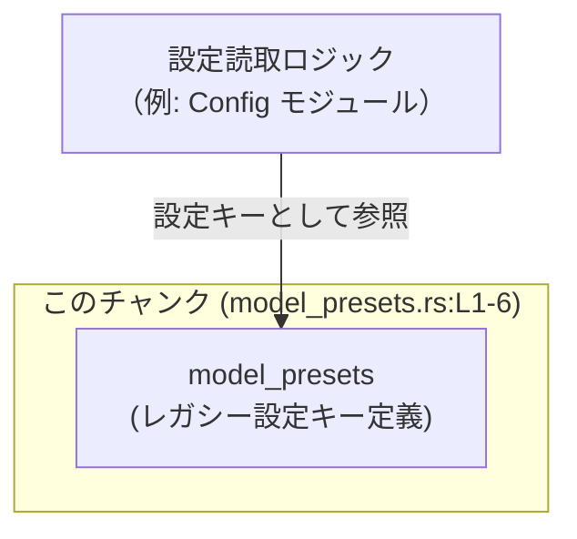
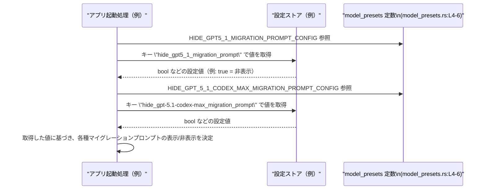

# models-manager/src/model_presets.rs コード解説

## 0. ざっくり一言

レガシーなマイグレーション用プロンプトに関する設定値との互換性を保つための、**設定キー文字列（`&'static str` 定数）を2つ定義しているモジュール**です。

---

## 1. このモジュールの役割

### 1.1 概要

- 冒頭のコメントにある通り、このモジュールは「古いマイグレーションプロンプト用の設定との互換性」を維持するための **レガシー設定キー** を提供します（`model_presets.rs:L1-3`）。
- かつて存在した「ハードコードされたモデルプリセット」は削除され、現在は「アクティブなカタログからモデル一覧が導出される」ため、このファイルは **過去の設定ファイルとの互換性レイヤ** という位置づけになっています（`model_presets.rs:L1-3`）。
- 提供しているのは2つの `pub const &str` だけで、ロジックや状態は持っていません（`model_presets.rs:L4-6`）。

### 1.2 アーキテクチャ内での位置づけ

このチャンクから分かる範囲では、このモジュールは **他モジュールから参照されるだけの定数定義モジュール**です。  
依存関係は次のように整理できます（利用側は一般的なイメージであり、具体的なモジュール名はこのチャンクからは分かりません）。



- `model_presets` 自身は他のモジュールを `use` しておらず、依存はありません（このチャンクには `use` や関数呼び出しが存在しません）。
- 一方で、設定ローダやマイグレーションプロンプト表示ロジックなどが、これらの `pub const` を **キー名のソース** として参照していると考えられますが、具体的な呼び出し元はこのチャンクには現れていません。

### 1.3 設計上のポイント

コードから読み取れる特徴は次の通りです。

- **レガシー互換性のための設計**  
  - コメントに「Legacy notice keys kept for config compatibility with older migration prompts」とあるため（`model_presets.rs:L1`）、新しい設計に移行した後も「古い設定を壊さない」ことを意図した定数保持であると読み取れます。
- **状態を持たない・純粋な定数定義**  
  - 変数や構造体はなく、2つの `pub const &str` のみが定義されています（`model_presets.rs:L4-6`）。  
  - 実行時に変更される状態は一切ありません。
- **エラーハンドリング不要**  
  - コンパイル時に決定される定数文字列であり、取得時にエラーが発生する可能性はありません（`pub const` のみでロジックがないため）。
- **スレッド安全性**  
  - `&'static str` の `pub const` は **読み取り専用で不変** であるため、どのスレッドから参照してもデータ競合は発生しません。
- **命名による用途の明示**  
  - それぞれの定数名から、「GPT‑5.1 マイグレーションプロンプト」と「GPT‑5.1 Codex Max マイグレーションプロンプト」を **隠す（hide）ための設定キー** であることが読み取れます（`model_presets.rs:L4-6`）。

---

## 2. 主要な機能一覧

このモジュールは関数を持たず、2つの公開定数のみで構成されています。そのため「機能」としては次の2点に集約されます。

- `HIDE_GPT5_1_MIGRATION_PROMPT_CONFIG`:
  - 文字列 `"hide_gpt5_1_migration_prompt"` を表す設定キー定数を提供します（`model_presets.rs:L4`）。
- `HIDE_GPT_5_1_CODEX_MAX_MIGRATION_PROMPT_CONFIG`:
  - 文字列 `"hide_gpt-5.1-codex-max_migration_prompt"` を表す設定キー定数を提供します（`model_presets.rs:L5-6`）。

---

## 3. 公開 API と詳細解説

### 3.1 型・定数一覧

このモジュールには構造体や列挙体は無く、公開 API は2つの文字列定数です。

| 名前 | 種別 | 型 | 値 | 役割 / 用途 | 根拠 |
|------|------|----|----|-------------|------|
| `HIDE_GPT5_1_MIGRATION_PROMPT_CONFIG` | 定数 | `&'static str` | `"hide_gpt5_1_migration_prompt"` | GPT‑5.1 に関するマイグレーションプロンプトを非表示にするかどうかを制御する設定キーとして使用される文字列 | `model_presets.rs:L4` |
| `HIDE_GPT_5_1_CODEX_MAX_MIGRATION_PROMPT_CONFIG` | 定数 | `&'static str` | `"hide_gpt-5.1-codex-max_migration_prompt"` | GPT‑5.1 Codex Max に関するマイグレーションプロンプトを非表示にするかどうかを制御する設定キーとして使用される文字列 | `model_presets.rs:L5-6` |

> 補足: 具体的に「どの設定ストア」「どの関数」で使われているかは、このチャンクには現れていません。

#### Rustの観点（安全性・並行性）

- どちらも `pub const` であり、**ビルド時に埋め込まれる不変の参照** です。
- `&'static str` はプログラム全体で共有される読み取り専用データであり、**どのスレッドから参照しても問題ありません**。
- これらの定数そのものの使用に起因するランタイムエラーやパニックは発生しません。

### 3.2 関数詳細

このモジュールには関数が定義されていません（`model_presets.rs:L1-6` には `fn` 宣言が存在しません）。  
そのため、詳細解説すべき関数 API はありません。

### 3.3 その他の関数

同様に、補助的な関数やラッパー関数も定義されていません。

---

## 4. データフロー

このモジュール自体には処理ロジックがありませんが、**典型的な利用シナリオ** としては「設定ストアから値を読む際のキーとして使う」形が想定されます。  
ここでは、あくまで一般的な利用イメージとしてのデータフローを示します（具体的な関数名・型はこのチャンクからは特定できないため、例示に留まります）。

### 4.1 利用イメージのシーケンス図



- 上記は **想定される一般的な利用例** を図示したものであり、実際の呼び出し元の型や関数名は、このチャンクからは分かりません。
- 実際の挙動（どのタイミングで読み取るか、型は `bool` かどうかなど）は、設定ストア側の実装に依存します。

---

## 5. 使い方（How to Use）

ここでは、他モジュールからこれらの定数を参照して設定を読み出す、典型的な利用パターンを **サンプルコード** として示します。  
`Config` 型や `get_bool` メソッドはあくまで例であり、このチャンクには定義がありません。

### 5.1 基本的な使用方法

```rust
// 仮の設定型。実際の型名やメソッドはこのチャンクからは分かりません。
struct Config {
    // 内部実装は不明（例示のため省略）
}

impl Config {
    fn get_bool(&self, key: &str) -> Option<bool> {
        // 実際の実装は不明。ここではイメージのみ示しています。
        unimplemented!()
    }
}

// GPT-5.1 マイグレーションプロンプトを非表示にするかどうかを判定する例
fn should_hide_gpt5_1_prompt(config: &Config) -> bool {
    config
        .get_bool(
            // ここで model_presets モジュールの定数を利用する
            models_manager::model_presets::HIDE_GPT5_1_MIGRATION_PROMPT_CONFIG,
        )
        .unwrap_or(false) // 設定が無い場合はデフォルトで false（表示する）とする例
}

// GPT-5.1 Codex Max 用マイグレーションプロンプトの例
fn should_hide_gpt5_1_codex_max_prompt(config: &Config) -> bool {
    config
        .get_bool(
            models_manager::model_presets::HIDE_GPT_5_1_CODEX_MAX_MIGRATION_PROMPT_CONFIG,
        )
        .unwrap_or(false)
}
```

このように、**文字列リテラルを直接書く代わりに定数を参照することで**:

- タイプミスを避けやすくなる
- 将来的にキー名を変更するとき、定数の定義箇所だけを修正すればよい

というメリットがあります。

### 5.2 よくある使用パターン

1. **起動時に一括で設定を読み込んでキャッシュするパターン**

    ```rust
    struct MigrationPromptSettings {
        hide_gpt5_1: bool,
        hide_gpt5_1_codex_max: bool,
    }

    impl MigrationPromptSettings {
        fn from_config(config: &Config) -> Self {
            Self {
                hide_gpt5_1: config
                    .get_bool(
                        models_manager::model_presets::HIDE_GPT5_1_MIGRATION_PROMPT_CONFIG,
                    )
                    .unwrap_or(false),
                hide_gpt5_1_codex_max: config
                    .get_bool(
                        models_manager::model_presets::HIDE_GPT_5_1_CODEX_MAX_MIGRATION_PROMPT_CONFIG,
                    )
                    .unwrap_or(false),
            }
        }
    }
    ```

    - 起動時に設定を読み出して構造体に格納しておくパターンです。
    - 実行中はこの構造体を参照するだけなので、設定ストアへのアクセス頻度を下げられます。

2. **機能フラグとして UI レイヤから参照するパターン**

    UI や CLI レイヤーで「このプロンプトを表示するかどうか」を判定するときに、上記のようなフラグを通じて間接的に定数を利用するのが典型です。

### 5.3 よくある間違い

想定される誤用パターンと、その修正例です。

```rust
// 誤りの例: 文字列リテラルを直接ハードコードしている
fn should_hide_gpt5_1_prompt_wrong(config: &Config) -> bool {
    config.get_bool("hide_gpt5_1_migration_prompt").unwrap_or(false)
}

// 正しい例: 定数を利用してキー名を一元管理する
fn should_hide_gpt5_1_prompt_correct(config: &Config) -> bool {
    config
        .get_bool(models_manager::model_presets::HIDE_GPT5_1_MIGRATION_PROMPT_CONFIG)
        .unwrap_or(false)
}
```

- 誤りの例では、キー名を文字列リテラルで直接書いているため、将来キー名を変更した場合に **全ての呼び出し箇所を修正する必要が出てくる** 可能性があります。
- 定数を利用すると、**キー名の変更を1箇所に集約** できます。

### 5.4 使用上の注意点（まとめ）

- **定数値そのものを変更する場合の影響**
  - これらの定数の値は「設定ファイルに書かれたキー名」と一致している必要があります。
  - 一般に、定数値を変更するとそれまで保存されていた設定ファイルから値を読み取れなくなるため、運用中に変更する場合は十分な移行手順が必要になります。
  - ただし、このチャンクには実際の設定読み出しロジックはないため、具体的な影響範囲はソース全体を見ないと判断できません。
- **並行性**
  - `&'static str` の `pub const` は読み取り専用の共有データであり、**マルチスレッド環境であっても安全に使用できます**。
- **エラー処理**
  - 定数の参照自体はエラーを起こしません。
  - 実際のエラーは「設定ストアから値を取得する部分」で発生しうるため、その層で `Result` や `Option` を適切に扱う必要があります。

---

## 6. 変更の仕方（How to Modify）

### 6.1 新しい機能を追加する場合

このモジュールに新しいレガシー設定キーを追加する場合の一般的な手順です。

1. **新しい用途を明確化する**
   - 例: 新しいモデルバージョンのマイグレーションプロンプトの表示/非表示フラグを追加したい。
2. **定数を追加する**
   - 本ファイルに `pub const` としてキー文字列を追加します。

   ```rust
   /// 例: 新しいモデル用のマイグレーションプロンプト非表示フラグ
   pub const HIDE_NEW_MODEL_MIGRATION_PROMPT_CONFIG: &str =
       "hide_new_model_migration_prompt";
   ```

3. **利用側のコードで新しい定数を参照する**
   - 設定ロードロジックや UI 判定ロジックで、この定数を使って設定ストアから値を読み出します。
4. **設定ファイルやドキュメントを更新する**
   - 実際の利用者が設定を記述するときに必要なキー名として、ドキュメントやサンプル設定を更新します。

このチャンクには利用側のコードが無いため、「どこから呼び出すか」の具体的なファイルパスや関数名は不明です。

### 6.2 既存の機能を変更する場合

既存の定数を変更・削除する場合に注意すべき点です。

- **定数名を変更する場合**
  - コンパイラが参照箇所を教えてくれるため、`HIDE_GPT5_1_MIGRATION_PROMPT_CONFIG` → 新名称 のような変更は比較的安全に行えます。
- **定数値（文字列）を変更する場合**
  - 設定ファイルに保存されているキー名と一致しなくなり、**既存の設定が参照できなくなる** 可能性があります。
  - このチャンクだけでは実際にどのように設定が保存されているかは分かりませんが、一般的には移行期間中に旧キーと新キーの両方を受け付ける実装が利用側に必要になります。
- **定数を削除する場合**
  - 参照しているコードが存在する場合、ビルドが失敗します。
  - 実際に参照している箇所をプロジェクト全体で検索し、不要になったことを確認する必要があります。

---

## 7. 関連ファイル

このチャンクには他ファイルの情報は含まれていませんが、構造上、次のようなファイルが関連している可能性があります（具体的なパスや名前は不明です）。

| パス | 役割 / 関係 |
|------|------------|
| （不明）設定読み出しロジック | ここで定義された定数を使って設定ストアから値を読み出していると考えられますが、このチャンクからは特定できません。 |
| （不明）マイグレーションプロンプト表示ロジック | 設定値に基づいて、GPT‑5.1/GPT‑5.1 Codex Max のマイグレーションプロンプトを表示するかどうかを決定する処理が存在すると考えられます。 |

> まとめると、`models-manager/src/model_presets.rs` は「モデルプリセットそのもの」ではなく、「過去に存在したマイグレーションプロンプト関連設定との互換性を維持するための設定キー定義モジュール」として機能していることが、このチャンクから読み取れます（`model_presets.rs:L1-6`）。
