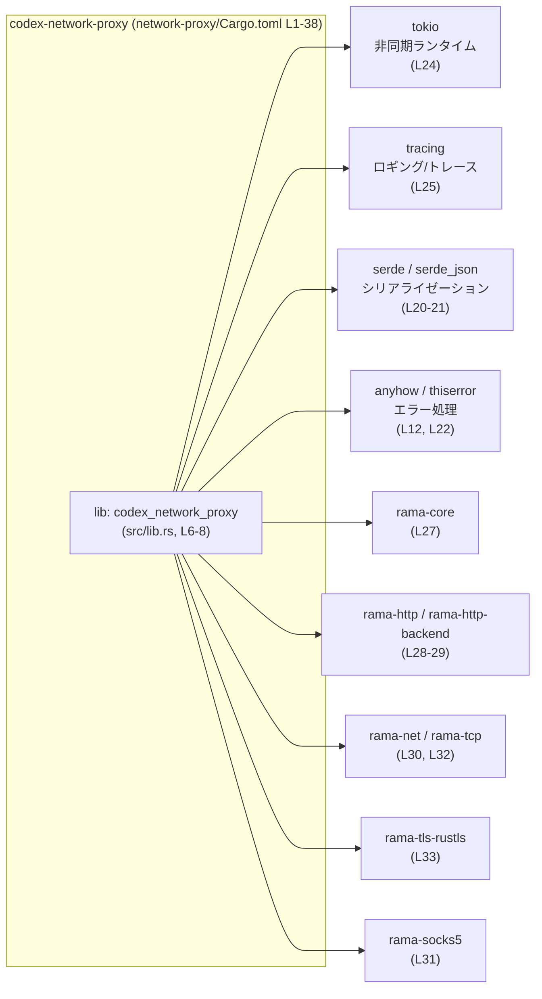
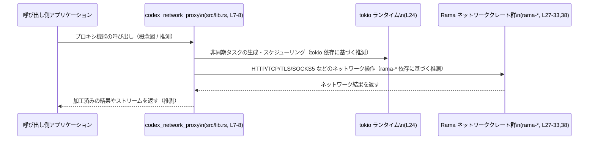

network-proxy/Cargo.toml の解説レポートです。

---

## 0. ざっくり一言

- `codex-network-proxy` というライブラリ crate の **パッケージ情報と依存関係** を定義する Cargo マニフェストです（network-proxy/Cargo.toml:L1-8, L11-38）。
- 実際の公開 API やコアロジックは `src/lib.rs` 側にあり、このチャンクには現れません（network-proxy/Cargo.toml:L7-8）。

---

## 1. このモジュールの役割

### 1.1 概要

- このファイルは、`codex-network-proxy` crate の **ビルド設定と依存グラフ** を定義します（network-proxy/Cargo.toml:L1-8, L11-38）。
- ライブラリターゲット `codex_network_proxy` と、その実装が利用できる外部クレート（Tokio, Serde, Rama 系ネットワーククレートなど）を指定しています（network-proxy/Cargo.toml:L6-8, L11-33, L37-38）。
- edition / version / license / lints / 多くの依存クレートはワークスペース共通設定を参照する構成になっています（network-proxy/Cargo.toml:L3-5, L9-10, L12-26, L34-36）。

### 1.2 アーキテクチャ内での位置づけ

- `codex-network-proxy` はワークスペース内の **ライブラリ crate** として定義されており（network-proxy/Cargo.toml:L1-2, L6-8）、ネットワーク関連の Rama クレート群や Tokio などに依存します（network-proxy/Cargo.toml:L24-33, L37-38）。
- lint 設定や多くの依存クレートのバージョンはワークスペースルート側の Cargo.toml に集約されているため、この crate は「ネットワークプロキシ機能の実装」に集中する位置づけと考えられます。

以下は、**依存関係レベル**での位置づけを示す概念図です（依存情報は network-proxy/Cargo.toml:L11-33, L37-38 に基づきます）。



> 注: 図は「どの crate に依存しているか」の関係のみを表します。**関数呼び出しやデータフローは、このチャンクのコードからは分かりません。**

### 1.3 設計上のポイント（Cargo レベル）

コード（マニフェスト）から読み取れる設計上の特徴は次のとおりです。

- **ワークスペース集中管理**
  - edition / version / license をワークスペースで一元管理（network-proxy/Cargo.toml:L3-5）。
  - lints も `workspace = true` として共通設定を利用（network-proxy/Cargo.toml:L9-10）。
  - 多くの依存クレートも `workspace = true` でバージョンを共有（network-proxy/Cargo.toml:L12-26, L34-36）。
- **ライブラリ crate としての定義**
  - `[lib]` セクションで `codex_network_proxy` という名前のライブラリターゲットを定義し、エントリポイントを `src/lib.rs` に固定（network-proxy/Cargo.toml:L6-8）。
- **ネットワークスタックの構成**
  - `rama-*` 系クレートに対して **厳密なバージョン固定**（`=0.3.0-alpha.4`）を行っており（network-proxy/Cargo.toml:L27-33, L38）、API 互換性を揃える意図が読み取れます。
  - 一部の Rama クレートには `tls` や `http` の機能フラグが有効化されています（network-proxy/Cargo.toml:L29-33）。
- **プラットフォーム依存の追加機能**
  - Unix 系プラットフォームでのみ `rama-unix` に依存する構成になっており（network-proxy/Cargo.toml:L37-38）、Unix 特有の機能（UNIX ソケット等）を利用する可能性があります（利用方法はこのチャンクには現れません）。
- **テスト支援の dev-dependencies**
  - `pretty_assertions` / `tempfile` を dev-dependencies として追加（network-proxy/Cargo.toml:L34-36）。テストコードから利用されることを意図していると考えられますが、テスト自体はこのチャンクには現れません。

---

## 2. 主要な機能一覧（このファイルから分かる範囲）

この Cargo.toml 自体は実行ロジックを持ちませんが、**ビルド構成上の機能**として、次の点が読み取れます。

- ライブラリターゲット `codex_network_proxy` の定義  
  - `[lib]` セクションでライブラリ crate を定義し、`src/lib.rs` をエントリポイントに指定（network-proxy/Cargo.toml:L6-8）。
- Rama ベースのネットワークスタックの利用準備  
  - `rama-core`, `rama-http`, `rama-http-backend`, `rama-net`, `rama-socks5`, `rama-tcp`, `rama-tls-rustls`, `rama-unix` への依存を宣言（network-proxy/Cargo.toml:L27-33, L38）。
- 非同期処理・並行性の基盤  
  - `tokio`（`features = ["full"]`）と `async-trait` への依存により、非同期関数・非同期トレイトを用いた実装を許容する構成（network-proxy/Cargo.toml:L13, L24）。
- エラー処理の基盤  
  - `anyhow` と `thiserror` を依存に含め、エラー集約とカスタムエラー型の定義ができるようになっています（network-proxy/Cargo.toml:L12, L22）。
- シリアライゼーション / 設定 / CLI  
  - `serde` / `serde_json` によるデータシリアライゼーション、`clap` による CLI 引数パース、`chrono` / `time` による日時操作などが可能な構成です（network-proxy/Cargo.toml:L14-15, L20-21, L23）。
- TLS 関連の基盤  
  - `codex-utils-rustls-provider` と `rama-tls-rustls`、`rama-http-backend` の `tls` 機能により、TLS を利用した通信が可能な構成であると読み取れます（network-proxy/Cargo.toml:L18, L29, L33）。
- テストサポート  
  - `pretty_assertions` と `tempfile` を dev-dependencies として追加し、テスト時の表示改善・一時ファイル利用をサポート（network-proxy/Cargo.toml:L34-36）。

> 実際にどの公開 API がこれらの依存クレートをどう利用しているかは、`src/lib.rs` などのソースコードを参照する必要があります。このチャンクには現れません（network-proxy/Cargo.toml:L7-8）。

---

## 3. 公開 API と詳細解説

### 3.1 型一覧（構造体・列挙体など）ではなく「コンポーネント一覧」

このファイルには Rust の型定義は含まれないため、代わりに **ビルドターゲット** と **依存クレート** を「コンポーネント」として一覧化します。

#### 3.1.1 ビルドターゲット

| 名前 | 種別 | 役割 / 用途 | 根拠 |
|------|------|-------------|------|
| `codex-network-proxy` | パッケージ名 | ワークスペース内のこの crate のパッケージ名です。 | network-proxy/Cargo.toml:L1-2 |
| `codex_network_proxy` | ライブラリクレート名 | ビルドされるライブラリターゲットのクレート名です。外部からは `use codex_network_proxy::...` のように利用される想定です。具体的な API はこのチャンクには現れません。 | network-proxy/Cargo.toml:L6-7 |
| `src/lib.rs` | ライブラリエントリポイント | ライブラリターゲットのエントリポイントとなるソースファイルです。実際の公開 API・コアロジックはここに定義されますが、内容はこのチャンクには現れません。 | network-proxy/Cargo.toml:L7-8 |

#### 3.1.2 依存クレート一覧（コンポーネントインベントリー）

> 「用途」の列は、クレート名と一般的な知識に基づく説明です。この Cargo.toml からは、実際にどう使っているかまでは分かりません。

| クレート名 | 種別 | 想定される用途 | 根拠 |
|-----------|------|----------------|------|
| `anyhow` | 通常依存 | エラーの集約と簡易なエラー伝搬用（一般的な用途）。 | network-proxy/Cargo.toml:L12 |
| `async-trait` | 通常依存 | トレイトメソッドに `async fn` を使うための補助（一般的な用途）。 | network-proxy/Cargo.toml:L13 |
| `clap` (`features = ["derive"]`) | 通常依存 | CLI 引数のパース。derive 機能により構造体から CLI を定義する用途が想定されます。 | network-proxy/Cargo.toml:L14 |
| `chrono` | 通常依存 | 日時操作（一般的な用途）。 | network-proxy/Cargo.toml:L15 |
| `codex-utils-absolute-path` | 通常依存 | 絶対パス操作関連のユーティリティと推測されますが、実装はこのチャンクには現れません。 | network-proxy/Cargo.toml:L16 |
| `codex-utils-home-dir` | 通常依存 | ホームディレクトリ関連のユーティリティと推測されますが、実装は不明です。 | network-proxy/Cargo.toml:L17 |
| `codex-utils-rustls-provider` | 通常依存 | Rustls ベースの TLS 設定・証明書情報提供などのユーティリティと推測されます。 | network-proxy/Cargo.toml:L18 |
| `globset` | 通常依存 | パターンマッチング（glob）によるファイルやパスのマッチング。 | network-proxy/Cargo.toml:L19 |
| `serde` (`features = ["derive"]`) | 通常依存 | 構造体などのシリアライゼーション／デシリアライゼーション。 | network-proxy/Cargo.toml:L20 |
| `serde_json` | 通常依存 | JSON 形式でのシリアライゼーション／デシリアライゼーション。 | network-proxy/Cargo.toml:L21 |
| `thiserror` | 通常依存 | カスタムエラー型の derive 実装。 | network-proxy/Cargo.toml:L22 |
| `time` | 通常依存 | 日時・時間操作（`chrono` とは別系統の時間クレート）。 | network-proxy/Cargo.toml:L23 |
| `tokio` (`features = ["full"]`) | 通常依存 | 非同期ランタイム（スレッドプールや非同期 I/O）として利用されることが一般的です。 | network-proxy/Cargo.toml:L24 |
| `tracing` | 通常依存 | 構造化ロギング・トレーシング。 | network-proxy/Cargo.toml:L25 |
| `url` | 通常依存 | URL のパース・生成。 | network-proxy/Cargo.toml:L26 |
| `rama-core` | 通常依存 | Rama ネットワークスタックのコア。ネットワークプロキシ機能の基盤と推測されます。 | network-proxy/Cargo.toml:L27 |
| `rama-http` | 通常依存 | HTTP プロトコル関連機能を提供する Rama クレート。 | network-proxy/Cargo.toml:L28 |
| `rama-http-backend` (`features = ["tls"]`) | 通常依存 | HTTP バックエンド実装（TLS 対応）を提供する Rama クレート。 | network-proxy/Cargo.toml:L29 |
| `rama-net` (`features = ["http", "tls"]`) | 通常依存 | ネットワーク抽象化（HTTP / TLS 機能付き）を提供する Rama クレート。 | network-proxy/Cargo.toml:L30 |
| `rama-socks5` | 通常依存 | SOCKS5 プロキシ機能を提供する Rama クレート。 | network-proxy/Cargo.toml:L31 |
| `rama-tcp` (`features = ["http"]`) | 通常依存 | TCP（および HTTP 絡みの拡張）を扱う Rama クレート。 | network-proxy/Cargo.toml:L32 |
| `rama-tls-rustls` (`features = ["http"]`) | 通常依存 | Rustls ベースの TLS 実装（HTTP 連携機能付き）を提供する Rama クレート。 | network-proxy/Cargo.toml:L33 |
| `pretty_assertions` | dev-dependency | テスト時に差分が見やすいアサーション出力を行うためのクレート。 | network-proxy/Cargo.toml:L34 |
| `tempfile` | dev-dependency | テスト等で一時ファイルを安全に扱うためのクレート。 | network-proxy/Cargo.toml:L35-36 |
| `rama-unix` | ターゲット依存 (`cfg(target_family = "unix")`) | Unix 系システム固有の機能（UNIX ドメインソケットなど）を提供する Rama クレート。 | network-proxy/Cargo.toml:L37-38 |

### 3.2 関数詳細

- このファイルは **Cargo のマニフェスト** であり、Rust の関数・メソッド・型定義は含まれていません。
- 公開 API やコアロジックの関数詳細は、`src/lib.rs` や関連する `.rs` ファイルに実装されていると考えられますが、それらはこのチャンクには現れません（network-proxy/Cargo.toml:L7-8）。

### 3.3 その他の関数

- 上記のとおり、このチャンクには関数定義が存在しないため、「補助的な関数」の一覧も作成できません。

---

## 4. データフロー

この Cargo.toml 自体には処理フローやデータフローのコードは含まれていませんが、**依存関係構成**から推測される典型的な流れを概念図として示します。

> 重要: 以下は **依存クレート名と一般的な用途に基づく概念図** です。実際の処理は `src/lib.rs` などの実装を確認する必要があります（network-proxy/Cargo.toml:L7-8, L11-33, L37-38）。



要点（Cargo レベルで分かる範囲）:

- `tokio` への依存から、**非同期ランタイム上で動作する実装**である可能性が高いです（network-proxy/Cargo.toml:L24）。
- `rama-http` / `rama-tcp` / `rama-tls-rustls` / `rama-socks5` / `rama-net` / `rama-unix` への依存から、HTTP/TCP/TLS/SOCKS5/Unix ソケット等の機能を持つネットワークスタックを利用している構成と読み取れます（network-proxy/Cargo.toml:L27-33, L38）。
- ただし、**どのプロトコルをどのように組み合わせているか**、また **エラー時・タイムアウト時の挙動** などは、このチャンクからは分かりません。

---

## 5. 使い方（How to Use）

### 5.1 基本的な使用方法（別 crate から利用する場合）

`codex-network-proxy` を別の crate から利用する場合の、Cargo レベルでの基本的な使い方を示します。

#### 5.1.1 Cargo.toml 側

`network-proxy/Cargo.toml` がワークスペース内の `network-proxy` ディレクトリにある前提の例です。

```toml
# 別 crate の Cargo.toml 側の例
[dependencies]
codex-network-proxy = { path = "../network-proxy" }  # network-proxy/Cargo.toml を参照
```

> 実際の相対パスはワークスペース構成によって異なります。このチャンクにはワークスペースルートの情報は現れません。

#### 5.1.2 Rust コード側（概念的な例）

公開 API が不明なため、ここでは **クレートをどう導入するか** だけを示します。

```rust
// 別 crate から codex_network_proxy ライブラリを利用する例

use codex_network_proxy; // クレート名は network-proxy/Cargo.toml の [lib] セクションに基づく (L6-7)

#[tokio::main] // tokio 依存 (L24) から、tokio ランタイム上で動作する可能性を想定した例
async fn main() -> anyhow::Result<()> {
    // 実際にどの関数・型を呼び出すかは src/lib.rs の API に依存します。
    // このチャンクにはその情報がないため、具体的な呼び出し例は示せません。

    // 例:
    // let result = codex_network_proxy::some_api(/* ... */).await?;
    // println!("{:?}", result);

    Ok(())
}
```

### 5.2 よくある使用パターン（推測レベル）

依存クレート構成から、次のような使用パターンが **想定** されます（実装は未確認です）。

- **非同期コンテキストでの利用**
  - `tokio` と `async-trait` への依存から、非同期関数や非同期トレイトメソッドを通じてプロキシ機能を提供する可能性があります（network-proxy/Cargo.toml:L13, L24）。
- **設定ファイルや CLI オプションとの連携**
  - `clap`, `serde`, `serde_json`, `codex-utils-home-dir`, `codex-utils-absolute-path` から、CLI + 設定ファイルベースの設定ロードを行う構成が想定されます（network-proxy/Cargo.toml:L14, L16-17, L20-21）。

> これらはクレート名と一般的な用途からの推測であり、実際のコードはこのチャンクには現れません。

### 5.3 よくある間違い（Cargo レベルで起こりうるもの）

この Cargo.toml の構成から、起こりうる誤り・注意点を挙げます。

1. **Rama クレートのバージョン不一致**
   - `rama-*` クレートはすべて `=0.3.0-alpha.4` に固定されています（network-proxy/Cargo.toml:L27-33, L38）。
   - 他の crate から別バージョンの `rama-*` を依存として追加すると、バージョン競合が発生する可能性があります。
2. **Unix 固有機能の誤用**
   - `rama-unix` は `cfg(target_family = "unix")` 条件付きの依存です（network-proxy/Cargo.toml:L37-38）。
   - 実装側で `rama-unix` に依存するコードを、条件付きコンパイルなしに Windows 等でもコンパイルしようとすると、ビルドエラーになる可能性があります。
3. **ワークスペース外からの利用時のバージョン管理**
   - 多くの依存クレートが `workspace = true` となっており（network-proxy/Cargo.toml:L3-5, L12-26, L34-36）、ワークスペース内ではバージョンが統一されています。
   - この crate をワークスペース外に切り出した場合、これらのクレートの具体的なバージョン指定を別途行う必要があります。

### 5.4 使用上の注意点（まとめ）

- **非同期ランタイム前提の可能性**
  - `tokio` に依存しているため（network-proxy/Cargo.toml:L24）、公開 API が `tokio` のランタイム上で実行されることを前提としている可能性があります。
  - 別のランタイム（`async-std` など）との併用時には注意が必要です（ただし、実装はこのチャンクからは不明です）。
- **TLS / セキュリティに関する注意**
  - TLS 周りは `codex-utils-rustls-provider` や `rama-tls-rustls`, `rama-http-backend` の `tls` 機能に依存しています（network-proxy/Cargo.toml:L18, L29, L33）。
  - TLS の検証ポリシーや証明書の扱いなどは、依存クレートと `src/lib.rs` 側の実装に依存しており、このチャンクだけからは安全性を評価できません。
- **alpha バージョンへの依存**
  - `rama-*` が `0.3.0-alpha.4` のように alpha 版で固定されているため（network-proxy/Cargo.toml:L27-33, L38）、API 変更やバグ修正の頻度が高い可能性があります。
  - バージョンアップ時は、Breaking Changes の有無を確認する必要があります。

---

## 6. 変更の仕方（How to Modify）

### 6.1 新しい機能を追加する場合（Cargo.toml 視点）

新しい機能をこの crate に追加する際、Cargo.toml に関して考慮すべき点は次のとおりです。

1. **新しい依存クレートの追加**
   - 既存の依存と同様に、可能であればワークスペース側に依存定義を追加し、`workspace = true` で参照する構成を維持すると、一貫したバージョン管理が行えます（network-proxy/Cargo.toml:L12-26, L34-36 を参考）。
2. **Rama ベースの機能拡張**
   - 追加で必要な Rama クレートや機能フラグがある場合、既存の `rama-*` セットに合わせてバージョンを固定する必要があります（network-proxy/Cargo.toml:L27-33, L38）。
3. **ターゲット依存機能の追加**
   - 新たに Windows 専用機能などを追加する場合、`[target.'cfg(...)'.dependencies]` セクションを追加するパターンが既存の `rama-unix` から読み取れます（network-proxy/Cargo.toml:L37-38）。

### 6.2 既存の機能を変更する場合（Cargo.toml 視点）

1. **ライブラリ名・パスの変更**
   - `[lib]` セクションの `name` や `path` を変更すると、外部からの `use` パスやビルド対象ファイルが変わるため、**利用側のコードとビルド設定に影響** します（network-proxy/Cargo.toml:L6-8）。
2. **依存バージョンの更新**
   - `rama-*` のように `=` で固定されているクレートのバージョンを変更する場合、セットで更新しないとバイナリ互換が崩れる可能性があります（network-proxy/Cargo.toml:L27-33, L38）。
3. **ワークスペース設定の変更**
   - `edition.workspace = true` などの設定（network-proxy/Cargo.toml:L3-5, L9-10, L12-26, L34-36）は、ワークスペースルートの Cargo.toml に依存します。
   - ワークスペース側の設定を変えると、この crate の挙動も影響を受けるため、変更時には関連する全 crate のビルド・テストを確認する必要があります。

---

## 7. 関連ファイル

この Cargo.toml と密接に関係するファイル・ディレクトリを、分かる範囲で列挙します。

| パス / 対象 | 役割 / 関係 | 根拠 |
|------------|------------|------|
| `network-proxy/src/lib.rs` | ライブラリターゲット `codex_network_proxy` のエントリポイント。公開 API やコアロジックが実装されると考えられます。内容はこのチャンクには現れません。 | `path = "src/lib.rs"` の指定（network-proxy/Cargo.toml:L7-8） |
| ワークスペースルートの `Cargo.toml` | `edition.workspace = true`, `version.workspace = true`, `license.workspace = true`, `lints.workspace = true`, 多数の `workspace = true` 依存の実体を定義していると考えられます。 | `*.workspace = true` の設定（network-proxy/Cargo.toml:L3-5, L9-10, L12-26, L34-36） |
| 各依存クレート（`rama-*`, `tokio`, `serde`, など） | この crate が利用可能な API を提供する外部クレート群。ネットワーク、非同期、シリアライゼーション、CLI などの機能の実体です。 | 依存リスト（network-proxy/Cargo.toml:L11-33, L37-38） |

---

### このチャンクから分からないこと（明示）

- `src/lib.rs` 内の **公開 API（関数・構造体・トレイトなど）** の具体的な定義と振る舞い（network-proxy/Cargo.toml:L7-8 から存在のみが分かる）。
- エラー発生時・タイムアウト時・接続失敗時などの **詳細なエラーハンドリング**。
- 並行性制御（`tokio` 上でのタスク分割、スレッド数、キャンセル処理など）の実装。
- TLS 設定（証明書検証ポリシー、信頼ストア構成など）の具体的な安全性。

これらについては、今後 `src/lib.rs` や関連モジュールのコードが提示されれば、より詳細な解説が可能になります。
