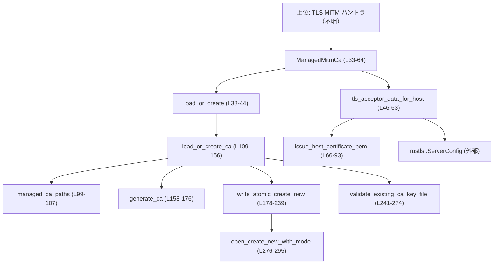
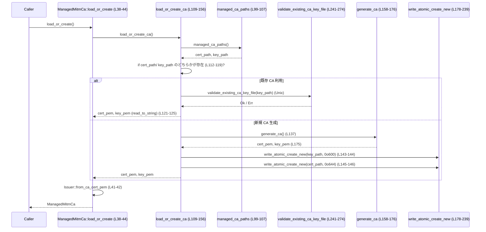

# network-proxy/src/certs.rs コード解説

## 0. ざっくり一言

`network-proxy/src/certs.rs` は、MITM プロキシ用の**自己署名 CA 証明書と、その CA で署名したホスト証明書**を管理・生成し、Rustls 用の `TlsAcceptorData` を構築するモジュールです（`network-proxy/src/certs.rs:L33-63, L109-176`）。

---

## 1. このモジュールの役割

### 1.1 概要

- このモジュールは、**プロキシが TLS MITM を行うための CA とホスト証明書**を管理するために存在し、次の機能を提供します。
  - CODEX_HOME 配下（`proxy/ca.pem`, `proxy/ca.key`）に保存された CA の読み込み／新規生成（`load_or_create_ca`）（`L95-107, L109-156`）。
  - CA からホスト名／IP アドレスごとのサーバー証明書を動的に発行（`issue_host_certificate_pem`）（`L66-93`）。
  - 発行した証明書と鍵から Rustls の `ServerConfig` → `TlsAcceptorData` を構築（`ManagedMitmCa::tls_acceptor_data_for_host`）（`L46-63`）。
  - CA 秘密鍵ファイルの安全なパーミッション／格納保証（`validate_existing_ca_key_file`, `write_atomic_create_new`）（`L241-269, L178-239`）。

### 1.2 アーキテクチャ内での位置づけ

このモジュールは、「ネットワークプロキシの TLS 層」の内部コンポーネントとして動作し、外部クレートとファイルシステムに依存します。

- 外部依存:
  - `codex_utils_home_dir::find_codex_home` により CODEX_HOME ディレクトリを解決（`L4, L99-103`）。
  - `rama_tls_rustls::dep::rcgen` により CA/ホスト証明書と鍵を生成・署名（`L9-19, L66-93, L158-176`）。
  - `rama_tls_rustls::dep::rustls` と `TlsAcceptorData` によりサーバー側 TLS 設定を構築（`L20-21, L52-63`）。
- 内部依存関係を Mermaids で示すと次のようになります：



- 上位コード（このチャンクには現れない）が `ManagedMitmCa` を生成し、TLS ハンドシェイク時に `tls_acceptor_data_for_host` を呼び出す構造と解釈できます（これは命名と処理内容からの解釈であり、具体的な呼び出し元はこのチャンクには現れません）。

### 1.3 設計上のポイント

- **責務分割**
  - `ManagedMitmCa`: CA のロード／生成と、ホストごとの `TlsAcceptorData` 作成という「外向き API」を提供（`L33-64`）。
  - `load_or_create_ca` 系: ファイルパスの決定・CA ファイルの読み込み・新規生成・安全な書き込みを担当（`L95-107, L109-156, L178-239`）。
  - 証明書内容（CA/ホスト）の詳細は `rcgen` パラメータ構築関数に分離（`issue_host_certificate_pem`, `generate_ca`）（`L66-93, L158-176`）。
- **状態管理**
  - ランタイム状態は `ManagedMitmCa` の `issuer: Issuer<'static, KeyPair>` のみで、他はすべて関数ローカル（`L33-35, L38-44`）。
  - グローバルな可変状態や `static mut` はこのチャンクには現れません。
- **エラーハンドリング**
  - 本番コードでは `unwrap` や `expect` を使用せず、すべて `anyhow::Result` と `Context` でエラーを伝播（`L38-239`）。
  - 失敗時にはメッセージにファイルパスや操作内容を含めるよう `with_context` を多用（例: `failed to read CA cert`, `failed to fsync`）（`L121-124, L193-195, L234-236`）。
- **セキュリティ**
  - CA 秘密鍵はパーミッションが厳しく制限された通常ファイルのみ許可（Unix のみ）（`L241-269`）。
  - CA ファイルは `create_new` かつハードリンク／rename を使った、**上書き拒否かつほぼアトミックな書き込み**で生成（`L178-239, L276-295`）。
- **並行性**
  - すべて同期 I/O ベースの関数であり、`async` は使用されていません（`L38-239`）。
  - スレッド安全性 (`Send`, `Sync`) の有無は `Issuer` 型など外部型に依存するため、このチャンクからは不明です。

---

## 2. 主要な機能一覧

- プロキシ用 MITM CA のロード／新規生成 (`ManagedMitmCa::load_or_create`, `load_or_create_ca`)。
- CODEX_HOME 配下への CA 証明書・鍵ファイルの安全な保存 (`write_atomic_create_new`, `validate_existing_ca_key_file`)。
- CA で署名されたホスト証明書と秘密鍵の生成 (`issue_host_certificate_pem`)。
- Rustls の `ServerConfig` と `TlsAcceptorData` の組み立て (`ManagedMitmCa::tls_acceptor_data_for_host`)。

### 2.1 コンポーネントインベントリー（構造体・関数）

| 名前 | 種別 | 役割 / 用途 | 定義位置 |
|------|------|-------------|----------|
| `ManagedMitmCa` | 構造体 | MITM 用 CA の `Issuer` を保持し、上位からのエントリーポイントを提供 | `network-proxy/src/certs.rs:L33-35` |
| `ManagedMitmCa::load_or_create` | 関数（関連関数） | CA ファイルをロードまたは新規生成し、`ManagedMitmCa` を構築 | `network-proxy/src/certs.rs:L38-44` |
| `ManagedMitmCa::tls_acceptor_data_for_host` | メソッド | ホスト名/IP 向け証明書を発行し、`TlsAcceptorData` を返す | `network-proxy/src/certs.rs:L46-63` |
| `issue_host_certificate_pem` | 関数 | あるホストのサーバー証明書＋鍵を PEM 文字列として生成 | `network-proxy/src/certs.rs:L66-93` |
| `managed_ca_paths` | 関数 | CODEX_HOME から CA 証明書・鍵ファイルのパスを求める | `network-proxy/src/certs.rs:L95-107` |
| `load_or_create_ca` | 関数 | 既存 CA の読み込み／新規 CA の生成・保存を統合 | `network-proxy/src/certs.rs:L109-156` |
| `generate_ca` | 関数 | 自己署名 CA 証明書と鍵を生成し、PEM 文字列を返す | `network-proxy/src/certs.rs:L158-176` |
| `write_atomic_create_new` | 関数 | 既存ファイルを絶対に上書きせずに、安全にファイルを書き出す | `network-proxy/src/certs.rs:L178-239` |
| `validate_existing_ca_key_file` (Unix) | 関数 | 既存 CA 秘密鍵ファイルの種別とパーミッションを検証 | `network-proxy/src/certs.rs:L241-269` |
| `validate_existing_ca_key_file` (非 Unix) | 関数 | ダミー実装（常に `Ok(())` を返す） | `network-proxy/src/certs.rs:L271-274` |
| `open_create_new_with_mode` (Unix) | 関数 | 指定モード・create_new でファイルを作成 | `network-proxy/src/certs.rs:L276-286` |
| `open_create_new_with_mode` (非 Unix) | 関数 | モードは無視しつつ create_new でファイルを作成 | `network-proxy/src/certs.rs:L288-295` |
| `validate_existing_ca_key_file_rejects_group_world_permissions` | テスト関数 | グループ／その他に権限がある鍵ファイルを拒否することを検証 | `network-proxy/src/certs.rs:L305-316` |
| `validate_existing_ca_key_file_rejects_symlink` | テスト関数 | symlink を CA 鍵として拒否することを検証 | `network-proxy/src/certs.rs:L318-333` |
| `validate_existing_ca_key_file_allows_private_permissions` | テスト関数 | `0o600` の鍵ファイルが許可されることを検証 | `network-proxy/src/certs.rs:L335-343` |

---

## 3. 公開 API と詳細解説

`pub(super)` なので「クレート全体の公開 API」ではありませんが、このモジュール外から直接呼ばれる可能性が高いのは `ManagedMitmCa` の 2 関数です（`L37-44, L46-63`）。

### 3.1 型一覧（構造体・列挙体など）

| 名前 | 種別 | 役割 / 用途 | 主なフィールド | 定義位置 |
|------|------|-------------|----------------|----------|
| `ManagedMitmCa` | 構造体 | CA 証明書・鍵から構築された `Issuer` を保持し、ホスト証明書発行と TLS 設定生成を行う | `issuer: Issuer<'static, KeyPair>` – CA 情報を保持 | `network-proxy/src/certs.rs:L33-35` |

---

### 3.2 関数詳細（最大 7 件）

#### `ManagedMitmCa::load_or_create() -> Result<ManagedMitmCa>`

**概要**

- CODEX_HOME 配下の CA 証明書・鍵ファイルを読み込むか、存在しなければ生成し、その CA から `Issuer` を構築して `ManagedMitmCa` を返します（`L38-44`）。

**引数**

- なし。

**戻り値**

- `Result<ManagedMitmCa>`: 正常時は `issuer` が初期化された `ManagedMitmCa`。失敗時は `anyhow::Error`。

**内部処理の流れ**

1. `load_or_create_ca()` を呼び出し、CA 証明書と鍵の PEM 文字列を取得（`L39, L109-156`）。
2. `KeyPair::from_pem(&ca_key_pem)` で秘密鍵 PEM を `rcgen::KeyPair` にパース（`L40`）。
3. `Issuer::from_ca_cert_pem(&ca_cert_pem, ca_key)` で CA 証明書と鍵から `Issuer` を構築（`L41-42`）。
4. 上記 `Issuer` をフィールドに設定した `ManagedMitmCa` を返す（`L43`）。

**Examples（使用例）**

```rust
// MITM CA を初期化し、後続の接続処理で使う例
use anyhow::Result;

fn init_mitm_ca() -> Result<()> {
    // CA のロードまたは生成
    let ca = ManagedMitmCa::load_or_create()?; // 失敗時は anyhow::Error が返る

    // 以降、ca を共有して各ホストの TLS 設定を作る（例: ca.tls_acceptor_data_for_host）
    println!("CA initialized"); // 実際にはここで構造体をどこかに保持する

    Ok(())
}
```

**Errors / Panics**

- `load_or_create_ca` がエラーを返した場合（パス解決失敗、ファイル I/O 失敗、パーミッション不正など）（`L109-156`）。
- `KeyPair::from_pem` が PEM 鍵をパースできない場合（`L40`）。
- `Issuer::from_ca_cert_pem` が PEM 証明書をパースできない場合、または証明書と鍵が一致しないなどの理由で失敗した場合（`L41-42`）。
- 本番コードに `panic!` はありません（この関数内および呼び先は `Result` ベース、`L38-44, L109-239`）。

**Edge cases（エッジケース）**

- 既存の CA ファイルの片方しか存在しない場合は即エラー（`load_or_create_ca` 内で検出、`L112-119`）。
- CA ファイルが破損している／別の形式の PEM の場合、パースエラーとして失敗（`L40-42`）。

**使用上の注意点**

- 初回起動時には CA 生成とファイル書き込みが走るため、ディスク I/O による遅延が発生します（`L128-156, L178-239`）。
- `ManagedMitmCa` が作成された時点で CA は固定されるので、途中で CA ファイルを差し替えても既存インスタンスには反映されません（コードからの事実: 再読み込みロジックはこのチャンクには現れません）。

---

#### `ManagedMitmCa::tls_acceptor_data_for_host(&self, host: &str) -> Result<TlsAcceptorData>`

**概要**

- 指定したホスト名または IP アドレス用のサーバー証明書・秘密鍵を CA で署名し、Rustls の `ServerConfig` を構築して `TlsAcceptorData` に変換します（`L46-63`）。

**引数**

| 引数名 | 型 | 説明 |
|--------|----|------|
| `self` | `&ManagedMitmCa` | 事前に初期化された CA 発行者 (`Issuer`) を含むインスタンス |
| `host` | `&str` | サーバー証明書の SAN または CN に使うホスト名／IP アドレス |

**戻り値**

- `Result<TlsAcceptorData>`: 正常時は、HTTP/2 & HTTP/1.1 の ALPN を設定済みの `TlsAcceptorData`。失敗時は `anyhow::Error`。

**内部処理の流れ**

1. `issue_host_certificate_pem(host, &self.issuer)` でホスト用の証明書・鍵（PEM）を生成（`L47, L66-93`）。
2. `CertificateDer::from_pem_slice` で証明書 PEM を `CertificateDer` にパース（`L48-49`）。
3. `PrivateKeyDer::from_pem_slice` で鍵 PEM を `PrivateKeyDer` にパース（`L50-51`）。
4. `rustls::ServerConfig::builder_with_protocol_versions(rustls::ALL_VERSIONS)` からビルダを取得し、クライアント認証なし・単一証明書でサーバー設定を構築（`L52-56`）。
5. ALPN プロトコルに HTTP/2 と HTTP/1.1 を登録（`L57-60`）。
6. `TlsAcceptorData::from(server_config)` で受け入れ側 TLS データに変換し、返却（`L62`）。

**Examples（使用例）**

```rust
// あるホスト向けに TLS アクセプタを作る例
use anyhow::Result;
use rama_tls_rustls::server::TlsAcceptorData;

fn build_acceptor_for_host(ca: &ManagedMitmCa, host: &str) -> Result<TlsAcceptorData> {
    // ホスト用の TLS 証明書と鍵を生成し、Rustls 設定を構築
    let acceptor = ca.tls_acceptor_data_for_host(host)?; // ここで証明書が動的に発行される

    Ok(acceptor)
}
```

**Errors / Panics**

- `issue_host_certificate_pem` 内でのパラメータ生成・鍵生成・署名失敗（`L66-93`）。
- `CertificateDer::from_pem_slice` / `PrivateKeyDer::from_pem_slice` が PEM のパースに失敗した場合（`L48-51`）。
- Rustls の `with_single_cert` が失敗した場合（証明書と鍵の組み合わせが不正など）（`L52-56`）。

**Edge cases**

- `host` が IP アドレス形式として `IpAddr` にパース可能な場合、SAN に IP アドレスが入る証明書になります（`L70-74`）。
- `host` が空文字列や特殊な文字列の場合の挙動は、`rcgen::CertificateParams::new` に委ねられており、このチャンクからは詳細不明です（`L76-78`）。

**使用上の注意点**

- この関数は証明書生成と署名を毎回行うため、CPU コストがかかります（`KeyPair::generate_for`, `signed_by` 呼び出し、`L86-90`）。高頻度で呼ぶ場合はキャッシュ戦略が必要になる可能性があります（キャッシュの実装はこのチャンクには現れません）。
- `rustls::ALL_VERSIONS` に含まれる TLS バージョンは外部ライブラリに依存し、このチャンクからは具体的なバージョンは不明です（`L52-53`）。

---

#### `issue_host_certificate_pem(host: &str, issuer: &Issuer<'_, KeyPair>) -> Result<(String, String)>`

**概要**

- 1 ホスト（DNS 名または IP）向けのサーバー証明書と秘密鍵を生成し、PEM 文字列のタプルとして返します（`L66-93`）。

**引数**

| 引数名 | 型 | 説明 |
|--------|----|------|
| `host` | `&str` | 対象ホスト名または IP アドレス文字列 |
| `issuer` | `&Issuer<'_, KeyPair>` | 署名に使用する CA 発行者 |

**戻り値**

- `Result<(String, String)>`: `(cert_pem, key_pem)` のタプル。どちらも PEM 形式の文字列。

**内部処理の流れ**

1. `host.parse::<IpAddr>()` を試み、成功すれば IP アドレス用の `CertificateParams::new(Vec::new())` を作成し、SAN に `SanType::IpAddress(ip)` を追加（`L70-74`）。
2. IP でない場合は `CertificateParams::new(vec![host.to_string()])` を使い、ホスト名をもとにパラメータを生成（`L75-78`）。
3. `extended_key_usages` に `ServerAuth` を設定（`L80`）。
4. `key_usages` に `DigitalSignature` と `KeyEncipherment` を設定（`L81-84`）。
5. `KeyPair::generate_for(&PKCS_ECDSA_P256_SHA256)` でホスト用の鍵ペアを生成（`L86-87`）。
6. `params.signed_by(&key_pair, issuer)` で CA により証明書を署名（`L88-90`）。
7. `cert.pem()` と `key_pair.serialize_pem()` を返す（`L92`）。

**Errors / Panics**

- `CertificateParams::new` の失敗（引数が不正など）（`L71-72, L76-78`）。
- `KeyPair::generate_for` の失敗（`L86-87`）。
- `signed_by` の失敗（`L88-90`）。

**Edge cases**

- `host` が非常に長い場合や RFC に適合しない場合の扱いは `rcgen` に依存しており、このチャンクには詳細が現れません。
- `host` が数値だが `IpAddr` として無効な場合（例: 異常形式）は IP 分岐が失敗し、DNS 名として扱われます（`L70-78`）。

**使用上の注意点**

- この関数は CA 鍵を用いて実際に署名を行うため、`issuer` は秘密鍵を保持している必要があります（`Issuer` の仕様は外部ですが、署名 API の呼び出しから推測できます、`L88-90`）。
- 生成される鍵は ECDSA P-256 + SHA-256 固定であり、アルゴリズムを変えるには `PKCS_ECDSA_P256_SHA256` の差し替えが必要になります（`L18, L86`）。

---

#### `load_or_create_ca() -> Result<(String, String)>`

**概要**

- CODEX_HOME 配下の CA 証明書・鍵ファイルパスを決定し、既存ファイルがあれば読み込み、なければ新しい CA を生成して安全に保存したうえで PEM 文字列を返します（`L95-107, L109-156`）。

**引数・戻り値**

- 引数なし。
- 戻り値: `Result<(String, String)>` = `(cert_pem, key_pem)`。

**内部処理の流れ**

1. `managed_ca_paths()` で `cert_path`, `key_path` を取得（`L109-111, L99-107`）。
2. いずれかのファイルが存在する場合:
   - 片方のみ存在ならエラー（`L112-119`）。
   - `validate_existing_ca_key_file(&key_path)` で秘密鍵ファイルを検証（Unix のみ、`L120, L241-269`）。
   - `fs::read_to_string` で 両ファイルを読み込み、PEM 文字列を返す（`L121-125`）。
3. どちらも存在しない場合:
   - `cert_path` と `key_path` の親ディレクトリを `create_dir_all` で作成（`L128-135`）。
   - `generate_ca()` で新しい CA 証明書と鍵を生成（`L137, L158-176`）。
   - `write_atomic_create_new(&key_path, ..., 0o600)` で鍵を作成（`L143-144, L178-239`）。
   - `write_atomic_create_new(&cert_path, ..., 0o644)` で証明書を作成（`L145-146`）。
   - 証明書ファイルの書き込みに失敗した場合は鍵ファイルを削除（`L148-150`）。
   - 生成完了を `info!` ログで通知（`L152-154`）。
   - PEM 文字列を返す（`L155`）。

**Errors / Panics**

- CODEX_HOME 解決失敗 (`find_codex_home` のエラー)（`L99-103`）。
- CA 片側のみ存在時の整合性エラー（`L112-119`）。
- Unix で、鍵ファイルが symlink・非 regular file・過度に緩いパーミッションである場合（`validate_existing_ca_key_file`, `L241-269`）。
- ディレクトリ作成、ファイル作成・書き込み・fsync・ハードリンク・rename・ディレクトリ fsync のいずれかの失敗（`L128-135, L143-147, L178-239`）。
- この関数も `panic` は使っていません。

**Edge cases**

- 既存 CA がある場合でも、証明書と鍵の内容整合性までは検証していません（PEM を読み込むだけ）（`L121-125`）。
- 非 Unix 環境では `validate_existing_ca_key_file` が no-op のため、パーミッションや symlink 不正は検査されません（`L271-274`）。

**使用上の注意点**

- CA ファイルが既に存在する環境で誤って鍵ファイルのみ削除すると、「両方存在しなければならない」というエラーになります（`L112-119`）。
- CA ファイルの再生成は既存の信頼チェーンを無効化するため、この関数は既存ファイルを**決して上書きしない**よう設計されています（`write_atomic_create_new` の `create_new` とエラーメッセージ、`L178-239`）。

---

#### `generate_ca() -> Result<(String, String)>`

**概要**

- 自己署名の CA 証明書と秘密鍵を `rcgen` で生成し、PEM 文字列として返します（`L158-176`）。

**内部処理の流れ**

1. `CertificateParams::default()` で CA 用パラメータを初期化（`L159`）。
2. `params.is_ca = IsCa::Ca(BasicConstraints::Unconstrained)` で CA として設定（`L160`）。
3. `key_usages` に `KeyCertSign`, `DigitalSignature`, `KeyEncipherment` を設定（`L161-165`）。
4. `DistinguishedName::new()` を作り、`CommonName` に `"network_proxy MITM CA"` を追加（`L166-168`）。
5. `KeyPair::generate_for(&PKCS_ECDSA_P256_SHA256)` で CA 用鍵ペアを生成（`L170-171`）。
6. `params.self_signed(&key_pair)` で自己署名証明書を生成（`L172-174`）。
7. PEM 文字列のペアとして返却（`L175`）。

**使用上の注意点**

- CA の subject は固定文字列 `"network_proxy MITM CA"` です。別の識別名にしたい場合、この関数を変更することになります（`L167`）。
- 鍵アルゴリズムは ECDSA P-256 + SHA-256 固定です（`L18, L170`）。

---

#### `write_atomic_create_new(path: &Path, contents: &[u8], mode: u32) -> Result<()>`

**概要**

- 指定したパスに対し、**既存ファイルを上書きせず**、一時ファイルからのハードリンク/rename によって安全に内容を書き出すヘルパーです（`L178-239`）。

**引数**

| 引数名 | 型 | 説明 |
|--------|----|------|
| `path` | `&Path` | 最終的なファイルパス |
| `contents` | `&[u8]` | 書き込むバイト列 |
| `mode` | `u32` | Unix の場合のファイルモード（例: `0o600`） |

**戻り値**

- `Result<()>`: 正常完了または `anyhow::Error`。

**内部処理の流れ**

1. `path.parent()` を取得し、なければエラー（`missing parent directory`）（`L179-181`）。
2. `SystemTime::now().duration_since(UNIX_EPOCH).unwrap_or_default().as_nanos()` と `std::process::id()`、元ファイル名から一時ファイル名を生成（`L183-189`）。
3. `open_create_new_with_mode(&tmp_path, mode)` で一時ファイルを作成（`L191, L276-295`）。
4. `file.write_all(contents)` と `file.sync_all()` で内容を書き込み、ディスクに同期（`L192-195`）。
5. `fs::hard_link(&tmp_path, path)` を試みる（`L200`）。
   - 成功時: 一時ファイルを削除（`L201-203`）。
   - `AlreadyExists` エラー時: 一時ファイルを削除し、「既存ファイルを上書きしない」としてエラー（`L205-211`）。
   - その他のエラー時: 非 Unix などハードリンク不能環境として扱い、`path.exists()` を確認。存在すれば上書き拒否エラー、存在しなければ `fs::rename(&tmp_path, path)` で移動（`L212-229`）。
6. 親ディレクトリを `File::open` し `sync_all` でディレクトリエントリもフラッシュ（`L233-236`）。

**Errors / Panics**

- 親ディレクトリが存在しない場合（`L179-181`）。
- 一時ファイルの作成・書き込み・fsync 失敗（`L191-195`）。
- ハードリンク／rename 失敗、ディレクトリ fsync 失敗（`L200-229, L234-236`）。

**Edge cases**

- システム時刻が UNIX_EPOCH 前の場合、`duration_since` のエラーを `unwrap_or_default` で 0 にフォールバックするため、一時ファイル名の `nanos` は 0 になる可能性があります（`L183-186`）。PID とファイル名も含まれるため、同一プロセス・同一パスでの衝突は非常に限定的です。
- ハードリンクがサポートされないファイルシステムでは rename フォールバックを使用しますが、このケースにはコメントで TOCTOU リスクが残ると明記されています（`L212-215`）。

**使用上の注意点**

- `mode` は Unix でのみ効力を持ちます。Windows 等では `_mode` は無視されます（`open_create_new_with_mode` 非 Unix 実装、`L288-295`）。
- 既存ファイルがある場合は必ずエラーになるため、「上書き」の用途には向きません（`refusing to overwrite existing file`, `L205-211, L216-221`）。

---

#### `validate_existing_ca_key_file(path: &Path) -> Result<()>`（Unix 版）

**概要**

- 既存の CA 秘密鍵ファイルが安全に扱えるかを検証します。Unix でのみ実装されており、非 Unix では no-op です（`L241-269, L271-274`）。

**内部処理の流れ（Unix）**

1. `fs::symlink_metadata(path)` でメタデータを取得（`L245-246`）。
2. `file_type().is_symlink()` なら、「symlink は拒否」としてエラー（`L247-251`）。
3. `!metadata.is_file()` なら「通常ファイルでない」としてエラー（`L253-257`）。
4. `permissions().mode() & 0o777` でモードを取り出し、`mode & 0o077 != 0`（group/other に何らかのビットが立っている）場合は、「group/world accessible」としてエラー（`L260-266`）。
5. 上記に該当しない場合は `Ok(())` を返す（`L268`）。

**使用上の注意点**

- **最小権限の原則**: 鍵ファイルは少なくとも `0o600` 以下（所有者のみ読み書き可能）である必要があります（`L260-266`）。
- 非 Unix ではこのチェックが行われないため、OS 依存の別メカニズム（ACLなど）に頼る設計になっています（`L271-274`）。

---

### 3.3 その他の関数

| 関数名 | 役割（1 行） | 定義位置 |
|--------|--------------|----------|
| `managed_ca_paths` | CODEX_HOME と固定サブパス `"proxy/ca.pem"`, `"proxy/ca.key"` から CA ファイルのパスを組み立てる | `network-proxy/src/certs.rs:L99-107` |
| `open_create_new_with_mode` (Unix) | 指定モードで `OpenOptions::create_new(true).write(true)` によりファイルを作成する | `network-proxy/src/certs.rs:L276-286` |
| `open_create_new_with_mode` (非 Unix) | モード無視で `create_new` によりファイルを作成する簡易版 | `network-proxy/src/certs.rs:L288-295` |
| `validate_existing_ca_key_file` (非 Unix) | 常に `Ok(())` を返すスタブ実装 | `network-proxy/src/certs.rs:L271-274` |

---

## 4. データフロー

ここでは、**CA のロード／生成から `ManagedMitmCa` の構築まで**のデータフローを示します。

1. 上位コードが `ManagedMitmCa::load_or_create()` を呼び出す（`L38-44`）。
2. `load_or_create_ca()` が CA ファイルのパスを決定し、既存の PEM を読み込むか、新規に `generate_ca()` で生成・保存（`L99-107, L109-156, L158-176, L178-239`）。
3. PEM 文字列から `KeyPair` と `Issuer` を構築し、`ManagedMitmCa` インスタンスが完成（`L40-43`）。

Mermaid のシーケンス図は次の通りです（行番号付き）。



同様に、TLS ハンドシェイク時には次のフローになります。

- Caller → `ManagedMitmCa::tls_acceptor_data_for_host` → `issue_host_certificate_pem` → `rcgen` による署名 → Rustls `ServerConfig` 構築 → `TlsAcceptorData`（`L46-63, L66-93`）。

---

## 5. 使い方（How to Use）

### 5.1 基本的な使用方法

プロキシ起動時に CA を初期化し、各接続ごとにホスト名を渡して `TlsAcceptorData` を作る、というパターンが想定されます（呼び出し元はこのチャンクには現れませんが、関数設計からの解釈です）。

```rust
use anyhow::Result;
use network_proxy::certs::ManagedMitmCa; // 実際のパスはこのチャンクには現れません
use rama_tls_rustls::server::TlsAcceptorData;

fn init_mitm() -> Result<ManagedMitmCa> {
    // 起動時に CA をロードまたは生成する
    let ca = ManagedMitmCa::load_or_create()?; // network-proxy/src/certs.rs:L38-44
    Ok(ca)
}

fn build_acceptor(ca: &ManagedMitmCa, host: &str) -> Result<TlsAcceptorData> {
    // 各ホスト用の TLS アクセプタを生成する
    let acceptor = ca.tls_acceptor_data_for_host(host)?; // L46-63
    Ok(acceptor)
}
```

### 5.2 よくある使用パターン

- **単一 CA を共有し、複数ホストに対して証明書を動的発行**
  - `ManagedMitmCa` を 1 度だけ `load_or_create` し、その参照をワーカーや接続ハンドラに配布。
  - 各接続ごとに `tls_acceptor_data_for_host` を呼び出して、SNI または接続先ホスト名に対応する証明書を発行。

- **IP ベースの接続**
  - `host` に IP アドレス文字列（例: `"192.0.2.1"`）を渡すと、SAN に IP アドレスを持つ証明書が生成されます（`L70-74`）。

### 5.3 よくある間違い

```rust
// 間違い例: CA 初期化に失敗しても無視して進めてしまう
fn bad_init() {
    let ca = ManagedMitmCa::load_or_create(); // Result を無視
    // ここで unwrap などすると、エラー内容が失われがち
}

// 正しい例: Result を適切に扱い、エラー内容をログに残す
use anyhow::Result;

fn good_init() -> Result<ManagedMitmCa> {
    let ca = ManagedMitmCa::load_or_create()?; // エラー時は呼び出し元に伝播
    Ok(ca)
}
```

```rust
// 間違い例: CA ファイルを手動操作して cert のみ、または key のみ残す
// → 起動時に "both managed MITM CA files must exist" エラー（L112-119）

// 正しい例: 既存 CA を捨てたい場合は両方のファイルを削除し、
//           次回起動時に自動生成させる（L128-156）。
```

### 5.4 使用上の注意点（まとめ）

- **セキュリティ**
  - CA 秘密鍵ファイルのパーミッションと種別は Unix では厳しくチェックされます（symlink や group/world readable は拒否）（`L245-266`）。
  - 非 Unix 環境ではこうしたチェックは行われないため、OS のアクセス制御に依存します（`L271-274`）。
  - MITM CA を生成し利用すること自体がセキュリティ的に重大な意味を持つため、運用環境への導入には法的・倫理的な検討が必要です（一般論であり、コードから直接は読み取れません）。

- **エラー処理**
  - すべてのエラーは `anyhow::Error` として返され、詳細メッセージにはパスや操作名が含まれます（`L99-103, L121-124, L193-195, L234-236`）。
  - 本番コードには `unwrap` はなく、パニック要因はテストコードのみに限定されています（`L305-343`）。

- **並行性・パフォーマンス**
  - 証明書生成 (`generate_ca`, `issue_host_certificate_pem`) は CPU 負荷が高く、ファイル書き込みは同期 I/O です（`L86-90, L170-175, L178-239`）。
  - 多数の接続で `tls_acceptor_data_for_host` を高頻度に呼び出すとレイテンシに影響する可能性がありますが、キャッシュや再利用の仕組みはこのチャンクには現れません。

---

## 6. 変更の仕方（How to Modify）

### 6.1 新しい機能を追加する場合

例として、「CA の保存場所を変更したい」「CA の subject 名を環境変数で変えたい」などを考えます。

- **CA ファイルパスを変えたい**
  - 変更箇所: `MANAGED_MITM_CA_DIR`, `MANAGED_MITM_CA_CERT`, `MANAGED_MITM_CA_KEY`、および `managed_ca_paths`（`L95-107`）。
  - 影響: 既存環境との互換性（古い場所にあった CA を読まなくなる）に注意が必要です。

- **CA の subject（CN）や KeyUsage をカスタマイズしたい**
  - 変更箇所: `generate_ca` 内の `DistinguishedName` と `key_usages`（`L161-168`）。
  - 追加の KeyUsage などを設定する場合は、CA としての意味を確認する必要があります。

- **ホスト証明書に追加の Extended Key Usage や SAN を持たせたい**
  - 変更箇所: `issue_host_certificate_pem` 内の `params.extended_key_usages` や `subject_alt_names` の編集部分（`L70-84`）。
  - 例: クライアント認証も行う場合は `ExtendedKeyUsagePurpose::ClientAuth` を追加するなど。

### 6.2 既存の機能を変更する場合

- **鍵のパーミッションポリシーを緩和/強化する**
  - 変更箇所: `validate_existing_ca_key_file`（`L241-269`）。
  - 影響範囲: Unix のみ。テスト (`validate_existing_ca_key_file_*` シリーズ) も併せて修正する必要があります（`L305-343`）。

- **ファイル書き込みの原子性を変えたい**
  - 変更箇所: `write_atomic_create_new`（`L178-239`）と `open_create_new_with_mode`（`L276-295`）。
  - 「上書き可能」に変えると、CA の再生成による信頼チェーン破壊リスクが増すため、契約の変更になります。

- **エラー文言・ロギングを変えたい**
  - エラー文言は `anyhow!` および `with_context` の文字列に集中しています（例: `L114-118, L193-195`）。
  - ログ出力は CA 生成時の `info!` のみ（`L152-154`）です。追加のログを入れる場合、このパターンに合わせると一貫性が保てます。

---

## 7. 関連ファイル

このモジュールに関連する外部ファイル／クレートは次の通りです（パスが不明なものは「不明」と明記します）。

| パス / クレート | 役割 / 関係 |
|-----------------|------------|
| `codex_utils_home_dir` クレート（`find_codex_home`） | CODEX_HOME を解決し、本モジュールの CA 保存ディレクトリの基点を提供します（`network-proxy/src/certs.rs:L4, L99-103`）。 |
| `rama_tls_rustls::dep::rcgen` | CA/ホスト証明書パラメータ生成・鍵生成・署名など PKI 関連の機能を提供します（`L9-19, L66-93, L158-176`）。 |
| `rama_tls_rustls::dep::pki_types` | Rustls 向け証明書・鍵型（`CertificateDer`, `PrivateKeyDer`）や PEM 入出力を提供します（`L6-8, L48-51`）。 |
| `rama_tls_rustls::server::TlsAcceptorData` | Rustls サーバー設定をラップする型で、本モジュールの最終的な出力です（`L21, L46-63`）。 |
| （上位モジュール）`network-proxy` の TLS ハンドラ | `ManagedMitmCa` を生成し `tls_acceptor_data_for_host` を呼び出す側ですが、このチャンクには現れません。 |

この説明は、提供された `network-proxy/src/certs.rs` の内容（`L1-343`）に基づいており、それ以外のファイルやコードについては「不明」としています。
