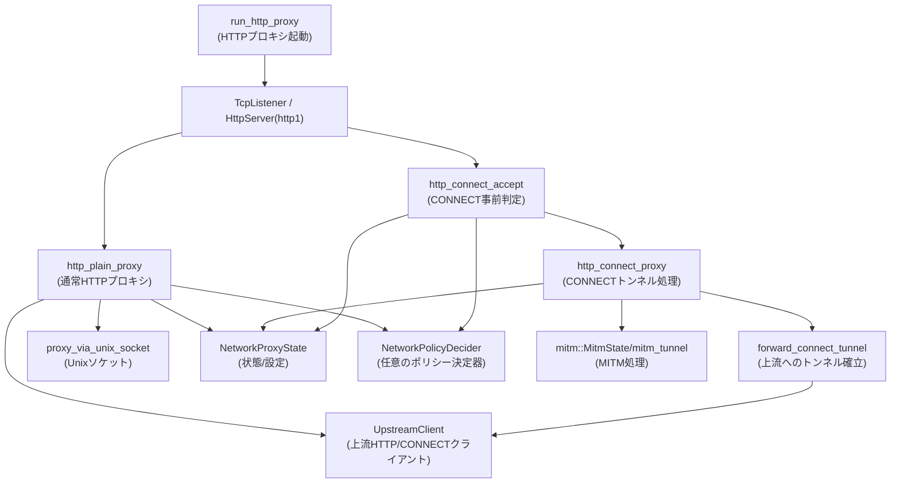
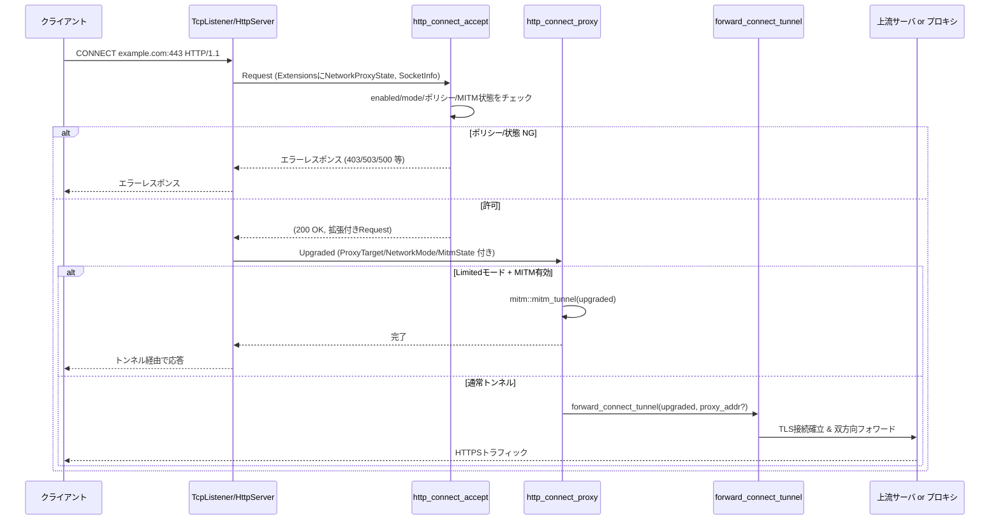
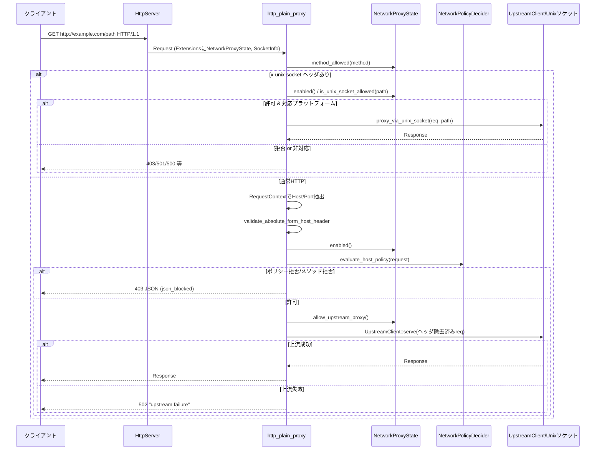

# network-proxy/src/http_proxy.rs

## 0. ざっくり一言

HTTP/HTTPS プロキシサーバを Rama フレームワーク上で提供し、  
ネットワークポリシー（ドメイン許可/拒否・メソッド制限・モード/有効フラグ）や MITM、Unix ソケット経由のローカル通信を統合的に制御するモジュールです。

> ※このファイル断片には行番号情報が含まれていないため、以下では「定義位置」はファイル名までにとどめ、正確な `L開始-終了` は付与できません。

---

## 1. このモジュールの役割

### 1.1 概要

- HTTP/1 ベースの **フォワードプロキシ**（CONNECT/absolute-form）を実装します。
- 各リクエストについて以下を行います。
  - プロキシの有効/無効状態と **ネットワークモード（Full / Limited）** の確認
  - ドメイン・ポート・HTTP メソッドに対する **ネットワークポリシー評価**（許可/拒否）
  - 必要に応じた **MITM トンネル** または通常のトンネル/HTTP 転送
  - `x-unix-socket` ヘッダによる Unix ドメインソケットへの制限つきフォワード
  - ブロック時の **監査イベント送信** と、JSON/テキスト形式のエラーレスポンス生成

### 1.2 アーキテクチャ内での位置づけ

主要コンポーネントと依存関係（高レベル）は次のようになっています。



- `run_http_proxy` / `run_http_proxy_with_std_listener` がプロキシサーバの公開エントリポイントです。
- Rama の `HttpServer::http1()` に対して CONNECT 用 (`http_connect_accept`/`http_connect_proxy`) と通常 HTTP 用 (`http_plain_proxy`) のサービスを組み合わせています。
- ポリシーや状態は `Arc<NetworkProxyState>` を Rama の拡張 (`Extensions`) として各リクエストに渡します。
- 上流接続は `UpstreamClient` / `TcpConnector` / `TlsConnectorLayer` を組み合わせて行います。

### 1.3 設計上のポイント

- **責務分割**
  - リスナ起動 (`run_http_proxy*`) とリクエスト処理 (`http_connect_*`, `http_plain_proxy`) を分離。
  - CONNECT トンネルの確立・フォワードを `forward_connect_tunnel` に切り出し。
  - Unix ソケット経由のフォワードは `proxy_via_unix_socket` に分離。
  - ブロック時レスポンス生成 (`json_blocked`, `proxy_disabled_response`) とヘッダ除去 (`remove_hop_by_hop_request_headers`) もヘルパに分離。
- **状態管理**
  - 共有状態は `Arc<NetworkProxyState>` で表現し、Rama の `Extensions` に格納して各処理に引き渡します。
  - 各種設定チェック (`enabled`, `network_mode`, `allow_upstream_proxy`, `is_unix_socket_allowed`, `method_allowed`, `mitm_state`) は `async` メソッドで行われ、非同期に更新可能な設計です。
- **エラーハンドリング**
  - リスナ起動部は `anyhow::Result<()>` を返し、Rama の `BoxError` を `OpaqueError` でラップしてエラー連鎖を保ちつつ `anyhow` に統合。
  - リクエスト処理は「**正常時は許可、それ以外は HTTP レスポンスでブロック**」という方針で、
    - `Result<(Response, Request), Response>`（CONNECT 受付）
    - `Result<Response, Infallible>`（通常 HTTP）
    を使い分けています。
- **安全性（セキュリティ）**
  - Limited モードで MITM が無効な場合は CONNECT を拒否し、HTTPS 経由のメソッドポリシー回避を防止。
  - 絶対 URI での Host ヘッダ不整合を `validate_absolute_form_host_header` で検知・拒否。
  - `x-unix-socket` は macOS かつ明示的な許可リスト・メソッド制限下でのみ許可。
  - 上流プロキシ利用（環境変数経由など）は `allow_upstream_proxy()` 設定で明示的に制御。
- **並行性**
  - すべて `async fn` で記述され、I/O は非同期。
  - 共有状態は `Arc` 経由でのみ参照されるため、所有権の衝突はなく、スレッド間共有も Rust の型システムで安全に制御されています（内部の実装は別モジュール）。

---

## 2. 主要な機能一覧

- HTTP プロキシリスナーの起動 (`run_http_proxy`, `run_http_proxy_with_std_listener`)
- HTTP/1 CONNECT リクエストの受付とポリシー判定 (`http_connect_accept`)
- CONNECT トンネルの確立（MITM または単純フォワード） (`http_connect_proxy`, `forward_connect_tunnel`)
- 通常 HTTP リクエストのプロキシ処理 & ポリシー判定 (`http_plain_proxy`)
- `x-unix-socket` ヘッダ経由の Unix ドメインソケットへのフォワード (`proxy_via_unix_socket`)
- Hop-by-hop ヘッダの除去 (`remove_hop_by_hop_request_headers`)
- ポリシー違反時の JSON/テキストレスポンス生成 (`json_blocked`, `proxy_disabled_response`, `blocked_text_with_details`)
- 監査イベントの送信ラッパ (`emit_http_block_decision_audit_event`, `emit_http_allow_decision_audit_event`)

---

## 3. 公開 API と詳細解説

### 3.1 型一覧（構造体・列挙体など）

| 名前 | 種別 | 公開 | 役割 / 用途 | 定義位置 |
|------|------|------|------------|----------|
| `BlockedResponse<'a>` | 構造体 | 非公開 | JSON 形式で返すブロックレスポンスのペイロード。`serde::Serialize` 実装あり。`json_blocked` で使用。 | `http_proxy.rs` |

> ※他にこのファイルで新規定義されている型はありません。`NetworkProxyState` などは別モジュールで定義されています。

### 3.2 重要関数の詳細（7件）

#### 1. `run_http_proxy(state: Arc<NetworkProxyState>, addr: SocketAddr, policy_decider: Option<Arc<dyn NetworkPolicyDecider>>) -> Result<()>`

**概要**

- 非同期 TCP リスナーを作成し、HTTP プロキシサーバを起動する公開エントリポイントです。
- `addr` で指定されたアドレスにバインドし、以後は `run_http_proxy_with_listener` に処理を委譲します。

**引数**

| 引数名 | 型 | 説明 |
|--------|----|------|
| `state` | `Arc<NetworkProxyState>` | プロキシの共有状態と設定（有効フラグ、モード、ポリシー設定など） |
| `addr` | `SocketAddr` | バインドするローカルアドレス（例: `127.0.0.1:8080`） |
| `policy_decider` | `Option<Arc<dyn NetworkPolicyDecider>>` | 任意の外部ポリシー決定器。`None` の場合は `NetworkProxyState` 内の設定のみで判定 |

**戻り値**

- `anyhow::Result<()>`
  - 正常時は `Ok(())`。サーバループが終了したときに返ります。
  - エラー時は `Err(anyhow::Error)`（バインド失敗など）。`OpaqueError` を介して元のエラーが `source` として保持されます。

**内部処理の流れ**

1. `TcpListener::build().bind(addr).await` で Rama の TCP リスナーを生成。
2. Rama の `BoxError` を `OpaqueError` にラップし、それをさらに `anyhow::Error` に変換しつつ `with_context` で `"bind HTTP proxy: {addr}"` のコンテキストを付与。
3. 成功した `TcpListener` を `run_http_proxy_with_listener` に渡し、その `Future` を `await`。

**使用例**

```rust
use std::net::SocketAddr;
use std::sync::Arc;
use network_proxy::state::NetworkProxyState;
use network_proxy::http_proxy::run_http_proxy;

#[tokio::main]
async fn main() -> anyhow::Result<()> {
    // NetworkProxyState は別モジュールで構築する必要があります。
    let state = Arc::new(/* NetworkProxyState を構築 */);

    let addr: SocketAddr = "127.0.0.1:8080".parse()?;
    // ポリシー決定器が不要なら None
    run_http_proxy(state, addr, None).await?;
    Ok(())
}
```

**Errors / Panics**

- バインドに失敗した場合（ポート競合、権限不足など）、`Err` を返します。
- パニック条件はコード上は見当たりません（`unwrap_or_else` などでビルダ失敗は回避）。

**Edge cases**

- `addr` が無効な場合は上位で `SocketAddr` にパースするときにエラーになります（この関数の外側）。
- IPv6/IPv4 などの扱いは `TcpListener::build().bind` に委ねられます。

**使用上の注意点**

- `async fn` なので、Tokio などの非同期ランタイム上で `await` する必要があります。
- 戻り値はサーバの終了を意味するため、通常はこの関数はアプリケーション終了まで戻りません（テストでは `abort` でタスクを停止しています）。
- `state` は `Arc` で共有される前提で、内部でミュータブルな状態更新を非同期に行います。

---

#### 2. `run_http_proxy_with_std_listener(state: Arc<NetworkProxyState>, listener: StdTcpListener, policy_decider: Option<Arc<dyn NetworkPolicyDecider>>) -> Result<()>`

**概要**

- 既にバインド済みの `std::net::TcpListener` を受け取り、それを Rama の `TcpListener` に変換してプロキシサーバを起動するエントリポイントです。

**引数・戻り値**

- `state`, `policy_decider` は `run_http_proxy` と同様。
- `listener`: 外部でバインド済みの標準ライブラリの TCP リスナー。
- 戻り値: `anyhow::Result<()>`。

**内部処理**

1. `TcpListener::try_from(listener)` で Rama の `TcpListener` へ変換（失敗時は `Err` で `"convert std listener to HTTP proxy listener"` コンテキスト付与）。
2. `run_http_proxy_with_listener` に委譲。

**使用例**

テストコードで実際に利用されており、「既にバインドしてあるソケットを渡す」ケースを想定しています。

```rust
let std_listener = std::net::TcpListener::bind("127.0.0.1:0")?;
let state = Arc::new(/* NetworkProxyState */);

tokio::spawn(run_http_proxy_with_std_listener(
    state,
    std_listener,
    None,
));
```

**注意点**

- ポートを OS に完全に任せたい・低レベルでソケットオプションを設定したい場合などに有用です。
- `StdTcpListener` から Rama の `TcpListener` への変換が失敗する可能性があります（その場合は即座に `Err`）。

---

#### 3. `run_http_proxy_with_listener(state: Arc<NetworkProxyState>, listener: TcpListener, policy_decider: Option<Arc<dyn NetworkPolicyDecider>>) -> Result<()>`

**概要**

- Rama の `TcpListener` を受け取り、HTTP/1 専用のプロキシサーバを構築して起動する内部関数です。

**内部処理の流れ**

1. `ensure_rustls_crypto_provider()` を呼び出し、Rustls の暗号プロバイダを初期化。
2. `listener.local_addr()` でバインド済みアドレスを取得しログ出力。
3. `HttpServer::http1().service(...)` で HTTP/1 専用サーバを構築：
   - `UpgradeLayer` で `MethodMatcher::CONNECT` にマッチするリクエストを
     - 受付サービス: `http_connect_accept`
     - 実際のトンネルサービス: `http_connect_proxy`
     にルーティング。
   - `RemoveResponseHeaderLayer::hop_by_hop()` でレスポンスの hop-by-hop ヘッダを削除。
   - 残りの（非 CONNECT の）リクエストを `http_plain_proxy` に渡す。
4. `AddInputExtensionLayer::new(state)` で各リクエストに `Arc<NetworkProxyState>` を拡張として埋め込み、`listener.serve(...)` でサービスを実行。

**安全性/並行性**

- リスナーは非同期に複数接続を扱いますが、共有状態は `Arc<NetworkProxyState>` のみで、Rama の `Extensions` を通じて各リクエストにクローンされます。
- `ensure_rustls_crypto_provider` はグローバルな Rustls の状態を準備するための呼び出しで、起動時に一度だけ行う設計です。

---

#### 4. `http_connect_accept(policy_decider: Option<Arc<dyn NetworkPolicyDecider>>, req: Request) -> Result<(Response, Request), Response>`

**概要**

- HTTP/1 CONNECT リクエストの受付フェーズを担当する内部関数です。
- ここで **ポリシー評価**・**モード/MITM のチェック** を行い、
  - 許可なら: 200 OK と、拡張情報を付加した `Request` を返す。
  - 拒否・エラーなら: 即座にエラーレスポンス（`Response`）を返し、トンネル確立を行わない。

**引数**

| 引数名 | 型 | 説明 |
|--------|----|------|
| `policy_decider` | `Option<Arc<dyn NetworkPolicyDecider>>` | 任意の外部ポリシー決定器。`evaluate_host_policy` から利用される。 |
| `req` | `rama_http::Request` | CONNECT リクエスト。`Extensions` に `Arc<NetworkProxyState>` が挿入されている前提。 |

**戻り値**

- `Ok((response, request))`:
  - `response`: クライアントに返す 200 OK 応答（ボディ空）の `Response`。
  - `request`: その後の処理用に、`ProxyTarget`, `NetworkMode`, （あれば）`mitm::MitmState` を `Extensions` に挿入した `Request`。
- `Err(error_response)`:
  - ポリシー違反やエラーを通知する HTTP レスポンス。以降の CONNECT 処理は行われません。

**内部処理の主要ステップ**

1. `req.extensions()` から `Arc<NetworkProxyState>` を取得。ない場合は 500 Internal Server Error を即時返却。
2. `RequestContext::try_from(&req)` で CONNECT のターゲットホスト/ポート（`host_with_port`）を抽出。失敗時は 400 Bad Request。
3. `normalize_host` でホスト名を正規化し、空であれば 400 Bad Request。
4. クライアントアドレス（`SocketInfo` 拡張）を `client_addr` で取得。
5. `app_state.enabled().await` でプロキシが有効か確認し、無効なら `proxy_disabled_response` で 503 相当を返す。
6. `NetworkPolicyRequest` を構築し、`evaluate_host_policy` でホスト許可可否を判定。
   - `Deny` の場合: `PolicyDecisionDetails` を構築、`record_blocked(...)` で記録し、`blocked_text_with_details`（403 + `x-proxy-error`）を返す。
   - `Allow` の場合: ログ出力のみ。
   - エラーの場合: 500 Internal Server Error。
7. `app_state.network_mode()` と `app_state.mitm_state()` を取得。
8. **Limited モードかつ MITM 無効** の場合:
   - `REASON_MITM_REQUIRED` で監査イベント・記録を行い、再び 403 応答（`blocked_text_with_details`）を返して CONNECT を拒否。
9. 上記をすべて通過した場合:
   - `req.extensions_mut()` に `ProxyTarget(authority)`, `NetworkMode`, optional `mitm_state` を挿入。
   - 200 OK 応答（空ボディ）と拡張付き `Request` を返す。

**使用例（テストに近い形）**

```rust
let state = Arc::new(network_proxy_state_for_policy(/* NetworkProxySettings */));
let mut req = Request::builder()
    .method(rama_http::Method::CONNECT)
    .uri("https://example.com:443")
    .header("host", "example.com:443")
    .body(Body::empty())
    .unwrap();
req.extensions_mut().insert(state);

match http_connect_accept(None, req).await {
    Ok((resp, upgraded_req)) => {
        assert_eq!(resp.status(), StatusCode::OK);
        // upgraded_req.extensions() から ProxyTarget などを取り出せる
    }
    Err(resp) => {
        // ブロックされた場合はこちら
        println!("blocked: {}", resp.status());
    }
}
```

**Errors / Edge cases**

- **状態欠如**: `Arc<NetworkProxyState>` が `Extensions` に無い場合 → 500。
- **authority 不正/欠如**: `RequestContext::try_from` 失敗 → 400 "missing authority"。
- **ホスト空**: `normalize_host` 後に空 → 400 "invalid host"。
- **プロキシ無効**: `enabled()==false` → 503 相当（`REASON_PROXY_DISABLED`）。
- **ポリシー拒否**: `evaluate_host_policy` が `Deny` → 403 + `x-proxy-error` 付きレスポンス。
- **Limited モードで MITM 無効**: CONNECT によるバイパス防止のため 403（`REASON_MITM_REQUIRED`）。

**並行性/使用上の注意点**

- `NetworkProxyState` のメソッドは `await` 付きで呼び出されるため、I/O やロックに基づく待ちが起こりうります。
- この関数は Rama の `UpgradeLayer` から呼ばれることを前提としており、単独で使う場合は `Extensions` に `Arc<NetworkProxyState>` と `SocketInfo` を事前に挿入する必要があります。

---

#### 5. `http_connect_proxy(upgraded: Upgraded) -> Result<(), Infallible>`

**概要**

- `http_connect_accept` で CONNECT が許可された後、HTTP アップグレード済みソケットに対してトンネル処理を行う関数です。
- Limited モード + MITM 有効なら MITM トンネル、それ以外は単純トンネルを `forward_connect_tunnel` で確立します。

**引数**

| 引数名 | 型 | 説明 |
|--------|----|------|
| `upgraded` | `Upgraded` | Rama HTTP サーバが `CONNECT` をアップグレードした後の双方向ストリーム。`Extensions` に `ProxyTarget`, `NetworkMode`, `Arc<NetworkProxyState>`, optional `Arc<mitm::MitmState>` が入っている前提。 |

**戻り値**

- `Result<(), Infallible>` なのでエラー型は事実上存在せず、この関数自体はエラーを返さずログに記録して終了します。

**内部処理の流れ**

1. `upgraded.extensions()` から `NetworkMode`（なければ `Full`）と `ProxyTarget` を取得。`ProxyTarget` が無ければ警告を出して終了。
2. **Limited モード + MITM 有効** の場合:
   - `normalize_host` とポートをログ用に計算。
   - `mitm::mitm_tunnel(upgraded).await` を呼び出し、エラーは `warn` ログに記録。
   - 処理終了。
3. それ以外の場合:
   - `Arc<NetworkProxyState>` を取得。欠如時はエラーログを出し `allow_upstream_proxy = false` とみなす。
   - `state.allow_upstream_proxy().await` で上流プロキシ使用可否を取得。失敗時はfalse扱い。
   - 許可されていれば `proxy_for_connect()` から `Option<ProxyAddress>` を取得、そうでなければ `None`。
   - `forward_connect_tunnel(upgraded, proxy).await` を呼び出し、エラーは `warn` でログに残して終了。

**Edge cases / 安全性**

- `ProxyTarget` が Extensions に無い場合（`http_connect_accept` を経由していないなど）は、処理を行わず静かに終了します（ログは出す）。
- MITM 使用有無は `NetworkMode` と `Arc<mitm::MitmState>` の両方で決まります。Limited モードでも MITM 状態がない場合は単純トンネルになりますが、そのケースは `http_connect_accept` で事前にブロックされるため、ここには到達しません。

**並行性**

- この関数は 1 CONNECT ごとに 1 インスタンスが動作し、`StreamForwardService` によってフルデュープレクスでバイトストリームを転送します。  
  ソケット転送自体の並列処理は Rama/Tokio に委ねられています。

---

#### 6. `forward_connect_tunnel(upgraded: Upgraded, proxy: Option<ProxyAddress>) -> Result<(), BoxError>`

**概要**

- CONNECT トンネルの「上流側」を確立し、`StreamForwardService` でクライアント → 上流サーバ間の双方向転送を行う関数です。
- 必要に応じて上流プロキシ（`ProxyAddress`）を利用します。

**引数**

| 引数名 | 型 | 説明 |
|--------|----|------|
| `upgraded` | `Upgraded` | クライアントからのアップグレード済み接続。 |
| `proxy` | `Option<ProxyAddress>` | 上流プロキシ情報。`Some` ならそのプロキシを経由してトンネルを張る。 |

**戻り値**

- `Result<(), BoxError>`:
  - 成功時: `Ok(())`。
  - 失敗時: Rama の `BoxError`（`Box<dyn Error + Send + Sync>`）としてエラーを返します。
  - 呼び出し元の `http_connect_proxy` ではこのエラーをログに出すだけでさらに上には伝播しません。

**内部処理の流れ**

1. `upgraded.extensions().get::<ProxyTarget>()` からターゲット authority（ホスト+ポート）を取得。無い場合は `"missing forward authority"` でエラー。
2. `extensions` をクローンし、`proxy` が `Some` ならそこに `ProxyAddress` を挿入。
3. `TcpRequest::new_with_extensions(authority.clone(), extensions).with_protocol(Protocol::HTTPS)` で TLS トンネル前提の TCP リクエストを構築。
4. `HttpProxyConnector::optional(TcpConnector::new())` と `TlsConnectorLayer::tunnel(None)` + `TlsConnectorDataBuilder::new().with_alpn_protocols_http_auto().build()` を組み合わせて TLS 対応コネクタサービスを作成。
5. `connector.connect(req).await` で上流サーバへの TLS 接続を確立し、`EstablishedClientConnection` から `conn` を取り出す。
6. `ProxyRequest { source: upgraded, target }` を作成し、`StreamForwardService::default().serve(proxy_req).await` でフルデュープレクス転送を開始。
7. 接続確立・転送いずれかが失敗した場合、それぞれのステップで `OpaqueError` + `with_context` により意味のあるメッセージを付けて `BoxError` に変換。

**安全性/エラーの扱い**

- authority 情報欠如は即エラーで、「どこに接続するか分からない」状態を早期に検出します。
- TLS 設定 (`with_alpn_protocols_http_auto()`) によって HTTP/1/HTTP/2 など適切な ALPN を自動セット。
- すべての I/O エラーは `BoxError` として呼び出し元に返されますが、プロキシ全体としては `http_connect_proxy` でログに残すのみで、クライアントへの明示的なエラー応答は行いません（接続がクローズされることでクライアント側が失敗を検知する想定）。

---

#### 7. `http_plain_proxy(policy_decider: Option<Arc<dyn NetworkPolicyDecider>>, req: Request) -> Result<Response, Infallible>`

**概要**

- 非 CONNECT の HTTP リクエスト（absolute-form/origin-form）を処理するメインのプロキシ関数です。
- `x-unix-socket` ヘッダによる Unix ソケット経由リクエストと、通常の HTTP/HTTPS リクエストを両方扱います。

**引数**

| 引数名 | 型 | 説明 |
|--------|----|------|
| `policy_decider` | `Option<Arc<dyn NetworkPolicyDecider>>` | 任意のポリシー決定器。 |
| `req` | `Request` | HTTP リクエスト。`Extensions` に `Arc<NetworkProxyState>` が必須。 |

**戻り値**

- `Result<Response, Infallible>`:
  - 実質的に常に `Ok(Response)` を返します（エラーは HTTP レスポンスに変換される）。

**内部処理の主なステップ**

1. `Arc<NetworkProxyState>` を `Extensions` から取得。無ければ 500 "error"。
2. `client_addr` でクライアント IP:PORT を文字列で取得（`SocketInfo` 拡張から）。
3. `app_state.method_allowed(req.method().as_str()).await` でメソッドポリシー判定。エラー時は `internal_error` で 500。
4. **`x-unix-socket` ヘッダがある場合**（Unix ソケット経由）:
   - UTF-8 でデコードできない値 → 400 "invalid x-unix-socket header"。
   - プロキシ無効 (`enabled()==false`) → `proxy_disabled_response` で 503。
   - メソッド非許可 (`!method_allowed`) → `REASON_METHOD_NOT_ALLOWED` で 403 JSON (`json_blocked`)。
   - `unix_socket_permissions_supported()==false` → 501 "unix sockets unsupported"（プラットフォーム非対応）。
   - `app_state.is_unix_socket_allowed(&socket_path).await`:
     - `Ok(true)` → allow 監査イベント、ログ後 `proxy_via_unix_socket` 実行。失敗時は 502 "unix socket proxy failed"。
     - `Ok(false)` → `REASON_NOT_ALLOWED` で 403 JSON。
     - `Err(_)` → 500 "error"。
   - このブロックでレスポンスが決まり、通常 HTTP 経路には進まない。
5. **通常 HTTP 経路（`x-unix-socket` 無し）**:
   - `RequestContext::try_from(&req)` でホスト/ポート取得。失敗時は 400 "missing host"。
   - `validate_absolute_form_host_header` で absolute-form URI における Host ヘッダ整合性を確認。エラー時は 400（エラーメッセージをそのまま返す）。
   - `enabled()` でプロキシ有効判定。無効時は `proxy_disabled_response` で 503。
   - `NetworkPolicyRequest` を作成し、`evaluate_host_policy` でホストポリシー判定。
     - `Deny` → `PolicyDecisionDetails` を用いて `record_blocked` と監査イベントを実施し、`json_blocked`（403 JSON + `x-proxy-error`）を返す。
     - `Allow` → 続行。
     - エラー → 500 "error"。
   - `!method_allowed` の場合:
     - 同様に `REASON_METHOD_NOT_ALLOWED` でブロック・記録・監査し、`json_blocked` で 403。
   - ここまで通過した場合はログで "request allowed" と記録。
6. `app_state.allow_upstream_proxy().await` で上流プロキシ使用可否を取得。エラー時は 500。
   - `true` → `UpstreamClient::from_env_proxy()`。
   - `false` → `UpstreamClient::direct()`。
7. `remove_hop_by_hop_request_headers(req.headers_mut())` で hop-by-hop ヘッダを除去。
8. `client.serve(req).await` を実行。
   - 成功時 → 上流レスポンスをそのまま返す。
   - 失敗時 → 502 "upstream failure" を返す。

**使用例（テストに似た形）**

```rust
let state = Arc::new(network_proxy_state_for_policy(NetworkProxySettings::default()));
let mut req = Request::builder()
    .method(rama_http::Method::GET)
    .uri("http://example.com/")
    .header(header::HOST, "example.com")
    .body(Body::empty())
    .unwrap();
req.extensions_mut().insert(state);

let resp = http_plain_proxy(None, req).await.unwrap();
println!("status = {}", resp.status());
```

**Errors / Edge cases**

- **状態欠如**: `NetworkProxyState` が拡張に無い → 500。
- **Host 不正・欠如**: `RequestContext::try_from` または `validate_absolute_form_host_header` で検出 → 400。
- **プロキシ無効**: `enabled()==false` → 503（かつ監査・記録）。
- **ポリシー Deny**: 403 JSON 応答、`x-proxy-error` に理由コード。
- **メソッド不許可**（主に Limited モード）: 403 JSON 応答。
- **Unix ソケット関連**:
  - 非 UTF-8 → 400。
  - プラットフォーム非対応 → 501。
  - Allowlist 不許可 → 403。
  - プロキシ無効/メソッド不許可 → 503/403。
  - `proxy_via_unix_socket` 失敗 → 502。
- **上流接続失敗**: 502 "upstream failure"。

**並行性/使用上の注意点**

- この関数も `Extensions` による状態注入に依存しており、Rama のサービスとして使うことが前提です。
- それぞれの `await` ポイントで I/O または内部ロック待ちが発生しうるため、高負荷時には `NetworkProxyState` の実装次第でスループットに影響が出ます。
- Hop-by-hop ヘッダ除去により、プロキシとして期待される HTTP/1.1 の挙動（`Connection`, `Proxy-Authorization` などのヘッダ非転送）が確保されています。

---

#### 8. `proxy_via_unix_socket(req: Request, socket_path: &str) -> Result<Response>`

**概要**

- `x-unix-socket` ヘッダ付き HTTP リクエストを、Unix ドメインソケット経由でローカルデーモンにフォワードする関数です。
- 現状、実装は macOS 限定です（他 OS ではコンパイル時に別分岐）。

**引数**

| 引数名 | 型 | 説明 |
|--------|----|------|
| `req` | `Request` | クライアントからの元の HTTP リクエスト。absolute-form URI のまま。 |
| `socket_path` | `&str` | Unix ドメインソケットのパス（例: `/tmp/test.sock`）。 |

**戻り値**

- macOS:
  - `Ok(Response)` → 上流（Unix ソケット側）からのレスポンス。
  - `Err(anyhow::Error)` → Unix ソケット接続やリクエスト変換に失敗した場合。
- macOS 以外:
  - 常に `Err(anyhow!("unix sockets not supported"))`。

**macOS 実装の処理**

1. `UpstreamClient::unix_socket(socket_path)` で Unix ソケット向けクライアントを生成。
2. `req.into_parts()` でヘッダ/URI とボディに分解。
3. `parts.uri.path_and_query()` からパス＋クエリ部分だけを取り出し、存在しない場合は `/` を使用。
4. そのパスを `PathAndQuery` として再パースし、`parts.uri` に設定。
   - 失敗時は `"invalid unix socket request path: {path}"` のコンテキスト付きエラー。
5. `parts.headers.remove("x-unix-socket")` で制御用ヘッダを削除。
6. `remove_hop_by_hop_request_headers(&mut parts.headers)` で hop-by-hop ヘッダを除去。
7. `Request::from_parts(parts, body)` で新しいリクエストを構築。
8. `client.serve(req).await` を実行し、その結果を `anyhow::Error` でラップして返す。

**使用上の注意点**

- この関数は直接呼ばず、`http_plain_proxy` の `x-unix-socket` 分岐からのみ呼び出す前提です。
- macOS 以外では呼び出されない実装になっています（`unix_socket_permissions_supported()` が false を返し、上位で 501 を返す）。
- リクエスト URI は Unix ソケット先のサーバから見て「パス＋クエリ」のみになるため、ホスト名やスキームは使われません。

---

### 3.3 その他の関数一覧（インベントリー）

| 関数名 | 公開 | 役割（1行） | 定義位置 |
|--------|------|-------------|----------|
| `client_addr<T: ExtensionsRef>(input: &T) -> Option<String>` | 非公開 | `SocketInfo` 拡張からクライアントの `peer_addr`（IP:PORT）を文字列で取得。 | `http_proxy.rs` |
| `validate_absolute_form_host_header(req: &Request, request_ctx: &RequestContext) -> Result<(), &'static str>` | 非公開 | absolute-form URI の場合に、Host ヘッダとリクエストターゲットのホスト/ポート一致を検証。 | `http_proxy.rs` |
| `remove_hop_by_hop_request_headers(headers: &mut HeaderMap)` | 非公開 | RFC 準拠で hop-by-hop ヘッダ（`Connection` 等）と、その `Connection` ヘッダに列挙されたヘッダを削除。 | `http_proxy.rs` |
| `json_blocked(host: &str, reason: &str, details: Option<&PolicyDecisionDetails<'_>>) -> Response` | 非公開 | ブロック情報を JSON (`BlockedResponse`) にシリアライズし、403 + `x-proxy-error` 付きレスポンスを生成。 | `http_proxy.rs` |
| `blocked_text_with_details(reason: &str, details: &PolicyDecisionDetails<'_>) -> Response` | 非公開 | `blocked_text_response_with_policy` を呼ぶ薄いラッパ（テキスト応答）。 | `http_proxy.rs` |
| `proxy_disabled_response(...) -> Response` | 非公開, `async` | プロキシ無効時の共通レスポンス生成 + 監査イベント送信 + `record_blocked`。 | `http_proxy.rs` |
| `internal_error(context: &str, err: impl Display) -> Response` | 非公開 | エラーをログ出力しつつ、500 "error" レスポンスを返すヘルパ。 | `http_proxy.rs` |
| `text_response(status: StatusCode, body: &str) -> Response` | 非公開 | `content-type: text/plain` のシンプルなテキストレスポンスを構築。 | `http_proxy.rs` |
| `emit_http_block_decision_audit_event(...)` | 非公開 | `emit_block_decision_audit_event` へのラッパ（プロトコル種別固定） | `http_proxy.rs` |
| `emit_http_allow_decision_audit_event(...)` | 非公開 | `emit_allow_decision_audit_event` へのラッパ | `http_proxy.rs` |

---

## 4. データフロー

### 4.1 CONNECT リクエストのフロー

CONNECT による HTTPS トンネリング時の代表的なフローです。



### 4.2 通常 HTTP リクエストのフロー



---

## 5. 使い方（How to Use）

### 5.1 基本的な使用方法

アプリケーションから HTTP プロキシを起動する典型的なフローです。

```rust
use std::net::SocketAddr;
use std::sync::Arc;
use network_proxy::state::NetworkProxyState;
use network_proxy::http_proxy::run_http_proxy;

#[tokio::main]
async fn main() -> anyhow::Result<()> {
    // 1. NetworkProxyState の構築（ポリシーやモードなどを設定）
    let state = Arc::new(/* NetworkProxyState を構築 */);

    // 2. リスナアドレスを決定
    let addr: SocketAddr = "127.0.0.1:8080".parse()?;

    // 3. 任意で NetworkPolicyDecider を用意（不要なら None）
    let policy_decider = None;

    // 4. プロキシを起動
    run_http_proxy(state, addr, policy_decider).await
}
```

- プロキシは HTTP/1 の CONNECT と absolute-form/origin-form リクエストを受け付けます。
- ブロック/許可の挙動は `NetworkProxyState` と `NetworkPolicyDecider` の組み合わせで決まります。

### 5.2 よくある使用パターン

1. **ポリシー設定のみで運用（`policy_decider == None`）**
   - ファイル/設定ベースの `NetworkProxySettings` を元に `NetworkProxyState` を構築し、追加の動的ポリシーは使わない。
   - テストコードもこのパターンを使っています。

2. **外部ポリシーエンジンの組み込み**
   - `NetworkPolicyDecider` トレイトを実装した型を `Arc` で包み、`Some(decider)` を渡す。
   - `evaluate_host_policy` は `NetworkProxyState` の設定と `policy_decider` の両方を考慮して `NetworkDecision` を返す設計（詳細は別モジュール）。

3. **既存ソケットとの連携**
   - システムで既にバインド済みの `StdTcpListener` を持っている場合は `run_http_proxy_with_std_listener` を使う。

### 5.3 よくある間違いと正しい使い方

```rust
// 間違い例: http_plain_proxy を直接呼ぶが、Extensions に NetworkProxyState を入れていない
let req = Request::builder()
    .method(Method::GET)
    .uri("http://example.com/")
    .body(Body::empty())
    .unwrap();
// req.extensions_mut().insert(state); をしていない
let resp = http_plain_proxy(None, req).await.unwrap();
// → "missing app state" ログ + 500 "error" が返る

// 正しい例: 必要な拡張を挿入してから呼び出す
let mut req = Request::builder()
    .method(Method::GET)
    .uri("http://example.com/")
    .body(Body::empty())
    .unwrap();
req.extensions_mut().insert(Arc::clone(&state));
let resp = http_plain_proxy(None, req).await.unwrap();
```

```rust
// 間違い例: x-unix-socket を他 OS で使おうとする
let mut req = Request::builder()
    .method(Method::GET)
    .uri("http://example.com/")
    .header("x-unix-socket", "/tmp/test.sock")
    .body(Body::empty())
    .unwrap();
// macOS 以外では validate を通過しても unix_socket_permissions_supported() が false → 501

// 想定される使い方: macOS 上で、allow_unix_sockets に追加した上で利用
// （NetworkProxySettings に allow_unix_sockets を設定）
```

### 5.4 使用上の注意点（まとめ）

- **前提条件**
  - Rama / Tokio ベースの非同期ランタイム上で動かすこと。
  - `AddInputExtensionLayer::new(state)` のように、`NetworkProxyState` を Extensions に注入してから `http_*` サービスを使うこと。
- **セキュリティ**
  - Limited モードで MITM を設定しない場合、CONNECT は必ず拒否されます（HTTPS 経由のメソッド隠蔽防止）。
  - `x-unix-socket` は意図しないローカルプロセスアクセスを防ぐため、明示的な allowlist と OS チェック付きで実装されています。
  - Host ヘッダと absolute-form URI の整合性が厳密に検証され、なりすまし的なヘッダ操作は 400 で拒否されます。
- **パフォーマンス**
  - 各リクエストで `NetworkProxyState` に対する複数の非同期呼び出し（`enabled`, `network_mode`, `method_allowed`, `allow_upstream_proxy` など）が行われるため、高頻度アクセスでは内部実装に応じてレイテンシに影響しうる。
  - `StreamForwardService` などの低レベル転送は Tokio/Rama に任されており、プロキシ側で余計なコピーは行っていません。

---

## 6. 変更の仕方（How to Modify）

### 6.1 新しい機能を追加する場合

**例: 新しい特殊ヘッダ経由の機能追加**

1. **入口の選定**
   - HTTP メソッド/URI ベースの判定であれば `http_plain_proxy` の先頭〜`x-unix-socket` ハンドリングの周辺が拡張ポイントです。
2. **ポリシー連携**
   - 既存コードはブロック時に必ず
     - 監査イベント (`emit_http_block_decision_audit_event`)
     - `record_blocked(...)`
     - 理由文字列 (`REASON_*`)
   をセットで呼んでいます。同様のパターンで実装すると一貫したログ・UI 表示が可能になります。
3. **エラーの扱い**
   - 新規機能でエラーが発生した場合も、基本方針は
     - 400/403/503 などの HTTP ステータス + 短いメッセージ
     - ログ出力（`warn!`/`error!`）
   とするのが既存コードに揃っています。
4. **テスト追加**
   - `#[cfg(test)] mod tests` に新しいテストを追加し、ステータスや `x-proxy-error` を検証するのがパターンです。

### 6.2 既存の機能を変更する場合

- **影響範囲の確認**
  - `http_connect_accept` や `http_plain_proxy` を変更する場合、tests モジュール内のテスト（特にステータスコード・ヘッダ値を検証しているもの）に影響します。
  - ポリシーログや監査イベントのフィールドを変更すると、`crate::responses`・`crate::state`・`crate::network_policy` 側の期待とも整合を取る必要があります。
- **契約（前提条件/返り値）の維持**
  - `http_connect_accept` は「許可 → Ok((200 OK, req)) / 拒否 → Err(response)」という契約に依存して `UpgradeLayer` から利用されています。
  - `http_plain_proxy` は「必ず Result< Response, Infallible > の Ok を返す」契約を前提にサービスが構成されています。`Err` を返すように変えるとコンパイルエラーになります。
- **テスト・ログ**
  - ステータスや `x-proxy-error` 値を変更する場合は tests モジュール内の期待値も合わせて更新します。
  - ログメッセージは、運用上のトラブルシューティングに利用されるため、大きく意味を変える変更には注意が必要です。

---

## 7. 関連ファイル

このモジュールと密接に関係する外部ファイル・モジュールです（`use` 文から読み取れる範囲）。

| パス/モジュール | 役割 / 関係 |
|-----------------|------------|
| `crate::config::NetworkMode` | ネットワークモード（Full / Limited など）を表す列挙体。CONNECT/MITM の挙動を切り替えるのに使用。 |
| `crate::config::NetworkProxySettings` | テストで利用されるプロキシ設定。許可/拒否ドメインや Unix ソケット許可設定などを保持。 |
| `crate::network_policy::*` | `NetworkPolicyDecider`, `NetworkPolicyRequest`, `NetworkDecision` などポリシーエンジンのインターフェースと決定結果。`evaluate_host_policy` で実際の確認を行う。 |
| `crate::policy::normalize_host` | ホスト名正規化関数。空ホスト検出や比較のために使用。 |
| `crate::reasons::*` | `REASON_METHOD_NOT_ALLOWED`, `REASON_MITM_REQUIRED`, `REASON_PROXY_DISABLED` など、監査/レスポンスに埋め込む理由コード。 |
| `crate::responses::*` | `PolicyDecisionDetails`, `blocked_message_with_policy`, `blocked_text_response_with_policy`, `json_response`, `blocked_header_value` など、ポリシー結果をユーザ向けメッセージや JSON/テキストレスポンスに変換するヘルパ。 |
| `crate::runtime::unix_socket_permissions_supported` | 実行環境が Unix ソケットのパーミッション制御に対応しているかを返す関数。Unix ソケット機能の有効/無効判定に使用。 |
| `crate::state::{NetworkProxyState, BlockedRequest, BlockedRequestArgs}` | プロキシ状態（enabled, mode, allow_upstream_proxy, mitm_state, method_allowed など）と、ブロックされたリクエストの永続化インターフェース。 |
| `crate::upstream::{UpstreamClient, proxy_for_connect}` | 上流 HTTP/CONNECT クライアント。直接接続・環境プロキシ・Unix ソケットなどのバリエーションを提供。 |
| `crate::mitm` | MITM 機能と `MitmState`。Limited モードの HTTPS を読み取り専用として扱うために使用。 |

テストコードは本ファイル末尾の `mod tests` に含まれ、  
Limited モードでの CONNECT ブロックや `x-unix-socket` の挙動、Host ヘッダ検証、hop-by-hop ヘッダ削除の仕様をカバーしています。
