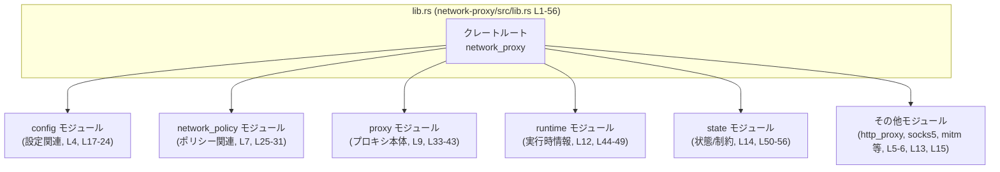
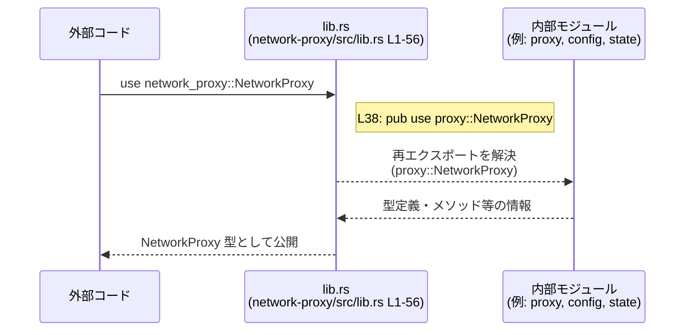

# network-proxy/src/lib.rs コード解説

## 0. ざっくり一言

`network-proxy/src/lib.rs` は、このクレート全体の「窓口」となるクレートルートであり、内部モジュール（設定・ポリシー・プロキシ本体・ランタイム・状態管理など）を宣言し、その中の主要な型や関数を再エクスポートして公開 API を構成しています（`network-proxy/src/lib.rs:L3-15, L17-56`）。

---

## 1. このモジュールの役割

### 1.1 概要

- このモジュールは、ネットワークプロキシ機能（設定、ポリシー判定、実行状態管理など）を提供するクレートの **公開 API を集約するファサード** として存在します。
- 内部モジュールを `mod` で宣言した上で、その中の代表的な型・関数を `pub use` で再エクスポートし、利用者が `network_proxy::NetworkProxy` などのシンプルなパスでアクセスできるようにしています（`network-proxy/src/lib.rs:L3-15, L17-56`）。
- さらに、Clippy の警告設定を通じて標準出力／標準エラーへの直接出力を禁止し、ライブラリとしての利用時に不要なコンソール出力が混入しないようにしています（`network-proxy/src/lib.rs:L1`）。

### 1.2 アーキテクチャ内での位置づけ

このファイルはクレートのルートであり、以下の内部モジュールを宣言しています（いずれもプライベートモジュールです）。

- `certs`（`network-proxy/src/lib.rs:L3`）
- `config`（`network-proxy/src/lib.rs:L4`）
- `http_proxy`（`network-proxy/src/lib.rs:L5`）
- `mitm`（`network-proxy/src/lib.rs:L6`）
- `network_policy`（`network-proxy/src/lib.rs:L7`）
- `policy`（`network-proxy/src/lib.rs:L8`）
- `proxy`（`network-proxy/src/lib.rs:L9`）
- `reasons`（`network-proxy/src/lib.rs:L10`）
- `responses`（`network-proxy/src/lib.rs:L11`）
- `runtime`（`network-proxy/src/lib.rs:L12`）
- `socks5`（`network-proxy/src/lib.rs:L13`）
- `state`（`network-proxy/src/lib.rs:L14`）
- `upstream`（`network-proxy/src/lib.rs:L15`）

それらのうち、外部に公開する必要がある型・関数・定数のみを `pub use` で再エクスポートしており、これがクレートの外から見える公式 API になります（`network-proxy/src/lib.rs:L17-56`）。

以下の Mermaid 図は、「外部コードが lib.rs 経由で内部モジュールの型・関数にアクセスする」高レベルな関係を示します（実際の呼び出しフローではなく、公開経路の図です）。



※ 図中の役割はモジュール名からの推測であり、詳細な実装はこのチャンクには現れません。

### 1.3 設計上のポイント

コードから読み取れる設計上の特徴は次のとおりです。

- **ファサードとしての再エクスポート集約**  
  - `mod` で内部モジュールをプライベートに宣言し（`network-proxy/src/lib.rs:L3-15`）、その後に `pub use` で個別のアイテムを公開しています（`network-proxy/src/lib.rs:L17-56`）。
  - これにより「内部構造（モジュール階層）」と「外部向け API 名」を分離する構造になっています。
- **公開 API の明示的な選別**  
  - モジュール自体は `pub mod` ではなく `mod` で宣言されているため、外部クレートは `network_proxy::config::NetworkProxyConfig` のように内部モジュールを直接参照できません。
  - 代わりに、`pub use config::NetworkProxyConfig;` のような再エクスポートが外部への公開点になっています（`network-proxy/src/lib.rs:L21` など）。
- **出力制御の静的検査**  
  - クレート属性 `#![deny(clippy::print_stdout, clippy::print_stderr)]` により、`println!` や `eprintln!` に類する Clippy ルール違反をコンパイルエラーとして扱います（`network-proxy/src/lib.rs:L1`）。
  - ライブラリコードが標準出力／エラーに直接書き込まないことを強制する意図が読み取れます。
- **エラー処理・並行性の方針はこのファイルからは不明**  
  - 実際のネットワーク処理やポリシー判定、非同期処理などはすべて内部モジュール側の実装にあり、このチャンクには現れません。そのため、`Result` や `async` の使い方など、Rust らしい安全性・並行性の詳細はここからは判断できません。

---

## 2. 主要な機能一覧

このファイルが外部に公開している主な機能群（全て「再エクスポート」です）は、名前と所属モジュールから次のように整理できます。役割の説明は型名・関数名からの推測を含み、詳細な仕様は各モジュールの定義を参照する必要があります。

- **ネットワークドメイン権限・モード・設定関連**（`config` モジュール由来, `network-proxy/src/lib.rs:L17-24`）
  - `NetworkDomainPermission`
  - `NetworkDomainPermissionEntry`
  - `NetworkDomainPermissions`
  - `NetworkMode`
  - `NetworkProxyConfig`
  - `NetworkUnixSocketPermission`
  - `NetworkUnixSocketPermissions`
  - `host_and_port_from_network_addr`（関数名と推測される）
- **ネットワークポリシー判定関連**（`network_policy` モジュール由来, `network-proxy/src/lib.rs:L25-31`）
  - `NetworkDecision`
  - `NetworkDecisionSource`
  - `NetworkPolicyDecider`
  - `NetworkPolicyDecision`
  - `NetworkPolicyRequest`
  - `NetworkPolicyRequestArgs`
  - `NetworkProtocol`
- **ホスト名正規化ユーティリティ**（`policy` モジュール由来, `network-proxy/src/lib.rs:L32`）
  - `normalize_host`
- **プロキシ設定・起動関連**（`proxy` モジュール由来, `network-proxy/src/lib.rs:L33-43`）
  - `ALL_PROXY_ENV_KEYS`
  - `ALLOW_LOCAL_BINDING_ENV_KEY`
  - `Args`
  - `DEFAULT_NO_PROXY_VALUE`
  - `NO_PROXY_ENV_KEYS`
  - `NetworkProxy`
  - `NetworkProxyBuilder`
  - `NetworkProxyHandle`
  - `PROXY_URL_ENV_KEYS`
  - `has_proxy_url_env_vars`
  - `proxy_url_env_value`
- **ランタイム上のブロック情報・設定リロード関連**（`runtime` モジュール由来, `network-proxy/src/lib.rs:L44-49`）
  - `BlockedRequest`
  - `BlockedRequestArgs`
  - `BlockedRequestObserver`
  - `ConfigReloader`
  - `ConfigState`
  - `NetworkProxyState`
- **状態・制約・部分設定関連**（`state` モジュール由来, `network-proxy/src/lib.rs:L50-56`）
  - `NetworkProxyAuditMetadata`
  - `NetworkProxyConstraintError`
  - `NetworkProxyConstraints`
  - `PartialNetworkConfig`
  - `PartialNetworkProxyConfig`
  - `build_config_state`
  - `validate_policy_against_constraints`

※ 上記の型・関数が実際にどのようなフィールド・メソッド・戻り値を持つかは、このファイルからは分かりません。

---

## 3. 公開 API と詳細解説

### 3.1 型一覧（構造体・列挙体など）

このファイルが再エクスポートしている主な型の一覧です。型の具体的な種別（構造体・列挙体・型エイリアスなど）は、このチャンクには定義が無いため「不明」と記載しています。

| 名前 | 種別 | 役割 / 用途（名称からの推測を含む） | 定義元 / 根拠 |
|------|------|--------------------------------------|---------------|
| `NetworkDomainPermission` | 不明 | ネットワークドメインへのアクセス権限を表す型と推測されます | `pub use config::NetworkDomainPermission;`（`network-proxy/src/lib.rs:L17`） |
| `NetworkDomainPermissionEntry` | 不明 | ドメイン権限の 1 エントリ単位を表す型と推測されます | `network-proxy/src/lib.rs:L18` |
| `NetworkDomainPermissions` | 不明 | 複数のドメイン権限集合を表す型と推測されます | `network-proxy/src/lib.rs:L19` |
| `NetworkMode` | 不明 | ネットワークの動作モード（たとえば許可/遮断/プロキシ経由など）を表す型と推測されます | `network-proxy/src/lib.rs:L20` |
| `NetworkProxyConfig` | 不明 | プロキシ全体の設定（ポート、上流プロキシ等）を表す型と推測されます | `network-proxy/src/lib.rs:L21` |
| `NetworkUnixSocketPermission` | 不明 | Unix ソケットへのアクセス権限を表す型と推測されます | `network-proxy/src/lib.rs:L22` |
| `NetworkUnixSocketPermissions` | 不明 | 上記権限の集合と推測されます | `network-proxy/src/lib.rs:L23` |
| `NetworkDecision` | 不明 | ネットワーク要求に対する判定結果（許可/拒否等）を表す型と推測されます | `network-proxy/src/lib.rs:L25` |
| `NetworkDecisionSource` | 不明 | 判定の出典（どのポリシーから来たか等）を表す型と推測されます | `network-proxy/src/lib.rs:L26` |
| `NetworkPolicyDecider` | 不明 | ポリシーにもとづき `NetworkDecision` を生成するコンポーネントを表す型と推測されます | `network-proxy/src/lib.rs:L27` |
| `NetworkPolicyDecision` | 不明 | 具体的なポリシー判定内容を表す型と推測されます | `network-proxy/src/lib.rs:L28` |
| `NetworkPolicyRequest` | 不明 | ポリシー判定の入力（リクエスト情報）を表す型と推測されます | `network-proxy/src/lib.rs:L29` |
| `NetworkPolicyRequestArgs` | 不明 | 上記リクエストの構築用引数群を表す型と推測されます | `network-proxy/src/lib.rs:L30` |
| `NetworkProtocol` | 不明 | TCP/UDP などのプロトコル種別を表す列挙型である可能性があります | `network-proxy/src/lib.rs:L31` |
| `Args` | 不明 | コマンドライン引数や起動引数を表す型と推測されます | `network-proxy/src/lib.rs:L35` |
| `NetworkProxy` | 不明 | プロキシの本体またはサービスを表す主要な型と推測されます | `network-proxy/src/lib.rs:L38` |
| `NetworkProxyBuilder` | 不明 | `NetworkProxy` を組み立てるためのビルダーパターンの型と推測されます | `network-proxy/src/lib.rs:L39` |
| `NetworkProxyHandle` | 不明 | 起動中のプロキシへのハンドル（制御用）を表す型と推測されます | `network-proxy/src/lib.rs:L40` |
| `BlockedRequest` | 不明 | ポリシーによってブロックされたリクエストの情報を表す型と推測されます | `network-proxy/src/lib.rs:L44` |
| `BlockedRequestArgs` | 不明 | ブロックされたリクエスト情報の構築に使う引数型と推測されます | `network-proxy/src/lib.rs:L45` |
| `BlockedRequestObserver` | 不明 | ブロックイベントを監視するオブザーバを表す型と推測されます | `network-proxy/src/lib.rs:L46` |
| `ConfigReloader` | 不明 | 設定ファイル等のリロード機構を表す型と推測されます | `network-proxy/src/lib.rs:L47` |
| `ConfigState` | 不明 | 現在の設定状態を表す型と推測されます | `network-proxy/src/lib.rs:L48` |
| `NetworkProxyState` | 不明 | プロキシの動作状態を表す型と推測されます | `network-proxy/src/lib.rs:L49` |
| `NetworkProxyAuditMetadata` | 不明 | 監査用メタデータ（誰がいつ何を許可/拒否したか等）を表す型と推測されます | `network-proxy/src/lib.rs:L50` |
| `NetworkProxyConstraintError` | 不明 | 制約違反が発生した際のエラー型と推測されます | `network-proxy/src/lib.rs:L51` |
| `NetworkProxyConstraints` | 不明 | 適用すべき制約ルール群を表す型と推測されます | `network-proxy/src/lib.rs:L52` |
| `PartialNetworkConfig` | 不明 | 一部だけ指定されたネットワーク設定（差分設定）を表す型と推測されます | `network-proxy/src/lib.rs:L53` |
| `PartialNetworkProxyConfig` | 不明 | プロキシ設定の部分構成を表す型と推測されます | `network-proxy/src/lib.rs:L54` |

※ いずれも、実際のフィールドやメソッドは `config.rs` や `state.rs` などの定義を参照する必要があります。このチャンク単体では確認できません。

### 3.2 関数詳細（本ファイルから再エクスポートされるもの）

このファイルで再エクスポートされている「関数名と推測される」アイテムに対してテンプレートを適用します。いずれもシグネチャや内部処理はこのファイルには現れないため、詳細は不明です。

#### `host_and_port_from_network_addr(..) -> ..`（config モジュール）

**概要**

- 正確な処理内容はこのチャンクからは分かりません。
- 名前と `config` モジュール由来であることから、「ネットワークアドレス表現からホスト名とポート番号を取り出す」役割が想定されますが、断定はできません（`network-proxy/src/lib.rs:L24`）。

**引数**

| 引数名 | 型 | 説明 |
|--------|----|------|
| （不明） | 不明 | このチャンクにはシグネチャがないため不明です。 |

**戻り値**

- 型・意味ともに、このチャンクには記述がないため不明です。

**内部処理の流れ（アルゴリズム）**

- 実装は `config` モジュール側にあり、このファイルからは読み取れません。

**Examples（使用例）**

このファイルが提供するのは「インポート方法」のみです。呼び出し方法（引数など）は定義ファイルを参照する必要があります。

```rust
// クレート外からのインポート例（network-proxy/src/lib.rs L24 で再エクスポート）
use network_proxy::host_and_port_from_network_addr;

// 実際の使用方法（引数や戻り値）は config モジュールの定義を参照する必要があります。
```

**Errors / Panics**

- エラー条件・パニック条件は、このチャンクには現れません。

**Edge cases（エッジケース）**

- 入力が空、無効なアドレス形式などに対する挙動は不明です。

**使用上の注意点**

- シグネチャやドキュメントを確認した上で使用する必要があります。

---

#### `normalize_host(..) -> ..`（policy モジュール）

**概要**

- このファイルからは内部処理は不明です。
- 名前からは「ホスト名を正規化する（たとえば大文字小文字をそろえる、末尾のドットを削る等）」処理を行うことが想定されますが、断定はできません（`network-proxy/src/lib.rs:L32`）。

**引数 / 戻り値 / 処理 / エラー / エッジケース / 注意点**

- すべて、このチャンクには定義がなく不明です。

**Examples**

```rust
use network_proxy::normalize_host;

// 実際の引数・戻り値は policy モジュール側の定義を確認する必要があります。
```

---

#### `has_proxy_url_env_vars(..) -> ..`（proxy モジュール）

**概要**

- 具体的な処理内容は不明です（`network-proxy/src/lib.rs:L42`）。
- 名称から「プロキシ URL を指定する環境変数が設定されているかどうかを調べる」関数である可能性がありますが、推測にとどまります。

**引数 / 戻り値 / その他**

- このチャンクには現れません。

**Examples**

```rust
use network_proxy::has_proxy_url_env_vars;

// 実際の返り値の型や利用方法は proxy モジュールの定義を参照してください。
```

---

#### `proxy_url_env_value(..) -> ..`（proxy モジュール）

**概要**

- 名称から、「プロキシ URL 関連の環境変数から値を取得する」処理を行う関数と推測されます（`network-proxy/src/lib.rs:L43`）。
- ただし、引数・戻り値・エラー条件等はこのチャンクからは不明です。

**Examples**

```rust
use network_proxy::proxy_url_env_value;

// 具体的な使い方は proxy モジュール実装に依存します。
```

---

#### `build_config_state(..) -> ..`（state モジュール）

**概要**

- このファイルからは、「何らかの入力（部分設定等）から `ConfigState` や `NetworkProxyState` に相当する状態を構築する」関数である可能性が推測されますが、実装は不明です（`network-proxy/src/lib.rs:L55`）。

**引数 / 戻り値 / その他**

- すべて、このチャンクには記載がありません。

**Examples**

```rust
use network_proxy::build_config_state;

// 実際には、PartialNetworkConfig などを引数に取る可能性がありますが、
// ここでは推測にとどまるため具体的な呼び出し例は示せません。
```

---

#### `validate_policy_against_constraints(..) -> ..`（state モジュール）

**概要**

- 名称からは、「ポリシーが `NetworkProxyConstraints` に違反していないか検証する」関数と推測されます（`network-proxy/src/lib.rs:L56`）。
- 実際の引数・戻り値・エラー仕様は不明です。

**Examples**

```rust
use network_proxy::validate_policy_against_constraints;

// どの型を渡すか、何が返るかは state モジュールの定義が必要です。
```

---

#### まとめ（関数詳細）

- 上記 6 つのシンボルはすべて `pub use` で再エクスポートされているため、クレート外から直接利用できます（`network-proxy/src/lib.rs:L24, L32, L42-43, L55-56`）。
- しかし、このファイルには `fn` 定義そのものは存在しないため（メタ情報にも `functions=0` とあります）、引数・戻り値・内部処理は **このチャンクだけでは分かりません**。
- Rust の言語機能（所有権・並行性・エラー処理）についても、これらの関数が `Result` を返すのか、`async fn` なのか、といった情報はこのファイルからは読み取れません。

### 3.3 その他の関数

- `network-proxy/src/lib.rs` 自体には、上記で取り上げたもの以外に関数定義や関数の `pub use` は現れていません（`network-proxy/src/lib.rs:L1-56` を見る限り、`fn` キーワードはありません）。
- そのため、このファイルが直接扱う関数的な要素は上記の再エクスポートに限られます。

---

## 4. データフロー

このファイルには実行時ロジックは含まれていないため、「データフロー」は **API 解決の経路**（外部コードがどのように内部モジュールの型・関数に到達するか）という観点で説明します。

### 4.1 代表的な利用シナリオ（API 経路）

外部クレートがプロキシ関連の型を利用する際のパス解決の流れは、次のようになります。

1. 外部クレートが `use network_proxy::NetworkProxy;` のようにインポートする。
2. Rust コンパイラは `lib.rs` をクレートルートとして読み込み、そこで `pub use proxy::NetworkProxy;` を見つける（`network-proxy/src/lib.rs:L38`）。
3. この再エクスポート先である `proxy` モジュール内の `NetworkProxy` の定義に辿り着き、その型情報を利用する。

これをシーケンス図として示すと、次のようになります。



※ この図はコンパイル時の「名前解決の流れ」を表しており、実行時にデータがどのように流れるか（たとえばリクエストがどのモジュールを通るか）は、このファイルからは判断できません。

---

## 5. 使い方（How to Use）

### 5.1 基本的な使用方法（lib.rs の観点）

このファイルのおかげで、外部コードは内部モジュール名を意識せず、クレートトップレベルから必要な型・関数をインポートできます。

```rust
// クレートトップレベルから必要な型をインポートする例
use network_proxy::{
    NetworkProxy,              // L38 で再エクスポート
    NetworkProxyBuilder,       // L39
    NetworkProxyConfig,        // L21
    NetworkMode,               // L20
    NetworkPolicyDecider,      // L27
    NetworkDecision,           // L25
};

// 具体的なフィールドやメソッド呼び出しは、
// 各型の定義（proxy.rs, config.rs, network_policy.rs 等）に依存します。
fn takes_proxy(proxy: NetworkProxy) {
    // NetworkProxy 型を引数に取る関数の例
}
```

このファイルが保証しているのは「`network_proxy::NetworkProxy` 等のパスが有効であること」であり、初期化の方法やメソッド名は内部モジュール側の定義次第です。

### 5.2 よくある使用パターン（想定レベル）

このチャンクから読み取れる範囲で、次のような利用パターンが成り立つことが想定されます（あくまで名前からの推測です）。

- **設定の構築と適用**
  - `NetworkProxyConfig` / `PartialNetworkProxyConfig` / `build_config_state` を組み合わせて設定状態を構築する（`network-proxy/src/lib.rs:L21, L54-55`）。
- **ポリシー判定**
  - `NetworkPolicyRequest` にリクエスト情報を詰め、`NetworkPolicyDecider` で `NetworkDecision` を得る（`network-proxy/src/lib.rs:L25-30`）。
- **プロキシの起動と制御**
  - `NetworkProxyBuilder` で `NetworkProxy` を構築し、それを制御するために `NetworkProxyHandle` を用いる（`network-proxy/src/lib.rs:L38-40`）。

ただし、これらの具体的な手順（どのメソッドをどう呼ぶか）はこのファイルには書かれていません。

### 5.3 よくある間違い（このファイル視点での注意）

このファイルの構造から想定される誤用パターンと、その正しい利用方法を示します。

```rust
// 誤り/不可能な例: 内部モジュールを直接参照しようとする
// （lib.rs では `mod config;` であり、`pub mod` ではないため外部クレートからは見えません）
// use network_proxy::config::NetworkProxyConfig; // コンパイルエラーになる

// 正しい例: lib.rs で再エクスポートされたトップレベルパスを使う
use network_proxy::NetworkProxyConfig; // L21 で pub use 済み

fn main() {
    // NetworkProxyConfig の具体的な構築方法は config モジュールの定義に依存します。
}
```

### 5.4 使用上の注意点（まとめ）

このファイルに基づいて言える範囲の注意点は次のとおりです。

- **トップレベルのシンボルを使う**  
  - 外部クレートからは、`network_proxy::NetworkProxy` のように、lib.rs で `pub use` されたシンボルのみが利用可能です（`network-proxy/src/lib.rs:L17-56`）。
  - 内部モジュール（`config`, `proxy`, `state` 等）は `pub mod` ではなく `mod` で宣言されているため、外部からは直接アクセスできません（`network-proxy/src/lib.rs:L3-15`）。
- **標準出力・標準エラーへの直接出力に依存しない**  
  - クレート内部では `println!` や `eprintln!` に対する Clippy の `print_stdout` / `print_stderr` が `deny` されているため、そうしたマクロに依存する設計にはなっていないことが期待されます（`network-proxy/src/lib.rs:L1`）。
  - ただし、代わりにどのようなログ・トレース手段が用意されているかは、このチャンクからは分かりません。
- **型・関数の仕様は定義元を確認する必要がある**  
  - このファイルはあくまで入口であり、各型・関数の詳細な仕様（エラー条件、非同期性、スレッド安全性など）はそれぞれのモジュールファイル側を参照する必要があります。

---

## 6. 変更の仕方（How to Modify）

このセクションでは、「lib.rs をどう変更するか」という観点に限定して説明します。実際のロジック変更は各モジュール側の作業になります。

### 6.1 新しい機能を追加する場合

1. **適切な内部モジュールに型・関数を追加する**  
   - 例: 新しいポリシー型なら `network_policy.rs`、新しい設定項目なら `config.rs` など、既存の責務分割に沿ったファイルに実装を追加します（モジュール宣言はすでに `network-proxy/src/lib.rs:L4, L7` で行われています）。
2. **外部に公開したい場合は lib.rs で `pub use` する**  
   - 追加した型や関数を外部 API として公開したい場合、`network-proxy/src/lib.rs` に `pub use module_name::ItemName;` を追加します。
   - これにより、外部クレートから `network_proxy::ItemName` として利用できるようになります。
3. **公開範囲の意図を明確にする**  
   - `pub use` を追加すると API が増えます。外部利用者に見せる意図がない内部用の型・関数は `pub use` しない、という方針を維持することが重要です。

### 6.2 既存の機能を変更する場合

- **再エクスポートの削除・名称変更の影響**  
  - 既存の `pub use` を削除したり、別の型に差し替えたりすると、外部 API が変更されます（`network-proxy/src/lib.rs:L17-56`）。
  - その場合、このクレートを利用しているコードがコンパイルエラーになる可能性があります。
- **型の中身だけを変える場合**  
  - `NetworkProxyConfig` など、既存の型のフィールドやメソッドを変更する場合、lib.rs 側の `pub use` はそのままでも、利用側のコードに影響が出る可能性があります。  
  - このファイルからは契約（前提条件・返り値の意味）までは分からないため、変更時は定義元モジュールとその型を利用している箇所を併せて確認する必要があります。
- **テストと契約の確認**  
  - `network-proxy/src/lib.rs` 自体にはテストコードは含まれていません（`#[cfg(test)]` などは見当たりません、`network-proxy/src/lib.rs:L1-56`）。
  - 挙動を保証するテストは各モジュール側に存在する可能性があるため、そちらを確認する必要があります。

---

## 7. 関連ファイル

`network-proxy/src/lib.rs` と密接に関係するファイルは、`mod` 宣言されている各モジュールファイルです（標準的なレイアウトを仮定すると `src/<name>.rs` または `src/<name>/mod.rs`）。

| パス | 役割 / 関係（名称からの推測を含む） | 根拠 |
|------|--------------------------------------|------|
| `network-proxy/src/certs.rs` | 証明書関連の機能を提供するモジュールである可能性があります。 | `mod certs;`（`network-proxy/src/lib.rs:L3`） |
| `network-proxy/src/config.rs` | ネットワークプロキシの設定・権限管理を定義するモジュールと推測されます。`NetworkProxyConfig` などの定義元です。 | `mod config;`（L4）, `pub use config::...;`（L17-24） |
| `network-proxy/src/http_proxy.rs` | HTTP プロキシ関連の処理を扱うモジュールである可能性があります。 | `mod http_proxy;`（L5） |
| `network-proxy/src/mitm.rs` | Man-in-the-Middle 方式のプロキシ処理を扱うモジュールである可能性があります。 | `mod mitm;`（L6） |
| `network-proxy/src/network_policy.rs` | ネットワークポリシーに関する型とロジックを定義するモジュールと推測されます。`NetworkPolicyDecider` 等の定義元です。 | `mod network_policy;`（L7）, `pub use network_policy::...;`（L25-31） |
| `network-proxy/src/policy.rs` | ポリシー関連のユーティリティ（`normalize_host` 等）を提供するモジュールと推測されます。 | `mod policy;`（L8）, `pub use policy::normalize_host;`（L32） |
| `network-proxy/src/proxy.rs` | プロキシ本体・ビルダー・環境変数関連の補助を提供する中心的なモジュールと推測されます。 | `mod proxy;`（L9）, `pub use proxy::...;`（L33-43） |
| `network-proxy/src/reasons.rs` | ブロック理由などを表現する型を提供するモジュールである可能性があります。 | `mod reasons;`（L10） |
| `network-proxy/src/responses.rs` | プロキシが返すレスポンス周りの型・処理を扱うモジュールである可能性があります。 | `mod responses;`（L11） |
| `network-proxy/src/runtime.rs` | 実行時の状態・ブロック情報・設定リロードなどを扱うモジュールと推測されます。 | `mod runtime;`（L12）, `pub use runtime::...;`（L44-49） |
| `network-proxy/src/socks5.rs` | SOCKS5 プロキシプロトコルを扱うモジュールである可能性があります。 | `mod socks5;`（L13） |
| `network-proxy/src/state.rs` | プロキシの状態・制約・監査情報などを表す型と、それらに関するロジック（`build_config_state` 等）を提供するモジュールと推測されます。 | `mod state;`（L14）, `pub use state::...;`（L50-56） |
| `network-proxy/src/upstream.rs` | 上流（アップストリーム）プロキシや外部サーバーとの接続管理を扱うモジュールである可能性があります。 | `mod upstream;`（L15） |

---

### Bugs / Security / Tests / パフォーマンスに関する補足（このファイルに基づく範囲）

- **Bugs / Security**  
  - `network-proxy/src/lib.rs` には複雑なロジックは含まれておらず、再エクスポートとモジュール宣言のみなので、このファイル単体から具体的なバグやセキュリティ上の問題を指摘することはできません。
  - Clippy の設定により「標準出力・標準エラーへの直接出力を禁止する」というポリシーが明示されている点は、安全性・静粛性の観点での方針として読み取れます（`network-proxy/src/lib.rs:L1`）。
- **Contracts / Edge Cases**  
  - 公開されている型・関数の契約（前提条件・戻り値の意味・エッジケースでの挙動）は、このファイルからは一切分かりません。
- **Tests**  
  - このファイル内にはテストモジュールやテスト関数は存在せず（`#[cfg(test)]` 等は見当たりません）、テストは他のファイルに置かれているか、別途用意されていると考えられます。
- **Performance / Scalability / Observability**  
  - 実行時の処理は含まれていないため、パフォーマンスやスケーラビリティ、ログ・メトリクスなどの観測性について、このファイルから直接判断できる事柄はありません。実際の非同期処理・スレッドモデル・ログ出力などは内部モジュール側の実装に依存します。
