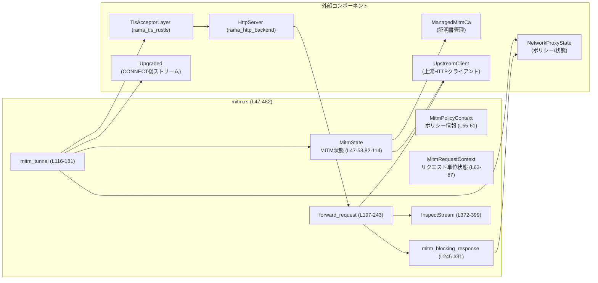
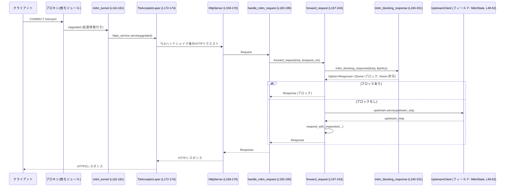

network-proxy/src/mitm.rs

---

## 0. ざっくり一言

このモジュールは、HTTP プロキシで受けた `CONNECT` トンネルを TLS 終端（MITM）し、内側の HTTPS リクエストに対してポリシー（ホスト制限・メソッド制限など）を適用しつつ、上流サーバーへ中継するためのロジックを提供します。  
任意でリクエスト・レスポンスボディの長さを計測してログに出す仕組みも含まれています。

---

## 1. このモジュールの役割

### 1.1 概要

- このモジュールは **CONNECT トンネル内の HTTPS 通信を復号（TLS 終端）し、プロキシ側でポリシーを適用可能にする** ために存在します（`MitmState`, `mitm_tunnel` まわり。mitm.rs:L47-53, L116-181）。
- 内側の HTTP リクエストに対して、以下を行います。
  - ホスト整合性チェック（ホスト偽装対策）（L263-275）
  - ローカル/プライベートアドレスへの再解決ブロック（DNS rebinding 対策）（L277-305）
  - ネットワークモードに基づく HTTP メソッド制限（L308-327）
- 任意で、リクエスト/レスポンスボディの合計サイズを非同期ストリーム実装で計測し、閾値を超えたかどうかをログ出力します（`InspectStream`, `BodyLoggable`。L359-399, L401-437）。

### 1.2 アーキテクチャ内での位置づけ

このモジュール内の主なコンポーネントと外部依存の関係を、簡略図で表します。



- `mitm_tunnel` は `Upgraded` ストリームから必要なコンテキスト（`MitmState`, `NetworkProxyState`, `ProxyTarget`, `NetworkMode`, `Executor`）を拡張情報（extensions）経由で取得し、TLS 終端レイヤと HTTP サーバレイヤを組み合わせて、内側の HTTPS を処理するサービスとして起動します（L117-181）。
- HTTP レベルの処理は `handle_mitm_request` → `forward_request` → `mitm_blocking_response` → `UpstreamClient` という流れになります（L183-243, L245-331）。

### 1.3 設計上のポイント

コードから読み取れる設計上の特徴です。

- **ステートの分離**
  - `MitmState` は CA 管理や上流クライアントなど、**接続全体で共有される状態** を持ちます（L47-53）。
  - `MitmPolicyContext` は **特定の CONNECT トンネルに紐づくポリシー状態**（ターゲットホスト・ポート・モード・アプリ状態）を保持します（L55-61）。
  - `MitmRequestContext` は上記ポリシーと MITM 状態を束ね、各 HTTP リクエストごとに `Arc` 共有されます（L63-67, L142-150）。
- **拡張情報（Extensions）による依存注入**
  - `Upgraded` ストリームの `extensions()` に `Arc<MitmState>`, `Arc<NetworkProxyState>`, `ProxyTarget`, `NetworkMode`, `Executor` を格納し、それを `mitm_tunnel` 内で取得しています（L118-156）。  
    これにより、MITM ハンドラは接続外側のコンポーネントから疎結合に設定を受け取ります。
- **エラーハンドリング方針**
  - 外部との境界（`MitmState::new`, `mitm_tunnel`, `forward_request`, `mitm_blocking_response`, `build_https_uri`）は `anyhow::Result` を用いて、`?` 演算子でエラーを伝播しています（L82-101, L116-181, L197-243, L245-331, L464-467）。
  - HTTP サービス (`handle_mitm_request`) の外形は `Result<Response, Infallible>` で、**内部エラーはログ＋HTTP 502** で表現され、Rust の `Result` としては失敗しないようにしています（L183-195）。
- **並行性**
  - 共有状態は `Arc` 経由でイミュータブルに共有されており、明示的なロックはありません（L63-67, L142-150）。
  - 非同期処理は `async fn` と `Executor`（`rama_core::rt::Executor`）を組み合わせており、HTTP サーバは `HttpServer::auto(executor)` で起動します（L152-159）。
- **ストリームによるボディ検査**
  - `Body::from_stream(InspectStream { ... })` を用いて、HTTP フレームワークのボディをラップし、**ボディ内容を消費せずに長さだけ計測** しています（L359-370, L382-399）。
  - 長さの加算には `saturating_add` を用い、整数オーバーフローでパニックしないようにしています（L386）。

---

## 2. 主要な機能一覧

このモジュールが提供する主要な機能です。

- MITM 状態の構築: `MitmState::new` により、ローカル CA と上流クライアント設定を含む MITM 状態を構築します（mitm.rs:L82-101）。
- CONNECT トンネル終端: `mitm_tunnel` が `Upgraded` ストリームを TLS 終端し、HTTP サーバを立ち上げます（L116-181）。
- ポリシー適用付き HTTPS プロキシング:
  - `forward_request` がポリシーチェック、URI/HOST の組み立て、上流転送、レスポンスのラップを行います（L197-243）。
  - `mitm_blocking_response` がホスト整合性チェック、DNS rebinding 対策、メソッド制限に基づきブロックレスポンスを生成します（L245-331）。
- ボディ長の計測とログ:
  - `inspect_body` + `InspectStream<T>` + `BodyLoggable` 実装が、リクエスト/レスポンスボディのバイト長と閾値超過をログ出力します（L359-399, L401-437）。

---

## 3. 公開 API と詳細解説

### 3.1 型一覧（構造体・列挙体など）

**構造体・トレイト・コンテキストのインベントリー**

| 名前 | 種別 | 公開範囲 | 役割 / 用途 | 定義位置 |
|------|------|----------|-------------|----------|
| `MitmState` | 構造体 | `pub`（モジュール外公開） | CA 管理 (`ManagedMitmCa`) と上流クライアント (`UpstreamClient`)、ボディ検査設定を保持する MITM 全体状態。`connect` トンネルごとに共有されることを想定。 | mitm.rs:L47-53, L82-114 |
| `MitmPolicyContext` | 構造体 | モジュール内 | 1つの CONNECT トンネルに対するポリシー情報（ターゲットホスト/ポート、`NetworkMode`, `Arc<NetworkProxyState>`）を保持。 | mitm.rs:L55-61 |
| `MitmRequestContext` | 構造体 | モジュール内 | 1つの HTTP リクエスト処理で利用されるコンテキスト。`MitmPolicyContext` と `Arc<MitmState>` のペア。 | mitm.rs:L63-67, L142-150 |
| `InspectStream<T>` | 構造体 | モジュール内 | HTTP ボディストリームをラップし、転送しながら総バイト数をカウントし、終了時に `BodyLoggable` コンテキストにログを出させるストリーム。 | mitm.rs:L372-377, L379-399 |
| `RequestLogContext` | 構造体 | モジュール内 | リクエストボディログ用のコンテキスト。ホスト・メソッド・パスを保持し、`BodyLoggable` 実装で `tracing::info` にログ出力。 | mitm.rs:L401-405, L418-426 |
| `ResponseLogContext` | 構造体 | モジュール内 | レスポンスボディログ用のコンテキスト。ホスト・メソッド・パス・ステータスコードを保持し、`BodyLoggable` 実装でログ出力。 | mitm.rs:L407-412, L429-437 |
| `BodyLoggable` | トレイト | モジュール内 | ボディ長とトランケーション情報を受け取りログするためのインターフェース。`log(self, len, truncated)` メソッドを定義。 | mitm.rs:L414-416 |

**定数**

| 名前 | 型 | 用途 | 定義位置 |
|------|----|------|----------|
| `MITM_INSPECT_BODIES` | `bool` | ボディ検査を有効にするかどうかのデフォルト値（`MitmState::new` で使用）。デフォルトは `false`。 | mitm.rs:L69 |
| `MITM_MAX_BODY_BYTES` | `usize` | ボディ検査時に「トランケート」と見なすバイト数の閾値。デフォルト 4096 バイト。 | mitm.rs:L70 |

### コンポーネント（関数）インベントリー概要

後ほど詳細化する主要関数以外も含めて、ざっと一覧を示します（詳細は 3.2 / 3.3）。

| 関数名 / メソッド | 公開範囲 | 役割 | 定義位置 |
|-------------------|----------|------|----------|
| `MitmState::new` | `pub(crate)` | MITM 状態の構築。CA ロード/生成と上流クライアント設定。 | mitm.rs:L82-101 |
| `MitmState::tls_acceptor_data_for_host` | モジュール内 | 指定ホスト向けの TLS 終端用データ生成を CA に委譲。 | mitm.rs:L103-105 |
| `MitmState::inspect_enabled` | `pub(crate)` | ボディ検査設定を返すゲッター。 | mitm.rs:L107-109 |
| `MitmState::max_body_bytes` | `pub(crate)` | ボディ検査の最大バイト数を返すゲッター。 | mitm.rs:L111-113 |
| `mitm_tunnel` | `pub(crate)` | `Upgraded` ストリームを受け取り TLS 終端＋HTTP サーバ構築＋リクエスト処理を行うメインエントリ。 | mitm.rs:L116-181 |
| `handle_mitm_request` | モジュール内 | HTTP サーバから呼ばれる 1 リクエスト処理関数。内部エラーを 502 に変換。 | mitm.rs:L183-195 |
| `forward_request` | モジュール内 | ポリシーチェック・URI 書き換え・ボディ検査設定・上流転送・レスポンス検査を行うコアロジック。 | mitm.rs:L197-243 |
| `mitm_blocking_response` | モジュール内 | ホスト偽装・dns rebinding・メソッド制限に基づくブロックレスポンス生成。 | mitm.rs:L245-331 |
| `respond_with_inspection` | モジュール内 | レスポンスボディのログラップを行うかどうかを切り替える。 | mitm.rs:L333-357 |
| `inspect_body` | モジュール内 | `Body` を `InspectStream` でラップし、ボディ長計測付きストリームに変換。 | mitm.rs:L359-370 |
| `InspectStream::poll_next` | モジュール内 | ストリームからデータを読みながら長さをカウントし、完了時にログ。 | mitm.rs:L379-399 |
| `extract_request_host` | モジュール内 | HOST ヘッダまたは URI の authority からホスト名を抽出。 | mitm.rs:L441-447 |
| `authority_header_value` | モジュール内 | ホスト/ポートから Host ヘッダ値（IPv6 対応）を生成。 | mitm.rs:L449-462 |
| `build_https_uri` | モジュール内 | `https://{authority}{path}` 形式の URI を構築しパース。 | mitm.rs:L464-467 |
| `path_and_query` | モジュール内 | URI の path+query 部分だけを文字列として取得。 | mitm.rs:L469-474 |
| `path_for_log` | モジュール内 | ログ用に path のみを文字列として取得。 | mitm.rs:L476-477 |

---

### 3.2 関数詳細（主要 7 件）

#### `MitmState::new(allow_upstream_proxy: bool) -> Result<Self>`

**概要**

- MITM 処理に必要な状態（ローカル CA 管理と上流クライアント）を初期化するコンストラクタです（mitm.rs:L82-101）。
- `allow_upstream_proxy` に応じて、環境変数で設定された上流プロキシを使うか、直接接続するかを切り替えます。

**引数**

| 引数名 | 型 | 説明 |
|--------|----|------|
| `allow_upstream_proxy` | `bool` | `true` の場合、環境変数に基づく上流プロキシ（`UpstreamClient::from_env_proxy()`）を使用し、`false` の場合は直接接続（`UpstreamClient::direct()`）を使用します（L89-93）。 |

**戻り値**

- `Result<MitmState>` (`anyhow::Result<Self>`)  
  - 成功時: 初期化された `MitmState` を返します。
  - 失敗時: CA 管理 (`ManagedMitmCa::load_or_create()`) や内部処理でのエラーを `anyhow` でラップして返します（L87）。

**内部処理の流れ**

1. `ManagedMitmCa::load_or_create()` を呼び出してローカル MITM CA をロードまたは生成します（L87）。
2. `allow_upstream_proxy` が `true` の場合は `UpstreamClient::from_env_proxy()`、そうでない場合は `UpstreamClient::direct()` を選択します（L89-93）。
3. `MITM_INSPECT_BODIES`（現状 `false`）、`MITM_MAX_BODY_BYTES`（4096バイト）を設定し、`MitmState` 構造体を組み立てて `Ok(Self { ... })` を返します（L95-100）。

**Examples（使用例）**

```rust
use std::sync::Arc;
use anyhow::Result;
use network_proxy::mitm::MitmState; // 仮のパス。実際のクレート名はこのチャンクには現れない。

fn setup_mitm() -> Result<Arc<MitmState>> {
    // 上流にさらにHTTPプロキシを利用したい場合
    let mitm = MitmState::new(true)?;  // CA をロード/生成し、環境変数から上流プロキシを設定

    Ok(Arc::new(mitm))                 // Upgraded::extensions に格納する際に Arc で包む
}
```

**Errors / Panics**

- `Err` となる条件（コード上で確認できる範囲）:
  - `ManagedMitmCa::load_or_create()` がエラーを返した場合（L87）。
  - `UpstreamClient::from_env_proxy()` / `direct()` は `Result` を返していないため、この関数内でその呼び出しに起因する `Err` は発生しません（このチャンクからはわかる範囲）。
- パニックの可能性:
  - `MitmState::new` 自体には `unwrap` などはなく、パニックを直接起こしません。

**Edge cases（エッジケース）**

- `allow_upstream_proxy` のみがエッジ条件で、`true`/`false` のどちらでも内部が変わるだけで API の挙動は安定しています。

**使用上の注意点**

- 戻り値の `MitmState` は `Arc` で共有して `Upgraded` の拡張情報に格納する想定で実装されています（mitm_tunnel で `Arc<MitmState>` を取得していることから推測。L118-122）。
- ボディ検査の有効/無効は現状コンパイル時の定数 (`MITM_INSPECT_BODIES`) で決まるため、実行時に切り替える API はこのファイルにはありません。

---

#### `pub(crate) async fn mitm_tunnel(upgraded: Upgraded) -> Result<()>`

**概要**

- CONNECT メソッドによって確立された `Upgraded` TCP ストリームを TLS 終端し、内側の HTTPS リクエストを HTTP サーバとして処理するエントリポイントです（mitm.rs:L116-181）。
- 拡張情報から MITM 状態やポリシー状態を取り出し、`TlsAcceptorLayer` と `HttpServer` を組み合わせたサービスを構築します。

**引数**

| 引数名 | 型 | 説明 |
|--------|----|------|
| `upgraded` | `Upgraded` | 事前に HTTP CONNECT ハンドラで確立されたトンネルストリーム。拡張情報に `Arc<MitmState>`, `Arc<NetworkProxyState>`, `ProxyTarget`, `NetworkMode`, `Executor` が格納されている前提です（L118-156）。 |

**戻り値**

- `Result<()>` (`anyhow::Result<()>`)  
  - 成功時: `Ok(())` を返し、MITM 経由の HTTP サーバが正常に終了したことを示します。
  - 失敗時: 拡張情報が欠けている場合や TLS / HTTP サーバのエラーを `anyhow!("MITM serve error: {err}")` でラップして返します（L117-137, L176-179）。

**内部処理の流れ**

1. `upgraded.extensions()` から以下を取得します（取得に失敗した場合は `context` 付きエラーを返す）。
   - `Arc<MitmState>`（L118-122）
   - `Arc<NetworkProxyState>`（L123-127）
   - `ProxyTarget`（L128-133）
   - `NetworkMode`（存在しなければ `NetworkMode::Full`）(L137-141)
2. ターゲットホストを `normalize_host` で正規化し、ターゲットポートと共に `MitmPolicyContext` を構築します（L134-147）。
3. 上記ポリシーと `Arc<MitmState>` を束ねた `MitmRequestContext` を `Arc` で包みます（L142-150）。
4. `Executor` を extensions から取得し、なければ `unwrap_or_default()` でデフォルトを使います（L152-156）。
5. `HttpServer::auto(executor)` から HTTP サービスを構築し、リクエストヘッダ/レスポンスヘッダから hop-by-hop ヘッダを除去するレイヤを挟みつつ、`handle_mitm_request` を呼ぶサービスを `service_fn` で生成します（L158-170）。
6. `TlsAcceptorLayer::new(acceptor_data).with_store_client_hello(true)` により TLS 終端レイヤを作成し、さきほどの HTTP サービスを下流に持つレイヤードサービス (`https_service`) を構築します（L172-174）。
7. `https_service.serve(upgraded).await` を呼び、TLS ハンドシェイク→HTTP 処理のループに入ります。エラー時は `anyhow!("MITM serve error: {err}")` に変換します（L176-179）。

**Examples（使用例）**

この関数は CONNECT ハンドラから呼ばれるコアロジックです。擬似的な使用例を示します（CONNECT ハンドラ部分はこのチャンクには存在しません）。

```rust
use anyhow::Result;
use rama_http_backend::server::layer::upgrade::Upgraded;
use crate::mitm::{MitmState, mitm_tunnel}; // 実際のパスはこのチャンクには現れない

async fn handle_connect(upgraded: Upgraded, mitm: Arc<MitmState>) -> Result<()> {
    // Upgraded の extensions に必要な情報を事前に詰めておく前提
    // upgraded.extensions_mut().insert(mitm.clone());
    // ... NetworkProxyState, ProxyTarget, NetworkMode, Executor なども同様に設定 ...

    mitm_tunnel(upgraded).await  // TLS 終端＋HTTPサーバ起動
}
```

**Errors / Panics**

- `Err` となる条件:
  - `extensions().get::<Arc<MitmState>>()` が `None` の場合（"missing MITM state"）(L118-122)。
  - `extensions().get::<Arc<NetworkProxyState>>()` が `None` の場合（"missing app state"）(L123-127)。
  - `extensions().get::<ProxyTarget>()` が `None` の場合（"missing proxy target"）(L128-133)。
  - `mitm.tls_acceptor_data_for_host(&target_host)` が失敗した場合（CA からの証明書取得エラー）（L136）。
  - `https_service.serve(upgraded).await` がエラーを返した場合（L176-179）。
- パニック:
  - `mitm_tunnel` 内には `unwrap` などはなく、全て `?` または `unwrap_or_default` で処理されているため、直接的なパニック要因は見当たりません。

**Edge cases（エッジケース）**

- `NetworkMode` が extensions に存在しない場合は `NetworkMode::Full` として扱われる（L137-141）。  
  → ポリシーの適用が最も緩いモードになることが想定されますが、詳細は `NetworkMode` 実装側に依存し、このチャンクには現れません。
- `Executor` が設定されていない場合はデフォルトの `Executor` が用いられます（L152-156）。

**使用上の注意点**

- この関数を利用する側では、事前に `Upgraded` に必要な extensions を全て格納しておく必要があります。欠けていると `Result::Err` で失敗します。
- TLS 終端用の証明書要求はホストごとに行われるため、大量の異なるホストに対して MITM を行う場合は CA 側のパフォーマンスやストレージに留意が必要です（CA の挙動はこのチャンクには現れませんが、`tls_acceptor_data_for_host` の存在から推測されます）。

---

#### `async fn forward_request(req: Request, request_ctx: &MitmRequestContext) -> Result<Response>`

**概要**

- MITM 内側の 1 HTTP リクエストに対して、ポリシーチェック→URI/HOST の書き換え→ボディ検査設定→上流転送→レスポンス検査を行うコアロジックです（mitm.rs:L197-243）。

**引数**

| 引数名 | 型 | 説明 |
|--------|----|------|
| `req` | `Request` | MITM された HTTPS から得た HTTP リクエスト。URI は元のクライアント指定のままです（L197）。 |
| `request_ctx` | `&MitmRequestContext` | ポリシー情報と MITM 状態を含むコンテキスト。`target_host`/`target_port`/`mode`/`app_state`/`mitm` を使用します（L202-205）。 |

**戻り値**

- `Result<Response>` (`anyhow::Result<Response>`)  
  - 成功時: 上流サーバから返されたレスポンス（必要に応じてボディ検査ラップ済み）。
  - 失敗時: ポリシーチェック・URI 生成・上流転送のいずれかでのエラーを `anyhow` でラップして返します。

**内部処理の流れ**

1. `mitm_blocking_response` を呼び出し、ブロックすべき条件に該当するかを確認します（L198-200）。
   - `Some(response)` が返ればそれをそのまま返し、ここで処理終了。
2. `target_host`, `target_port`, `mitm` を `request_ctx` から取り出します（L202-205）。
3. ログ用にメソッド・パス・パスのみの文字列を取得します（L206-208）。
4. `req.into_parts()` でヘッダなどのメタ情報とボディに分解します（L210）。
5. `authority_header_value(&target_host, target_port)` を使って Host ヘッダ / authority を構築し（L211）、`build_https_uri(&authority, &path)` で URI を `https://{authority}{path}` に書き換えます（L212）。
6. `parts.headers.insert(HOST, HeaderValue::from_str(&authority)?)` によって HOST ヘッダも書き換えます（L213-215）。
7. `mitm.inspect_enabled()` と `mitm.max_body_bytes()` を取得し、ボディをラップするかどうかを決定します（L217-219）。
   - `inspect == true` の場合は `inspect_body` で `InspectStream` を用いたボディに変換します（L219-228）。
8. `Request::from_parts(parts, body)` で新しいリクエストを組み立て、`mitm.upstream.serve(upstream_req).await?` で上流サーバに送信します（L233-235）。
9. 返ってきたレスポンスについて、`respond_with_inspection()` を呼び、レスポンスボディの検査ラップを行うかどうかを切り替えます（L235-242）。

**Examples（使用例）**

`handle_mitm_request` からの実際の呼び出しが例になっています（L187-193）。

```rust
async fn handle_mitm_request(
    req: Request,
    request_ctx: Arc<MitmRequestContext>,
) -> Result<Response, std::convert::Infallible> {
    let response = match forward_request(req, &request_ctx).await {
        Ok(resp) => resp,
        Err(err) => {
            warn!("MITM request handling failed: {err}");
            text_response(StatusCode::BAD_GATEWAY, "mitm upstream error")
        }
    };
    Ok(response)
}
```

**Errors / Panics**

- `Err` となる条件:
  - `mitm_blocking_response` 自体がエラーを返す場合（内部で `host_blocked().await?` を呼んでいるため）（L245-331）。
  - `build_https_uri(&authority, &path)` が不正な URI 文字列としてパースに失敗した場合（L212, L464-467）。
  - `HeaderValue::from_str(&authority)` が不正文字を含みエラーになる場合（L213-215）。
  - `mitm.upstream.serve(upstream_req).await` がエラーを返した場合（L234-235）。
- パニックの可能性:
  - `saturating_add` を利用しているため、ボディ長の加算でのオーバーフローはパニックになりません（L386）。
  - 他に `unwrap` 等は使われておらず、明示的なパニックはありません。

**Edge cases（エッジケース）**

- ブロック対象のリクエストは、上流に送られることなく `mitm_blocking_response` のレスポンスが返されます（L198-200, L245-331）。
- `inspect` が `false` の場合、ボディはそのまま上流に渡され、検査ログは一切出ません（L219-231, L341-343）。
- `path_and_query(req.uri())` の結果が `None` の場合は `"/"` となります（L207, L469-473）。

**使用上の注意点**

- URI/HOST が MITM のターゲットホスト/ポートに強制的に書き換えられるため、上流側から見ると「ターゲットホストに対する HTTPS リクエスト」として扱われます。
- `request_ctx.policy.target_host` などは、CONNECT 処理時に決めておく必要があります（`mitm_tunnel` で設定されています。L142-147）。

---

#### `async fn mitm_blocking_response(req: &Request, policy: &MitmPolicyContext) -> Result<Option<Response>>`

**概要**

- 内側の HTTPS リクエストに対し、追加のポリシーチェック（ホスト整合性、ローカルアドレスブロック、メソッド制限）を行い、必要ならブロックレスポンスを返す関数です（mitm.rs:L245-331）。
- **ブロックした場合のみ `Some(Response)` を返し、許可する場合は `Ok(None)` を返します。**

**引数**

| 引数名 | 型 | 説明 |
|--------|----|------|
| `req` | `&Request` | MITM 内側の HTTP リクエスト（CONNECT トンネル内部）。 |
| `policy` | `&MitmPolicyContext` | ターゲットホスト/ポート、ネットワークモード、アプリケーション状態（`NetworkProxyState`）を含むポリシー情報。 |

**戻り値**

- `Result<Option<Response>>`
  - `Ok(Some(resp))`: ブロック対象であり、`resp` をクライアントに返すべき。
  - `Ok(None)`: ブロック非該当。後続処理（上流転送）を続行。
  - `Err(..)`: `NetworkProxyState::host_blocked` など非同期ポリシーチェックに失敗した場合。

**内部処理の流れ**

1. メソッドが `"CONNECT"` の場合は即座に `405 METHOD_NOT_ALLOWED` を返します（L249-253）。  
   → MITM 内部で再度 CONNECT トンネルを張ろうとすることを禁止。
2. ログ用にメソッド・パス・クライアントアドレスを取得します（L256-261）。
3. `extract_request_host(req)` で HOST ヘッダまたは URI authority からホストを抽出し（L263-275）、`normalize_host` で正規化します。
   - 正規化結果が空でなく、`policy.target_host` と異なる場合は、ホストミスマッチとして `400 BAD_REQUEST` を返します（L265-273）。
4. `policy.app_state.host_blocked(&policy.target_host, policy.target_port).await?` を呼び、DNS rebinding 対策としてローカル/プライベートアドレスへの解決を再チェックします（L277-285）。
   - `HostBlockDecision::Blocked(HostBlockReason::NotAllowedLocal)` であれば、`BlockedRequest` を記録し（L287-300）、`blocked_text_response(reason)` でブロックレスポンスを返します（L302-305）。
5. `policy.mode.allows_method(&method)` によって HTTP メソッド制限を行い、許可されないメソッドなら `BlockedRequest` を記録し（L308-321）、`blocked_text_response(REASON_METHOD_NOT_ALLOWED)` を返します（L323-327）。
6. 上記いずれにも該当しなければ `Ok(None)` を返します（L330）。

**Examples（使用例）**

この関数は `forward_request` の先頭で利用されています（L198-200）。

```rust
if let Some(response) = mitm_blocking_response(&req, &request_ctx.policy).await? {
    return Ok(response);
}
```

**Errors / Panics**

- `Err` となる条件:
  - `policy.app_state.host_blocked(..).await` がエラーを返した場合（L281-283）。
  - `policy.app_state.record_blocked(..).await` は返り値が `_` として無視されていますが、`Result` であればここでエラーは握りつぶされます（L287-300, L309-322）。このチャンクでは型が明示されていないため、詳細は不明です。
- パニック:
  - この関数内に `unwrap` やパニックマクロは登場せず、直接のパニック要因はありません。

**Edge cases（エッジケース）**

- HOST ヘッダがない・不正な場合:
  - `extract_request_host` は HOST ヘッダの `to_str()` が失敗すると `None` にフォールバックし、代わりに `req.uri().authority()` を使おうとします（L441-447）。  
    → 両方とも取得できなければホストミスマッチチェック自体を行わず、そのまま次のポリシーへ進みます。
- すでに CONNECT の前段でホストがブロックされていても、ここでは **ローカル/プライベートアドレスについて再チェック**（DNS rebinding 対策）されます（L277-285）。
- メソッド制限では `allowed_methods=GET, HEAD, OPTIONS` というメッセージがログに含まれていますが（L323-325）、実際の許可メソッドは `NetworkMode::allows_method` の実装に依存し、このチャンクには詳細は現れません。

**使用上の注意点**

- この関数を後から拡張する場合、ブロック条件を追加するときは **`BlockedRequest` の記録** およびログ出力を同様に行うと、一貫性が保たれます（L287-300, L309-322）。
- `HostBlockReason::NotAllowedLocal` のような理由文字列は `.as_str()` を経由して `BlockedRequestArgs.reason` に保存されており（L286-292）、UI 側での表示などを想定した固定文字列になっていると考えられます。

---

#### `fn respond_with_inspection(…) -> Result<Response>`

```rust
fn respond_with_inspection(
    resp: Response,
    inspect: bool,
    max_body_bytes: usize,
    method: &str,
    log_path: &str,
    authority: &str,
) -> Result<Response>
```

**概要**

- 上流から返ってきたレスポンスに対して、ボディ検査（長さ計測＋ログ）を行うかどうかを切り替える関数です（mitm.rs:L333-357）。

**引数**

| 引数名 | 型 | 説明 |
|--------|----|------|
| `resp` | `Response` | 上流サーバからの HTTP レスポンス。 |
| `inspect` | `bool` | `true` の場合、ボディ検査を有効にします。 |
| `max_body_bytes` | `usize` | 検査時の閾値。これを超えると `truncated=true` としてログに出されます。 |
| `method` | `&str` | ログ用の HTTP メソッド。 |
| `log_path` | `&str` | ログ用のパス。 |
| `authority` | `&str` | ログ用のホスト（Host ヘッダ値）。 |

**戻り値**

- `Result<Response>`  
  - 成功時: 検査ラップ済みまたはそのままの `Response`。
  - 失敗要因はここでは存在せず、`Result` は他と揃えるために使われていると見られます（内部で `?` を使っていない）。

**内部処理の流れ**

1. `inspect == false` の場合は、引数の `resp` をそのまま `Ok(resp)` として返します（L341-343）。
2. `resp.into_parts()` でヘッダ等とボディを分離します（L345）。
3. `inspect_body` を呼び、`ResponseLogContext` をコンテキストとする `InspectStream` でボディをラップします（L346-355）。
4. `Response::from_parts(parts, body)` で新しいレスポンスを組み立て、返します（L356-357）。

**Errors / Panics**

- 現在の実装では `Result` の `Err` を返す部分はなく、常に `Ok` です。  
  → シグネチャを揃えるための `Result` と考えられます。

**Edge cases**

- `inspect == false` の場合でも `max_body_bytes` 等は使われませんが、呼び出し側の `forward_request` では、この関数の前に `inspect` と `max_body_bytes` を決定しています（L217-219, L235-242）。

**使用上の注意点**

- `inspect` を有効化すると、レスポンスボディの全バイトを `InspectStream` が観測することになるため、極端に大きなレスポンスであってもストリームとして逐次処理され、メモリに貯め込まない設計になっています（`BodyDataStream` 利用。L365）。
- 実際のログ内容は `ResponseLogContext` の `BodyLoggable` 実装に依存します（L429-437）。

---

#### `fn inspect_body<T: BodyLoggable + Send + 'static>(body: Body, max_body_bytes: usize, ctx: T) -> Body`

**概要**

- `Body` をラップし、`InspectStream<T>` によってボディ全体のバイト数をカウントし、ストリーム完了時に `ctx.log(len, truncated)` を呼ぶ `Body` を生成します（mitm.rs:L359-370）。

**引数**

| 引数名 | 型 | 説明 |
|--------|----|------|
| `body` | `Body` | 元の HTTP ボディ。 |
| `max_body_bytes` | `usize` | トランケーション判定に使う閾値。 |
| `ctx` | `T` | `BodyLoggable` を実装したコンテキスト。ログに必要なメタ情報（ホスト名やパスなど）を持ちます。 |

**戻り値**

- `Body`  
  - 元の `body` と同じデータを流しつつ、内部で `InspectStream<T>` によって長さを計測するラップ済みボディ。

**内部処理の流れ**

1. `body.into_data_stream()` によって `BodyDataStream`（`Stream<Item = Result<Bytes, BoxError>>`）を取得します（L365）。
2. それを `Box::pin` し、`InspectStream { inner, ctx: Some(Box::new(ctx)), len: 0, max_body_bytes }` を構築します（L364-369）。
3. `Body::from_stream(InspectStream { ... })` を返します（L364, L369）。

**Errors / Panics**

- 関数自体は失敗しません。
- 内部の `InspectStream` が持つ `inner` ストリームは `Result<Bytes, BoxError>` を返しうるため、ボディの読み出し側では従来通りエラーが伝播します（L379-381）。

**Edge cases**

- `max_body_bytes` が 0 の場合でも、`len > max_body_bytes` 判定により、1バイト以上流れた時点で `truncated=true` になります（L392）。
- `ctx` は `Option<Box<T>>` として保存され、`Poll::Ready(None)` に到達したときにのみ `take()` して `log` を 1 回だけ呼ぶため、完了ログが重複することはありません（L391-393）。

**使用上の注意点**

- ジェネリクス `T` には `Send + 'static` 制約がついており、非同期ランタイム上でも安全に扱えるようになっています（L359）。
- ボディデータそのものはログされず、長さとトランケーションフラグのみがログ出力されます（`RequestLogContext` / `ResponseLogContext` の実装より。L418-426, L429-437）。  
  → 内容の機密性に影響せず、サイズだけを観測する設計です。

---

#### `impl<T: BodyLoggable> Stream for InspectStream<T>`

**対象メソッド**

```rust
fn poll_next(self: Pin<&mut Self>, cx: &mut TaskContext<'_>) -> Poll<Option<Self::Item>>
```

**概要**

- HTTP ボディのデータストリームをラップしながら、流れてきた `Bytes` の長さを累積し、ストリームが終了したタイミングで `BodyLoggable::log` を呼び出す非同期ストリームの実装です（mitm.rs:L379-399）。

**内部処理の流れ**

1. `this.inner.as_mut().poll_next(cx)` を呼び、内側のストリームの状態を取得します（L384）。
2. `Poll::Ready(Some(Ok(bytes)))`:
   - `this.len = this.len.saturating_add(bytes.len());` で長さを累積し（L386）、同じ `bytes` を `Poll::Ready(Some(Ok(bytes)))` としてそのまま上流へ返します（L387）。
3. `Poll::Ready(Some(Err(err)))`:
   - エラーをそのまま `Poll::Ready(Some(Err(err)))` として返します（L389）。
4. `Poll::Ready(None)`:
   - ストリーム終了。`if let Some(ctx) = this.ctx.take()` でコンテキストを取得し、`ctx.log(this.len, this.len > this.max_body_bytes)` を呼んでログを出します（L391-393）。
   - その後 `Poll::Ready(None)` を返します（L394）。
5. `Poll::Pending`:
   - そのまま `Poll::Pending` を返します（L396）。

**エラー/安全性の観点**

- `saturating_add` により、`len` のオーバーフロー時もパニックせずに最大値で打ち止めになります（L386）。
- `ctx` は `Option<Box<T>>` であり、`take()` することで二重ログを防いでいます（L391-393）。
- ストリームの型 `Item` は `Result<Bytes, BoxError>` であり、`anyhow::Result` とは独立して、HTTP ボディレイヤーで標準的な `BoxError` ベースのエラーを扱っています（L379-381）。

**使用上の注意点**

- この実装は `T: BodyLoggable` のみ要求しており、`Send + 'static` 制約は `inspect_body` 側で付加されています（L359）。  
  → `InspectStream` 自体はジェネリックですが、`Body::from_stream` 経由で使うには `inspect_body` を通すのが前提です。

---

#### `fn authority_header_value(host: &str, port: u16) -> String`

**概要**

- Host ヘッダおよび URI authority に使用する `"host[:port]"` 形式の文字列を生成します。特に IPv6 リテラル (`:` を含むホスト名) に対して `[host]` / `[host]:port` 形式を用いる処理が含まれています（mitm.rs:L449-462）。

**アルゴリズム**

1. `host.contains(':')` の場合（IPv6 リテラル想定）（L451）:
   - `port == 443` なら `"[{host}]"`（L452-453）。
   - それ以外なら `"[{host}]:{port}"`（L454-456）。
2. それ以外（通常のホスト名）:
   - `port == 443` なら `host.to_string()`（L457-458）。
   - それ以外なら `format!("{host}:{port}")`（L459-460）。

**使用上の注意点**

- `forward_request` で `HeaderValue::from_str(&authority)` に渡されるため、ここで生成する文字列は HTTP ヘッダ値として妥当である必要があります（L211-215）。  
  `host` に不正文字が混入している場合は `HeaderValue::from_str` 側でエラーになります。

---

### 3.3 その他の関数

補助的な関数やシンプルなラッパを一覧でまとめます。

| 関数名 | 役割（1 行） | 定義位置 |
|--------|--------------|----------|
| `impl Debug for MitmState::fmt` | ログ出力等で `MitmState` を表示する際に `inspect` と `max_body_bytes` のみを出し、それ以外の内部状態を伏せる（CA やコネクタ情報を漏らさない）実装。 | mitm.rs:L72-80 |
| `MitmState::tls_acceptor_data_for_host` | `ManagedMitmCa` に処理を委譲し、ホスト別の TLS 終端用データ (`TlsAcceptorData`) を取得する。 | mitm.rs:L103-105 |
| `MitmState::inspect_enabled` / `max_body_bytes` | ボディ検査の有効/無効および閾値を返すゲッター。 | mitm.rs:L107-113 |
| `handle_mitm_request` | `forward_request` のエラーをキャッチし、ログ＋`502 BAD_GATEWAY` レスポンスを返す HTTP サービス用ラッパ。`Result<Response, Infallible>` を返し、外向きには失敗しない。 | mitm.rs:L183-195 |
| `extract_request_host` | HOST ヘッダまたは URI authority からホスト名を抽出し、`Option<String>` として返す。 | mitm.rs:L441-447 |
| `build_https_uri` | `"https://{authority}{path}"` 文字列を `Uri` にパースして返す。 | mitm.rs:L464-467 |
| `path_and_query` | URI から path+query を取り出し、無い場合は `"/"` を返す。 | mitm.rs:L469-474 |
| `path_for_log` | URI の path 部分のみを文字列として返す。 | mitm.rs:L476-477 |
| `BodyLoggable for RequestLogContext` | リクエストボディの長さ・トランケーション情報を `tracing::info` でログ出力する。 | mitm.rs:L418-426 |
| `BodyLoggable for ResponseLogContext` | レスポンスボディの長さ・トランケーション情報とステータスコードをログ出力する。 | mitm.rs:L429-437 |

---

## 4. データフロー

### 4.1 代表的な処理シナリオ（CONNECT → HTTPS → 上流）

CONNECT トンネル 1 本の中で、1 つの HTTPS リクエストが流れる際のおおまかなデータフローです。



**要点**

- `mitm_tunnel` は `Upgraded` に格納された情報から `MitmRequestContext` を構築し、`TlsAcceptorLayer`＋`HttpServer` を組み合わせたサービスを起動します（L142-150, L158-174）。
- 各 HTTP リクエストごとに `handle_mitm_request` → `forward_request` が呼ばれ、`mitm_blocking_response` でブロック対象かどうかを判定します（L183-200）。
- 許可されたリクエストだけが `UpstreamClient` へ転送され、レスポンスは `respond_with_inspection` によってボディ検査ラップが行われる場合があります（L233-242, L333-357）。

---

## 5. 使い方（How to Use）

このモジュール単体の API は限定的ですが、他モジュールと組み合わせた典型的な利用方法を整理します。

### 5.1 基本的な使用方法

1. **起動時に MITM 状態を初期化**

```rust
use anyhow::Result;
use std::sync::Arc;
use crate::mitm::MitmState;

fn init_mitm() -> Result<Arc<MitmState>> {
    let mitm = MitmState::new(/* allow_upstream_proxy */ true)?; // mitm.rs:L82-101
    Ok(Arc::new(mitm))
}
```

1. **CONNECT ハンドラで Upgraded にコンテキストを詰める**

```rust
use rama_http_backend::server::layer::upgrade::Upgraded;
use crate::state::NetworkProxyState;
use crate::mitm::mitm_tunnel;

async fn on_connect(
    upgraded: Upgraded,
    mitm: Arc<MitmState>,
    app_state: Arc<NetworkProxyState>,
    // ProxyTarget, NetworkMode, Executor なども別途用意
) -> anyhow::Result<()> {
    // ここで upgraded.extensions_mut() 経由で:
    // - Arc<MitmState>
    // - Arc<NetworkProxyState>
    // - ProxyTarget
    // - NetworkMode
    // - Executor
    // をセットすることが前提（詳細はこのチャンクには現れない）。

    mitm_tunnel(upgraded).await // mitm.rs:L116-181
}
```

1. **以降、内側の HTTPS リクエストは自動的に MITM され、ポリシーが適用されます。**

### 5.2 よくある使用パターン

- **上流に別のプロキシを挟む場合 / 直接接続する場合の切り替え**
  - `MitmState::new(true)` → `UpstreamClient::from_env_proxy()` を使用（L89-91）。
  - `MitmState::new(false)` → `UpstreamClient::direct()` を使用（L92-93）。
- **ボディ検査の有無**
  - 現時点ではコンパイル時定数 `MITM_INSPECT_BODIES`（L69）が `inspect` の値になっており、`false` のため検査は無効です（L95-100）。
  - ボディ長のログが必要になった場合は、この定数を `true` に変更するか、`MitmState` に設定用の API を追加する変更が考えられます（変更方法は 6 章参照）。

### 5.3 よくある間違い

```rust
// 間違い例: Upgraded に必要な extensions を入れずに mitm_tunnel を呼ぶ
async fn wrong_usage(upgraded: Upgraded) -> anyhow::Result<()> {
    // mitm, app_state, ProxyTarget などをセットしていない
    mitm_tunnel(upgraded).await // → "missing MITM state" などのエラーになる (L118-133)
}

// 正しい例: 事前に必要な拡張情報をすべて登録してから呼ぶ
async fn correct_usage(
    upgraded: Upgraded,
    mitm: Arc<MitmState>,
    app_state: Arc<NetworkProxyState>,
    target: ProxyTarget,
    mode: NetworkMode,
    executor: Executor,
) -> anyhow::Result<()> {
    {
        let ext = upgraded.extensions_mut();
        ext.insert(mitm);
        ext.insert(app_state);
        ext.insert(target);
        ext.insert(mode);
        ext.insert(executor);
    }
    mitm_tunnel(upgraded).await
}
```

※ 上記の `extensions_mut` 呼び出しなどは、このファイルには直接登場しませんが、`extensions().get::<T>()` と対をなす一般的な使い方として記述しています。

### 5.4 使用上の注意点（まとめ）

- `MitmState` は `Arc` で共有する設計であり、内部に可変状態は含まれていません（L47-52）。
- MITM によって TLS 末端をプロキシ側で終端するため、クライアント側にはプロキシのルート CA を信頼させておく必要があります（CA 管理の詳細は `ManagedMitmCa` にあり、このチャンクには現れません）。
- ボディ検査を有効にすると、全リクエスト/レスポンスボディをストリームとして通過させる必要があり、I/O 負荷がわずかに増加しますが、`InspectStream` は逐次処理のためメモリ使用量はボディサイズに比例しません（L379-399）。

---

## 6. 変更の仕方（How to Modify）

### 6.1 新しい機能を追加する場合

**例: 新たなポリシー（例: ヘッダベースのブロック）を追加する**

1. **ポリシー情報の追加**
   - `MitmPolicyContext`（L55-61）に必要なフィールド（例: 許可ヘッダのリスト）を追加します。
2. **コンテキスト生成の変更**
   - `mitm_tunnel` 内で `MitmPolicyContext` を構築している箇所（L142-147）に、新しいフィールドの初期化ロジックを追加します。
3. **判定ロジックの追加**
   - ブロックポリシーなら `mitm_blocking_response`（L245-331）に分岐を追加すると、既存のブロック記録・ログ出力の流れに乗せやすくなります。
4. **ログ・記録の追加**
   - `BlockedRequestArgs` に適切な `reason` をセットし、`record_blocked` を呼び出す流れに統合します（L287-300, L309-322）。

### 6.2 既存の機能を変更する場合

- **ボディ検査のデフォルトを変える**
  - `MITM_INSPECT_BODIES`（L69）と `MITM_MAX_BODY_BYTES`（L70）を変更すると、新しいデフォルト設定になります。
  - 変更後は `MitmState::new` を通じて反映されます（L95-100）。
- **エラー文言やステータスコードを変える**
  - `mitm_blocking_response` 内の `text_response` / `blocked_text_response` 呼び出しを修正することで、クライアントに返るエラーメッセージやステータスコードを変更できます（L250-253, L270-273, L305, L327）。
- **影響範囲の確認**
  - `mitm_tunnel` と `forward_request` は、このモジュール内では他に参照されていませんが、モジュール外から `mitm_tunnel` が呼ばれている可能性が高いです。  
    シグネチャ変更や挙動変更を行う場合は、呼び出し元（CONNECT ハンドラ）側のコードも確認する必要があります（このチャンクには現れません）。
  - `BlockedRequestArgs` のフィールド値を変更する場合は、UI やログ解析ツールがそれを前提にしていないか確認する必要があります。

---

## 7. 関連ファイル

このモジュールと密接に関係する他ファイル（型）は `use` 文から読み取れる範囲で以下の通りです。

| パス / 型 | 役割 / 関係 |
|-----------|------------|
| `crate::certs::ManagedMitmCa` | MITM 用ローカル CA の管理を行う型です。`MitmState` が `load_or_create()` と `tls_acceptor_data_for_host` を通じて利用しています（mitm.rs:L49, L87, L103-105）。具体的な実装はこのチャンクには現れません。 |
| `crate::config::NetworkMode` | ネットワークモード（例: full/limited）を表す型で、`mode.allows_method(&method)` によりメソッド許可を判定します（mitm.rs:L2, L137-141, L308）。詳細なモードの種別はこのチャンクには現れません。 |
| `crate::state::NetworkProxyState` | ポリシー判断とブロック記録を行うアプリケーション状態。`host_blocked`、`record_blocked` を通じて利用されています（mitm.rs:L11, L280-283, L287-300, L309-322）。 |
| `crate::state::{BlockedRequest, BlockedRequestArgs}` | ブロックされたリクエストの情報を表し、`record_blocked` 呼び出し時に利用されます（mitm.rs:L9-10, L287-300, L309-322）。 |
| `crate::upstream::UpstreamClient` | 上流への HTTP リクエストを送るクライアント。`MitmState` がフィールドとして保持し、`forward_request` 内で `serve` を呼んでいます（mitm.rs:L12, L49-52, L234-235）。 |
| `crate::responses::{text_response, blocked_text_response}` | シンプルなテキストレスポンスを生成するユーティリティ。エラー／ブロック時の応答生成に使われます（mitm.rs:L5-6, L191-192, L250-253, L270-273, L305, L327）。 |
| `crate::reasons::REASON_METHOD_NOT_ALLOWED` | メソッド制限でブロックされた場合の理由文字列。ログおよび `BlockedRequestArgs.reason` に使用されています（mitm.rs:L4, L313, L327）。 |
| `rama_http_backend::server::HttpServer` | HTTP サーバ実装。`mitm_tunnel` 内で TLS 終端の下流に配置され、MITM 内側の HTTP を処理します（mitm.rs:L34, L158-170）。 |
| `rama_tls_rustls::server::{TlsAcceptorLayer, TlsAcceptorData}` | TLS 終端レイヤと、そのための設定データ。`MitmState` が `TlsAcceptorData` を生成し、`mitm_tunnel` が `TlsAcceptorLayer` を構築します（mitm.rs:L38-39, L136, L172-174）。 |
| `rama_net::proxy::ProxyTarget` | CONNECT トンネルのターゲットホスト/ポート情報を表す型。`mitm_tunnel` が extensions から取得し、ポリシーコンテキストに格納します（mitm.rs:L36, L128-135, L143-145）。 |
| `rama_net::stream::SocketInfo` | クライアントソケットの情報。`mitm_blocking_response` が `peer_addr()` を使ってクライアントアドレスを取得しています（mitm.rs:L37, L259-261）。 |
| `#[cfg(test)] mod tests;` | `mitm_tests.rs` 内にテストコードが存在しますが、このチャンクには内容が現れません（mitm.rs:L480-482）。 |

---

### Bugs / Security / Contracts のポイント（まとめ）

- **セキュリティ的な対策**
  - CONNECT 内部での再 CONNECT を `405 METHOD_NOT_ALLOWED` で禁止（L249-253）。
  - ホストヘッダと CONNECT ターゲットの整合性チェックにより、ホスト偽装を検出（L263-275）。
  - `host_blocked` を再度呼び出し、DNS rebinding によって CONNECT 後にローカル/プライベートアドレスへ向きを変えようとする攻撃を検知・ブロック（L277-285, L302-305）。
- **契約（Contracts）**
  - `mitm_tunnel` を呼ぶ前に、`Upgraded` の extensions に `Arc<MitmState>`・`Arc<NetworkProxyState>`・`ProxyTarget` などをセットしておく必要があります（L118-156）。
  - `forward_request` は、`mitm_blocking_response` を通過してからでないと上流にリクエストを送信しません（L198-200, L233-235）。
- **エッジケース**
  - HOST ヘッダが欠落・不正な場合は、ホストミスマッチチェックがスキップされ、他のチェックのみが適用されます（L263-275, L441-447）。
  - ボディ長のカウントは `usize` 上限に張り付いても安全に継続され、トランケーションフラグは `len > max_body_bytes` で判定されます（L386, L392）。

この範囲を踏まえると、このモジュールは Rust の `Result`・非同期 `Stream`・`Arc` を用いて、メモリ安全性とエラー伝播を確保しつつ、MITM 特有のセキュリティ要件を実装していると解釈できます。
