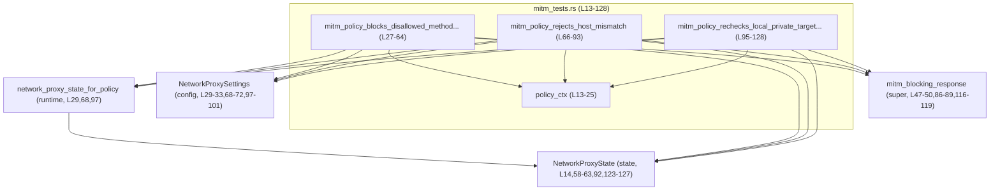
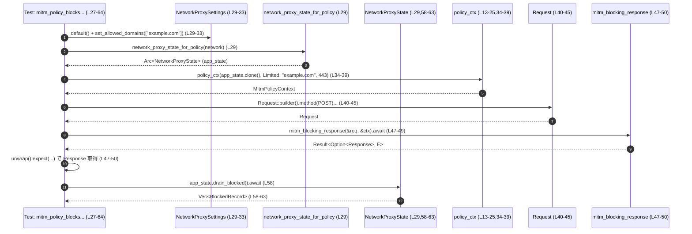

# network-proxy/src/mitm_tests.rs コード解説

## 0. ざっくり一言

`mitm_tests.rs` は、MITM 型ネットワークプロキシの **ポリシー判定**（許可ドメイン・HTTP メソッド・ローカルアドレス制限）と、それに伴う **ブロック・テレメトリ記録** の挙動を検証する Tokio 非同期テスト群を定義するファイルです（`mitm_tests.rs:L27-128`）。

---

## 1. このモジュールの役割

### 1.1 概要

- このモジュールは、MITM プロキシのポリシーが正しく動作するかどうかを、HTTP リクエスト単位で検証する **統合テスト**を提供します。
- 具体的には、以下の 3 点を確認します（`mitm_tests.rs:L27-128`）。
  - 許可ドメインでも、許可されていない HTTP メソッドは 403 でブロックされ、テレメトリに記録されること
  - クライアントの `Host` ヘッダと接続先ホストが不一致な場合に 400 (BAD_REQUEST) で拒否され、ブロックテレメトリには載らないこと
  - ローカル/プライベートアドレス宛ての通信が `allow_local_binding = false` 設定のもとで 403 となり、ブロック理由として「ローカル禁止」が記録されること

### 1.2 アーキテクチャ内での位置づけ

このテストモジュールは、以下のコンポーネントに依存しています。

- 設定:
  - `NetworkProxySettings`（`crate::config`）…許可ドメインやローカルアクセス可否を設定（`mitm_tests.rs:L29-33, L68-72, L97-101`）
- ランタイム状態:
  - `network_proxy_state_for_policy`（`crate::runtime`）…テスト用の `NetworkProxyState` を生成（`mitm_tests.rs:L29, L68, L97`）
  - `NetworkProxyState`…ブロックされたリクエストの記録を持ち、`drain_blocked` / `blocked_snapshot` で参照（`mitm_tests.rs:L14, L58-63, L92, L123-127`）
- ポリシー評価:
  - `MitmPolicyContext`…MITM ポリシー評価用の文脈（ターゲットホスト/ポート・モードなど）（`mitm_tests.rs:L13-25`）
  - `mitm_blocking_response`（親モジュール由来と思われる `super::*`）…リクエストとコンテキストを受け取り、ブロック時レスポンスを返す非同期関数（`mitm_tests.rs:L47-50, L86-89, L116-119`）
- HTTP 関連:
  - `Request`, `Method`, `Body`, `StatusCode`（`rama_http`）（`mitm_tests.rs:L8-11, L40-45, L79-84, L109-114, L52, L91, L121`）

これらの関係を簡略化すると、次のようになります。



※ `NetworkProxySettings` / `NetworkProxyState` / `MitmPolicyContext` / `mitm_blocking_response` の定義本体はこのチャンクには現れません（`mitm_tests.rs` 内からは参照のみ）。

### 1.3 設計上のポイント

- **ヘルパ関数によるコンテキスト生成**  
  - `policy_ctx` で `MitmPolicyContext` の生成手続きを共通化し、テストごとに同じパターンでポリシーコンテキストを構築しています（`mitm_tests.rs:L13-25, L34-39, L73-78, L103-108`）。
- **Tokio 非同期テスト**  
  - 各テストは `#[tokio::test]` 属性でマークされた `async fn` として実装され、`mitm_blocking_response` や `NetworkProxyState` の非同期 API を `await` しています（`mitm_tests.rs:L27, L47-49, L66-67, L86-88, L95-96, L116-118`）。
- **共有状態の安全な参照**  
  - `NetworkProxyState` は `Arc`（参照カウント付きスマートポインタと推測されます）の中に保持され、テスト内でクローンして使用されています（`mitm_tests.rs:L14, L29, L35, L68, L74, L97, L104`）。`Arc` の具体的なインポート元はこのチャンクには現れません。
- **テレメトリ/観測性の検証**  
  - ブロックされたリクエストは `drain_blocked` や `blocked_snapshot` で取得され、ブロック理由・メソッド・ホスト・ポートが期待通り記録されているかが検証されています（`mitm_tests.rs:L58-63, L92, L123-127`）。

---

## 2. 主要な機能一覧

- MITM ポリシーコンテキスト生成ヘルパ: `policy_ctx`（`MitmPolicyContext` を構築）（`mitm_tests.rs:L13-25`）
- テスト: 許可ドメイン + 非許可メソッドのブロックとテレメトリ記録を検証（`mitm_policy_blocks_disallowed_method_and_records_telemetry`、`mitm_tests.rs:L27-64`）
- テスト: Host ヘッダ不一致時のリクエスト拒否とブロック記録なしを検証（`mitm_policy_rejects_host_mismatch`、`mitm_tests.rs:L66-93`）
- テスト: ローカル/プライベートアドレス宛ての再チェックとブロック・テレメトリ記録を検証（`mitm_policy_rechecks_local_private_target_after_connect`、`mitm_tests.rs:L95-128`）

### 2.1 関数インベントリ（このファイル内で定義）

| 名前 | 種別 | 役割 / 用途 | 定義位置 |
|------|------|-------------|----------|
| `policy_ctx` | 関数 | `NetworkProxyState` とターゲット情報から `MitmPolicyContext` を組み立てるヘルパ | `mitm_tests.rs:L13-25` |
| `mitm_policy_blocks_disallowed_method_and_records_telemetry` | 非同期テスト関数 | Limited モードでの非許可メソッド（POST）のブロックとテレメトリ記録を検証 | `mitm_tests.rs:L27-64` |
| `mitm_policy_rejects_host_mismatch` | 非同期テスト関数 | 接続先ホストと `Host` ヘッダの不一致時に 400 が返ること・ブロック記録がないことを検証 | `mitm_tests.rs:L66-93` |
| `mitm_policy_rechecks_local_private_target_after_connect` | 非同期テスト関数 | ローカル/プライベートアドレス宛てのリクエストが Full モードでもブロックされることと理由を検証 | `mitm_tests.rs:L95-128` |

### 2.2 関連コンポーネント（このファイル外で定義）

| 名前 | 種別 (推定) | このファイルでの使われ方 | 参照位置 |
|------|-------------|--------------------------|----------|
| `NetworkProxySettings` | 構造体 | デフォルト設定から許可ドメインやローカルバインド可否を設定する | `mitm_tests.rs:L3, L29-33, L68-72, L97-101` |
| `NetworkProxyState` | 構造体 | プロキシの実行状態と、ブロックされたリクエスト記録のコンテナとして使用 | `mitm_tests.rs:L14, L29, L35, L68, L74, L97, L104, L58-63, L92, L123-127` |
| `NetworkMode` | 列挙体 (推定) | ポリシーモード（Limited / Full）を表すモード値として利用 | `mitm_tests.rs:L15, L36, L75, L105` |
| `MitmPolicyContext` | 構造体 | ポリシー判定に必要なターゲット情報・モード・状態をまとめたコンテキストとして利用 | `mitm_tests.rs:L18-24` |
| `network_proxy_state_for_policy` | 関数 | 設定 (`NetworkProxySettings`) からテスト用 `NetworkProxyState` を構築 | `mitm_tests.rs:L6, L29, L68, L97` |
| `mitm_blocking_response` | 非同期関数 | リクエストとポリシーコンテキストを受け取り、ブロック時のレスポンスを返す | `mitm_tests.rs:L47-50, L86-89, L116-119` |
| `REASON_METHOD_NOT_ALLOWED` | 定数 | 非許可メソッドでブロックされたことを表す理由文字列 | `mitm_tests.rs:L4, L60` |
| `REASON_NOT_ALLOWED_LOCAL` | 定数 | ローカル/プライベートアドレス禁止によるブロック理由を表す文字列 | `mitm_tests.rs:L5, L125` |

---

## 3. 公開 API と詳細解説

このファイルはテスト専用であり、ライブラリとして外部に公開される API は定義していません。ここでは、テスト内で再利用性があるヘルパ関数と各テスト関数について詳細を説明します。

### 3.1 型一覧（このファイルで利用される主な型）

※定義はすべて他モジュールにあります。ここでは、このファイルから読み取れる「使われ方」を説明します。

| 名前 | 種別 (推定) | 役割 / 用途 | 根拠 |
|------|-------------|-------------|------|
| `NetworkProxySettings` | 構造体 | プロキシのポリシー設定（許可ドメイン、ローカルバインド可否）を保持し、`default()` とメソッドで構成を変更する | `NetworkProxySettings::default()` と `set_allowed_domains` / `allow_local_binding` フィールド操作から（`mitm_tests.rs:L29-33, L68-72, L97-101`） |
| `NetworkProxyState` | 構造体 | プロキシの実行状態および、ブロックされたリクエストの履歴を保持する | `Arc<NetworkProxyState>` と `drain_blocked` / `blocked_snapshot` メソッドの呼び出しから（`mitm_tests.rs:L14, L29, L58-63, L92, L123-127`） |
| `NetworkMode` | 列挙体 (推定) | `Limited` / `Full` などのモード値として、ポリシーの厳しさを切り替える | `NetworkMode::Limited` と `NetworkMode::Full` の利用から（`mitm_tests.rs:L36, L75, L105`） |
| `MitmPolicyContext` | 構造体 | `target_host`, `target_port`, `mode`, `app_state` を保持し、MITM ポリシー判定の文脈として利用 | 構造体リテラルのフィールドから（`mitm_tests.rs:L18-24`） |
| `Request`, `Method`, `Body` | HTTP 関連構造体 | HTTP リクエストの組み立てに使用 | `Request::builder`, `Method::POST/GET`, `Body::empty` の使用から（`mitm_tests.rs:L40-45, L79-84, L109-114`） |
| `StatusCode` | 列挙体 | HTTP ステータスコードの表現。テストでは `FORBIDDEN` と `BAD_REQUEST` をチェック | `StatusCode::FORBIDDEN`, `StatusCode::BAD_REQUEST` から（`mitm_tests.rs:L52, L91, L121`） |

---

### 3.2 関数詳細

#### `policy_ctx(app_state: Arc<NetworkProxyState>, mode: NetworkMode, target_host: &str, target_port: u16) -> MitmPolicyContext`

**概要**

- MITM ポリシー評価に使う `MitmPolicyContext` を、与えられた `NetworkProxyState`・モード・ターゲットホスト/ポートから構築するヘルパ関数です（`mitm_tests.rs:L13-25`）。

**引数**

| 引数名 | 型 | 説明 |
|--------|----|------|
| `app_state` | `Arc<NetworkProxyState>` | プロキシの共有状態。`Arc` によって参照カウント管理された状態オブジェクトです（定義はこのチャンク外、`mitm_tests.rs:L14`）。 |
| `mode` | `NetworkMode` | ポリシーモード（例: `Limited`, `Full`）（`mitm_tests.rs:L15, L36, L75, L105`）。 |
| `target_host` | `&str` | 接続先ホスト名または IP アドレス（`mitm_tests.rs:L16, L37, L76, L106`）。 |
| `target_port` | `u16` | 接続先ポート番号（`mitm_tests.rs:L17-18, L38, L77, L107`）。 |

**戻り値**

- `MitmPolicyContext`  
  `target_host`, `target_port`, `mode`, `app_state` をフィールドとして持つコンテキスト構造体です（`mitm_tests.rs:L18-24`）。

**内部処理の流れ**

1. `target_host` の `&str` を `to_string()` で `String` に変換します（`mitm_tests.rs:L20`）。
2. 構造体リテラル `MitmPolicyContext { ... }` に `target_host`, `target_port`, `mode`, `app_state` をそのままフィールドとして格納します（`mitm_tests.rs:L18-24`）。
3. 作成した `MitmPolicyContext` を返します（`mitm_tests.rs:L18-24`）。

**Examples（使用例）**

テスト内での典型的な使われ方です。

```rust
// 状態を生成
let app_state = Arc::new(network_proxy_state_for_policy({
    let mut network = NetworkProxySettings::default();   // デフォルト設定
    network.set_allowed_domains(vec!["example.com".to_string()]);
    network                                           // 設定オブジェクトを返す
}));

// Limited モードで example.com:443 向けコンテキストを生成
let ctx = policy_ctx(
    app_state.clone(),                                  // Arc をクローンして共有
    NetworkMode::Limited,                               // 制限付きモード
    "example.com",                                      // ターゲットホスト
    443,                                                // ターゲットポート
);
```

（根拠: `mitm_tests.rs:L29-39`）

**Errors / Panics**

- この関数自身は `Result` や `Option` を返さず、標準的な処理の範囲でパニックを発生させる要素も見当たりません（`mitm_tests.rs:L13-25`）。
  - `target_host.to_string()` がパニックを起こすケースは通常ありません。

**Edge cases（エッジケース）**

- `target_host` が空文字列でも、そのまま `String` に変換されてコンテキストに入ります。追加の検証や正規化は行っていません（`mitm_tests.rs:L20`）。
- `target_port` は `u16` であり、0 や 65535 といった境界値も特別扱いされずそのままコンテキストに入ります（検証ロジックはこのチャンクにはありません）。

**使用上の注意点**

- `policy_ctx` は単純なラッパーであり、実際のポリシー判定の振る舞いは `MitmPolicyContext` とそれを受け取る関数（ここでは `mitm_blocking_response`）側に依存します。
- テストコードでコンテキスト生成を統一する目的に適しており、新しいテストでも同じパターンで再利用できます（`mitm_tests.rs:L34-39, L73-78, L103-108`）。

---

#### `mitm_policy_blocks_disallowed_method_and_records_telemetry()`

**概要**

- Limited モードで許可ドメイン (`example.com`) に対する `POST` リクエストが、ポリシーにより 403 Forbidden でブロックされること、およびブロックされた理由やメソッド等がテレメトリに記録されることを検証する非同期テストです（`mitm_tests.rs:L27-64`）。

**引数**

- なし（テスト関数であり、テストランナーから直接呼び出されます）。

**戻り値**

- `()`（暗黙のユニット）。  
  `#[tokio::test]` により Tokio ランタイム上で実行されます（`mitm_tests.rs:L27-28`）。

**内部処理の流れ**

1. `NetworkProxySettings::default()` で設定を初期化し、`set_allowed_domains` で `example.com` を許可ドメインに設定します（`mitm_tests.rs:L29-31`）。
2. 上記設定を `network_proxy_state_for_policy` に渡し、`NetworkProxyState` を `Arc` に包んで生成します（`mitm_tests.rs:L29`）。
3. `policy_ctx` を用いて、Limited モード・ターゲットホスト `example.com`・ポート 443 の `MitmPolicyContext` を生成します（`mitm_tests.rs:L34-39`）。
4. `Request::builder()` から HTTP リクエストを構築し、メソッドに `Method::POST`、URI に `/v1/responses?api_key=secret`、`HOST` ヘッダに `example.com` を設定し、空ボディを付与して `build` します（`mitm_tests.rs:L40-45`）。
5. `mitm_blocking_response(&req, &ctx).await` を実行し、`Result` を `unwrap()`、さらに `Option` を `expect("...")` で取り出し、ブロックされたレスポンスを取得します（`mitm_tests.rs:L47-50`）。
6. 返ってきたレスポンスのステータスコードが `StatusCode::FORBIDDEN` であることを確認します（`mitm_tests.rs:L52`）。
7. ヘッダ `x-proxy-error` に `"blocked-by-method-policy"` がセットされていることを確認します（`mitm_tests.rs:L53-56`）。
8. `app_state.drain_blocked().await` でブロック記録を取得し、エントリが 1 件であること、`reason` が `REASON_METHOD_NOT_ALLOWED`、`method` が `"POST"`、`host` が `"example.com"`、`port` が `Some(443)` であることを確認します（`mitm_tests.rs:L58-63`）。

**Examples（使用例）**

新しいメソッドをテストしたい場合、パターンは同様です。

```rust
#[tokio::test]
async fn mitm_policy_blocks_put_in_limited_mode() {
    let app_state = Arc::new(network_proxy_state_for_policy({
        let mut network = NetworkProxySettings::default();
        network.set_allowed_domains(vec!["example.com".to_string()]);
        network
    }));
    let ctx = policy_ctx(app_state.clone(), NetworkMode::Limited, "example.com", 443);

    let req = Request::builder()
        .method(Method::PUT)                         // 今回は PUT をテスト
        .uri("/some/path")
        .header(HOST, "example.com")
        .body(Body::empty())
        .unwrap();

    let response = mitm_blocking_response(&req, &ctx)
        .await
        .unwrap()
        .expect("PUT should be blocked in limited mode");

    assert_eq!(response.status(), StatusCode::FORBIDDEN);
}
```

※ `mitm_blocking_response` の実際のポリシー内容が PUT をブロックするかどうかは、このチャンクからは不明です。

**Errors / Panics**

- `mitm_blocking_response` が `Err` を返した場合、`unwrap()` によりこのテストはパニックします（`mitm_tests.rs:L47-49`）。
- `mitm_blocking_response` の戻り値 `Result<Option<_>, _>` の `Option` が `None` の場合、`expect("POST should be blocked in limited mode")` によりパニックします（`mitm_tests.rs:L50`）。
- `response.headers().get("x-proxy-error").unwrap()` でヘッダが存在しない場合にもパニックします（`mitm_tests.rs:L53-55`）。

いずれも **意図的に失敗を検出するためのテスト内パニック**であり、通常はエラー条件を検出する目的で使用されています。

**Edge cases（エッジケース）**

- 許可ドメインリストに `example.com` 以外は含まれていないため、他のドメインに対する挙動はこのテストではカバーされていません（`mitm_tests.rs:L31`）。
- メソッドは `POST` のみを検証しており、`GET` や `HEAD` などの挙動は別テストか別箇所で扱われている可能性がありますが、このチャンクには現れません。
- `api_key=secret` のようなクエリパラメータを含んでいますが、機密情報のログ取り扱いについてはこのテストからは判断できません（`mitm_tests.rs:L42`）。

**使用上の注意点（バグ/セキュリティ観点を含む）**

- このテストは「許可ドメインでもメソッドによってブロックされる」というセキュリティポリシーを前提としています。実装がこの前提を変更した場合、このテストも更新が必要になります。
- `drain_blocked` を使用しているため、呼び出し後にブロック記録がクリアされる設計であることが前提になっています（`mitm_tests.rs:L58`）。テストを追加する際は、この副作用に注意する必要があります。

---

#### `mitm_policy_rejects_host_mismatch()`

**概要**

- 接続先ホスト（コンテキストの `target_host`）と、クライアントから送られる `Host` ヘッダが一致しない場合に、プロキシが 400 Bad Request を返却し、ブロックテレメトリには記録しないことを検証する非同期テストです（`mitm_tests.rs:L66-93`）。

**内部処理の流れ（要約）**

1. `NetworkProxySettings` をデフォルトから構築し、`example.com` を許可ドメインに設定します（`mitm_tests.rs:L68-72`）。
2. `network_proxy_state_for_policy` から `app_state` を生成し、`policy_ctx` で `target_host = "example.com"`, `mode = NetworkMode::Full`, `target_port = 443` のコンテキストを作成します（`mitm_tests.rs:L73-78`）。
3. `Request::builder()` で `GET /` のリクエストを構築し、`Host` ヘッダに `evil.example` を設定します（`mitm_tests.rs:L79-84`）。
4. `mitm_blocking_response(&req, &ctx).await.unwrap().expect(...)` でレスポンスを取得します（`mitm_tests.rs:L86-89`）。
5. ステータスコードが `BAD_REQUEST` であることを検証します（`mitm_tests.rs:L91`）。
6. `app_state.blocked_snapshot().await.unwrap().len()` が `0` であることを検証し、このケースが「ブロック記録」には載らないことを確認します（`mitm_tests.rs:L92`）。

**Errors / Panics**

- `mitm_policy_blocks_disallowed_method_and_records_telemetry` 同様、`unwrap()` / `expect()` による意図的なパニックの可能性があります（`mitm_tests.rs:L86-89, L92`）。

**Edge cases**

- `NetworkMode::Full` で実行されており、Limited モードとの挙動差はこのテストからは分かりません（`mitm_tests.rs:L75`）。
- `Host` ヘッダが不正フォーマット（空文字など）の場合の挙動はカバーされていません。
- ブロックテレメトリに記録されない理由（例えば「プロトコルレベルのエラー扱い」など）は、このテストだけからは分かりませんが、少なくとも「blocked の一覧には出ない」という契約を前提にしています（`mitm_tests.rs:L92`）。

**使用上の注意点（セキュリティ観点）**

- このテストは、`Host` ヘッダ偽装（Host ヘッダインジェクション）への防御の一部として解釈できますが、テスト内では「不一致 → BAD_REQUEST」という結果のみを検証しており、詳細なセキュリティ要件（ログや上流への伝播など）はこのチャンクからは分かりません。

---

#### `mitm_policy_rechecks_local_private_target_after_connect()`

**概要**

- 接続先がローカルもしくはプライベートアドレス（ここでは `10.0.0.1`）であり、設定で `allow_local_binding = false` となっている場合、Full モードでもリクエストが 403 Forbidden でブロックされ、そのブロック理由が `REASON_NOT_ALLOWED_LOCAL` となることを検証します（`mitm_tests.rs:L95-128`）。

**内部処理の流れ（要約）**

1. `NetworkProxySettings` をデフォルトから構築し、`example.com` を許可ドメインに設定します（`mitm_tests.rs:L97-99`）。
2. `allow_local_binding = false` を設定し、ローカル/プライベートアドレスへのバインドを禁止します（`mitm_tests.rs:L100`）。
3. 上記設定から `network_proxy_state_for_policy` で `app_state` を生成します（`mitm_tests.rs:L97`）。
4. `policy_ctx` で `target_host = "10.0.0.1"`, `mode = NetworkMode::Full`, `target_port = 443` のコンテキストを生成します（`mitm_tests.rs:L103-108`）。
5. `GET /health?token=secret` のリクエストを構築し、`Host` ヘッダに `10.0.0.1` を設定します（`mitm_tests.rs:L109-114`）。
6. `mitm_blocking_response(&req, &ctx).await.unwrap().expect(...)` でレスポンスを取得します（`mitm_tests.rs:L116-119`）。
7. ステータスコードが `FORBIDDEN` であることを確認します（`mitm_tests.rs:L121`）。
8. `app_state.drain_blocked().await.unwrap()` でブロック記録を取得し、1 件のみであり、その `reason` が `REASON_NOT_ALLOWED_LOCAL`、`host` が `"10.0.0.1"`、`port` が `Some(443)` であることを検証します（`mitm_tests.rs:L123-127`）。

**Edge cases**

- `allow_local_binding = true` のケース（ローカルアクセスを許可する設定）はこのテストでは扱っていません。
- ターゲットアドレスは `10.0.0.1` 固定であり、`127.0.0.1` や IPv6 ローカルアドレスなど他のローカルレンジはこのチャンクでは検証されていません。

**使用上の注意点（セキュリティ観点）**

- テスト名から「CONNECT 後に再チェックが行われる」ことが示唆されていますが、その具体的な再チェックのタイミングや実装は `mitm_blocking_response` 側で行われており、このチャンクからは読めません。
- `token=secret` といったクエリパラメータを含むリクエストを用いていますが、トークンの扱い（マスキング等）についてはこのテストでは検証していません（`mitm_tests.rs:L111`）。

---

### 3.3 その他の関数

このファイルには、補助的な関数は `policy_ctx` のみで、それ以外はすべてテスト関数です（`mitm_tests.rs:L13-25, L27-64, L66-93, L95-128`）。

---

## 4. データフロー

ここでは、代表的なシナリオとして「非許可メソッドのブロック」テストのデータフローを示します。

### 4.1 非許可メソッド・ブロック時のフロー

1. 設定生成 (`NetworkProxySettings`)  
   - デフォルト値から `example.com` を許可ドメインとして設定し、`network_proxy_state_for_policy` に渡します（`mitm_tests.rs:L29-33`）。
2. アプリ状態生成 (`NetworkProxyState`)  
   - 設定からポリシー適用済みの `NetworkProxyState` が生成され、`Arc` に格納されます（`mitm_tests.rs:L29`）。
3. コンテキスト生成 (`policy_ctx`)  
   - `app_state`, `NetworkMode::Limited`, ターゲットホスト/ポートから `MitmPolicyContext` を作成します（`mitm_tests.rs:L34-39, L13-25`）。
4. HTTP リクエスト生成 (`Request`)  
   - メソッド `POST`・URI `/v1/responses?api_key=secret`・`Host: example.com` のリクエストを構築します（`mitm_tests.rs:L40-45`）。
5. ポリシー評価 (`mitm_blocking_response`)  
   - リクエストとコンテキストを渡し、非同期にポリシー評価を行い、ブロック時レスポンスを受け取ります（`mitm_tests.rs:L47-50`）。
6. レスポンス検証  
   - ステータスコードおよび `x-proxy-error` ヘッダの値を確認します（`mitm_tests.rs:L52-56`）。
7. テレメトリ検証 (`NetworkProxyState`)  
   - `drain_blocked` によりブロック記録を取得し、理由やメソッド等が期待通りであることを確認します（`mitm_tests.rs:L58-63`）。

これを sequence diagram で表現すると、次のようになります。



※ `Response` 型および `BlockedRecord` 型の定義はこのチャンクには現れませんが、`status`, `headers` フィールドや `reason`, `method`, `host`, `port` フィールドにアクセスされていることが分かります（`mitm_tests.rs:L52-56, L60-63, L125-127`）。

---

## 5. 使い方（How to Use）

このファイルは **テストモジュール** であり、プロダクションコードから直接呼び出されることはありません。ただし、MITM ポリシーのテストを書く際のテンプレートとして利用できます。

### 5.1 基本的な使用方法（新しいテストを追加する場合）

新たなポリシー挙動をテストしたい場合、既存テストと同じ構造を取ることができます。

```rust
#[tokio::test]                                           // Tokio ランタイム上で非同期テストを実行
async fn new_policy_test_example() {
    // 1. 設定オブジェクトを作成
    let app_state = Arc::new(network_proxy_state_for_policy({
        let mut network = NetworkProxySettings::default();   // デフォルト設定
        network.set_allowed_domains(vec!["example.com".to_string()]);
        // 必要なら他のフィールドを調整
        network
    }));

    // 2. ポリシーコンテキストを構築
    let ctx = policy_ctx(
        app_state.clone(),
        NetworkMode::Full,                                   // 必要に応じて Limited/Full を切り替え
        "example.com",
        443,
    );

    // 3. HTTP リクエストを組み立て
    let req = Request::builder()
        .method(Method::GET)
        .uri("/some/endpoint")
        .header(HOST, "example.com")
        .body(Body::empty())
        .unwrap();

    // 4. mitm_blocking_response でポリシー評価
    let response = mitm_blocking_response(&req, &ctx)
        .await
        .unwrap()
        .expect("request should not be blocked");

    // 5. レスポンスとテレメトリを検証
    assert_eq!(response.status(), StatusCode::OK);           // 例: 許可されることを期待
    assert_eq!(app_state.blocked_snapshot().await.unwrap().len(), 0);
}
```

この例は、既存テストコードのパターン（設定 → コンテキスト → リクエスト → mitm_blocking_response → 検証）を踏襲しています（`mitm_tests.rs:L27-64, L66-93, L95-128`）。

### 5.2 よくある使用パターン

- **モードの違いをテストする**  
  - `NetworkMode::Limited` と `NetworkMode::Full` を切り替え、同じリクエストに対する挙動の差を確認する（`mitm_tests.rs:L36, L75, L105`）。
- **テレメトリの有無を確認する**  
  - 明示的にブロックされたケースでは `drain_blocked` で 1 件以上の記録があることを確認（`mitm_tests.rs:L58-63, L123-127`）。
  - プロトコルエラー扱いのようなケースでは `blocked_snapshot` が空であることを確認（`mitm_tests.rs:L92`）。

### 5.3 よくある間違い（起こりうる誤用の例）

```rust
// 誤り例: allow_local_binding を設定せずにローカルアドレステストを行う
let app_state = Arc::new(network_proxy_state_for_policy({
    let mut network = NetworkProxySettings::default();
    // network.allow_local_binding = false; を書き忘れる
    network
}));

// この状態でローカルアドレス宛てのテストを書いても、実装によってはブロックされない可能性がある
```

```rust
// 正しい例: ローカルアドレスをブロックしたい場合はフラグを明示的に false にする
let app_state = Arc::new(network_proxy_state_for_policy({
    let mut network = NetworkProxySettings::default();
    network.allow_local_binding = false;   // ローカル禁止を明示
    network
}));
```

（正しい設定例の根拠: `mitm_tests.rs:L97-101`）

### 5.4 使用上の注意点（まとめ）

- **非同期コンテキストが必須**  
  - `mitm_blocking_response`, `drain_blocked`, `blocked_snapshot` などは `await` されており、`#[tokio::test]` や他の非同期ランタイムが必要です（`mitm_tests.rs:L27-28, L47-49, L58, L86-88, L92, L116-118, L123`）。
- **`unwrap` / `expect` によるパニック**  
  - テスト内では敢えて `unwrap` / `expect` を使って異常系を検知しています。プロダクションコードでは同様の呼び出しをする場合、より安全なエラーハンドリングが必要です。
- **共有状態の副作用**  
  - `drain_blocked` は履歴を消費する（クリアする）動きが名前から推測されます。複数の検証を同一状態で行うテストでは、呼び出し順に注意が必要です（`mitm_tests.rs:L58, L123`）。

---

## 6. 変更の仕方（How to Modify）

### 6.1 新しい機能（新しいポリシー）をテストに追加する場合

1. **前提設定の決定**  
   - 新しいポリシーがどの設定値（ドメイン、モード、ローカルフラグなど）に依存するかを整理します。
2. **設定ブロックの追加/変更**  
   - 既存テストの `NetworkProxySettings` 初期化ブロック（`mitm_tests.rs:L29-33, L68-72, L97-101`）を参考に、新しい設定を組み立てます。
3. **テスト関数の追加**  
   - `#[tokio::test] async fn ...` とし、`policy_ctx` / `Request::builder` / `mitm_blocking_response` のパターンを踏襲します（`mitm_tests.rs:L27-64` など）。
4. **期待結果の定義**  
   - HTTP ステータスコード、レスポンスヘッダ、`blocked_snapshot` / `drain_blocked` の内容など、観測可能な成果物を明示し、`assert_eq!` などで検証します。

### 6.2 既存の機能（ポリシー）の挙動を変更する場合

- **影響範囲の確認**
  - `NetworkMode` の意味や `allow_local_binding` の挙動を変更する場合、対応するテスト（特に `mitm_policy_rejects_host_mismatch`, `mitm_policy_rechecks_local_private_target_after_connect`）が前提とする契約が変わる可能性があります（`mitm_tests.rs:L75, L100, L103-108`）。
- **契約（前提条件）の確認**
  - 例えば「Host 不一致は 400 にする」「ローカル禁止は 403 にする」「blocked_snapshot には何が入るか」といった契約が、テストの `assert_eq!` に現れているため、仕様変更時にはこれらのアサーションを見直す必要があります（`mitm_tests.rs:L52, L91, L121, L58-63, L92, L123-127`）。
- **テレメトリフォーマット変更時**
  - `blocked[0].reason`, `blocked[0].method`, `blocked[0].host`, `blocked[0].port` のフィールド構造や意味が変わると、テスト内容も合わせて更新が必要です（`mitm_tests.rs:L60-63, L125-127`）。

---

## 7. 関連ファイル

このファイルと密接に関係するモジュールパス（ファイルパスはこのチャンクには現れません）をまとめます。

| モジュール/パス | 役割 / 関係 |
|----------------|------------|
| `crate::config::NetworkProxySettings` | プロキシのポリシー設定（許可ドメイン、ローカルバインド可否など）を提供し、このテストで初期化・変更されます（`mitm_tests.rs:L3, L29-33, L68-72, L97-101`）。 |
| `crate::runtime::network_proxy_state_for_policy` | `NetworkProxySettings` からテスト用の `NetworkProxyState` を生成する関数で、各テストの初期状態を構築します（`mitm_tests.rs:L6, L29, L68, L97`）。 |
| `crate::reasons::{REASON_METHOD_NOT_ALLOWED, REASON_NOT_ALLOWED_LOCAL}` | ブロック理由を表す定数で、テレメトリの `reason` フィールドと突き合わせるために使用されます（`mitm_tests.rs:L4-5, L60, L125`）。 |
| 親モジュール (`super::*`) | `NetworkProxyState`, `NetworkMode`, `MitmPolicyContext`, `mitm_blocking_response`, `Arc` など、このテストで利用する型・関数の多くをエクスポートしていると考えられます（`mitm_tests.rs:L1, L13-18, L47-50`）。 |
| `rama_http` クレート | HTTP リクエスト/レスポンス関連の型（`Request`, `Method`, `Body`, `StatusCode`）を提供し、プロキシの動作を HTTP レベルでテストするために利用されています（`mitm_tests.rs:L8-11, L40-45, L79-84, L109-114, L52, L91, L121`）。 |

このチャンクに現れない実装（`mitm_blocking_response` 本体など）については、別ファイルでのコード確認が必要です。
