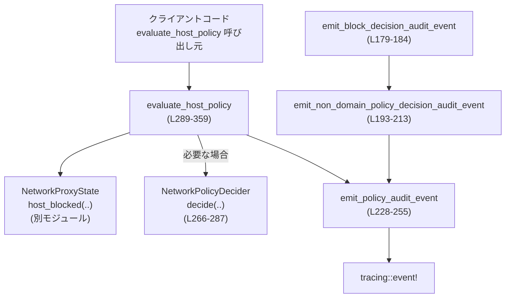
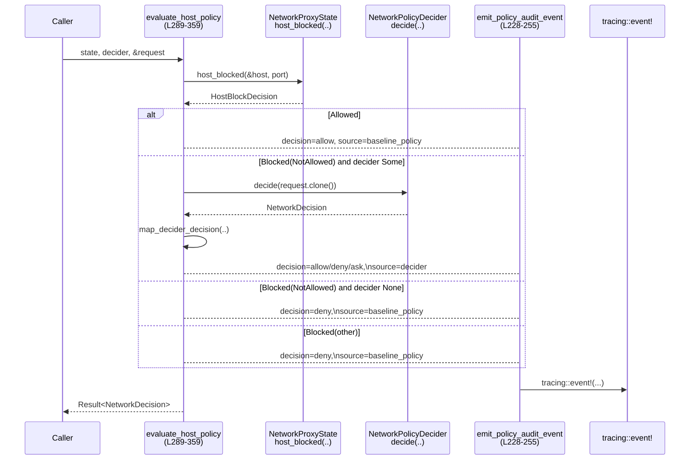
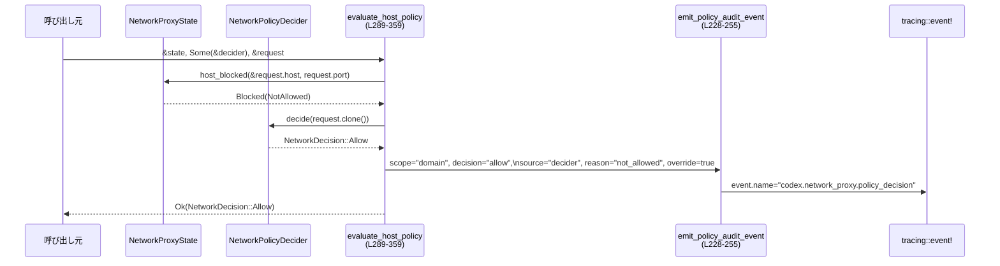

# network-proxy/src/network_policy.rs コード解説

> この解説での行番号は、このファイルの先頭行を `L1` としたものです。  
> 根拠は `network_policy.rs:L開始-終了` の形式で併記します。

---

## 0. ざっくり一言

ネットワークプロキシで「このリクエストを許可するか拒否するか」を決め、その結果を監査ログ（tracing イベント）として出力するためのポリシーモジュールです。  
ドメインベースの基本ポリシーと、外部の「ポリシーデシダ（NetworkPolicyDecider）」からの上書き判断を統合します。

---

## 1. このモジュールの役割

### 1.1 概要

- このモジュールは **ネットワークアクセスの許可／拒否ポリシー決定** を扱います。
- 基本のドメイン許可設定（`NetworkProxyState` 経由）に基づき、ホストが許可されているかを判定します (`evaluate_host_policy`)。  
- 追加で、外部から提供される非同期な `NetworkPolicyDecider` によって、「禁止だが例外的に許可／確認(ask)」といった **上書き** を行えます (`NetworkPolicyDecider` トレイト)。
- すべての決定は **audit イベント** として `tracing::event!` で記録されます (`emit_policy_audit_event`)。

### 1.2 アーキテクチャ内での位置づけ

主な依存関係と、どのコンポーネントが誰を呼び出すかを簡略図にすると以下のようになります。



- `NetworkProxyState`（別モジュール）から基本ポリシー（ホストの許可／拒否）を取得します (`host_blocked`, `network_policy.rs:L289-319`)。
- 任意で渡される `NetworkPolicyDecider` 実装に処理を委譲し、**「not_allowed だが、ユーザー承認により許可」** といった override を表現します (`network_policy.rs:L297-301`)。
- 決定内容は `emit_policy_audit_event` によって 1 つの統一されたイベント名 `codex.network_proxy.policy_decision` で出力されます (`network_policy.rs:L228-255`)。  

テストでは、過去のレガシーイベント名が出力されないことも確認されています (`network_policy.rs:L554-556, L668-673, L671-673, L851-853`)。

### 1.3 設計上のポイント

- **決定の分離**
  - ドメインベースの基本ポリシー（`HostBlockDecision`）と、外部デシダ（`NetworkPolicyDecider`）の判断を明確に分けています (`network_policy.rs:L295-319`)。
- **決定の由来の明示**
  - `NetworkDecisionSource` で「baseline_policy / mode_guard / proxy_state / decider」といった決定元を表現し、監査ログにも埋め込んでいます (`network_policy.rs:L57-75, L244-247, L321-340`)。
- **非同期とスレッド安全性**
  - `NetworkPolicyDecider` は `Send + Sync + 'static` 制約付きの async トレイトとされ、`Arc<dyn NetworkPolicyDecider>` や `Fn(NetworkPolicyRequest) -> impl Future<Output = NetworkDecision> + Send` で実装できます (`network_policy.rs:L266-287`)。
- **監査ログの統一フォーマット**
  - `AUDIT_TARGET` と `POLICY_DECISION_EVENT_NAME` を定数化し、イベントに `scope`, `decision`, `source`, `reason` などの標準フィールドを付与します (`network_policy.rs:L12-20, L228-255`)。
- **理由文字列の安全なデフォルト**
  - 理由文字列が空の場合は `REASON_POLICY_DENIED` を使うことで、「理由なし」の状態を避けます (`network_policy.rs:L140-160`)。

---

## 2. 主要な機能一覧

- ネットワークプロトコル種別の表現とログ用文字列表現 (`NetworkProtocol`, `as_policy_protocol`)  
- ポリシー決定の種類（deny / ask）とその文字列表現 (`NetworkPolicyDecision`, `as_str`)  
- 決定のソース（baseline_policy, mode_guard, …）の表現 (`NetworkDecisionSource`, `as_str`)  
- ネットワークポリシー問い合わせの入力 DTO (`NetworkPolicyRequest`, `NetworkPolicyRequestArgs`)  
- 許可／拒否（または ask）結果の表現 (`NetworkDecision`) とヘルパーコンストラクタ (`deny`, `ask`, `*_with_source`)  
- 非同期なポリシーデシダ用トレイト (`NetworkPolicyDecider`) と、`Arc`・クロージャ向けブランケット実装  
- ドメインベースポリシー＋デシダの結果を統合し、監査イベントを出すメイン関数 (`evaluate_host_policy`)  
- 非ドメイン（例: ローカルソケット）操作に対する監査イベント出力 (`emit_block_decision_audit_event`, `emit_allow_decision_audit_event`)  
- 監査イベント出力の共通処理 (`emit_policy_audit_event`, `audit_timestamp`)  
- テスト用 tracing イベントキャプチャユーティリティ (`test_support::capture_events`, `find_event_by_name`)

---

## 3. 公開 API と詳細解説

### 3.1 型一覧（構造体・列挙体など）

| 名前 | 種別 | 可視性 | 行範囲 | 役割 / 用途 |
|------|------|--------|--------|-------------|
| `NetworkProtocol` | enum | `pub` | `network_policy.rs:L22-38` | HTTP/HTTPS/SOCKS5 のプロトコル種別を表す。監査ログの `network.transport.protocol` に使用。 |
| `NetworkPolicyDecision` | enum | `pub` | `network_policy.rs:L41-55` | 「deny / ask」というポリシー決定種別を表す。`NetworkDecision` 内部や監査フィールドに利用。 |
| `NetworkDecisionSource` | enum | `pub` | `network_policy.rs:L57-75` | 決定のソース（baseline_policy / mode_guard / proxy_state / decider）を表す。 |
| `NetworkPolicyRequest` | struct | `pub` | `network_policy.rs:L77-86` | ポリシー判定に必要な情報（プロトコル、ホスト、ポート、クライアントアドレスなど）を保持するリクエスト DTO。 |
| `NetworkPolicyRequestArgs` | struct | `pub` | `network_policy.rs:L88-96` | `NetworkPolicyRequest::new` の引数用構造体。フィールドは `NetworkPolicyRequest` と同じ。 |
| `NetworkDecision` | enum | `pub` | `network_policy.rs:L121-129` | 許可 (`Allow`) または拒否/要ユーザー確認 (`Deny { .. }`) を表現するメインの結果型。 |
| `BlockDecisionAuditEventArgs<'a>` | struct | `pub(crate)` | `network_policy.rs:L169-177` | 非ドメイン操作の監査イベント出力用の引数。ライフタイム `'a` は文字列フィールドへの参照に対応。 |
| `PolicyAuditEventArgs<'a>` | struct | private | `network_policy.rs:L215-225` | `emit_policy_audit_event` 内部専用の監査イベント引数。 |
| `NetworkPolicyDecider` | trait | `pub` | `network_policy.rs:L266-269` | 非同期に `NetworkPolicyRequest` を評価し `NetworkDecision` を返すインターフェース。 |

テスト用:

| 名前 | 種別 | 可視性 | 行範囲 | 役割 / 用途 |
|------|------|--------|--------|-------------|
| `CapturedEvent` | struct | `pub(crate)` | `network_policy.rs:L395-404` | テストで捕捉した tracing イベントを保持。 |
| `EventCollector` | struct | private | `network_policy.rs:L407-411` | `tracing::Subscriber` 実装。イベントを `CapturedEvent` として蓄積。 |
| `FieldVisitor` | struct | private | `network_policy.rs:L460-463` | tracing イベントのフィールドを文字列化して収集するための訪問者。 |
| `StaticReloader` | struct | private | `network_policy.rs:L558-561` | テスト用の固定 `ConfigState` リローダ。 |
| `NetworkProxyAuditMetadata` 他 | 構造体 | 別モジュール | `network_policy.rs:L545-547` | 監査メタデータを提供（ここでは型名のみ参照）。 |

### 3.2 関数詳細（重要なもの）

#### `NetworkPolicyRequest::new(args: NetworkPolicyRequestArgs) -> NetworkPolicyRequest`

**概要**

引数構造体 `NetworkPolicyRequestArgs` から `NetworkPolicyRequest` を生成するコンストラクタです。フィールドコピーのみで追加ロジックはありません。  
`network_policy.rs:L98-118`

**引数**

| 引数名 | 型 | 説明 |
|--------|----|------|
| `args` | `NetworkPolicyRequestArgs` | ポリシー判定に必要なプロトコル、ホスト、ポート、クライアントアドレスなど。 |

**戻り値**

- `NetworkPolicyRequest` : 同一フィールドを持つリクエストオブジェクト。

**内部処理の流れ**

1. 構造体分配代入で `args` の各フィールドをローカル変数に取り出す (`network_policy.rs:L100-108`)。
2. それらをそのまま `NetworkPolicyRequest` のフィールドとして構築する (`network_policy.rs:L109-117`)。

**Examples（使用例）**

```rust
use crate::network_policy::{NetworkPolicyRequest, NetworkPolicyRequestArgs, NetworkProtocol};

let req = NetworkPolicyRequest::new(NetworkPolicyRequestArgs {
    protocol: NetworkProtocol::Http,            // HTTP リクエストとして扱う
    host: "example.com".to_string(),            // 接続先ホスト
    port: 80,                                   // 接続先ポート
    client_addr: Some("127.0.0.1:12345".into()),// クライアントのアドレス（任意）
    method: Some("GET".into()),                 // HTTP メソッド（任意）
    command: None,                              // 実行コマンド（exec-policy 連携用、任意）
    exec_policy_hint: None,                     // exec-policy 用ヒント、任意
});
```

**Errors / Panics**

- エラーも panic も発生しません。単なるフィールドコピーです。

**Edge cases（エッジケース）**

- フィールドに `None` が渡された場合、そのまま `None` として保持されます。
- `host` が空文字列であっても特別なチェックはありません。

**使用上の注意点**

- この関数はバリデーションを行いません。ホスト名やポートの妥当性検証は呼び出し側か、後続処理（`NetworkProxyState::host_blocked` など）に依存します。

---

#### `NetworkDecision::deny(reason: impl Into<String>) -> NetworkDecision` / `ask(...)`

**概要**

拒否または「ユーザーに確認が必要」という決定を作るためのヘルパーです。ソースは自動的に `Decider` になり、理由文字列が空の場合は `REASON_POLICY_DENIED` に置き換えます。  
`network_policy.rs:L131-166`

**引数**

| 関数 | 引数名 | 型 | 説明 |
|------|--------|----|------|
| `deny` | `reason` | `impl Into<String>` | 拒否理由。空文字列の場合は `REASON_POLICY_DENIED` に置き換え。 |
| `ask`  | `reason` | `impl Into<String>` | ユーザー確認が必要な理由。 |

**戻り値**

- `NetworkDecision::Deny { reason, source: NetworkDecisionSource::Decider, decision: NetworkPolicyDecision::Deny/Ask }`

**内部処理の流れ**

1. `deny` / `ask` はそれぞれ `deny_with_source` / `ask_with_source` を `source = NetworkDecisionSource::Decider` で呼び出します (`network_policy.rs:L132-138`)。
2. `_with_source` 側で `reason.into()` し、空文字列なら `REASON_POLICY_DENIED.to_string()` を採用 (`network_policy.rs:L140-146, L155-160`)。
3. `NetworkDecision::Deny { reason, source, decision }` を構築します。`decision` フィールドは `Deny` か `Ask` になります (`network_policy.rs:L147-152, L161-165`)。

**Examples（使用例）**

```rust
use crate::network_policy::{NetworkDecision, NetworkPolicyDecision, NetworkDecisionSource};
use crate::reasons::REASON_NOT_ALLOWED;

// 拒否決定を作成
let deny_decision = NetworkDecision::deny(REASON_NOT_ALLOWED);
// ask 決定を作成（ユーザーに確認が必要）
let ask_decision = NetworkDecision::ask(REASON_NOT_ALLOWED);

// ask は内部的には Deny バリアント+decision=Ask として表現される
assert_eq!(
    ask_decision,
    NetworkDecision::Deny {
        reason: REASON_NOT_ALLOWED.to_string(),
        source: NetworkDecisionSource::Decider,
        decision: NetworkPolicyDecision::Ask,
    }
);
```

（上の assert は実際にテスト `ask_uses_decider_source_and_ask_decision` で確認されています `network_policy.rs:L887-896`）

**Errors / Panics**

- エラー・panic なし。

**Edge cases**

- 理由が空文字列の場合、`REASON_POLICY_DENIED` が利用されるため、監査ログに空の `network.policy.reason` が出力されることはありません (`network_policy.rs:L140-146, L155-160`)。

**使用上の注意点**

- `Ask` は専用の列挙子ではなく、`NetworkDecision::Deny` + `decision: NetworkPolicyDecision::Ask` で表現されます。このため、呼び出し側は `match` で `Deny { decision: NetworkPolicyDecision::Ask, .. }` という形で判定する必要があります。

---

#### `trait NetworkPolicyDecider`

```rust
#[async_trait]
pub trait NetworkPolicyDecider: Send + Sync + 'static {
    async fn decide(&self, req: NetworkPolicyRequest) -> NetworkDecision;
}
```

**概要**

追加ポリシー（ユーザー承認など）を実装するための非同期デシダです。  
ドメインベースの baseline 判定が「not_allowed」だった場合に呼び出されます (`network_policy.rs:L295-312`)。

**引数**

- メソッド `decide` の引数:

| 引数名 | 型 | 説明 |
|--------|----|------|
| `req` | `NetworkPolicyRequest` | 判定対象のリクエスト。所有権を受け取るため、呼び出し側では `clone` することがあります。 |

**戻り値**

- `NetworkDecision` : Allow / Deny(Ask 含む) のいずれか。

**内部処理の流れ**

- トレイトそのものは実装を持たず、利用側で任意のポリシーを実装します。
- このトレイトには 2 つのブランケット実装が用意されています (`network_policy.rs:L271-287`)。
  - `Arc<D>` に対する実装: 内部の `D: NetworkPolicyDecider` に委譲。
  - `F: Fn(NetworkPolicyRequest) -> Fut` に対する実装: 非同期関数／クロージャをそのままデシダとして扱える。

**Examples（使用例）**

```rust
use crate::network_policy::{
    NetworkPolicyDecider, NetworkDecision, NetworkPolicyRequest, NetworkPolicyRequestArgs,
    NetworkProtocol,
};
use std::sync::Arc;

#[derive(Clone)]
struct MyDecider;

#[async_trait::async_trait]
impl NetworkPolicyDecider for MyDecider {
    async fn decide(&self, req: NetworkPolicyRequest) -> NetworkDecision {
        if req.host == "example.com" {
            NetworkDecision::Allow
        } else {
            NetworkDecision::deny("host not allowed")
        }
    }
}

let decider: Arc<dyn NetworkPolicyDecider> = Arc::new(MyDecider);
```

**Errors / Panics**

- トレイト自体はエラーを返しませんが、実装次第で panic の可能性はあります。

**Edge cases**

- `decide` が `NetworkDecision::Deny` を返す場合、`evaluate_host_policy` 内の `map_decider_decision` によって `source` は強制的に `Decider` に書き換えられます (`network_policy.rs:L361-371`)。

**使用上の注意点**

- トレイトには `Send + Sync + 'static` 制約があるため、実装型はスレッドセーフでかつ `'static` ライフタイムを持つ必要があります (`network_policy.rs:L266-269`)。
- 関数型実装の場合 (`impl<F, Fut> NetworkPolicyDecider for F`)、`F` と `Fut` の両方が `Send` である必要があります (`network_policy.rs:L280-283`)。

---

#### `evaluate_host_policy(state, decider, request) -> Result<NetworkDecision>`

```rust
pub(crate) async fn evaluate_host_policy(
    state: &NetworkProxyState,
    decider: Option<&Arc<dyn NetworkPolicyDecider>>,
    request: &NetworkPolicyRequest,
) -> Result<NetworkDecision>
```

**概要**

1. `NetworkProxyState` にホストが許可されているかを問い合わせる。  
2. `not_allowed` の場合のみ、任意の `NetworkPolicyDecider` に上書き判断を委譲する。  
3. 最終的な `NetworkDecision` を返すとともに、監査イベントを 1 件出力する。  

`network_policy.rs:L289-359`

**引数**

| 引数名 | 型 | 説明 |
|--------|----|------|
| `state` | `&NetworkProxyState` | ネットワークポリシー状態。`host_blocked` でホストの許可／拒否を返す。 |
| `decider` | `Option<&Arc<dyn NetworkPolicyDecider>>` | 追加ポリシーを実装するデシダ。`None` の場合は baseline のみで決定。 |
| `request` | `&NetworkPolicyRequest` | 判定対象リクエスト。デシダ呼び出し時には `clone()` される。 |

**戻り値**

- `Ok(NetworkDecision)` : 許可／拒否(ask) の最終決定。  
- `Err(anyhow::Error)` : `state.host_blocked(..)` がエラーを返した場合に伝播。

**内部処理の流れ（アルゴリズム）**

1. `state.host_blocked(&request.host, request.port).await?` でホストのブロック状態を取得 (`network_policy.rs:L294-295`)。
2. `HostBlockDecision` に応じて `decision` と `policy_override` を決定 (`network_policy.rs:L295-319`)。
   - `Allowed` → `(NetworkDecision::Allow, false)`。
   - `Blocked(NotAllowed)` →  
     - `decider` が Some なら `decider.decide(request.clone()).await` して `map_decider_decision` を通す (`network_policy.rs:L297-301`)。  
       - `decision == Allow` の場合のみ `policy_override = true`。
     - `decider` が None なら baseline による `deny_with_source(..., BaselinePolicy)`。
   - `Blocked(other_reason)` → baseline 由来の deny（`source = BaselinePolicy`, reason = `reason.as_str()`）。
3. 監査用の `(policy_decision, source, reason)` を構成 (`network_policy.rs:L321-340`)。
   - `Allow` かつ `policy_override = true` の場合:
     - `policy_decision = "allow"` (`POLICY_DECISION_ALLOW`)
     - `source = Decider`
     - `reason = HostBlockReason::NotAllowed.as_str()`（baseline の理由を残す）
   - `Allow` かつ `policy_override = false` の場合:
     - `source = BaselinePolicy`
     - `reason = "allow"`（`POLICY_REASON_ALLOW`）
   - `Deny { reason, source, decision }` の場合:
     - `policy_decision = decision.as_str()`（"deny" or "ask"）
     - `source` / `reason` は構造体からそのまま利用。
4. `emit_policy_audit_event` を呼び出し、`scope = "domain"`、`decision` や `source` などを含めた監査イベントを出力 (`network_policy.rs:L342-356`)。
5. 最終的な `decision` を `Ok(decision)` として返す (`network_policy.rs:L358`)。

**Mermaid 処理フロー図**



**Examples（使用例）**

```rust
use crate::network_policy::{
    NetworkPolicyRequest, NetworkPolicyRequestArgs, NetworkProtocol,
    NetworkPolicyDecider, NetworkDecision,
};
use crate::state::network_proxy_state_for_policy;
use crate::config::NetworkProxySettings;
use std::sync::Arc;

// State を構築（詳細は別モジュール）
let state = network_proxy_state_for_policy(NetworkProxySettings::default()); // baseline: 全て not_allowed など

// すべての not_allowed をユーザー許可済みとして override する decider
let decider: Arc<dyn NetworkPolicyDecider> = Arc::new(|_req| async {
    NetworkDecision::Allow
});

let req = NetworkPolicyRequest::new(NetworkPolicyRequestArgs {
    protocol: NetworkProtocol::Http,
    host: "example.com".to_string(),
    port: 80,
    client_addr: None,
    method: Some("GET".to_string()),
    command: None,
    exec_policy_hint: None,
});

// 非同期コンテキストから呼び出す
let decision = evaluate_host_policy(&state, Some(&decider), &req).await?;
assert!(matches!(decision, NetworkDecision::Allow));
```

**Errors / Panics**

- `state.host_blocked(..)` の戻り値が `Err` の場合、そのまま `Err(anyhow::Error)` として返されます (`network_policy.rs:L294-295`)。
- その他、この関数内に `unwrap` や panic はありません。

**Edge cases**

- `decider` が `Some` でも、`HostBlockDecision::Allowed` の場合は一切呼び出されません (`network_policy.rs:L295-297`)。
- `HostBlockDecision::Blocked(NotAllowed)` 以外の `Blocked(reason)` では、`decider` は呼び出されません (`network_policy.rs:L312-318`)。
- `decider` が `Allow` を返した場合のみ `policy_override = true` となり、監査ログの `network.policy.override` が `"true"` になります (`network_policy.rs:L299-301, L354-355`)。
- `decider` が `ask`（＝ `NetworkPolicyDecision::Ask`）を返した場合も、`NetworkDecision::Deny { decision: Ask }` として扱われ、`network.policy.decision` は `"ask"` になります。  
  テスト `evaluate_host_policy_emits_domain_event_for_decider_ask` で確認されています (`network_policy.rs:L723-762`)。

**使用上の注意点**

- この関数は **必ず監査イベントを 1 回出力** します（成功パス）。大量に呼ぶ場合、ログ量に注意が必要です。
- `decider` に重い I/O を実装すると、`evaluate_host_policy` 全体の待ち時間が増加します。非同期 I/O であっても高頻度呼び出し時のレイテンシに注意します。
- `NetworkProxyState` の `host_blocked` の挙動に依存するため、ポリシー変更時には必ずこの関数とテストを確認する必要があります。

---

#### `emit_block_decision_audit_event` / `emit_allow_decision_audit_event`

```rust
pub(crate) fn emit_block_decision_audit_event(
    state: &NetworkProxyState,
    args: BlockDecisionAuditEventArgs<'_>,
)

pub(crate) fn emit_allow_decision_audit_event(
    state: &NetworkProxyState,
    args: BlockDecisionAuditEventArgs<'_>,
)
```

**概要**

ドメインに紐づかない操作（例: Unix ソケット経由の HTTP、ローカルのメソッド制限など）に対する **許可／拒否の監査イベント** を出力するラッパーです。`scope = "non_domain"` で `emit_policy_audit_event` を呼びます。  
`network_policy.rs:L179-191`

**引数**

| 引数名 | 型 | 説明 |
|--------|----|------|
| `state` | `&NetworkProxyState` | 監査メタデータ取得とログ出力に使用。 |
| `args` | `BlockDecisionAuditEventArgs<'_>` | プロトコル、サーバアドレス、ポート、メソッド、クライアントアドレスなど。 |

**戻り値**

- なし。監査イベントを出力するだけです。

**内部処理の流れ**

1. `emit_block_decision_audit_event` は `POLICY_DECISION_DENY` を指定して `emit_non_domain_policy_decision_audit_event` を呼ぶ (`network_policy.rs:L179-184`)。
2. `emit_allow_decision_audit_event` は `POLICY_DECISION_ALLOW` を指定 (`network_policy.rs:L186-191`)。
3. `emit_non_domain_policy_decision_audit_event` が `scope = "non_domain"`, `policy_override = false` で `emit_policy_audit_event` を呼ぶ (`network_policy.rs:L193-213`)。

**Examples（使用例）**

テストの例を簡略化したものです (`network_policy.rs:L809-849`)。

```rust
use crate::network_policy::{
    emit_block_decision_audit_event, BlockDecisionAuditEventArgs,
    NetworkDecisionSource, NetworkProtocol,
};
use crate::state::network_proxy_state_for_policy;
use crate::config::NetworkProxySettings;

let state = network_proxy_state_for_policy(NetworkProxySettings::default());

emit_block_decision_audit_event(
    &state,
    BlockDecisionAuditEventArgs {
        source: NetworkDecisionSource::ModeGuard, // mode_guard 由来の拒否
        reason: crate::reasons::REASON_METHOD_NOT_ALLOWED,
        protocol: NetworkProtocol::Http,
        server_address: "unix-socket",
        server_port: 0,
        method: Some("POST"),
        client_addr: None,
    },
);
```

**Errors / Panics**

- この関数自身は `Result` を返さず、panic も含まれていません。  
- `emit_policy_audit_event` も `tracing::event!` を呼ぶだけなので、通常はエラーを返しません。

**Edge cases**

- `client_addr` や `method` が `None` の場合、監査イベントでは `DEFAULT_CLIENT_ADDRESS`（"unknown"）および `DEFAULT_METHOD`（"none"）が使われます (`network_policy.rs:L251-253`)。

**使用上の注意点**

- `scope` は常に `"non_domain"` 固定であり、ドメイン名ベースの判断を行わない操作（Unix ソケットベースの HTTP など）に利用する前提です。

---

#### `emit_policy_audit_event(state, args)`

**概要**

監査イベントの共通出力処理です。`NetworkProxyState` から監査メタデータを取得し、`tracing::event!` で一括出力します。  
`network_policy.rs:L228-255`

**主なフィールド**

- `event.name = "codex.network_proxy.policy_decision"` (`POLICY_DECISION_EVENT_NAME`, `network_policy.rs:L13`)  
- `event.timestamp` : `audit_timestamp()` で生成した RFC3339 UTC ミリ秒フォーマットの文字列 (`network_policy.rs:L234-235, L257-259`)  
- `conversation.id`, `app.version`, `auth_mode`, `originator`, `user.*`, `terminal.type`, `model`, `slug` など監査メタデータ (`network_policy.rs:L235-243`)  
- `network.policy.scope`, `.decision`, `.source`, `.reason` (`network_policy.rs:L244-247`)  
- `network.transport.protocol`, `server.address`, `server.port`, `http.request.method`, `client.address`, `network.policy.override` (`network_policy.rs:L248-253`)

**Errors / Panics**

- `tracing::event!` は通常エラーを返さず、ここには panic もありません。

**Edge cases**

- `method` / `client_addr` が None の場合、デフォルト値 `"none"` / `"unknown"` を使います (`network_policy.rs:L251-253`)。
- `audit_metadata` の各フィールドが `None` の場合、`as_deref()` により `conversation.id = None` のように設定され、tracing 側ではフィールド未設定として扱われます (`network_policy.rs:L235-243`)。

---

#### `map_decider_decision(decision: NetworkDecision) -> NetworkDecision`

**概要**

`NetworkPolicyDecider` から返された `NetworkDecision` を、「ソースが必ず `Decider` になるように正規化」するヘルパーです。  
`network_policy.rs:L361-371`

**挙動**

- `Allow` の場合はそのまま返す (`network_policy.rs:L363`)。
- `Deny { reason, decision, .. }` の場合、新たに `source: NetworkDecisionSource::Decider` を設定した `Deny { reason, source: Decider, decision }` を返す (`network_policy.rs:L364-370`)。

**契約**

- これにより、デシダ実装が `source` を別の値（例: BaselinePolicy）にしても、最終的な決定の `source` は必ず `Decider` になります。

---

### 3.3 その他の関数（本番コード）

| 関数名 | 可視性 | 行範囲 | 役割（1 行） |
|--------|--------|--------|--------------|
| `NetworkProtocol::as_policy_protocol` | `pub` | `network_policy.rs:L30-38` | プロトコルを監査フィールド用の文字列（"http" など）に変換。 |
| `NetworkPolicyDecision::as_str` | `pub` | `network_policy.rs:L48-55` | "deny" / "ask" 文字列表現を返す。 |
| `NetworkDecisionSource::as_str` | `pub` | `network_policy.rs:L66-75` | "baseline_policy" などの文字列表現を返す。 |
| `audit_timestamp` | private | `network_policy.rs:L257-259` | 現在時刻を RFC3339 UTC ミリ秒フォーマットの文字列に変換。 |

テスト支援関数:

| 関数名 | 可視性 | 行範囲 | 役割（1 行） |
|--------|--------|--------|--------------|
| `CapturedEvent::field` | `pub` | `network_policy.rs:L401-404` | イベントフィールドの値を名前で取得。 |
| `EventCollector::events` | private | `network_policy.rs:L413-419` | 内部に蓄積したイベントのスナップショットを返す。 |
| `FieldVisitor::insert` | private | `network_policy.rs:L465-468` | 任意型の値を文字列化してフィールドマップに保存。 |
| `capture_events` | `pub(crate)` | `network_policy.rs:L509-519` | 一時的に `EventCollector` をデフォルト subscriber にし、非同期処理中のイベントを捕捉する。 |
| `find_event_by_name` | `pub(crate)` | `network_policy.rs:L521-528` | `event.name` フィールドで特定のイベントを検索。 |
| `state_with_metadata` | private | `network_policy.rs:L578-590` | テスト用に `NetworkProxyAuditMetadata` を持った `NetworkProxyState` を構築。 |
| `is_rfc3339_utc_millis` | private | `network_policy.rs:L592-608` | 文字列が yyyy-MM-ddTHH:mm:ss.SSSZ 形式かをチェック。 |

---

## 4. データフロー

### 4.1 代表的シナリオ：ドメインポリシー + デシダによる override

以下は `evaluate_host_policy (L289-359)` が、`HostBlockDecision::Blocked(NotAllowed)` をデシダの `Allow` により override するケースです。テスト `evaluate_host_policy_emits_domain_event_for_decider_allow_override` で検証されています (`network_policy.rs:L610-675`)。



このとき監査イベントには以下のようなフィールドが出力されることがテストで確認されています (`network_policy.rs:L643-662`)。

- `network.policy.scope = "domain"`
- `network.policy.decision = "allow"`
- `network.policy.source = "decider"`
- `network.policy.reason = REASON_NOT_ALLOWED`
- `network.policy.override = "true"`

### 4.2 テストで確認されている主要な契約

テストモジュール（`network_policy.rs:L531-897`）では次の点が確認されています。

- **Decider override ありの domain イベント**  
  `evaluate_host_policy_emits_domain_event_for_decider_allow_override` (`L610-675`)  
  - `decider` が 1 回だけ呼ばれること (`calls` カウンタ)。
  - イベントターゲット、スコープ、decision/source/reason/override フィールドが期待通り。
  - レガシーイベント名（`domain_policy_decision`, `block_decision`）は出力されない。

- **Baseline deny の domain イベント**  
  `evaluate_host_policy_emits_domain_event_for_baseline_deny` (`L677-721`)  
  - `NetworkProxySettings` の allow/deny ドメイン設定に基づく拒否。
  - `network.policy.source = "baseline_policy"`, `override = "false"`。

- **Decider ask の domain イベント**  
  `evaluate_host_policy_emits_domain_event_for_decider_ask` (`L723-762`)  
  - `network.policy.decision = "ask"`、`source = "decider"`。

- **監査メタデータフィールドの埋め込み**  
  `evaluate_host_policy_emits_metadata_fields` (`L764-806`)  
  - `conversation.id`, `app.version` などがイベントに含まれる。

- **non_domain イベント**  
  `emit_block_decision_audit_event_emits_non_domain_event` (`L808-853`)  
  - `network.policy.scope = "non_domain"`、`decision = "deny"`、`source = "mode_guard"`。

- **ローカルバインディング禁止**  
  `evaluate_host_policy_still_denies_not_allowed_local_without_decider_override` (`L856-884`)  
  - `allow_local_binding = false` の場合、ローカルアドレスは baseline で deny され、decider なしでは override されない。

- **`ask` ヘルパーの挙動**  
  `ask_uses_decider_source_and_ask_decision` (`L887-896`)  
  - `NetworkDecision::ask` が `source = Decider`, `decision = Ask` であること。

---

## 5. 使い方（How to Use）

### 5.1 基本的な使用方法

典型的なフロー（プロキシ内部からの使用）:

```rust
use crate::network_policy::{
    NetworkPolicyRequest, NetworkPolicyRequestArgs, NetworkProtocol,
    NetworkPolicyDecider, NetworkDecision, evaluate_host_policy,
};
use crate::state::NetworkProxyState;
use std::sync::Arc;

// 1. NetworkProxyState を用意する（詳細は別モジュール）
fn get_state() -> NetworkProxyState {
    // 例: アプリ共通の NetworkProxyState を取得
    unimplemented!()
}

#[tokio::main(flavor = "current_thread")]
async fn main() -> anyhow::Result<()> {
    let state = get_state();

    // 2. 任意の decider を用意する（必要なければ None）
    let decider: Arc<dyn NetworkPolicyDecider> = Arc::new(|_req| async {
        // ここでは単純に baseline を尊重するため、常に ask にしてユーザー判断に委ねる例
        NetworkDecision::ask("user approval required")
    });

    // 3. 判定したいリクエストを構築
    let request = NetworkPolicyRequest::new(NetworkPolicyRequestArgs {
        protocol: NetworkProtocol::Http,
        host: "example.com".to_string(),
        port: 80,
        client_addr: Some("127.0.0.1:12345".into()),
        method: Some("GET".into()),
        command: Some("curl https://example.com".into()),
        exec_policy_hint: Some("curl *".into()),
    });

    // 4. ポリシー判定を実行
    let decision = evaluate_host_policy(&state, Some(&decider), &request).await?;

    // 5. 結果に応じて処理を分岐
    match decision {
        NetworkDecision::Allow => {
            // 接続を許可
        }
        NetworkDecision::Deny { decision, reason, .. } => {
            match decision {
                crate::network_policy::NetworkPolicyDecision::Deny => {
                    // 即時拒否
                    eprintln!("Denied: {reason}");
                }
                crate::network_policy::NetworkPolicyDecision::Ask => {
                    // ユーザーに確認してから決定
                    eprintln!("User confirmation needed: {reason}");
                }
            }
        }
    }

    Ok(())
}
```

### 5.2 よくある使用パターン

1. **クロージャベースの簡易デシダ**

   テストと同様、`Arc::new(|req| async { .. })` で簡単にデシダを定義できます (`network_policy.rs:L725-731`)。

   ```rust
   let decider: Arc<dyn NetworkPolicyDecider> = Arc::new(|req| async move {
       if req.host.ends_with(".trusted.example") {
           NetworkDecision::Allow
       } else {
           NetworkDecision::deny("untrusted domain")
       }
   });
   ```

2. **デシダなしで baseline のみ利用**

   - `evaluate_host_policy(&state, None, &request)` とすると、`HostBlockDecision` の結果だけで決定します (`network_policy.rs:L302-310, L312-318`)。

3. **exec-policy と組み合わせる**

   - `command` / `exec_policy_hint` フィールドを利用し、「exec-policy が許可したコマンドパターンに一致するネットワークアクセスを許可する」ようなロジックを `NetworkPolicyDecider` に実装できます。  
     （exec-policy 実装自体はこのファイルには現れませんが、doc コメントで意図が述べられています `network_policy.rs:L261-265`。）

### 5.3 よくある間違い

```rust
// NG 例: NetworkPolicyDecider を Send/Sync でない型で実装
struct MyDecider {
    // Rc や RefCell などを含めると Send/Sync ではなくなる可能性
}

// #[async_trait] の impl でコンパイルエラーになる可能性がある

// NG 例: Ask 専用のバリアントがあると勘違いする
// match decision {
//     NetworkDecision::Ask => { ... } // これは存在しない
// }

// 正しい例: Deny バリアントの中の decision フィールドを見る
match decision {
    NetworkDecision::Deny { decision, .. } => match decision {
        NetworkPolicyDecision::Ask => { /* ユーザー確認 */ }
        NetworkPolicyDecision::Deny => { /* 即時拒否 */ }
    },
    NetworkDecision::Allow => { /* 許可 */ }
}
```

### 5.4 使用上の注意点（まとめ）

- **スレッド安全性**
  - `NetworkPolicyDecider` 実装は `Send + Sync + 'static` を満たす必要があります (`network_policy.rs:L266-269`)。`Arc` や `Mutex` などを適切に使う必要があります。
- **エラー伝播**
  - `evaluate_host_policy` の唯一のエラー源は `state.host_blocked(..)` の `?` です (`network_policy.rs:L294-295`)。この関数のエラー契約を確認する必要があります。
- **監査ログの内容**
  - ログにはユーザーアカウント ID、メールアドレス、クライアントアドレス、ホスト名など **個人・環境に紐付く情報** が含まれます (`network_policy.rs:L235-243, L248-253`)。
  - ログの保存期間やアクセス権限はアプリケーション側で管理する必要があります。
- **パフォーマンス**
  - すべての判定で `tracing::event!` を呼び出すため、高頻度のネットワークアクセス環境ではログ出力量を考慮する必要があります。
  - `decider` 側で重い処理（外部サービス呼び出しなど）を行うと、ネットワークアクセスのレイテンシに直結します。非同期かつキャッシュなどの工夫が必要です。
- **契約の拡張**
  - 新しい `NetworkDecisionSource` や `NetworkPolicyDecision` のバリアントを追加する場合、監査ログとテストのアップデートを忘れない必要があります。

---

## 6. 変更の仕方（How to Modify）

### 6.1 新しい機能を追加する場合

1. **新しいプロトコルをサポートする場合**
   - `NetworkProtocol` にバリアントを追加 (`network_policy.rs:L22-27`)。
   - `as_policy_protocol` に対応する文字列を追加 (`network_policy.rs:L30-38`)。
   - プロキシ本体側で新プロトコルからのリクエスト生成に `NetworkProtocol` を使うようにする。

2. **新しい決定ソースを追加したい場合**
   - `NetworkDecisionSource` に新しいバリアントを追加 (`network_policy.rs:L59-63`)。
   - `as_str` に文字列表現を追加 (`network_policy.rs:L66-75`)。
   - 使用箇所（`emit_block_decision_audit_event` など）で新ソースを指定する。

3. **監査イベントに新しいフィールドを追加する場合**
   - `PolicyAuditEventArgs` にフィールドを追加 (`network_policy.rs:L215-225`)。
   - `emit_policy_audit_event` の `tracing::event!` 内に新フィールドを追加 (`network_policy.rs:L228-255`)。
   - `BlockDecisionAuditEventArgs` や `evaluate_host_policy` から `PolicyAuditEventArgs` を構築する部分を更新 (`network_policy.rs:L193-213, L342-355`)。
   - テスト (`capture_events` + `find_event_by_name`) を更新して新フィールドを検証。

### 6.2 既存の機能を変更する場合

- **ポリシー決定ロジックを変更したい場合**
  - 中心は `evaluate_host_policy` の `match host_decision` 部分です (`network_policy.rs:L295-319`)。
  - 変更前に以下を確認します:
    - `HostBlockDecision` と `HostBlockReason` の定義（別モジュール）。
    - テスト `evaluate_host_policy_*` がカバーしているシナリオ (`network_policy.rs:L610-762, L856-884`)。
  - 変更後は必ず関連テストを修正または追加し、監査イベントのフィールドも期待通りであることを確認します。

- **監査ログの形式を変えたい場合**
  - `emit_policy_audit_event` を変更する際、`test_support::capture_events` + `find_event_by_name` を活用したテストが多数依存している点に注意 (`network_policy.rs:L509-528, L610-806, L809-853`)。
  - 互換性維持が必要なら、新フィールドを追加する一方で既存フィールドは残す、といった方針が適切です。

---

## 7. 関連ファイル

| パス | 役割 / 関係 |
|------|------------|
| `crate::state::NetworkProxyState` | `evaluate_host_policy` から `host_blocked(&host, port)` が呼ばれ、ホストの許可／拒否を返す (`network_policy.rs:L289-295`)。また `audit_metadata()` を提供し監査メタデータを埋め込む (`network_policy.rs:L228-243`)。 |
| `crate::runtime::HostBlockDecision` / `HostBlockReason` | ドメインベースのブロック判定とその理由を表現。`evaluate_host_policy` で `match` され、`NetworkDecision` や監査ログに変換される (`network_policy.rs:L295-319, L321-333`)。 |
| `crate::reasons::*` | `REASON_POLICY_DENIED`, `REASON_DENIED`, `REASON_NOT_ALLOWED`, `REASON_NOT_ALLOWED_LOCAL`, `REASON_METHOD_NOT_ALLOWED` などの理由定数。`NetworkDecision` の `reason` フィールドや監査ログ `network.policy.reason` に使用 (`network_policy.rs:L1, L140-160, L539-542, L817-843`)。 |
| `crate::config::NetworkProxySettings`, `NetworkProxyConfig`, `NetworkMode` | テストで `NetworkProxyState` を構築するために使用。allowed/denied ドメインやローカルバインディング許可設定を決定 (`network_policy.rs:L536-538, L579-583, L677-684, L858-862`)。 |
| `crate::runtime::{ConfigReloader, ConfigState, NetworkProxyAuditMetadata}` | テスト用の `StaticReloader` や監査メタデータ構築に利用 (`network_policy.rs:L543-545, L558-576, L764-776`)。 |
| `tracing` クレート | 監査イベントの出力 (`tracing::event!`) とテスト用のカスタム `Subscriber` 実装 (`EventCollector`) に使用 (`network_policy.rs:L228-255, L378-394, L422-458`)。 |

このモジュールは、ネットワークプロキシ全体の **「ポリシー決定と監査ログ出力」** の中心に位置し、`NetworkProxyState`・`HostBlockDecision` などのドメイン設定と、`NetworkPolicyDecider` による拡張ポリシーを橋渡しする役割を持ちます。
