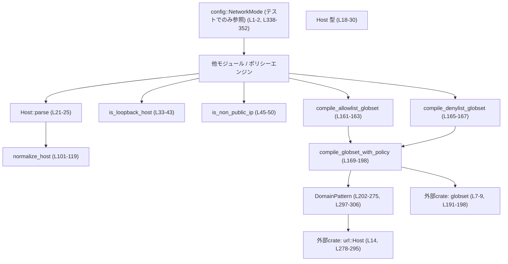
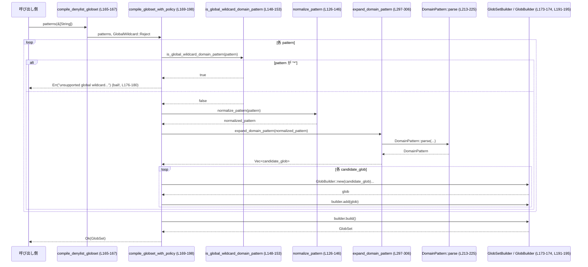

# network-proxy/src/policy.rs コード解説

---

## 0. ざっくり一言

このモジュールは、ネットワークアクセスのポリシー評価に必要な **ホスト名の正規化・ローカル/非公開 IP の検出・ドメインワイルドカードパターンの解釈と `globset` へのコンパイル** を行うユーティリティ群です（`network-proxy/src/policy.rs:L18-198, L202-329`）。

---

## 1. このモジュールの役割

### 1.1 概要

- このモジュールは、**SSRF 対策などで「どこへのアクセスを許可するか/禁止するか」を判定するための前処理**を提供します。
- 具体的には:
  - ホスト文字列を正規化して `Host` 型で保持し（`Host::parse`, `normalize_host`）、  
  - ホスト/IP がループバック/非公開アドレスかどうかを判定し（`is_loopback_host`, `is_non_public_ip`）、  
  - ドメインパターン（`example.com`, `*.example.com`, `**.example.com`, `*` など）を `globset::GlobSet` にコンパイルして、効率的なホストマッチングを行えるようにします（`compile_*_globset`）。

### 1.2 アーキテクチャ内での位置づけ

このチャンクから分かる依存関係を簡略化して図示します。



- 実運用でこのモジュールを呼び出すコードは、このチャンクには現れません。  
  テストコードからは `crate::config::NetworkMode` が HTTP メソッド制限に関係していることだけが分かります（`network-proxy/src/policy.rs:L1-2, L338-352`）。

### 1.3 設計上のポイント

- **不変な新しい型による正規化の保証**  
  `Host` の内部フィールドは非公開で、唯一のコンストラクタ `Host::parse` が `normalize_host` を通すため、常に正規化されたホスト文字列だけが `Host` として扱われます（`L18-29, L21-23, L101-124`）。
- **副作用のない関数群**  
  すべての関数は引数のみを参照し、グローバル状態を持ちません。`HashSet` や `GlobSetBuilder` も関数ローカルでのみ使われるため、スレッド安全性の面で扱いやすい設計です（`L169-198`）。
- **エラーハンドリングに `anyhow` を使用**  
  - 空ホストの場合は `ensure!` で `Result` をエラーにします（`Host::parse`, `L21-24`）。  
  - 禁止されたパターン（denylist での `"*"`）や不正な glob パターンは `bail!` / `with_context` で詳細付きのエラーとして返されます（`L176-179, L191-195`）。
- **SSRF 対策を意識した IP 判定**  
  非公開 IP 判定は標準ライブラリのヘルパと複数の CIDR チェックを組み合わせ、RFC に定義された各種非公開/予約アドレスを「非公開」とみなす方針になっています（`L52-69, L83-98`）。
- **ドメインパターンを 3 種類の形に抽象化**  
  `DomainPattern` は `"example.com"` / `"*.example.com"` / `"**.example.com"` をそれぞれ `Exact`, `SubdomainsOnly`, `ApexAndSubdomains` として表現し、制約比較 (`allows`) を低コストで行えるようにしています（`L202-206, L213-275`）。

---

## 2. 主要な機能一覧

- ホスト正規化用の新しい型 `Host` とパーサ: 文字列ホストを正規化して保持（`L18-29, L101-124`）
- ループバックホスト判定: `localhost` やループバック IP かを判定（`is_loopback_host`, `L32-43`）
- 非公開 IP 判定: IPv4/IPv6/IPv4 マップを含む非公開アドレスかどうかを判定（`is_non_public_ip`, `L45-50; L52-69; L83-98`）
- ホスト文字列の正規化: 空白除去・ポート/角括弧除去・小文字化・末尾ドット除去（`normalize_host`, `L101-119`）
- ドメインパターンの正規化: `"*.Example.COM."` などを `"*.example.com"` に正規化（`normalize_pattern`, `L126-146`）
- グローバルワイルドカードの検出: パターンが `"*"` 相当かを検出（`is_global_wildcard_domain_pattern`, `L148-153`）
- allowlist / denylist 用 `GlobSet` のコンパイル: ドメインパターンリストから `GlobSet` を構築（`compile_allowlist_globset`, `compile_denylist_globset`, `L161-167, L169-198`）
- ドメインパターンの解析と制約比較: `DomainPattern::parse`, `parse_for_constraints`, `allows` による表現・比較（`L202-275`）
- サブドメイン判定ユーティリティ: `domain_eq`, `is_subdomain_or_equal`, `is_strict_subdomain`（`L309-329`）

---

## 3. 公開 API と詳細解説

### 3.1 型一覧（構造体・列挙体など）

| 名前 | 種別 | 公開範囲 | 役割 / 用途 | 定義位置 |
|------|------|----------|-------------|----------|
| `Host` | 構造体（`String` の薄いラッパー） | `pub` | ポリシー評価用に正規化されたホスト文字列を表現する新しい型。API経由で常に正規化済みであることを保証します。 | `network-proxy/src/policy.rs:L18-29` |
| `GlobalWildcard` | 列挙体 | private | グローバルワイルドカード `*` をパターンとして許可するか（allowlist用）拒否するか（denylist用）を内部的に表すフラグです。 | `L155-159` |
| `DomainPattern` | 列挙体 | `pub(crate)` | ドメインパターンを `Exact`, `SubdomainsOnly ("*.")`, `ApexAndSubdomains ("**.")` の 3 形に分類して保持・比較するための内部表現です。 | `L201-206` |

### 3.2 関数詳細（代表 7 件）

#### `Host::parse(input: &str) -> Result<Self>`

**概要**

- 生のホスト文字列を受け取り、`normalize_host` で正規化した上で `Host` 型を生成します（`L21-23, L101-124`）。
- 正規化の結果が空文字列の場合はエラーを返し、「空ホスト」を防ぎます（`L23`）。

**引数**

| 引数名 | 型 | 説明 |
|--------|----|------|
| `input` | `&str` | 任意のホスト文字列。ホスト名/IPv4/IPv6（角括弧付きや `:port` 付きも可）を想定します。 |

**戻り値**

- `Result<Host>` (`anyhow::Result` 型エイリアス経由, `L4`)  
  - `Ok(Host)` : `normalize_host(input)` の結果が空でない場合、その文字列を内部に保持する `Host` を返します。  
  - `Err` : 正規化結果が空だった場合、メッセージ `"host is empty"` を持つエラーになります（`ensure!`, `L23`）。

**内部処理の流れ**

1. `normalize_host(input)` を呼び出して、空白除去・ポート/角括弧除去・小文字化などを行います（`L21-23, L101-119`）。
2. `ensure!(!normalized.is_empty(), "host is empty")` により、結果が空ならエラーとして早期リターンします（`L23`）。
3. 問題なければ `Host(normalized)` を生成して `Ok(Self(normalized))` として返します（`L24`）。

**Examples（使用例）**

```rust
use anyhow::Result;

fn demo_host_parse() -> Result<()> {
    // 余計な空白とポートを含むホスト
    let host = Host::parse("  ExAmPlE.CoM:443  ")?; // 正規化される (L21-24, L101-119)
    assert_eq!(host.as_str(), "example.com");        // 小文字化 + ポート除去 + 末尾ドット除去

    // IPv6 角括弧付き
    let v6 = Host::parse("[::1]:443")?;
    assert_eq!(v6.as_str(), "::1");                  // 角括弧 + ポートを除去 (L101-107)

    Ok(())
}
```

**Errors / Panics**

- `Errors`
  - 入力が空文字列、または空白・ポート/角括弧除去の結果として空文字列になった場合に `Err("host is empty")` を返します（`L21-23`）。
- `Panics`
  - この関数自身はパニックしません（`normalize_host` 内にも `unwrap` がありますが、コロン数をチェックしているため `unwrap_or_default` のみでパニックはありません `L111-113`）。

**Edge cases（エッジケース）**

- `"   "` のような空白だけの入力 → 正規化後に空文字となりエラー（`L101-103, L23`）。
- `"example.com.:443"` → `"example.com"` に正規化されます（末尾ドット + ポート除去, `L101-119, L450-457`）。
- IPv6 リテラルが角括弧無しで `example` のように与えられた場合: `normalize_host` は IPv6 と仮定せず、生文字列を小文字化＋末尾ドット除去のみ行います（`L116-118`）。

**使用上の注意点**

- `Host` のフィールドは非公開であり、唯一の生成方法が `Host::parse` のため、**常にこの関数経由で生成されることを前提とした正規化ロジック**になっています（`L18-29`）。
- ホスト文字列の妥当性（RFC 準拠かどうか）は検証しません。ドメイン名の厳密な検証が必要な場合は、`UrlHost::parse` を使う `parse_domain_for_constraints` 系の API を利用する必要があります（`L278-295`）。

---

#### `pub fn is_loopback_host(host: &Host) -> bool`

**概要**

- 与えられた `Host` が **`localhost` 系のホスト名** または **ループバックアドレスの IP リテラル**かどうかを判定します（`L32-43`）。
- IPv6 のゾーン ID（`%eth0` のようなサフィックス）も考慮し、IP 部分だけを判定対象にします（`L35`）。

**引数**

| 引数名 | 型 | 説明 |
|--------|----|------|
| `host` | `&Host` | `Host::parse` で正規化されたホスト。`Host::as_str` で内部の文字列を取得して判定します。 |

**戻り値**

- `bool`  
  - `true`: `localhost`（大文字小文字・末尾ドットを無視）またはループバックアドレス（IPv4/IPv6/ゾーン付き）である場合。  
  - `false`: それ以外。

**内部処理の流れ**

1. `Host::as_str` で内部文字列を取得（`L34, L27-29`）。
2. `split_once('%')` でゾーン ID を除去し、`"::1%lo0"` → `"::1"` のように IP 部分のみを取り出します（`L35`）。
3. `== "localhost"` なら `true` を返します（`L36-37`）。  
   ※ `Host::parse` により `"LOCALHOST"`, `"localhost."` なども `"localhost"` に正規化されています（`L101-124, L396-399`）。
4. そうでなければ `host.parse::<IpAddr>()` を試み、成功した場合は `ip.is_loopback()` の結果を返します（`L39-40`）。
5. どちらにも該当しない場合は `false` を返します（`L42`）。

**Examples（使用例）**

```rust
fn demo_loopback() -> anyhow::Result<()> {
    let localhost = Host::parse("LOCALHOST.")?;
    assert!(is_loopback_host(&localhost)); // true (L32-43, L396-399)

    let loopback_v4 = Host::parse("127.0.0.1")?;
    assert!(is_loopback_host(&loopback_v4)); // true (L39-40, L404-407)

    let public = Host::parse("8.8.8.8")?;
    assert!(!is_loopback_host(&public));     // false

    Ok(())
}
```

**Errors / Panics**

- この関数自体は `Result` を返さず、エラーもパニックも発生しません。  
  不正な IP 文字列は `parse::<IpAddr>()` が失敗し、その場合は単に `false` を返します（`L39-42`）。

**Edge cases（エッジケース）**

- `"localhost"` / `"LOCALHOST"` / `"localhost."` → すべて `true`（`Host::parse` の正規化 + `L36-37, L396-399`）。
- `"127.0.0.1%eth0"` → `%` 以降が無視され、IP 部分がループバックなので `true`（`L35, L39-40`）。
- `"127.0.0.1:80"` のような文字列は、`Host::parse` がポートを除去して `"127.0.0.1"` にするため、意図通りループバックと判定されます（`L101-113`）。
- `"localhost.localdomain"` のようなホスト名は `'localhost'` とは別扱いで、ループバックとはみなしません。

**使用上の注意点**

- 引数は `Host` 型であり、**必ず `Host::parse` を通して正規化してから渡す**前提の API です。  
  そのため、末尾ドットや大文字小文字を直接考慮する必要はありません。
- この関数は **DNS 解決を行いません**。ホスト名がループバック IP に解決されるかどうかは別途 resolver 側の責務です。

---

#### `pub fn is_non_public_ip(ip: IpAddr) -> bool`

**概要**

- 与えられた `IpAddr` が **非公開またはローカル利用向けの IP アドレスかどうか**を判定します（`L45-50`）。
- IPv4/IPv6 それぞれに対して、標準ライブラリの分類ヘルパと CIDR ベースのチェックを組み合わせています（`L52-69, L83-98`）。
- SSRF 防止などで「ローカル IP へのアクセスを禁止する」といった用途を想定した判定ロジックです（コメント, `L52-69, L87-92`）。

**引数**

| 引数名 | 型 | 説明 |
|--------|----|------|
| `ip` | `IpAddr` | 判定対象の IP アドレス（IPv4 または IPv6）。 |

**戻り値**

- `bool`  
  - `true`: 非公開（プライベート/ループバック/リンクローカル/予約等）であると判定された場合。  
  - `false`: 公開インターネット向けグローバル IP とみなせる場合。

**内部処理の流れ**

1. `match ip` で IPv4/IPv6 を判別し、それぞれ `is_non_public_ipv4` / `is_non_public_ipv6` に委譲します（`L45-49`）。
2. **IPv4 (`is_non_public_ipv4`)**（`L52-69`）では以下の条件の論理和です:
   - `ip.is_loopback()`（127.0.0.0/8, `L56`）
   - `ip.is_private()`（10.0.0.0/8, 172.16.0.0/12, 192.168.0.0/16, `L57`）
   - `ip.is_link_local()`（169.254.0.0/16, `L58`）
   - `ip.is_unspecified()`（0.0.0.0, `L59`）
   - `ip.is_multicast()`（224.0.0.0/4, `L60`）
   - `ip.is_broadcast()`（255.255.255.255 等, `L61`）
   - 追加の CIDR チェック（`ipv4_in_cidr`, `L62-69`）:  
     - 0.0.0.0/8（"this network"）  
     - 100.64.0.0/10（CGNAT）  
     - 192.0.0.0/24, 192.0.2.0/24, 198.18.0.0/15, 198.51.100.0/24, 203.0.113.0/24, 240.0.0.0/4 など RFC で予約されたブロック。
3. **IPv6 (`is_non_public_ipv6`)**（`L83-98`）では:
   - IPv4 マップアドレス（`::ffff:X.Y.Z.W`）の場合、対応する IPv4 に対して `is_non_public_ipv4` を適用し、さらに元の IPv6 がループバックなら `true`（`L84-85`）。
   - それ以外では「グローバルにルーティング可能でないもの」をローカル扱いとして、以下の条件の論理和となっています（コメント `L87-92`, 本体 `L93-97`）:
     - `ip.is_loopback()`（`::1`）
     - `ip.is_unspecified()`（`::`）
     - `ip.is_multicast()`
     - `ip.is_unique_local()`（`fc00::/7`）
     - `ip.is_unicast_link_local()`（`fe80::/10`）

**Examples（使用例）**

```rust
use std::net::IpAddr;

fn demo_non_public_ip() {
    assert!(is_non_public_ip("127.0.0.1".parse::<IpAddr>().unwrap())); // ループバック (L411-413)
    assert!(is_non_public_ip("10.0.0.1".parse().unwrap()));           // プライベート (L413)
    assert!(!is_non_public_ip("8.8.8.8".parse().unwrap()));           // 公開 (L423)

    // IPv4 マップ IPv6
    assert!(is_non_public_ip("::ffff:10.0.0.1".parse().unwrap()));    // 非公開 (L425-426)
    assert!(!is_non_public_ip("::ffff:8.8.8.8".parse().unwrap()));    // 公開 (L427)
}
```

**Errors / Panics**

- `is_non_public_ip` 自体は `Result` ではなく、エラーもパニックも発生しません。
- 変換 `"<文字列>".parse::<IpAddr>()` に失敗した場合は、呼び出し側の責務として `Result` を処理する必要があります（テストでは `unwrap()` を使用, `L411-427`）。

**Edge cases（エッジケース）**

- `0.1.2.3` のような 0.0.0.0/8 のアドレスは `"this network"` として非公開扱いになります（`ipv4_in_cidr(... [0,0,0,0], 8)`, `L62, L421-422`）。
- RFC の TEST-NET やベンチマーク用のブロック（例: `192.0.2.0/24`, `198.18.0.0/15`）も非公開扱いです（`L62-69, L416-420`）。
- IPv6 ドキュメント用レンジ（例: `2001:db8::/32`）などはコードからは特別扱いされておらず、標準ライブラリのフラグに従った扱いになります（このチャンクにはテストがありません）。

**使用上の注意点**

- この関数は **「文字列表現」ではなく `IpAddr` を引数に取る**ため、ホスト名からの DNS 解決は別のレイヤーで行う必要があります。
- SSRF 対策として利用する場合、**ホスト名が IP リテラルでない場合**は別途 `is_loopback_host` などのホスト名ベースの判定と組み合わせる必要があります。

---

#### `pub fn normalize_host(host: &str) -> String`

**概要**

- ポリシー評価用にホスト文字列を正規化します（`L100-119`）。
- 主な正規化内容:
  - 先頭/末尾の空白除去（`trim`）
  - IPv6 角括弧 `[]` の除去（`[::1]` → `::1`）
  - `host:port` 形式のポート部分の除去（ただし `:` が 1 個の場合のみ）
  - 小文字化
  - 末尾のドットの除去（FQDN とその短縮形を同一視）

**引数**

| 引数名 | 型 | 説明 |
|--------|----|------|
| `host` | `&str` | 任意のホスト文字列。空白やポート情報、角括弧付き IPv6 も許容します。 |

**戻り値**

- `String`  
  正規化されたホスト文字列。空白・ポート・角括弧・末尾ドットが除去され、小文字化されています。

**内部処理の流れ**

1. `host.trim()` で前後の空白を削除（`L102`）。
2. 文字列が `'['` で始まり `']'` を含む場合、最初の `']'` までを IPv6 リテラルとして扱い、その中身だけを `normalize_dns_host` に渡します（`L103-107`）。
3. そうでなければ、`host` 内の `':'` のバイト数を数え、**ちょうど 1 個**であれば `split(':').next()` でホスト部分だけを取り出して `normalize_dns_host` に渡します（`L111-113`）。
4. それ以外の場合（`:` が 0 個 or 2 個以上）は unbracketed IPv6 などとみなし、そのまま `normalize_dns_host` に渡します（`L116-118`）。
5. `normalize_dns_host` では `to_ascii_lowercase` と末尾ドット除去を行います（`L121-124`）。

**Examples（使用例）**

```rust
fn demo_normalize_host() {
    assert_eq!(normalize_host("  ExAmPlE.CoM  "), "example.com");      // 空白 + 大文字 (L435-437)
    assert_eq!(normalize_host("example.com:1234"), "example.com");    // ポート除去 (L439-442)
    assert_eq!(normalize_host("example.com."), "example.com");        // 末尾ドット除去 (L450-452)
    assert_eq!(normalize_host("[::1]:443"), "::1");                   // 角括弧 + ポート除去 (L389-393, L103-107)
    assert_eq!(normalize_host("2001:db8::1"), "2001:db8::1");         // 非角括弧 IPv6 はそのまま (L445-447)
}
```

**Errors / Panics**

- エラーやパニックは発生しません。  
  `split(':').next().unwrap_or_default()` は必ず `Some` を返すためパニックしません（`L111-113`）。

**Edge cases（エッジケース）**

- `":80"` のような文字列: `':'` が 1 個なので、`split(':').next()` は空文字列を返し、結果は `""` になります（`L111-113`）。  
  その場合、`Host::parse` 側で空判定によりエラーとなります（`L21-24`）。
- `"2001:db8::1:443"` のような **角括弧なしの IPv6 + ポート表現**は、`:` が複数あるためポートとみなされず、そのまま全体がホストと解釈されます（`L111-118`）。  
  これは意図的に「非標準の書式を特別扱いしない」挙動と考えられます。
- 非 ASCII の大文字は `to_ascii_lowercase` により ASCII 部分だけ小文字化されます（`L121-124`）。

**使用上の注意点**

- ポート部分の除去は `:` が 1 個のときだけ行われるため、IPv6 でポートを付ける場合は **必ず角括弧で囲む**（例: `[2001:db8::1]:443`）必要があります（`L103-107`）。
- この関数は **DNS 解決やドメイン構文チェックは行いません**。純粋な文字列変換であることに注意が必要です。

---

#### `pub(crate) fn compile_denylist_globset(patterns: &[String]) -> Result<GlobSet>`

**概要**

- ドメインパターン文字列の配列から、**denylist（アクセス禁止リスト）として使う `GlobSet`** を構築します（`L165-167, L169-198`）。
- denylist では `"*"`（すべてのホスト）というグローバルワイルドカードはサポートされず、指定された場合はエラーになります（`L176-180, L148-153`）。

※ allowlist 版は `compile_allowlist_globset` で、実装は同じ `compile_globset_with_policy` を参照します（`L161-163`）。

**引数**

| 引数名 | 型 | 説明 |
|--------|----|------|
| `patterns` | `&[String]` | ドメインパターンの一覧。例: `"example.com"`, `"*.example.com"`, `"**.example.com"`, `"region*.v2.argotunnel.com"` 等（`L182-187, L371-377`）。 |

**戻り値**

- `Result<GlobSet>`  
  - `Ok(GlobSet)`: 正常にコンパイルされた glob セット。  
  - `Err`: グローバルワイルドカードが禁止されている場合や、glob 構文が不正な場合など。

**内部処理の流れ**

1. `compile_globset_with_policy(patterns, GlobalWildcard::Reject)` を呼び出すだけの薄いラッパーです（`L165-167`）。
2. 実際の処理は `compile_globset_with_policy` で行われます（`L169-198`）:
   - `GlobSetBuilder` と `seen: HashSet<String>` を初期化（`L173-174`）。
   - 各 `pattern` について:
     1. denylist の場合、`is_global_wildcard_domain_pattern(pattern)` が `true` なら `bail!` によりエラーを返します（`L175-180, L148-153`）。
     2. `normalize_pattern(pattern)` で大文字・末尾ドットなどを正規化（`L181, L126-146`）。
     3. `expand_domain_pattern(&pattern)` でドメインパターンを 1 つまたは複数の glob 文字列に展開（`L187, L297-306`）。
     4. すでに `seen` に存在する候補はスキップして重複を排除（`L188-189`）。
     5. `GlobBuilder::new(&candidate).case_insensitive(true)` で大小文字非区別の glob を構築し、不正な glob の場合は `with_context` による詳細付きエラーを返します（`L191-195`）。
     6. `builder.add(glob)` で `GlobSetBuilder` に追加（`L195`）。
   - すべてのパターン処理後、`builder.build()?` で `GlobSet` を構築し、エラーがあればそのまま伝播します（`L198`）。

**Examples（使用例）**

```rust
fn demo_denylist_globset() -> anyhow::Result<()> {
    // "Example.COM." は "*.example.com" のように正規化される (L181, L140-145)
    let patterns = vec!["*.Example.COM.".to_string()];
    let denyset = compile_denylist_globset(&patterns)?; // L165-167

    assert!(denyset.is_match("api.example.com"));       // サブドメインはマッチ (L363-367)
    assert!(!denyset.is_match("example.com"));          // apex はマッチしない

    Ok(())
}
```

**Errors / Panics**

- `Errors`
  - `patterns` に `"*"` などグローバルワイルドカードに相当するパターンが含まれている場合、  
    `"unsupported global wildcard domain pattern \"*\"; ..."` というエラーで `Err` を返します（`L176-180, L148-153`）。
  - `GlobBuilder::build()` が glob 構文エラーを検出した場合、 `"invalid glob pattern: {candidate}"` というコンテキスト付きで `Err` を返します（`L191-195`）。
  - `GlobSetBuilder::build()` が失敗した場合も `?` 演算子でそのまま `Err` を返します（`L198`）。
- `Panics`
  - この関数自体には `panic!` を起こすコードはありません。

**Edge cases（エッジケース）**

- `"Example.COM."` → `"example.com"` に正規化され、apex のみをマッチする deny パターンになります（`L181, L140-145, L355-359`）。
- `"*.Example.COM."` → `"*.example.com"` → `"?*.example.com"` の glob に展開され、1 ラベル以上のサブドメインのみをマッチします（`L181-187, L297-302, L363-367`）。
- `"**.Example.COM."` → apex とサブドメインの両方をマッチする 2 つのパターンに展開されます（`L181-187, L303-305, L381-385`）。
- `"region*.v2.argotunnel.com"` のような中間ラベルワイルドカードも、そのまま glob に渡されるためサポートされています（`L371-377`）。

**使用上の注意点**

- denylist に `"*"` を使って全ホストをブロックすることはできません。その代わり、allowlist 側で `"*"` を使うことが想定されています（`L161-167, L175-180`）。
- 同じ候補パターンが複数回生成されても `seen` によって 1 回しか追加されないため、パターンの重複指定によるパフォーマンス悪化は抑えられています（`L173-174, L187-189`）。
- `GlobSet` の構築はそれなりにコストがかかるため、**頻繁に繰り返し構築するのではなくキャッシュして再利用する**設計が望ましいです。

---

#### `pub(crate) fn is_global_wildcard_domain_pattern(pattern: &str) -> bool`

**概要**

- ドメインパターン文字列が、実質的に `"*"`（すべてのホストにマッチ）であるかどうかを判定します（`L148-153`）。
- denylist ではこの関数で検出されたパターンを禁止し、エラーとしています（`L175-180`）。

**引数 / 戻り値**

- 引数: `pattern: &str` – 任意のドメインパターン文字列。
- 戻り値: `bool` – パターンがグローバルワイルドカード相当であれば `true`、そうでなければ `false`。

**内部処理の流れ**

1. `normalize_pattern(pattern)` でパターンの前後空白・大文字・末尾ドットなどを正規化します（`L148-149, L126-146`）。
2. `expand_domain_pattern(&normalized)` により、`DomainPattern::parse` を通してパターンを 1 つ以上の glob 文字列に展開します（`L149-150, L297-306`）。
3. 生成された候補の中に `"*"` が含まれていれば `true` を返します（`L151-152`）。

**使用上の注意点**

- `"*"` 以外のパターン（例: `"**.example.com"`）はグローバルワイルドカードとはみなされません。  
  `"**."` のようにドメイン部分が空のパターンは、`DomainPattern::parse` の仕様により `Exact("")` として扱われるため、これも `"*"` にはなりません（`L213-225, L297-300`）。

---

#### `pub(crate) fn DomainPattern::parse_for_constraints(input: &str) -> Self`

**概要**

- ポリシー制約比較用にパターン文字列を `DomainPattern` に変換します（`L227-240`）。
- `parse` との違いは、ドメイン部分に対して `url::Host::parse` を用いた検証を行う点です（`L278-295`）。

**引数**

| 引数名 | 型 | 説明 |
|--------|----|------|
| `input` | `&str` | 任意のパターン文字列。`"example.com"`, `"*.example.com"`, `"**.example.com"` 等を想定します。 |

**戻り値**

- `DomainPattern`  
  - `ApexAndSubdomains(String)` – `"**."` プレフィックス付きパターン。  
  - `SubdomainsOnly(String)` – `"*."` プレフィックス付きパターン。  
  - `Exact(String)` – それ以外または空文字列。

**内部処理の流れ**

1. `input.trim()` で前後の空白を除去（`L229`）。
2. 空文字列であれば `Exact(String::new())` を返します（`L230-232`）。
3. `"**."` プレフィックスがあれば、その後ろの部分を `parse_domain_for_constraints` に渡してから `ApexAndSubdomains` を生成（`L233-235, L278-295`）。
4. `"*."` プレフィックスがあれば、その後ろの部分を `parse_domain_for_constraints` に渡してから `SubdomainsOnly` を生成（`L236-237`）。
5. プレフィックスがなければ、全体を `parse_domain_for_constraints` に渡して `Exact` を生成します（`L238-239`）。

**`parse_domain_for_constraints` の要点（サポート関数）**

- ドメインを `trim` + 末尾ドット除去後（`L279-280`）:
  - 角括弧 `[ ]` に囲まれていればその内側をホストとして扱う（IPv6 リテラル対応, `L283-285`）。
  - `'*'`, `'?'`, `'%'` が含まれていれば、wildcard / zone ID 付きとみなし素の文字列を返す（`url::Host::parse` は呼ばない, `L288-289`）。
  - それ以外は `UrlHost::parse(host)` を試み、成功した場合は `host.to_string()`、失敗した場合は空文字 `""` を返します（`L291-294`）。

**使用上の注意点**

- 無効なホスト文字列は `UrlHost::parse` でエラーになり、結果として空文字を含む `DomainPattern::Exact("")` などが生成されます（`L291-294`）。  
  呼び出し側では「空ドメインを含むパターンは無効」として扱うなど、追加の検証が必要です。
- `'*'` / `'?'` / `'%'` を含むパターンは `parse_domain_for_constraints` では構文検証されません。そのため、**wildcard を含むパターンの妥当性チェックは別途行う必要**があります。

---

#### `pub(crate) fn DomainPattern::allows(&self, candidate: &DomainPattern) -> bool`

**概要**

- あるポリシー側パターン `self` が、候補パターン `candidate` を **包含（許容）しているか**を判定します（`L250-275`）。
- 主に「より強い（制限的な）ポリシーかどうか」を比較する用途が想定されます。

**引数**

| 引数名 | 型 | 説明 |
|--------|----|------|
| `self` | `&DomainPattern` | 基準となるポリシーパターン。 |
| `candidate` | `&DomainPattern` | self が許容できるかどうかを判定する対象パターン。 |

**戻り値**

- `bool`  
  `candidate` の許可範囲が `self` の許可範囲からはみ出さない場合に `true` になるようなロジックです。

**内部処理の流れ（ケース別）**

`match self` を起点として 3 パターンを分岐し、それぞれで `candidate` の形との組み合わせを判定します（`L250-273`）。

1. **`self` が `Exact(domain)` の場合（`L252-255`）**:
   - `candidate` が `Exact(candidate)` のときのみ、`domain_eq(candidate, domain)` が `true` なら許容（`L252-254`）。  
     → 大文字小文字・末尾ドットを無視した完全一致のみ許容します（`normalize_domain`, `L309-315`）。
   - その他 (`SubdomainsOnly`, `ApexAndSubdomains`) は `false`。
2. **`self` が `SubdomainsOnly(domain)` の場合（`L256-264`）**:
   - `candidate` が `Exact(candidate)` のとき: `is_strict_subdomain(candidate, domain)` が `true` の場合のみ許容（`L257-263, L326-329`）。  
     → apex（`example.com`）自体は含まれず、真のサブドメインのみを許容。
   - `candidate` が `SubdomainsOnly(candidate)` のとき: `is_subdomain_or_equal(candidate, domain)` が `true` の場合に許容（`L258-260, L317-324`）。  
     → `*.api.example.com` は `*.example.com` の下位として許容される、といったイメージです。
   - `candidate` が `ApexAndSubdomains(candidate)` のとき: `is_strict_subdomain(candidate, domain)` の場合のみ許容（`L261-263`）。
3. **`self` が `ApexAndSubdomains(domain)` の場合（`L265-273`）**:
   - `candidate` が `Exact(candidate)` のとき: `is_subdomain_or_equal(candidate, domain)` が `true` なら許容（`L266-272`）。  
     → apex とそのサブドメイン両方を含む。
   - `candidate` が `SubdomainsOnly(candidate)` および `ApexAndSubdomains(candidate)` のときも `is_subdomain_or_equal(candidate, domain)` の結果で判定します（`L267-272`）。

**使用上の注意点**

- 比較に使われる `domain_eq` / `is_subdomain_or_equal` / `is_strict_subdomain` は、いずれも `normalize_domain`（末尾ドット除去 + 小文字化）を通した上での比較です（`L309-329`）。  
  そのため `"Example.COM."` と `"example.com"` は同一ドメインとして扱われます。
- IP リテラルや無効なドメイン文字列も `String` として比較されるだけであり、**DNS 的に意味のある比較である保証はありません**。  
  有効性チェックは別途行う必要があります。

---

### 3.3 その他の関数一覧

主要 API 以外の補助関数を一覧にします。

| 関数名 / メソッド名 | 公開範囲 | 役割（1 行） | 根拠 |
|---------------------|----------|--------------|------|
| `Host::as_str(&self) -> &str` | `pub` | 内部の正規化済みホスト文字列への参照を返します。 | `network-proxy/src/policy.rs:L27-29` |
| `fn is_non_public_ipv4(ip: Ipv4Addr) -> bool` | private | IPv4 アドレスが非公開/予約/ローカル用かどうかを判定します。 | `L52-69` |
| `fn ipv4_in_cidr(ip: Ipv4Addr, base: [u8; 4], prefix: u8) -> bool` | private | IPv4 アドレスが指定された CIDR ブロックに含まれるかのチェックを行います。 | `L72-81` |
| `fn is_non_public_ipv6(ip: Ipv6Addr) -> bool` | private | IPv6 アドレスがループバック/リンクローカル/ユニークローカルなど非公開用途かどうかを判定します。 | `L83-98` |
| `fn normalize_dns_host(host: &str) -> String` | private | 小文字化 + 末尾ドット除去を行う DNS ホスト専用の正規化関数です。 | `L121-124` |
| `fn normalize_pattern(pattern: &str) -> String` | private | `"*.Example.COM."` → `"*.example.com"` など、ワイルドカード付きパターンを正規化します。 | `L126-145` |
| `pub(crate) fn compile_allowlist_globset(patterns: &[String]) -> Result<GlobSet>` | `pub(crate)` | allowlist 用に、グローバル `"*"` パターンも許可しつつ `GlobSet` を構築します。 | `L161-163` |
| `fn compile_globset_with_policy(patterns: &[String], global_wildcard: GlobalWildcard) -> Result<GlobSet>` | private | allow/deny 共通の `GlobSet` 構築ロジック。`GlobalWildcard` に応じて `"*"` を許可/禁止します。 | `L169-198` |
| `pub(crate) fn DomainPattern::parse(input: &str) -> Self` | `pub(crate)` | ワイルドカードプレフィックスの解析に特化した軽量パーサ。ドメイン部分の検証は行いません。 | `L213-225` |
| `fn DomainPattern::parse_domain(domain: &str, build: impl FnOnce(String) -> Self) -> Self` | private | `parse` 用の共通ヘルパー。空ドメインの場合は `Exact("")` を返します。 | `L242-248` |
| `fn parse_domain_for_constraints(domain: &str) -> String` | private | `url::Host::parse` を用いてドメイン部分の検証・正規化を行い、失敗時は空文字を返します。 | `L278-295` |
| `fn expand_domain_pattern(pattern: &str) -> Vec<String>` | private | `DomainPattern` を 1 つまたは 2 つの glob 文字列に展開します（apex とサブドメインの両対応など）。 | `L297-306` |
| `fn normalize_domain(domain: &str) -> String` | private | ドメイン名を小文字化 + 末尾ドット除去して比較用に正規化します。 | `L309-311` |
| `fn domain_eq(left: &str, right: &str) -> bool` | private | `normalize_domain` 後の等価判定。 | `L313-315` |
| `fn is_subdomain_or_equal(child: &str, parent: &str) -> bool` | private | `child` が `parent` と一致か、`.parent` サフィックスを持つ場合に `true`。 | `L317-324` |
| `fn is_strict_subdomain(child: &str, parent: &str) -> bool` | private | `child != parent` かつ `child` が `.parent` で終わる場合に `true`。 | `L326-329` |

---

## 4. データフロー

ここでは、**ドメインパターンの denylist から `GlobSet` を構築し、ホストをマッチングする**典型的なフローを説明します。

### 4.1 処理の要点（テキスト）

1. 呼び出し側が文字列のパターンリスト（例: `"*.Example.COM."`, `"region*.v2.argotunnel.com"`）を用意します（`L363-365, L371-373`）。
2. `compile_denylist_globset` が呼ばれ、内部で `compile_globset_with_policy` に処理を委譲します（`L165-167, L169-198`）。
3. 各パターンごとに:
   - グローバルワイルドカード `"*"` かどうかを `is_global_wildcard_domain_pattern` でチェックし、denylist の場合は禁止します（`L175-180, L148-153`）。
   - `normalize_pattern` で大文字・末尾ドット・ホスト部分を正規化し（`L181, L126-146`）、
   - `expand_domain_pattern` と `DomainPattern::parse` で apex / サブドメイン向けの具体的な glob 文字列群を生成します（`L187, L213-225, L297-306`）。
   - それぞれを `GlobBuilder` / `GlobSetBuilder` に渡して `GlobSet` を構築します（`L191-198`）。
4. 生成された `GlobSet` に対し、呼び出し側で `set.is_match(host_str)` を実行することで、指定した denylist にマッチするかどうかを判定できます（テスト `L355-360, L371-377`）。

### 4.2 Mermaid シーケンス図



---

## 5. 使い方（How to Use）

### 5.1 基本的な使用方法

ここでは、以下のようなシナリオを想定します。

- ユーザーが指定した denylist パターンをコンパイルし、
- 入力ホストを `Host` 型に正規化してから、
- denylist にマッチするか、および IP が非公開かどうかをチェックする。

```rust
use anyhow::Result;
use std::net::IpAddr;

fn check_access(host_str: &str, patterns: &[String]) -> Result<bool> {
    // 1. denylist のコンパイル (L165-167)
    let denyset = compile_denylist_globset(patterns)?;

    // 2. ホストの正規化 (L21-24, L101-119)
    let host = Host::parse(host_str)?;
    let host_s = host.as_str();

    // 3. denylist マッチング
    if denyset.is_match(host_s) {
        // denylist にマッチしたら拒否
        return Ok(false);
    }

    // 4. IP リテラルなら非公開 IP 判定 (L45-50)
    if let Ok(ip) = host_s.parse::<IpAddr>() {
        if is_non_public_ip(ip) {
            // 非公開 IP へのアクセスを拒否
            return Ok(false);
        }
    }

    // 5. localhost も拒否したい場合
    if is_loopback_host(&host) {
        return Ok(false);
    }

    // 上記に該当しなければ許可
    Ok(true)
}
```

### 5.2 よくある使用パターン

1. **特定ドメイン配下だけを許可する allowlist**

```rust
fn build_allowlist() -> anyhow::Result<globset::GlobSet> {
    // apex + サブドメインをすべて許可
    let patterns = vec!["**.example.com".to_string()];
    let allowset = compile_allowlist_globset(&patterns)?; // L161-163

    Ok(allowset)
}
```

1. **複数のドメインを denylist に追加する**

```rust
fn build_denylist() -> anyhow::Result<globset::GlobSet> {
    let patterns = vec![
        "*.tracking.example.com.".to_string(),
        "badhost.example.net".to_string(),
        "region*.v2.argotunnel.com".to_string(), // 中間ラベルワイルドカード (L371-377)
    ];
    compile_denylist_globset(&patterns)
}
```

### 5.3 よくある間違い

```rust
// 間違い例: denylist に "*" を入れて全ホストを拒否しようとする
fn wrong_denylist() -> anyhow::Result<globset::GlobSet> {
    let patterns = vec!["*".to_string()];
    // ↓ エラー: unsupported global wildcard domain pattern "*" (L176-180)
    compile_denylist_globset(&patterns)
}

// 正しい例: allowlist 側で "*" を使う、あるいはドメイン単位で deny を記述する
fn correct_denylist() -> anyhow::Result<globset::GlobSet> {
    let patterns = vec!["**.example.com".to_string()]; // example.com 配下のみ
    compile_denylist_globset(&patterns)
}
```

```rust
// 間違い例: Host::parse を使わず、未正規化のホスト文字列を直接 is_loopback_host に渡そうとする
fn wrong_loopback_check(host_str: &str) -> bool {
    // is_loopback_host は &Host を要求するためコンパイルエラーになる
    // is_loopback_host(host_str)
    false
}

// 正しい例: まず Host::parse で正規化してから判定する
fn correct_loopback_check(host_str: &str) -> anyhow::Result<bool> {
    let host = Host::parse(host_str)?; // L21-24
    Ok(is_loopback_host(&host))        // L32-43
}
```

### 5.4 使用上の注意点（まとめ）

- **ホスト正規化**
  - ホストを扱うときは常に `Host::parse` / `normalize_host` を通すことで、大小文字・末尾ドット・ポート・角括弧の違いを吸収できます。
- **IP 判定**
  - `is_non_public_ip` は `IpAddr` を対象とする純粋な判定関数であり、**DNS 解決結果**やホスト名の解釈は含みません。
- **パターンと glob**
  - ドメインパターンは `normalize_pattern` と `expand_domain_pattern` を経て `GlobSet` に渡されます。  
    `GlobSet` は `case_insensitive(true)` で構築されるため、**ホスト名の大小文字は区別されません**（`L191-193`）。
- **並行性**
  - すべてのデータ構造は関数ローカルで完結し、`unsafe` を使っていません。  
    同じ `GlobSet` を複数スレッドから共有して読み取り専用で使う設計であれば、（`globset` クレートが `Sync` を実装している限り）一般に安全です。  
    このファイル内にスレッド共有される可変状態は存在しません。

---

## 6. 変更の仕方（How to Modify）

### 6.1 新しい機能を追加する場合

- **非公開 IP 判定ルールの拡張**
  1. 追加したい IPv4 ブロックがある場合は、`is_non_public_ipv4` 内の `ipv4_in_cidr` 呼び出しを増やします（`L52-69`）。
  2. 追加したい IPv6 ブロックがある場合は、`is_non_public_ipv6` に条件を追加します（`L83-98`）。
  3. `is_non_public_ip` を呼び出しているテスト（`L411-431`）にケースを追加して挙動を確認します。

- **新しいドメインパターン形の導入**
  1. `DomainPattern` に新しいバリアントを追加します（`L201-206`）。
  2. `DomainPattern::parse`, `parse_for_constraints`, `allows` に対応する分岐を追加します（`L213-275`）。
  3. `expand_domain_pattern` を拡張し、新しいバリアントを適切な glob 文字列に展開するようにします（`L297-306`）。
  4. `compile_globset_with_policy` の振る舞いが想定通りかテストで確認します（`L355-386, L371-377` を参考）。

### 6.2 既存の機能を変更する場合

- **変更時に見るべき場所**
  - ホスト正規化関連: `normalize_host`, `normalize_dns_host`, `Host::parse`（`L21-29, L101-124`）。
  - IP 判定関連: `is_non_public_ip`, `is_non_public_ipv4`, `is_non_public_ipv6`, `ipv4_in_cidr`（`L45-50, L52-81, L83-98`）。
  - ドメインパターンと globset: `normalize_pattern`, `expand_domain_pattern`, `DomainPattern`, `compile_*_globset`（`L126-146, L201-206, L213-275, L297-306, L161-167, L169-198`）。

- **契約（前提条件・返り値の意味）に関する注意**
  - `Host::parse` は「正規化後に非空」を保証します。ここを変える場合は `is_loopback_host` など `Host` に依存するすべての呼び出し元が影響を受けます（`L21-24, L32-43`）。
  - `is_non_public_ip` は「`true` なら非公開」という契約であり、逆は成り立たない（`false` でも非公開でないとは限らない）ことを変える場合は、セキュリティポリシー全体への影響を確認する必要があります。
  - `compile_denylist_globset` で `"*"` を禁止している挙動（`L175-180`）を変更すると、既存のテストやポリシー設定の前提が崩れる可能性があります。

- **関連テストの確認**
  - ホスト正規化: `normalize_host_*` 系テスト（`L435-463`）。
  - IP 判定: `is_non_public_ip_rejects_private_and_loopback_ranges`（`L411-431`）。
  - globset コンパイル: `compile_globset_*` 系テスト（`L355-386, L371-377, L389-393`）。
  - HTTP メソッドポリシー: `NetworkMode::Full` / `Limited` のテスト（`L338-352`）。  
    ※ `NetworkMode` 自体の実装はこのチャンクには現れません。

---

## 7. 関連ファイル

| パス | 役割 / 関係 |
|------|------------|
| `network-proxy/src/config.rs`（推定） | `use crate::config::NetworkMode;` から推測される設定モジュール。`NetworkMode::allows_method` のテストが本モジュール内にあり、ネットワークモードとポリシー評価の動作確認に使用されています（`network-proxy/src/policy.rs:L1-2, L338-352`）。 |
| 外部 crate `globset` | ドメインパターンから構築される `GlobSet` の実装を提供し、本モジュールの `compile_*_globset` から利用されています（`L7-9, L191-198`）。 |
| 外部 crate `url` (`url::Host`) | ドメインパターンの制約検証 (`parse_domain_for_constraints`) でホスト部の構文チェックと正規化に使用されています（`L14, L278-295`）。 |

このチャンクには、これらのファイルやクレートの詳細実装は含まれていないため、より深い挙動を知るにはそれぞれのソースコードやドキュメントを参照する必要があります。
