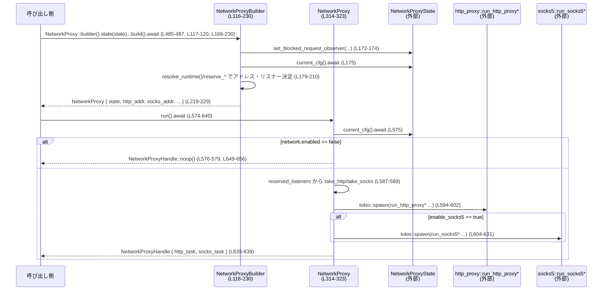

# network-proxy/src/proxy.rs

## 0. ざっくり一言

`NetworkProxy` の生成・起動と、HTTP/SOCKS5 プロキシ用の環境変数上書きを行うモジュールです。Codex ランタイム用の「ネットワークサンドボックス・プロキシ」のエントリポイントに相当します。

---

## 1. このモジュールの役割

### 1.1 概要

- このモジュールは **アプリケーションと外部ネットワークの間に HTTP/SOCKS5 プロキシを挟み、ポリシーに基づいて通信を制御する** ために存在します。
- 主な機能は:
  - `NetworkProxyBuilder` による `NetworkProxy` の構築と設定 (`proxy.rs:L93-101`, `L116-230`)
  - HTTP/SOCKS5 プロキシのリスナー予約と起動 (`L233-295`, `L574-640`)
  - 子プロセス向けのプロキシ関連環境変数の一括設定 (`L411-482`, `L521-532`)
  - 実行中プロキシの設定更新 (一部のフィールドは不変) (`L534-565`)

### 1.2 アーキテクチャ内での位置づけ

このモジュールは、設定・状態管理モジュールと実際の HTTP/SOCKS5 実装モジュールの間に位置する「オーケストレーション層」です。

```mermaid
graph TD
    App["アプリケーションコード"] -->|builder()/run()| NP["NetworkProxy<br/>(proxy.rs)"]
    NP -->|uses| State["NetworkProxyState<br/>(crate::state)"]
    NP -->|uses| Cfg["config::<br/>NetworkProxyConfig/Settings<br/>(crate::config)"]
    NP -->|spawns| Http["http_proxy::run_http_proxy*<br/>(crate::http_proxy)"]
    NP -->|spawns| Socks["socks5::run_socks5*<br/>(crate::socks5)"]
    NP -->|policy_decider| Policy["NetworkPolicyDecider<br/>(crate::network_policy)"]
    NP -->|blocked_request_observer| RuntimeObs["BlockedRequestObserver<br/>(crate::runtime)"]
    NP -->|uses| Runtime["ConfigState / unix_socket_permissions_supported<br/>(crate::runtime)"]
    NP -->|binds| OS["StdTcpListener<br/>(std::net)"]
```

- 図の `NetworkProxy::run` は `proxy.rs:L574-640` に定義されています。
- HTTP/SOCKS の実際のプロキシ処理 (`run_http_proxy*`, `run_socks5*`) の中身はこのファイルにはないため、詳細は不明です。

### 1.3 設計上のポイント

- **ビルダーパターン**  
  - `NetworkProxyBuilder` により、状態 (`NetworkProxyState`)、ポリシーデシダ、監視フックなどを明示的に組み立ててから `build().await` で `NetworkProxy` を生成します (`L93-101`, `L116-230`)。
- **リスナー予約によるポート衝突回避**
  - Codex 管理モードでは、`StdTcpListener` を先に bind してループバック/エフェメラルポートを確保し、そのソケットをサーバーに引き渡します (`ReservedListenerSet`, `ReservedListeners`, `L56-91`, `L233-244`)。
  - Windows では設定されたポートが埋まっている場合にループバックのエフェメラルポートにフォールバックします (`reserve_windows_managed_listeners`, `L246-264`)。
- **ランタイム設定の分離**
  - ユーザー設定全体 (`ConfigState`) とは別に、実行時に動的に参照する軽量な `NetworkProxyRuntimeSettings` を持ち、`RwLock` で保護します (`L297-312`, `L320`、`L567-572`)。
- **エラーハンドリング**
  - 公開 API はおおむね `anyhow::Result` を返し、コンテキスト付きでエラーをラップします（例: `reserve_loopback_ephemeral_listener`, `L292-295` や `build`, `L166-171`）。
  - 実行中の設定変更では `anyhow::ensure!` を使い、変更してはいけないフィールドに対して契約を明示しています (`L536-555`)。
- **並行性**
  - HTTP/SOCKS プロキシは `tokio::spawn` で独立したタスクとして起動し、その `JoinHandle` を `NetworkProxyHandle` が保持します (`L594-603`, `L604-631`, `L643-647`)。
  - Drop 実装により、`wait()`/`shutdown()` を呼ばずに `NetworkProxyHandle` が破棄された場合でも、残っているタスクを非同期に abort します (`L696-706`)。
- **環境変数ベースの制御**
  - 多数のプロキシ関連環境変数（HTTP(S)_PROXY, ALL_PROXY, NO_PROXY など）を一括で上書きし、子プロセスが必ずこのプロキシを通るようにします (`L346-386`, `L411-482`)。

---

## 2. 主要な機能一覧

- `NetworkProxyBuilder` によるプロキシの構築（Codex 管理モード / 非管理モード切り替えを含む） (`L93-101`, `L116-230`)
- HTTP/SOCKS5 用 TCP リスナーの予約とアドレス決定 (`ReservedListenerSet`, `reserve_loopback_ephemeral_listeners`, `reserve_windows_managed_listeners`, `L56-91`, `L233-279`)
- 実行時設定 (`allow_local_binding`, Unix ソケット許可リストなど) の保持と更新 (`NetworkProxyRuntimeSettings`, `L297-312`, `L534-565`)
- HTTP/SOCKS5 プロキシの起動と停止 (`NetworkProxy::run`, `NetworkProxyHandle`, `L574-640`, `L643-679`, `L681-694`)
- ネットワークポリシー設定（許可/拒否ドメイン）の変更 (`add_allowed_domain`, `add_denied_domain`, `L501-507`)
- 子プロセス用のプロキシ環境変数の一括設定 (`apply_proxy_env_overrides`, `NetworkProxy::apply_to_env`, `L411-482`, `L521-532`)
- 既存環境変数からのプロキシ設定検出 (`proxy_url_env_value`, `has_proxy_url_env_vars`, `L388-403`)
- テストコードによる動作確認（ポート選択、環境変数設定、Windows/macOS 特有動作など） (`L709-1028`)

---

## 3. 公開 API と詳細解説

### 3.1 型一覧（構造体・列挙体など）

| 名前 | 種別 | 公開範囲 | 役割 / 用途 | 根拠 |
|------|------|----------|-------------|------|
| `Args` | 構造体 | `pub` | `clap::Parser` を derive した CLI 引数型。現状フィールドはなく、サブコマンド起動用のダミーに近い構造です。 | `proxy.rs:L21-23` |
| `NetworkProxyBuilder` | 構造体 | `pub` | `NetworkProxy` を構築するビルダー。状態、アドレス、ポリシーデシダ、ブロック観測者などを設定します。 | `L93-101`, `L116-230` |
| `NetworkProxy` | 構造体 | `pub` | ネットワークプロキシの設定と状態をまとめた本体。HTTP/SOCKS アドレス、ランタイム設定、状態 (`NetworkProxyState`) などを保持し、`run()` でプロキシを起動します。 | `L314-323`, `L574-640` |
| `NetworkProxyHandle` | 構造体 | `pub` | 起動済みプロキシタスク (HTTP/SOCKS) の `JoinHandle` を保持し、待機 (`wait`) / シャットダウン (`shutdown`) を提供するハンドルです。 | `L643-647`, `L649-679`, `L696-706` |
| `NetworkProxyRuntimeSettings` | 構造体 | 非公開 | 実行時に参照されるネットワーク関連設定（ローカルバインド許可、Unix ソケット許可リストなど）を保持します。`RwLock` 越しに共有されます。 | `L297-312`, `L320`, `L567-572` |
| `ReservedListeners` | 構造体 | 非公開 | 事前予約された TCP リスナー (HTTP/SOCKS) を `Mutex<Option<StdTcpListener>>` で保持し、`take_*` で一度きり取り出せるようにします。 | `L25-54`, `L85-90` |
| `ReservedListenerSet` | 構造体 | 非公開 | `ReservedListeners` を作る前段階として、リスナーとそのアドレス取得メソッドをまとめたヘルパー。 | `L56-91`, `L233-244` |

主な定数:

| 名前 | 種別 | 公開範囲 | 役割 / 用途 | 根拠 |
|------|------|----------|-------------|------|
| `PROXY_URL_ENV_KEYS` | `&'static [&'static str]` | `pub` | プロキシ URL を示す代表的な環境変数キー一覧。既存プロキシ設定の有無検出に使用。 | `L346-363`, `L399-403` |
| `ALL_PROXY_ENV_KEYS` | `&'static [&'static str]` | `pub` | `ALL_PROXY` とその小文字エイリアスのキー配列。 | `L365` |
| `ALLOW_LOCAL_BINDING_ENV_KEY` | `&'static str` | `pub` | 子プロセス向けにローカルバインド許可フラグを伝える環境変数名。値は `"0"` または `"1"`。 | `L366`, `L421-427` |
| `NO_PROXY_ENV_KEYS` | `&'static [&'static str]` | `pub` | NO_PROXY 相当の環境変数名一覧。 | `L371-378`, `L460` |
| `DEFAULT_NO_PROXY_VALUE` | `&'static str` | `pub` | ローカル・プライベートアドレス帯を除外する標準 NO_PROXY 値。 | `L380-386` |

### 3.2 関数詳細（重要 API）

#### 1) `NetworkProxyBuilder::build(self) -> Result<NetworkProxy>` (async)

**概要**

`NetworkProxyBuilder` に設定された状態・オプションに基づき、`NetworkProxy` インスタンスを非同期に構築します。Codex 管理モードかどうかに応じてリスナーの bind 方法も切り替わります。  
根拠: `proxy.rs:L166-230`

**引数**

| 引数名 | 型 | 説明 |
|--------|----|------|
| `self` | `NetworkProxyBuilder` | ビルダー自身（所有権を move）。事前に `state` などをセットしておく必要があります。 |

**戻り値**

- `Result<NetworkProxy>`  
  - 成功時: 構築済み `NetworkProxy`  
  - 失敗時: `anyhow::Error`。設定やリスナー確保、ランタイム解決に失敗した場合など。

**内部処理の流れ**

1. `state` が `Some` であることを確認し、`None` の場合は `anyhow!` でエラーを返す (`L167-171`)。
2. `state.set_blocked_request_observer(self.blocked_request_observer.clone()).await` を呼び、ブロックされたリクエストを観測するオブザーバを設定 (`L172-174`)。
3. `state.current_cfg().await?` で現在の設定 (`NetworkProxyConfig`) を取得 (`L175`)。
4. `managed_by_codex` に応じて、HTTP/SOCKS アドレスおよび予約リスナーを決定 (`L176-210`)。
   - 管理モード:
     - `config::resolve_runtime(&current_cfg)?` でランタイム設定解決 (`L179`)。
     - Windows: `config::clamp_bind_addrs` + `reserve_windows_managed_listeners` で設定ポート上にリスナーを bind (`L181-193`)。
     - 非 Windows: `reserve_loopback_ephemeral_listeners` でループバックエフェメラルポートに bind (`L193-195`)。
     - `http_addr()`, `socks_addr(runtime.socks_addr)` で実アドレスを取得 (`L196-197`)。
   - 非管理モード:
     - `config::resolve_runtime` からデフォルトアドレスを取得し、ビルダーで上書きされていれば `unwrap_or` でそちらを優先 (`L204-208`)。
5. 計算された `requested_http_addr`, `requested_socks_addr` に対して、再度 `config::clamp_bind_addrs` を適用し、ループバック制約等を再確認 (`L212-217`)。
6. `NetworkProxy` 構造体を初期化し、`runtime_settings` を `NetworkProxyRuntimeSettings::from_config(&current_cfg)` から構築する (`L219-229`)。

**Examples（使用例）**

```rust
// 状態をどこかから取得する（生成方法はこのファイルからは不明）
let state: Arc<NetworkProxyState> = obtain_state_somehow(); // 仮想コード

// Codex 管理モードのプロキシを構築
let proxy = NetworkProxy::builder()                      // builder() -> NetworkProxyBuilder (L485-487)
    .state(state)                                        // 状態を設定 (L117-120)
    .build()                                             // 非同期に NetworkProxy を構築 (L166-230)
    .await?;                                             // anyhow::Result を処理
```

**Errors / Panics**

- `state` が設定されていない場合 (`self.state` が `None`):  
  - `"NetworkProxyBuilder requires a state; supply one via builder.state(...)"` というメッセージで `Err` を返します (`L167-171`)。
- `config::resolve_runtime`, リスナー予約系 (`reserve_*`), `ReservedListenerSet::http_addr/socks_addr` が返すエラーは `anyhow::Context` でラップされます (`L179`, `L193-195`, `L237-243`)。
- パニック:
  - 明示的な `panic!` はありませんが、内部で使用している関数がパニックする可能性は、このファイルからは判断できません。

**Edge cases（エッジケース）**

- `managed_by_codex == true` かつ Windows で管理ポートが既に使用中:
  - `reserve_windows_managed_listeners` 内で `AddrInUse` 検出時にエフェメラルループバックポートへフォールバックするため、希望ポートには bind されません (`L246-263`)。
- SOCKS5 無効 (`current_cfg.network.enable_socks5 == false`):
  - 管理モードでも SOCKS リスナーは予約されず、`socks_addr` は設定の `socks_url` から得られたアドレスになります (`L189-191`, テスト `L783-818`)。

**使用上の注意点**

- `build()` は async 関数なので、Tokio などの非同期ランタイム上で `.await` を呼ぶ必要があります。
- `NetworkProxyState` の生成・ライフタイム管理はこのモジュールでは行っていないため、呼び出し側で `Arc` を含めて適切に管理する必要があります。
- `managed_by_codex` のデフォルトは `true` です (`L103-113`)。外部でポートを固定したい場合は `managed_by_codex(false)` を明示します (`L132-135`)。

---

#### 2) `NetworkProxy::run(&self) -> Result<NetworkProxyHandle>` (async)

**概要**

現在の設定に基づいて HTTP/SOCKS5 プロキシを起動し、それらタスクを管理する `NetworkProxyHandle` を返します。プロキシ停止は返されたハンドルで制御します。  
根拠: `proxy.rs:L574-640`

**引数**

| 引数名 | 型 | 説明 |
|--------|----|------|
| `&self` | `&NetworkProxy` | 構築済みプロキシオブジェクト。内部状態とアドレスなどを参照します。 |

**戻り値**

- `Result<NetworkProxyHandle>`  
  - 成功時: HTTP/SOCKS タスクを保持するハンドル  
  - ネットワークが無効な場合も `Ok(NetworkProxyHandle::noop())` を返します (`L576-579`)。

**内部処理の流れ**

1. 現在の設定 `current_cfg` を取得 (`L575`)。
2. `current_cfg.network.enabled` が `false` の場合は警告を出し、`NetworkProxyHandle::noop()` を返して終了 (`L576-579`)。
3. `unix_socket_permissions_supported()` が `false` なら、Mac 専用機能である Unix ソケット関連設定が拒否されることを警告 (`L581-585`)。
4. 予約リスナー (`self.reserved_listeners`) から HTTP/SOCKS 用リスナーを取り出す (`take_http` / `take_socks`) (`L587-589`)。
5. HTTP プロキシタスクを `tokio::spawn` で起動:
   - 予約リスナーがある場合: `http_proxy::run_http_proxy_with_std_listener` を使用 (`L595-599`)。
   - ない場合: `http_proxy::run_http_proxy` をアドレス指定で起動 (`L600-601`)。
6. SOCKS5 が有効 (`current_cfg.network.enable_socks5`) なら、同様に SOCKS5 タスクを起動:
   - 予約リスナーがある場合: `socks5::run_socks5_with_std_listener` (`L610-618`)。
   - ない場合: `socks5::run_socks5` (`L620-627`)。
7. HTTP/SOCKS 両タスクの `JoinHandle<Result<()>>` を `NetworkProxyHandle` に格納して返却 (`L635-639`)。

**Examples（使用例）**

```rust
// proxy は事前に NetworkProxyBuilder::build で構築済みとする
let handle = proxy.run().await?;             // HTTP/SOCKS を起動し、ハンドルを取得 (L574-640)

// この後は handle.wait().await でプロキシが終了するまで待つか,
// handle.shutdown().await で明示的に停止させます。
handle.wait().await?;
```

**Errors / Panics**

- `self.state.current_cfg().await` が `Err` の場合、`run()` も `Err` を返します (`L575`)。
- `http_proxy::run_http_proxy*` や `socks5::run_socks5*` が `Err` を返した場合、`NetworkProxyHandle::wait` 側で `Err` になります（`run()` 自体はタスク起動までなので成功扱いです）。
- パニック:
  - 明示的な `panic!` はありません。
  - `tokio::spawn` は Tokio ランタイム外で呼ぶとパニックするため、`run()` は必ずランタイム上で呼び出す必要があります。

**Edge cases（エッジケース）**

- `network.enabled == false` の場合:
  - 実際には HTTP/SOCKS タスクを起動せず、`NetworkProxyHandle::noop()` を返します (`L576-579`, `L650-656`)。
  - `noop` ハンドルには `Ok(())` を返すダミータスクが入っており、`wait()` も即時成功します。
- SOCKS5 無効 (`enable_socks5 == false`):
  - `socks_task` は `None` となり、HTTP のみが起動されます (`L604-633`)。

**使用上の注意点**

- `run()` 自体はプロキシのライフタイムをブロックしません。必ず返ってきた `NetworkProxyHandle` に対して `wait()` か `shutdown()` を呼ぶか、Drop に任せる必要があります。
- `reserved_listeners` は `take_http` / `take_socks` で `Option::take` されるため、`run()` を複数回呼ぶと 2 回目以降は予約リスナーが利用されず、新規 bind にフォールバックします (`L39-45`, `L47-53`, `L587-589`)。

---

#### 3) `NetworkProxy::apply_to_env(&self, env: &mut HashMap<String, String>)`

**概要**

渡された環境変数マップに対して、HTTP/SOCKS プロキシを強制するための各種環境変数を上書きします。既存の値は意図的に上書きされます。  
根拠: `proxy.rs:L521-532`, `L411-482`

**引数**

| 引数名 | 型 | 説明 |
|--------|----|------|
| `&self` | `&NetworkProxy` | 使用するプロキシのアドレスと設定情報。 |
| `env` | `&mut HashMap<String, String>` | 上書き対象の環境変数マップ。 |

**戻り値**

- なし (`()`)

**内部処理の流れ**

1. `self.allow_local_binding()` でランタイム設定を取得 (`L521-522`)。
2. コメントにあるように「子プロセスが管理プロキシをバイパスできないよう」既存値を上書きすることを明示 (`L523-525`)。
3. `apply_proxy_env_overrides` を呼び出し、実際の環境変数設定を委譲 (`L525-531`)。
4. `apply_proxy_env_overrides` の内部処理:
   - `ALLOW_LOCAL_BINDING_ENV_KEY` に `"0"` or `"1"` をセット (`L421-427`)。
   - HTTP 系プロキシ変数 (HTTP_PROXY, HTTPS_PROXY, YARN_*, npm/bundle/pip/docker 関連) に `http://{http_addr}` を設定 (`L429-452`)。
   - WebSocket 関連変数 (WS_PROXY/WSS_PROXY 系) も HTTP と揃える (`L453-455`)。
   - NO_PROXY 系変数に `DEFAULT_NO_PROXY_VALUE` を設定 (`L457-460`)。
   - `ELECTRON_GET_USE_PROXY` を `"true"` に設定 (`L462`)。
   - SOCKS 有効なら `ALL_PROXY` / `FTP_PROXY` に `socks5h://{socks_addr}`、そうでなければ `http://{http_addr}` を設定 (`L467-473`)。
   - macOS かつ SOCKS 有効で `GIT_SSH_COMMAND` 未設定なら、SOCKS プロキシ経由の `ssh ProxyCommand` を設定 (`L475-481`)。

**Examples（使用例）**

```rust
let mut child_env = std::env::vars().map(|(k, v)| (k, v)).collect::<HashMap<_, _>>();

// proxy は NetworkProxy::builder().state(...).build().await で構築済み
proxy.apply_to_env(&mut child_env); // 多数の *_PROXY 系の値が上書きされる (L521-532)

// この child_env を Command 等に渡して子プロセスを起動する
```

**Errors / Panics**

- 戻り値は `()` で、エラーは返しません。
- `HashMap` 操作に伴うパニック要因（OOM など）は標準ライブラリ依存であり、このファイルからは特別な対策は行っていません。

**Edge cases（エッジケース）**

- もともと環境に設定されていたプロキシ変数は **すべて上書き** されます。元の設定を残したい場合は、呼び出し側で必要なキーを退避しておく必要があります (`L523-525`)。
- macOS の `GIT_SSH_COMMAND` は、すでに存在する場合は上書きされず、そのまま尊重されます (`env.entry(...).or_insert_with(...)`, `L475-481`, テスト `L1008-1027`)。

**使用上の注意点**

- 子プロセスが外部ネットワークへ自由にアクセスできないよう「強制プロキシ」を実現する関数です。意図せず既存プロキシ設定を壊さないよう、どのプロセスに対して適用するかを設計段階で明確にする必要があります。
- `allow_local_binding` フラグは文字列 `"0"/"1"` として渡されるため、読み取る側のコード（別モジュール）ではこの仕様に依存します (`L421-427`)。

---

#### 4) `NetworkProxy::replace_config_state(&self, new_state: ConfigState) -> Result<()>` (async)

**概要**

実行中のプロキシに対して、新しい `ConfigState` を適用します。ただしネットワーク関連の一部フィールドは変更禁止であり、一致しない場合はエラーになります。  
根拠: `proxy.rs:L534-565`

**引数**

| 引数名 | 型 | 説明 |
|--------|----|------|
| `&self` | `&NetworkProxy` | 実行中または起動前のプロキシオブジェクト。 |
| `new_state` | `ConfigState` | 新しい設定一式。所有権ごと渡します。 |

**戻り値**

- `Result<()>`  
  - 成功時: `Ok(())`  
  - 失敗時: 設定値が契約に反している、あるいは内部更新に失敗した場合の `anyhow::Error`。

**内部処理の流れ**

1. 現在の設定 `current_cfg` を `self.state.current_cfg().await?` で取得 (`L535`)。
2. `anyhow::ensure!` で以下のフィールドが現在と同一であることをチェック (`L536-555`)。
   - `network.enabled`
   - `network.proxy_url`
   - `network.socks_url`
   - `network.enable_socks5`
   - `network.enable_socks5_udp`
3. いずれかが異なる場合は、該当メッセージを含むエラーを返し、更新を行わない。
4. `NetworkProxyRuntimeSettings::from_config(&new_state.config)` で新しいランタイム設定を構築 (`L557`)。
5. `self.state.replace_config_state(new_state).await?` で内部状態を更新 (`L558`)。
6. `runtime_settings` の `RwLock` を `write()` でロックし、新しい設定で置き換え (`L559-563`)。

**Examples（使用例）**

```rust
let current_state: ConfigState = proxy.state.current_cfg_state().await?; // 仮想 API

// proxy_url や enable_socks5 を変更しない範囲で設定を書き換える
let mut new_state = current_state.clone();
new_state.config.network.allow_local_binding = true;

proxy.replace_config_state(new_state).await?;
```

※ 実際に `ConfigState` をどう組み立てるかは、このファイルだけでは分かりません。

**Errors / Panics**

- 以下の条件で `Err` を返します（`anyhow::ensure!`）:
  - `network.enabled` が変更されている (`L536-539`)
  - `network.proxy_url` が変更されている (`L540-543`)
  - `network.socks_url` が変更されている (`L544-547`)
  - `network.enable_socks5` が変更されている (`L548-551`)
  - `network.enable_socks5_udp` が変更されている (`L552-555`)
- 内部の `replace_config_state` が `Err` を返した場合も `Err` をそのまま伝播します (`L558`)。
- `RwLock::write()` が poison されていても、`unwrap_or_else(PoisonError::into_inner)` で中身を取り出し、更新を続行します (`L559-562`)。

**Edge cases（エッジケース）**

- 上記禁止フィールド以外（例: `allow_local_binding`, `allow_unix_sockets`）は変更可能であり、`NetworkProxyRuntimeSettings` にも反映されます (`L557-563`)。
- ロックが poison 済みの場合でも更新を続行するため、「一部のスレッドで panic が起きた後も設定更新が行われる」設計になっています (`L559-562`)。

**使用上の注意点**

- ネットワークの有効／無効や、プロキシ URL/SOCKS URL といった根本的な接続先を変更するには、プロキシの再起動が必要であることを前提とした契約になっています。
- 設定更新の前後で HTTP/SOCKS タスクは再起動されません。このファイルからは、設定変更がタスクにどう反映されるか（動的 reload か、次回接続から適用か）は分かりません。

---

#### 5) `proxy_url_env_value(env: &HashMap<String, String>, canonical_key: &str) -> Option<&str>`

**概要**

大文字の「正規キー」（例: `"HTTP_PROXY"`）を受け取り、環境マップからそのキーまたは小文字版（`"http_proxy"`）の値を探して返します。  
根拠: `proxy.rs:L388-397`

**引数**

| 引数名 | 型 | 説明 |
|--------|----|------|
| `env` | `&HashMap<String, String>` | 環境変数のキー/値マップ。 |
| `canonical_key` | `&str` | 正規のキー名（通常は大文字）。 |

**戻り値**

- `Option<&str>`  
  - 対応する値が見つかれば `Some(&str)`、なければ `None`。

**内部処理の流れ**

1. まず `env.get(canonical_key)` を試み、存在すればその値の `&str` を返す (`L392-394`)。
2. なければ `canonical_key.to_ascii_lowercase()` で小文字キーを生成し、`env.get(lower_key.as_str())` を参照 (`L395-396`)。
3. 見つかった場合はその `&str` を返し、見つからなければ `None` (`L395-396`)。

**Examples（使用例）**

```rust
let mut env = HashMap::new();
env.insert("http_proxy".to_string(), "http://127.0.0.1:3128".to_string());

// 正規キー HTTP_PROXY から小文字エイリアスも解決できる (テスト L862-874)
assert_eq!(
    proxy_url_env_value(&env, "HTTP_PROXY"),
    Some("http://127.0.0.1:3128"),
);
```

**Errors / Panics**

- `HashMap::get` はパニックしない前提で使われています。特別なエラーハンドリングはありません。

**Edge cases（エッジケース）**

- 小文字版キーは `to_ascii_lowercase()` を用いて決定されるため、ASCII ベースの変換（例: `"WS_PROXY"` → `"ws_proxy"`, `L395`）となります。
- 正規キー・小文字キー以外（例: `"Http_Proxy"`）は解決されません。

**使用上の注意点**

- この関数は値の「存在判定」には便利ですが、特定の大文字/小文字バリエーションすべてを見たい場合は自前で `env` を走査する必要があります。

---

#### 6) `has_proxy_url_env_vars(env: &HashMap<String, String>) -> bool`

**概要**

既知のプロキシ URL 環境変数群のうち、少なくとも 1 つに非空の値が設定されているかどうかを判定します。  
根拠: `proxy.rs:L399-403`, `L346-363`

**引数**

| 引数名 | 型 | 説明 |
|--------|----|------|
| `env` | `&HashMap<String, String>` | 環境変数のマップ。 |

**戻り値**

- `bool`  
  - 既知のキーのどれかに非空の値があれば `true`、なければ `false`。

**内部処理の流れ**

1. `PROXY_URL_ENV_KEYS` を `iter()` で走査 (`L399-402`)。
2. 各キーに対して `proxy_url_env_value(env, key)` を呼び（正規/小文字エイリアス解決）、`Option<&str>` を得る (`L400-402`)。
3. `is_some_and(|value| !value.trim().is_empty())` により、空文字や空白のみの値を無視しつつ、非空文字列があるかどうかを判定 (`L401-402`)。
4. 1 つでも条件を満たせば `true`、なければ `false` (`L400-402`)。

**Examples（使用例）**

```rust
let mut env = HashMap::new();
env.insert("all_proxy".to_string(), "socks5h://127.0.0.1:8081".to_string());

// 小文字 all_proxy だけでも検出される (テスト L876-885)
assert!(has_proxy_url_env_vars(&env));
```

**Errors / Panics**

- なし (`bool` を直接返却)。

**Edge cases（エッジケース）**

- 値が空文字または空白のみの場合は「存在しない」とみなされます (`value.trim().is_empty()`, `L401-402`)。
- WebSocket プロキシについては `"WSS_PROXY"` の小文字エイリアス `"wss_proxy"` も検出対象になっていることがテストで確認されています (`L887-893`)。

**使用上の注意点**

- 既存のプロキシ設定がある環境に対して、「我々のプロキシを強制すべきかどうか」を判断する前段として利用できますが、具体的な上書き方針は別途設計が必要です。

---

#### 7) `apply_proxy_env_overrides(env: &mut HashMap<String, String>, http_addr: SocketAddr, socks_addr: SocketAddr, socks_enabled: bool, allow_local_binding: bool)`

**概要**

HTTP/SOCKS5 プロキシアドレスと設定に基づき、渡された環境マップに対して各種プロキシ環境変数を一括上書きします。  
根拠: `proxy.rs:L411-482`

**引数**

| 引数名 | 型 | 説明 |
|--------|----|------|
| `env` | `&mut HashMap<String, String>` | 上書き対象の環境変数マップ。 |
| `http_addr` | `SocketAddr` | HTTP プロキシのアドレス (`ip:port`)。 |
| `socks_addr` | `SocketAddr` | SOCKS5 プロキシのアドレス。 |
| `socks_enabled` | `bool` | SOCKS5 を有効にするかどうか。ALL_PROXY/FTP_PROXY の設定に影響。 |
| `allow_local_binding` | `bool` | ローカルバインドを許可するかどうか。専用 env に `"0"`/`"1"` で渡されます。 |

**戻り値**

- なし (`()`)

**内部処理の流れ（要約）**

1. `http_proxy_url = format!("http://{http_addr}")`、`socks_proxy_url = format!("socks5h://{socks_addr}")` を生成 (`L418-419`)。
2. `ALLOW_LOCAL_BINDING_ENV_KEY` (=`"CODEX_NETWORK_ALLOW_LOCAL_BINDING"`) に `"1"` または `"0"` を設定 (`L421-427`)。
3. HTTP 系のキー配列に対して `set_env_keys` で一括して `http_proxy_url` をセット (`L429-452`)。
4. `WEBSOCKET_PROXY_ENV_KEYS` にも `http_proxy_url` をセット (`L453-455`)。
5. `NO_PROXY_ENV_KEYS` に `DEFAULT_NO_PROXY_VALUE` をセット (`L457-460`)。
6. `ELECTRON_GET_USE_PROXY` を `"true"` にセット (`L462`)。
7. `socks_enabled` に応じて `ALL_PROXY_ENV_KEYS` および `FTP_PROXY_ENV_KEYS` を SOCKS または HTTP の URL で上書き (`L467-473`)。
8. macOS かつ SOCKS 有効時に限り、`GIT_SSH_COMMAND` 未設定なら SOCKS 経由 SSH ProxyCommand を追加 (`L475-481`)。

**Examples（使用例）**

テストコードに具体例があります (`L895-948`, `L950-966`, `L968-1006`, `L1008-1027`)。

```rust
let mut env = HashMap::new();
apply_proxy_env_overrides(
    &mut env,
    "127.0.0.1:3128".parse().unwrap(), // HTTP
    "127.0.0.1:8081".parse().unwrap(), // SOCKS5
    true,                               // socks_enabled
    false,                              // allow_local_binding
);

// 代表的な検証例 (テスト L895-948)
assert_eq!(env.get("HTTP_PROXY"), Some(&"http://127.0.0.1:3128".to_string()));
assert_eq!(env.get("ALL_PROXY"), Some(&"socks5h://127.0.0.1:8081".to_string()));
```

**Errors / Panics**

- なし（戻り値は `()`）。

**Edge cases（エッジケース）**

- `socks_enabled == false` の場合、`ALL_PROXY` や `FTP_PROXY` にも HTTP プロキシ URL が設定されます (`L471-472`, テスト `L950-966`)。
- macOS かつ `GIT_SSH_COMMAND` がすでに存在する場合、その値は保持されます (`L475-481`, テスト `L1008-1027`)。

**使用上の注意点**

- `env.insert` を多数呼び出すため、既存の設定は基本的にすべて上書きされます。
- `socks5h://` スキームを使っているため、DNS 解決は SOCKS 側で行われる想定です (`L419`)。これに依存するクライアント（あるいは対応していないクライアント）に注意が必要です。

---

### 3.3 その他の関数・メソッド一覧（概要）

主な補助関数とメソッドをグループごとにまとめます。

| 名称 | 種別 | 役割（1 行） | 根拠 |
|------|------|--------------|------|
| `ReservedListeners::new`, `take_http`, `take_socks` | メソッド (非公開) | 事前予約した `StdTcpListener` を `Mutex<Option<...>>` に包んで保持し、一度だけ取り出せるようにします。 | `L31-53` |
| `ReservedListenerSet::new`, `http_addr`, `socks_addr`, `into_reserved_listeners` | メソッド (非公開) | 予約リスナー集合の生成・アドレス取得・`ReservedListeners` への変換を行います。 | `L61-90` |
| `NetworkProxyBuilder::state/http_addr/socks_addr/managed_by_codex` | メソッド (公開) | ビルダーの各フィールドを設定するフルエント API。`self` を返してチェーン可能です。 | `L116-135` |
| `NetworkProxyBuilder::policy_decider/policy_decider_arc` | メソッド (公開) | `NetworkPolicyDecider` 実装を `Arc<dyn NetworkPolicyDecider>` として設定します。 | `L137-148` |
| `NetworkProxyBuilder::blocked_request_observer/_arc` | メソッド (公開) | `BlockedRequestObserver` 実装を `Arc` で設定します。 | `L150-164` |
| `reserve_loopback_ephemeral_listeners` | 関数 (非公開) | ループバックアドレスのエフェメラルポートに HTTP/SOCKS の `StdTcpListener` を bind します。 | `L233-244` |
| `reserve_windows_managed_listeners` (cfg windows) | 関数 (非公開) | 管理ポートに bind を試み、失敗時はエフェメラルループバックにフォールバックします。 | `L246-264` |
| `try_reserve_windows_managed_listeners` (cfg windows) | 関数 (非公開) | 実際に指定アドレスに対して `StdTcpListener::bind` を行うラッパー。 | `L266-279` |
| `windows_managed_loopback_addr` (cfg windows) | 関数 (非公開) | 非ループバックアドレスをループバック (`127.0.0.1`) にクランプします。 | `L281-290` |
| `reserve_loopback_ephemeral_listener` | 関数 (非公開) | `127.0.0.1:0` で `StdTcpListener` を bind し、実際の割り当てポートを含んだリスナーを返します。 | `L292-295` |
| `NetworkProxyRuntimeSettings::from_config` | メソッド (非公開) | `NetworkProxyConfig` からランタイム設定を抽出します。 | `L304-311` |
| `NetworkProxy::builder` | メソッド (公開, 関連関数) | `NetworkProxyBuilder::default()` のショートカットです。 | `L484-487` |
| `NetworkProxy::http_addr/socks_addr` | メソッド (公開) | プロキシのバインドアドレスを返します。 | `L489-495` |
| `NetworkProxy::current_cfg` | メソッド (公開, async) | 内部状態から現在の `NetworkProxyConfig` を取得します。 | `L497-499` |
| `NetworkProxy::add_allowed_domain/add_denied_domain` | メソッド (公開, async) | 許可/拒否ドメインリストにドメイン名を追加します。 | `L501-507` |
| `NetworkProxy::allow_local_binding/allow_unix_sockets/dangerously_allow_all_unix_sockets` | メソッド (公開) | `NetworkProxyRuntimeSettings` を参照して現在の実行時設定を返します。 | `L509-519` |
| `NetworkProxy::runtime_settings` | メソッド (非公開) | `RwLock` を read して `NetworkProxyRuntimeSettings` のクローンを返します。 | `L567-572` |
| `NetworkProxyHandle::noop` | メソッド (非公開, 関連関数) | 何もしない（すでに完了済み）ハンドルを生成します。`network.enabled == false` 時に利用。 | `L649-656`, `L576-579` |
| `NetworkProxyHandle::wait` | メソッド (公開, async) | HTTP/SOCKS タスクの終了を待機し、内部の `Result<()>` を集約して返します。 | `L658-672` |
| `NetworkProxyHandle::shutdown` | メソッド (公開, async) | HTTP/SOCKS タスクを abort し、`completed` フラグを立てます。 | `L674-678` |
| `abort_task`, `abort_tasks` | 関数 (非公開, async) | オプションの `JoinHandle<Result<()>>` を abort し、終了を待機します。 | `L681-694` |
| `impl Drop for NetworkProxyHandle` | Drop 実装 | `completed == false` の場合、バックグラウンドタスクとして `abort_tasks` を `tokio::spawn` します。 | `L696-706` |

---

## 4. データフロー

### 4.1 プロキシ起動までのフロー

`NetworkProxy` の構築から HTTP/SOCKS タスクが起動するまでの典型的なデータフローです。



このシーケンスにより:

- 設定 (`NetworkProxyConfig`) は一貫して `NetworkProxyState` から取得されます。
- 実際の通信処理は `http_proxy` / `socks5` モジュールに委譲され、このモジュールはその「起動とライフタイム管理」に集中しています。

---

## 5. 使い方（How to Use）

### 5.1 基本的な使用方法

以下は、`NetworkProxy` を構築し、環境変数を適用してからプロキシを起動し、終了まで待機する一連の流れの例です。

```rust
use std::collections::HashMap;
use std::sync::Arc;
use network_proxy::proxy::NetworkProxy;
use network_proxy::state::NetworkProxyState; // 実際のパスは crate 構成による

#[tokio::main]
async fn main() -> anyhow::Result<()> {
    // 1. NetworkProxyState を用意する（具体的な生成方法は別モジュール）
    let state: Arc<NetworkProxyState> = obtain_state_somehow(); // 仮想コード

    // 2. NetworkProxy をビルダーで構築 (L485-487, L116-135, L166-230)
    let proxy = NetworkProxy::builder()
        .state(state)
        // .managed_by_codex(false)         // 非 Codex 管理モードにする場合
        // .http_addr("127.0.0.1:3128".parse()?)
        // .socks_addr("127.0.0.1:8081".parse()?)
        .build()
        .await?;

    // 3. 子プロセス用の環境変数を構築し、プロキシ設定を適用 (L521-532)
    let mut child_env: HashMap<String, String> =
        std::env::vars().map(|(k, v)| (k, v)).collect();
    proxy.apply_to_env(&mut child_env);

    // 4. プロキシを起動 (L574-640)
    let handle = proxy.run().await?;

    // 5. 必要に応じて他の処理を行い、最後にプロキシ終了まで待つ
    handle.wait().await?; // または handle.shutdown().await?;

    Ok(())
}
```

### 5.2 よくある使用パターン

1. **Codex 管理モード（デフォルト）**

   - ポート選択を Codex ランタイムに任せ、ループバックのエフェメラルポートを自動確保します。
   - テスト `managed_proxy_builder_uses_loopback_ports` が、ポートがループバックかつ OS ごとに期待どおりであることを確認しています (`L718-756`)。

2. **外部でポートを決める非管理モード**

```rust
let settings = /* NetworkProxySettings などから state を構築 */;
let state = Arc::new(network_proxy_state_for_policy(settings)); // テスト L760-766

let proxy = NetworkProxy::builder()
    .state(state)
    .managed_by_codex(false)                 // 非管理モード (L132-135)
    // ここで http_addr/socks_addr を明示指定可能
    .build()
    .await?;

// proxy.http_addr / socks_addr は設定どおりになる (L758-781)
```

1. **ポリシーデシダやブロック観測者の追加**

```rust
struct MyDecider;
impl NetworkPolicyDecider for MyDecider {
    /* ... */
}

struct MyObserver;
impl BlockedRequestObserver for MyObserver {
    /* ... */
}

let proxy = NetworkProxy::builder()
    .state(state)
    .policy_decider(MyDecider)              // NetworkPolicyDecider 実装を登録 (L137-143)
    .blocked_request_observer(MyObserver)   // BlockedRequestObserver を登録 (L150-156)
    .build()
    .await?;
```

### 5.3 よくある間違い

```rust
// 間違い例: state を設定せずに build() を呼ぶ
let proxy = NetworkProxy::builder()
    // .state(state) を呼んでいない
    .build()
    .await?; // => "NetworkProxyBuilder requires a state; ..." エラー (L167-171)

// 正しい例: state を必ず設定
let proxy = NetworkProxy::builder()
    .state(state)
    .build()
    .await?;
```

```rust
// 間違い例: run() した後、handle を無視して放置
let handle = proxy.run().await?;
// handle を drop すると Drop 実装が非同期 abort を試みるが、実行時によっては
// tokio::spawn が動作しない場合もありうる (L696-705)

// より明示的な例: 必ず wait() か shutdown() を呼ぶ
let handle = proxy.run().await?;
handle.shutdown().await?; // または handle.wait().await?;
```

```rust
// 間違い例: replace_config_state で禁止フィールドを変更してしまう
let mut new_state = current_state.clone();
new_state.config.network.proxy_url = "http://other:3128".to_string();
proxy.replace_config_state(new_state).await?; // => エラー (L540-543)

// 正しい例: proxy_url など禁止フィールドを変えない
let mut new_state = current_state.clone();
new_state.config.network.allow_local_binding = true;
proxy.replace_config_state(new_state).await?;
```

### 5.4 使用上の注意点（まとめ）

- **非同期ランタイム前提**
  - `build`, `run`, `current_cfg`, `add_allowed_domain`, `add_denied_domain`, `replace_config_state`, `NetworkProxyHandle::wait`, `shutdown` はすべて async であり、Tokio などのランタイムが必要です (`L166`, `L497`, `L501-507`, `L534`, `L574`, `L658`, `L674`)。
- **ハンドルの Drop 動作**
  - `NetworkProxyHandle` を `completed == false` のまま Drop すると、`tokio::spawn` で `abort_tasks` を実行します (`L696-706`)。Tokio ランタイム外でドロップすると `tokio::spawn` がパニックする可能性があるため、原則としてランタイム内で `wait()` か `shutdown()` を呼びきる使い方が安全です。
- **環境変数の強制上書き**
  - `apply_to_env`/`apply_proxy_env_overrides` は既存のプロキシ関連環境変数を意図的にすべて上書きします (`L523-525`, `L429-452`)。外部の設定との競合に注意が必要です。
- **Unix ソケット許可設定**
  - `allow_unix_sockets` や `dangerously_allow_all_unix_sockets` は `NetworkProxyRuntimeSettings` 経由で参照されますが、実際のチェックは `http_proxy`/`socks5` 側で行われると考えられます。このファイルでは、macOS 以外のプラットフォームではそれらがサポートされない旨の警告のみ出しています (`L581-585`)。

---

## 6. 変更の仕方（How to Modify）

### 6.1 新しい機能を追加する場合

例: 新しいランタイム設定フラグ（例: 特定ポートの許可/拒否）を追加する場合。

1. **設定構造体の拡張**
   - `config::NetworkProxyConfig`/`NetworkProxySettings` に新フィールドを追加し、その値を読み込む実装を別モジュールで行います（このファイルには定義がありません）。
2. **`NetworkProxyRuntimeSettings` の拡張**
   - 新フィールドを構造体に追加し (`L297-302`)、`from_config` 内で `config.network` からその値をコピーします (`L304-311`)。
3. **`NetworkProxy` からの参照メソッド**
   - 必要であれば `NetworkProxy` に `pub fn new_flag(&self) -> ...` のようなアクセサを追加し、`runtime_settings()` を通じて値を返すようにします (`L567-572`)。
4. **プロキシ実装側への伝播**
   - `http_proxy::run_http_proxy*` や `socks5::run_socks5*` に渡す引数として必要な場合は、`NetworkProxy::run` の引数に新しい情報を追加するなどの調整を行います (`L594-601`, `L610-627`)。

### 6.2 既存の機能を変更する場合

- **ポート選択ロジックの変更**
  - Codex 管理モードの挙動を変える場合は、`NetworkProxyBuilder::build` の managed 分岐 (`L176-203`) と、Windows 用の `reserve_windows_managed_listeners` (`L246-264`)、非 Windows 用の `reserve_loopback_ephemeral_listeners` (`L233-244`) を確認します。
  - 変更後は、対応するテスト (`L718-781`, `L783-818`, `L835-859`) を更新・追加する必要があります。
- **環境変数のセット方法の変更**
  - 新しいツールに対応したい場合は、`PROXY_URL_ENV_KEYS` や `WEBSOCKET_PROXY_ENV_KEYS`, `NO_PROXY_ENV_KEYS` などにキーを追加し (`L346-370`)、必要に応じて `apply_proxy_env_overrides` 内の `set_env_keys` 呼び出しに含めます (`L429-452`, `L453-455`, `L457-460`)。
  - テスト `apply_proxy_env_overrides_*` 系 (`L895-948`, `L950-966`, `L968-1006`, `L1008-1027`) の期待値も更新が必要です。
- **契約（前提条件）の変更**
  - 実行中に変更してよい設定項目を増やしたい/減らしたい場合は、`replace_config_state` の `anyhow::ensure!` 群 (`L536-555`) を調整します。ここは「何を変えてはいけないか」を定義している重要な箇所です。

---

## 7. 関連ファイル

このモジュールと密接に関係する他ファイル（推測ではなく、import から分かる範囲）です。

| パス（推定） | 役割 / 関係 |
|--------------|------------|
| `crate::config` | `NetworkProxyConfig`, `NetworkProxySettings`, `resolve_runtime`, `clamp_bind_addrs` などを提供し、ポートやネットワーク設定の決定に利用されます (`L1`, `L179`, `L181-185`, `L213-217`, テスト `L712`, `L760-764`)。 |
| `crate::http_proxy` | `run_http_proxy` / `run_http_proxy_with_std_listener` をエクスポートし、HTTP プロキシサーバーの本体実装を提供していると考えられます (`L2`, `L594-601`)。処理の詳細はこのファイルからは分かりません。 |
| `crate::socks5` | `run_socks5` / `run_socks5_with_std_listener` をエクスポートし、SOCKS5 プロキシサーバーの実装を提供します (`L7`, `L610-627`)。 |
| `crate::state` | `NetworkProxyState` およびテスト用補助 `network_proxy_state_for_policy` を提供し、設定や許可/拒否ドメインの状態管理を担います (`L8`, `L316`, `L501-507`, テスト `L713`, `L760-766`, `L791-792`)。 |
| `crate::network_policy` | `NetworkPolicyDecider` トレイトを提供し、プロキシが各リクエストを許可/拒否する判断ロジックを委譲します (`L3`, `L99`, `L322`)。 |
| `crate::runtime` | `BlockedRequestObserver`, `ConfigState`, `unix_socket_permissions_supported` を提供し、設定のライフサイクル管理・ブロック情報の通知・Unix ソケットパーミッション対応可否などを扱います (`L4-6`, `L100`, `L534`, `L581-585`)。 |
| `tests` (このファイル内モジュール) | 構築ロジック（ポートクランプ・リスナー予約）、環境変数設定、Windows/macOS 固有挙動を検証するユニットテスト群です (`L709-1028`)。 |

---

### テストコードの概要

テストモジュール (`proxy.rs:L709-1028`) は主に次の点を検証しています。

- 管理モード / 非管理モードで期待どおりのアドレス・ポートが選択されること (`L718-781`, `L783-818`)。
- Windows 固有のループバッククランプとポートビジー時のフォールバック挙動 (`L821-859`)。
- `proxy_url_env_value`/`has_proxy_url_env_vars` が小文字エイリアスや WebSocket 用キーを正しく扱うこと (`L862-893`)。
- `apply_proxy_env_overrides` が多数の環境変数を意図したとおりに設定し、NO_PROXY・ALLOW_LOCAL_BINDING・macOS の `GIT_SSH_COMMAND` 振る舞いを含めて検証していること (`L895-948`, `L950-966`, `L968-1006`, `L1008-1027`)。

---

### バグ・セキュリティ観点の補足（このファイルから読み取れる範囲）

- `ReservedListeners`/`ReservedListenerSet` により、HTTP/SOCKS の bind ポートを先に確保し、その後のサーバー起動時に同じソケットを引き継ぐことでレース条件（他プロセスにポートを奪われる）を避ける設計になっています (`L56-91`, `L233-244`, `L587-589`)。
- `Mutex`/`RwLock` で `PoisonError` が発生した場合も `into_inner` で中身を取り出す方針のため、一部のスレッドで panic が起きてもサービス全体を止めずに処理を続けます (`L39-43`, `L48-51`, `L560-562`)。
- `NetworkProxyHandle` の Drop が非同期タスクを生成する点は、Tokio ランタイムの外で Drop された場合に問題になりうるため、「原則としてランタイム内で `wait()` か `shutdown()` を呼びきる」ことが安全な利用上の前提条件になります (`L696-706`)。
- 環境変数上書きにより、ユーザーが設定した任意のプロキシをバイパスできないようにする設計ですが、その分「環境変数に依存する既存ツールの挙動を変えてしまう」リスクもあるため、どのプロセスに適用するかは慎重な設計が必要です (`L523-525`, `L429-452`)。

このレポートは、`proxy.rs` に記述されている事実に基づいており、それ以外のファイルの実装詳細については「不明」としました。
