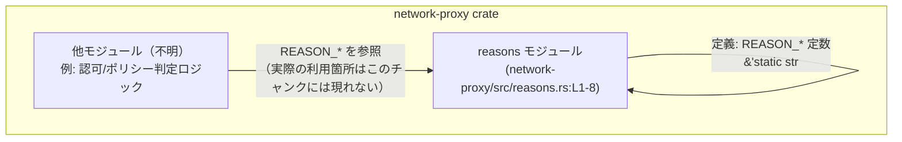
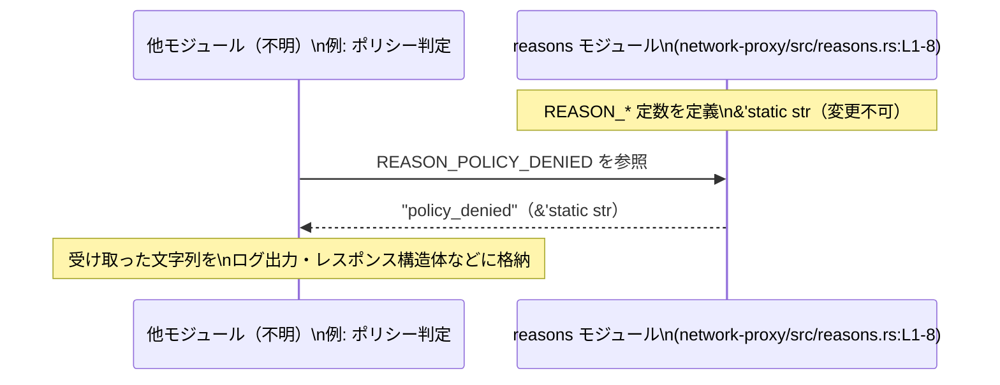

# network-proxy/src/reasons.rs

## 0. ざっくり一言

このファイルは、アクセス拒否・ポリシー違反・プロキシ設定などに関する「理由コード」を表す文字列定数を、crate 内で共有するために定義しているモジュールです（`pub(crate) const ...: &str` が 8 個定義されています。`reasons.rs:L1-8`）。

---

## 1. このモジュールの役割

### 1.1 概要

- このモジュールは、主に「アクセスが拒否された理由」や「操作が許可されなかった理由」を表す **識別子的な文字列** を定義します（`reasons.rs:L1-8`）。
- これらの文字列は `&'static str` の定数として定義されており、crate 内の他の箇所から共通の値として参照されることが想定されます（`pub(crate) const ...: &str` であるため。`reasons.rs:L1-8`）。
- ファイル内には関数や構造体は存在せず、ロジックは持たずに、定数定義だけを提供しています。

### 1.2 アーキテクチャ内での位置づけ

このチャンクには他モジュールからの参照は出てこないため、実際にどこから使われているかは分かりませんが、典型的な位置づけは「**理由コード定数をまとめるユーティリティモジュール**」です。



- 上図は、`reasons` モジュールが crate 内の他モジュールから参照される「定数提供モジュール」として振る舞う典型的なイメージです。
- 実際にどのモジュールが `REASON_*` を使っているかは、このファイルからは特定できません（このチャンクには呼び出し側のコードが現れません）。

### 1.3 設計上のポイント

コードから読み取れる設計上の特徴は次のとおりです。

- **理由コードの集中管理**  
  - 拒否理由などを表す文字列が、ここに一元的に集約されています（`reasons.rs:L1-8`）。
- **crate 内専用の API**  
  - すべて `pub(crate)` で公開されており、**同じ crate 内からのみアクセス可能** で、外部 crate からは参照できません（`reasons.rs:L1-8`）。
- **不変な静的データ**  
  - 型はすべて `&'static str` で、プログラム全体を通して有効な読み取り専用の文字列です（`reasons.rs:L1-8`）。
  - これにより、メモリ安全性・スレッド安全性ともに問題になりにくい設計になっています。
- **命名規則の一貫性**  
  - 定数名は `REASON_...` というプレフィックスを持ち、値はスネークケースの英小文字の識別子になっています（例: `REASON_DENIED = "denied"`、`reasons.rs:L1`）。

---

## 2. 主要な機能一覧

このファイルに実行処理はありませんが、提供している「機能」を整理すると次のようになります。

- 理由コード定数の定義:  
  拒否・ポリシー違反・プロキシ設定に関連する **理由コード文字列** を、crate 内で共有するための定数として提供する（`reasons.rs:L1-8`）。

※ 具体的に「どのエラーコードと結びつくか」「どのプロトコルで使うか」などは、このチャンクのコードからは分かりません。

---

## 3. 公開 API と詳細解説

### 3.1 型一覧（構造体・列挙体など）

このファイルには構造体・列挙体・型エイリアスは定義されていません（`reasons.rs:L1-8` には `const` だけが存在します）。

| 名前 | 種別 | 役割 / 用途 | 定義位置 |
|------|------|-------------|----------|
| なし | -    | -           | -        |

#### 3.1.1 定数一覧（コンポーネントインベントリー）

このファイルの中心的な「コンポーネント」である定数を一覧にします。

| 名前 | 種別 | 値 | 役割 / 用途（推測を含む場合は明示） | 定義位置 |
|------|------|----|--------------------------------------|----------|
| `REASON_DENIED` | `pub(crate) const &str` | `"denied"` | 拒否されたことを表す理由コードとして用いられることが想定されますが、具体的な利用箇所はこのチャンクからは分かりません。 | `reasons.rs:L1` |
| `REASON_METHOD_NOT_ALLOWED` | `pub(crate) const &str` | `"method_not_allowed"` | メソッドが許可されていないことを表す理由コードと解釈できますが、用途はこのチャンクからは特定できません。 | `reasons.rs:L2` |
| `REASON_MITM_REQUIRED` | `pub(crate) const &str` | `"mitm_required"` | 「MITM（Man-in-the-Middle）」が必要であることを示す理由コードと推測できますが、詳細な意味づけは不明です。 | `reasons.rs:L3` |
| `REASON_NOT_ALLOWED` | `pub(crate) const &str` | `"not_allowed"` | 何らかの操作が許可されていないことを表す汎用的な理由コードと見なせますが、具体的なコンテキストは不明です。 | `reasons.rs:L4` |
| `REASON_NOT_ALLOWED_LOCAL` | `pub(crate) const &str` | `"not_allowed_local"` | ローカルなアクセス・アドレスなどに対して「許可されない」ことを表す理由コードと推測されますが、根拠は定数名と値のみです。 | `reasons.rs:L5` |
| `REASON_POLICY_DENIED` | `pub(crate) const &str` | `"policy_denied"` | ポリシー（規約/設定）により拒否されたことを表す理由コードと考えられますが、具体的なポリシーの内容は不明です。 | `reasons.rs:L6` |
| `REASON_PROXY_DISABLED` | `pub(crate) const &str` | `"proxy_disabled"` | プロキシ機能が無効化されていることを示す理由コードと推測できますが、その設定元はこのチャンクには現れません。 | `reasons.rs:L7` |
| `REASON_UNIX_SOCKET_UNSUPPORTED` | `pub(crate) const &str` | `"unix_socket_unsupported"` | Unix ソケットがサポートされていないことを表す理由コードと読み取れますが、どのプラットフォーム/設定で発生するかは不明です。 | `reasons.rs:L8` |

※ 用途の欄で「推測」と明示している部分は、名前と文字列からの一般的な解釈であり、このチャンクだけでは確定できません。

### 3.2 関数詳細（最大 7 件）

このファイルには関数は定義されていません（`reasons.rs:L1-8` に `fn` は登場しません）。

### 3.3 その他の関数

同様に、補助関数・メソッドも存在しません。

---

## 4. データフロー

このモジュールは定数定義のみを提供しており、内部処理の「フロー」は存在しません。ただし、典型的な利用イメージとしては、他モジュールがこの定数を参照し、応答やログの「理由コード」として使用する形が考えられます（利用側はこのチャンクには現れません）。

### 4.1 想定される参照の流れ（イメージ）



- この図は、「呼び出し側が `reasons` モジュールの定数を単に参照するだけ」というデータフローを示しています。
- 実際にどの型・関数がこの定数を受け取るかは、このチャンクの範囲外であり、不明です。

---

## 5. 使い方（How to Use）

### 5.1 基本的な使用方法

一般的な Cargo プロジェクト構成（`src/reasons.rs` が crate 直下のモジュールになる）を前提とした例です。実際のモジュール構成が異なる場合は、パスが変わる可能性があります。

以下は、認可処理でポリシー違反を表すレスポンス構造体を作るイメージコードです。

```rust
// 他モジュールから reasons モジュールの定数を参照する例
// この例では crate ルート直下に reasons.rs がある前提で `crate::reasons` を使っています。

// 理由コード付きのレスポンスを表す仮の型
struct DenyResponse<'a> {                 // 応答の型（例示）
    reason_code: &'a str,                 // 拒否理由コード
    message: String,                      // 表示用メッセージ
}

fn build_policy_denied_response() -> DenyResponse<'static> {
    // reasons モジュールの定数を参照する
    let reason = crate::reasons::REASON_POLICY_DENIED; // "policy_denied"（reasons.rs:L6）

    DenyResponse {
        reason_code: reason,              // コードとして保存
        message: "Policy denied".into(),  // ユーザー向け文言（ここでは固定文字列）
    }
}
```

このコードのポイント:

- `reason_code` は `&'static str` であり、`reasons` モジュールの定数をそのまま格納できます。
- どの理由コードを使うかに応じて、`REASON_DENIED` など他の定数を選択できます（`reasons.rs:L1-8`）。

### 5.2 よくある使用パターン

1. **ログ用の理由コードとして利用**

```rust
fn log_denied_action() {
    let reason = crate::reasons::REASON_DENIED; // "denied"（reasons.rs:L1）
    log::warn!("access denied: reason={}", reason);
}
```

1. **API レスポンスのフィールド値として利用**

```rust
use serde::Serialize;

#[derive(Serialize)]
struct ApiError<'a> {
    code: &'a str,      // 固定的なコード
    message: String,    // 人間向けの説明
}

fn method_not_allowed_error() -> ApiError<'static> {
    ApiError {
        code: crate::reasons::REASON_METHOD_NOT_ALLOWED, // "method_not_allowed"（reasons.rs:L2）
        message: "This method is not allowed.".to_string(),
    }
}
```

### 5.3 よくある間違い（想定）

このファイルから実際の誤用例は分かりませんが、次のようなミスは起こりやすいと考えられます。

```rust
// 間違い例: 文字列リテラルを直接埋め込んでしまう
fn build_response_wrong() {
    let reason = "policy_denied"; // たまたま reasons.rs と同じ文字列だが、結びつきが曖昧
    // ...
}

// 正しい例: reasons.rs の定数を利用する
fn build_response_correct() {
    let reason = crate::reasons::REASON_POLICY_DENIED; // 定数を経由することで typo を防げる
    // ...
}
```

- 定数を経由せず生の文字列を書いてしまうと、後で文字列値を変更したときに全箇所を探す必要が出るなど、保守性が下がる可能性があります。
- `reasons` モジュールの定数を利用することで、理由コードの変更が一元化されます。

### 5.4 使用上の注意点（まとめ）

- **前提条件**
  - 呼び出し側は、`reasons` モジュールにアクセスできるモジュールパス（例: `crate::reasons`）を用いる必要があります。
  - これらの定数は `pub(crate)` のため、同じ crate 内からのみ利用可能です（`reasons.rs:L1-8`）。
- **変更に伴う互換性**
  - 文字列値（例: `"policy_denied"`）を変更すると、それに依存しているログ解析・外部連携などが影響を受ける可能性があります。  
    実際にどの外部システムがこれらに依存しているかは、このチャンクからは分かりませんが、識別子的な値になっているため注意が必要です。
- **安全性・並行性**
  - すべて `&'static str` の不変データであり、どのスレッドからも同時に安全に参照できます。  
    書き込みはできないため、データレースの心配はありません。

---

## 6. 変更の仕方（How to Modify）

### 6.1 新しい機能を追加する場合（新しい理由コードを追加する）

新たな理由コードを追加したい場合の典型的な手順は次のとおりです。

1. **新しい定数を追加**  
   - `reasons.rs` に既存のパターンに合わせて定数を追加します。
   - 命名規則（`REASON_...`）と値の形式（英小文字スネークケース）に合わせるのが自然です（根拠: 既存定数の命名・値。`reasons.rs:L1-8`）。

   ```rust
   // 例: 認証関連の新しい理由コードを追加
   pub(crate) const REASON_AUTH_REQUIRED: &str = "auth_required"; // 新規（行番号は例）
   ```

2. **呼び出し側で利用する**
   - 新しい理由コードを用いるロジックで、この定数を参照します。
   - 呼び出し側のコードはこのチャンクには存在しないため、どこに追加するかはプロジェクト全体の構造に依存します。

3. **外部との契約（API 仕様など）がある場合は更新**
   - もし API ドキュメントやクライアント実装が理由コードの一覧に依存していれば、それらも更新する必要があります。  
     ただし、そのような契約が存在するかどうかは、このチャンクからは判断できません。

### 6.2 既存の機能を変更する場合（定数を変更する）

既存の `REASON_*` の値や名前を変更する際には、次の点に注意する必要があります。

- **影響範囲の確認**
  - `REASON_*` を参照している全箇所を検索して、依存関係を把握する必要があります。
  - このチャンクには呼び出し側が含まれないため、実際の影響範囲はプロジェクト全体を検索して確認する必要があります。

- **契約・前提条件への影響**
  - 文字列値が外部 API の仕様・ログフォーマット・ポリシーファイルなどで前提になっている場合、変更によって互換性が失われる可能性があります。  
    そのような前提があるかどうかは、このチャンクからは分かりませんので、リポジトリ全体・ドキュメントの確認が必要です。

- **型や可視性を変える場合**
  - 型（`&'static str` 以外の型に変更するなど）や可視性（`pub` 化など）を変更すると、コンパイルエラーや設計上の意味合いが変わる可能性があります。
  - 現状は `pub(crate)` であるため、外部 crate から直接依存されていることはありません（`reasons.rs:L1-8`）。

---

## 7. 関連ファイル

このチャンクには `reasons.rs` 以外のファイルは含まれておらず、実際にどのモジュールがこの定数を利用しているかは分かりません。そのため、**具体的な関連ファイル** はここでは特定できません。

| パス | 役割 / 関係 |
|------|------------|
| （不明） | このチャンクには `reasons.rs` 以外のコードが現れないため、どのモジュールが `REASON_*` を利用しているか特定できません。 |

---

### 安全性・バグ・エッジケースに関する補足

- **メモリ安全性 / 並行性**
  - すべてコンパイル時に決まる `&'static str` 定数であり、Rust の言語仕様上、メモリ安全性・スレッド安全性の観点で特別な注意点はありません（`reasons.rs:L1-8`）。
- **バグになりうる点**
  - このファイル単体ではロジックがなく、典型的なバッファオーバーフロー・データ競合などのバグは発生しません。
  - 利用側でこれらの文字列に依存したロジックを書く際に、タイポや値の変更漏れがバグ要因となる可能性があります。
- **エッジケース**
  - 定数であるため、実行時に「空文字になる」「null になる」といったエッジケースはありません。
  - エッジケースは、むしろ「期待している理由コードと異なる値を比較している」といった**利用側のロジック**に現れますが、それはこのチャンクには含まれません。
