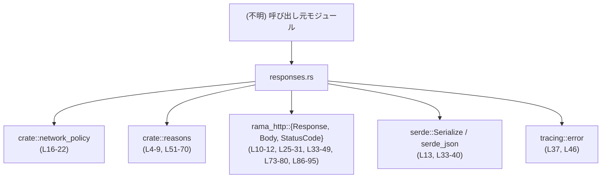
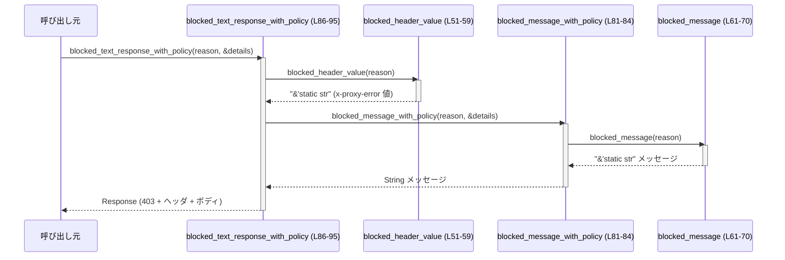

# `network-proxy/src/responses.rs`

## 0. ざっくり一言

ネットワークプロキシ内で使う **HTTPレスポンス生成用のユーティリティ**と、ネットワークポリシーによりブロックされたリクエスト向けの **統一されたエラーメッセージ／ヘッダ値** を提供するモジュールです（responses.rs:L16-96）。

---

## 1. このモジュールの役割

### 1.1 概要

- このモジュールは、プロキシ内部で発生する以下の問題を解決するために存在します。
  - プレーンテキスト／JSONの HTTP レスポンスを簡潔かつ安全に組み立てたい（responses.rs:L25-49）。
  - ネットワークポリシーによりブロックしたリクエストに対し、**理由に応じた一貫したヘッダ値とメッセージ** を返したい（responses.rs:L51-80, L81-95）。
- そのために、`Response` を生成するヘルパ関数群と、ポリシー判断に関するメタ情報を保持する `PolicyDecisionDetails` 構造体を提供しています（responses.rs:L16-23, L25-31, L33-49, L51-96）。

### 1.2 アーキテクチャ内での位置づけ

このモジュールは、他のモジュールから呼び出されて HTTP レスポンスを構築する「下位ユーティリティ」として機能します。

依存関係は以下のとおりです（imports から判明する範囲）。

- 上位（このモジュールを呼び出す側）：このチャンクには現れません（呼び出し元は不明）。
- 同一クレート内依存:
  - `crate::network_policy::{NetworkDecisionSource, NetworkPolicyDecision, NetworkProtocol}`  
    → ポリシー判断の詳細情報を `PolicyDecisionDetails` で保持するために使用（responses.rs:L16-22）。
  - `crate::reasons::{REASON_*}`  
    → ブロック理由を表す文字列定数。ヘッダ値やメッセージへのマッピングに使用（responses.rs:L4-9, L51-70）。
- 外部クレート:
  - `rama_http::{Body, Response, StatusCode}`  
    → HTTP レスポンス本体の型（responses.rs:L10-12, L25-31, L33-49, L73-80, L86-95）。
  - `serde::Serialize` / `serde_json`  
    → 任意型から JSON 文字列へのシリアライズ（responses.rs:L13, L33-40）。
  - `tracing::error`  
    → シリアライズやレスポンス構築失敗時のエラーログ出力（responses.rs:L37, L46）。

依存関係の概要を Mermaid 図に示します（本ファイル内のみ／呼び出し元は抽象的に表示）。



### 1.3 設計上のポイント

コードから読み取れる特徴は次のとおりです。

- **ステートレス設計**  
  - グローバルな可変状態を持たず、すべての関数は引数のみからレスポンス／文字列を生成します（responses.rs:L25-31, L33-49, L51-59, L61-71, L73-80, L81-95）。
- **パニック回避のエラーハンドリング**  
  - `Response::builder().body(...)` が失敗する可能性に対し、`unwrap_or_else` でフォールバックレスポンスを返すことでパニックを避けています（responses.rs:L29-31, L44-48, L78-80, L94-95）。
  - JSON シリアライズ失敗も `Result` を明示的に扱い、ログ出力の上 `"{}"` にフォールバックします（responses.rs:L34-40）。
- **ポリシー理由とメッセージ／ヘッダ値のマッピング**  
  - 理由文字列（`REASON_*` 定数）に応じたヘッダ値とメッセージを `match` で集中管理しています（responses.rs:L51-58, L61-70）。
- **並行性**  
  - 関数はいずれも同期関数であり、共有ミュータブル状態を持たないため、スレッド間から同時に呼び出してもデータ競合を起こさない構造になっています（responses.rs 全体）。

---

## 2. 主要な機能一覧

- プレーンテキストレスポンス生成: 任意のステータスコードと文字列から `Response` を構築（responses.rs:L25-31）。
- JSON レスポンス生成: `Serialize` 実装オブジェクトから JSON をシリアライズして `200 OK` レスポンスを構築（responses.rs:L33-49）。
- ブロック理由 → ヘッダ値変換: `REASON_*` 定数を `x-proxy-error` 用の静的文字列にマッピング（responses.rs:L51-59）。
- ブロック理由 → メッセージ変換: ブロック理由に応じた英語メッセージを返却（responses.rs:L61-71）。
- ポリシーブロック用テキストレスポンス生成（理由のみ）: `reason` から `403 Forbidden` のテキストレスポンスを構築（responses.rs:L73-80）。
- ポリシーブロックメッセージ（ポリシー詳細付きの拡張版）: 将来的に `PolicyDecisionDetails` を活用することを想定したメッセージ生成（現状はプレーン版と同じ）（responses.rs:L81-84）。
- ポリシーブロック用テキストレスポンス生成（詳細付き）: `PolicyDecisionDetails` を受け取りつつレスポンスを構築（responses.rs:L86-95）。
- ポリシー判断の詳細情報保持: `PolicyDecisionDetails` 構造体で決定内容・理由・プロトコルなどをまとめて保持（responses.rs:L16-23）。

---

## 3. 公開 API と詳細解説

### 3.1 型一覧（構造体・列挙体など）

| 名前 | 種別 | 公開性 | 役割 / 用途 | 定義位置 |
|------|------|--------|-------------|----------|
| `PolicyDecisionDetails<'a>` | 構造体 | `pub` | ネットワークポリシーの決定内容（決定種別・理由文字列・決定ソース・プロトコル・ホスト・ポート）をまとめて保持するためのコンテナ。現在は `blocked_message_with_policy` で引数として受け取るが、メッセージ生成には未使用です。 | responses.rs:L16-23 |

`PolicyDecisionDetails` の各フィールド:

- `decision: NetworkPolicyDecision` – 実際のポリシー決定内容（Ask / Allow / Deny 等と推測されますが、このチャンクには定義がありません）（responses.rs:L17）。
- `reason: &'a str` – 内部的な理由文字列（`crate::reasons` の定数など）（responses.rs:L18）。
- `source: NetworkDecisionSource` – 決定がどこから来たか（Decider など）（responses.rs:L19）。
- `protocol: NetworkProtocol` – 通信プロトコル種別（例: HTTPS CONNECT）（responses.rs:L20）。
- `host: &'a str` – 接続先ホスト名（responses.rs:L21）。
- `port: u16` – 接続先ポート番号（responses.rs:L22）。

### 3.2 関数詳細（7 件）

#### `text_response(status: StatusCode, body: &str) -> Response`

**概要**

- 任意の HTTP ステータスコードとテキストボディから、`content-type: text/plain` の `Response` を生成します（responses.rs:L25-31）。

**引数**

| 引数名 | 型 | 説明 |
|--------|----|------|
| `status` | `StatusCode` | 返却する HTTP ステータスコード（responses.rs:L25）。 |
| `body` | `&str` | レスポンスボディとして返したいテキスト（responses.rs:L25）。 |

**戻り値**

- `Response`（`rama_http::Response`） – `status` と `body` に基づき構築された HTTP レスポンス（responses.rs:L25-31）。

**内部処理の流れ**

1. `Response::builder()` でビルダを作成（responses.rs:L26）。
2. `status(status)` でステータスコードを設定（responses.rs:L27）。
3. `"content-type": "text/plain"` ヘッダを設定（responses.rs:L28）。
4. `Body::from(body.to_string())` で `&str` から `String` を作成し、ボディへ設定（responses.rs:L29）。
5. `body(...)` の戻り値に対して `unwrap_or_else` を呼び、エラーなら `Response::new(Body::from(body.to_string()))` でフォールバックレスポンスを作る（responses.rs:L29-31）。

**Examples（使用例）**

```rust
use rama_http::StatusCode;
use crate::responses::text_response;

fn handle_healthcheck() -> rama_http::Response {
    // 200 OK で単純なテキストレスポンスを返す
    text_response(StatusCode::OK, "OK")
}
```

**Errors / Panics**

- `Response::builder().body(...)` がエラーを返した場合でも、`unwrap_or_else` により `Response::new(Body::from(body.to_string()))` にフォールバックするため、パニックしません（responses.rs:L29-31）。
- エラーの詳細はログ出力などには行っていません（この関数内で `tracing` は使用していません）。

**Edge cases（エッジケース）**

- `body` が空文字列 `""` の場合も、そのまま空ボディのレスポンスを返します（特別扱いはありません）。
- 極端に長い文字列に対しても `body.to_string()` によりヒープ確保が行われるだけで、特別な制限はコード上にはありません。
- `status` がどの値でも（たとえ非標準コードであっても）ビルダが受け入れればそのまま使われます。ビルダが拒否した場合はフォールバックレスポンスが返ります。

**使用上の注意点**

- 毎回 `body.to_string()` により新しい `String` を生成するため、大きな文字列を頻繁に返す用途では割り当てコストに注意が必要です（responses.rs:L29-30）。
- JSON や HTML を返したい場合は、適切な `content-type` を持つ別のヘルパ関数（`json_response` など）を使う方が意図が明確です。

---

#### `json_response<T: Serialize>(value: &T) -> Response`

**概要**

- `serde::Serialize` を実装した値を JSON 文字列に変換し、`200 OK` と `content-type: application/json` を付与した HTTP レスポンスを返します（responses.rs:L33-49）。

**引数**

| 引数名 | 型 | 説明 |
|--------|----|------|
| `value` | `&T` where `T: Serialize` | JSON レスポンスとして返したいシリアライズ可能な値（responses.rs:L33）。 |

**戻り値**

- `Response` – JSON ボディを持つ `200 OK` の HTTP レスポンス。シリアライズまたはレスポンス構築に失敗した場合は `"{}"` をボディとするレスポンスになります（responses.rs:L33-48）。

**内部処理の流れ**

1. `serde_json::to_string(value)` で JSON 文字列化を試みる（responses.rs:L34）。
2. 成功 (`Ok(body)`) の場合はその文字列を採用（responses.rs:L35）。
3. 失敗 (`Err(err)`) の場合はエラーログを出力し（`error!("failed to serialize JSON response: {err}")`）、ボディを `"{}"` にフォールバック（responses.rs:L36-39）。
4. ビルダで `StatusCode::OK`、`content-type: application/json` を設定（responses.rs:L41-44）。
5. `Body::from(body)` で上記 JSON 文字列をボディへ設定（responses.rs:L44）。
6. `body(...)` の失敗時にはエラーログを出力し、`Response::new(Body::from("{}"))` にフォールバック（responses.rs:L45-48）。

**Examples（使用例）**

```rust
use serde::Serialize;
use crate::responses::json_response;

#[derive(Serialize)]
struct User {
    id: u64,
    name: String,
}

// ユーザー情報をJSONで返す例
fn handle_get_user() -> rama_http::Response {
    let user = User { id: 1, name: "Alice".to_string() };
    json_response(&user)
}
```

**Errors / Panics**

- JSON シリアライズ失敗時:
  - `serde_json::to_string` が `Err` を返した場合、エラーログを出力した上で `"{}"` を返します（responses.rs:L34-39）。
- レスポンス構築失敗時:
  - `Response::builder().body(...)` が失敗した場合、`error!("failed to build JSON response: {err}")` を出力し、ボディ `"{}"` のデフォルトレスポンスにフォールバックします（responses.rs:L41-48）。
- いずれの場合も `unwrap_or_else` を用いているため、パニックは発生しません（responses.rs:L44-48）。

**Edge cases（エッジケース）**

- `T` のシリアライズ実装内で起きたエラーは、すべて `"{}"` に集約されます。呼び出し側からは詳細なエラー種別を区別できません（responses.rs:L34-40）。
- `value` が深い再帰構造などでシリアライズに失敗した場合も同様に `"{}"` にフォールバックします。
- エラー時と成功時ともに HTTP ステータスは `200 OK` のままです（responses.rs:L42）。エラーをステータスコードで区別したい場合は、この関数の利用方針を検討する必要がありますが、そのような利用方針はコードからは読み取れません。

**使用上の注意点**

- クライアントにとって、`"{}"` が「内部エラーなのか、単に空の JSON オブジェクトなのか」を区別できない点に注意が必要です。
- エラーログは `tracing::error` を通じて出力されるため、運用上はログから失敗状況を追跡できます（responses.rs:L37, L46）。

---

#### `blocked_header_value(reason: &str) -> &'static str`

**概要**

- ブロック理由を表す文字列（`REASON_*`）を、HTTP レスポンスヘッダ `x-proxy-error` に設定するための静的な識別子に変換します（responses.rs:L51-59）。

**引数**

| 引数名 | 型 | 説明 |
|--------|----|------|
| `reason` | `&str` | ブロック理由。`crate::reasons` の定数のいずれかを想定していますが、任意の文字列を渡せます（responses.rs:L51）。 |

**戻り値**

- `&'static str` – `x-proxy-error` ヘッダに設定する識別子文字列（responses.rs:L53-57）。

**内部処理の流れ**

1. `match reason` により文字列の値を比較（responses.rs:L52）。
2. 以下のマッピングを行う（responses.rs:L53-57）。
   - `REASON_NOT_ALLOWED` または `REASON_NOT_ALLOWED_LOCAL` → `"blocked-by-allowlist"`（responses.rs:L53）。
   - `REASON_DENIED` → `"blocked-by-denylist"`（responses.rs:L54）。
   - `REASON_METHOD_NOT_ALLOWED` → `"blocked-by-method-policy"`（responses.rs:L55）。
   - `REASON_MITM_REQUIRED` → `"blocked-by-mitm-required"`（responses.rs:L56）。
   - 上記以外 → `"blocked-by-policy"`（responses.rs:L57）。

**Examples（使用例）**

```rust
use crate::reasons::REASON_DENIED;
use crate::responses::blocked_header_value;

fn example_header() {
    let header_value = blocked_header_value(REASON_DENIED);
    assert_eq!(header_value, "blocked-by-denylist");
}
```

**Errors / Panics**

- パターンマッチのみを行っており、パニックやエラーは発生しません（responses.rs:L51-58）。

**Edge cases（エッジケース）**

- `reason` が `REASON_*` 以外の任意の文字列であっても `"blocked-by-policy"` にフォールバックします（responses.rs:L57）。
- `reason` が空文字列 `""` の場合も `"blocked-by-policy"` を返します。

**使用上の注意点**

- `reason` として `crate::reasons` の定数を利用すると、意図したマッピングが得られます。任意の文字列を渡した場合の挙動は常に `"blocked-by-policy"` となるため、ヘッダ値の意味解釈が曖昧になります。

---

#### `blocked_message(reason: &str) -> &'static str`

**概要**

- ブロック理由に応じた、ユーザー向けの英語メッセージを返します（responses.rs:L61-71）。

**引数**

| 引数名 | 型 | 説明 |
|--------|----|------|
| `reason` | `&str` | ブロック理由文字列（responses.rs:L61）。 |

**戻り値**

- `&'static str` – ユーザー向けの説明メッセージ（responses.rs:L63-69）。

**内部処理の流れ**

1. `match reason` により、以下の文字列を返します（responses.rs:L62-69）。
   - `REASON_NOT_ALLOWED` → `"Domain not in allowlist."`（responses.rs:L63）。
   - `REASON_NOT_ALLOWED_LOCAL` → `"Sandbox policy blocks local/private network addresses."`（responses.rs:L64）。
   - `REASON_DENIED` → `"Domain denied by the sandbox policy."`（responses.rs:L65）。
   - `REASON_METHOD_NOT_ALLOWED` → `"Method not allowed in limited mode."`（responses.rs:L66）。
   - `REASON_MITM_REQUIRED` → `"MITM required for limited HTTPS."`（responses.rs:L67）。
   - `REASON_PROXY_DISABLED` → `"network proxy is disabled"`（responses.rs:L68）。
   - それ以外 → `"Request blocked by network policy."`（responses.rs:L69）。

**Examples（使用例）**

```rust
use crate::reasons::REASON_NOT_ALLOWED;
use crate::responses::blocked_message;

fn example_message() {
    let msg = blocked_message(REASON_NOT_ALLOWED);
    assert_eq!(msg, "Domain not in allowlist.");
}
```

**Errors / Panics**

- パターンマッチのみのため、パニックやエラーは発生しません（responses.rs:L61-70）。

**Edge cases（エッジケース）**

- 知らない `reason`、空文字列の場合も `"Request blocked by network policy."` を返します（responses.rs:L69）。
- メッセージはすべて英語の固定文字列であり、ロケールや翻訳切り替えなどはこのコードからは読み取れません。

**使用上の注意点**

- 表示メッセージを変更すると、テストやクライアント側ロジックに影響する可能性があります。実際に、`blocked_message_with_policy_returns_human_message` テストは `"Domain not in allowlist."` を期待しています（responses.rs:L104-117）。

---

#### `blocked_text_response(reason: &str) -> Response`

**概要**

- ブロック理由に基づき、`403 Forbidden` ステータスと `x-proxy-error` ヘッダ、テキストメッセージを持つレスポンスを生成します（responses.rs:L73-80）。

**引数**

| 引数名 | 型 | 説明 |
|--------|----|------|
| `reason` | `&str` | ブロック理由文字列（responses.rs:L73）。 |

**戻り値**

- `Response` – `StatusCode::FORBIDDEN`、`content-type: text/plain`、`x-proxy-error` ヘッダ付きのレスポンス（responses.rs:L73-80）。

**内部処理の流れ**

1. `Response::builder()` でビルダ作成（responses.rs:L74）。
2. ステータスコードを `StatusCode::FORBIDDEN` に設定（responses.rs:L75）。
3. `content-type: text/plain` ヘッダを設定（responses.rs:L76）。
4. `x-proxy-error` ヘッダを `blocked_header_value(reason)` の戻り値で設定（responses.rs:L77）。
5. ボディとして `blocked_message(reason)` の戻り値を `Body::from` で設定（responses.rs:L78）。
6. ビルダが失敗した場合は `Response::new(Body::from("blocked"))` にフォールバック（responses.rs:L79）。

**Examples（使用例）**

```rust
use crate::reasons::REASON_DENIED;
use crate::responses::blocked_text_response;

fn handle_blocked_request() -> rama_http::Response {
    // sandboxポリシーにより拒否した場合のレスポンスを返す
    blocked_text_response(REASON_DENIED)
}
```

**Errors / Panics**

- レスポンス構築失敗時に `unwrap_or_else` で `"blocked"` をボディとするデフォルトレスポンスにフォールバックするため、パニックは発生しません（responses.rs:L79）。

**Edge cases（エッジケース）**

- 未知の `reason` の場合:
  - `x-proxy-error` は `"blocked-by-policy"`（responses.rs:L57）。
  - ボディは `"Request blocked by network policy."`（responses.rs:L69）。
- ビルダ失敗時:
  - ステータスコード、ヘッダの設定に失敗した場合には、フォールバックレスポンス `"blocked"` が返ります（responses.rs:L79）。その際のステータスコードはビルダのデフォルト `Response::new` が決めますが、このチャンクからは具体値は分かりません。

**使用上の注意点**

- フォールバック時には `x-proxy-error` ヘッダが付かない点に注意が必要です（responses.rs:L79）。
- セキュリティ／プライバシー上、メッセージは比較的抽象的な内容になっており、内部ポリシー詳細を漏らさない構造になっています（responses.rs:L63-69）。

---

#### `blocked_message_with_policy(reason: &str, details: &PolicyDecisionDetails<'_>) -> String`

**概要**

- 将来的にポリシー詳細 (`PolicyDecisionDetails`) を使用したメッセージ拡張を想定していると考えられる関数です。現時点では `blocked_message(reason)` の文字列を `String` に変換して返すだけです（responses.rs:L81-84）。

**引数**

| 引数名 | 型 | 説明 |
|--------|----|------|
| `reason` | `&str` | ブロック理由文字列（responses.rs:L81）。 |
| `details` | `&PolicyDecisionDetails<'_>` | ポリシー決定の詳細情報。現状の実装ではメッセージ内容への反映は行っていません（responses.rs:L81-83）。 |

**戻り値**

- `String` – `blocked_message(reason)` と同じ内容のメッセージを `String` として返します（responses.rs:L83）。

**内部処理の流れ**

1. `let _ = (details.reason, details.host);` でフィールドを一度参照し、未使用警告を回避（responses.rs:L82）。
2. `blocked_message(reason).to_string()` を返す（responses.rs:L83）。

**Examples（使用例）**

```rust
use crate::reasons::REASON_NOT_ALLOWED;
use crate::responses::{PolicyDecisionDetails, blocked_message_with_policy};
use crate::network_policy::{NetworkDecisionSource, NetworkPolicyDecision, NetworkProtocol};

fn example(details: &PolicyDecisionDetails<'_>) -> String {
    blocked_message_with_policy(REASON_NOT_ALLOWED, details)
}
```

**Errors / Panics**

- `blocked_message` 自体にエラー要素がないため、この関数もエラーやパニックを発生させません（responses.rs:L61-70, L81-83）。

**Edge cases（エッジケース）**

- `details` の内容に関わらず、`reason` のみに基づいたメッセージを返します（responses.rs:L82-83）。
- 未知の `reason` の場合は `"Request blocked by network policy."` の文字列版になります（responses.rs:L69）。

**使用上の注意点**

- 現状、`details` の情報（`decision`, `source`, `protocol` など）はメッセージに反映されません。そのため「ポリシー詳細付き」という名前から想像されるほどの情報量はありません。
- テストはこの挙動（`REASON_NOT_ALLOWED` で `"Domain not in allowlist."` が返ること）に依存しています（responses.rs:L104-117）。

---

#### `blocked_text_response_with_policy(reason: &str, details: &PolicyDecisionDetails<'_>) -> Response`

**概要**

- `blocked_text_response` の拡張版で、`PolicyDecisionDetails` を受け取ります。現状の実装では `details` を直接レスポンスに反映していませんが、呼び出し側 API の一貫性のために用意されていると解釈できます（responses.rs:L86-95）。

**引数**

| 引数名 | 型 | 説明 |
|--------|----|------|
| `reason` | `&str` | ブロック理由文字列（responses.rs:L86-88）。 |
| `details` | `&PolicyDecisionDetails<'_>` | ポリシー決定の詳細情報（responses.rs:L86-88）。 |

**戻り値**

- `Response` – `403 Forbidden` のテキストレスポンス。ボディは `blocked_message_with_policy(reason, details)` の結果（responses.rs:L90-95）。

**内部処理の流れ**

1. `Response::builder()` でビルダを生成（responses.rs:L90）。
2. ステータスコードを `StatusCode::FORBIDDEN` に設定（responses.rs:L91）。
3. `content-type: text/plain` ヘッダを付与（responses.rs:L92）。
4. `x-proxy-error` ヘッダに `blocked_header_value(reason)` を設定（responses.rs:L93）。
5. ボディに `blocked_message_with_policy(reason, details)` の結果を `Body::from` で詰める（responses.rs:L94）。
6. ビルダ失敗時は `Response::new(Body::from("blocked"))` にフォールバック（responses.rs:L95）。

**Examples（使用例）**

```rust
use crate::reasons::REASON_NOT_ALLOWED;
use crate::responses::{PolicyDecisionDetails, blocked_text_response_with_policy};
use crate::network_policy::{NetworkDecisionSource, NetworkPolicyDecision, NetworkProtocol};

fn handle_blocked_request_with_details() -> rama_http::Response {
    let details = PolicyDecisionDetails {
        decision: NetworkPolicyDecision::Ask,
        reason: REASON_NOT_ALLOWED,
        source: NetworkDecisionSource::Decider,
        protocol: NetworkProtocol::HttpsConnect,
        host: "api.example.com",
        port: 443,
    };

    blocked_text_response_with_policy(REASON_NOT_ALLOWED, &details)
}
```

**Errors / Panics**

- `blocked_message_with_policy` と `blocked_header_value` がパニックを起こさないため、この関数も `Response` ビルダが失敗した場合でも `unwrap_or_else` によりパニックしません（responses.rs:L90-95）。

**Edge cases（エッジケース）**

- `details` の値にかかわらず、レスポンス内容は `reason` のみに基づきます（responses.rs:L93-94）。
- 未知の `reason` の場合、`blocked_text_response` と同様に `"blocked-by-policy"`／`"Request blocked by network policy."` に相当する値となります（responses.rs:L57, L69）。

**使用上の注意点**

- 将来的に `details` の情報をメッセージに反映したくなった場合は、`blocked_message_with_policy` の実装を拡張する形で対応するのが自然です（responses.rs:L81-83, L94）。

---

#### （テスト）`blocked_message_with_policy_returns_human_message()`

※ テスト関数は公開 API ではありませんが、挙動の契約を示すために簡単に触れます（responses.rs:L104-117）。

- `PolicyDecisionDetails` を組み立てた上で `blocked_message_with_policy(REASON_NOT_ALLOWED, &details)` を呼び出し、結果が `"Domain not in allowlist."` であることを検証します（responses.rs:L104-117）。
- これにより「`REASON_NOT_ALLOWED` に対するメッセージは allowlist に関する文言である」という契約がテストで固定化されています。

### 3.3 その他の関数

補助的／テスト用の関数一覧です。

| 関数名 | 役割（1 行） | 定義位置 |
|--------|--------------|----------|
| `blocked_message_with_policy_returns_human_message` | `blocked_message_with_policy` が期待どおりのユーザーメッセージを返すことを確認する単体テスト | responses.rs:L104-117 |

---

## 4. データフロー

### 4.1 代表的なシナリオ：ポリシーブロックレスポンス生成

ここでは、上位モジュールがネットワークポリシーによりリクエストをブロックした際に、`blocked_text_response_with_policy` を使ってレスポンスを生成する流れを示します。

1. 呼び出し元は `PolicyDecisionDetails` を構築し、`reason` と共に `blocked_text_response_with_policy` を呼び出します（responses.rs:L86-89）。
2. `blocked_text_response_with_policy` は内部で `blocked_header_value(reason)` と `blocked_message_with_policy(reason, details)` を呼び出します（responses.rs:L93-94）。
3. `blocked_message_with_policy` は `blocked_message(reason)` を呼び出し、ユーザーメッセージ文字列を返します（responses.rs:L81-83, L61-70）。
4. 各関数の戻り値を用いて `Response` を組み立て、呼び出し元に返却します（responses.rs:L90-95）。

Mermaid のシーケンス図で表すと次のようになります。



この図から分かるように、ブロックレスポンス生成では `reason` 文字列が唯一の分岐要素であり、`details` は現状メッセージには影響しません（responses.rs:L82-83）。

---

## 5. 使い方（How to Use）

### 5.1 基本的な使用方法

#### 5.1.1 テキストレスポンスを返す

```rust
use rama_http::StatusCode;
use crate::responses::text_response;

fn handle_ping() -> rama_http::Response {
    // 単純な "pong" レスポンスを返す
    text_response(StatusCode::OK, "pong")
}
```

#### 5.1.2 JSON レスポンスを返す

```rust
use serde::Serialize;
use crate::responses::json_response;

#[derive(Serialize)]
struct Status {
    ok: bool,
}

fn handle_status() -> rama_http::Response {
    let status = Status { ok: true };
    // {"ok":true} をボディに持つ 200 OK レスポンス
    json_response(&status)
}
```

#### 5.1.3 ポリシーブロックレスポンスを返す

```rust
use crate::reasons::REASON_NOT_ALLOWED;
use crate::responses::{PolicyDecisionDetails, blocked_text_response_with_policy};
use crate::network_policy::{NetworkDecisionSource, NetworkPolicyDecision, NetworkProtocol};

fn handle_blocked() -> rama_http::Response {
    let details = PolicyDecisionDetails {
        decision: NetworkPolicyDecision::Ask,
        reason: REASON_NOT_ALLOWED,
        source: NetworkDecisionSource::Decider,
        protocol: NetworkProtocol::HttpsConnect,
        host: "api.example.com",
        port: 443,
    };

    blocked_text_response_with_policy(REASON_NOT_ALLOWED, &details)
}
```

### 5.2 よくある使用パターン

- **API 成功時: `json_response` を利用**  
  成功時は型安全に構造体を返し、内部で JSON に変換します（responses.rs:L33-49）。
- **ポリシー違反時: `blocked_text_response` / `blocked_text_response_with_policy` を利用**  
  ポリシー原因に応じて適切なメッセージと `x-proxy-error` を付与します（responses.rs:L73-80, L86-95）。

### 5.3 よくある間違い

```rust
// 間違い例: ブロック理由に任意の文字列を渡してしまう
let resp = blocked_text_response("custom-reason");
// ヘッダ: "blocked-by-policy", メッセージ: "Request blocked by network policy."
// となり、期待した識別子が得られない

// 正しい例: crate::reasons の定数を使う
use crate::reasons::REASON_DENIED;
let resp = blocked_text_response(REASON_DENIED);
```

```rust
// 間違い例: すでにJSON文字列をシリアライズしてから json_response に渡す
let body = serde_json::to_string(&value).unwrap();
let resp = json_response(&body); // value の構造が失われる

// 正しい例: 構造体そのものを渡す
let resp = json_response(&value);
```

### 5.4 使用上の注意点（まとめ）

- すべての関数はステートレスでスレッドセーフな設計になっていますが、`tracing::error` ログが大量に出ないよう、エラー頻度には注意が必要です（responses.rs:L37, L46）。
- JSON シリアライズやレスポンスビルダの失敗時にも HTTP ステータスは `200 OK` / `403 Forbidden` のままであり、エラー状態はレスポンスボディ `"{}"` または `"blocked"` とログでしか判別できません（responses.rs:L33-49, L73-80, L86-95）。
- `PolicyDecisionDetails` は現時点ではメッセージに反映されていませんが、今後拡張される可能性があります。その前提で、できるだけ適切な値を埋めておくことが望ましいと考えられますが、これはコード外の運用方針になります。

---

## 6. 変更の仕方（How to Modify）

### 6.1 新しい機能を追加する場合

例: 新しいブロック理由 `REASON_RATE_LIMITED` を追加し、専用メッセージとヘッダを付けたい場合。

1. **理由定数の追加**  
   - `crate::reasons` 側に `REASON_RATE_LIMITED` を追加します（このファイルには定義が現れません）。
2. **ヘッダ値マッピングの追加**  
   - `blocked_header_value` の `match reason` に新しいパターンを追加します（responses.rs:L51-58）。
3. **メッセージマッピングの追加**  
   - `blocked_message` の `match reason` に `"Too many requests."` 等の文言を追加します（responses.rs:L61-70）。
4. **必要であればテスト追加**  
   - `tests` モジュールに新しいテストケースを追加し、想定メッセージが返ることを確認します（responses.rs:L98-117）。

### 6.2 既存の機能を変更する場合

- **メッセージ文言の変更**  
  - `blocked_message` 内の文字列を変更する場合、既存テスト（`blocked_message_with_policy_returns_human_message`）や呼び出し側の期待に注意します（responses.rs:L63, L104-117）。
- **JSON エラー処理の変更**  
  - `json_response` を、エラー時に `500 Internal Server Error` を返すように変えたい場合は、`StatusCode::OK` 固定の箇所（responses.rs:L42）とフォールバック `"{}"` の扱い（responses.rs:L34-40, L45-48）を合わせて検討する必要があります。
- **`PolicyDecisionDetails` をメッセージに反映する**  
  - 具体的なホスト名やポート番号をメッセージに含めたい場合は、`blocked_message_with_policy` の実装を変更し、`details.host` や `details.port` を利用する形にします（responses.rs:L81-83）。
  - 変更後は、テストに新しい期待値を反映させる必要があります（responses.rs:L115-116）。

変更時には、`blocked_text_response` と `blocked_text_response_with_policy` の両方がほぼ同じパスを通ることを意識し、一方だけを変更して一貫性が崩れないようにする点が重要です（responses.rs:L73-80, L86-95）。

---

## 7. 関連ファイル

このモジュールと密接に関係するファイル・ディレクトリ（コードから分かる範囲）は次のとおりです。

| パス / モジュール名 | 役割 / 関係 |
|---------------------|------------|
| `crate::network_policy` | `NetworkDecisionSource`, `NetworkPolicyDecision`, `NetworkProtocol` を提供し、`PolicyDecisionDetails` のフィールド型として利用されています（responses.rs:L16-22）。具体的なファイルパスはこのチャンクには現れません。 |
| `crate::reasons` | `REASON_DENIED`, `REASON_METHOD_NOT_ALLOWED`, `REASON_MITM_REQUIRED`, `REASON_NOT_ALLOWED`, `REASON_NOT_ALLOWED_LOCAL`, `REASON_PROXY_DISABLED` など、ブロック理由を表す文字列定数を提供しています（responses.rs:L4-9, L51-70, L104-116）。 |
| `rama_http` クレート | `Response`, `Body`, `StatusCode` 型を提供し、このモジュールのレスポンス構築の中心となる外部ライブラリです（responses.rs:L10-12, L25-31, L33-49, L73-80, L86-95）。 |
| `serde` / `serde_json` | JSON シリアライズのために使用されます（responses.rs:L13, L33-40）。 |
| `tracing` | シリアライズやレスポンス構築失敗時のエラーログ出力に利用されます（responses.rs:L37, L46）。 |
| `pretty_assertions`（テスト用） | テストにおける `assert_eq` の見やすい差分出力のために使用されています（responses.rs:L102）。 |

以上が、このファイルの公開 API・コアロジック・データフローおよびエラー／安全性に関する整理です。
