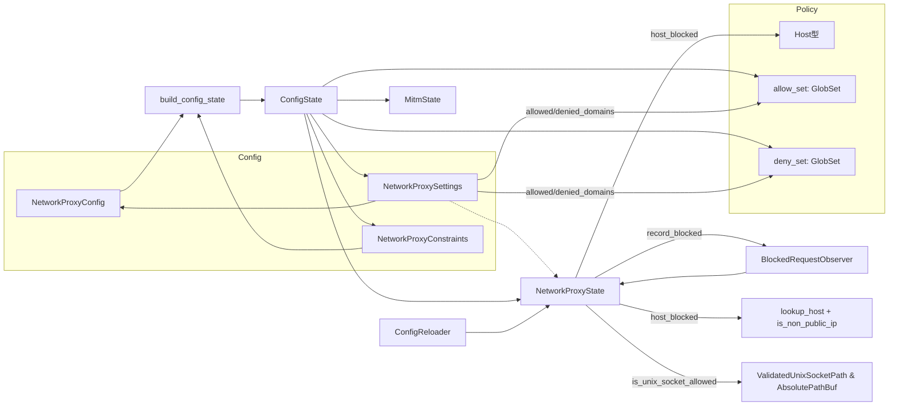
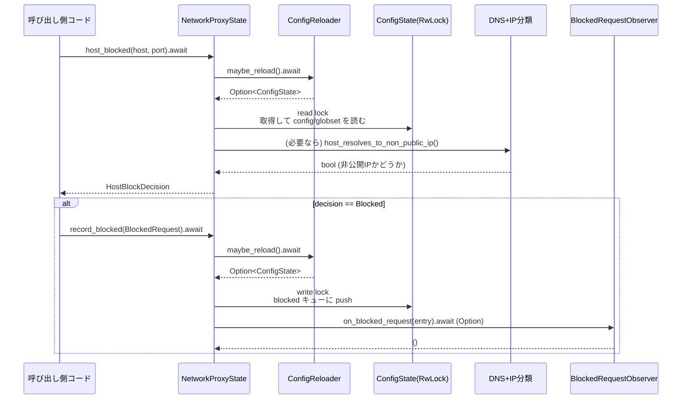

`network-proxy/src/runtime.rs`

---

## 0. ざっくり一言

- ネットワークプロキシの「実行時状態（runtime state）」を保持し、  
  設定のリロード・ホスト許可/拒否判定・ブロックイベント記録・Unixソケット許可判定などを提供するモジュールです。

> 注: 提示コードには行番号情報が含まれていないため、要求形式の `runtime.rs:L開始-終了` での厳密な行番号は付与できません。

---

## 1. このモジュールの役割

### 1.1 概要

- このモジュールは **ネットワークアクセスをポリシーベースで制御するためのランタイム状態管理** を行います。
- 具体的には、次のような機能を提供します。
  - 設定 (`NetworkProxyConfig`) のリロードと制約 (`NetworkProxyConstraints`) に基づく検証
  - ドメイン許可/拒否リストに基づく **ホスト単位のブロック判定**
  - ブロックされたリクエストの **テレメトリ（履歴）管理とオブザーバ通知**
  - Unix ドメインソケットの **パスベース許可判定**
  - ネットワークモード (`NetworkMode`) の変更と制約チェック

### 1.2 アーキテクチャ内での位置づけ

主な依存関係と役割の関係図です（概略）。



- `NetworkProxyState` がこのモジュールの中心であり、他コンポーネントと非同期にやりとりします。
- 設定の構築/検証は `build_config_state`・`validate_policy_against_constraints`（別モジュール）が担当し、このモジュールは **それらを利用する側** です。

### 1.3 設計上のポイント

- **責務分割**
  - 設定の読み込み・変更検知は `ConfigReloader` トレイトに委譲。
  - ランタイム状態の保持・読み書きは `NetworkProxyState` + `ConfigState`。
  - ホスト判定ロジックは `host_blocked` + `host_resolves_to_non_public_ip` に集中。
  - ドメインリスト更新は `DomainListKind` + `update_domain_list` に集約。
- **状態管理**
  - `ConfigState` は単一の構造体に以下を集約:
    - 生の設定 (`NetworkProxyConfig`)
    - コンパイル済みグロブセット (`GlobSet` x2)
    - MITM状態 (`MitmState`)
    - 管理ポリシー制約 (`NetworkProxyConstraints`)
    - ブロックイベントリングバッファ + 合計カウンタ
  - その `ConfigState` を `Arc<RwLock<ConfigState>>` で共有し、非同期に読み書きします。
- **エラーハンドリング**
  - 公開メソッドは基本的に `anyhow::Result<T>` を返し、I/Oや制約違反などをラップして返します。
  - ホストパース失敗やポリシー違反は **Result ではなく `HostBlockDecision` の種別** で表現される場合もあります（失敗＝NotAllowed）。
- **並行性**
  - 設定リロード・モード変更・ドメインリスト更新などは `RwLock` + 「再チェックループ」で競合を防ぎます（楽観的ロックパターン）。
  - ブロックイベント通知用の `BlockedRequestObserver` も `RwLock<Option<Arc<...>>>` で差し替え可能。
- **セキュリティ方針**
  - 「deny が allow に優先」
  - 許可リストが設定されている場合は **allow マッチが必須**
  - `allow_local_binding=false` の場合は、ループバック/プライベート IP へのアクセスは **デフォルト拒否**（DNS再解決 + IP分類で防御）

---

## 2. 主要な機能一覧（コンポーネントインベントリ）

### 型・トレイト（主要なもの）

| 名前 | 種別 | 役割 / 用途 |
|------|------|-------------|
| `NetworkProxyAuditMetadata` | 構造体 | 監査用メタデータ（会話ID・appバージョン等）を保持 |
| `HostBlockReason` | enum | ホストがブロックされた理由 (`Denied` / `NotAllowed` / `NotAllowedLocal`) |
| `HostBlockDecision` | enum | ホストの判定結果 (`Allowed` / `Blocked(reason)`) |
| `BlockedRequest` | 構造体 | ブロックされたリクエストのテレメトリエントリ（Serialize可能） |
| `BlockedRequestArgs` | 構造体 | `BlockedRequest::new` の引数まとめ |
| `ConfigState` | 構造体 | 現在のコンパイル済みプロキシ状態（設定+派生状態） |
| `ConfigReloader` | トレイト（async） | 設定を外部ソースから再読み込みする責務 |
| `BlockedRequestObserver` | トレイト（async） | ブロックイベントを外部に通知するためのコールバックインタフェース |
| `NetworkProxyState` | 構造体 | ランタイム全体の外部向けAPI。設定・判定・テレメトリを提供 |
| `DomainListKind` | enum（非公開） | Allow / Deny どちらのリストを操作するかの区別 |
| `NoopReloader` | 構造体（テスト専用） | 設定リロードを行わないテスト用実装 |

### 主な関数・メソッド（公開API中心）

- コンストラクタ／初期化
  - `NetworkProxyState::with_reloader`
  - `NetworkProxyState::with_reloader_and_blocked_observer`
  - `NetworkProxyState::with_reloader_and_audit_metadata`
  - `NetworkProxyState::with_reloader_and_audit_metadata_and_blocked_observer`
- 設定・状態取得
  - `NetworkProxyState::current_cfg`
  - `NetworkProxyState::current_patterns`
  - `NetworkProxyState::enabled`
  - `NetworkProxyState::mitm_state`
  - `NetworkProxyState::network_mode`
  - `NetworkProxyState::allow_upstream_proxy`
  - `NetworkProxyState::audit_metadata`
- 設定更新・リロード
  - `NetworkProxyState::force_reload`
  - `NetworkProxyState::replace_config_state`
  - `NetworkProxyState::set_network_mode`
  - `NetworkProxyState::add_allowed_domain`
  - `NetworkProxyState::add_denied_domain`
- 許可/拒否判定
  - `NetworkProxyState::host_blocked`
  - `NetworkProxyState::method_allowed`
  - `NetworkProxyState::is_unix_socket_allowed`
  - `unix_socket_permissions_supported`（pub(crate)）
- ブロックイベント
  - `NetworkProxyState::record_blocked`
  - `NetworkProxyState::blocked_snapshot`
  - `NetworkProxyState::drain_blocked`
- 内部ユーティリティ
  - `NetworkProxyState::update_domain_list`（非公開）
  - `NetworkProxyState::reload_if_needed`（非公開）
  - `host_resolves_to_non_public_ip`
  - `is_explicit_local_allowlisted`
  - `log_policy_changes`
  - `log_domain_list_changes`
  - `blocked_request_violation_log_line`
  - `unix_timestamp`

テスト用ユーティリティ:

- `network_proxy_state_for_policy`（cfg(test)）
- `NoopReloader` + その `ConfigReloader` 実装

---

## 3. 公開 API と詳細解説

### 3.1 型一覧（構造体・列挙体など）

| 名前 | 種別 | 役割 / 用途 |
|------|------|-------------|
| `NetworkProxyAuditMetadata` | 構造体 | 任意の監査メタデータ（会話ID・ユーザー等）を格納。`NetworkProxyState` に埋め込まれ、外部から参照される。 |
| `HostBlockReason` | enum | ブロック理由の分類: `Denied`（明示deny）、`NotAllowed`（allowlist不一致）、`NotAllowedLocal`（ローカル/非公開IPへのアクセス禁止） |
| `HostBlockDecision` | enum | ホスト判定結果: `Allowed` / `Blocked(HostBlockReason)` |
| `BlockedRequest` | 構造体 + `Serialize` | ブロックされたリクエストの詳細（host, reason, client, method, mode, protocol, decision, source, port, timestamp） |
| `BlockedRequestArgs` | 構造体 | `BlockedRequest::new` 用引数集約（`timestamp` を除くフィールドを保持） |
| `ConfigState` | 構造体 | `NetworkProxyState` 内部の実体。`NetworkProxyConfig` + `GlobSet` + `MitmState` + `NetworkProxyConstraints` + ブロック履歴を保持 |
| `ConfigReloader` | asyncトレイト | `maybe_reload` / `reload_now` で新しい `ConfigState` をロードするインタフェース |
| `BlockedRequestObserver` | asyncトレイト | `on_blocked_request` でブロックイベントを非同期に受け取るオブザーバ |
| `NetworkProxyState` | 構造体 | 外部から利用されるプロキシランタイムのインタフェース。内部に `Arc<RwLock<ConfigState>>` とリローダ/オブザーバ/監査情報を保持 |

---

### 3.2 関数詳細（主要API）

#### 1. `NetworkProxyState::host_blocked(&self, host: &str, port: u16) -> Result<HostBlockDecision>`

**概要**

- 与えられた `host` と `port` に対するアクセスが **許可されるか、どの理由でブロックされるか** を判定します。
- deny/allow リスト、ローカル/プライベートIPの扱い、DNSルックアップ結果を総合して判断します。

**引数**

| 引数名 | 型 | 説明 |
|--------|----|------|
| `host` | `&str` | 接続先ホスト名またはIPリテラル（IPv4/IPv6, スコープ付きIPv6も可） |
| `port` | `u16` | 接続先ポート。DNSルックアップ時に利用されます。 |

**戻り値**

- `Result<HostBlockDecision>`  
  - `Ok(HostBlockDecision::Allowed)`: 許可
  - `Ok(HostBlockDecision::Blocked(reason))`: ブロック、その理由を `reason` に格納
  - `Err(e)`: 設定のリロードや内部エラーが発生した場合（`anyhow::Error` でラップ）

**内部処理の流れ**

1. `reload_if_needed()` で必要に応じて設定をリロード。
2. `Host::parse(host)` でホスト文字列をパース。失敗した場合は `Blocked(NotAllowed)` を返す。
3. 現在の `ConfigState` から以下を取り出す:
   - `deny_set` / `allow_set`（いずれも `GlobSet`）
   - `allow_local_binding` フラグ
   - `allowed_domains`（元の文字列リスト）
4. 判定ロジック:
   1. **deny優先**: `deny_set.is_match(host_str)` なら `Blocked(Denied)`。
   2. `allow_set.is_match(host_str)` で allowlist マッチを計算（後で使用）。
   3. `allow_local_binding == false` の場合:
      - `host_str` がループバック/プライベートIPかどうかをチェック（`is_loopback_host` / `is_non_public_ip`）。
      - もしローカルリテラルなら:
        - `is_explicit_local_allowlisted(allowed_domains, &host)` が `false` の場合 `Blocked(NotAllowedLocal)`。
      - そうでなければ `host_resolves_to_non_public_ip(host_str, port).await`:
        - `true` の場合 `Blocked(NotAllowedLocal)`。
   4. allowlist評価:
      - `allowed_domains` が未設定（`None`）か、`is_allowlisted == false` の場合 `Blocked(NotAllowed)`。
      - それ以外は `Allowed`。

**Examples（使用例）**

```rust
// NetworkProxyState がある前提
let decision = state.host_blocked("api.openai.com", 443).await?; // 非同期判定
match decision {
    HostBlockDecision::Allowed => {
        // 実際の TCP / HTTP 接続処理へ進む
    }
    HostBlockDecision::Blocked(reason) => {
        // ログ出力や UI 表示
        eprintln!("blocked: {}", reason);
    }
}
```

**Errors / Panics**

- `Err`:
  - `reload_if_needed` 内で `ConfigReloader::maybe_reload` が失敗した場合など、設定リロード周りのI/Oエラー。
- panic:
  - コード上、公開APIから到達しうる明示的な `panic!` や `unwrap()` はありません。

**Edge cases（エッジケース）**

- `host` が不正フォーマット: `Host::parse` 失敗 → `Blocked(NotAllowed)`。
- allowlist が空 (`allowed_domains` が `None` または `[]`):
  - 全てのホストが `NotAllowed` になります（テスト `host_blocked_rejects_loopback_when_allowlist_empty` 参照）。
- `allow_local_binding == false` かつ:
  - ループバック (`127.0.0.1`, `localhost`) → `NotAllowedLocal`。
  - プライベートIP (`10.0.0.1` など) → `NotAllowedLocal`。
  - DNSルックアップが失敗/タイムアウト → `NotAllowedLocal`（保守的にブロック）。
- IPv6スコープ付きリテラル (`fe80::1%lo0`):
  - ローカル扱い。allowlistに明示的に入っていない場合は `NotAllowedLocal`。

**使用上の注意点**

- `host` はプロキシが接続に使う文字列と一致させる必要があります（`Host::parse` が行う正規化に依存）。
- `host_resolves_to_non_public_ip` は DNS 失敗時に **ブロック** する設計であり、一部環境では誤検知的にブロックされる可能性があります（テストでも意図的に利用）。
- この関数は DNS ルックアップ + タイムアウト（2秒）を行うため、高頻度で大量に呼び出すとレイテンシに影響する可能性があります。

---

#### 2. `NetworkProxyState::record_blocked(&self, entry: BlockedRequest) -> Result<()>`

**概要**

- ブロックされたリクエストを内部バッファに記録し、ログ出力を行い、必要に応じて `BlockedRequestObserver` に通知します。
- バッファは最大 `MAX_BLOCKED_EVENTS` 件のリングバッファとして保持されます。

**引数**

| 引数名 | 型 | 説明 |
|--------|----|------|
| `entry` | `BlockedRequest` | 事前に作成されたブロックイベント |

**戻り値**

- `Result<()>`  
  - 正常時は `Ok(())`
  - 設定リロードなどに失敗した場合は `Err(anyhow::Error)`

**内部処理の流れ**

1. `reload_if_needed()` を呼び、必要に応じて設定を更新。
2. `blocked_request_observer` を読み取りロックで取得し、`clone` しておく（後でロック外で使用）。
3. `blocked_request_violation_log_line(&entry)` で JSON ログ行を生成。
4. `state` に対して書き込みロックを取得し:
   - `blocked.push_back(entry)` でバッファに追加。
   - `blocked_total = blocked_total.saturating_add(1)` で累積カウンタを更新。
   - `blocked.len() > MAX_BLOCKED_EVENTS` の間、`pop_front()` で古いものを削除。
   - テレメトリ用の詳細ログ + `CODEX_NETWORK_POLICY_VIOLATION ...` 行を `debug!` 出力。
5. ロックを解放。
6. `blocked_request_observer` が存在する場合: `observer.on_blocked_request(blocked_for_observer).await` を呼ぶ。

**Examples（使用例）**

```rust
// ブロック判定後にテレメトリを記録する例
if let HostBlockDecision::Blocked(reason) = state.host_blocked("example.com", 80).await? {
    state.record_blocked(BlockedRequest::new(BlockedRequestArgs {
        host: "example.com".into(),
        reason: reason.to_string(),
        client: Some("127.0.0.1".into()),
        method: Some("GET".into()),
        mode: Some(state.network_mode().await?),
        protocol: "http".into(),
        decision: Some("auto-block".into()),
        source: Some("proxy".into()),
        port: Some(80),
    })).await?;
}
```

**Errors / Panics**

- `Err`:
  - `reload_if_needed` のエラー。
- panic:
  - テレメトリ記録の過程では明示的な panic は使用していません。

**Edge cases（エッジケース）**

- バッファあふれ:
  - `blocked.len() > MAX_BLOCKED_EVENTS` になると、古いイベントから順に削除されます。（テスト `drain_blocked_returns_buffered_window` で確認）
- `BlockedRequestObserver` がセットされていない場合:
  - 単に何も呼ばずに終了します。

**使用上の注意点**

- `record_blocked` を呼んでも **通信をブロックするわけではありません**。実際のブロックは `host_blocked` などの判定結果を用いて呼び出し側が行う必要があります。
- `BlockedRequest` には `timestamp` が含まれているため、`BlockedRequest::new` で生成してから速やかに `record_blocked` に渡すのが自然です。

---

#### 3. `NetworkProxyState::is_unix_socket_allowed(&self, path: &str) -> Result<bool>`

**概要**

- 指定された Unix ドメインソケットパスへの接続を許可するかどうかを判定します。
- 設定上の allowlist や OS サポート状況、パスの絶対性・canonicalize 結果に基づきます。

**引数**

| 引数名 | 型 | 説明 |
|--------|----|------|
| `path` | `&str` | 接続対象の Unix ソケットパス（文字列） |

**戻り値**

- `Result<bool>`  
  - `Ok(true)`: 許可
  - `Ok(false)`: 不許可
  - `Err(e)`: 設定リロード等でエラー

**内部処理の流れ**

1. `reload_if_needed()` を呼ぶ。
2. `unix_socket_permissions_supported()` をチェック:
   - macOS (`cfg!(target_os = "macos")`) 以外では `false` → 即 `Ok(false)` を返す。
3. `Path::new(path)` が絶対パスでない場合 (`is_absolute() == false`) → `Ok(false)`。
4. `state` を読取りロック:
   - `dangerously_allow_all_unix_sockets == true` なら `Ok(true)` を返す。
5. `AbsolutePathBuf::from_absolute_path(requested_path)` で正規化。失敗時は `Ok(false)`。
6. `std::fs::canonicalize` で canonical path をベストエフォート取得（失敗しても許容）。
7. `network.allow_unix_sockets()` 上の各許可パスについて:
   - `ValidatedUnixSocketPath::parse(allowed)` で検証:
     - `Native(path)` の場合: 以降比較対象。
     - `UnixStyleAbsolute(_)` の場合: スキップ（サポート外形式）。
     - エラーの場合: `warn!` ログを出してスキップ。
   - `allowed_path == requested_abs` なら `Ok(true)`。
   - 両方 canonicalize でき、canonical path が一致するなら `Ok(true)`。
8. いずれにもマッチしない場合 `Ok(false)`。

**Examples（使用例）**

```rust
let allowed = state.is_unix_socket_allowed("/tmp/service.sock").await?;
if allowed {
    // Unix ソケットへの接続を開始
} else {
    // 別ルートにフォールバックするなど
}
```

**Errors / Panics**

- `Err`:
  - `reload_if_needed` 経由のエラーのみ。
- panic:
  - 関数内での `unwrap` は存在せず、失敗は `Ok(false)` または `warn!` ログにフォールバックしています。

**Edge cases（エッジケース）**

- 非macOS:
  - 常に `Ok(false)`（テスト `unix_socket_allowlist_is_rejected_on_non_macos` 参照）。
- 相対パス:
  - 常に `Ok(false)`（`dangerously_allow_all_unix_sockets` が true でも、相対パスは拒否されます）。
- ソケットがまだ存在しない場合:
  - `canonicalize` が失敗し、raw path 比較のみで判定されます。
- シンボリックリンク:
  - 実体パスとリンクパスの canonical path が一致すれば許可されます（テスト `unix_socket_allowlist_resolves_symlinks`）。

**使用上の注意点**

- Unix ソケット許可は macOS 限定機能として実装されています。
- `dangerously_allow_all_unix_sockets` を有効にすると、指定された絶対パスならすべて許可されるため、安全性に注意が必要です。
- allowlist に指定するパスは `ValidatedUnixSocketPath` が受け付ける形式（Nativeパス）である必要があります。

---

#### 4. `NetworkProxyState::set_network_mode(&self, mode: NetworkMode) -> Result<()>`

**概要**

- 現在のネットワークモード（例: `Full`, `Limited` など）を指定モードに更新します。
- ただし、`NetworkProxyConstraints` で管理されている制約を **満たす範囲でのみ変更可能** です。

**引数**

| 引数名 | 型 | 説明 |
|--------|----|------|
| `mode` | `NetworkMode` | 新しいネットワークモード |

**戻り値**

- `Result<()>`  
  - 成功時は `Ok(())`
  - 制約に違反する場合などは `Err(anyhow::Error)`（メッセージに「network.mode constrained by managed config」が含まれる）

**内部処理の流れ**

1. ループ開始:
   1. `reload_if_needed()` を呼ぶ。
   2. 読取りロックを取得し:
      - 現在の `config` を clone → `candidate`。
      - 現在の `constraints` を clone。
      - `candidate.network.mode = mode` に変更。
   3. `validate_policy_against_constraints(&candidate, &constraints)` を呼び、制約違反がないか確認。
      - エラーの場合: `NetworkProxyConstraintError::into_anyhow` でラップし、`context("network.mode constrained by managed config")` を付加して返す。
   4. 書き込みロックを取得:
      - ロック取得時点の `guard.constraints` が先ほど参照した `constraints` と一致するか確認。
      - 一致しない場合（その間にリロード等があった）:
        - ロックを解放してループ先頭に戻る。
      - 一致する場合:
        - `guard.config.network.mode = mode` を適用。
        - `info!("updated network mode to {mode:?}")` をログ。
        - `Ok(())` を返す。

**Examples（使用例）**

```rust
// ネットワークモードを Limited に変更しようとする例
if let Err(err) = state.set_network_mode(NetworkMode::Limited).await {
    eprintln!("failed to set mode: {:#}", err);
}
```

**Errors / Panics**

- `Err`:
  - `validate_policy_against_constraints` がエラーを返した場合（モード拡大が禁止されているなど）。
  - `reload_if_needed` の内部エラー。
- panic:
  - 明示的な panic はありません。

**Edge cases（エッジケース）**

- 競合更新:
  - `validate_policy_against_constraints` でOKでも、書き込み直前に `constraints` が変わった場合はループで再試行されます。
- 管理側でモードが固定されている場合:
  - 実質的に変更不可となり、常にエラーが返るケースがあります（`validate_policy_against_constraints_disallows_widening_mode` テスト参照）。

**使用上の注意点**

- このメソッドは「**管理コンフィグに許された範囲で** ユーザーによるモード変更を許可する」という設計です。
- エラーメッセージに `"network.mode constrained by managed config"` が含まれる場合、外部の管理ポリシーを緩めない限り変更はできません。

---

#### 5. `NetworkProxyState::add_allowed_domain(&self, host: &str) -> Result<()>`

**概要**

- 指定ホストを **許可リスト（allowlist）に追加** します。
- 必要に応じて denylist から同一ホストを削除し、管理コンフィグ制約を守った上で設定を再コンパイルします。

**引数**

| 引数名 | 型 | 説明 |
|--------|----|------|
| `host` | `&str` | 許可したいホスト名またはIPリテラル |

**戻り値**

- `Result<()>`  
  - 成功時は `Ok(())`
  - ホスト文字列が不正・制約違反・ビルド失敗時は `Err(anyhow::Error)`

**内部処理の流れ**

- 実装は `update_domain_list(host, DomainListKind::Allow)` に委譲されます。
- `update_domain_list` の詳細は後述（「7.2 既存機能を変更する場合」など）。

**Examples（使用例）**

```rust
state.add_allowed_domain("api.example.com").await?;
// 以後、適切な allow/deny / ローカル設定のもとで "api.example.com" が許可されるようになる
```

**Errors / Panics**

- `Err`:
  - `Host::parse(host)` 失敗 → `"invalid network host"` コンテキスト付きエラー。
  - 制約違反 → `context("{constraint_field} constrained by managed config")` が付与されたエラー。
  - `build_config_state` 失敗 → `"failed to compile updated network {list_name}"` コンテキスト付きエラー。
- panic:
  - 明示的な panic なし。

**Edge cases（エッジケース）**

- すでに allowlist に同じホストが存在し、denylist に存在しない場合:
  - 何も変更せず `Ok(())`（冪等）。
- 大文字小文字の違い:
  - 比較には `normalize_host` を使用するため、大文字小文字違いの同一ホストとして扱われます（テスト `add_allowed_domain_removes_matching_deny_entry` など参照）。

**使用上の注意点**

- `host` は `Host::parse` が受け付ける形式でなければなりません。
- 管理側の `NetworkProxyConstraints` によって、allowlist の拡張が禁止されている場合があります（テスト `add_allowed_domain_rejects_expansion_when_managed_baseline_is_fixed`）。

---

#### 6. `NetworkProxyState::add_denied_domain(&self, host: &str) -> Result<()>`

**概要**

- 指定ホストを **拒否リスト（denylist）に追加** します。
- 必要に応じて allowlist から同一ホストを削除し、制約を守った上で設定を再コンパイルします。

**引数・戻り値・Errorハンドリング**

- インタフェースと挙動は `add_allowed_domain` とほぼ同様で、`DomainListKind::Deny` を使う点が異なります。

**Examples（使用例）**

```rust
state.add_denied_domain("evil.example.com").await?;
```

**Edge cases**

- allowlist が `"*"` のようなグローバルワイルドカードでも、denylist に追加したホストは強制的にブロックされます  
  （テスト `add_denied_domain_forces_block_with_global_wildcard_allowlist` 参照）。

---

#### 7. `async fn host_resolves_to_non_public_ip(host: &str, port: u16) -> bool`

**概要**

- ホスト名がループバック/プライベートIPに解決されるかどうかを判定します。
- DNS ルックアップに失敗またはタイムアウトした場合も **保守的に `true`（非公開IP扱い）** を返します。

**引数**

| 引数名 | 型 | 説明 |
|--------|----|------|
| `host` | `&str` | ホスト名またはIPリテラル |
| `port` | `u16` | DNS ルックアップ時に使用するポート |

**戻り値**

- `bool`  
  - `true`: 非公開IPに解決される、または DNS 失敗/タイムアウト
  - `false`: すべての解決結果が公開IP

**内部処理の流れ**

1. `host.parse::<IpAddr>()` が成功する場合:
   - `is_non_public_ip(ip)` をそのまま返す。
2. そうでない場合（ホスト名など）:
   - `tokio::time::timeout(DNS_LOOKUP_TIMEOUT, lookup_host((host, port)))` を実行。
   - 結果:
     - `Ok(Ok(addrs))`: すべての `addr.ip()` について `is_non_public_ip` をチェック。1つでも `true` なら `true`。
     - `Ok(Err(err))`: DNS エラー → `debug!` ログ後 `true`。
     - `Err(_)`: タイムアウト → `debug!` ログ後 `true`。
3. 非公開IPが見つからず、エラーもない場合のみ `false`。

**使用上の注意点**

- この関数は `host_blocked` からのみ使用されており、「DNS 失敗 → 非公開扱い」という **セキュリティ優先の設計** を実現しています。
- その結果、DNS 環境によっては正当な公開ホストでもブロックされることがあります（テスト `host_blocked_rejects_allowlisted_hostname_when_dns_lookup_fails`）。

---

### 3.3 その他の関数（補助）

| 関数名 | 役割（1 行） |
|--------|--------------|
| `blocked_request_violation_log_line` | `BlockedRequest` を JSON 文字列にシリアライズし、ログ用プレフィックスを付与する |
| `log_policy_changes` | allowlist / denylist の差分を検出し、追加/削除を `info!` ログに記録する |
| `log_domain_list_changes` | 2つの文字列リストの差分を検出してログ出力する |
| `is_explicit_local_allowlisted` | ローカルホスト/プライベートIP向けの明示的 allowlist エントリがあるか判定する |
| `unix_socket_permissions_supported` | 実行環境が Unix ソケット許可制御をサポートするかを返す（macOSのみtrue） |
| `unix_timestamp` | 現在の UTC UNIX 時刻（秒）を返す |

---

## 4. データフロー

### 4.1 代表的なシナリオ: 接続前のホスト許可判定とブロック記録

HTTP クライアントなどが新しい接続を行う前に `NetworkProxyState` でホストを判定し、ブロックになった場合にテレメトリ記録とオブザーバ通知が行われる流れです。



要点:

- すべての公開メソッドがまず `reload_if_needed()` を呼ぶため、**設定ファイルの変更は次のAPI呼び出し時に自動反映** されます。
- 判定・記録ともに `RwLock` で `ConfigState` にアクセスします。
  - 読み取り系 (`host_blocked`, `current_cfg` 等) は read lock。
  - 更新系 (`record_blocked`, `replace_config_state`, `set_network_mode`, `add_*_domain`) は write lock。

---

## 5. 使い方（How to Use）

### 5.1 基本的な使用方法

ライブラリ利用側を想定した、典型的なコードフローです。実際には `ConfigReloader` の具体実装が必要です（ここでは `MyReloader` と仮定します）。

```rust
use std::sync::Arc;
use network_proxy::runtime::{
    NetworkProxyState, ConfigReloader, ConfigState,
    BlockedRequest, BlockedRequestArgs, HostBlockDecision,
};
use anyhow::Result;

async fn example_usage(state: NetworkProxyState) -> Result<()> {
    // 1. 現在の設定・モードを確認
    let cfg = state.current_cfg().await?;                 // NetworkProxyConfig を取得
    println!("network enabled: {}", cfg.network.enabled);
    println!("mode: {:?}", state.network_mode().await?);

    // 2. リクエスト前にホスト判定
    let host = "api.openai.com";
    let port = 443;
    match state.host_blocked(host, port).await? {
        HostBlockDecision::Allowed => {
            // ここで実際の HTTP/TCP 接続処理を行う
            println!("connecting to {host}:{port}");
        }
        HostBlockDecision::Blocked(reason) => {
            println!("blocked {host}:{port} because {reason}");

            // 3. ブロックテレメトリを記録
            state.record_blocked(BlockedRequest::new(BlockedRequestArgs {
                host: host.to_string(),
                reason: reason.to_string(),
                client: None,
                method: Some("GET".to_string()),
                mode: Some(state.network_mode().await?),
                protocol: "https".to_string(),
                decision: Some("auto-block".to_string()),
                source: Some("proxy".to_string()),
                port: Some(port),
            })).await?;
        }
    }

    Ok(())
}
```

### 5.2 よくある使用パターン

1. **オブザーバによる外部集約**

```rust
use std::sync::Arc;
use network_proxy::runtime::{NetworkProxyState, BlockedRequestObserver, BlockedRequest};
use async_trait::async_trait;

// 非同期オブザーバの例: ブロックイベントをログに送る
struct LoggingObserver;

#[async_trait]
impl BlockedRequestObserver for LoggingObserver {
    async fn on_blocked_request(&self, req: BlockedRequest) {
        println!("blocked telemetry: host={}, reason={}",
                 req.host, req.reason);
    }
}

async fn attach_observer(state: &NetworkProxyState) {
    let observer: Arc<dyn BlockedRequestObserver> = Arc::new(LoggingObserver);
    state.set_blocked_request_observer(Some(observer)).await;
}
```

1. **ランタイム中に allow/deny リストを編集**

```rust
// ユーザーが UI から「このホストを許可」にした場合の例
async fn user_adds_allow(state: &NetworkProxyState, host: &str) -> anyhow::Result<()> {
    state.add_allowed_domain(host).await?;
    Ok(())
}
```

1. **ブロック履歴の取得と消費**

```rust
// スナップショットだけ読む
let snapshot = state.blocked_snapshot().await?;
println!("blocked count in buffer: {}", snapshot.len());

// 履歴を消費しつつ取り出す
let drained = state.drain_blocked().await?;
println!("drained {} events", drained.len());
```

### 5.3 よくある間違い

```rust
// 間違い例: host_blocked の結果を無視して接続してしまう
// let _ = state.host_blocked("example.com", 80).await?;
// connect("example.com:80");  // ← 実際にはブロックされるべきかもしれない

// 正しい例: HostBlockDecision に基づいて処理分岐を行う
match state.host_blocked("example.com", 80).await? {
    HostBlockDecision::Allowed => {
        // 安全に接続
        // connect("example.com:80");
    }
    HostBlockDecision::Blocked(reason) => {
        // 接続しない。代わりにログ・UI・記録などを行う
        println!("blocked: {reason}");
    }
}
```

```rust
// 間違い例: 相対パスの Unix ソケットを許可しようとする
// assert!(state.is_unix_socket_allowed("relative.sock").await.unwrap());

// 正しい例: 絶対パスのみ許可対象
assert!(!state.is_unix_socket_allowed("relative.sock").await.unwrap());
```

### 5.4 使用上の注意点（まとめ）

- すべての公開メソッドは内部で `reload_if_needed()` を呼ぶため、  
  **I/O や設定読み込みエラーが `Result` で返される** 可能性があります。
- `host_blocked` のブロック理由 `NotAllowedLocal` は、DNS 失敗・タイムアウトの場合も返されます（厳しめの防御）。
- Unix ソケット許可判定は macOS に限定されます。他OSでは常に `false`。
- `NetworkProxyState` をクローンすると内部の `Arc<RwLock<ConfigState>>` を共有するため、クローン間で状態は同期されます。

---

## 6. 変更の仕方（How to Modify）

### 6.1 新しい機能を追加する場合

例: 「特定のヘッダ値に基づいてブロック理由を詳細化したい」など。

1. **データモデル拡張**
   - 追加情報を記録したい場合は `BlockedRequest` にフィールドを追加し、`BlockedRequestArgs` / `BlockedRequest::new` を更新します。
   - そのうえでテストの `BlockedRequest` 生成箇所も更新する必要があります。

2. **API 拡張**
   - 新しい判定関数を追加する場合は `NetworkProxyState` に `pub async fn ...` を追加し、内部で `reload_if_needed` + `ConfigState` を利用するパターンに揃えると一貫性があります。

3. **制約の利用**
   - 管理コンフィグに従うべき新しい設定項目がある場合、`NetworkProxyConstraints` 側にフィールドを追加（別ファイル）し、
   - このモジュールからは `validate_policy_against_constraints` を利用して検証する形を踏襲すると良いです。

### 6.2 既存の機能を変更する場合

- **影響範囲の確認**
  - `host_blocked`・`record_blocked` などはテストが豊富にあるため、挙動変更時は関連テスト（`mod tests` 内）を必ず確認します。
  - グロブパターンの扱いは `compile_allowlist_globset` / `compile_denylist_globset` のテストにも依存します。

- **契約（前提条件・返り値の意味）**
  - `host_blocked`: 「DNS 失敗 → NotAllowedLocal」という契約を変更すると防御性に影響します。
  - `set_network_mode`: 「管理コンフィグを上回る緩和は許さない」という前提があるため、`validate_policy_against_constraints` の意味を変える場合は注意が必要です。
  - `is_unix_socket_allowed`: 絶対パスのみを扱う前提があります。

- **テスト・使用箇所の再確認**
  - `tests` モジュール内には allow/deny リスト、モード、Unixソケット、DNS失敗時の挙動など多くのエッジケースが網羅されています。
  - 仕様変更時には該当テストを更新し、新しいシナリオのテストを追加するのが安全です。

---

## 7. 関連ファイル

このモジュールと密接に関係する他ファイル（コード内の `use` から読み取れる範囲）です。

| パス | 役割 / 関係 |
|------|------------|
| `crate::config` (`NetworkProxyConfig`, `NetworkProxySettings`, `NetworkDomainPermission`, `ValidatedUnixSocketPath`, `NetworkMode`) | ネットワークプロキシの設定モデル。runtime.rs はこれを読み書きし、モードやドメインリストを操作します。 |
| `crate::state` (`NetworkProxyConstraints`, `NetworkProxyConstraintError`, `build_config_state`, `validate_policy_against_constraints`) | 設定をコンパイルし、管理コンフィグ制約と突き合わせるロジック。runtime.rs はここを呼び出して検証・状態構築を行います。 |
| `crate::policy` (`Host`, `is_loopback_host`, `is_non_public_ip`, `normalize_host`, `compile_allowlist_globset`, `compile_denylist_globset`) | ホスト表現・ローカル/非公開IP判定・ドメインパターンコンパイルなど、ポリシーのコアロジックを提供します。 |
| `crate::mitm::MitmState` | MITM（man-in-the-middle）関連の状態。runtime.rs の `ConfigState` にオプションで保持されます。 |
| `crate::reasons` (`REASON_DENIED`, `REASON_NOT_ALLOWED`, `REASON_NOT_ALLOWED_LOCAL`) | ブロック理由の文字列表現。`HostBlockReason::as_str` で使用されます。 |

---

このモジュールは「設定＋制約＋ポリシー」を束ねて実行時に適用するハブとなっており、  
`NetworkProxyState` を中心にホスト判定・設定変更・テレメトリ取得を行うのが基本的な使い方です。
