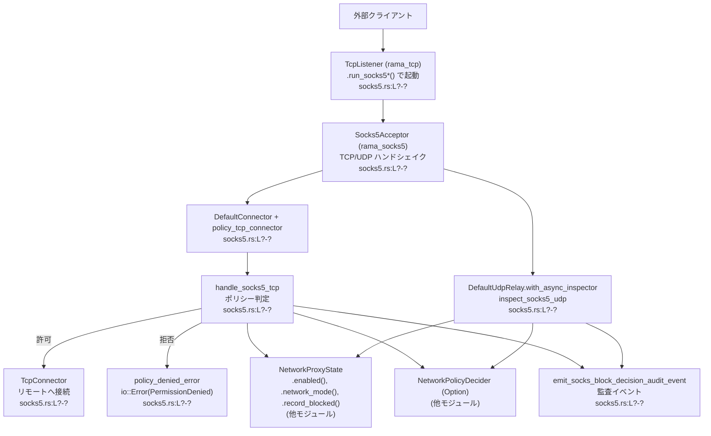
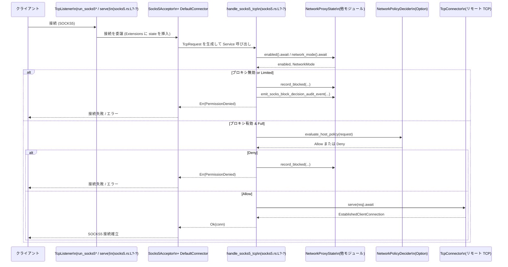

# network-proxy/src/socks5.rs

## 0. ざっくり一言

SOCKS5 プロキシ（TCP/UDP）の入り口です。  
各 SOCKS5 リクエストごとに `NetworkProxyState` とネットワークポリシーを参照して許可/拒否を判断し、拒否時には監査イベントとエラーメッセージを生成します。

> 行番号情報はこのチャンクには含まれていないため、`L?-?` というプレースホルダで表記します。

---

## 1. このモジュールの役割

### 1.1 概要

- このモジュールは **SOCKS5 プロキシサーバの起動と、各リクエストのポリシー判定** を行います。
- TCP/UDP の SOCKS5 リクエストに対して、  
  - プロキシ全体の有効/無効 (`enabled`)  
  - ネットワークモード (`NetworkMode::Full` / `Limited`)  
  - ホスト単位のネットワークポリシー  
  を評価し、許可/拒否・監査イベント送出・ブロック理由の記録を行います。
- 実際の TCP/UDP 接続の確立には `rama_*` 系ライブラリ（`rama_tcp`, `rama_socks5`, `rama_net`）を利用し、ここでは主に **ポリシーと状態管理の接着コード** を提供しています。

### 1.2 アーキテクチャ内での位置づけ

このモジュールは、SOCKS5 レイヤとアプリケーション側のネットワークポリシー／状態管理の間をつなぎます。



位置づけのポイント:

- **下位レイヤ**: `TcpListener`, `Socks5Acceptor`, `DefaultConnector`, `DefaultUdpRelay` などは低レベルな TCP/UDP/SOCKS5 処理を担当します。
- **本モジュール**: それらに対して `Service` を差し込み、`NetworkProxyState` や `NetworkPolicyDecider` を呼び出してポリシー判定を行います。
- **他モジュール**:
  - `crate::state::NetworkProxyState` が設定リロード・有効/無効・モード・ブロック記録を管理します。
  - `crate::network_policy::*` がホスト単位のポリシー判定と監査イベントシステムを提供します。

### 1.3 設計上のポイント

コードから読み取れる特徴を箇条書きにします。

- **責務の分離**
  - 通信処理（SOCKS5 ハンドシェイク、TCP/UDP 接続）は `rama_*` ライブラリに委譲し、  
    本モジュールは「いつ許可し、いつ拒否するか」を決めるポリシー処理に集中しています。
- **状態管理**
  - `NetworkProxyState` は `Arc` で共有され、`AddInputExtensionLayer::new(state)` により各リクエストの拡張情報 (`Extensions`) に注入されます（`run_socks5_with_listener` 内, socks5.rs:L?-?）。
  - 各リクエストハンドラ (`handle_socks5_tcp`, `inspect_socks5_udp`) は `Extensions` から `Arc<NetworkProxyState>` を取り出して利用します。
- **非同期・並行性**
  - すべての I/O は `async fn` で行われます。`TcpListener::serve` が複数接続を並行に処理し、本モジュールのハンドラも `async` です。
  - 共有状態は `Arc` 経由で参照されます。内部の排他制御は `NetworkProxyState` 側に隠蔽されており、このファイル内に `unsafe` やロック操作の記述はありません。
- **エラーハンドリング**
  - プロキシ起動 (`run_socks5*`) は `anyhow::Result<()>` を返し、バインドやリスナー構築の失敗に文脈付きエラーを付加します。
  - リクエスト単位の拒否は `io::ErrorKind::PermissionDenied` を用いて表現し、メッセージには `blocked_message_with_policy` による詳細なポリシー情報を含めます。
  - 内部エラー（状態取得失敗など）は `"proxy error"` としてまとめて返し、詳細はログ (`tracing::error!`) 側で確認する形です。

---

## 2. 主要な機能一覧

### 2.1 コンポーネントインベントリー

> 行番号が与えられていないため、`L?-?` としています。

| 名前 | 種別 | 公開 | 役割 / 説明 | 定義位置 |
|------|------|------|-------------|----------|
| `run_socks5` | 関数 (`async fn`) | `pub` | `SocketAddr` を指定して SOCKS5 プロキシを起動し、TCP リスナーを生成して内部ハンドラに委譲します。 | `network-proxy/src/socks5.rs:L?-?` |
| `run_socks5_with_std_listener` | 関数 (`async fn`) | `pub` | 既存の `StdTcpListener` を `rama_tcp::TcpListener` に変換して SOCKS5 プロキシを起動します。 | 同上 |
| `run_socks5_with_listener` | 関数 (`async fn`) | `async fn`（非公開） | SOCKS5 リスナーに対して TCP/UDP ハンドラ・ポリシーラッパを組み立て、`listener.serve` を開始します。 | 同上 |
| `handle_socks5_tcp` | 関数 (`async fn`) | 非公開 | 各 SOCKS5 TCP 接続の到着時に呼ばれ、`NetworkProxyState` とポリシーを評価して許可/拒否を決定し、許可時は実際の TCP 接続を確立します。 | 同上 |
| `inspect_socks5_udp` | 関数 (`async fn`) | 非公開 | SOCKS5 UDP リレーの各パケットについて、同様にポリシーを評価し、許可時のみペイロードを上流に返します。 | 同上 |
| `emit_socks_block_decision_audit_event` | 関数 | 非公開 | SOCKS5 用のパラメータを `BlockDecisionAuditEventArgs` に詰めて共通の `emit_block_decision_audit_event` を呼び出します。 | 同上 |
| `policy_denied_error` | 関数 | 非公開 | 拒否理由と `PolicyDecisionDetails` から、`PermissionDenied` の `io::Error` を生成します。 | 同上 |
| `StaticReloader` | 構造体（テスト用） | 非公開（tests） | テスト用に固定の `ConfigState` を返す `ConfigReloader` 実装です。 | 同上（`mod tests` 内） |
| `state_for_settings` | 関数 | 非公開（tests） | 指定した `NetworkProxySettings` から `NetworkProxyState` を構築するテスト用ヘルパです。 | 同上 |
| `handle_socks5_tcp_emits_block_decision_for_proxy_disabled` | テスト関数 | 非公開（tests） | プロキシ無効時に SOCKS5 TCP が拒否され、適切な監査イベントが出ることを検証します。 | 同上 |
| `inspect_socks5_udp_emits_block_decision_for_mode_guard_deny` | テスト関数 | 非公開（tests） | `NetworkMode::Limited` で SOCKS5 UDP が拒否され、適切な監査イベントが出ることを検証します。 | 同上 |

### 2.2 機能一覧（観点別）

- SOCKS5 プロキシ起動:
  - `run_socks5`, `run_socks5_with_std_listener`
- TCP 接続ごとのポリシー評価と接続確立:
  - `handle_socks5_tcp` + `TcpConnector`
- UDP リレーごとのポリシー評価:
  - `inspect_socks5_udp` + `DefaultUdpRelay.with_async_inspector`
- ブロック時の監査イベント発行とブロック記録:
  - `emit_socks_block_decision_audit_event`
  - `NetworkProxyState::record_blocked(...)`（別モジュール）
- ブロック時のエラーメッセージ生成:
  - `policy_denied_error` + `blocked_message_with_policy`
- テストサポート:
  - `StaticReloader`, `state_for_settings`, 2 つの tokio テスト

---

## 3. 公開 API と詳細解説

### 3.1 型一覧（構造体・列挙体など）

このファイル内で新たに定義される型はテスト用のみです。

| 名前 | 種別 | 役割 / 用途 | 定義位置 |
|------|------|-------------|----------|
| `StaticReloader` | 構造体（テスト用） | 固定の `ConfigState` を保持し、`ConfigReloader` を実装してテスト中に設定が変わらない環境を再現します。 | `network-proxy/src/socks5.rs:L?-?`（`mod tests` 内） |

### 3.2 関数詳細（主要 7 件）

#### `run_socks5(state: Arc<NetworkProxyState>, addr: SocketAddr, policy_decider: Option<Arc<dyn NetworkPolicyDecider>>, enable_socks5_udp: bool) -> anyhow::Result<()>`

**概要**

- 指定された `SocketAddr` で `rama_tcp::TcpListener` を構築し、SOCKS5 プロキシサーバを起動します（socks5.rs:L?-?）。
- `policy_decider` を通じてホストポリシーを評価するかどうか、`enable_socks5_udp` で UDP サポートを有効にするかを制御できます。

**引数**

| 引数名 | 型 | 説明 |
|--------|----|------|
| `state` | `Arc<NetworkProxyState>` | プロキシのグローバル状態（有効/無効、モード、ブロック記録など）を共有するための参照です。|
| `addr` | `SocketAddr` | SOCKS5 プロキシが待ち受けるローカルアドレスです。|
| `policy_decider` | `Option<Arc<dyn NetworkPolicyDecider>>` | ホストポリシー判定を行うコンポーネント。`None` の場合の挙動は `evaluate_host_policy` の実装依存で、このチャンクでは不明です。|
| `enable_socks5_udp` | `bool` | `true` の場合、UDP ASSOCIATE（UDP リレー）を有効にします。|

**戻り値**

- `Ok(())`: リスナーの起動処理が正常に完了し、`listener.serve(...)` が終了した場合。
- `Err(anyhow::Error)`: リスナーのバインドに失敗した場合など。コンテキストに `"bind SOCKS5 proxy: {addr}"` が付与されます。

**内部処理の流れ**

1. `TcpListener::build().bind(addr).await` で TCP リスナーを作成します。
2. ライブラリ由来の `BoxError` を `OpaqueError` を経由して `anyhow::Error` に変換し、`with_context` でエラー文脈を付けます。
3. 成功した場合、その `listener` と引数を `run_socks5_with_listener(...)` に渡して実際のサーバ処理を委譲します。

**Examples（使用例）**

```rust
use std::{net::SocketAddr, sync::Arc};
use network_proxy::state::NetworkProxyState;
use network_proxy::socks5::run_socks5;

#[tokio::main]
async fn main() -> anyhow::Result<()> {
    let state: Arc<NetworkProxyState> = /* アプリ側で構築済みとする */;
    let addr: SocketAddr = "127.0.0.1:1080".parse()?;

    // ポリシーデコーダなし、UDP 有効で SOCKS5 を起動
    run_socks5(state, addr, None, true).await?;
    Ok(())
}
```

**Errors / Panics**

- TCP ポートがすでに使用中などで `bind` に失敗した場合は `Err(anyhow::Error)` になります。
- この関数自身には `panic!` はありません。

**Edge cases（エッジケース）**

- `addr` が無効（例えば IPv6 がサポートされない環境で IPv6 アドレスを指定）な場合、`bind` が失敗し `Err` を返します。

**使用上の注意点**

- この関数は **同期的に返らず**、内部で `listener.serve(...)` が完了するまでブロックします。通常はアプリケーションのメインタスクとして利用します。
- 並行に複数ポートで SOCKS5 を起動したい場合、別タスクで複数回呼び出す必要があります。

---

#### `run_socks5_with_std_listener(state: Arc<NetworkProxyState>, listener: StdTcpListener, policy_decider: Option<Arc<dyn NetworkPolicyDecider>>, enable_socks5_udp: bool) -> anyhow::Result<()>`

**概要**

- 既存の `std::net::TcpListener` を `rama_tcp::TcpListener` に変換して SOCKS5 プロキシを起動します（socks5.rs:L?-?）。
- 外部でポートバインド済みのリスナーを流用したい場合に使用します。

**引数・戻り値**

- `state`, `policy_decider`, `enable_socks5_udp` は `run_socks5` と同じ意味です。
- `listener`: すでにバインド済みの標準 TCP リスナーです。
- `Ok(())` / `Err(anyhow::Error)` の意味も `run_socks5` と同様です。

**内部処理**

1. `TcpListener::try_from(listener)` で `StdTcpListener` から `rama_tcp::TcpListener` に変換します。失敗時は `"convert std listener to SOCKS5 proxy listener"` というコンテキスト付きエラーを返します。
2. 成功した場合は `run_socks5_with_listener(...)` に委譲します。

**使用上の注意点**

- `StdTcpListener` 側で `set_nonblocking` などの設定がされている場合の扱いは、このチャンクでは不明です。`try_from` の実装に依存します。
- `run_socks5` と異なり、バインドのタイミングをアプリ側で制御したい場合に利用します。

---

#### `run_socks5_with_listener(state: Arc<NetworkProxyState>, listener: TcpListener, policy_decider: Option<Arc<dyn NetworkPolicyDecider>>, enable_socks5_udp: bool) -> anyhow::Result<()>`

**概要**

- 低レベルな `TcpListener` に対して SOCKS5 アクセプタとポリシーハンドラを組み合わせ、TCP/UDP を処理するサーバループを起動します（socks5.rs:L?-?）。
- 外部モジュールから直接呼ばれることは想定されていない内部関数です。

**引数**

- `state`, `policy_decider`, `enable_socks5_udp`: `run_socks5` と同じ。
- `listener`: 既にバインド済みの `rama_tcp::TcpListener`。

**戻り値**

- `Ok(())`: `listener.serve(...)` が完了した場合。
- `Err(anyhow::Error)`: `listener.local_addr()` が失敗した場合など。

**内部処理の流れ**

1. `listener.local_addr()` で実際の待ち受けアドレスを取得し、`info!` ログで出力します。
2. `state.network_mode().await` を読み:
   - `Ok(NetworkMode::Limited)` の場合は「limited モードでは SOCKS5 はブロックされる」という情報ログのみ出し、サーバ自体は起動します（実際のリクエストはハンドラ側で拒否されます）。
   - `Ok(NetworkMode::Full)` の場合は何もせず続行。
   - エラー時は `warn!` ログを出して続行。
3. `TcpConnector::default()` を作成します。
4. `service_fn` を使って `TcpRequest` → `handle_socks5_tcp` を呼ぶラッパ (`policy_tcp_connector`) を定義します。ここで `tcp_connector` と `policy_decider` をクローンして `async move` クロージャにキャプチャします。
5. `DefaultConnector::default().with_connector(policy_tcp_connector)` により、SOCKS5 の TCP 接続をポリシー付きコネクタで処理するよう構成します。
6. `Socks5Acceptor::new().with_connector(socks_connector)` を作成し、必要に応じて UDP リレーを追加します。
   - `enable_socks5_udp == true` の場合:
     - `DefaultUdpRelay::default().with_async_inspector(service_fn(...))` で `inspect_socks5_udp` を呼び出すインスペクタを設定し、`base.with_udp_associator(udp_relay)` で UDP を有効化します。
   - `false` の場合: UDP なしで `base` をそのまま使用します。
7. どちらの場合も `AddInputExtensionLayer::new(state)` で `NetworkProxyState` を各リクエストの `Extensions` に注入したうえで、`listener.serve(...)` を `await` します。

**使用上の注意点**

- `AddInputExtensionLayer::new(state)` により、後続の `handle_socks5_tcp` / `inspect_socks5_udp` が `NetworkProxyState` を必ず取得できるようにしています。独自に構成を組む場合は、このレイヤを省略すると `"missing state"` エラーになります。
- `enable_socks5_udp` によって、UDP の有効・無効を完全に切り替えられます。UDP を許可したくない環境では `false` にすると、TCP のみが処理されます。

---

#### `handle_socks5_tcp(req: TcpRequest, tcp_connector: TcpConnector, policy_decider: Option<Arc<dyn NetworkPolicyDecider>>) -> Result<EstablishedClientConnection<TcpStream, TcpRequest>, BoxError>`

**概要**

- 各 SOCKS5 TCP 接続について、クライアント情報・接続先ホスト・ポリシー状態を評価し、許可された場合のみ実際の TCP 接続を張ります（socks5.rs:L?-?）。
- 拒否された場合は `PermissionDenied` の `io::Error` を `BoxError` として返します。

**引数**

| 引数名 | 型 | 説明 |
|--------|----|------|
| `req` | `TcpRequest` | 接続先ホスト/ポート (`req.authority`) や拡張情報 (`ExtensionsRef`) を含むリクエストです。|
| `tcp_connector` | `TcpConnector` | 実際にリモートサーバへ TCP 接続を行うコネクタです。`Clone` 可能です。|
| `policy_decider` | `Option<Arc<dyn NetworkPolicyDecider>>` | ホストごとの詳細ポリシーを判定するオブジェクト。`None` の場合の扱いは `evaluate_host_policy` 実装に依存します。|

**戻り値**

- `Ok(EstablishedClientConnection<TcpStream, TcpRequest>)`: ポリシー許可後に TCP 接続に成功した場合。
- `Err(BoxError)`: 状態取得エラー、ポリシー拒否、接続失敗など、いずれかの理由で処理できなかった場合。

**内部処理の流れ**

1. **状態/クライアント情報取得**
   - `req.extensions().get::<Arc<NetworkProxyState>>()` から `app_state` を取得。存在しない場合は `io::Error::other("missing state")` を返します。
   - `normalize_host(&req.authority.host.to_string())` でホスト名を正規化し、`port = req.authority.port` を取得します。ホスト名が空文字列の場合は `InvalidInput("invalid host")` エラー。
   - `req.extensions().get::<SocketInfo>()` からクライアントアドレスを取得（存在しない場合は `None`）。
2. **プロキシ有効フラグのチェック**
   - `app_state.enabled().await` を呼び、`false` の場合:
     - `emit_socks_block_decision_audit_event(... NetworkDecisionSource::ProxyState, REASON_PROXY_DISABLED, NetworkProtocol::Socks5Tcp, ...)` で監査イベント送出。
     - `PolicyDecisionDetails { decision: Deny, reason: REASON_PROXY_DISABLED, source: ProxyState, ... }` を構築。
     - `app_state.record_blocked(...)` でブロック記録を非同期で保存（結果は無視）。
     - `warn!` ログ。
     - `policy_denied_error(REASON_PROXY_DISABLED, &details)` を `BoxError` に変換して返す。
   - エラー時は `error!` ログ後、`io::Error::other("proxy error")`。
3. **ネットワークモードチェック**
   - `app_state.network_mode().await` で `NetworkMode` を取得。
   - `Limited` の場合:
     - 同様に `emit_socks_block_decision_audit_event`（`source=ModeGuard`, `reason=REASON_METHOD_NOT_ALLOWED`）。
     - `mode: Some(NetworkMode::Limited)` を含む `BlockedRequestArgs` で記録。
     - `warn!` ログ（allowed_methods=GET, HEAD, OPTIONS というメッセージ含む）。
     - `policy_denied_error(REASON_METHOD_NOT_ALLOWED, &details)` を返す。
   - `Full` の場合は続行。
   - エラー時は `error!` ログ後、`io::Error::other("proxy error")`。
4. **ホストポリシー評価**
   - `NetworkPolicyRequest::new(NetworkPolicyRequestArgs { protocol: Socks5Tcp, host, port, client_addr: client.clone(), method: None, command: None, exec_policy_hint: None })` を作成。
   - `evaluate_host_policy(&app_state, policy_decider.as_ref(), &request).await` を呼び:
     - `Ok(NetworkDecision::Deny { reason, source, decision })` の場合:
       - `PolicyDecisionDetails` を作成し、`record_blocked` + `warn!` + `policy_denied_error(&reason, &details)`。
     - `Ok(NetworkDecision::Allow)` の場合:
       - クライアント・ホスト・ポート情報を含めて `info!` ログ。
     - エラー時は `error!` ログ後、`io::Error::other("proxy error")`。
5. **実際の TCP 接続確立**
   - ここまで到達した場合のみ、`tcp_connector.serve(req).await` を呼び出し、その結果をそのまま呼び出し元へ返します。

**Examples（使用例）**

通常は直接呼ばず、`run_socks5_with_listener` 経由で `Service` として使われます。  
テストコードでは次のように直接呼び出しています（socks5.rs:L?-?）。

```rust
use rama_tcp::client::service::TcpConnector;
use rama_net::address::HostWithPort;

let mut request =
    TcpRequest::new(HostWithPort::try_from("example.com:443").expect("valid authority"));
request.extensions_mut().insert(state.clone());

let result = handle_socks5_tcp(
    request,
    TcpConnector::default(),
    None, // policy_decider なし
).await;
assert!(result.is_err());
```

**Errors / Panics**

- `Extensions` に `Arc<NetworkProxyState>` が無い場合: `"missing state"` の `io::Error`（`BoxError`）になります。
- ホストが空の場合: `InvalidInput("invalid host")` になります。
- プロキシ無効 (`enabled == false`)、`NetworkMode::Limited`、ホストポリシー拒否のいずれの場合も `io::ErrorKind::PermissionDenied` を返します。
- 内部状態取得 (`enabled`, `network_mode`) や `evaluate_host_policy` のエラーは `"proxy error"` として返されます。
- `panic!` は使用されていません。

**Edge cases（エッジケース）**

- `SocketInfo` が拡張情報に存在しない場合、クライアントアドレスは `None` となり、ログでは `client=""` になります。監査イベントでは `"unknown"` に変換されることがテストから確認できます。
- `policy_decider` が `None` の場合のポリシー判定の挙動（常に許可/拒否など）は、`evaluate_host_policy` の実装に依存し、このチャンクからは分かりません。
- `NetworkMode::Limited` のとき、SOCKS5 TCP は一律拒否されます。これは HTTP 用の「許可メソッド」メッセージを流用しており、SOCKS リクエスト自体には HTTP メソッドがない点に注意が必要です。

**使用上の注意点**

- この関数を直接使う場合は、**必ず** `req.extensions_mut().insert(Arc<NetworkProxyState>)` を事前に行う必要があります。
- 並行性については、`NetworkProxyState` が `Arc` で共有される前提で設計されており、同時に多くの接続をさばいても安全に動作するようになっています（内部実装は別モジュール）。

---

#### `inspect_socks5_udp(request: RelayRequest, state: Arc<NetworkProxyState>, policy_decider: Option<Arc<dyn NetworkPolicyDecider>>) -> io::Result<RelayResponse>`

**概要**

- SOCKS5 UDP リレー（`DefaultUdpRelay`）が各パケットを中継する際に呼び出され、`RelayRequest` の内容を監査・ポリシー評価して、許可された場合のみペイロードを返します（socks5.rs:L?-?）。

**引数**

| 引数名 | 型 | 説明 |
|--------|----|------|
| `request` | `RelayRequest` | SOCKS5 UDP リレーに渡されたパケット情報。サーバアドレス、ペイロード、拡張情報などを含みます。|
| `state` | `Arc<NetworkProxyState>` | TCP と同様、プロキシのグローバル状態管理オブジェクトです。|
| `policy_decider` | `Option<Arc<dyn NetworkPolicyDecider>>` | ホストポリシー判定用オブジェクト（任意）。|

**戻り値**

- `Ok(RelayResponse)`:
  - 許可された場合、`RelayResponse { maybe_payload: Some(payload), extensions }` を返します。
- `Err(io::Error)`:
  - `InvalidInput("invalid host")` や `PermissionDenied`、`"proxy error"` などの理由で拒否された場合。

**内部処理の流れ**

1. `RelayRequest { server_address, payload, extensions, .. } = request` で分解します。
2. `normalize_host(&server_address.ip_addr.to_string())` でホスト文字列を作成し、`port = server_address.port` を取得します。ホストが空の場合は `InvalidInput("invalid host")`。
3. `extensions.get::<SocketInfo>()` からクライアントアドレスを取得（存在すれば）。
4. `state.enabled().await` に基づき、TCP と同様に:
   - `false` の場合: `emit_socks_block_decision_audit_event(... NetworkProtocol::Socks5Udp, REASON_PROXY_DISABLED, source=ProxyState)` → `record_blocked` → `warn!` → `policy_denied_error(REASON_PROXY_DISABLED, &details)`。
   - エラー時は `"proxy error"`。
5. `state.network_mode().await` をチェックし:
   - `Limited` の場合: 同様に `source=ModeGuard`, `reason=REASON_METHOD_NOT_ALLOWED` で拒否。
   - `Full` の場合: 続行。
   - エラー時: `"proxy error"`。
6. `NetworkPolicyRequest` を `protocol: Socks5Udp` で作成し、`evaluate_host_policy` を呼び出します。
   - `NetworkDecision::Deny { .. }` の場合: `record_blocked` + `warn!` + `policy_denied_error(...)`。
   - `NetworkDecision::Allow` の場合: `Ok(RelayResponse { maybe_payload: Some(payload), extensions })`。
   - エラー時: `"proxy error"`。

**Examples（使用例）**

この関数は `DefaultUdpRelay::with_async_inspector` から自動的に呼ばれます（socks5.rs:L?-?）。

```rust
use rama_socks5::server::udp::RelayRequest;
use rama_socks5::server::udp::RelayDirection;
use rama_net::address::SocketAddress;
use std::net::{IpAddr, Ipv4Addr};
use rama_core::extensions::Extensions;

let request = RelayRequest {
    direction: RelayDirection::South,
    server_address: SocketAddress::new(IpAddr::V4(Ipv4Addr::new(93,184,216,34)), 53),
    payload: Default::default(),
    extensions: Extensions::new(),
};

let result = inspect_socks5_udp(request, state.clone(), None).await;
```

**Errors / Panics**

- ホスト文字列が空の場合: `InvalidInput("invalid host")`。
- プロキシ無効 / モード制限 / ポリシー拒否時: `PermissionDenied`。
- 状態取得やポリシー評価でエラーが発生した場合: `io::Error::other("proxy error")`。
- `panic!` は使われていません。

**Edge cases（エッジケース）**

- `extensions` に `SocketInfo` が無い場合、クライアントアドレスは `"unknown"` として監査イベントに記録されることがテストから確認できます。
- `NetworkMode::Limited` の場合、UDP は完全に禁止されます（`inspect_socks5_udp_emits_block_decision_for_mode_guard_deny` テスト参照）。
- UDP の場合、許可時には元の `payload` がそのまま `maybe_payload: Some(payload)` として返され、パケット内容の変更は行われません。

**使用上の注意点**

- `inspect_socks5_udp` を差し込まないと、UDP リレーにはポリシーが適用されません。`run_socks5_with_listener` では `enable_socks5_udp` フラグでこの挙動を制御しています。
- TCP と同様に、`NetworkProxyState` は `Arc` 共有されている前提で、並行に多くのパケットを処理しても安全に動作します。

---

#### `emit_socks_block_decision_audit_event(state: &NetworkProxyState, source: NetworkDecisionSource, reason: &str, protocol: NetworkProtocol, host: &str, port: u16, client_addr: Option<&str>)`

**概要**

- SOCKS5 固有のブロックイベント情報を、汎用の `emit_block_decision_audit_event` に変換して送出する薄いラッパです（socks5.rs:L?-?）。

**引数**

| 引数名 | 型 | 説明 |
|--------|----|------|
| `state` | `&NetworkProxyState` | イベント送出に必要なコンテキストを持つ状態オブジェクトです。|
| `source` | `NetworkDecisionSource` | ブロックの原因元（例: `ProxyState`, `ModeGuard` など）。|
| `reason` | `&str` | ブロック理由（`REASON_PROXY_DISABLED` など）。|
| `protocol` | `NetworkProtocol` | `Socks5Tcp` または `Socks5Udp`。|
| `host` | `&str` | 接続先ホスト名または IP アドレス。|
| `port` | `u16` | 接続先ポート。|
| `client_addr` | `Option<&str>` | クライアントアドレス文字列。`None` の場合は `"unknown"` などへの変換は別モジュールに依存します。|

**戻り値**

- 戻り値はありません。副作用として監査イベントを発行します。

**内部処理**

- `BlockDecisionAuditEventArgs { source, reason, protocol, server_address: host, server_port: port, method: None, client_addr }` を構築し、`emit_block_decision_audit_event(state, args)` を呼び出すだけです。

**使用上の注意点**

- HTTP では `method` が意味を持ちますが、SOCKS5 では常に `None` としています。その結果、監査イベントでは `"http.request.method" == "none"` となることがテストから確認できます。

---

#### `policy_denied_error(reason: &str, details: &PolicyDecisionDetails<'_>) -> io::Error`

**概要**

- ポリシー拒否時にクライアントへ返す `io::Error` を構築します（socks5.rs:L?-?）。
- メッセージ本文は `blocked_message_with_policy(reason, details)` によって生成されます。

**引数**

| 引数名 | 型 | 説明 |
|--------|----|------|
| `reason` | `&str` | ブロック理由。イベントにも利用されるものと同じ文字列です。|
| `details` | `&PolicyDecisionDetails<'_>` | 決定種別 (`Allow`/`Deny`)、プロトコル、ホスト、ポート、ソースなどの詳細を含みます。|

**戻り値**

- `io::Error`:
  - `io::ErrorKind::PermissionDenied` で、メッセージには `blocked_message_with_policy` の返り値が含まれます。

**使用上の注意点**

- この関数を通すことで、拒否理由に一貫したフォーマットを与えています。  
  クライアントに露出するメッセージの機密性（内部のポリシー情報をどこまで含めるか）は `blocked_message_with_policy` の実装に依存します。

---

### 3.3 その他の関数・メソッド（概要のみ）

| 関数/メソッド名 | 役割 |
|-----------------|------|
| `StaticReloader::maybe_reload` (tests) | 常に `Ok(None)` を返し、テスト中に設定が変わらないことを表現します。|
| `StaticReloader::reload_now` (tests) | 保持している `ConfigState` をクローンして返します。|
| `StaticReloader::source_label` (tests) | `"static test reloader"` というラベル文字列を返します。|
| `state_for_settings` (tests) | `NetworkProxySettings` から `NetworkProxyConfig` → `build_config_state` → `NetworkProxyState::with_reloader` を呼び、テスト用の `NetworkProxyState` を構築します。|

---

## 4. データフロー

ここでは典型的な「SOCKS5 TCP 接続がポリシー判定を経てリモートサーバへ接続される」フローを示します。



UDP の場合もほぼ同様ですが、`handle_socks5_tcp` の代わりに `inspect_socks5_udp` が `RelayRequest` を受け取り、許可されたときに `RelayResponse` としてペイロードを返します。

---

## 5. 使い方（How to Use）

### 5.1 基本的な使用方法

アプリケーション内で SOCKS5 プロキシを起動する基本的なフローです。

```rust
use std::{net::SocketAddr, sync::Arc};
use network_proxy::state::NetworkProxyState;
use network_proxy::socks5::run_socks5;
// 必要であれば NetworkPolicyDecider の実装もインポート

#[tokio::main]
async fn main() -> anyhow::Result<()> {
    // NetworkProxyState は別モジュールで構築される前提
    let state: Arc<NetworkProxyState> = /* アプリ側で構築 */;

    let addr: SocketAddr = "127.0.0.1:1080".parse()?;

    // ポリシーデシダなし、UDP 有効で SOCKS5 を起動
    run_socks5(state, addr, None, true).await
}
```

ポイント:

- `NetworkProxyState` の具体的な構築方法（設定ファイルの読み込みなど）はこのファイルには含まれていませんが、テストコードでは `build_config_state` と `NetworkProxyState::with_reloader` を利用しています。
- `policy_decider` を渡せば、追加のホストポリシー判定を組み込むことができます。

### 5.2 よくある使用パターン

1. **UDP を無効化して TCP のみ許可**

```rust
run_socks5(state.clone(), addr, None, false).await?;
```

- UDP を使う必要がない場合、`enable_socks5_udp = false` にすると UDP リレー部分 (`inspect_socks5_udp`) が使われなくなります。

1. **既存の `StdTcpListener` を流用**

```rust
use std::net::TcpListener as StdTcpListener;
use network_proxy::socks5::run_socks5_with_std_listener;

let std_listener = StdTcpListener::bind("0.0.0.0:1080")?;
run_socks5_with_std_listener(state, std_listener, Some(policy_decider), true).await?;
```

- OS レベルのソケットオプションを細かく設定したい場合に便利です。

### 5.3 よくある間違い

```rust
use rama_tcp::client::service::TcpConnector;

// 間違い例: state を Extensions に入れずに handle_socks5_tcp を直接呼ぶ
async fn wrong(req: TcpRequest) {
    let result = handle_socks5_tcp(req, TcpConnector::default(), None).await;
    // result は Err("missing state") になる
}

// 正しい例: Extensions に Arc<NetworkProxyState> を挿入してから呼ぶ
async fn correct(mut req: TcpRequest, state: Arc<NetworkProxyState>) {
    req.extensions_mut().insert(state);
    let result = handle_socks5_tcp(req, TcpConnector::default(), None).await;
}
```

- 実運用では `run_socks5_with_listener` が `AddInputExtensionLayer::new(state)` を通してくれるため、通常はこのミスは発生しませんが、ハンドラを直接テストする場合に注意が必要です。

### 5.4 使用上の注意点（まとめ）

- **前提条件**
  - `NetworkProxyState` は適切に初期化されている必要があります（`enabled` フラグや `NetworkMode` の設定）。
  - `run_socks5*` を起動する前に、必要なポリシー設定が `NetworkPolicyDecider` にロードされている必要があります。
- **エラー処理**
  - クライアントから見えるエラーは基本的に `PermissionDenied` または接続エラーとなります。詳細な拒否理由はログと監査イベントで確認します。
- **並行性**
  - このモジュール内では `Arc` 以外の共有アクセスはなく、`listener.serve` により多数の接続が並行処理されます。CPU/メモリ負荷の監視は別途必要です。
- **セキュリティ**
  - `policy_decider` を `None` にした場合の挙動は、ホストポリシーの実装次第です。このチャンクだけでは「すべて許可」かどうかは判別できません。

---

## 6. 変更の仕方（How to Modify）

### 6.1 新しい機能を追加する場合

例: SOCKS5 のコマンド種別（CONNECT, UDP ASSOCIATE など）に応じてポリシーを変えたい場合。

1. **情報の受け渡し**
   - `handle_socks5_tcp` / `inspect_socks5_udp` で、必要であれば `NetworkPolicyRequestArgs` の `command` フィールドに情報を詰めるよう変更します（現在は `None` 固定）。
2. **ポリシー側の拡張**
   - `crate::network_policy` モジュールで `command` を考慮するよう拡張します。
3. **監査イベント**
   - 必要であれば `BlockDecisionAuditEventArgs` に追加情報を足し、それを `emit_socks_block_decision_audit_event` から渡すようにします。
4. **テスト**
   - `mod tests` 内のようなスタイルで、新しい条件が監査イベントに反映されることを検証するテストを追加します。

### 6.2 既存の機能を変更する場合

- **影響範囲の確認**
  - `handle_socks5_tcp` / `inspect_socks5_udp` は、TCP/UDP の全リクエストに対するゲートになっています。ここを変えると SOCKS5 全体の挙動が変わります。
  - 監査イベント系 (`emit_socks_block_decision_audit_event`) を変更すると、他モジュールのログ解析・メトリクス収集に影響する可能性があります。
- **契約・前提条件**
  - `NetworkMode::Limited` で SOCKS5 は拒否される、という契約はテストでも確認されているため、この仕様を変える場合はテストも更新する必要があります。
  - 拒否時には `PermissionDenied` を返す、という挙動もクライアント側コードに依存されている可能性があります。
- **確認すべきテスト**
  - `handle_socks5_tcp_emits_block_decision_for_proxy_disabled`
  - `inspect_socks5_udp_emits_block_decision_for_mode_guard_deny`
  - これらが通ることを確認しつつ、新たな条件に応じたテストを追加します。

---

## 7. 関連ファイル

| パス / モジュール | 役割 / 関係 |
|-------------------|------------|
| `crate::config` (`NetworkMode`, `NetworkProxySettings`, `NetworkProxyConfig`) | プロキシの有効/無効やモードなどの設定値を定義します。テストではこれを使って `NetworkProxyState` を構築しています。|
| `crate::state` (`NetworkProxyState`, `BlockedRequest`, `BlockedRequestArgs`, `NetworkProxyConstraints`, `build_config_state`) | プロキシ全体の状態管理と、ブロックされたリクエストの記録機能を提供します。|
| `crate::network_policy` (`NetworkPolicyDecider`, `NetworkDecision`, `NetworkDecisionSource`, `NetworkPolicyDecision`, `NetworkPolicyRequest`, `NetworkPolicyRequestArgs`, `NetworkProtocol`, `emit_block_decision_audit_event`, `evaluate_host_policy`) | ホスト単位のポリシー判定ロジックと、監査イベント発行の基盤を提供します。|
| `crate::policy::normalize_host` | ホスト名/IP アドレス文字列の正規化処理を行います。SOCKS5 の TCP/UDP 現場で使用されています。|
| `crate::responses` (`PolicyDecisionDetails`, `blocked_message_with_policy`) | クライアント向けのブロックメッセージ生成など、レスポンス表現を担当します。|
| `crate::reasons` (`REASON_METHOD_NOT_ALLOWED`, `REASON_PROXY_DISABLED`) | ブロック理由の定数を定義します。ログ・イベント・エラーメッセージで共通利用されます。|
| `crate::runtime` (`ConfigReloader`, `ConfigState`) | 設定リロードの仕組みを定義します。テストでは `StaticReloader` と組み合わせて使用されています。|
| `http_proxy.rs`（コメント参照） | `BoxError` のラップ理由など、HTTP プロキシ側の実装が参考として言及されています。実体はこのチャンクには含まれていません。|

---

### Bugs / Security / Contracts / Tests / Performance のまとめ（このファイルから分かる範囲）

- **Bugs（コードから読み取れる明確な不具合）**
  - このチャンクだけから明確に不具合と断定できる挙動はありません。
- **Security**
  - プロキシ無効・`NetworkMode::Limited`・ホストポリシーの 3 段階でリクエストを拒否できる設計になっています。
  - `policy_decider` を `None` とした場合のセキュリティ上の意味（デフォルト許可/拒否）は別モジュール依存で、このチャンクからは判断できません。
- **Contracts / Edge Cases**
  - SOCKS5 は `NetworkMode::Limited` では拒否される、という契約がテストで固定されています。
  - 拒否時は `PermissionDenied`、内部エラー時は `"proxy error"` でまとめる、というインタフェース契約があります。
- **Tests**
  - 少なくとも「プロキシ無効時の TCP ブロック」と「`NetworkMode::Limited` 時の UDP ブロック」について、監査イベントの内容を含めてテストされています。
- **Performance / Scalability**
  - 各リクエストで `enabled().await`, `network_mode().await`, `evaluate_host_policy().await` を呼び出しており、これらのコストがスループットに影響します。  
    ただし、このチャンク内では重いループや同期ロックは見当たりません。
- **Observability**
  - `tracing` による `info!`, `warn!`, `error!` ログに加え、`emit_block_decision_audit_event` による構造化イベントが発行されます。  
    テストでイベント内容を検証しており、監査・可観測性を前提とした設計になっています。
