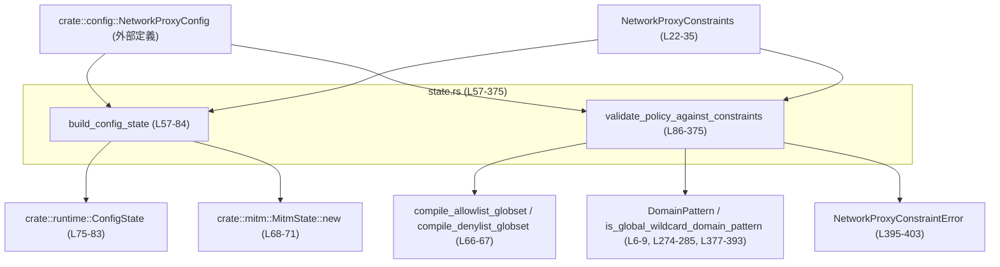
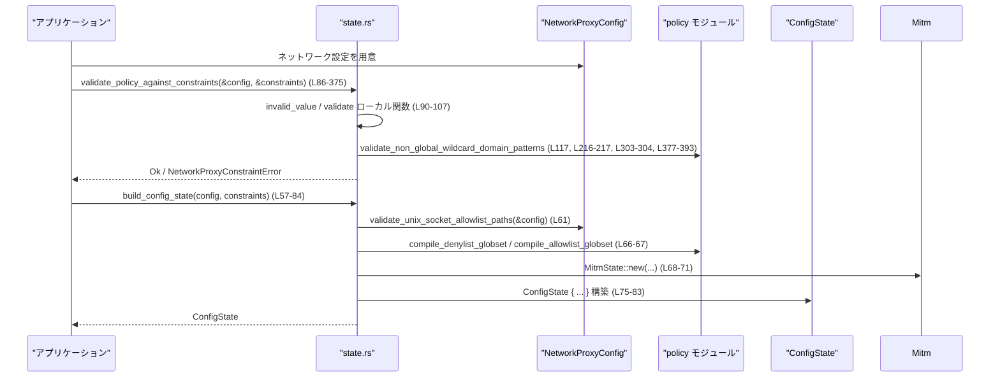

# network-proxy/src/state.rs コード解説

## 0. ざっくり一言

このモジュールは、ネットワークプロキシ設定と「マネージドな制約（ポリシー）」を表現し、それらの整合性を検証したうえで、実行時に利用する `ConfigState` を構築する役割を持ちます（`build_config_state`・`validate_policy_against_constraints` が中心、根拠: `network-proxy/src/state.rs:L57-84`, `L86-375`）。

---

## 1. このモジュールの役割

### 1.1 概要

- このモジュールは、**ユーザーのネットワークプロキシ設定 (`NetworkProxyConfig`)** が、**管理者が定義した最大許容値 (`NetworkProxyConstraints`)** を超えないことを検証し（`validate_policy_against_constraints`）、  
  問題がなければ実行時に使う `ConfigState` を構築します（`build_config_state`、`network-proxy/src/state.rs:L57-84`, `L86-375`）。
- 併せて、設定ファイルからの部分的な読み込み用に `PartialNetworkProxyConfig` / `PartialNetworkConfig` を提供し（`L37-55`）、  
  ランタイム側の型をいくつか再エクスポートすることで、このモジュールを「ネットワークプロキシ状態のフロントドア」として機能させています（`L15-18`）。

### 1.2 アーキテクチャ内での位置づけ

このモジュールは以下のモジュールと連携します。

- `crate::config`  
  - `NetworkProxyConfig`, `NetworkMode`, `NetworkDomainPermissions`, `NetworkUnixSocketPermissions` などの設定型と、  
    `validate_unix_socket_allowlist_paths` を利用します（`L1-4`, `L61`）。
- `crate::policy`  
  - ドメインパターン (`DomainPattern`) と allow/deny リスト用の globset コンパイル関数、および  
    「グローバルワイルドカード」判定関数を利用します（`L6-9`, `L64-67`, `L217`, `L304`, `L377-393`）。
- `crate::runtime`  
  - 実行時状態 `ConfigState` を構築し（`L10`, `L75-83`）、  
    `BlockedRequest` などの型を再エクスポートします（`L15-18`）。
- `crate::mitm`  
  - MITM（Man-in-the-middle）用の状態 `MitmState` を `Arc` で共有します（`L5`, `L68-73`）。

これを簡略図で表すと次のようになります。



### 1.3 設計上のポイント

- **制約はすべて Option で表現**  
  - `NetworkProxyConstraints` の各フィールドは `Option<T>` で、`None` は「この項目については制約なし」を意味します（`L23-35`）。  
    これにより、「一部だけを強制し、他はユーザーに任せる」といった柔軟な管理が可能です。
- **検証と状態構築の分離**
  - `validate_policy_against_constraints` は純粋に「設定が制約を破っていないか」を検査し（戻り値 `Result<(), NetworkProxyConstraintError>`、`L86-375`）、  
    `build_config_state` はエラー以外の制約チェックは行わず、`ConfigState` を構築するだけです（`L57-84`）。  
    したがって、制約に基づく拒否を行いたい場合は、**呼び出し側が明示的に `validate_policy_against_constraints` を呼ぶ必要があります**。
- **ドメイン/Socket 設定の厳格な扱い**
  - ドメインの allow/deny リストは大小文字を正規化し `HashSet` で比較することで、**大文字・小文字の差を無視した集合比較**を行っています（`L112-115`, `L220-223`, `L249-253`, `L305-308`, `L351-354`）。
  - 「グローバルワイルドカード（例: `*` だけのパターン）」は明示的に禁止され、専用関数で検査されます（`validate_non_global_wildcard_domain_patterns`, `L377-393`）。
- **エラーハンドリングの方針**
  - 制約違反には専用の `NetworkProxyConstraintError` を用い（`L395-403`）、  
    一部の箇所ではそれを `anyhow::Error` に変換してより汎用的なエラー型として扱います（`into_anyhow`, `L405-408`, `build_config_state` 内 `L64-65`）。
- **並行性の考慮**
  - MITM 状態は `Arc<MitmState>` で共有される形になっており（`L68-73`）、  
    将来的・外部的には複数スレッドから共有されることを想定した構造になっています。  
    本ファイル内ではスレッド生成や `async` は利用していません。

---

## 2. 主要な機能一覧

- ネットワークプロキシ制約の表現: `NetworkProxyConstraints` による管理ポリシーの上限定義（`L22-35`）
- 設定ファイルからの部分的な読み込み: `PartialNetworkProxyConfig` / `PartialNetworkConfig` による `serde` デシリアライズ（`L37-55`）
- 実行時状態の構築: `build_config_state` で `NetworkProxyConfig` から `ConfigState` を生成（`L57-84`）
- 設定と制約の整合性検証: `validate_policy_against_constraints` による詳細なフィールド別チェック（`L86-375`）
- グローバルワイルドカードの禁止チェック: `validate_non_global_wildcard_domain_patterns`（`L377-393`）
- 制約違反エラー型の提供: `NetworkProxyConstraintError` と `into_anyhow`（`L395-408`）
- ランタイム型の再エクスポート: `BlockedRequest` / `BlockedRequestArgs` / `NetworkProxyAuditMetadata` / `NetworkProxyState`（`L15-18`）

---

## 3. 公開 API と詳細解説

### 3.1 型一覧（構造体・列挙体など）

#### 自モジュール定義の主な型

| 名前 | 種別 | 公開範囲 | 役割 / 用途 | 定義位置 |
|------|------|----------|-------------|----------|
| `NetworkProxyConstraints` | 構造体 | `pub` | 管理ポリシー側が設定できる「最大許容値」を表す。各フィールドが `Option` で、`None` は制約無しを意味する。| `network-proxy/src/state.rs:L22-35` |
| `PartialNetworkProxyConfig` | 構造体 | `pub` | 設定ファイル全体からネットワーク関連部分だけを部分的にデシリアライズするためのラッパ。`network: PartialNetworkConfig` を持つ。 | `network-proxy/src/state.rs:L37-41` |
| `PartialNetworkConfig` | 構造体 | `pub` | ネットワーク設定セクションの部分的な表現。すべて `Option` になっており、未指定を区別できる。 | `network-proxy/src/state.rs:L43-55` |
| `NetworkProxyConstraintError` | 列挙体 | `pub` | 制約違反を表現するエラー型。現在は `InvalidValue` バリアントのみ。`thiserror::Error` を実装。 | `network-proxy/src/state.rs:L395-403` |

#### 再エクスポートされる型

| 名前 | 種別 | 公開範囲 | 元定義モジュール | 役割 / 用途 | 根拠 |
|------|------|----------|------------------|-------------|------|
| `BlockedRequest` | 型（詳細不明） | `pub` | `crate::runtime` | ブロックされたリクエストを表すランタイム型（名前から推測、詳細はこのチャンクには現れない）。 | `network-proxy/src/state.rs:L15` |
| `BlockedRequestArgs` | 型 | `pub` | `crate::runtime` | ブロックされたリクエストに関する付随情報を表す型と考えられるが、詳細はこのチャンクには現れない。 | `network-proxy/src/state.rs:L16` |
| `NetworkProxyAuditMetadata` | 型 | `pub` | `crate::runtime` | 監査用メタデータ（ログ等）を保持する型と思われるが、詳細はこのチャンクには現れない。 | `network-proxy/src/state.rs:L17` |
| `NetworkProxyState` | 型 | `pub` | `crate::runtime` | ネットワークプロキシの実行時状態を表す型。`ConfigState` と関連があると推測されるが、定義はこのチャンクには現れない。 | `network-proxy/src/state.rs:L18` |
| `network_proxy_state_for_policy` | 関数 or コンストラクタ | `pub(crate)` | `crate::runtime` | テスト時にのみ利用される状態生成ヘルパー（`#[cfg(test)]`）。 | `network-proxy/src/state.rs:L19-20` |

> 再エクスポートされた型・関数の**具体的なフィールド・振る舞い**は、このチャンクには現れません。

---

### 3.2 関数詳細

#### `build_config_state(config: NetworkProxyConfig, constraints: NetworkProxyConstraints) -> anyhow::Result<ConfigState>`

**概要**

- `NetworkProxyConfig` と `NetworkProxyConstraints` から、実行時に利用する `ConfigState` を構築します（`L57-84`）。
- UNIX ソケットの許可リストパスの検証、ドメインの allow/deny リストのコンパイル、MITM 状態の初期化を行います。

**引数**

| 引数名 | 型 | 説明 |
|--------|----|------|
| `config` | `NetworkProxyConfig` | ネットワーク設定全体。`config.network` 以下からドメインやソケットの設定を参照します（`L58`, `L62-63`, `L68-71`）。 |
| `constraints` | `NetworkProxyConstraints` | 管理ポリシー制約。ここでは `ConfigState` に保持されるだけで、検証は行いません（`L59`, `L80`）。 |

**戻り値**

- `Ok(ConfigState)`  
  - ランタイム用の設定状態。`config`, `allow_set`, `deny_set`, `mitm`, `constraints`, `blocked`, `blocked_total` を含みます（`L75-83`）。
- `Err(anyhow::Error)`  
  - 以下のいずれかの検証・初期化に失敗した場合（`?` 演算子経由）。

**内部処理の流れ**

1. **UNIX ソケットのパス検証**  
   - `crate::config::validate_unix_socket_allowlist_paths(&config)?;` を呼び、設定中の UNIX ソケット許可パスを検証します（`L61`）。
2. **ドメインリストの取得**  
   - `allowed_domains = config.network.allowed_domains().unwrap_or_default();`（`L62`）  
   - `denied_domains = config.network.denied_domains().unwrap_or_default();`（`L63`）  
     - `Option<Vec<String>>` を `Vec<String>` に変換し、未指定なら空ベクタにします。
3. **deny リストのグローバルワイルドカード禁止チェック**  
   - `validate_non_global_wildcard_domain_patterns("network.denied_domains", &denied_domains)` を呼び、  
     `NetworkProxyConstraintError` を `into_anyhow` で `anyhow::Error` に変換して伝搬します（`L64-65`）。
4. **allow/deny リストのコンパイル**  
   - `compile_denylist_globset(&denied_domains)?;`（`L66`）  
   - `compile_allowlist_globset(&allowed_domains)?;`（`L67`）  
     - ドメインパターンを効率的に判定できる内部表現へ変換していると考えられますが、詳細はこのチャンクには現れません。
5. **MITM 状態の初期化**  
   - `if config.network.mitm { ... } else { None }`（`L68-73`）  
     - `config.network.mitm` が `true` の場合、`MitmState::new(config.network.allow_upstream_proxy)?` を呼び、`Arc` で包んで `Some` にします（`L69-71`）。  
     - そうでなければ `mitm = None`。
6. **ConfigState の構築と返却**  
   - `ConfigState { config, allow_set, deny_set, mitm, constraints, blocked: VecDeque::new(), blocked_total: 0 }` を構築し `Ok(...)` で返します（`L75-83`）。

**Examples（使用例）**

以下は、同一クレート内で `build_config_state` を用いて `ConfigState` を構築する例です（簡略化のため、実際の `NetworkProxyConfig` の中身は省略します）。

```rust
use crate::config::{NetworkProxyConfig, NetworkMode};    // 設定型をインポート
use crate::state::{                                      // このモジュールを state と仮定
    NetworkProxyConstraints,
    build_config_state,
};
use crate::runtime::ConfigState;                         // 実行時状態の型

fn init_state(config: NetworkProxyConfig) -> anyhow::Result<ConfigState> {
    // 管理側の制約: ネットワークは有効化可、モードは Limited まで
    let constraints = NetworkProxyConstraints {
        enabled: Some(true),
        mode: Some(NetworkMode::Limited),
        allow_upstream_proxy: Some(false),
        ..Default::default()                            // 他の制約は未指定（制約なし）
    };

    // ここでは制約に対する検証を行っていない点に注意
    let state = build_config_state(config, constraints)?; // エラーは anyhow::Error で返る

    Ok(state)
}
```

**Errors / Panics**

- エラー（`Err(anyhow::Error)`）になる条件（推論可能な範囲）:
  - `validate_unix_socket_allowlist_paths(&config)` がエラーを返した場合（`L61`）。
  - `validate_non_global_wildcard_domain_patterns` が `NetworkProxyConstraintError` を返した場合（グローバルワイルドカードが `denied_domains` に含まれる場合、`L64-65`, `L377-393`）。
  - `compile_denylist_globset`, `compile_allowlist_globset` がエラーを返した場合（`L66-67`）。
  - `MitmState::new` がエラーを返した場合（`L68-71`）。
- panic を直接発生させるコード（`unwrap` 等）はこの関数内にはありません。

**Edge cases（エッジケース）**

- `config.network.allowed_domains()` / `.denied_domains()` が `None` の場合  
  → `unwrap_or_default()` により空の `Vec` として扱われます（`L62-63`）。
- `denied_domains` が空の場合  
  → `validate_non_global_wildcard_domain_patterns` はそのまま `Ok(())` を返します（`L377-393`）。
- `config.network.mitm` が `false` の場合  
  → `mitm` フィールドは `None` となり、MITM 関連処理は無効化されます（`L68-73`）。

**使用上の注意点**

- **制約検証は行われない**  
  - この関数は `constraints` を `ConfigState` に保存するだけで、`validate_policy_against_constraints` のような細かい制約チェックは行いません（`L80`）。  
    制約を強制したい場合は、呼び出し側で先に `validate_policy_against_constraints` を呼び出す必要があります。
- **エラー型は `anyhow::Error` に統一されている**  
  - 制約違反を表す `NetworkProxyConstraintError` も `into_anyhow` を通じて `anyhow::Error` に変換されるため、  
    呼び出し側でエラー種別を区別したい場合は、別途ダウンキャスト等が必要になる可能性があります（`L64-65`, `L405-408`）。
- **並行性**  
  - `MitmState` は `Arc` で包まれており、`ConfigState` をクローンすることで別スレッドからも共有できる設計です（`L68-73`）。  
    ただし、`MitmState` 自体のスレッド安全性（`Send/Sync` 実装の有無）はこのチャンクには現れません。

---

#### `validate_policy_against_constraints(config: &NetworkProxyConfig, constraints: &NetworkProxyConstraints) -> Result<(), NetworkProxyConstraintError>`

**概要**

- ユーザーのネットワーク設定 (`config`) が、管理者が定めた制約 (`constraints`) を違反していないか検証します（`L86-375`）。
- 各項目ごとに「最大値（最大権限）」を基準として比較し、許可の範囲を超えている場合に `NetworkProxyConstraintError::InvalidValue` を返します。

**引数**

| 引数名 | 型 | 説明 |
|--------|----|------|
| `config` | `&NetworkProxyConfig` | 実際に適用しようとしているネットワーク設定（`L87`, `L109-117`）。 |
| `constraints` | `&NetworkProxyConstraints` | 管理ポリシーに基づく最大許容値。`None` のフィールドは「制約なし」を意味します（`L88`, `L23-35`）。 |

**戻り値**

- `Ok(())`  
  - すべての検証を通過した場合。
- `Err(NetworkProxyConstraintError)`  
  - いずれかの項目が制約違反である場合。  
    すべて `InvalidValue { field_name, candidate, allowed }` バリアントで返されます（`L90-100`, `L395-403`）。

**内部処理の流れ（高レベル）**

1. **ヘルパー関数の定義**（ローカル関数）
   - `invalid_value(...)`  
     - `NetworkProxyConstraintError::InvalidValue` を組み立てるヘルパー関数（`L90-100`）。
   - `validate<T>(candidate, validator)`  
     - 値 `candidate` と検証クロージャ `validator` を受け取り、`validator(&candidate)` を呼ぶ小さなラッパー（`L102-107`）。
2. **設定値の取り出しと前処理**
   - `enabled = config.network.enabled;`（`L109`）
   - `config_allowed_domains` / `config_denied_domains` / `config_allow_unix_sockets` を取得（`L110-111`, `L116`）。
   - `denied_domain_overrides` に `config_denied_domains` の小文字化セットを作成（`L112-115`）。
   - `config_denied_domains` にグローバルワイルドカードが含まれないか検証（`L117`）。
3. **基本フラグ類の検証**
   - `constraints.enabled` が `Some(false)` の場合に `config.network.enabled` が `true` でないか確認（`L118-130`）。
   - `constraints.mode` の許容ランクを `network_mode_rank` で評価し、設定側がそれを超えないか確認（`L132-143`, `L411-415`）。
   - `allow_upstream_proxy`, `dangerously_allow_non_loopback_proxy` について、`Some(false)` の場合に設定で `true` にされていないかチェック（`L146-183`）。
4. **UNIX ソケット関連の検証**
   - `allow_all_unix_sockets` という中間フラグを計算:  
     `constraints.dangerously_allow_all_unix_sockets.unwrap_or(constraints.allow_unix_sockets.is_none())`（`L184-186`）。
   - `config.network.dangerously_allow_all_unix_sockets` が `true` にされている場合、上記フラグが `true` でなければエラー（`L187-200`）。
   - `constraints.allow_local_binding` が `Some(false)` の場合に、設定側が `true` を要求していないか確認（`L202-214`）。
5. **allowed_domains の検証（存在する場合）**
   - `constraints.allowed_domains` が `Some(allowed_domains)` の場合のみ検証を行う（`L216`）。
   - まず制約側ドメインにグローバルワイルドカードが含まれないか検証（`L217`）。
   - その後、`constraints.allowlist_expansion_enabled` に応じて 3 パターンに分岐:
     1. **`Some(true)`（拡張可）**:  
        - `required_set` = 制約側ドメインの小文字化セット（`L220-223`）。  
        - `candidate_set` = 設定側 allowed ドメインの小文字化セット（`L225-228`）。  
        - `missing` = `required_set` から、`candidate_set` と `denied_domain_overrides` に含まれないもの（`L229-236`）。  
        - `missing` が空でない場合、制約側の必須エントリが不足しているとしてエラー（`L237-245`）。
     2. **`Some(false)`（完全一致要求）**:  
        - `required_set` を作成（`L249-253`）。  
        - `expected_set` = `required_set` − `denied_domain_overrides`（`L258-261`）。  
        - 設定側の `candidate_set` が `expected_set` と完全一致しなければエラー（`L253-270`）。
     3. **`None`（サブセット要求）**:  
        - `allowed_domains` を `DomainPattern::parse_for_constraints` でパターンに変換し `managed_patterns` を得る（`L274-277`）。  
        - 設定側の各 `entry` について、同様にパターン化し、`managed_patterns` の少なくとも一つが `allows` するかをチェック（`L278-285`）。  
        - どの制約パターンにも許可されない `entry` を `invalid` に集め、非空ならエラー（`L279-287`, `L289-297`）。
6. **denied_domains の検証（存在する場合）**
   - `constraints.denied_domains` が `Some(denied_domains)` の場合のみ検証（`L303`）。
   - 制約側についてグローバルワイルドカード禁止チェック（`L304`）。
   - `required_set` = 制約側 denied ドメインの小文字化セット（`L305-308`）。
   - `constraints.denylist_expansion_enabled` により 2 パターン:
     - `Some(false)`（完全一致）: 設定側 `candidate_set` が `required_set` と完全一致しない場合エラー（`L310-325`）。
     - `Some(true)` or `None`（拡張可）: `required_set` の要素がすべて `candidate_set` に含まれているか確認。欠けていればエラー（`L327-345`）。
7. **UNIX ソケット allow リストのサブセットチェック**
   - `constraints.allow_unix_sockets` が `Some(allow_unix_sockets)` の場合のみ検証（`L350`）。
   - `allowed_set` = 制約側の小文字化セット（`L351-354`）。
   - 設定側 `candidate` の各 `entry` が `allowed_set` に含まれているかチェック。含まれないものがあれば `invalid` に蓄積し、非空ならエラー（`L355-371`）。
8. いずれの検証でもエラーが出なければ `Ok(())` を返す（`L374`）。

**Examples（使用例）**

制約と設定を検証してから `build_config_state` を呼び出す典型的なパターンの一例です。

```rust
use crate::config::{NetworkProxyConfig, NetworkMode};       // 設定型
use crate::state::{
    NetworkProxyConstraints,
    NetworkProxyConstraintError,
    validate_policy_against_constraints,
    build_config_state,
};
use crate::runtime::ConfigState;

// 設定と制約から安全な ConfigState を作る例
fn make_safe_state(config: NetworkProxyConfig)
    -> Result<ConfigState, anyhow::Error>
{
    // 例: 管理側制約
    let constraints = NetworkProxyConstraints {
        enabled: Some(true),
        mode: Some(NetworkMode::Limited),                   // Full よりも制限されたモード
        allow_upstream_proxy: Some(false),                  // 上流プロキシは禁止
        ..Default::default()
    };

    // まず制約違反がないかチェック
    validate_policy_against_constraints(&config, &constraints)
        .map_err(NetworkProxyConstraintError::into_anyhow)?; // NetworkProxyConstraintError -> anyhow::Error

    // 問題なければ ConfigState を構築
    let state = build_config_state(config, constraints)?;    // constraints は move される

    Ok(state)
}
```

**Errors / Panics**

- エラー条件（代表例）:
  - `network.enabled` が `true` だが、`constraints.enabled == Some(false)` の場合（`L118-129`）。
  - `config.network.mode` のランクが `constraints.mode` を上回る場合（`L132-143`, `L411-415`）。
  - `constraints.allow_upstream_proxy == Some(false)` なのに、設定側が `allow_upstream_proxy == true` の場合（`L146-163`）。
  - `constraints.dangerously_allow_non_loopback_proxy == Some(false)` なのに、設定が `true` の場合（`L165-182`）。
  - `allow_all_unix_sockets` が許可されていないのに、設定側 `dangerously_allow_all_unix_sockets == true` の場合（`L184-200`）。
  - `constraints.allowed_domains` / `constraints.denied_domains` に反して、設定側の allowed/denied ドメイン集合が不適切な場合（`L216-301`, `L303-347`）。
  - `constraints.allow_unix_sockets` の集合に含まれない UNIX ソケットが設定されている場合（`L350-371`）。
- 本関数内に `panic!`・`unwrap` 等は存在せず、失敗はすべて `Err(NetworkProxyConstraintError)` で表現されます。

**Edge cases（エッジケース）**

- **制約フィールドが `None` の場合**  
  - その項目は一切検証されません（例: `constraints.mode == None` の場合、`network.mode` は自由、`L132-144`）。
- **allowed_domains / denied_domains が空**  
  - `HashSet` の比較により「空集合」として扱われるだけで、特別な扱いはありません（`L220-223`, `L249-253`, `L305-308`）。
- **大文字・小文字の違い**  
  - ドメイン名や UNIX ソケットのパスは `to_ascii_lowercase()` で正規化されて比較されるため、`Example.com` と `example.com` は同一と見なされます（`L112-115`, `L220-223`, `L249-253`, `L305-308`, `L351-354`）。
- **グローバルワイルドカード**  
  - `config_denied_domains` については常に `validate_non_global_wildcard_domain_patterns` により禁止されますが（`L117`）、  
    `config_allowed_domains` についてはこの関数内では**直接チェックされていません**。  
    allowed 側に対するワイルドカード禁止チェックは、制約側 (`constraints.allowed_domains`) に対してのみ行われます（`L216-217`）。  
    これは設計かもしれませんが、このチャンクからは意図は断定できません。

**使用上の注意点**

- **制約の意味付け**  
  - `constraints` は「最大限許される設定」を表し、設定側はそれ以下の権限になるように構成されている必要があります。  
  - `None` は「この項目については一切制約しない」ことを意味するため、**強制したい項目は必ず `Some(...)` を設定する必要があります**（`L118-214`, `L216-301`, `L303-372`）。
- **deny が allowed を「上書き」しうる挙動**  
  - allowed_domains の検証では、`denied_domain_overrides` に含まれるエントリを「許可リストから除外して扱う」ロジックが含まれています（`L229-236`, `L258-261`）。  
    つまり、制約で allowed に含まれていても、設定側で deny に追加することで、**より厳しい方向への上書き**が認められています。
- **パフォーマンス上の観点**  
  - 検証ごとに `HashSet` や `Vec`、`DomainPattern` のベクタ等を構築するため、  
    ドメインや UNIX ソケットのエントリ数が非常に多い場合、呼び出しコストが増大します（`L112-115`, `L220-223`, `L249-253`, `L274-277`, `L305-308`, `L351-354`）。  
    ただし、この関数は通常「設定変更時」など低頻度で呼び出されることが想定されます。

---

#### `validate_non_global_wildcard_domain_patterns(field_name: &'static str, patterns: &[String]) -> Result<(), NetworkProxyConstraintError>`

**概要**

- ドメインパターン配列 `patterns` に「グローバルワイルドカード」（`is_global_wildcard_domain_pattern` が `true` を返すパターン）が含まれていないかチェックします（`L377-393`）。
- 最初に見つかった違反パターンに対して `NetworkProxyConstraintError::InvalidValue` を返します。

**引数**

| 引数名 | 型 | 説明 |
|--------|----|------|
| `field_name` | `&'static str` | エラーメッセージに含める設定フィールド名（例: `"network.denied_domains"`、`L64`, `L117`, `L217`, `L304`）。 |
| `patterns` | `&[String]` | ドメインパターンの一覧。 |

**戻り値**

- `Ok(())`: 違反パターンがない場合。
- `Err(NetworkProxyConstraintError::InvalidValue { .. })`:  
  - 最初に見つかったグローバルワイルドカードパターンに対してエラーを返します（`L381-390`）。

**内部処理の流れ**

1. `patterns.iter().find(|pattern| is_global_wildcard_domain_pattern(pattern))` で最初の違反パターンを探します（`L381-383`）。
2. 見つかった場合、`pattern.trim().to_string()` を `candidate` として `InvalidValue` エラーを返します（`L385-390`）。
3. 見つからなければ `Ok(())`（`L392`）。

**使用例（概念的）**

```rust
use crate::state::{
    validate_non_global_wildcard_domain_patterns,
    NetworkProxyConstraintError,
};

fn ensure_safe_allowed_domains(domains: &[String]) -> Result<(), NetworkProxyConstraintError> {
    validate_non_global_wildcard_domain_patterns("network.allowed_domains", domains)
}
```

**Edge cases / 注意点**

- `patterns` が空の場合はそのまま `Ok(())` になります（`L381-383`, `L392`）。
- 先頭や末尾に空白があるパターンは `trim()` されてから `candidate` に使われます（`L385-386`）。
- 実際に何が「グローバルワイルドカード」と見なされるかは `is_global_wildcard_domain_pattern` の実装に依存し、このチャンクには現れません（`L383`）。

---

#### `impl NetworkProxyConstraintError { pub fn into_anyhow(self) -> anyhow::Error }`

**概要**

- `NetworkProxyConstraintError` を `anyhow::Error` に変換する簡単なヘルパーメソッドです（`L405-408`）。

**内部処理**

- `anyhow::anyhow!(self)` を呼び、`self` をエラーメッセージとして持つ `anyhow::Error` を生成して返します（`L406-407`）。

**使用例**

- `build_config_state` 内で `validate_non_global_wildcard_domain_patterns` の結果を `map_err(NetworkProxyConstraintError::into_anyhow)?;` している箇所で用いられています（`L64-65`）。

---

#### `network_mode_rank(mode: NetworkMode) -> u8`

**概要**

- `NetworkMode` を「制限の強さ」に対応するランク値へ変換します（`L411-415`）。
- `validate_policy_against_constraints` において、「設定側が制約側よりも緩いモードになっていないか」を比較するために使用されます（`L132-135`）。

**マッピング**

- `NetworkMode::Limited => 0`（より制限されたモード、`L412`）
- `NetworkMode::Full => 1`（より自由なモード、`L413-414`）

**使用上の注意点**

- `NetworkMode` に新しいバリアントを追加する場合、この関数を更新しないと比較結果が意図しないものになる可能性があります（`L411-415`, `L132-143`）。

---

### 3.3 その他の関数

| 関数名 | 公開範囲 | 役割（1 行） | 定義位置 |
|--------|----------|--------------|----------|
| `invalid_value`（ローカル関数） | `fn`（`validate_policy_against_constraints` 内） | 共通の `NetworkProxyConstraintError::InvalidValue` を組み立てるヘルパー。 | `network-proxy/src/state.rs:L90-100` |
| `validate<T>`（ローカル関数） | `fn`（同上） | `candidate` 値とクロージャを受け取り、`validator(&candidate)` を呼ぶ小さなラッパー。 | `network-proxy/src/state.rs:L102-107` |

これらは `validate_policy_against_constraints` 内でのみ使用され、外部からは参照できません。

---

## 4. データフロー

ここでは、本モジュール内の関数のみを使った**典型的な呼び出しシナリオの一例**を示します（実際のアプリケーションコードはこのチャンクには現れません）。

1. アプリケーションが `NetworkProxyConfig` と `NetworkProxyConstraints` を構築する（外部処理）。
2. `validate_policy_against_constraints` を呼び出し、設定が制約に違反していないか検証する（`L86-375`）。
3. 問題なければ `build_config_state` を呼び、`ConfigState` を生成する（`L57-84`）。



> 実際にアプリケーションがこの順番で呼び出すかどうかは、このチャンクには現れませんが、  
> 制約を強制したい場合には上記のようなフローが自然です。

---

## 5. 使い方（How to Use）

### 5.1 基本的な使用方法

最も基本的なパターンは:

1. 管理側が `NetworkProxyConstraints` を定義する。
2. ユーザー設定 `NetworkProxyConfig` と制約を `validate_policy_against_constraints` に渡して検証する。
3. 問題なければ `build_config_state` で `ConfigState` を構築する。

```rust
use crate::config::{NetworkProxyConfig, NetworkMode};         // 設定型
use crate::state::{
    NetworkProxyConstraints,
    NetworkProxyConstraintError,
    validate_policy_against_constraints,
    build_config_state,
};
use crate::runtime::ConfigState;

// 基本フローの一例
fn init_network_proxy(config: NetworkProxyConfig)
    -> Result<ConfigState, anyhow::Error>
{
    // 管理側のデフォルト制約
    let constraints = NetworkProxyConstraints {
        enabled: Some(true),                                  // ネットワーク自体は有効可
        mode: Some(NetworkMode::Limited),                     // Limited まで
        allow_upstream_proxy: Some(false),                    // 上流プロキシは禁止
        dangerously_allow_non_loopback_proxy: Some(false),    // 非ループバックは禁止
        ..Default::default()
    };

    // 制約検証
    validate_policy_against_constraints(&config, &constraints)
        .map_err(NetworkProxyConstraintError::into_anyhow)?;  // anyhow::Error に変換

    // 実行時状態を構築
    let state = build_config_state(config, constraints)?;      // ConfigState を取得

    Ok(state)
}
```

### 5.2 よくある使用パターン

- **制約なしの運用**  
  - 制約を一切設けない場合、`NetworkProxyConstraints::default()` を渡せば、  
    `validate_policy_against_constraints` はほぼ何も制限しません（`enabled`・`mode` 等はすべて `None`、`L22-35`）。
- **allowed/denied ドメインを固定した運用**  
  - `constraints.allowed_domains` / `.denylist_expansion_enabled` を組み合わせることで、  
    設定側の allowed/denied ドメインを「完全一致」か「拡張のみ許可」か「サブセットのみ許可」に制限できます（`L216-301`, `L303-347`）。

### 5.3 よくある間違い

このファイルの実装から推測できる「誤用しやすい点」を挙げます。

```rust
// 誤りの例: 制約検証を行わずに ConfigState を構築している
fn wrong_flow(config: NetworkProxyConfig) -> anyhow::Result<ConfigState> {
    let constraints = NetworkProxyConstraints::default();

    // validate_policy_against_constraints を呼ばずに
    // いきなり build_config_state してしまう
    build_config_state(config, constraints)                  // ← 制約違反を検出しない
}

// 正しい例: まず制約検証を行ってから ConfigState を構築する
fn correct_flow(config: NetworkProxyConfig) -> anyhow::Result<ConfigState> {
    let constraints = NetworkProxyConstraints::default();

    validate_policy_against_constraints(&config, &constraints)
        .map_err(NetworkProxyConstraintError::into_anyhow)?;

    build_config_state(config, constraints)
}
```

- **`build_config_state` だけに頼る**  
  - `build_config_state` は制約を内部で検証しないため（`L57-84`）、制約違反があっても `ConfigState` が構築されます。  
    制約を適用したい場合は、必ず事前に `validate_policy_against_constraints` を呼ぶ必要があります。

### 5.4 使用上の注意点（まとめ）

- **制約を強制したいなら、必ず検証を挟む**  
  - `build_config_state` は制約を保存するだけで、制約違反を止めることはありません。
- **ドメイン・ソケットの比較は大小文字を無視**  
  - 同一ドメインのつもりで大文字小文字を変えても、集合として同一と扱われます（`to_ascii_lowercase`, `L112-115`, `L220-223`, `L249-253`, `L305-308`, `L351-354`）。
- **グローバルワイルドカードは禁止される**  
  - 制約側および設定の deny リストにグローバルワイルドカードを含めるとエラーになります（`L117`, `L216-217`, `L303-304`, `L377-393`）。
- **並行性と共有**  
  - `ConfigState` 内の `mitm` は `Arc<MitmState>` であり（`L68-73`, `L75-83`）、  
    クローンして別スレッドで共有することが可能な設計です（`Arc` の一般的性質）。  
    ただし、このファイル内ではスレッド生成や非同期処理は行っていません。
- **観測性（ログ・メトリクス）**  
  - このファイルにはログ出力やメトリクス送信処理は含まれていません。  
    制約違反の内容はエラーメッセージ（`InvalidValue` のメッセージ文字列、`L397-398`）から読み取る形になります。

---

## 6. 変更の仕方（How to Modify）

### 6.1 新しい機能を追加する場合

- **新しい制約項目を追加したい場合**
  1. `NetworkProxyConstraints` に対応するフィールドを `Option<...>` として追加する（`L22-35`）。
  2. 必要に応じて `PartialNetworkConfig` / `PartialNetworkProxyConfig` にもフィールドを追加し、設定ファイルからの入力経路を整える（`L43-55`, `L37-41`）。
  3. `validate_policy_against_constraints` 内で、新しい制約フィールドに対する検証ロジックを追加する（`L86-375`）。
  4. エラー内容をわかりやすくするために、`field_name` に適切な名前を指定して `invalid_value` を利用する（`L90-100`）。
- **新しい NetworkMode を追加する場合**
  1. `NetworkMode` の定義側（`crate::config`）に新しいバリアントを追加（このチャンクには現れない）。
  2. `network_mode_rank` に新しいバリアントのランクを追加し、既存との相対的な「強さ」が正しく反映されるようにする（`L411-415`）。
  3. `validate_policy_against_constraints` での比較ロジックは `network_mode_rank` に依存しているため、基本的にはそのまま動作します（`L132-143`）。

### 6.2 既存の機能を変更する場合

- **制約の意味を変更する場合**
  - 例: allowlist_expansion_enabled の `None` を「完全自由」ではなく別の意味にしたい場合、  
    対応する分岐ロジック（`match constraints.allowlist_expansion_enabled`）を変更する必要があります（`L218-300`）。
  - その際、`DomainPattern::allows` を使った「サブセット」チェックロジック（`L274-285`）との整合性を確認します。
- **エラー文言の変更**
  - エラー文言は `invalid_value` に渡す `candidate` / `allowed` 文字列、および `NetworkProxyConstraintError` の `#[error(...)]` 属性で定義されています（`L90-100`, `L395-403`）。  
    変更時は、使用箇所すべてを検索し、意味が破綻しないか確認する必要があります。
- **影響範囲の確認**
  - `NetworkProxyConstraintError` は `into_anyhow` により `anyhow::Error` としても利用されるため（`L405-408`）、  
    呼び出し元でエラー種別をマッチングしているコード（このチャンクには現れない）に影響が出る可能性があります。

---

## 7. 関連ファイル

このモジュールと密接に関係するモジュール（ファイルパスはこのチャンクからは不明）をまとめます。

| モジュール / パス相当 | 役割 / 関係 | 根拠 |
|----------------------|------------|------|
| `crate::config` | `NetworkProxyConfig`, `NetworkMode`, `NetworkDomainPermissions`, `NetworkUnixSocketPermissions` を定義し、UNIX ソケットパス検証関数 `validate_unix_socket_allowlist_paths` を提供する。 | `network-proxy/src/state.rs:L1-4`, `L61` |
| `crate::policy` | ドメインパターンの表現 `DomainPattern` と、その解析 (`parse_for_constraints`) および判定 (`allows`) を提供し、allow/deny リストの globset コンパイル関数やグローバルワイルドカード検知関数を提供する。 | `network-proxy/src/state.rs:L6-9`, `L274-285`, `L377-393` |
| `crate::runtime` | 実行時状態 `ConfigState` を定義し、`BlockedRequest` / `BlockedRequestArgs` / `NetworkProxyAuditMetadata` / `NetworkProxyState` およびテスト用 `network_proxy_state_for_policy` を提供する。 | `network-proxy/src/state.rs:L10`, `L15-20`, `L75-83` |
| `crate::mitm` | MITM 処理用の状態 `MitmState` を定義し、`build_config_state` 内で `Arc<MitmState>` として利用される。 | `network-proxy/src/state.rs:L5`, `L68-73` |

---

## テスト・バグ・セキュリティの補足

- **テスト**
  - このファイルには `#[cfg(test)] mod tests {}` が定義されていますが、中身は空です（`L418-419`）。  
    このモジュール単体のユニットテストは、このチャンクには現れません。
- **セキュリティ上のポイント**
  - グローバルワイルドカードを禁止することで、「すべてのドメインを許可/拒否する」という粗い設定を防いでいます（`L377-393`, `L64`, `L117`, `L217`, `L304`）。
  - allowed_domains において、制約側よりも広い許可ができないよう、拡張可/不可/サブセットの 3 モードで制御しています（`L218-300`）。
  - denied_domains は「制約側より少なくすることは不可だが、より多く deny することは可」という設計で、  
    セキュリティ的には「厳しくする方向への変更は許容、緩める方向は禁止」となっています（`L303-347`）。
- **潜在的な注意点**
  - `config.network.allowed_domains()` に対して **グローバルワイルドカード禁止チェックは行っていません**（`L110-117` を見る限り、deny 側のみ）。  
    これが設計上意図されたものかは、このチャンクからは判断できません。  
    必要であれば、呼び出し元または本関数のロジックに追加のチェックを加える余地があります。
