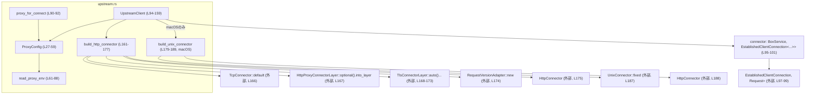
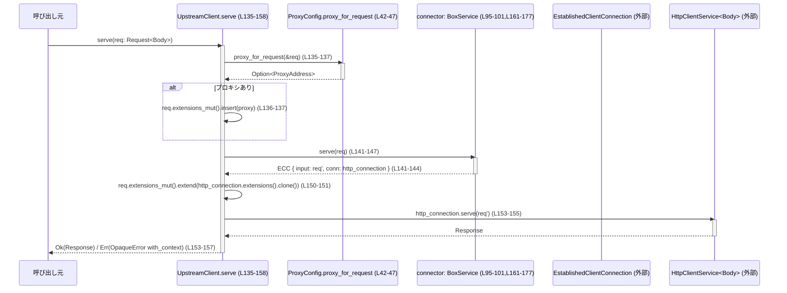

# network-proxy/src/upstream.rs コード解説

## 0. ざっくり一言

このモジュールは、環境変数から取得したプロキシ設定に基づいて上流の HTTP サーバーへ接続する非同期クライアント (`UpstreamClient`) と、そのための TCP/TLS/HTTP コネクタの構成、およびプロキシ選択ロジックを提供します。  
（network-proxy/src/upstream.rs:L27-59,L61-92,L94-159,L161-177,L179-189）

---

## 1. このモジュールの役割

### 1.1 概要

- HTTP(S) プロキシの設定を環境変数（`HTTP_PROXY` など）から読み取り、`ProxyConfig` に保持します。（L27-40,L61-88）
- 各 HTTP リクエストごとに、通信が安全（HTTPS）かどうかに応じて利用するプロキシを決定します。（L42-57）
- TCP / （macOS では Unix ソケット）/ TLS / HTTP レイヤを組み合わせたクライアント用コネクタを構成し、`UpstreamClient` として `Service<Request<Body>>` を実装します。（L94-102,L131-159,L161-177,L179-189）
- CONNECT 用のプロキシ決定専用ヘルパも提供します。（L90-92）

### 1.2 アーキテクチャ内での位置づけ

このモジュール内の主なコンポーネントと依存関係を示します。



- プロキシ設定や選択は `ProxyConfig` と `read_proxy_env` が担当し、`UpstreamClient` はそれを利用するクライアント層に相当します。（L27-59,L61-88,L94-102）
- 実際のネットワーク接続や HTTP 通信の詳細は、`TcpConnector` / `UnixConnector` / `TlsConnectorLayer` / `HttpConnector` / `HttpClientService` など外部モジュールに委譲しています。（L161-177,L179-189）

### 1.3 設計上のポイント

- **設定と実行の分離**  
  - プロキシ設定は `ProxyConfig` にカプセル化され、環境変数読み込み (`from_env`) とプロトコルごとの選択 (`proxy_for_protocol`) が明確に分離されています。（L27-40,L49-57）
- **リクエスト単位のプロキシ選択**  
  - `RequestContext::try_from(req)` を用いて、リクエストが安全（HTTPS）か判定し、それに応じて利用するプロキシを選択します。（L42-47）
- **レイヤードなネットワーク構成**  
  - `TcpConnector` → `HttpProxyConnectorLayer` → `TlsConnectorLayer` → `RequestVersionAdapter` → `HttpConnector` の順にレイヤを積み上げ、最終的な HTTP クライイアントコネクタを構成しています。（L166-175）
- **サービス抽象 (`Service` トレイト) の利用**  
  - `UpstreamClient` は `Service<Request<Body>>` を実装し、非同期に `Response` を返す高レベルクライアントとして振る舞います。（L131-158）
- **エラーハンドリングとコンテキスト付与**  
  - ネットワーク層からのエラーは `BoxError` から `OpaqueError` に変換され、URI を含む文脈が `with_context` で付与されます。（L145-148,L153-157）
- **観測性（ログ）**  
  - 環境変数が不正な場合や非 HTTP プロキシの場合には `tracing::warn!` でログ出力し、設定上の問題を検知しやすくしています。（L70-84）

---

## 2. 主要な機能一覧

このモジュールが提供する主な機能です。

- **環境変数からのプロキシ設定読み込み**  
  - `ProxyConfig::from_env` と `read_proxy_env` により、`HTTP_PROXY` / `HTTPS_PROXY` / `ALL_PROXY` と小文字版から `ProxyAddress` を構築します。（L35-40,L61-88）
- **リクエストごとのプロキシ選択**  
  - `ProxyConfig::proxy_for_request` と `proxy_for_protocol` により、HTTPS かどうかで `http` / `https` / `all` プロキシを選択します。（L42-47,L49-57）
- **CONNECT 用プロキシ解決ヘルパ**  
  - `proxy_for_connect` で、「常に安全な接続」として扱うプロトコル向けのプロキシを取得します。（L90-92）
- **上流 HTTP クライアント (`UpstreamClient`) の構築**  
  - 「プロキシなし」「環境変数から」「(macOS) Unix ソケット経由」の 3 パターンで `UpstreamClient` を生成できるコンストラクタ群を提供します。（L104-120）
- **HTTP クライアント接続の確立とリクエスト転送**  
  - `UpstreamClient::serve` により、プロキシ情報の埋め込み → コネクション確立 → HTTP リクエスト送信 → レスポンス返却までを非同期に行います。（L135-158）
- **HTTP コネクタの構成**  
  - `build_http_connector` / `build_unix_connector` により、TCP/Unix/TLS/Proxy/HTTP レイヤを組み合わせたクライアントコネクタを生成します。（L161-177,L179-189）

---

## 3. 公開 API と詳細解説

### 3.1 型一覧（構造体・列挙体など）

| 名前 | 種別 | 公開範囲 | 役割 / 用途 | 定義位置 |
|------|------|----------|-------------|----------|
| `ProxyConfig` | 構造体 | モジュール内（非公開） | HTTP/HTTPS/ALL 用のプロキシアドレスを保持し、環境変数からの読み込みとプロトコル別の選択を行う。 | network-proxy/src/upstream.rs:L27-32,L34-58 |
| `UpstreamClient` | 構造体 | `pub(crate)` | 上流 HTTP サーバーへ接続するためのクライアント。内部にネットワークコネクタ (`BoxService`) と `ProxyConfig` を保持し、`Service<Request<Body>>` を実装する。 | network-proxy/src/upstream.rs:L94-102,L104-129,L131-159 |

---

### 3.2 関数詳細（主要 7 件）

#### `ProxyConfig::from_env() -> Self`

**概要**

- 環境変数から HTTP/HTTPS/ALL 用のプロキシ設定を読み込み、`ProxyConfig` インスタンスを構築します。（L35-40）
- それぞれのプロキシは `read_proxy_env` を通じて解釈されます。（L35-38,L61-88）

**定義位置**

- `network-proxy/src/upstream.rs:L35-40`

**引数**

- なし

**戻り値**

- `Self` (`ProxyConfig`)  
  - `http` / `https` / `all` の各フィールドに、対応する環境変数群から解釈された `ProxyAddress` が `Some` として格納されます。該当がない場合は `None` です。（L27-32,L35-40）

**内部処理の流れ**

1. `HTTP_PROXY` / `http_proxy` をキーとして `read_proxy_env` を呼び、HTTP 用プロキシを取得。（L35-36）
2. `HTTPS_PROXY` / `https_proxy` をキーとして HTTPS 用プロキシを取得。（L37）
3. `ALL_PROXY` / `all_proxy` をキーとして汎用プロキシを取得。（L38）
4. これら 3 つをフィールドに詰めて `ProxyConfig` を返却。（L39）

**Examples（使用例）**

```rust
// プロキシ設定を環境変数から読み込んで ProxyConfig を生成する例
fn load_proxy_config_from_env() -> crate::upstream::ProxyConfig {
    // ProxyConfig はこのモジュール内では非公開ですが、
    // 同一モジュール内またはテストなどからはこうした形で利用できます。
    ProxyConfig::from_env() // HTTP_PROXY / HTTPS_PROXY / ALL_PROXY を解釈する（L35-40）
}
```

**Errors / Panics**

- この関数自体は `Result` を返さず、パニックも行っていません。
- 個々の環境変数の解釈失敗は `read_proxy_env` 内でログ出力され、該当するフィールドが `None` のままになるだけです。（L61-88）

**Edge cases（エッジケース）**

- 対応する環境変数が一切設定されていない場合:  
  - すべてのフィールドが `None` の `ProxyConfig` になります。（L35-40,L61-88）
- 複数の環境変数が設定されている場合:  
  - 引数で指定したキー配列の先頭から順に探索し、最初に成功したもののみを採用します。（`HTTP_PROXY` が優先、次に `http_proxy` など）（L61-62）
- 値が空文字列、非 HTTP プロトコル、パース不能な形式などの場合:  
  - その環境変数は無視され、`tracing::warn!` で警告ログが出ます。（L66-84）

**使用上の注意点**

- 環境変数は `from_env` 呼び出し時点の状態が読み込まれ、その後に環境変数を変更しても `ProxyConfig` は自動では更新されません。（L35-40）
- NO_PROXY などの除外設定の扱いは、このモジュールには定義されていません。（L27-59,L61-88）

---

#### `ProxyConfig::proxy_for_request(&self, req: &Request) -> Option<ProxyAddress>`

**概要**

- リクエストが HTTPS かどうかを判定し、そのプロトコルに適したプロキシを返します。（L42-47）
- 判定には `RequestContext::try_from` を利用します。（L43）

**定義位置**

- `network-proxy/src/upstream.rs:L42-47`

**引数**

| 引数名 | 型 | 説明 |
|--------|----|------|
| `req` | `&Request` | プロキシ選択の基準となる HTTP リクエスト。URI などから安全性を判定します。 |

**戻り値**

- `Option<ProxyAddress>`  
  - 適用すべきプロキシアドレス。設定なし・適用不要の場合は `None` です。

**内部処理の流れ**

1. `RequestContext::try_from(req)` を呼び、`req` からコンテキスト情報を生成しようとします。（L43）
2. 成功した場合は `ctx.protocol.is_secure()` によって HTTPS かどうかを判定します。（L44）
3. 失敗した場合は `unwrap_or(false)` により、安全でない（HTTP）ものとして扱います。（L45）
4. 得られた `is_secure` を `proxy_for_protocol` に渡し、プロキシを決定して返します。（L46）

**Examples（使用例）**

```rust
// UpstreamClient::serve 内部での利用と同様の例（簡略化）
fn choose_proxy_for_request(cfg: &ProxyConfig, req: &rama_http::Request) -> Option<ProxyAddress> {
    cfg.proxy_for_request(req) // HTTPS かどうかで proxy を選択（L42-47）
}
```

**Errors / Panics**

- `RequestContext::try_from` がエラーを返しても、`map(...).unwrap_or(false)` により「安全ではない」とみなし、パニックは発生しません。（L43-45）
- この関数は `Result` を返さず、エラーはすべて「プロキシなし (`None`)」や HTTP として扱う形にフォールバックします。

**Edge cases（エッジケース）**

- `RequestContext::try_from` が失敗するようなリクエスト（URI 不正など）の場合:  
  - `is_secure` は `false` となり、HTTP 用のプロキシ選択ロジック（`proxy_for_protocol(false)`) が使われます。（L43-46）
- HTTPS でも HTTP 用プロキシしか設定されていない場合:  
  - `https` が `None` のときは `http` → `all` の順でフォールバックします。（`proxy_for_protocol(true)` の仕様による。L49-55）

**使用上の注意点**

- HTTPS 向けに HTTP プロキシを使うかどうかは `proxy_for_protocol(true)` のロジックに従います（`https` → `http` → `all` の順）。この挙動に依存する仕様設計が必要です。（L49-55）
- リクエストの「安全性」の判定は `RequestContext` 実装に依存しており、このファイルからその詳細は分かりません。（L43）

---

#### `ProxyConfig::proxy_for_protocol(&self, is_secure: bool) -> Option<ProxyAddress>`

**概要**

- プロトコルが安全（`is_secure == true`）かどうかに基づき、`https` / `http` / `all` の順序で適切なプロキシを選択します。（L49-57）

**定義位置**

- `network-proxy/src/upstream.rs:L49-57`

**引数**

| 引数名 | 型 | 説明 |
|--------|----|------|
| `is_secure` | `bool` | `true` のとき HTTPS 相当、`false` のとき HTTP 相当としてプロキシを選択する。 |

**戻り値**

- `Option<ProxyAddress>`  
  - 選択されたプロキシアドレス。該当がなければ `None`。

**内部処理の流れ**

1. `is_secure` が `true` の場合:  
   - `https.clone()` → `http.clone()` → `all.clone()` の順で最初の `Some` を返します。（L50-54）
2. `is_secure` が `false` の場合:  
   - `http.clone()` → `all.clone()` の順で最初の `Some` を返します。（L55-56）

**Examples（使用例）**

```rust
fn select_proxy_for_https(cfg: &ProxyConfig) -> Option<ProxyAddress> {
    cfg.proxy_for_protocol(true) // HTTPS 用の proxy を選択（L49-55）
}

fn select_proxy_for_http(cfg: &ProxyConfig) -> Option<ProxyAddress> {
    cfg.proxy_for_protocol(false) // HTTP 用の proxy を選択（L49,55-56）
}
```

**Errors / Panics**

- この関数にはエラーやパニックの可能性は直接的にはありません。`Option` の連鎖 (`or_else`) により `None` へ自然にフォールバックします。（L50-56）

**Edge cases（エッジケース）**

- すべてのフィールドが `None` の場合:  
  - 常に `None` を返し、プロキシなしでの接続が選択されます。（L49-57）
- `is_secure = true` で `https` が `None`、`http` に値がある場合:  
  - `http` が HTTPS 用にも流用されます。（L50-54）
- `is_secure = false` で `http` が `None`、`all` に値がある場合:  
  - `all` が用いられます。（L55-56）

**使用上の注意点**

- 安全でないプロトコル（HTTP）に対して `https` フィールドは参照されません。
- 「HTTPS に対して HTTP プロキシを使う」ことを避けたい場合、このロジックの変更が必要となります。（L49-55）

---

#### `fn read_proxy_env(keys: &[&str]) -> Option<ProxyAddress>`

**概要**

- 指定された複数の環境変数名を順に調べ、最初に見つかった有効な HTTP プロキシアドレスを `ProxyAddress` として返します。（L61-88）

**定義位置**

- `network-proxy/src/upstream.rs:L61-88`

**引数**

| 引数名 | 型 | 説明 |
|--------|----|------|
| `keys` | `&[&str]` | 探索する環境変数名のスライス（例: `&["HTTP_PROXY", "http_proxy"]`）。 |

**戻り値**

- `Option<ProxyAddress>`  
  - 最初に解釈に成功し、かつ HTTP プロトコルと判定されたプロキシアドレス。該当なしの場合は `None`。

**内部処理の流れ**

1. `keys` の各キーについてループ。（L61-62）
2. `std::env::var(key)` で値を取得し、失敗した場合は次のキーへ。（L63-65）
3. 値を `trim` し、空文字列ならスキップ。（L66-68）
4. `ProxyAddress::try_from(value)` でアドレスをパース。  
   - 成功した場合、`proxy.protocol` の有無と `rama_net::Protocol::is_http` で HTTP 系プロトコルかを確認。（L70-77）
   - HTTP なら `Some(proxy)` を返却し、探索終了。（L78）
   - 非 HTTP の場合は `warn!` ログを出してスキップ。（L72-80）
5. パースに失敗した場合は `warn!` ログを出してスキップ。（L82-84）
6. 最後まで見つからなければ `None` を返します。（L87）

**Examples（使用例）**

```rust
// HTTP_PROXY または http_proxy のいずれかから ProxyAddress を取得する例
fn load_http_proxy_from_env() -> Option<ProxyAddress> {
    read_proxy_env(&["HTTP_PROXY", "http_proxy"]) // 最初に見つかった有効な HTTP proxy を返す（L61-62）
}
```

**Errors / Panics**

- `std::env::var` のエラーは `let Ok(value) = ... else { continue; }` で無視され、パニックはしません。（L63-65）
- `ProxyAddress::try_from` のエラーも `Err(err)` 分岐でログに変換されるだけで、パニックはしません。（L70-71,L82-84）
- `unwrap_or(true)` は `Option<bool>` に対しての安全なフォールバックであり、パニック要因ではありません。（L73-77）

**Edge cases（エッジケース）**

- 値が空文字列もしくは空白のみの場合:  
  - `trim()` 後に空になるため、そのキーは無視されます。（L66-68）
- プロトコル指定がない値（`http://` などのスキームなし）:  
  - `proxy.protocol.as_ref()` が `None` のため `unwrap_or(true)` により HTTP とみなされ、受け入れられます。（L72-77）
- 非 HTTP プロトコル（例: SOCKS5）と思われる値:  
  - `Protocol::is_http` が `false` と判断した場合、`warn!("ignoring {key}: non-http proxy protocol")` のログを出して無視します。（L72-80）
- 複数のキーに値がある場合:  
  - `keys` の順番で「最初に有効だったもの」だけが使用されます。（L61-62,L78）

**使用上の注意点**

- この関数は HTTP 系プロキシ以外（SOCKS など）を明示的に除外します。必要であればロジックの拡張が必要です。（L72-80）
- 環境変数名の大文字・小文字ごとに個別に探索しているため、キーの順序によってどちらが優先されるかが変わります。（L61-62）

---

#### `pub(crate) fn proxy_for_connect() -> Option<ProxyAddress>`

**概要**

- CONNECT メソッドなどトンネル用途の接続向けに、「安全なプロトコル」として扱ってプロキシを選択します。（L90-92）

**定義位置**

- `network-proxy/src/upstream.rs:L90-92`

**引数**

- なし

**戻り値**

- `Option<ProxyAddress>`  
  - `ProxyConfig::from_env().proxy_for_protocol(true)` の結果。HTTPS 用と同様の優先順位（`https` → `http` → `all`）で選択されます。（L90-92,L35-40,L49-55）

**内部処理の流れ**

1. `ProxyConfig::from_env()` で最新の環境変数からプロキシ設定を読み込みます。（L90,L35-40）
2. `proxy_for_protocol(/*is_secure*/ true)` を呼び、HTTPS と同じロジックでプロキシを選択します。（L90-92,L49-55）

**Examples（使用例）**

```rust
use crate::upstream::proxy_for_connect;

fn choose_connect_proxy() -> Option<ProxyAddress> {
    // CONNECT リクエスト用の proxy を選択（HTTPS 相当のロジックを適用, L90-92）
    proxy_for_connect()
}
```

**Errors / Panics**

- 内部で `ProxyConfig::from_env` を使っており、そこではパニックを起こす処理はありません。（L35-40,L61-88）
- エラーはすべて `None` やフォールバックとして扱われます。

**Edge cases（エッジケース）**

- CONNECT 用に `HTTPS_PROXY` のみ設定されている場合:  
  - `https` フィールドが利用されます。（L35-37,L49-55,L90-92）
- HTTP 用の `HTTP_PROXY` しか設定されていない場合:  
  - HTTPS 用プロキシがなくとも、HTTP プロキシが CONNECT 用にも利用されます。（L49-55）

**使用上の注意点**

- `ProxyConfig` を毎回 `from_env` で作り直すため、プロキシ設定の変更を即時に反映したい場合はこちらの関数の利用が適しています。（L90-92）
- 一方で、頻繁な環境変数アクセスはパフォーマンス面への影響があり得ます（一般論）。このファイル内でキャッシュなどは行っていません。（L35-40,L90-92）

---

#### `impl Service<Request<Body>> for UpstreamClient { async fn serve(&self, mut req: Request<Body>) -> Result<Response, OpaqueError> }`

**概要**

- プロキシ設定に基づいてリクエストにプロキシ情報を付与し、内部のネットワークコネクタ (`connector`) を通じて上流サーバーへ HTTP リクエストを転送し、レスポンスを返す中核処理です。（L95-101,L131-158）

**定義位置**

- `network-proxy/src/upstream.rs:L131-158`

**引数**

| 引数名 | 型 | 説明 |
|--------|----|------|
| `self` | `&self` | 共有参照。内部状態は変更しません。 |
| `req` | `Request<Body>` | 転送対象の HTTP リクエスト（ボディを含む）。`mut` として受け取り、拡張情報を付与・更新します。 |

**戻り値**

- `Result<Response, OpaqueError>`  
  - 成功時は上流サーバーからの HTTP レスポンス。  
  - 失敗時は内部エラー（ネットワーク/HTTP レイヤ由来の `BoxError` など）を包んだ `OpaqueError`。

**内部処理の流れ（アルゴリズム）**

1. **プロキシの決定と埋め込み**  
   - `self.proxy_config.proxy_for_request(&req)` でこのリクエストに適用すべきプロキシを決定します。（L135-137,L42-47）
   - `Some(proxy)` の場合は、`req.extensions_mut().insert(proxy)` によりリクエストの拡張情報にプロキシを格納します。（L136-137）
2. **URI のコピー（エラーメッセージ用）**  
   - 後続のエラーに URI を添えるため、`let uri = req.uri().clone();` で URI をコピーします。（L140）
3. **コネクションの確立**  
   - `self.connector.serve(req).await` を呼び、確立済みクライアントコネクション (`EstablishedClientConnection`) を取得します。（L141-148）
   - パターンマッチで `input: mut req, conn: http_connection` に分解し、新しい `req` と HTTP 接続オブジェクト `http_connection` を得ます。（L141-144）
   - ここでのエラーは `map_err(OpaqueError::from_boxed)` で `OpaqueError` に変換されます。（L145-148）
4. **拡張情報の引き継ぎ**  
   - `req.extensions_mut().extend(http_connection.extensions().clone());` により、接続側の拡張情報をリクエストに統合します。（L150-151）
5. **HTTP リクエストの送信**  
   - `http_connection.serve(req).await` を呼び、HTTP レスポンスを取得します。（L153-155）
   - エラーは再度 `OpaqueError::from_boxed` で変換され、さらに `.with_context(|| format!("http request failure for uri: {uri}"))` で URI を含んだ文脈を付与されます。（L156-157）
6. **結果の返却**  
   - 成功時は `Response` をそのまま `Ok` として返し、失敗時は `Err(OpaqueError)` として返します。（L135-158）

**Examples（使用例）**

```rust
use crate::upstream::UpstreamClient;
use rama_core::Service;
use rama_http::{Request, Body};
// OpaqueError の完全修飾パスは他モジュールに依存するため、ここでは型エイリアスを仮定
use rama_core::error::OpaqueError;

// 上流の HTTP サービスにリクエストを転送する非同期関数の例
async fn forward_request(req: Request<Body>) -> Result<rama_http::Response, OpaqueError> {
    // 環境変数の proxy 設定を使う UpstreamClient を作成（L109-111）
    let client = UpstreamClient::from_env_proxy();

    // 非同期で serve を呼び出し、レスポンスを取得（L135-158）
    let resp = client.serve(req).await?;

    Ok(resp)
}
```

※ `Request` の具体的な構築方法（GET/POST など）は `rama_http` の API に依存し、このファイルからは分かりません。

**Errors / Panics**

- `self.connector.serve(req).await` の失敗:  
  - `OpaqueError::from_boxed` により `OpaqueError` に変換され、そのまま `Err` として返されます。（L145-148）
- `http_connection.serve(req).await` の失敗:  
  - 同様に `OpaqueError::from_boxed` で変換した上で、`with_context` により `"http request failure for uri: {uri}"` のメッセージが付加されます。（L153-157）
- この関数自身には `unwrap` やパニックを起こすコードは含まれていません。  
  - ただし、`connector`・`http_connection` の内部実装に依存するパニック可能性については、このファイルからは分かりません。

**Edge cases（エッジケース）**

- プロキシが一切設定されていない場合:  
  - `proxy_for_request` が `None` を返し、リクエストはプロキシなしで送信されます。（L135-137）
- `RequestContext::try_from(&req)` が失敗するような不正リクエスト:  
  - HTTP とみなされてプロキシが選択されるか、プロキシなしで送信されます。`serve` 自身はこの失敗をエラーとしては扱いません。（L136-137,L42-47）
- `connector.serve(req)` が返す `input` と、もともとの `req` の差:  
  - `EstablishedClientConnection { input: mut req, .. }` で受け取り直しているため、接続確立の過程でリクエストが書き換えられている可能性があります。（L141-144）

**使用上の注意点**

- `serve` は `&self` を取り内部状態を変更しないため、このモジュール内には明示的な共有可変状態はありませんが、`BoxService` などの内部実装のスレッド安全性は別途確認が必要です。（L95-101,L131-135）
- エラー内容は `OpaqueError` にラップされるため、詳細な原因を扱いたい場合は、`with_context` のメッセージや（可能であれば）元のエラー型へのダウンキャストなどが必要になります。（L145-148,L153-157）
- `serve` は非同期関数であり、`.await` せずに呼び出すことはできません（Rust の async/await の一般ルール）。

---

#### `fn build_http_connector() -> BoxService<Request<Body>, EstablishedClientConnection<HttpClientService<Body>, Request<Body>>, BoxError>`

**概要**

- TCP 接続、任意の HTTP プロキシレイヤ、TLS 設定、HTTP バージョンアダプタを組み合わせた HTTP クライアント用コネクタを構築し、`BoxService` として返します。（L161-177）

**定義位置**

- `network-proxy/src/upstream.rs:L161-177`

**引数**

- なし

**戻り値**

- `BoxService<Request<Body>, EstablishedClientConnection<HttpClientService<Body>, Request<Body>>, BoxError>`  
  - `Request<Body>` を入力として受け、HTTP クライアントコネクション (`EstablishedClientConnection<HttpClientService<Body>, Request<Body>>`) を返すサービスの動的ディスパッチ版です。（L161-165）

**内部処理の流れ**

1. `TcpConnector::default()` で基本的な TCP 接続器を取得。（L166）
2. `HttpProxyConnectorLayer::optional().into_layer(transport)` を呼び、必要に応じて HTTP プロキシ経由の接続を行うレイヤを構成。（L167）
3. `TlsConnectorDataBuilder::new().with_alpn_protocols_http_auto().build()` で HTTP 用の ALPN 設定を含む TLS 設定データを生成。（L168-170）
4. `TlsConnectorLayer::auto().with_connector_data(tls_config).into_layer(proxy)` で TLS レイヤを挿入し、プロキシ（または素の TCP）上に TLS を載せます。（L171-173）
5. `RequestVersionAdapter::new(tls)` で HTTP バージョンに応じたアダプタを挟みます。（L174）
6. `HttpConnector::new(tls)` で最終的な HTTP クライアントコネクタを作成。（L175）
7. `connector.boxed()` で `BoxService` に変換して返します。（L176）

**Examples（使用例）**

```rust
fn build_and_use_connector() {
    // HTTP クライアント用の connector を構築（L161-177）
    let connector = build_http_connector();

    // 実際の利用は非同期コンテキストで `connector.serve(request).await` となりますが、
    // その詳細は rama_core の Service 実装に依存し、このファイルからは分かりません。
}
```

**Errors / Panics**

- この関数自体は `Result` を返さず、主に設定オブジェクトの組み立てだけを行います。
- `TlsConnectorDataBuilder::build()` などの内部でパニックが起きるかどうかは、このファイルからは分かりません。（L168-170）

**Edge cases（エッジケース）**

- TLS 設定が不完全/不正な場合:  
  - どのように扱われるかは `TlsConnectorDataBuilder` / `TlsConnectorLayer` の実装に依存し、このファイルからは分かりません。（L168-173）

**使用上の注意点**

- `UpstreamClient::new` からのみ利用されており、`UpstreamClient` のコンストラクタを増やす際には、この関数を再利用するか、新たなコネクタ構成関数を追加することが想定されます。（L122-127,L161-177）
- プロキシレイヤは `HttpProxyConnectorLayer::optional()` によってラップされているため、実際にプロキシが使われるかどうかは別途設定（リクエストの拡張情報など）に依存します。詳細はこのファイルからは分かりません。（L167）

---

### 3.3 その他の関数

上記で詳細解説しなかった補助的な関数・メソッドです。

| 関数名 | シグネチャ（概要） | 役割（1 行） | 定義位置 |
|--------|--------------------|--------------|----------|
| `ProxyConfig::default` | `#[derive(Default)]` による | すべてのプロキシ設定を `None` にした構成を提供します。 | network-proxy/src/upstream.rs:L27-32 |
| `UpstreamClient::direct` | `pub(crate) fn direct() -> Self` | プロキシなしの `UpstreamClient` を構築します（`ProxyConfig::default` 使用）。 | network-proxy/src/upstream.rs:L104-107 |
| `UpstreamClient::from_env_proxy` | `pub(crate) fn from_env_proxy() -> Self` | 環境変数から読み込んだ `ProxyConfig` を用いて `UpstreamClient` を構築します。 | network-proxy/src/upstream.rs:L109-111 |
| `UpstreamClient::unix_socket` (macOS) | `pub(crate) fn unix_socket(path: &str) -> Self` | 固定 Unix ソケットパス向けの HTTP コネクタを使う `UpstreamClient` を構築します。 | network-proxy/src/upstream.rs:L113-120,L179-189 |
| `UpstreamClient::new` | `fn new(proxy_config: ProxyConfig) -> Self` | 共通の HTTP コネクタ構成（`build_http_connector`）と任意の `ProxyConfig` を組み合わせてインスタンス化します。 | network-proxy/src/upstream.rs:L122-128 |
| `build_unix_connector` (macOS) | `fn build_unix_connector(path: &str) -> BoxService<...>` | 固定パスの `UnixConnector` と `HttpConnector` を組み合わせた HTTP クライアントコネクタを構築します。 | network-proxy/src/upstream.rs:L179-189 |

---

## 4. データフロー

ここでは `UpstreamClient::serve` を使って 1 つの HTTP リクエストを上流サーバーへ転送する際のデータフローを説明します。（L131-158）

### 処理の要点（文章）

1. 呼び出し元が `UpstreamClient::serve` に `Request<Body>` を渡します。（L135）
2. `ProxyConfig` に基づいてリクエストごとのプロキシを決定し、必要ならリクエスト拡張に挿入します。（L135-137）
3. 内部コネクタ (`BoxService`) がリクエストを受け取り、ネットワーク接続を確立した上で `EstablishedClientConnection` と（場合によっては書き換えられた）リクエストを返します。（L141-148）
4. 接続側の拡張情報をリクエストに統合し、HTTP コネクション（`HttpClientService`）に対して再度 `serve` を呼び出します。（L150-155）
5. 最終的に上流からの `Response` が呼び出し元に返されます。（L153-158）

### シーケンス図（Mermaid）



---

## 5. 使い方（How to Use）

### 5.1 基本的な使用方法

典型的には、`UpstreamClient` を構築し、`Service` として `serve` を呼び出してレスポンスを取得します。

```rust
use crate::upstream::UpstreamClient;
use rama_core::Service;
use rama_http::{Request, Body};
use rama_core::error::OpaqueError;

// 上流サービスにリクエストを転送する基本的な非同期関数の例
async fn call_upstream(req: Request<Body>) -> Result<rama_http::Response, OpaqueError> {
    // 環境変数から proxy 設定を取得するクライアント（L109-111）
    let client = UpstreamClient::from_env_proxy();

    // 必要であればここで req にヘッダなどを追加

    // 非同期に上流へ転送（L135-158）
    let resp = client.serve(req).await?;

    Ok(resp)
}
```

※ `Request` の具体的な組み立ては `rama_http` の API に依存します。このファイルには現れていません。

### 5.2 よくある使用パターン

1. **プロキシなしでの利用**

```rust
async fn call_without_proxy(req: Request<Body>) -> Result<rama_http::Response, OpaqueError> {
    // ProxyConfig::default() を用いたクライアント（L104-107,L27-32）
    let client = UpstreamClient::direct();

    client.serve(req).await
}
```

1. **環境変数プロキシを使う利用**

```rust
async fn call_with_env_proxy(req: Request<Body>) -> Result<rama_http::Response, OpaqueError> {
    // HTTP_PROXY / HTTPS_PROXY / ALL_PROXY を読むクライアント（L109-111,L35-40,L61-88）
    let client = UpstreamClient::from_env_proxy();

    client.serve(req).await
}
```

1. **macOS での Unix ソケット利用**

```rust
#[cfg(target_os = "macos")]
async fn call_via_unix(req: Request<Body>) -> Result<rama_http::Response, OpaqueError> {
    use crate::upstream::UpstreamClient;

    // 固定 Unix ソケットパスを使うクライアント（L113-120,L179-189）
    let client = UpstreamClient::unix_socket("/var/run/myservice.sock");

    client.serve(req).await
}
```

1. **CONNECT 用プロキシの取得**

```rust
use crate::upstream::proxy_for_connect;

fn maybe_use_connect_proxy() {
    if let Some(proxy) = proxy_for_connect() { // HTTPS 相当のロジックで proxy を選択（L90-92）
        // CONNECT 実装側で proxy を使う
        // 具体的な使用方法は CONNECT ロジックの実装に依存します
    }
}
```

### 5.3 よくある間違い

このファイルから推測できる、起こりやすそうな誤用例と正しい使用例です。

```rust
use crate::upstream::UpstreamClient;
use rama_http::{Request, Body};
use rama_core::error::OpaqueError;

// 間違い例: 環境変数を変更しただけで既存の UpstreamClient に新設定が反映されると考える
async fn wrong_change_proxy(req: Request<Body>) -> Result<(), OpaqueError> {
    std::env::set_var("HTTP_PROXY", "http://proxy1:8080");
    let client = UpstreamClient::from_env_proxy(); // proxy1 を読み込む（L109-111,L35-40）

    // ... ここで何度か利用

    std::env::set_var("HTTP_PROXY", "http://proxy2:8080");
    // client は proxy2 ではなく、依然として proxy1 を使い続ける（ProxyConfig は不変, L27-32,L35-40）

    let _ = client.serve(req).await?;
    Ok(())
}

// 正しい例: proxy 設定を変えたい場合は新しい UpstreamClient を作り直す
async fn correct_change_proxy(req: Request<Body>) -> Result<(), OpaqueError> {
    std::env::set_var("HTTP_PROXY", "http://proxy1:8080");
    let client1 = UpstreamClient::from_env_proxy();

    let _ = client1.serve(req).await?;

    std::env::set_var("HTTP_PROXY", "http://proxy2:8080");
    let client2 = UpstreamClient::from_env_proxy(); // 再度 from_env で読み込み（L109-111,L35-40）

    let _ = client2.serve(req).await?;
    Ok(())
}
```

### 5.4 使用上の注意点（まとめ）

- **プロキシ設定のライフサイクル**  
  - `UpstreamClient::from_env_proxy` は生成時に一度だけ環境変数を読み込み、その後は内部の `ProxyConfig` を変更しません。（L109-111,L27-40）  
  - 実行中にプロキシ設定を変更したい場合は、新しい `UpstreamClient` インスタンスを作成する必要があります。
- **CONNECT 用との違い**  
  - `proxy_for_connect` は呼び出しのたびに `ProxyConfig::from_env` を呼ぶため、環境変数の変更が即時に反映されます。（L90-92,L35-40）
- **スレッド安全性・並行性**  
  - `UpstreamClient` は `#[derive(Clone)]` されており、フィールドにも変更可能な要素は定義されていません（`connector` / `proxy_config` の両フィールドは `mut` で更新されていない）。（L94-102,L104-129,L131-135）  
  - ただし、`BoxService` や `HttpConnector` が `Send` / `Sync` かどうか、内部でどのような共有状態を持つかはこのファイルからは分かりません。
- **エラーメッセージと観測性**  
  - 上流 HTTP 通信エラーには URI を含むメッセージが `with_context` で付加されます。（L140,L153-157）  
  - プロキシ環境変数の不備・不正は `tracing::warn!` による警告ログで検出できます。（L70-84）
- **セキュリティ上の注意**  
  - プロキシ情報は環境変数から取得されるため、実行環境に応じて意図しないプロキシを利用してしまうリスクがあります（一般論）。このファイル内に、環境変数の利用制限やホワイトリストなどの追加防御は見当たりません。（L35-40,L61-88）

---

## 6. 変更の仕方（How to Modify）

### 6.1 新しい機能を追加する場合

1. **プロキシ設定の拡張（例: NO_PROXY 対応）**
   - プロキシの選択ロジックを拡張する場合は `ProxyConfig` とそのメソッドを中心に変更します。（L27-59）
   - 環境変数を追加したい場合は `from_env` と `read_proxy_env` の呼び出し・キー一覧を調整します。（L35-40,L61-62）
2. **新しい接続形態の追加（例: 別プロトコルや特定ポート向けコネクタ）**
   - 既存の `build_http_connector` / `build_unix_connector` を参考に、新しいコネクタ構築関数を追加します。（L161-177,L179-189）
   - `UpstreamClient` に新コンストラクタ（例: `pub(crate) fn with_custom_connector(...) -> Self`）を追加し、フィールド `connector` にそのコネクタを設定する形が自然です。（L104-122）
3. **追加のメタデータの伝搬**
   - リクエストの拡張情報（`extensions_mut`）はすでに使われているため、メタデータを追加で渡したいときは `serve` の中で `insert` / `extend` を利用します。（L136-137,L150-151）

### 6.2 既存の機能を変更する場合

- **プロキシ選択規則の変更**
  - `proxy_for_protocol` の `https` / `http` / `all` の優先順位を変更する場合は、この関数だけを変更すればよいですが、`proxy_for_request` や `proxy_for_connect` との整合性も一緒に確認する必要があります。（L42-47,L49-57,L90-92）
- **エラーコンテキストメッセージの変更**
  - HTTP リクエスト失敗時のメッセージは `with_context` のフォーマット文字列に集約されているため、ここを変更することでログやエラーハンドリングに影響します。（L153-157）
- **TLS 設定やプロキシレイヤ構成の変更**
  - 使用する TLS プロトコルや ALPN 設定を変更したい場合は `TlsConnectorDataBuilder` 部分を編集します。（L168-170）
  - プロキシレイヤの挿入/挙動を変える場合は、`HttpProxyConnectorLayer::optional().into_layer(transport)` の部分を中心に修正します。（L167）
- **影響範囲の確認**
  - `UpstreamClient` と `proxy_for_connect` は `pub(crate)` であり、クレート内の他のモジュールから参照されている可能性があります。変更前にはクレート内の使用箇所の検索が推奨されます。（L90-92,L94-129）

---

## 7. 関連ファイル / モジュール

このモジュールと密接に関連する外部モジュール（コード上で参照されているもの）の一覧です。

| モジュール / 型 | 役割 / 関係 | 根拠位置 |
|----------------|------------|----------|
| `rama_net::address::ProxyAddress` | 環境変数から読み取った文字列をパースして保持するプロキシアドレス型。`read_proxy_env` と `ProxyConfig` で使用。内部仕様はこのファイルからは不明。 | network-proxy/src/upstream.rs:L16,L61-88,L27-32 |
| `rama_net::http::RequestContext` | `Request` からプロトコル情報（安全かどうか）を抽出するコンテキスト型。`proxy_for_request` で利用。 | network-proxy/src/upstream.rs:L18,L42-45 |
| `rama_tcp::client::service::TcpConnector` | TCP ベースのクライアントコネクタ。`build_http_connector` 内で transport として使用。 | network-proxy/src/upstream.rs:L19,L166 |
| `rama_unix::client::UnixConnector` (macOS) | Unix ソケットベースのクライアントコネクタ。`build_unix_connector` で使用。 | network-proxy/src/upstream.rs:L24-25,L179-189 |
| `rama_tls_rustls::client::{TlsConnectorDataBuilder, TlsConnectorLayer}` | TLS 設定の構築と TLS レイヤの挿入に使われます。`build_http_connector` 内で利用。 | network-proxy/src/upstream.rs:L20-21,L168-173 |
| `rama_http_backend::client::{HttpClientService, HttpConnector}` | 上流 HTTP 通信そのものを行うクライアント実装と、それを生成するコネクタ。`connector` の戻り値型や `EstablishedClientConnection` の `conn` として利用。 | network-proxy/src/upstream.rs:L13-15,L97-99,L175,L188 |
| `rama_net::client::EstablishedClientConnection` | 接続確立済みの HTTP クライアントコネクションと入力をまとめたラッパ。`UpstreamClient::serve` で分解されます。 | network-proxy/src/upstream.rs:L17,L97-99,L141-144 |
| `rama_core::{Service, Layer, service::BoxService}` | このモジュールのサービス抽象 (`Service` トレイト実装) とレイヤ構成 (`Layer`) を提供し、`BoxService` で動的ディスパッチを可能にしています。 | network-proxy/src/upstream.rs:L1-2,L8,L95-101,L131-158,L167,L173,L176 |
| `rama_http::layer::version_adapter::RequestVersionAdapter` | HTTP バージョンアダプタ。`build_http_connector` 内で TLS レイヤに対するラッパとして利用。 | network-proxy/src/upstream.rs:L12,L174 |
| `tracing::warn` | 不正なプロキシ設定（非 HTTP プロトコルやパース失敗）をログ出力するために使用。観測性に関係します。 | network-proxy/src/upstream.rs:L22,L70-84 |

このファイル単体では、これら外部モジュールの内部実装や詳細な仕様は分かりませんが、依存関係として把握しておくことで、挙動の追跡や変更点の特定に役立ちます。
