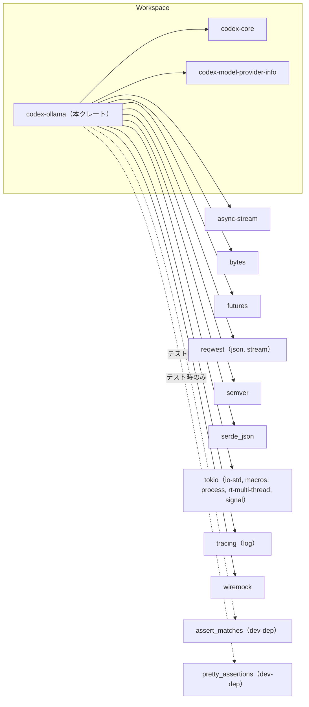
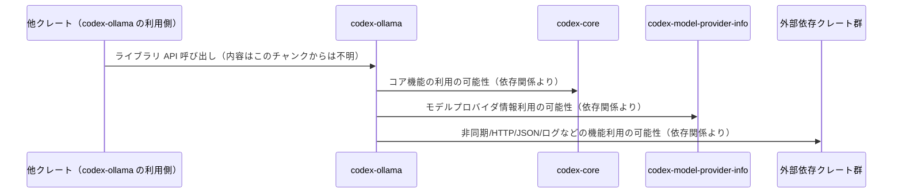

# ollama/Cargo.toml コード解説

## 0. ざっくり一言

このファイルは、Rust ライブラリクレート `codex-ollama` のパッケージ情報と依存関係を定義する Cargo マニフェストです（ollama/Cargo.toml:L1-5, L7-9, L14-35）。  
本チャンクにはソースコード（関数・構造体など）は含まれていません。

---

## 1. このモジュールの役割

### 1.1 概要

- このファイルは、ワークスペースの一員であるライブラリクレート `codex-ollama` の
  - 名前（`name`）
  - バージョン・edition・ライセンスの参照先（`*.workspace = true`）
  - ライブラリとしてのエントリーポイント（`src/lib.rs`）
  - 利用する依存クレート群  
  を定義します（ollama/Cargo.toml:L1-5, L7-9, L14-35）。
- 実際の公開 API やビジネスロジックは `src/lib.rs` などのソースファイル側にあり、このチャンクからは内容は分かりません（ollama/Cargo.toml:L7-9）。

### 1.2 アーキテクチャ内での位置づけ

`codex-ollama` はワークスペース内の 1 クレートであり、`codex-core` と `codex-model-provider-info` といった内部クレート、さらに `reqwest` や `tokio` などの外部クレートに依存するライブラリとして位置づけられます（ollama/Cargo.toml:L14-23, L30-31）。

以下は、この Cargo.toml から読み取れる**クレート間の依存関係**を示した図です。



※ 図は「どのクレートを依存として宣言しているか」を表すのみであり、具体的にどの API がどう呼び出されているかは、このチャンクからは分かりません。

### 1.3 設計上のポイント（Cargo.toml から読み取れる範囲）

- **ワークスペース共通設定の利用**  
  バージョン・edition・ライセンスはワークスペース側で一括管理されています（`version.workspace = true`, `edition.workspace = true`, `license.workspace = true`）（ollama/Cargo.toml:L2-5）。
- **ライブラリクレートとしての定義**  
  `[lib]` セクションでライブラリ名 `codex_ollama` とエントリーポイント `src/lib.rs` が指定されています（ollama/Cargo.toml:L7-9）。
- **lint 設定のワークスペース共有**  
  `[lints] workspace = true` により、警告や静的解析ルールもワークスペース側の共通設定に従う構成になっています（ollama/Cargo.toml:L11-12）。
- **非同期・HTTP・JSON を扱う前提の依存構成**  
  `tokio`, `futures`, `async-stream`, `reqwest`, `serde_json`, `bytes` など、非同期 I/O と HTTP + JSON 処理でよく使われるクレートが依存に含まれています（ollama/Cargo.toml:L14-23, L30-31）。  
  ただし、これらを実際にどのように使っているかは本チャンクからは不明です。
- **テストサポート用クレート**  
  `assert_matches`, `pretty_assertions` が dev-dependencies に含まれており、テストコードでより読みやすいアサーションを行う準備がされています（ollama/Cargo.toml:L33-35）。

---

## 2. 主要な機能一覧（このチャンクから分かる範囲）

この Cargo.toml 自体は振る舞いを持ちませんが、**依存関係から「クレート内で利用される機能の種類」**はある程度推定できます。  
ただし、実際にどの機能をどのように使っているかは、このチャンクからは断定できません。

- 非同期ストリーム関連機能の利用（`async-stream`, `futures`）（ollama/Cargo.toml:L14, L19）
- バイト列操作の利用（`bytes`）（ollama/Cargo.toml:L15）
- ワークスペース内コアロジックとの連携（`codex-core`）（ollama/Cargo.toml:L17）
- モデルプロバイダ情報との連携（`codex-model-provider-info`）（ollama/Cargo.toml:L18）
- HTTP クライアント機能と JSON/ストリーミング機能の利用（`reqwest` の `json`, `stream` feature）（ollama/Cargo.toml:L20）
- セマンティックバージョンの扱い（`semver`）（ollama/Cargo.toml:L21）
- JSON シリアライズ/デシリアライズ（`serde_json`）（ollama/Cargo.toml:L22）
- 非同期ランタイム・マルチスレッド実行・プロセス制御・シグナル処理（`tokio` の設定された features）（ollama/Cargo.toml:L23-29）
- 構造化ログ/トレースの利用（`tracing` の `log` feature）（ollama/Cargo.toml:L30）
- HTTP モックサーバ等の利用が可能な構成（`wiremock`）（ollama/Cargo.toml:L31）

---

## 3. 公開 API と詳細解説

このチャンクには Rust のソースコードが含まれていないため、**具体的な関数・構造体・列挙体などの公開 API は特定できません**。  
ここでは代わりに、Cargo.toml に現れる「コンポーネント（クレート）」のインベントリーを整理します。

### 3.1 コンポーネント（クレート）一覧

| 名前 | 種別 | 役割 / 用途（Cargo.toml から分かる範囲） | 定義箇所 |
|------|------|-------------------------------------------|----------|
| `codex-ollama` | パッケージ / ライブラリクレート | ワークスペース内ライブラリ。`src/lib.rs` をエントリーポイントとする（具体的な API 内容は不明） | [package], [lib]（L1-5, L7-9） |
| `codex_ollama` | ライブラリ名（crate 名） | `codex-ollama` パッケージに対応するライブラリ crate 名。外部からはこの名前で `extern crate` などが行われる想定 | [lib] name（L8） |
| `async-stream` | 依存クレート | 非同期ストリームを生成するためのヘルパ／マクロクレート（一般的な用途）。本クレート内での具体的利用箇所は不明 | [dependencies]（L14-15） |
| `bytes` | 依存クレート | 高効率なバイトバッファを扱うためのクレート。ネットワーク I/O などでよく利用されるが、本クレートでの利用方法は不明 | [dependencies]（L14-16） |
| `codex-core` | 依存クレート（ワークスペース内） | ワークスペース内のコア機能を提供するクレートと考えられるが、詳細はこのチャンクには現れません | [dependencies]（L14, L17） |
| `codex-model-provider-info` | 依存クレート（ワークスペース内） | モデルプロバイダ関連情報を扱うクレート名と推測されるが、具体的な API は不明 | [dependencies]（L14, L18） |
| `futures` | 依存クレート | 非同期処理のための Future/Stream ユーティリティ群。`async`/`await` 周辺を補助 | [dependencies]（L14, L19） |
| `reqwest` | 依存クレート | HTTP クライアントクレート。`json`, `stream` feature が有効化されており、JSON ベースの HTTP 通信やストリーミングレスポンスを扱える構成 | [dependencies]（L14, L20） |
| `semver` | 依存クレート | セマンティックバージョン（例: `1.2.3`）の解析・比較を行うクレート | [dependencies]（L14, L21） |
| `serde_json` | 依存クレート | JSON のシリアライズ/デシリアライズのためのクレート | [dependencies]（L14, L22） |
| `tokio` | 依存クレート | 非同期ランタイム。本クレートでは `io-std`, `macros`, `process`, `rt-multi-thread`, `signal` feature が有効になっており、標準入出力、マクロ、プロセス制御、多スレッドランタイム、シグナル処理が利用可能な構成 | [dependencies]（L23-29） |
| `tracing` | 依存クレート | 構造化トレース／ログ用クレート。`log` feature により従来の `log` クレートとの連携も有効 | [dependencies]（L30） |
| `wiremock` | 依存クレート | HTTP モックサーバを提供するクレート。通常はテストで用いられるが、本クレートでは通常依存として定義されている | [dependencies]（L31） |
| `assert_matches` | 開発用依存 | テストで `matches!` パターンを簡潔にアサートするためのクレート | [dev-dependencies]（L33-34） |
| `pretty_assertions` | 開発用依存 | アサーション失敗時に見やすい差分を表示するためのクレート | [dev-dependencies]（L33, L35） |

#### このチャンクに含まれない情報

- 関数・メソッド・型（構造体・列挙体など）の定義と公開範囲（`pub` かどうか）
- 具体的にどの依存クレートのどの API を呼び出しているか
- エラー型、非同期の利用方法、スレッド安全性の仕様

これらは `src/lib.rs` などのソースコード側を参照する必要があります（ollama/Cargo.toml:L7-9）。

### 3.2 関数詳細

この Cargo.toml には関数定義が一切含まれていないため、  
「関数名・引数・戻り値・内部処理フロー」といった詳細な API 解説は**このチャンクには現れません**。

### 3.3 その他の関数

同様の理由で、このセクションに記載すべき補助関数・ラッパー関数も、このチャンクからは特定できません。

---

## 4. データフロー（クレートレベルの関係）

関数レベルのデータフローは不明ですが、**クレート同士のやり取り**という観点で、一般的な利用イメージを示します。  
ここで示す図は「依存関係の向き（どのクレートがどれを利用しうるか）」だけを表し、具体的な API 呼び出し内容は含みません。



- 上記の「呼び出し」は、**Cargo.toml で依存が宣言されているため「利用しうる」**というレベルの関係を示すものです（ollama/Cargo.toml:L14-23, L30-31）。
- 実際にどの関数がどのデータを渡しているかは、このチャンクには現れません。

---

## 5. 使い方（How to Use）

### 5.1 基本的な使用方法（Cargo レベル）

`codex-ollama` はライブラリクレートとして定義されているため（ollama/Cargo.toml:L7-9）、同一ワークスペース内の別クレートから依存として利用されることが想定されます。

ワークスペース内の別クレートからの依存例（パス依存の一例）:

```toml
# 他クレート側の Cargo.toml の例
[dependencies]
codex-ollama = { path = "../ollama" }  # 実際のパスはワークスペース構成に依存
```

その上で、Rust コード中では例えば以下のように `codex_ollama` クレートを利用します。

```rust
// src/main.rs 等の例
// 実際にどのシンボルが存在するかは、このチャンクからは分かりません。
// use codex_ollama::SomeType;
// use codex_ollama::some_function;

fn main() {
    // codex_ollama クレートで定義される API をここで呼び出すことになります。
}
```

※ 具体的な `use` 対象（型・関数名）は `src/lib.rs` 側の実装を確認する必要があります。

### 5.2 よくある使用パターン（推測レベル）

依存クレートの構成から、以下のような使用パターンが**ありうる**と考えられますが、いずれも Cargo.toml だけからは確認できません。

- 非同期コンテキスト (`tokio` ランタイム) 上での API 呼び出し
- HTTP 経由での何らかのサービス呼び出し（`reqwest`）
- JSON ベースのリクエスト/レスポンス（`serde_json`, `reqwest` の `json` feature）
- ストリーミングレスポンスの処理（`async-stream`, `reqwest` の `stream` feature）
- `tracing` を用いたログ／トレース出力

これらはあくまで依存クレートが示唆する一般的な利用像であり、**実際に codex-ollama がどう実装しているかは不明**です。

### 5.3 よくある間違い（Cargo.toml 周り）

このファイルを編集する際に起こりやすい誤りと、その回避例です。

```toml
# 誤り例: ワークスペースでバージョン管理しているのに個別に version を書いてしまう
[package]
name = "codex-ollama"
version = "0.1.0"               # ← version.workspace = true と齟齬が出る可能性

# 正しい例: 現在の構成に合わせて workspace 設定を維持する
[package]
name = "codex-ollama"
version.workspace = true
edition.workspace = true
license.workspace = true
```

```toml
# 誤り例: tokio の機能を実装側で使うのに、features を削除してしまう
[dependencies]
tokio = { workspace = true }    # 必要な feature が無効化される

# 正しい例: 本ファイルのように必要な features を明示する
[dependencies]
tokio = { workspace = true, features = [
    "io-std",
    "macros",
    "process",
    "rt-multi-thread",
    "signal",
] }
```

### 5.4 使用上の注意点（Cargo レベル）

- **依存クレートの feature 変更の影響**  
  `tokio` や `reqwest` の feature を変更すると、ソースコード側で使用している API がコンパイルエラーになる可能性があります（ollama/Cargo.toml:L20, L23-29）。
- **ワークスペース設定との整合性**  
  `version.workspace = true` などを個別値に書き換えると、ワークスペース全体のバージョン管理方針とズレる可能性があります（ollama/Cargo.toml:L2-5）。
- **テスト専用クレートの扱い**  
  `assert_matches`, `pretty_assertions` は dev-dependencies として定義されているため、本番バイナリには含まれませんが、テストコードではこれらに依存している可能性があります（ollama/Cargo.toml:L33-35）。

---

## 6. 変更の仕方（How to Modify）

### 6.1 新しい機能を追加する場合（Cargo 周り）

- **新たな外部クレートが必要なとき**  
  - Cargo.toml の `[dependencies]` にクレートを追加します。
  - 既存と同様に `workspace = true` を使うか、個別バージョンを指定するかはワークスペースの方針に合わせます（ollama/Cargo.toml:L14-23, L30-31）。
- **非同期/HTTP 機能の拡張**  
  - 既存の `tokio` や `reqwest` の feature で足りない場合は、feature を追加することがあります。
  - その際、他クレートとの整合性（同じワークスペース内での feature 組み合わせ）を確認する必要があります。
- **ソースコード変更の入口**  
  - 実際のロジックを追加・変更する場合は、`src/lib.rs` およびそこから参照されるモジュールを編集します（ollama/Cargo.toml:L7-9）。

### 6.2 既存の機能を変更する場合（影響範囲の考え方）

- **依存クレートの差し替え・バージョン変更**  
  - `reqwest`, `tokio`, `serde_json` などのメジャーバージョンを上げる／差し替える場合、HTTP・非同期処理・JSON 処理周りのコード全体への影響が出る可能性があります（ollama/Cargo.toml:L20-23）。
- **`wiremock` の扱い**  
  - `wiremock` は通常テスト用クレートとして利用されますが、本クレートでは通常依存に入っています（ollama/Cargo.toml:L31）。  
    もし実際にはテストでしか使っていない場合、`dev-dependencies` に移すと本番ビルドから除外できます。ただし、ソースコード側で `cfg(test)` 無しに利用していないか確認が必要です。
- **lint 設定の変更**  
  - `[lints] workspace = true` を変更すると、コンパイル時の警告ルールが変わり、既存コードで新たな警告／エラーが出る可能性があります（ollama/Cargo.toml:L11-12）。

---

## 7. 関連ファイル

この Cargo.toml から、少なくとも以下のファイル・クレートとの関係が読み取れます。

| パス / クレート名 | 役割 / 関係 |
|-------------------|------------|
| `src/lib.rs` | `codex-ollama` ライブラリクレートのエントリーポイント。公開 API やコアロジックはここから始まると考えられます（ollama/Cargo.toml:L7-9）。 |
| `codex-core` | ワークスペース内のコア機能クレート。`codex-ollama` が依存しており、何らかの基本サービス／ドメインロジックを利用している可能性があります（ollama/Cargo.toml:L17）。 |
| `codex-model-provider-info` | モデルプロバイダ情報関連のクレート名と推測される内部依存。詳細 API はこのチャンクには現れません（ollama/Cargo.toml:L18）。 |
| `async-stream`, `futures`, `tokio` | 非同期処理・ストリーム処理・ランタイムを提供する外部クレート群。`codex-ollama` の非同期実装に関与していると考えられます（ollama/Cargo.toml:L14-15, L19, L23-29）。 |
| `reqwest`, `serde_json`, `bytes`, `wiremock` | HTTP + JSON 通信やレスポンス処理、テスト用 HTTP モックに関連する外部クレート群（ollama/Cargo.toml:L15, L20, L22, L31）。 |
| `tracing` | ロギング／トレースを提供する外部クレート。`codex-ollama` の観測性に関与している可能性があります（ollama/Cargo.toml:L30）。 |
| `assert_matches`, `pretty_assertions` | テストコードで利用される開発用依存クレート（ollama/Cargo.toml:L33-35）。 |

---

### このチャンクから分からない点（まとめ）

- 公開 API（関数・構造体・エラー型など）の具体的な一覧
- エラー処理の方針（`Result` の設計、独自エラー型の有無）
- 並行性・スレッド安全性に関する詳細な契約（`Send`/`Sync` の要件など）
- 実際のデータフロー（どの API がどのデータをどうやり取りするか）
- セキュリティ・バリデーションロジックの有無

これらを把握するには、`src/lib.rs` および関連ソースファイル・テストコードを追加で確認する必要があります。
