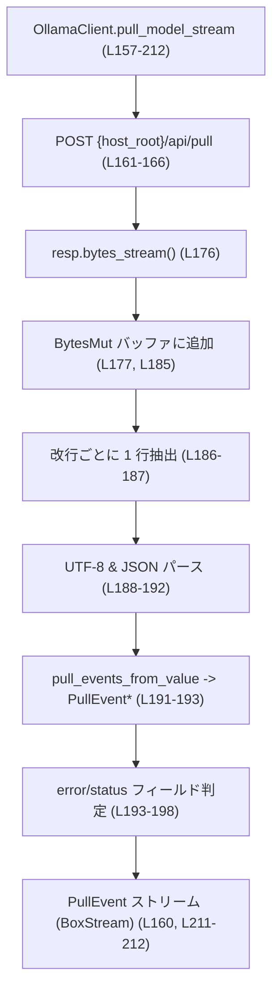

ollama/src/client.rs のコード解説です。

# ollama/src/client.rs コード解説

## 0. ざっくり一言

ローカルの Ollama サーバー（ネイティブ API / OpenAI 互換 API）に HTTP で接続し、  
モデル一覧取得・バージョン取得・モデルの pull（ストリーミング進捗付き）を行うクライアント実装です  
（`ollama/src/client.rs` 全体）。

---

## 1. このモジュールの役割

### 1.1 概要

このモジュールは **ローカルの Ollama サーバーと安全に対話するクライアント層** を提供します（`ollama/src/client.rs`）。

- `Config` に定義された「OSS プロバイダ」設定から `OllamaClient` を構築し、サーバー疎通確認を行います（L35-50, L59-78）。
- モデル一覧（`/api/tags`）とバージョン（`/api/version`）を取得します（L104-127, L130-153）。
- `/api/pull` に対するストリーミングレスポンスを行単位でパースして `PullEvent` のストリームとして公開し、  
  さらに `PullProgressReporter` を駆動する高レベル API を提供します（L157-212, L215-246）。

### 1.2 アーキテクチャ内での位置づけ

このファイルに現れる範囲での依存関係を示します（他モジュールの中身はこのチャンクでは不明です）。

```mermaid
graph TD
    subgraph "ollama/src/client.rs"
        OC["OllamaClient (L25-260)"]
    end

    CFG["Config (codex_core::config::Config)"]
    MPI["ModelProviderInfo (codex_model_provider_info)"]
    URLROOT["base_url_to_host_root (crate::url, L12参照)"]
    URLCOMP["is_openai_compatible_base_url (crate::url, L13参照)"]
    PEV["PullEvent (crate::pull, L10)"]
    PPR["PullProgressReporter (crate::pull, L11)"]
    PARSER["pull_events_from_value (crate::parser, L9)"]
    OLL_NATIVE["Ollama server /api/*"]
    OLL_OAI["Ollama server /v1/models (ヘルスチェック時)"]

    CFG -->|model_providers 経由| OC
    MPI --> OC
    URLROOT --> OC
    URLCOMP --> OC
    OC -->|GET /api/tags, /api/version, POST /api/pull| OLL_NATIVE
    OC -->|GET /v1/models (uses_openai_compat時のprobe)| OLL_OAI
    OC --> PARSER
    OC --> PEV
    OC --> PPR
```

- `OllamaClient` は **上位層**（設定・モデルプロバイダ情報）と **下位層**（Ollama HTTP API）との間のファサードとして機能します。
- pull ストリームの JSON 1 行を `pull_events_from_value` に渡して `PullEvent` 群に変換します（L191-193）。
- 進捗の購読側は `PullProgressReporter` トレイト越しに decoupling されています（L215-246）。

### 1.3 設計上のポイント

コードから読み取れる特徴は次の通りです。

- **責務分割**
  - `OllamaClient` は「HTTP クライアント + ベース URL + OpenAI 互換フラグ」の最小限の状態のみ保持します（L25-29）。
  - 構築ロジック（Config から、ModelProviderInfo から、テスト用 host_root から）をメソッドで分離しています（L35-50, L59-78, L250-260）。
  - pull のストリーミング処理を低レベル API（`pull_model_stream`）と高レベル API（`pull_with_reporter`）に分離しています（L157-212, L215-246）。

- **状態**
  - 内部状態は不変な `reqwest::Client`, `String`, `bool` のみで、メソッドはすべて `&self` でアクセスします（L25-29, L35, L59, L81, L104, L130, L157, L215）。  
    そのため、`OllamaClient` インスタンス自体はスレッド間で共有されることを想定した設計に見えますが、`Send`/`Sync` の実装の有無はこのファイルからは分かりません。

- **エラーハンドリング方針**
  - ネットワークや JSON パースのエラーは `io::Error::other(...)` にラップして `io::Result` で返しています（例: L87-90, L106-111, L131-137, L162-168, L220-221, L236-237）。
  - サーバーが動作していない場合のエラーメッセージは定数 `OLLAMA_CONNECTION_ERROR` に統一されています（L22, L87-90, L99-100）。
  - 一部の HTTP エラーは「エラーにはせず、空の結果として扱う」設計です（`fetch_models` の非 2xx → `Ok(Vec::new())`, L112-114 / `fetch_version` の非 2xx → `Ok(None)`, L138-140）。

- **並行性・非同期**
  - 主要な処理はすべて `async fn` で実装されており、`reqwest` の非同期 HTTP クライアントを利用しています（L35, L53, L59, L81, L104, L130, L157, L215）。
  - pull 処理は `async_stream::stream!` マクロを使い、`BoxStream<'static, PullEvent>` として外部に公開されます（L181-212, L160）。

- **安全性**
  - このファイル内に `unsafe` ブロックは存在せず（全体確認）、メモリ安全性は Rust の標準ルールに従っています。
  - `#![expect(clippy::expect_used)]` を関数内に記述し、`expect` の使用を lint レベルで許容している箇所があります（L60-64）。

---

## 2. コンポーネント一覧（インベントリー）

### 2.1 型・定数の一覧

| 名前 | 種別 | 可視性 | 役割 / 用途 | 定義箇所 |
|------|------|--------|------------|----------|
| `OLLAMA_CONNECTION_ERROR` | `&'static str` 定数 | モジュール内（`pub` なし） | サーバー未起動など接続エラー時に返す統一メッセージ | `ollama/src/client.rs:L22` |
| `OllamaClient` | 構造体 | `pub` | ローカル Ollama サーバーと対話するクライアント。HTTP クライアントとホスト情報を保持 | `ollama/src/client.rs:L25-29` |

### 2.2 メソッド・関数の一覧

> このファイルに定義される関数・メソッドのインベントリーです（テスト用も含む）。

| 名前 | 種別 | 可視性 | 概要 | 定義箇所 |
|------|------|--------|------|----------|
| `OllamaClient::try_from_oss_provider` | async メソッド | `pub` | `Config` の組み込み OSS プロバイダ設定からクライアントを構築し、サーバー疎通を検証 | `ollama/src/client.rs:L35-50` |
| `OllamaClient::try_from_provider_with_base_url` | async メソッド | `#[cfg(test)]`（テスト専用） | 任意の `base_url` を持つ OSS プロバイダからクライアントを構築（テスト補助） | `ollama/src/client.rs:L52-56` |
| `OllamaClient::try_from_provider` | async メソッド | `pub(crate)` | `ModelProviderInfo` からクライアントを構築し、サーバー疎通確認を実施 | `ollama/src/client.rs:L59-78` |
| `OllamaClient::probe_server` | async メソッド | モジュール内（`pub` なし） | `/api/tags` または `/v1/models` に GET してサーバーヘルスを確認 | `ollama/src/client.rs:L81-101` |
| `OllamaClient::fetch_models` | async メソッド | `pub` | `/api/tags` からモデル名一覧を取得 | `ollama/src/client.rs:L104-127` |
| `OllamaClient::fetch_version` | async メソッド | `pub` | `/api/version` からバージョン文字列を取得し `semver::Version` にパース | `ollama/src/client.rs:L130-153` |
| `OllamaClient::pull_model_stream` | async メソッド | `pub` | `/api/pull` を呼び出し、行区切り JSON を `PullEvent` ストリームに変換 | `ollama/src/client.rs:L157-212` |
| `OllamaClient::pull_with_reporter` | async メソッド | `pub` | `pull_model_stream` を消費しながら `PullProgressReporter` にイベントを通知 | `ollama/src/client.rs:L215-246` |
| `OllamaClient::from_host_root` | 関連関数 | `#[cfg(test)]`（テスト専用） | 任意の `host_root` 文字列からテスト用クライアントを構築（疎通確認なし） | `ollama/src/client.rs:L250-260` |
| `tests::test_fetch_models_happy_path` | テスト関数 | `#[tokio::test]` | `/api/tags` 正常レスポンスからモデル名が取り出せることを検証 | `ollama/src/client.rs:L270-298` |
| `tests::test_fetch_version` | テスト関数 | `#[tokio::test]` | `/api/version` のバージョン文字列が `Version(0,14,1)` にパースされることを検証 | `ollama/src/client.rs:L300-334` |
| `tests::test_probe_server_happy_path_openai_compat_and_native` | テスト関数 | `#[tokio::test]` | ネイティブ `/api/tags` と OpenAI 互換 `/v1/models` の両方で `probe_server` が成功することを検証 | `ollama/src/client.rs:L336-371` |
| `tests::test_try_from_oss_provider_ok_when_server_running` | テスト関数 | `#[tokio::test]` | サーバーが起動している場合にクライアント構築が成功することを検証 | `ollama/src/client.rs:L373-395` |
| `tests::test_try_from_oss_provider_err_when_server_missing` | テスト関数 | `#[tokio::test]` | サーバーが応答しない場合に `OLLAMA_CONNECTION_ERROR` が返ることを検証 | `ollama/src/client.rs:L397-413` |

---

## 3. 公開 API と詳細解説

### 3.1 型一覧

| 名前 | 種別 | 主要フィールド | 役割 / 用途 | 定義箇所 |
|------|------|----------------|-------------|----------|
| `OllamaClient` | 構造体 | `client: reqwest::Client`, `host_root: String`, `uses_openai_compat: bool` | ローカル Ollama サーバーへの HTTP クライアント。ヘルスチェック方法（ネイティブ / OpenAI 互換）を内部フラグで切り替える | `ollama/src/client.rs:L25-29` |

`OllamaClient` 自体は `pub` ですが、フィールドはすべて非公開です（L25-29）。インスタンスの生成は用意されたコンストラクタメソッド経由で行います。

---

### 3.2 主要関数の詳細

ここでは重要な 7 メソッドを詳しく説明します。

---

#### `OllamaClient::try_from_oss_provider(config: &Config) -> io::Result<Self>`

**概要**

組み込み OSS プロバイダ ID（`OLLAMA_OSS_PROVIDER_ID`）に対応する `ModelProviderInfo` を `Config` から取得し、その設定をもとに `OllamaClient` を構築します（L35-50）。  
サーバーへのヘルスチェックも同時に行い、到達不能な場合は分かりやすいエラーメッセージを返します。

**引数**

| 引数名 | 型 | 説明 |
|--------|----|------|
| `config` | `&Config` | モデルプロバイダ設定を含むアプリケーション設定（L35-41） |

**戻り値**

- `Ok(OllamaClient)`：OSS プロバイダが設定されており、ヘルスチェックに成功した場合。
- `Err(io::Error)`：
  - OSS プロバイダが `config.model_providers` に存在しない場合（`ErrorKind::NotFound`、L39-47）。
  - サーバーが起動していない、またはヘルスチェックに失敗した場合（`try_from_provider` 経由、L59-78）。

**内部処理の流れ**

1. `config.model_providers.get(OLLAMA_OSS_PROVIDER_ID)` で組み込み OSS プロバイダ設定を取得します（L39-41）。
2. 見つからなければ `io::ErrorKind::NotFound` でエラーを返します（L42-47）。
3. 見つかった場合はその `ModelProviderInfo` を `Self::try_from_provider` に渡します（L49-50）。
4. `try_from_provider` 内でクライアント構築とサーバー疎通確認が行われ、その結果をそのまま返します（L59-78）。

**例（使用例）**

```rust
// Config の取得方法はこのファイルからは分からないため、疑似コードとして記述します。
async fn build_client(config: &codex_core::config::Config) -> std::io::Result<OllamaClient> {
    // 組み込み OSS プロバイダ設定からクライアントを構築し、サーバー到達性も検証
    let client = OllamaClient::try_from_oss_provider(config).await?; // L35-50
    Ok(client)
}
```

**Errors / Panics**

- **Err になる条件**
  - `Config` に `OLLAMA_OSS_PROVIDER_ID` をキーとするプロバイダ定義が存在しない（L39-47）。
  - `try_from_provider` 内の疎通確認で `probe_server` が失敗した場合（L59-78, L81-101）。
- **panic の可能性**
  - `try_from_oss_provider` 自体は `expect` を使っておらず、panic はありません。

**Edge cases（エッジケース）**

- `Config` の `model_providers` に OSS プロバイダが未登録の場合、接続確認以前に `ErrorKind::NotFound` で失敗します（L39-47）。
- サーバーが起動していない場合でも、`Config` に設定さえあれば `try_from_provider` に進み、そこで共通のエラーメッセージ（`OLLAMA_CONNECTION_ERROR`）として返されます（L59-78, L87-90, L99-100, L22）。

**使用上の注意点**

- このメソッドは「サーバーが実際に到達可能かどうか」を確認するため、**起動時のヘルスチェック**として利用するのが自然です。
- `Config` に複数のプロバイダがあり、Ollama とは別のプロバイダを使いたい場合は、このメソッドではなく `try_from_provider` を直接使う必要があります（ただし `pub(crate)` のため同クレート内限定）。

---

#### `OllamaClient::try_from_provider(provider: &ModelProviderInfo) -> io::Result<Self>`

**概要**

任意の `ModelProviderInfo` から `OllamaClient` を構築し、サーバー疎通を検証します（L59-78）。  
`base_url` が存在しない場合は `expect` で panic します。

**引数**

| 引数名 | 型 | 説明 |
|--------|----|------|
| `provider` | `&ModelProviderInfo` | モデルプロバイダ設定。Ollama OSS プロバイダを想定（L59-64） |

**戻り値**

- `Ok(OllamaClient)`：`base_url` が設定されており、サーバー疎通が成功した場合。
- `Err(io::Error)`：サーバー疎通に失敗した場合（L76-77）。

**内部処理の流れ**

1. `provider.base_url.as_ref().expect("oss provider must have a base_url")` で `base_url` を取得します（L61-64）。
2. `is_openai_compatible_base_url(base_url)` で OpenAI 互換モードかどうかを判定し、`uses_openai_compat` に保存します（L65）。
3. `base_url_to_host_root(base_url)` でホストルート文字列を計算し `host_root` に保存します（L66）。
4. `reqwest::Client::builder()` に `connect_timeout`（5 秒）を設定して HTTP クライアントを構築し、ビルド失敗時は `reqwest::Client::new()` にフォールバックします（L67-71）。
5. 上記フィールドを使って `OllamaClient` インスタンスを作成します（L71-75）。
6. `client.probe_server().await?` を実行し、サーバー疎通確認を行います（L76）。
7. 問題なければ `Ok(client)` を返します（L77-78）。

**例（使用例）**

```rust
async fn build_from_provider(provider: &codex_model_provider_info::ModelProviderInfo)
    -> std::io::Result<OllamaClient>
{
    // 同じクレート内であれば pub(crate) メソッドを直接呼び出せる（L59-78）
    OllamaClient::try_from_provider(provider).await
}
```

**Errors / Panics**

- **Err になる条件**
  - `probe_server()` が非成功 HTTP ステータスまたは接続エラーを検出した場合、`io::Error::other(OLLAMA_CONNECTION_ERROR)` を返します（L76-77, L87-90, L99-100, L22）。
- **panic の可能性**
  - `provider.base_url` が `None` の場合、`expect("oss provider must have a base_url")` により panic します（L61-64）。
    - 関数内先頭に `#![expect(clippy::expect_used)]` があり、lint としては許容されています（L60）。

**Edge cases**

- `base_url` が `Some` であっても、内容が不正な URL である場合、`reqwest::Client::builder().build()` が失敗し、`Client::new()` にフォールバックします（L67-71）。  
  ただし、URL の妥当性は `probe_server` 実行時の HTTP リクエスト時に初めて検証されます。
- OpenAI 互換モードであれば、ヘルスチェックは `/v1/models` に対して行われますが（L82-84）、その他の API 呼び出し（`fetch_models` など）は常に `/api/...` を利用しています（L104-106, L131-132, L161）。

**使用上の注意点**

- `ModelProviderInfo` に正しく `base_url` が設定されていることが前提です。  
  そうでない場合は panic になるため、設定生成側で検証されている必要があります。
- このメソッドはクレート内限定（`pub(crate)`）なので、クレート外からは `try_from_oss_provider` を使います。

---

#### `OllamaClient::probe_server(&self) -> io::Result<()>`

**概要**

`uses_openai_compat` フラグに応じて適切なヘルスチェックエンドポイントに GET し、サーバーが到達可能かどうかを確認します（L81-101）。

**引数**

| 引数名 | 型 | 説明 |
|--------|----|------|
| `&self` | `&OllamaClient` | 内部の `host_root` と `uses_openai_compat` を利用（L81-86） |

**戻り値**

- `Ok(())`：HTTP レスポンスステータスが成功（`2xx`）の場合（L91-93）。
- `Err(io::Error)`：接続エラーまたは非成功ステータスの場合（L87-90, L94-100）。

**内部処理の流れ**

1. `uses_openai_compat` が `true` なら `"{host_root}/v1/models"`、そうでなければ `"{host_root}/api/tags"` をエンドポイント URL として構築します（L82-86）。
2. `self.client.get(url).send().await` を実行し、接続エラーの場合は `tracing::warn!` ログを出したうえで `io::Error::other(OLLAMA_CONNECTION_ERROR)` に変換します（L87-90, L22）。
3. HTTP ステータスが成功であれば `Ok(())` を返します（L91-93）。
4. 非成功ステータスの場合、`tracing::warn!` でステータスコードをログに出力し、同じ `OLLAMA_CONNECTION_ERROR` メッセージを返します（L94-100, L22）。

**例（使用例）**

```rust
async fn health_check(client: &OllamaClient) -> std::io::Result<()> {
    // 明示的にヘルスチェックだけを行いたい場合に使用（L81-101）
    client.probe_server().await
}
```

**Errors / Panics**

- **Err になる条件**
  - TCP 接続エラー、DNS 解決失敗などの送信エラー（L87-90）。
  - HTTP ステータスが `2xx` 以外の場合（L94-100）。
- panic はありません。

**Edge cases**

- 「接続できない」と「HTTP ステータスが bad」という 2 パターンを、どちらも同じ `OLLAMA_CONNECTION_ERROR` で表現するため、呼び出し側からは詳細な原因（ネットワークかアプリケーションか）は区別できません（L87-90, L94-100）。
- OpenAI 互換モードであっても、ヘルスチェック専用に `/v1/models` を使用しているだけで、その他の API 呼び出しはネイティブパス(`/api/...`)を利用します（L82-86, L104-106, L131-132, L161）。

**使用上の注意点**

- すでに `try_from_provider` / `try_from_oss_provider` の中で 1 度呼ばれる設計なので、起動時には二重に呼ぶ必要はありません。
- 詳細なエラー理由をログで取得したい場合は、`tracing` のログ出力（L87-90, L94-100）を参照する必要があります。

---

#### `OllamaClient::fetch_models(&self) -> io::Result<Vec<String>>`

**概要**

`/api/tags` エンドポイントからモデル一覧を取得し、`Vec<String>` として返します（L104-127）。  
非成功 HTTP ステータスの場合は「エラーではなく空ベクタ」を返す点が特徴です（L112-114）。

**引数**

| 引数名 | 型 | 説明 |
|--------|----|------|
| `&self` | `&OllamaClient` | `host_root` と `reqwest::Client` を使用（L104-111） |

**戻り値**

- `Ok(Vec<String>)`：
  - HTTP ステータスが成功の場合、JSON の `"models"` 配列中の `"name"` フィールドを抽出したベクタ（L115-126）。
  - HTTP ステータスが非成功の場合は空の `Vec`（L112-114）。
- `Err(io::Error)`：リクエスト送信エラー、JSON デコードエラー等（L106-111, L115）。

**内部処理の流れ**

1. `tags_url = "{host_root}/api/tags"` を構築します（L105）。
2. `self.client.get(tags_url).send().await` を実行し、エラーを `io::Error::other` にラップします（L106-111）。
3. `resp.status().is_success()` が `false` なら、`Ok(Vec::new())` を返します（L112-114）。
4. 成功ステータスの場合、`resp.json::<JsonValue>().await` で JSON を `serde_json::Value` にデコードします（L115）。
5. `val.get("models").and_then(|m| m.as_array())` で `"models"` 配列を取り出し、各要素から `"name"` フィールド文字列を抽出して `Vec<String>` に収集します（L116-124）。
6. `"models"` が存在しない、配列でない等の場合は `unwrap_or_default()` により空ベクタとなります（L125）。

**例（使用例）**

```rust
async fn list_models(client: &OllamaClient) -> std::io::Result<Vec<String>> {
    let models = client.fetch_models().await?; // L104-127
    // models が空の場合、「モデルなし」または「HTTP 非成功」を意味する
    Ok(models)
}
```

**Errors / Panics**

- **Err になる条件**
  - HTTP リクエスト送信エラー（接続エラーなど, L106-111）。
  - レスポンスボディの JSON パースエラー（L115）。
- panic はありません。

**Edge cases**

- HTTP ステータスが 4xx/5xx の場合でも `Err` ではなく `Ok(Vec::new())` を返します（L112-114）。  
  そのため、呼び出し側で「空ベクタかどうか」と「本当にモデルが 0 個なのか／サーバーエラーなのか」を区別できません。
- JSON の構造が変わり `"models"` が欠けていた場合や `"name"` が文字列でない場合も、単にそのエントリが無視されるか、空ベクタになります（L116-125）。
- モデル数が多い場合でも、全件をメモリ上の `Vec<String>` に保持します。ストリーミングではありません。

**使用上の注意点**

- 「モデルが 1 つもない」のと「HTTP エラー（非 2xx）」の両方が空ベクタにマッピングされるため、**エラーと正常な空** を区別したい場合は、必要に応じてヘルスチェック（`probe_server`）と併用する必要があります。
- 大量のモデル数を想定する場合、メモリ使用量が増える点に注意が必要です（ただし通常の使用では問題にならないと考えられます）。

---

#### `OllamaClient::fetch_version(&self) -> io::Result<Option<Version>>`

**概要**

`/api/version` から Ollama のバージョン情報を取得し、`semver::Version` にパースして返します（L130-153）。  
取得・パースに失敗した場合も `Err` ではなく `Ok(None)` を返す設計です（L138-140, L142-144, L146-151）。

**引数**

| 引数名 | 型 | 説明 |
|--------|----|------|
| `&self` | `&OllamaClient` | `host_root` と HTTP クライアントを使用（L130-137） |

**戻り値**

- `Ok(Some(Version))`：成功時。`"version"` フィールドが semver として正しくパースできた場合（L141-148）。
- `Ok(None)`：
  - HTTP ステータスが非成功の場合（L138-140）。
  - JSON に `"version"` フィールドが存在しないか文字列でない場合（L142-144）。
  - バージョン文字列が semver としてパースできなかった場合（L146-151）。
- `Err(io::Error)`：HTTP リクエストエラーまたは JSON パースエラー（L131-137, L141）。

**内部処理の流れ**

1. `version_url = "{host_root}/api/version"` を構築します（L131）。
2. `self.client.get(version_url).send().await` を実行し、送信エラーを `io::Error::other` にラップします（L132-137）。
3. ステータスが非成功なら `Ok(None)` を返します（L138-140）。
4. JSON を `JsonValue` として読み込みます（L141）。
5. `val.get("version").and_then(|v| v.as_str()).map(str::trim)` で `"version"` フィールドの文字列を取り出します（L142-143）。
   - 見つからなければ `Ok(None)` を返します（L143-144）。
6. 先頭の `'v'` を削除して正規化（例: `"v0.14.1"` → `"0.14.1"`）し、`Version::parse()` に渡します（L145-147）。
7. パース成功なら `Ok(Some(version))`、失敗なら警告ログを出して `Ok(None)` を返します（L146-151）。

**例（使用例）**

```rust
async fn print_version(client: &OllamaClient) -> std::io::Result<()> {
    if let Some(v) = client.fetch_version().await? { // L130-153
        println!("Ollama version: {}", v);
    } else {
        println!("Ollama version is unavailable");
    }
    Ok(())
}
```

**Errors / Panics**

- **Err になる条件**
  - HTTP リクエスト送信エラー（L132-137）。
  - JSON デコードエラー（L141）。
- panic はありません。

**Edge cases**

- サーバーが古いバージョンで `"version"` フィールドが無い場合は `Ok(None)` となります（L142-144）。
- `"v0.14.1"` のようなプレフィックス付き表現も `trim_start_matches('v')` により正しく扱います（L145）。
- `"version": "not-semver"` のように semver 形式でない場合、警告ログを出しつつ `Ok(None)` を返します（L146-151）。

**使用上の注意点**

- バージョンが取得できない理由（HTTP エラー／フィールド欠如／パースエラー）はすべて `None` に畳み込まれているため、詳細を知りたい場合はログ（`tracing::warn!`）の参照が必要です（L149-150）。
- バージョン情報はあくまでオプショナルであり、機能要件として必須ではない設計になっています。

---

#### `OllamaClient::pull_model_stream(&self, model: &str) -> io::Result<BoxStream<'static, PullEvent>>`

**概要**

`/api/pull` に対してストリーミング POST リクエストを行い、レスポンスの **行区切り JSON** をパースして `PullEvent` の非同期ストリームとして公開します（L157-212）。  
ストリームは、`PullEvent::Success` が出現するか、エラー／接続終了が発生した時点で終端します。

**引数**

| 引数名 | 型 | 説明 |
|--------|----|------|
| `&self` | `&OllamaClient` | `host_root` と HTTP クライアントを使用（L157-168） |
| `model` | `&str` | pull 対象モデル名（JSON ボディの `"model"` フィールドとして送信, L161-166） |

**戻り値**

- `Ok(BoxStream<'static, PullEvent>)`：pull が正常に開始し、レスポンスのステータスが成功の場合（L169-174, L211-212）。
- `Err(io::Error)`：
  - HTTP リクエスト送信エラー（L162-168）。
  - レスポンスステータスが非成功の場合（L169-173）。

ストリーム自体は `PullEvent` の列であり、その中に `PullEvent::Error` が含まれる場合があります（L193-196）。

**内部処理の流れ（アルゴリズム）**

1. `url = "{host_root}/api/pull"` を構築します（L161）。
2. `POST` リクエストを行い、ボディとして `{"model": model, "stream": true}` の JSON を送信します（L162-166）。
3. レスポンス送信エラーは `io::Error::other` にラップして即座に返します（L162-168）。
4. ステータスが非成功なら `"failed to start pull: HTTP {status}"` というメッセージの `io::Error` を返します（L169-173）。
5. 成功時には `resp.bytes_stream()` を取得し、`stream.next().await` でチャンクを逐次読み出します（L176-183）。
6. 各チャンク（`bytes`）を `BytesMut` バッファ `buf` に追加し、改行 (`b'\n'`) を探します（L177, L185-187）。
7. 改行が見つかるたびに `buf.split_to(pos + 1)` で 1 行分のバイト列を取り出し、UTF-8 文字列に変換します（L187-189）。
8. 文字列を `trim()` し、空行はスキップします（L189-190）。
9. `serde_json::from_str::<JsonValue>(text)` で 1 行を JSON としてパースし、成功した場合:
   - `pull_events_from_value(&value)` を呼び出して得られた `PullEvent` をすべて `yield` します（L191-193）。
   - `value["error"]` が文字列なら `PullEvent::Error(err_msg.to_string())` を `yield` して即座に `return` し、ストリームを終了します（L193-196）。
   - `value["status"] == "success"` なら `PullEvent::Success` を `yield` して `return` します（L197-198）。
10. チャンク取得時に `Err(_)` が発生した場合、「Connection error: end the stream.」というコメントとともにループを `return` します（L203-206）。
11. `async_stream::stream!` 全体を `Box::pin` して `BoxStream` として返します（L181-212）。

**Mermaid（pull 処理のデータフロー）**



**例（使用例）**

```rust
use futures::StreamExt; // pull_model_stream は Stream を返す（L157-212）

async fn pull_and_log(client: &OllamaClient, model: &str) -> std::io::Result<()> {
    let mut stream = client.pull_model_stream(model).await?; // L157-212

    while let Some(event) = stream.next().await {
        // PullEvent のバリアント詳細はこのファイルには出てこないが、
        // 少なくとも Success / Error / ChunkProgress / Status を想定できる（L225-240）
        println!("pull event: {:?}", event);
    }

    Ok(())
}
```

**Errors / Panics**

- **Err になる条件（関数自体）**
  - HTTP リクエスト送信時のエラー（L162-168）。
  - レスポンスステータスが 2xx 以外（L169-173）。
- **ストリーム中の挙動**
  - ストリーム取得後のネットワークエラーは `Err(_) => return` 分岐により「ストリームが終わるだけ」で、`PullEvent::Error` には変換されません（L203-206）。
- panic はありません。

**Edge cases**

- サーバーが **改行を出力しない** 場合、`buf.iter().position(|b| *b == b'\n')` が見つからず、バッファが伸び続けます（L186-187）。  
  最終的に接続が閉じられればストリームは終了しますが、メモリ使用量増加の可能性があります。
- UTF-8 でない行や JSON として不正な行は、単に無視されます（`from_utf8` や `from_str` が失敗した場合、何も yield しない, L188-192）。
- `value["error"]` や `value["status"]` が文字列でない場合は無視されます（`and_then(|e| e.as_str())` による, L193-198）。
- `PullEvent::Error` を `yield` した後は即座にストリームが終了する設計のため、後続の情報は取得できません（L193-196）。

**使用上の注意点**

- `pull_model_stream` 自体は **エラーイベントを `io::Error` に変換しません**。  
  アプリケーションレベルのエラーは `PullEvent::Error` としてストリーム内に現れます（L193-196）。
- ストリームは `'static` ライフタイムの `BoxStream` として返されるため、`tokio::spawn` など別タスクに渡して消費することも可能です（実際の `Send`/`Sync` 制約はこのファイルからは不明）。
- 途中でストリームが終わった場合（ネットワークエラーなど）に `Err` は返らず、単に `None` になるだけなので、呼び出し側で「終端条件」を明確に扱う必要があります。  
  高レベル API `pull_with_reporter` はこの点を補っており、「Success を見ないまま終端したら `Err`」としています（L222-245）。

---

#### `OllamaClient::pull_with_reporter(&self, model: &str, reporter: &mut dyn PullProgressReporter) -> io::Result<()>`

**概要**

`pull_model_stream` のラッパーとして、発生した `PullEvent` を `PullProgressReporter` に通知しながらモデルの pull を実行し、  
成功時は `Ok(())`、エラー時や異常終端時には `Err` を返す高レベルヘルパです（L215-246）。

**引数**

| 引数名 | 型 | 説明 |
|--------|----|------|
| `&self` | `&OllamaClient` | pull の発行元クライアント（L215-221） |
| `model` | `&str` | pull 対象モデル名（L216-217, L220-221） |
| `reporter` | `&mut dyn PullProgressReporter` | 進捗・ステータスを通知するレポーター（L217-219, L220, L223） |

**戻り値**

- `Ok(())`：`PullEvent::Success` を受信した場合（L225-227）。
- `Err(io::Error)`：
  - `pull_model_stream` の初期化エラー（L221）。
  - `reporter.on_event(...)` がエラーを返した場合（L220, L223）。
  - `PullEvent::Error(err)` を受信した場合（L228-237）。
  - ストリームが `Success` も `Error` も出さずに終了した場合（L242-245）。

**内部処理の流れ**

1. 最初に `PullEvent::Status(format!("Pulling model {model}..."))` をレポーターに送信します（L220）。
2. `pull_model_stream(model).await?` を呼び出して `BoxStream<PullEvent>` を取得します（L221）。
3. `while let Some(event) = stream.next().await` でストリームを 1 つずつ消費します（L222-223）。
4. 各イベントをそのまま `reporter.on_event(&event)?` に渡します（L223）。
5. イベントに応じて分岐します（L224-241）:
   - `PullEvent::Success`：`Ok(())` を返して終了（L225-227）。
   - `PullEvent::Error(err)`：`Err(io::Error::other(format!("Pull failed: {err}")))` を返して終了（L228-237）。
   - `PullEvent::ChunkProgress { .. }` または `PullEvent::Status(_)`：何もせずループ継続（L238-240）。
6. ストリームが `None`（終端）になった場合、`Err(io::Error::other("Pull stream ended unexpectedly without success."))` を返します（L242-245）。

**Mermaid（データフロー / 呼び出し図）**

```mermaid
sequenceDiagram
    participant App as 呼び出し側
    participant OC as OllamaClient.pull_with_reporter (L215-246)
    participant S as OllamaClient.pull_model_stream (L157-212)
    participant HTTP as Ollama /api/pull
    participant R as PullProgressReporter

    App->>OC: pull_with_reporter(model, reporter)
    OC->>R: on_event(Status("Pulling model {model}...")) (L220)
    OC->>S: pull_model_stream(model) (L221)
    S->>HTTP: POST /api/pull {"model": model, "stream": true} (L161-166)
    HTTP-->>S: 200 OK + chunked JSON lines (L169, L176)
    loop 各 PullEvent
        S-->>OC: PullEvent (L191-193)
        OC->>R: on_event(event) (L223)
        alt Success
            OC-->>App: Ok(()) (L225-227)
            break
        else Error(err)
            OC-->>App: Err("Pull failed: {err}") (L228-237)
            break
        else ChunkProgress/Status
            Note right of OC: 継続 (L238-240)
        end
    end
    alt Success を見ずに終了
        OC-->>App: Err("Pull stream ended unexpectedly without success.") (L242-245)
    end
```

**例（使用例）**

```rust
use crate::pull::PullProgressReporter; // 実際のパスはこのファイルから逆参照（L11）

struct StdoutReporter;

impl PullProgressReporter for StdoutReporter {
    fn on_event(&mut self, event: &crate::pull::PullEvent) -> std::io::Result<()> {
        println!("{:?}", event);
        Ok(())
    }
}

async fn pull_model_with_progress(client: &OllamaClient, model: &str) -> std::io::Result<()> {
    let mut reporter = StdoutReporter;
    client.pull_with_reporter(model, &mut reporter).await // L215-246
}
```

**Errors / Panics**

- **Err になる条件**
  - `reporter.on_event` が `Err` を返した場合（最初のステータス送信時および各イベント時, L220, L223）。
  - `pull_model_stream` 初期化エラー（HTTP ステータス非成功など, L221）。
  - `PullEvent::Error(err)` 受信（`Pull failed: {err}` というメッセージ, L228-237）。
  - ストリームが `Success` を出さずに終端した場合（L242-245）。
- panic はありません。

**Edge cases**

- サーバーが何らかの理由でストリームを切断し、`PullEvent::Success` も `PullEvent::Error` も送らずに終わった場合、  
  `"Pull stream ended unexpectedly without success."` というエラーメッセージになります（L242-245）。
- `PullEvent::Error` が複数回送信されるケースは、このコードでは最初の 1 つだけが `Err` として扱われ（即座に return）、後続は読みません（L228-237）。

**使用上の注意点**

- 正常終了は **必ず `PullEvent::Success` を通過する** ことが前提になっています（L224-227, L242-245）。
- アプリケーション側が独自に `PullEvent` を解釈する必要がない場合は、`pull_model_stream` ではなくこのメソッドを使う方が安全です（エラー条件の取りこぼしを防げます）。
- `PullProgressReporter` の実装が I/O（ファイル書き込みなど）を行う場合、高頻度のイベントでパフォーマンスに注意が必要です。

---

#### `OllamaClient::from_host_root(host_root: impl Into<String>) -> Self`（テスト専用）

**概要**

任意の `host_root` を指定して `OllamaClient` を構築する低レベルコンストラクタで、  
`probe_server` による疎通確認を行わないテスト用ユーティリティです（L248-260）。

**ポイント**

- `connect_timeout(5 秒)` を設定した `reqwest::Client` を生成する点は `try_from_provider` と同様です（L251-254, L67-70）。
- `uses_openai_compat` は常に `false` として初期化されます（L255-259）。
- `#[cfg(test)]` が付いており、プロダクションコードからは利用されません（L249-250）。

---

### 3.3 その他の関数（テスト）

テスト関数は挙動確認用ですが、仕様の把握にも役立つため、簡単に役割をまとめます。

| 関数名 | 役割（1 行） | 根拠 |
|--------|--------------|------|
| `test_fetch_models_happy_path` | モックサーバーの `/api/tags` レスポンスからモデル名が取得できることを確認 | `ollama/src/client.rs:L270-298` |
| `test_fetch_version` | `/api/version` の `"version": "0.14.1"` が `Version(0,14,1)` にパースされることを確認 | `ollama/src/client.rs:L300-334` |
| `test_probe_server_happy_path_openai_compat_and_native` | ネイティブ `/api/tags` と OpenAI 互換 `/v1/models` の両方で `probe_server` が成功することを確認 | `ollama/src/client.rs:L336-371` |
| `test_try_from_oss_provider_ok_when_server_running` | `/v1/models` が 200 を返す場合に `try_from_provider_with_base_url` が成功することを確認 | `ollama/src/client.rs:L373-395` |
| `test_try_from_oss_provider_err_when_server_missing` | モックサーバーに `/v1/models` レスポンスを用意しない場合に `OLLAMA_CONNECTION_ERROR` が返ることを確認 | `ollama/src/client.rs:L397-413` |

---

## 4. データフロー

ここでは、代表的なシナリオとして「モデル pull の進捗表示付き実行」のデータフローを説明します。

1. アプリケーションが `OllamaClient::pull_with_reporter(model, reporter)` を呼び出す（L215-219）。
2. `pull_with_reporter` が最初のステータスメッセージを `reporter` に送信する（L220）。
3. `pull_model_stream` を呼び出して `/api/pull` POST を開始し、レスポンスストリームを `PullEvent` に変換するストリームを受け取る（L221, L157-212）。
4. `pull_with_reporter` はストリームからイベントを逐次取り出し、毎回 `reporter.on_event(&event)` を呼ぶ（L222-223）。
5. `PullEvent::Success` であれば成功として終了、`PullEvent::Error` であればエラーとして終了します（L225-237）。
6. それ以外のイベント（進捗・ステータス）は通知後にループを継続します（L238-240）。
7. ストリーム終端まで `Success` が来なければエラーとして扱います（L242-245）。

この流れを sequence diagram で示します（再掲）。

```mermaid
sequenceDiagram
    participant App as 呼び出し側
    participant OC as OllamaClient.pull_with_reporter (L215-246)
    participant S as OllamaClient.pull_model_stream (L157-212)
    participant HTTP as Ollama /api/pull
    participant R as PullProgressReporter

    App->>OC: pull_with_reporter(model, reporter)
    OC->>R: on_event(Status("Pulling model {model}...")) (L220)
    OC->>S: pull_model_stream(model) (L221)
    S->>HTTP: POST /api/pull {"model": model, "stream": true} (L161-166)
    HTTP-->>S: 200 OK + chunked JSON lines
    loop 各 PullEvent
        S-->>OC: PullEvent (L191-193)
        OC->>R: on_event(event) (L223)
        alt Success
            OC-->>App: Ok(()) (L225-227)
            break
        else Error(err)
            OC-->>App: Err("Pull failed: {err}") (L228-237)
            break
        else ChunkProgress/Status
            Note right of OC: 継続 (L238-240)
        end
    end
    alt Success を見ずに終了
        OC-->>App: Err("Pull stream ended unexpectedly without success.") (L242-245)
    end
```

---

## 5. 使い方（How to Use）

### 5.1 基本的な使用方法

典型的なフローは「クライアント構築 → モデル一覧やバージョン取得 → モデル pull」です。

```rust
use std::io;
use futures::StreamExt;

async fn main_flow(config: &codex_core::config::Config) -> io::Result<()> {
    // 1. クライアント構築（Config から組み込み OSS プロバイダを検索, L35-50, L59-78）
    let client = OllamaClient::try_from_oss_provider(config).await?;

    // 2. モデル一覧取得（L104-127）
    let models = client.fetch_models().await?;
    println!("Available models: {:?}", models);

    // 3. バージョン取得（L130-153）
    if let Some(version) = client.fetch_version().await? {
        println!("Ollama version: {}", version);
    }

    // 4. モデル pull（高レベル API, L215-246）
    struct SimpleReporter;
    impl crate::pull::PullProgressReporter for SimpleReporter {
        fn on_event(&mut self, ev: &crate::pull::PullEvent) -> io::Result<()> {
            println!("{:?}", ev);
            Ok(())
        }
    }

    let mut reporter = SimpleReporter;
    client.pull_with_reporter("llama3.2:3b", &mut reporter).await?;

    Ok(())
}
```

※ `Config` の生成方法や `PullProgressReporter` の実装詳細はこのファイルには含まれないため、上記はあくまでパターン例です。

### 5.2 よくある使用パターン

1. **起動時ヘルスチェック**

   ```rust
   async fn health_check_only(client: &OllamaClient) -> io::Result<()> {
       client.probe_server().await // L81-101
   }
   ```

2. **ストリームを直接扱う（独自 UI 実装など）**

   ```rust
   use futures::StreamExt;

   async fn pull_with_custom_handling(client: &OllamaClient, model: &str) -> io::Result<()> {
       let mut stream = client.pull_model_stream(model).await?; // L157-212
       while let Some(event) = stream.next().await {
           match event {
               crate::pull::PullEvent::ChunkProgress { .. } => {
                   // プログレスバーを更新するなど
               }
               crate::pull::PullEvent::Status(msg) => {
                   println!("status: {}", msg);
               }
               crate::pull::PullEvent::Error(err) => {
                   eprintln!("pull error: {}", err);
                   break;
               }
               crate::pull::PullEvent::Success => {
                   println!("pull succeeded");
                   break;
               }
           }
       }
       Ok(())
   }
   ```

### 5.3 よくある間違い

```rust
// 間違い例: サーバー疎通を確認せずに from_host_root を使う（テスト専用, L250-260）
// 実運用で使用すると、起動時にサーバーが落ちていても検知できない。
#[cfg(test)]
fn create_client_wrong() -> OllamaClient {
    OllamaClient::from_host_root("http://localhost:11434")
}

// 正しい例: try_from_oss_provider / try_from_provider を使い、probe_server を通す（L35-50, L59-78）
async fn create_client_correct(config: &codex_core::config::Config) -> io::Result<OllamaClient> {
    OllamaClient::try_from_oss_provider(config).await
}
```

```rust
// 間違い例: pull_model_stream の終了条件を Success かどうか確認せずに無視する
async fn pull_without_check(client: &OllamaClient, model: &str) -> io::Result<()> {
    let mut stream = client.pull_model_stream(model).await?;
    while let Some(_event) = stream.next().await {
        // 何もしない
    }
    // ここで Ok(()) を返すと、途中でエラー終了しても成功と見なしてしまう
    Ok(())
}

// 正しい例: Success / Error の有無に応じて結果を判定する（pull_with_reporter と同様のロジック, L215-246）
async fn pull_with_result_check(client: &OllamaClient, model: &str) -> io::Result<()> {
    let mut stream = client.pull_model_stream(model).await?;
    use crate::pull::PullEvent;
    while let Some(event) = stream.next().await {
        match event {
            PullEvent::Success => return Ok(()),
            PullEvent::Error(err) => return Err(io::Error::other(format!("Pull failed: {err}"))),
            _ => continue,
        }
    }
    Err(io::Error::other(
        "Pull stream ended unexpectedly without success.",
    ))
}
```

### 5.4 使用上の注意点（まとめ）

- `try_from_provider` は `base_url` が `Some` であることを前提に `expect` を使うため、設定生成時に検証されている必要があります（L61-64）。
- 一部の API は「HTTP エラーでも `Err` にせず Option/空ベクタに畳み込む」挙動をとるため、呼び出し側で「値がない」ことと「エラー」を区別したい場合は、ヘルスチェックやログの確認が必要です（L112-114, L138-140, L142-144, L146-151）。
- pull ストリームは `PullEvent::Error` を自動的に `io::Error` に変換せず、ストリーム内イベントとして扱います（L193-196）。  
  高レベルヘルパ `pull_with_reporter` ではこれを `Err` に変換してくれます（L228-237）。
- 非同期処理のため、`tokio` などの async ランタイム上で使用する必要があります（テストは `#[tokio::test]` を使用, L269, L300, L337, L373, L397）。

---

## 6. 変更の仕方（How to Modify）

### 6.1 新しい機能を追加する場合

例として「モデル削除 API（`/api/delete` など）」を追加するケースを考えます。

1. **このファイルにメソッドを追加**
   - `impl OllamaClient` ブロック（L31-261）の中に `pub async fn delete_model(&self, model: &str) -> io::Result<()>` のようなメソッドを追加します。
   - URL の構築は既存メソッドと同様 `format!("{}/api/...", self.host_root.trim_end_matches('/'))` を踏襲すると一貫性があります（L105, L131, L161）。

2. **エラーハンドリング方針を決める**
   - HTTP 非成功を `Err` にするのか、`Ok(false)` のように畳み込むのか、既存メソッド（`fetch_models`, `fetch_version`）の方針を参考に統一します。

3. **ストリーミングが必要な場合**
   - `pull_model_stream` の実装（L157-212）を参考に、`BytesMut` と `async_stream::stream!` を使った行区切り JSON パースを再利用するとよいです。

4. **テストを追加**
   - `tests` モジュール（L263-414）内に `wiremock` を用いたモックサーバーテストを追加し、正常系・異常系を検証します（既存テスト参照）。

### 6.2 既存の機能を変更する場合

変更時に重要となる契約や影響範囲を整理します。

- **`try_from_provider` の契約**
  - 現状: `base_url` 欠如で `panic`。これを `Err` に変えたい場合、呼び出し側（`try_from_oss_provider` やテスト）にも影響が及びます（L35-50, L59-78）。
  - 変更後は `io::Result` でエラーを表現するようにして、`try_from_oss_provider` からも適切なエラーに変換する必要があります。

- **`fetch_models` / `fetch_version` の戻り値意味**
  - 非成功 HTTP を空ベクタ / None にしている点（L112-114, L138-140）は既存コードに依存している可能性があります。  
    これを `Err` に変更する場合は、全呼び出し側でハンドリングを見直す必要があります。

- **`pull_model_stream` のフォーマット**
  - 改行区切り JSON という前提（L185-191）を変える場合、`pull_events_from_value` とのインターフェースや他のモジュールにも影響します。
  - また、`error` / `status` フィールドの扱いを変更すると `pull_with_reporter` の成功/失敗判定（L224-241）も更新が必要です。

- **関連するテストの更新**
  - 仕様変更に応じて `tests` モジュール内の期待値やモックレスポンスを更新する必要があります（L270-413）。
  - 特に `OLLAMA_CONNECTION_ERROR` のメッセージを変更する場合、`test_try_from_oss_provider_err_when_server_missing` の `assert_eq!` に影響します（L407-413）。

---

## 7. 関連ファイル

このモジュールと密接に関係する他ファイル（シンボル名から推測される範囲）は次の通りです。  
※ 実際の内容はこのチャンクには現れないため「不明」と記載します。

| パス / シンボル | 役割 / 関係（このファイルから分かる範囲） |
|-----------------|-------------------------------------------|
| `crate::parser::pull_events_from_value` | pull API の 1 行 JSON から `PullEvent` 群を生成する関数（L9, L191-193）。具体的な JSON スキーマはこのチャンクには現れません。 |
| `crate::pull::PullEvent` | pull ストリームでやり取りされるイベント型。少なくとも `Success`, `Error(String)`, `ChunkProgress{..}`, `Status(String)` バリアントが存在すると推測できますが、定義はこのチャンクには現れません（L10, L192-196, L224-240）。 |
| `crate::pull::PullProgressReporter` | `on_event(&PullEvent) -> io::Result<()>` を持つと推測されるトレイト。進捗通知用（L11, L217-223）。メソッドシグネチャの詳細はこのチャンクには現れませんが、`reporter.on_event(&event)?;` から `io::Result<()>` であることが分かります。 |
| `crate::url::base_url_to_host_root` | プロバイダの `base_url` から `host_root` を抽出するヘルパ（L12, L66）。OpenAI 互換 `/v1` プレフィックスの切り落とし方などはこのチャンクには現れません。 |
| `crate::url::is_openai_compatible_base_url` | `base_url` が OpenAI 互換 API（`/v1/...`）かどうかを判定する関数（L13, L65）。具体的な判定ロジックは不明です。 |
| `codex_core::config::Config` | モデルプロバイダ設定を含むアプリ設定（L14, L35-41）。`model_providers` の具体的な型はこのチャンクには現れませんが、少なくとも `get(OLLAMA_OSS_PROVIDER_ID)` メソッドを持つ連想配列のような構造であることが分かります。 |
| `codex_model_provider_info::ModelProviderInfo` | モデルプロバイダの情報（L15, L59-64）。`base_url: Option<String>` フィールドを持つことが分かりますが、それ以外のフィールドはこのチャンクには現れません。 |
| `codex_model_provider_info::create_oss_provider_with_base_url` | テスト用に任意の `base_url` を持つ OSS プロバイダ定義を生成するファクトリ関数（L20, L53-55）。実装はこのチャンクには現れません。 |

---

## Bugs / Security / Contracts / Edge Cases の補足

### 潜在的なバグ・注意点（コードから推測できる範囲）

- `pull_model_stream` の `_pending: VecDeque<PullEvent>` は未使用です（L178）。これは実装途中の名残と思われますが、現状の動作には影響しません。
- pull ストリームで改行が一切来ない場合、`BytesMut` が増え続ける可能性があります（L185-187）。  
  ただし、これは Ollama サーバーが行区切り JSON を返すという前提が崩れた場合の話です。
- `try_from_provider` が `base_url` の欠如を `panic` で処理しているため（L61-64）、設定生成側での検証が不十分だとクラッシュの原因になります。

### セキュリティ観点

- URL は `format!` で文字列連結しており、ホスト名やスキーム自体の妥当性は上位の設定に依存します（L82-86, L105, L131, L161）。  
  このファイル内には、URL のホワイトリストチェックや TLS 強制といった追加のセキュリティ制御はありません。
- `model` 名は JSON ボディとして送信されるため（L162-166）、HTTP レベルでのインジェクションの心配は低いですが、Ollama サーバー側での取り扱いには依存します。

### Contracts（暗黙の契約）

- `PullEvent::Success` が「pull 成功の唯一のシグナル」として扱われています（L224-227, L242-245）。
- `fetch_models` が「非 2xx HTTP → 空ベクタ」を返す契約を持っているため、呼び出し側が「空 = エラーの可能性あり」と理解している前提があります（L112-114）。
- `fetch_version` が「パース不能やフィールド欠如 → `None`」を返す契約により、「バージョン情報は必須ではない」設計になっています（L138-140, L142-144, L146-151）。

### テストによる保証

- モックサーバーと `wiremock` を用いたテストにより、主要なハッピーパスとエラーパスが検証されています（L270-413）。
  - モデル一覧・バージョン取得の JSON パース（L270-298, L300-334）。
  - ネイティブと OpenAI 互換エンドポイントでのヘルスチェック（L336-371）。
  - サーバー起動 / 未起動時の `try_from_provider_with_base_url` の挙動（L373-395, L397-413）。

---

以上が `ollama/src/client.rs` の公開 API・コアロジック・データフロー・エラー挙動・並行性に関する整理です。
